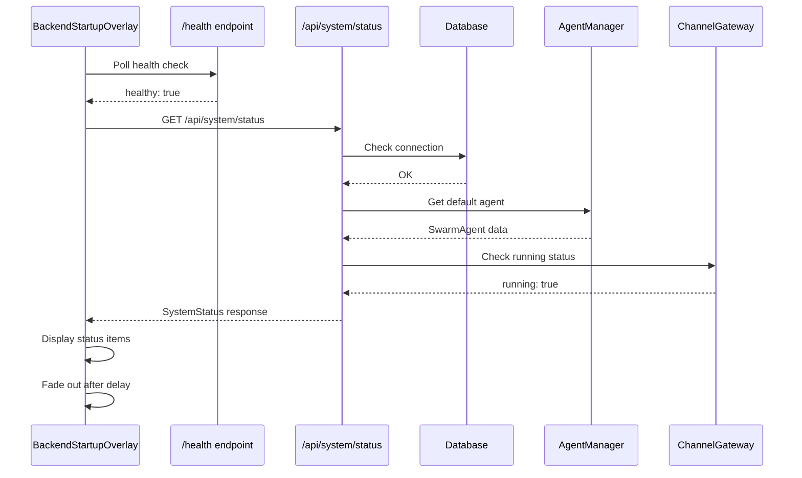
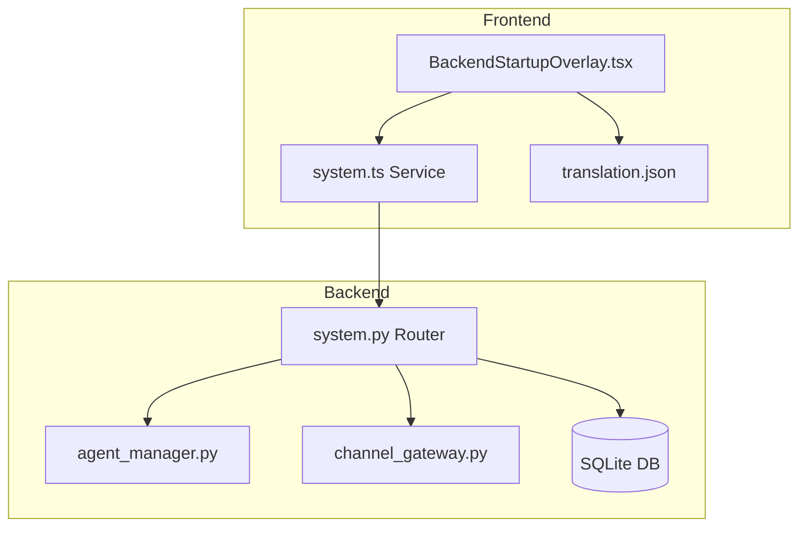

# Design Document: SwarmAgent Initialization Status Display

## Overview

This feature enhances the SwarmAI desktop application's startup experience by displaying detailed initialization status on the BackendStartupOverlay (splash screen). The implementation follows a simple client-server architecture where a new backend API endpoint provides system status information, and the existing startup overlay component is enhanced to display this information in a CLI-like format.

The design prioritizes:
- **Non-blocking startup**: Status display should not delay app startup
- **Graceful degradation**: App should start even if status fetch fails
- **Familiar UX**: CLI-style output that developers recognize
- **Internationalization**: All text translatable

## Architecture



### Component Architecture



## Components and Interfaces

### Backend: System Router (`backend/routers/system.py`)

New FastAPI router that provides system status information.

```python
from fastapi import APIRouter
from pydantic import BaseModel
from typing import Optional
from datetime import datetime

router = APIRouter()

class DatabaseStatus(BaseModel):
    healthy: bool
    error: Optional[str] = None

class AgentStatus(BaseModel):
    ready: bool
    name: Optional[str] = None
    skills_count: int = 0
    mcp_servers_count: int = 0

class ChannelGatewayStatus(BaseModel):
    running: bool

class SystemStatusResponse(BaseModel):
    database: DatabaseStatus
    agent: AgentStatus
    channel_gateway: ChannelGatewayStatus
    initialized: bool
    timestamp: str

@router.get("/status", response_model=SystemStatusResponse)
async def get_system_status() -> SystemStatusResponse:
    """Get current system initialization status."""
    # Implementation checks each component
    pass
```

### Frontend: System Service (`desktop/src/services/system.ts`)

TypeScript service for fetching system status with camelCase conversion.

```typescript
interface DatabaseStatus {
  healthy: boolean;
  error?: string;
}

interface AgentStatus {
  ready: boolean;
  name?: string;
  skillsCount: number;
  mcpServersCount: number;
}

interface ChannelGatewayStatus {
  running: boolean;
}

export interface SystemStatus {
  database: DatabaseStatus;
  agent: AgentStatus;
  channelGateway: ChannelGatewayStatus;
  initialized: boolean;
  timestamp: string;
}

export const systemService = {
  async getStatus(): Promise<SystemStatus> {
    // Fetch and convert snake_case to camelCase
  }
};
```

### Frontend: Enhanced BackendStartupOverlay

The existing component will be enhanced to:
1. Fetch system status after health check succeeds
2. Display initialization steps with CLI-style formatting
3. Show sequential animation of status items appearing

```typescript
interface InitStep {
  id: string;
  labelKey: string;  // i18n key
  status: 'pending' | 'success' | 'error';
  error?: string;
  children?: InitStep[];
}
```

## Data Models

### API Response (Backend - snake_case)

```json
{
  "database": {
    "healthy": true,
    "error": null
  },
  "agent": {
    "ready": true,
    "name": "SwarmAgent",
    "skills_count": 3,
    "mcp_servers_count": 2
  },
  "channel_gateway": {
    "running": true
  },
  "initialized": true,
  "timestamp": "2024-01-15T10:30:00.000Z"
}
```

### Frontend State (camelCase)

```typescript
interface InitializationState {
  phase: 'connecting' | 'fetching' | 'complete' | 'error';
  steps: InitStep[];
  systemStatus: SystemStatus | null;
}
```


## Correctness Properties

*A property is a characteristic or behavior that should hold true across all valid executions of a system—essentially, a formal statement about what the system should do. Properties serve as the bridge between human-readable specifications and machine-verifiable correctness guarantees.*

### Property 1: System Status Response Schema Validity

*For any* call to the `/api/system/status` endpoint, the response SHALL contain a valid `database` object with a `healthy` boolean field, an `agent` object with `ready` boolean, `name` string (when ready), `skills_count` number, and `mcp_servers_count` number, a `channel_gateway` object with `running` boolean, an `initialized` boolean, and a `timestamp` string in ISO 8601 format.

**Validates: Requirements 1.2, 1.3, 1.4, 2.1, 2.2, 2.3, 2.5**

### Property 2: Initialized Field Consistency

*For any* system status response, the `initialized` field SHALL be `true` if and only if `database.healthy` is `true` AND `agent.ready` is `true` AND `channel_gateway.running` is `true`.

**Validates: Requirements 1.5, 2.4**

### Property 3: Snake Case to Camel Case Transformation

*For any* valid API response from `/api/system/status`, the frontend service's `getStatus()` function SHALL return an object where all snake_case keys (`skills_count`, `mcp_servers_count`, `channel_gateway`) are converted to camelCase (`skillsCount`, `mcpServersCount`, `channelGateway`).

**Validates: Requirements 3.2**

### Property 4: Timestamp Format Validity

*For any* system status response, the `timestamp` field SHALL be a valid ISO 8601 formatted string that can be parsed by JavaScript's `Date` constructor without error.

**Validates: Requirements 2.5**

## Error Handling

### Backend Error Handling

| Error Condition | Response | HTTP Status |
|----------------|----------|-------------|
| Database connection failure | `database.healthy: false`, `database.error: "<message>"` | 200 (partial success) |
| SwarmAgent not found | `agent.ready: false`, `agent.name: null` | 200 (partial success) |
| Channel gateway not running | `channel_gateway.running: false` | 200 (partial success) |
| Unexpected exception | Standard error response | 500 |

The endpoint returns 200 even for partial failures because:
1. The status endpoint's purpose is to report status, not fail
2. Frontend needs to know which specific components failed
3. App startup should not be blocked by status fetch errors

### Frontend Error Handling

| Error Condition | Behavior |
|----------------|----------|
| Network error fetching status | Log warning, proceed with app startup (graceful degradation) |
| Timeout (>5 seconds) | Cancel request, proceed with app startup |
| Invalid response format | Log error, proceed with app startup |
| API returns partial failure | Display failed steps with error indicators |

### Graceful Degradation Strategy

The initialization status display is informational only. If any error occurs:
1. Log the error for debugging
2. Continue with normal app startup flow
3. Do not block user from using the application

## Testing Strategy

### Unit Tests

Unit tests focus on specific examples and edge cases:

1. **Backend Router Tests** (`backend/routers/test_system.py`)
   - Test endpoint returns 200 status code
   - Test response contains all required fields
   - Test database error handling (mock database failure)
   - Test missing agent handling (mock agent not found)

2. **Frontend Service Tests** (`desktop/src/services/__tests__/system.test.ts`)
   - Test `getStatus()` makes correct API call
   - Test snake_case to camelCase conversion
   - Test error propagation on API failure
   - Test timeout handling

3. **Component Tests** (`desktop/src/components/common/__tests__/BackendStartupOverlay.test.tsx`)
   - Test renders "Connecting to backend..." during health check
   - Test fetches system status after health check succeeds
   - Test displays success checkmarks for successful steps
   - Test displays error indicators for failed steps
   - Test proceeds to fade out after completion

### Property-Based Tests

Property-based tests verify universal properties across many generated inputs:

1. **Response Schema Property Test**
   - Generate random valid system states
   - Verify response always matches expected schema
   - **Feature: swarm-init-status-display, Property 1: System Status Response Schema Validity**

2. **Initialized Field Consistency Property Test**
   - Generate all combinations of component states (healthy/unhealthy)
   - Verify `initialized` field correctly reflects overall state
   - **Feature: swarm-init-status-display, Property 2: Initialized Field Consistency**

3. **Case Conversion Property Test**
   - Generate random API responses with snake_case keys
   - Verify all keys are converted to camelCase
   - **Feature: swarm-init-status-display, Property 3: Snake Case to Camel Case Transformation**

4. **Timestamp Format Property Test**
   - Generate random timestamps
   - Verify all timestamps are valid ISO 8601 format
   - **Feature: swarm-init-status-display, Property 4: Timestamp Format Validity**

### Test Configuration

- **Property-based testing library**: 
  - Backend: `hypothesis` (Python)
  - Frontend: `fast-check` (TypeScript)
- **Minimum iterations**: 100 per property test
- **Test tagging**: Each property test tagged with feature name and property number

### Integration Tests

Integration tests verify the complete flow:

1. **Startup Flow Test**
   - Start backend
   - Verify health check succeeds
   - Verify system status endpoint returns valid data
   - Verify frontend displays correct status

2. **Error Recovery Test**
   - Simulate backend startup delay
   - Verify frontend handles timeout gracefully
   - Verify app starts despite status fetch failure
