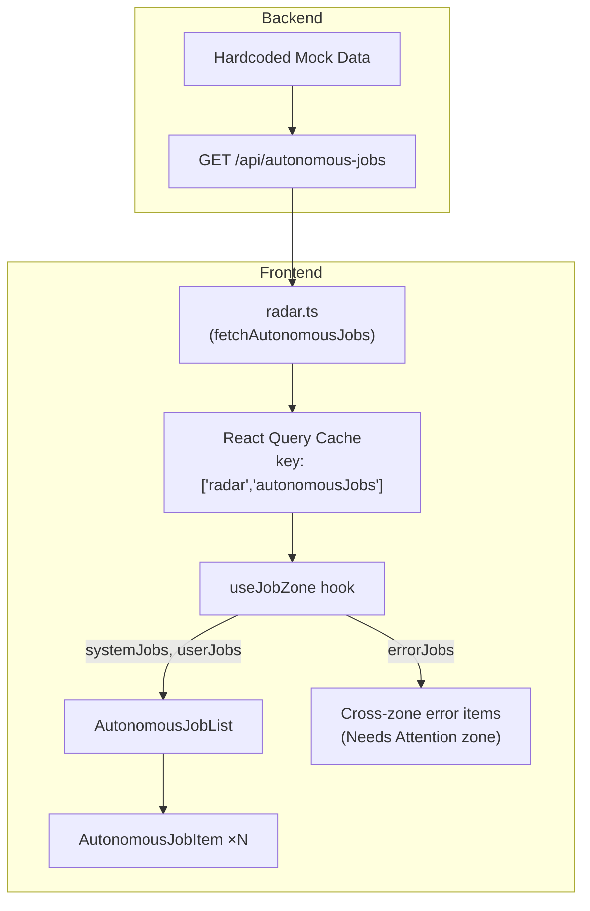
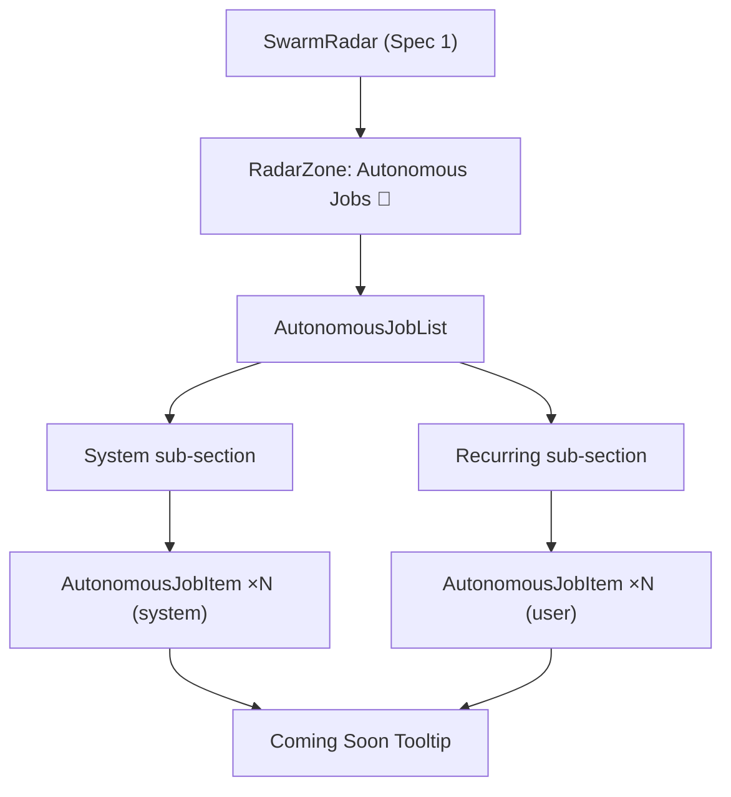

# Design Document — Swarm Radar Autonomous Jobs (Sub-Spec 5 of 5)

## Overview

This design covers the Autonomous Jobs zone of the Swarm Radar — the final layer that surfaces system background jobs and user-defined recurring agent jobs. It includes the AutonomousJobList and AutonomousJobItem React components, a placeholder backend API returning hardcoded mock data, the frontend service layer addition (`fetchAutonomousJobs`), the `useJobZone` state management hook, cross-zone error referencing in the Needs Attention zone, and badge tint computation for error states.

This spec builds on the foundation from Spec 1 (`swarm-radar-foundation`) which provides the SwarmRadar shell, RadarZone component, shared types (`RadarAutonomousJob`, `RadarZoneId`), sorting utility (`sortAutonomousJobs`), mock data module (`getMockSystemJobs()`, `getMockUserJobs()`), CSS styles, empty state support, and badge tint utility (`getBadgeTint`). It also builds on Spec 2 (`swarm-radar-todos`) which created the `radar.ts` service layer where this spec adds the `fetchAutonomousJobs` function.

### Scope

- **AutonomousJobList / AutonomousJobItem** — Display system and user-defined jobs with status indicators, timestamps, and "Coming soon" tooltip on click
- **Two sub-sections** — "System" for system built-in jobs and "Recurring" for user-defined jobs
- **"Coming soon" tooltip** — Placeholder click action with auto-dismiss after 2 seconds
- **Backend `GET /api/autonomous-jobs`** — Placeholder endpoint returning hardcoded mock data
- **Backend Pydantic models** — `AutonomousJobResponse`, `AutonomousJobCategory`, `AutonomousJobStatus` in `backend/schemas/autonomous_job.py`
- **Frontend service layer** — `fetchAutonomousJobs` added to `desktop/src/services/radar.ts` with `toCamelCase` conversion
- **`useJobZone` hook** — React Query polling (60s), gated by `enabled: isVisible`, partitions jobs by category
- **Cross-zone error reference** — Jobs in error state surface in the Needs Attention zone
- **Badge tint** — Neutral by default, red when any job has `status === 'error'`
- **Accessibility** — Keyboard navigation, ARIA roles, screen reader support

### Dependencies (from Earlier Specs)

| Artifact | Location | Used For |
|----------|----------|----------|
| `RadarAutonomousJob` type | `desktop/src/types/radar.ts` | Job data shape |
| `sortAutonomousJobs()` | `radar/radarSortUtils.ts` | Deterministic sort with id tiebreaker |
| `getBadgeTint()` | `radar/radarIndicators.ts` | Badge tint computation (error → red) |
| `RadarZone` component | `radar/RadarZone.tsx` | Collapsible zone wrapper |
| `SwarmRadar` shell | `radar/SwarmRadar.tsx` | Root component (receives zone children) |
| CSS styles | `radar/SwarmRadar.css` | All Radar visual styles |
| `getMockSystemJobs()` | `radar/mockData.ts` | Client-side fallback mock data |
| `getMockUserJobs()` | `radar/mockData.ts` | Client-side fallback mock data |
| `radar.ts` service | `desktop/src/services/radar.ts` | Existing service layer (job function added here) |
| `useTodoZone` hook pattern | `radar/hooks/useTodoZone.ts` | Hook pattern reference for `useJobZone` |

### Design Principles Alignment

| Principle | How Autonomous Jobs Implements It |
|-----------|----------------------------------|
| Glanceable Awareness | Status indicators, last run timestamps, and schedule descriptions provide instant context |
| Progressive Disclosure | "Coming soon" tooltip defers job configuration complexity to a future release |
| Visible Planning Builds Trust | Showing system and user-defined jobs transparently reveals what runs on the user's behalf |
| Signals First | Jobs in error state surface in the Needs Attention zone as attention signals |
| Gradual Disclosure | Two sub-sections (System / Recurring) organize jobs by category |

### PE Review Findings Addressed

No PE review findings directly apply to this spec. All 7 PE findings have been addressed in Specs 1–4. This design follows the patterns established to address those findings (e.g., `id` tiebreaker for sort determinism from PE Finding #6).


## Architecture

### Data Flow



### Component Hierarchy (Autonomous Jobs Scope)



### File Structure (Autonomous Jobs Scope)

```
desktop/src/
├── services/
│   └── radar.ts                              # MODIFIED — add fetchAutonomousJobs + jobToCamelCase
├── pages/chat/components/radar/
│   ├── AutonomousJobList.tsx                 # NEW — Job list with System/Recurring sub-sections
│   ├── AutonomousJobItem.tsx                 # NEW — Single job item with tooltip
│   ├── hooks/
│   │   └── useJobZone.ts                     # NEW — Job zone state hook
│   └── __tests__/
│       ├── jobCategorization.property.test.ts  # NEW — Properties 1, 2, 3, 6, 7
│       └── caseConversion.property.test.ts     # NEW — Property 5
backend/
├── schemas/
│   └── autonomous_job.py                     # NEW — Pydantic models
├── routers/
│   └── autonomous_jobs.py                    # NEW — GET /api/autonomous-jobs endpoint
├── main.py                                   # MODIFIED — register autonomous jobs router
└── tests/
    └── test_autonomous_jobs.py               # NEW — Property 4
```

### Integration with SwarmRadar Shell

The `SwarmRadar` shell (Spec 1) renders the Autonomous Jobs zone with placeholder children. This spec replaces those placeholders with real components:

```tsx
// Inside SwarmRadar.tsx — Autonomous Jobs zone children (updated by this spec)
<RadarZone
  zoneId="autonomousJobs"
  emoji="🤖"
  label="Autonomous Jobs"
  count={systemJobs.length + userJobs.length}
  badgeTint={jobsBadgeTint}
  isExpanded={zoneExpanded.autonomousJobs}
  onToggle={() => toggleZone('autonomousJobs')}
  emptyMessage="No autonomous jobs configured yet."
>
  <AutonomousJobList
    systemJobs={systemJobs}
    userJobs={userJobs}
    onJobClick={handleJobClick}
  />
</RadarZone>
```

### Cross-Zone Error Reference Integration

Jobs in error state also surface in the Needs Attention zone. The `useJobZone` hook exposes `errorJobs` which the `useSwarmRadar` composition layer passes to the Needs Attention zone:

```tsx
// Inside SwarmRadar.tsx — Needs Attention zone (augmented by this spec)
<RadarZone
  zoneId="needsAttention"
  emoji="🔴"
  label="Needs Attention"
  count={needsAttentionCount}  // Includes error job count
  badgeTint={needsAttentionTint}
  isExpanded={zoneExpanded.needsAttention}
  onToggle={() => toggleZone('needsAttention')}
  emptyMessage="All clear — nothing needs your attention right now."
>
  <QuickAddTodo onAdd={quickAddTodo} />
  <TodoList todos={todos} ... />
  <WaitingInputList waitingItems={waitingItems} ... />
  {/* NEW — Error-state job cross-references */}
  {errorJobs.length > 0 && (
    <div className="radar-error-jobs" role="list" aria-label="Jobs with errors">
      {errorJobs.map(job => (
        <div key={job.id} role="listitem" className="radar-error-job-item">
          <span className="radar-error-job-name">{job.name}</span>
          <span className="radar-error-job-status">❌ Error</span>
          <button
            className="radar-error-job-link"
            onClick={() => scrollToJobsZone()}
            aria-label={`View ${job.name} in Jobs zone`}
          >
            View in Jobs
          </button>
        </div>
      ))}
    </div>
  )}
</RadarZone>
```


## Components and Interfaces

### AutonomousJobList

**File:** `desktop/src/pages/chat/components/radar/AutonomousJobList.tsx`

```typescript
/**
 * Autonomous job list with "System" and "Recurring" sub-sections.
 *
 * Renders two groups of AutonomousJobItem components, separated by
 * sub-section headers. Receives pre-sorted, pre-partitioned data
 * from the useJobZone hook.
 *
 * Exports:
 * - AutonomousJobList — Renders system and user-defined job items
 */

interface AutonomousJobListProps {
  systemJobs: RadarAutonomousJob[];    // Pre-sorted by useJobZone
  userJobs: RadarAutonomousJob[];      // Pre-sorted by useJobZone
  onJobClick: (jobId: string) => void;
}
```

Responsibilities:
- Renders two sub-sections: "System" and "Recurring", each with a sub-section header
- Each sub-section renders a `<ul role="list">` containing `AutonomousJobItem` components
- Sub-section headers use `<h4>` elements with `aria-label` for screen reader distinction (e.g., "System jobs", "Recurring jobs")
- Hides a sub-section entirely (including its header) when its job array is empty
- Renders nothing when both arrays are empty — the parent `RadarZone` handles the zone-level empty state
- Uses `clsx` for conditional class composition
- Uses CSS variables only — no hardcoded colors

### AutonomousJobItem

**File:** `desktop/src/pages/chat/components/radar/AutonomousJobItem.tsx`

```typescript
/**
 * Single autonomous job item with status indicator, timestamps, and
 * "Coming soon" tooltip on click.
 *
 * Exports:
 * - AutonomousJobItem — Renders one RadarAutonomousJob with status and click tooltip
 */

interface AutonomousJobItemProps {
  job: RadarAutonomousJob;
  onClick: () => void;
}
```

Responsibilities:
- Renders as `<li role="listitem" className="radar-job-item">`
- Includes `aria-label` describing the job name and status (e.g., "Workspace Sync, Running")
- Displays for **System jobs**: job name, status indicator (✅ Running, ⏸️ Paused, ❌ Error, ✔️ Completed), last run timestamp (relative, e.g., "5m ago", "1h ago")
- Displays for **User-defined jobs**: job name, schedule description (e.g., "Daily at 9am", "Every Monday"), status indicator, last run timestamp
- Schedule description is shown only when `job.schedule` is non-null (system jobs typically have no schedule string)
- Status indicator mapping:

| Status | Indicator |
|--------|-----------|
| `running` | ✅ Running |
| `paused` | ⏸️ Paused |
| `error` | ❌ Error |
| `completed` | ✔️ Completed |

- Last run timestamp uses relative formatting (e.g., "5m ago", "1h ago", "2d ago"). Shows "Never" when `lastRunAt` is null.
- Clicking the item triggers the `onClick` callback, which shows the "Coming soon" tooltip
- Error-state items get `className="radar-job-item--error"` for visual emphasis (red-tinted text via `--color-danger`)
- Focusable via Tab key navigation
- Click action accessible via Enter or Space key
- Uses `--color-text-primary`, `--color-text-muted`, `--color-border`, `--color-card`, `--color-danger` CSS variables

### "Coming Soon" Tooltip

The tooltip is managed as local state within `AutonomousJobItem`:

```typescript
const [showTooltip, setShowTooltip] = useState(false);
const tooltipTimerRef = useRef<ReturnType<typeof setTimeout> | null>(null);

const handleClick = () => {
  // Clear any existing timer
  if (tooltipTimerRef.current) clearTimeout(tooltipTimerRef.current);
  setShowTooltip(true);
  // Auto-dismiss after 2 seconds
  tooltipTimerRef.current = setTimeout(() => setShowTooltip(false), 2000);
};

// Dismiss on any subsequent click (via document-level listener when tooltip is visible)
useEffect(() => {
  if (!showTooltip) return;
  const dismiss = () => setShowTooltip(false);
  document.addEventListener('click', dismiss, { once: true, capture: true });
  return () => document.removeEventListener('click', dismiss, { capture: true });
}, [showTooltip]);

// Cleanup timer on unmount
useEffect(() => {
  return () => { if (tooltipTimerRef.current) clearTimeout(tooltipTimerRef.current); };
}, []);
```

Tooltip rendering:

```tsx
{showTooltip && (
  <div
    className="radar-job-tooltip"
    role="status"
    aria-live="polite"
  >
    Coming soon
  </div>
)}
```

Tooltip styling uses:
- `--color-card` background
- `--color-text-muted` text
- `--color-border` border
- Positioned absolutely relative to the `<li>` parent
- Small rounded rectangle with subtle shadow
- Does NOT navigate away or open any panels


## Service Layer

### radar.ts — Autonomous Jobs Function Addition

**File:** `desktop/src/services/radar.ts` (addition to existing file from Spec 2)

The following function is added alongside the existing ToDo and task functions:

```typescript
import type { RadarAutonomousJob } from '../types';

/** Convert backend snake_case autonomous job response to frontend camelCase. */
export function jobToCamelCase(job: Record<string, unknown>): RadarAutonomousJob {
  return {
    id: job.id as string,
    name: job.name as string,
    category: (job.category as string) === 'user_defined'
      ? 'user_defined'
      : 'system' as RadarAutonomousJob['category'],
    status: job.status as RadarAutonomousJob['status'],
    schedule: (job.schedule as string) ?? null,
    lastRunAt: (job.last_run_at as string) ?? null,
    nextRunAt: (job.next_run_at as string) ?? null,
    description: (job.description as string) ?? null,
  };
}

// Added to the existing radarService object:
export const radarService = {
  // ... existing ToDo functions from Spec 2 ...
  // ... existing task functions from Spec 4 ...

  /** Fetch autonomous jobs (system + user-defined). */
  async fetchAutonomousJobs(): Promise<RadarAutonomousJob[]> {
    const response = await api.get('/autonomous-jobs');
    return response.data.map(jobToCamelCase);
  },
};
```

The `jobToCamelCase` function is exported for direct use in tests (Property 5). It maps:

| Backend (snake_case) | Frontend (camelCase) | Type |
|---------------------|---------------------|------|
| `id` | `id` | `string` |
| `name` | `name` | `string` |
| `category` | `category` | `'system' \| 'user_defined'` |
| `status` | `status` | `'running' \| 'paused' \| 'error' \| 'completed'` |
| `schedule` | `schedule` | `string \| null` |
| `last_run_at` | `lastRunAt` | `string \| null` |
| `next_run_at` | `nextRunAt` | `string \| null` |
| `description` | `description` | `string \| null` |


## State Management

### useJobZone Hook

**File:** `desktop/src/pages/chat/components/radar/hooks/useJobZone.ts`

```typescript
/**
 * React hook for autonomous job zone state management.
 *
 * Encapsulates data fetching via React Query with 60-second polling,
 * gated by sidebar visibility. Partitions jobs into system and user-defined
 * categories, applies sorting, and exposes error-state jobs for cross-zone
 * referencing in the Needs Attention zone.
 *
 * Parameters:
 * - isVisible: boolean — derived from rightSidebars.isActive('todoRadar').
 *   When false, polling is disabled (zero queries).
 *
 * Returns:
 * - systemJobs: RadarAutonomousJob[] — filtered by category === 'system', sorted
 * - userJobs: RadarAutonomousJob[] — filtered by category === 'user_defined', sorted
 * - errorJobs: RadarAutonomousJob[] — all jobs with status === 'error' (for cross-zone)
 * - isLoading: boolean
 * - handleJobClick: (jobId: string) => void — triggers "Coming soon" tooltip (delegated to component)
 *
 * Polling: 60-second interval via React Query refetchInterval, gated by enabled: isVisible.
 * Cache key: ['radar', 'autonomousJobs']
 */

interface UseJobZoneParams {
  isVisible: boolean;  // From rightSidebars.isActive('todoRadar')
}

interface UseJobZoneReturn {
  systemJobs: RadarAutonomousJob[];     // Filtered + sorted
  userJobs: RadarAutonomousJob[];       // Filtered + sorted
  errorJobs: RadarAutonomousJob[];      // For cross-zone Needs Attention reference
  isLoading: boolean;
  handleJobClick: (jobId: string) => void;
}
```

Implementation details:

**Data Fetching:**
- React Query key: `['radar', 'autonomousJobs']`
- Polling interval: 60,000ms (60s)
- Gated by `enabled: isVisible` — zero queries when sidebar is hidden
- `queryFn` calls `radarService.fetchAutonomousJobs()`

**Filtering, Partitioning & Sorting:**

```typescript
const allJobs = data ?? [];

// Sort all jobs first using Spec 1's sortAutonomousJobs
const sorted = useMemo(() => sortAutonomousJobs(allJobs), [allJobs]);

// Partition by category
const systemJobs = useMemo(
  () => sorted.filter(j => j.category === 'system'),
  [sorted]
);
const userJobs = useMemo(
  () => sorted.filter(j => j.category === 'user_defined'),
  [sorted]
);

// Extract error-state jobs for cross-zone reference
const errorJobs = useMemo(
  () => allJobs.filter(j => j.status === 'error'),
  [allJobs]
);
```

The `sortAutonomousJobs` function from Spec 1 sorts: `system` category before `user_defined`, then alphabetical by name (case-insensitive), then by `id` ascending as the ultimate tiebreaker (PE Finding #6). Since the sort already groups by category, the partition filter preserves the sort order within each group.

**Polling Behavior:**
- When `isVisible` is `false`: `enabled: false` on the React Query config → zero polling queries
- When `isVisible` transitions `false → true`: polling resumes at the 60-second interval
- When `isVisible` transitions `true → false`: polling stops immediately

**handleJobClick:**
- The hook exposes `handleJobClick` as a no-op callback — the actual tooltip display is managed as local state within `AutonomousJobItem`. The callback exists for future extensibility (e.g., opening a configuration panel).

**Composition into useSwarmRadar:**

The `useJobZone` hook is composed into the main `useSwarmRadar` hook alongside `useTodoZone` (Spec 2), `useWaitingInputZone` (Spec 3), and `useTaskZone` (Spec 4):

```typescript
// Inside useSwarmRadar hook
const { systemJobs, userJobs, errorJobs, isLoading: jobsLoading, handleJobClick } =
  useJobZone({ isVisible });

// Needs Attention zone count includes error jobs
const needsAttentionCount = todos.length + waitingItems.length + errorJobs.length;

// Badge tint for Autonomous Jobs zone
const jobsBadgeTint = getBadgeTint('autonomousJobs', { jobs: [...systemJobs, ...userJobs] });
```


## Data Models

### Backend Pydantic Models

**File:** `backend/schemas/autonomous_job.py`

```python
"""Autonomous job schema definitions for the Swarm Radar placeholder API.

This module defines the Pydantic models for the autonomous jobs endpoint,
which returns hardcoded mock data in the initial release. The models
support two job categories (system built-in and user-defined) with four
possible statuses.

Key models:
- ``AutonomousJobCategory``  — Enum: system, user_defined
- ``AutonomousJobStatus``    — Enum: running, paused, error, completed
- ``AutonomousJobResponse``  — Full job response model with snake_case fields

This is a placeholder implementation. Future releases will populate jobs
from actual background task execution and user-configured schedules.
"""

from enum import Enum
from typing import Optional
from pydantic import BaseModel, Field


class AutonomousJobCategory(str, Enum):
    """Category of an autonomous job."""
    SYSTEM = "system"
    USER_DEFINED = "user_defined"


class AutonomousJobStatus(str, Enum):
    """Execution status of an autonomous job."""
    RUNNING = "running"
    PAUSED = "paused"
    ERROR = "error"
    COMPLETED = "completed"


class AutonomousJobResponse(BaseModel):
    """Response model for a single autonomous job.

    All field names use snake_case per the backend convention.
    The frontend service layer converts to camelCase via jobToCamelCase().
    """
    id: str = Field(..., description="Unique job identifier")
    name: str = Field(..., description="Human-readable job name")
    category: AutonomousJobCategory = Field(
        ..., description="Job category: system or user_defined"
    )
    status: AutonomousJobStatus = Field(
        ..., description="Current execution status"
    )
    schedule: Optional[str] = Field(
        None, description="Human-readable schedule description (e.g., 'Daily at 9am')"
    )
    last_run_at: Optional[str] = Field(
        None, description="ISO 8601 timestamp of last execution"
    )
    next_run_at: Optional[str] = Field(
        None, description="ISO 8601 timestamp of next scheduled execution"
    )
    description: Optional[str] = Field(
        None, description="Brief description of what the job does"
    )
```

### Backend Router — Placeholder Endpoint

**File:** `backend/routers/autonomous_jobs.py`

```python
"""Autonomous jobs placeholder API router.

Provides a single GET endpoint that returns hardcoded mock data for the
Swarm Radar Autonomous Jobs zone. This is a placeholder implementation
for the initial release — future versions will query actual job state
from the database.

Key endpoints:
- ``GET /api/autonomous-jobs`` — Returns list of mock autonomous jobs (HTTP 200)

The router is registered in main.py with prefix ``/api/autonomous-jobs``.
"""

from fastapi import APIRouter
from backend.schemas.autonomous_job import (
    AutonomousJobResponse,
    AutonomousJobCategory,
    AutonomousJobStatus,
)

router = APIRouter(prefix="/api/autonomous-jobs", tags=["autonomous-jobs"])

# Hardcoded mock data for the initial release
MOCK_JOBS: list[AutonomousJobResponse] = [
    # System built-in jobs (3)
    AutonomousJobResponse(
        id="sys-job-001",
        name="Workspace Sync",
        category=AutonomousJobCategory.SYSTEM,
        status=AutonomousJobStatus.RUNNING,
        schedule=None,
        last_run_at="2025-01-15T10:30:00Z",
        next_run_at=None,
        description="Synchronizes workspace files and settings across devices",
    ),
    AutonomousJobResponse(
        id="sys-job-002",
        name="Knowledge Indexing",
        category=AutonomousJobCategory.SYSTEM,
        status=AutonomousJobStatus.RUNNING,
        schedule=None,
        last_run_at="2025-01-15T10:25:00Z",
        next_run_at=None,
        description="Indexes workspace documents for semantic search",
    ),
    AutonomousJobResponse(
        id="sys-job-003",
        name="Overdue Check",
        category=AutonomousJobCategory.SYSTEM,
        status=AutonomousJobStatus.RUNNING,
        schedule=None,
        last_run_at="2025-01-15T10:00:00Z",
        next_run_at=None,
        description="Scans ToDos for overdue items and updates their status",
    ),
    # User-defined jobs (2)
    AutonomousJobResponse(
        id="user-job-001",
        name="Daily Digest",
        category=AutonomousJobCategory.USER_DEFINED,
        status=AutonomousJobStatus.RUNNING,
        schedule="Daily at 9am",
        last_run_at="2025-01-15T09:00:00Z",
        next_run_at="2025-01-16T09:00:00Z",
        description="Generates a daily summary of workspace activity",
    ),
    AutonomousJobResponse(
        id="user-job-002",
        name="Weekly Report",
        category=AutonomousJobCategory.USER_DEFINED,
        status=AutonomousJobStatus.PAUSED,
        schedule="Every Monday at 8am",
        last_run_at="2025-01-13T08:00:00Z",
        next_run_at=None,
        description="Compiles weekly progress report from completed tasks",
    ),
]


@router.get("", response_model=list[AutonomousJobResponse])
async def list_autonomous_jobs() -> list[AutonomousJobResponse]:
    """Return all autonomous jobs.

    In the initial release, this returns hardcoded mock data.
    Always returns HTTP 200 — there are no error cases.
    """
    return MOCK_JOBS
```

### Backend Router Registration

**File:** `backend/main.py` (modification)

```python
from backend.routers.autonomous_jobs import router as autonomous_jobs_router

# Add alongside existing router registrations:
app.include_router(autonomous_jobs_router)
```

### Frontend Type Reference

The `RadarAutonomousJob` type is already defined in Spec 1 at `desktop/src/types/radar.ts`:

```typescript
export interface RadarAutonomousJob {
  id: string;
  name: string;
  category: 'system' | 'user_defined';
  status: 'running' | 'paused' | 'error' | 'completed';
  schedule: string | null;
  lastRunAt: string | null;      // ISO 8601
  nextRunAt: string | null;      // ISO 8601
  description: string | null;
}
```

No changes to the type definition are needed — this spec consumes it as-is.


## Correctness Properties

*A property is a characteristic or behavior that should hold true across all valid executions of a system — essentially, a formal statement about what the system should do. Properties serve as the bridge between human-readable specifications and machine-verifiable correctness guarantees.*

The following 7 properties are derived from the acceptance criteria prework analysis. Each is universally quantified and maps to specific requirements. Redundant criteria were consolidated during the prework reflection phase — for example, categorization (1.1), sort-before-partition (7.5), and sort ordering (1.4) are unified into Properties 1 and 3; error cross-zone filtering (3.1, 3.3, 3.4) is unified into Property 7; and badge tint criteria (4.1, 4.2) are unified into Property 2.

### Property 1: Autonomous job categorization separates system and user-defined jobs

*For any* set of autonomous jobs with mixed categories (`system` and `user_defined`), the categorization function SHALL partition them into exactly two groups: jobs with `category === 'system'` in the System sub-section, and jobs with `category === 'user_defined'` in the Recurring sub-section. No job SHALL appear in both groups. No job SHALL be missing from both groups. The count of system jobs plus the count of user-defined jobs SHALL equal the total count of input jobs.

**Validates: Requirements 1.1, 7.4**

Reasoning: The partition is a pure function applied in `useJobZone`. We generate random arrays of `RadarAutonomousJob` objects with both category values and verify: (1) every system job lands in the system group, (2) every user_defined job lands in the user group, (3) no job is lost or duplicated, (4) the sum of group sizes equals the input size. This consolidates the display sub-section criterion (1.1) and the hook return shape criterion (7.4).

### Property 2: Badge tint reflects error state for autonomous jobs

*For any* set of autonomous jobs, the badge tint SHALL be `red` when at least one job has `status` equal to `error`, and `neutral` otherwise. The badge tint SHALL be `neutral` when the job list is empty. The badge tint SHALL be `red` when exactly one job has `error` status among many non-error jobs. The badge tint SHALL be `red` when all jobs have `error` status.

**Validates: Requirements 4.1, 4.2**

Reasoning: The `getBadgeTint` function from Spec 1 is a pure function. We generate random arrays of jobs with all four status values and verify: (1) empty array → neutral, (2) no errors → neutral, (3) at least one error → red, (4) all errors → red. This consolidates the default-neutral criterion (4.1) and the error-red criterion (4.2).

### Property 3: Autonomous job sort produces a total order with deterministic tiebreaking

*For any* list of autonomous jobs with arbitrary categories, names, and ids, the `sortAutonomousJobs` function SHALL produce a list where: all `system` jobs appear before all `user_defined` jobs; within the same category, jobs are ordered alphabetically by name (case-insensitive); when category and name are equal, jobs are ordered by `id` ascending (string comparison) as the ultimate tiebreaker. Sorting the same input twice SHALL produce identical output (idempotence). No two distinct jobs SHALL have ambiguous relative ordering.

**Validates: Requirements 1.4**

Reasoning: The sort function is defined in Spec 1 but property-tested here as the primary consumer. We generate random arrays of jobs with varied categories, names (including duplicates), and unique ids. We verify: (1) category ordering (system before user_defined), (2) alphabetical name ordering within category, (3) id tiebreaker when category and name match, (4) idempotence (`sort(sort(x)) === sort(x)`), (5) input array is not mutated.

### Property 4: Backend autonomous jobs endpoint returns valid mock data

*For any* call to `GET /api/autonomous-jobs`, the response SHALL be HTTP 200 with a JSON array. Each element SHALL have all required fields: `id` (non-empty string), `name` (non-empty string), `category` (one of `system` or `user_defined`), `status` (one of `running`, `paused`, `error`, `completed`). The response SHALL contain at least 3 system jobs and at least 2 user-defined jobs. All `id` values SHALL be unique across the response.

**Validates: Requirements 5.1, 5.2, 5.3, 5.4**

Reasoning: Since the endpoint returns hardcoded mock data, this is technically a deterministic test. However, we frame it as a property to verify the structural invariants hold: correct field types, minimum counts per category, unique IDs, and valid enum values. The test calls the endpoint and validates the response schema. This consolidates four backend requirements into one comprehensive validation.

### Property 5: toCamelCase conversion for autonomous job responses is correct

*For any* valid backend autonomous job response object with snake_case field names (`last_run_at`, `next_run_at`, `user_defined`), applying `jobToCamelCase` SHALL produce an object with the correct camelCase field names (`lastRunAt`, `nextRunAt`, `userDefined`) and identical field values. The conversion SHALL not drop or add any fields. The output SHALL have exactly 8 fields matching the `RadarAutonomousJob` type.

**Validates: Requirements 6.3**

Reasoning: We generate random backend response objects with all 8 fields using snake_case naming and arbitrary values (strings, nulls, valid enum values). We apply `jobToCamelCase` and verify: (1) each snake_case field maps to the correct camelCase name, (2) field values are preserved exactly, (3) no fields are dropped or added, (4) the output conforms to the `RadarAutonomousJob` shape.

### Property 6: Polling is gated by visibility — zero queries when hidden

*For any* state where `isVisible` is `false`, the `useJobZone` hook SHALL execute zero polling queries for `['radar', 'autonomousJobs']`. When `isVisible` transitions from `false` to `true`, polling SHALL resume at the configured 60-second interval. When `isVisible` transitions from `true` to `false`, polling SHALL stop immediately.

**Validates: Requirements 7.3, 7.7**

Reasoning: We generate random sequences of `isVisible` state transitions and verify: (1) when `isVisible` is false, the React Query `enabled` option is false and no queries fire, (2) when `isVisible` becomes true, queries resume, (3) the transition is immediate in both directions. This consolidates the polling configuration criterion (7.3) and the zero-queries criterion (7.7).

### Property 7: Error-state jobs surface in Needs Attention zone cross-reference

*For any* set of autonomous jobs, the cross-zone error reference function SHALL return only jobs with `status === 'error'`. The count of cross-zone error items SHALL equal the count of error-state jobs in the input. Jobs with non-error statuses (`running`, `paused`, `completed`) SHALL NOT appear in the cross-zone reference. When no jobs have error status, the cross-zone reference SHALL return an empty list.

**Validates: Requirements 3.1, 3.3, 3.4**

Reasoning: The error filter is a pure function. We generate random arrays of jobs with all four status values and verify: (1) only error-status jobs pass the filter, (2) the count matches the input's error subset, (3) non-error jobs are excluded, (4) empty input → empty output, (5) when a job's status changes from error to non-error, it no longer passes the filter. This consolidates the cross-zone surfacing criterion (3.1), badge count inclusion (3.3), and removal on status change (3.4).


## Error Handling

### Frontend Error Handling

| Scenario | Behavior |
|----------|----------|
| `fetchAutonomousJobs` API failure | React Query shows stale cached data if available. Retries on next 60s poll. No error UI unless cache is empty (then zone shows empty state). |
| `fetchAutonomousJobs` returns empty array | Treated as empty data — zone shows "No autonomous jobs configured yet." Not an error. |
| Malformed API response | Caught by `jobToCamelCase` conversion (field access returns `undefined`). Log console warning, treat as empty data. |
| Network timeout | React Query default retry (3 attempts, exponential backoff). Stale data remains visible during retries. |
| Tooltip timer fires after component unmount | `useEffect` cleanup clears the timeout ref on unmount. No state update on unmounted component. |
| Tooltip dismiss listener fires after unmount | `useEffect` cleanup removes the document-level click listener. No-op. |
| Invalid `category` value in API response | `jobToCamelCase` maps unknown categories to `'system'` as a defensive fallback. Console warning logged. |
| Invalid `status` value in API response | TypeScript type assertion passes through the raw value. Component renders without a status indicator emoji for unrecognized values. |
| `scrollToJobsZone` fails (cross-zone link) | No-op. The Autonomous Jobs zone may not be in the DOM if the Radar is scrolled. User can manually scroll. |

### Backend Error Handling

| Scenario | HTTP Status | Response |
|----------|-------------|----------|
| `GET /api/autonomous-jobs` | 200 | Always returns the hardcoded mock data list. No error cases in the initial release. |
| Router not registered | N/A | FastAPI returns 404 for `/api/autonomous-jobs`. Frontend falls back to empty state via React Query error handling. |

Since this is a placeholder API returning hardcoded data, there are no database queries, no user input validation, and no external service calls that could fail. Error handling is minimal by design.


## Testing Strategy

### Dual Testing Approach

This spec requires both unit tests and property-based tests. Unit tests cover specific examples, edge cases, and rendering. Property tests cover universal invariants across all valid inputs.

### Property-Based Testing Configuration

- **Frontend library**: `fast-check` (already available in the project's test dependencies)
- **Backend library**: `hypothesis` (already available in `backend/pyproject.toml` dev dependencies)
- **Frontend test runner**: Vitest (`cd desktop && npm test -- --run`)
- **Backend test runner**: pytest (`cd backend && pytest`)
- **Minimum iterations**: 100 per property test
- **Tag format**: Each property test includes a comment referencing the design property:
  ```typescript
  // Feature: swarm-radar-autonomous-jobs, Property 1: Autonomous job categorization separates system and user-defined jobs
  ```
- Each correctness property is implemented by a SINGLE property-based test

### Test File Organization

```
desktop/src/pages/chat/components/radar/__tests__/
├── jobCategorization.property.test.ts    # Properties 1, 2, 3, 6, 7
└── caseConversion.property.test.ts       # Property 5

backend/tests/
└── test_autonomous_jobs.py               # Property 4
```

### Property-to-Test Mapping

| Property | Test File | Library | Min Iterations | What It Verifies |
|----------|-----------|---------|---------------|-----------------|
| 1: Job categorization | jobCategorization.property.test.ts | fast-check | 100 | Partition by category is exhaustive and disjoint; sum of group sizes = input size |
| 2: Badge tint error state | jobCategorization.property.test.ts | fast-check | 100 | Neutral when no errors; red when any error; neutral when empty |
| 3: Sort total order | jobCategorization.property.test.ts | fast-check | 100 | Category ordering, alphabetical name, id tiebreaker, idempotence, purity |
| 4: Backend mock data | test_autonomous_jobs.py | hypothesis | 100 | HTTP 200, valid schema, min counts, unique IDs, both categories present |
| 5: toCamelCase conversion | caseConversion.property.test.ts | fast-check | 100 | snake_case → camelCase field mapping preserves values; no field loss |
| 6: Polling visibility gating | jobCategorization.property.test.ts | fast-check | 100 | isVisible=false → zero queries; transitions resume/stop polling |
| 7: Error cross-zone reference | jobCategorization.property.test.ts | fast-check | 100 | Only error-status jobs pass filter; count matches; non-error excluded |

### Unit Test Coverage (Examples and Edge Cases)

| Test | Type | What It Verifies |
|------|------|-----------------|
| AutonomousJobList renders "System" and "Recurring" sub-sections | Example | Req 1.1 |
| AutonomousJobItem shows correct status indicator (✅, ⏸️, ❌, ✔️) | Example | Req 1.2, 1.3 |
| AutonomousJobItem shows last run timestamp as relative time | Example | Req 1.2 |
| AutonomousJobItem shows schedule description for user-defined jobs | Example | Req 1.3 |
| AutonomousJobItem shows "Never" when lastRunAt is null | Edge case | Req 1.2 |
| AutonomousJobList hides sub-section when its array is empty | Edge case | Req 1.1 |
| Click on AutonomousJobItem shows "Coming soon" tooltip | Example | Req 2.1 |
| Tooltip auto-dismisses after 2 seconds (fake timers) | Example | Req 2.2 |
| Tooltip dismisses on subsequent click | Example | Req 2.2 |
| Click does not navigate away or open panels | Example | Req 2.4 |
| Error-state job appears in Needs Attention zone | Example | Req 3.1 |
| Cross-zone error item shows job name, ❌ Error, and "View in Jobs" link | Example | Req 3.2 |
| Error job removed from Needs Attention when status changes to non-error | Example | Req 3.4 |
| Backend GET /api/autonomous-jobs returns HTTP 200 | Example | Req 5.7 |
| Backend response contains 3 system + 2 user-defined jobs | Example | Req 5.4 |
| Backend response uses snake_case field names | Example | Req 5.6 |
| radar.ts exports fetchAutonomousJobs function | Example | Req 6.1 |
| jobToCamelCase maps last_run_at → lastRunAt | Example | Req 6.3 |
| jobToCamelCase maps next_run_at → nextRunAt | Example | Req 6.3 |
| useJobZone returns systemJobs, userJobs, isLoading | Example | Req 7.4 |
| useJobZone uses cache key ['radar', 'autonomousJobs'] | Example | Req 7.6 |
| Polling disabled when isVisible=false | Example | Req 7.7 |
| AutonomousJobItem focusable via Tab key | Example | Req 8.1 |
| Enter/Space triggers click action on focused item | Example | Req 8.2 |
| AutonomousJobList uses role="list", items use role="listitem" | Example | Req 8.3 |
| AutonomousJobItem has aria-label with job name and status | Example | Req 8.4 |
| Sub-section headers have aria-label for screen readers | Example | Req 8.5 |

### fast-check Arbitrary Generators

The property tests will use custom `fast-check` arbitraries:

```typescript
import * as fc from 'fast-check';
import type { RadarAutonomousJob } from '../../../../../types';

// Arbitrary for job category
const arbJobCategory = fc.constantFrom('system', 'user_defined') as fc.Arbitrary<
  RadarAutonomousJob['category']
>;

// Arbitrary for job status
const arbJobStatus = fc.constantFrom('running', 'paused', 'error', 'completed') as fc.Arbitrary<
  RadarAutonomousJob['status']
>;

// Arbitrary for a single RadarAutonomousJob
const arbAutonomousJob: fc.Arbitrary<RadarAutonomousJob> = fc.record({
  id: fc.uuid(),
  name: fc.string({ minLength: 1, maxLength: 50 }),
  category: arbJobCategory,
  status: arbJobStatus,
  schedule: fc.option(fc.string({ minLength: 1, maxLength: 50 }), { nil: null }),
  lastRunAt: fc.option(
    fc.date({ min: new Date('2024-01-01'), max: new Date('2025-12-31') })
      .map(d => d.toISOString()),
    { nil: null }
  ),
  nextRunAt: fc.option(
    fc.date({ min: new Date('2024-01-01'), max: new Date('2025-12-31') })
      .map(d => d.toISOString()),
    { nil: null }
  ),
  description: fc.option(fc.string({ maxLength: 200 }), { nil: null }),
});

// Arbitrary for a list of autonomous jobs
const arbJobList = fc.array(arbAutonomousJob, { minLength: 0, maxLength: 20 });

// Arbitrary for a list with at least one error-status job
const arbJobListWithError = fc
  .tuple(
    arbJobList,
    arbAutonomousJob.map(j => ({ ...j, status: 'error' as const }))
  )
  .map(([jobs, errorJob]) => [...jobs, errorJob]);

// Arbitrary for a backend snake_case job response object
const arbSnakeCaseJob = fc.record({
  id: fc.uuid(),
  name: fc.string({ minLength: 1, maxLength: 50 }),
  category: fc.constantFrom('system', 'user_defined'),
  status: fc.constantFrom('running', 'paused', 'error', 'completed'),
  schedule: fc.option(fc.string({ minLength: 1, maxLength: 50 }), { nil: null }),
  last_run_at: fc.option(
    fc.date({ min: new Date('2024-01-01'), max: new Date('2025-12-31') })
      .map(d => d.toISOString()),
    { nil: null }
  ),
  next_run_at: fc.option(
    fc.date({ min: new Date('2024-01-01'), max: new Date('2025-12-31') })
      .map(d => d.toISOString()),
    { nil: null }
  ),
  description: fc.option(fc.string({ maxLength: 200 }), { nil: null }),
});
```

### hypothesis Generators (Backend — Property 4)

```python
"""Property-based tests for the autonomous jobs placeholder API.

Tests the GET /api/autonomous-jobs endpoint for structural invariants:
valid schema, minimum job counts per category, unique IDs, and correct
HTTP status. Uses hypothesis for property-based testing.

Key properties verified:
- Response is always HTTP 200 with a JSON array
- Each job has all required fields with valid enum values
- At least 3 system jobs and 2 user-defined jobs
- All job IDs are unique
"""

import pytest
from httpx import AsyncClient
from hypothesis import given, settings, strategies as st

# Since the endpoint returns hardcoded data, the property test
# validates structural invariants by calling the endpoint multiple times
# and verifying the response schema is consistent.

@pytest.mark.asyncio
@settings(max_examples=100)
@given(st.integers(min_value=0, max_value=99))  # Dummy input to drive iterations
async def test_autonomous_jobs_endpoint_returns_valid_mock_data(
    _iteration: int, async_client: AsyncClient
):
    """Feature: swarm-radar-autonomous-jobs, Property 4: Backend autonomous jobs endpoint returns valid mock data"""
    response = await async_client.get("/api/autonomous-jobs")
    assert response.status_code == 200

    jobs = response.json()
    assert isinstance(jobs, list)

    ids = set()
    system_count = 0
    user_count = 0

    valid_categories = {"system", "user_defined"}
    valid_statuses = {"running", "paused", "error", "completed"}

    for job in jobs:
        # Required fields present and non-empty
        assert isinstance(job["id"], str) and len(job["id"]) > 0
        assert isinstance(job["name"], str) and len(job["name"]) > 0
        assert job["category"] in valid_categories
        assert job["status"] in valid_statuses

        # Unique IDs
        assert job["id"] not in ids
        ids.add(job["id"])

        # Count by category
        if job["category"] == "system":
            system_count += 1
        else:
            user_count += 1

    assert system_count >= 3
    assert user_count >= 2
```


## File Inventory

### New Files

| File | Purpose |
|------|---------|
| `desktop/src/pages/chat/components/radar/AutonomousJobList.tsx` | Job list component with System/Recurring sub-sections |
| `desktop/src/pages/chat/components/radar/AutonomousJobItem.tsx` | Single job item with status indicator and "Coming soon" tooltip |
| `desktop/src/pages/chat/components/radar/hooks/useJobZone.ts` | Job zone state management hook (React Query, 60s polling) |
| `desktop/src/pages/chat/components/radar/__tests__/jobCategorization.property.test.ts` | Property tests: categorization, badge tint, sort, polling, cross-zone errors |
| `desktop/src/pages/chat/components/radar/__tests__/caseConversion.property.test.ts` | Property test: jobToCamelCase conversion |
| `backend/schemas/autonomous_job.py` | Pydantic models: AutonomousJobResponse, AutonomousJobCategory, AutonomousJobStatus |
| `backend/routers/autonomous_jobs.py` | GET /api/autonomous-jobs placeholder endpoint with hardcoded mock data |
| `backend/tests/test_autonomous_jobs.py` | Property test: backend endpoint returns valid mock data |

### Modified Files

| File | Change |
|------|--------|
| `desktop/src/services/radar.ts` | Add `fetchAutonomousJobs` function and `jobToCamelCase` export |
| `desktop/src/pages/chat/components/radar/SwarmRadar.tsx` | Replace Autonomous Jobs zone placeholder with `AutonomousJobList` component; add cross-zone error items to Needs Attention zone |
| `backend/main.py` | Register `autonomous_jobs_router` |
| `desktop/src/pages/chat/components/radar/hooks/useSwarmRadar.ts` | Compose `useJobZone` hook; include `errorJobs` in Needs Attention count; compute `jobsBadgeTint` |
