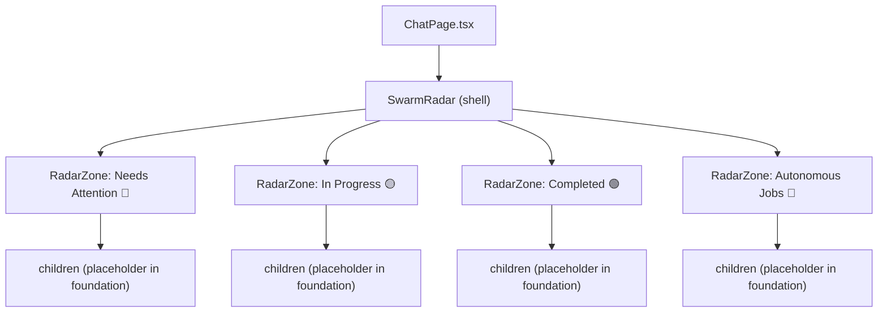

# Design Document — Swarm Radar Foundation (Sub-Spec 1 of 5)

## Overview

The Swarm Radar Foundation establishes the structural skeleton, shared types, reusable components, utility functions, mock data infrastructure, and visual design system for the Swarm Radar redesign. This is a pure frontend spec — no backend changes are required.

This foundation layer provides:

- **SwarmRadar shell** — The root component replacing `TodoRadarSidebar`, with header, close button, resize handle, and four collapsible zones in fixed vertical order.
- **RadarZone** — A reusable collapsible wrapper component shared by all four zones, handling expand/collapse animation, badge rendering, empty states, and accessibility.
- **Shared TypeScript types** — All Radar-specific types (`RadarTodo`, `RadarWipTask`, `RadarCompletedTask`, `RadarWaitingItem`, `RadarAutonomousJob`, `RadarZoneId`, `RadarReviewItem`) defined in `desktop/src/types/radar.ts`.
- **Sorting utilities** — Pure functions for deterministic sorting of each zone's items, with `id` as the ultimate tiebreaker (PE Finding #6).
- **Indicator utilities** — Mapping functions for priority indicators, timeline indicators, source type labels, and badge tint computation.
- **Mock data module** — Factory functions producing realistic sample data for all zones with stable deterministic IDs.
- **Visual design** — CSS using `--color-*` variables, `material-symbols-outlined` icons, smooth animations, and `clsx` class composition.
- **Accessibility** — Keyboard navigation, ARIA attributes, screen reader support via `aria-live` regions.

### What This Spec Does NOT Cover

- ToDo data fetching, lifecycle actions, quick-add (Spec 2)
- Waiting input / pending question handling from SSE props (Spec 3)
- WIP tasks, completed tasks, archive window logic, polling (Spec 4)
- Autonomous jobs API (Spec 5)
- The `useSwarmRadar` hook composition (built incrementally across Specs 2–5)
- Service layer (`radar.ts`) — built incrementally in later specs

### Design Principles Alignment

| Principle | How Foundation Implements It |
|-----------|----------------------------|
| Progressive Disclosure | Collapsible zones default expanded, collapse to header+badge |
| Glanceable Awareness | Zone badges, priority indicators, fixed zone ordering |
| Visible Planning Builds Trust | Transparent zone structure shows what the Radar tracks |
| Signals First | Needs Attention zone is always first (🔴) |
| Gradual Disclosure | Empty states explain zone purpose when no items exist |

### PE Review Findings Addressed

1. **Finding #6 (Determinism)**: All sorting rules include `id` (string comparison) as the ultimate tiebreaker after `createdAt` to guarantee a total order.
2. **Finding #1 (API Design)**: `RadarWaitingItem.createdAt` is documented to use the SSE event arrival timestamp or the task's `startedAt` as a stable proxy, NOT `Date.now()` at derivation time.

## Architecture

### Component Hierarchy (Foundation Scope)



In the foundation spec, each `RadarZone` renders mock data items as simple list items. The zone-specific list components (`TodoList`, `WipTaskList`, etc.) are introduced in later sub-specs.

### File Structure

```
desktop/src/
├── types/
│   ├── radar.ts                          # All shared Radar types
│   └── index.ts                          # Re-exports radar types
├── pages/chat/components/radar/
│   ├── SwarmRadar.tsx                    # Root shell component
│   ├── SwarmRadar.css                    # All Radar styles
│   ├── RadarZone.tsx                     # Reusable collapsible zone wrapper
│   ├── radarSortUtils.ts                # Pure sorting functions for all zones
│   ├── radarIndicators.ts               # Priority, timeline, source type, badge tint utils
│   ├── mockData.ts                      # Factory functions for mock data
│   └── __tests__/
│       ├── radarSortUtils.property.test.ts   # Property tests: sort total order
│       ├── radarIndicators.property.test.ts  # Property tests: indicator mapping
│       ├── radarZone.property.test.ts        # Property tests: badge counts, toggle, empty states
│       └── mockData.test.ts                  # Unit tests: mock data invariants
```

### Integration with ChatPage

The `SwarmRadar` component is a drop-in replacement for `TodoRadarSidebar`. The integration point in `ChatPage.tsx`:

```tsx
// Before
<TodoRadarSidebar width={...} isResizing={...} onClose={...} onMouseDown={...} />

// After (foundation — pendingQuestion/pendingPermission passed through but unused until Spec 3)
<SwarmRadar
  width={...}
  isResizing={...}
  onClose={...}
  onMouseDown={...}
  pendingQuestion={pendingQuestion}
  pendingPermission={pendingPermission}
/>
```

The `useRightSidebarGroup` hook, `RIGHT_SIDEBAR_WIDTH_CONFIGS`, and `todoRadar` sidebar ID remain unchanged.


## Components and Interfaces

### SwarmRadar (Root Shell)

**File:** `desktop/src/pages/chat/components/radar/SwarmRadar.tsx`

```typescript
import type { PendingQuestion } from '../../types';
import type { PermissionRequest } from '../../../types';

interface SwarmRadarProps {
  width: number;
  isResizing: boolean;
  onClose?: () => void;
  onMouseDown: (e: React.MouseEvent) => void;
  pendingQuestion: PendingQuestion | null;      // Passed through, used in Spec 3
  pendingPermission: PermissionRequest | null;  // Passed through, used in Spec 3
}
```

Responsibilities:
- Renders a fixed header bar with "Swarm Radar" title, `radar` material icon, and close button (same pattern as `ChatHistorySidebar`)
- Renders a single scrollable `<div>` content area containing four `RadarZone` components in fixed order
- Manages zone expand/collapse state via `useState<Record<RadarZoneId, boolean>>` (all expanded by default, session-only)
- Provides the left-edge resize handle (identical pattern to `TodoRadarSidebar`)
- Uses `role="region"` and `aria-label="Swarm Radar"` on the root element
- Uses `clsx` for conditional class composition
- In the foundation spec, populates zones with mock data from `mockData.ts`

### RadarZone (Reusable Collapsible Wrapper)

**File:** `desktop/src/pages/chat/components/radar/RadarZone.tsx`

```typescript
interface RadarZoneProps {
  zoneId: string;              // Used for aria-controls ID generation
  emoji: string;               // Zone indicator: 🔴, 🟡, 🟢, 🤖
  label: string;               // Zone label text
  count: number;               // Item count for Zone_Badge
  badgeTint: 'red' | 'yellow' | 'green' | 'neutral';
  isExpanded: boolean;
  onToggle: () => void;
  children: React.ReactNode;
  emptyMessage?: string;       // Shown when count === 0 and no children
}
```

Responsibilities:
- Renders a clickable header `<button>` with emoji, label, and tinted badge count
- Header button uses `aria-expanded={isExpanded}` and `aria-controls={`zone-content-${zoneId}`}`
- Animates expand/collapse with CSS transition on `max-height` (150–200ms)
- When collapsed (`isExpanded === false`): renders only the header, children hidden
- When expanded and `count === 0`: renders `emptyMessage` in `--color-text-muted`, centered
- When expanded and `count > 0`: renders `children`
- Zone content panel uses `id={`zone-content-${zoneId}`}` and `role="list"`
- Badge tint applied via CSS class: `.badge-red`, `.badge-yellow`, `.badge-green`, `.badge-neutral`
- Badge uses `aria-label` for screen reader announcement (e.g., "Needs Attention, 5 items")

### Zone Badge Rendering

The badge is a `<span>` inside the zone header:

```tsx
<span
  className={clsx('radar-zone-badge', `badge-${badgeTint}`)}
  aria-label={`${label}, ${count} ${count === 1 ? 'item' : 'items'}`}
>
  {count}
</span>
```

### Indicator Utilities

**File:** `desktop/src/pages/chat/components/radar/radarIndicators.ts`

```typescript
/** Maps priority to emoji indicator. Returns empty string for 'none'. */
export function getPriorityIndicator(priority: RadarTodo['priority']): string;

/** Maps timeline state to emoji. Returns ⚠️ for overdue, ⏰ for due today, empty string otherwise. */
export function getTimelineIndicator(status: RadarTodo['status'], dueDate: string | null): string;

/** Maps source type to emoji label. Total function — every source type has exactly one mapping. */
export function getSourceTypeLabel(sourceType: RadarTodo['sourceType']): string;

/** Computes badge tint for a zone based on its items. */
export function getBadgeTint(
  zoneId: RadarZoneId,
  items: { todos?: RadarTodo[]; jobs?: RadarAutonomousJob[] }
): 'red' | 'yellow' | 'green' | 'neutral';
```

Indicator mappings:

| Function | Input | Output |
|----------|-------|--------|
| `getPriorityIndicator` | `'high'` | `'🔴'` |
| `getPriorityIndicator` | `'medium'` | `'🟡'` |
| `getPriorityIndicator` | `'low'` | `'🔵'` |
| `getPriorityIndicator` | `'none'` | `''` |
| `getTimelineIndicator` | status `'overdue'` | `'⚠️'` |
| `getTimelineIndicator` | dueDate is today | `'⏰'` |
| `getSourceTypeLabel` | `'manual'` | `'✏️'` |
| `getSourceTypeLabel` | `'email'` | `'📧'` |
| `getSourceTypeLabel` | `'slack'` | `'💬'` |
| `getSourceTypeLabel` | `'meeting'` | `'📅'` |
| `getSourceTypeLabel` | `'integration'` | `'🔗'` |
| `getSourceTypeLabel` | `'chat'` | `'💭'` |
| `getSourceTypeLabel` | `'ai_detected'` | `'🤖'` |

Badge tint logic:

| Zone | Condition | Tint |
|------|-----------|------|
| Needs Attention | Any todo with `status === 'overdue'` or `priority === 'high'` | `'red'` |
| Needs Attention | Otherwise | `'neutral'` |
| In Progress | Always | `'yellow'` |
| Completed | Always | `'green'` |
| Autonomous Jobs | Any job with `status === 'error'` | `'red'` |
| Autonomous Jobs | Otherwise | `'neutral'` |

### Sorting Utilities

**File:** `desktop/src/pages/chat/components/radar/radarSortUtils.ts`

All sort functions are pure — they return new arrays without mutating input.

```typescript
export function sortTodos(todos: RadarTodo[]): RadarTodo[];
export function sortWipTasks(tasks: RadarWipTask[]): RadarWipTask[];
export function sortCompletedTasks(tasks: RadarCompletedTask[]): RadarCompletedTask[];
export function sortWaitingItems(items: RadarWaitingItem[]): RadarWaitingItem[];
export function sortAutonomousJobs(jobs: RadarAutonomousJob[]): RadarAutonomousJob[];
```

Sort rules (all include `id` ascending as ultimate tiebreaker per PE Finding #6):

| Function | Sort Order |
|----------|-----------|
| `sortTodos` | overdue first → priority (high→medium→low→none) → due date (earliest first, null last) → createdAt (newest first) → id ascending |
| `sortWipTasks` | status order: `blocked` → `wip` → `draft` → startedAt (most recent first) → id ascending |
| `sortCompletedTasks` | completedAt descending (most recent first) → id ascending |
| `sortWaitingItems` | createdAt ascending (oldest first) → id ascending |
| `sortAutonomousJobs` | category: `system` before `user_defined` → name alphabetical → id ascending |


## Data Models

### Frontend TypeScript Types

**File:** `desktop/src/types/radar.ts`

All types are defined here and re-exported from `desktop/src/types/index.ts`.

```typescript
// desktop/src/types/radar.ts

/** Union type identifying the four Radar zones. */
export type RadarZoneId = 'needsAttention' | 'inProgress' | 'completed' | 'autonomousJobs';

/** Frontend representation of a ToDo item in the Radar. Maps from backend ToDoResponse. */
export interface RadarTodo {
  id: string;
  workspaceId: string;
  title: string;
  description: string | null;
  source: string | null;
  sourceType: 'manual' | 'email' | 'slack' | 'meeting' | 'integration' | 'chat' | 'ai_detected';
  status: 'pending' | 'overdue' | 'in_discussion' | 'handled' | 'cancelled' | 'deleted';
  priority: 'high' | 'medium' | 'low' | 'none';
  dueDate: string | null;       // ISO 8601
  linkedContext: string | null;  // JSON string
  taskId: string | null;
  createdAt: string;             // ISO 8601
  updatedAt: string;             // ISO 8601
}

/**
 * Frontend representation of a WIP task in the Radar.
 * Uses Pick<Task, ...> to avoid parallel type duplication with the existing Task type.
 */
export type RadarWipTask = Pick<Task,
  'id' | 'workspaceId' | 'agentId' | 'sessionId' | 'status' | 'title' |
  'description' | 'priority' | 'sourceTodoId' | 'model' | 'createdAt' |
  'startedAt' | 'error'
> & {
  /** True when pendingQuestion references this task's session. Computed client-side. */
  hasWaitingInput: boolean;
};

/** Frontend representation of a completed task in the archive window. */
export interface RadarCompletedTask {
  id: string;
  workspaceId: string | null;
  agentId: string;
  sessionId: string | null;
  title: string;
  description: string | null;
  priority: string | null;
  completedAt: string;           // ISO 8601
  /** Always false in initial release — deferred to future spec. */
  reviewRequired: boolean;
  /** Always null in initial release — deferred to future spec. */
  reviewRiskLevel: string | null;
}

/**
 * Frontend representation of a pending question or permission request.
 * Ephemeral — derived from SSE props, not persisted.
 *
 * `createdAt` uses the SSE event arrival timestamp (captured when `pendingQuestion`
 * state is set in ChatPage) or the task's `startedAt` as a stable proxy for
 * creation time, NOT `Date.now()` at derivation time (PE Finding #1).
 */
export interface RadarWaitingItem {
  id: string;
  title: string;
  agentId: string;
  sessionId: string | null;
  /** Derived from pendingQuestion.questions[0].question, truncated to 200 chars. */
  question: string;
  createdAt: string;             // ISO 8601
}

/** Frontend representation of an autonomous job (system or user-defined). */
export interface RadarAutonomousJob {
  id: string;
  name: string;
  category: 'system' | 'user_defined';
  status: 'running' | 'paused' | 'error' | 'completed';
  schedule: string | null;
  lastRunAt: string | null;      // ISO 8601
  nextRunAt: string | null;      // ISO 8601
  description: string | null;
}

/**
 * PLACEHOLDER — deferred to future spec (Key Design Decision #10 from parent spec).
 * Not populated in the initial release. review_required is always false and
 * review_risk_level is always null. Risk-assessment logic is deferred.
 */
export interface RadarReviewItem {
  id: string;
  title: string;
  agentId: string;
  sessionId: string | null;
  riskLevel: 'low' | 'medium' | 'high' | 'critical';
  completionSummary: string;
  completedAt: string;           // ISO 8601
}
```

### Mock Data Module

**File:** `desktop/src/pages/chat/components/radar/mockData.ts`

Factory functions return arrays with stable, deterministic IDs (not randomly generated). Each function returns a new array on every call (no shared mutable state).

```typescript
export function getMockTodos(): RadarTodo[];           // >= 3 items
export function getMockWaitingItems(): RadarWaitingItem[];  // >= 2 items
export function getMockWipTasks(): RadarWipTask[];      // >= 2 items
export function getMockCompletedTasks(): RadarCompletedTask[];  // >= 3 items
export function getMockSystemJobs(): RadarAutonomousJob[];  // >= 2 items
export function getMockUserJobs(): RadarAutonomousJob[];    // >= 2 items
```

Mock data characteristics:
- **Todos**: One high-priority overdue item, one medium-priority due-today item, one low-priority item. Varied source types.
- **Waiting Items**: One mid-execution question, one conditional review placeholder. Stable `createdAt` timestamps.
- **WIP Tasks**: One with status `wip`, one with status `draft`. Different agents.
- **Completed Tasks**: Three items with varying `completedAt` timestamps within the 7-day archive window.
- **System Jobs**: "Workspace Sync" (running), "Knowledge Indexing" (running). Category `system`.
- **User Jobs**: "Daily Digest" (paused), "Weekly Report" (running). Category `user_defined`.

All IDs follow the pattern `mock-{zone}-{index}` (e.g., `mock-todo-1`, `mock-wip-2`).


## Correctness Properties

*A property is a characteristic or behavior that should hold true across all valid executions of a system — essentially, a formal statement about what the system should do. Properties serve as the bridge between human-readable specifications and machine-verifiable correctness guarantees.*

The following 7 properties are derived from the acceptance criteria prework analysis. Each property is universally quantified and maps directly to one or more acceptance criteria from the requirements document.

### Property 1: Zone badge counts equal the number of items in each zone

*For any* combination of zone data (todos, waiting items, WIP tasks, completed tasks, autonomous jobs), the computed badge count for each zone SHALL equal: Needs Attention = count(active todos) + count(waiting items); In Progress = count(WIP tasks); Completed = count(completed tasks within archive window); Autonomous Jobs = count(all jobs). The count SHALL never be negative.

**Validates: Requirements 1.4, 6.3, 6.4, 6.5, 6.6**

Reasoning: The badge count is a pure computation from zone data arrays. We can generate arbitrary arrays of zone items and verify the count equals the array length sum for each zone. This is a metamorphic property — the count function should be equivalent to `.length` on the input arrays.

### Property 2: Zone expand/collapse toggling is independent and preserves other zones

*For any* initial expand/collapse state of all four zones, toggling one zone SHALL flip only that zone's expanded state while leaving all other zones unchanged. The resulting state SHALL persist across re-renders within the same session. Toggling the same zone twice SHALL return it to its original state (involution).

**Validates: Requirements 1.5, 1.6, 2.5**

Reasoning: This is an involution property — `toggle(toggle(state, zone), zone) === state` for any zone. We can generate random initial states (4 booleans) and random zone IDs, apply toggle, and verify only the targeted zone changed. The involution check ensures toggling is its own inverse.

### Property 3: Empty zone states display correct messages

*For any* zone with zero items, the rendered output SHALL contain the zone-specific empty state message: Needs Attention → "All clear — nothing needs your attention right now."; In Progress → "No tasks running. Start a ToDo or chat to kick things off."; Completed → "No completed tasks in the last 7 days."; Autonomous Jobs → "No autonomous jobs configured yet." Zones with one or more items SHALL NOT display the empty state message.

**Validates: Requirements 8.1, 8.2, 8.3, 8.4, 8.6, 10.6**

Reasoning: We can generate random zone IDs and random item counts (0 or positive). For count 0, the empty message function should return the zone-specific string. For count > 0, no empty message should be rendered. This tests the `emptyMessage` prop behavior of `RadarZone`.

### Property 4: Sort functions produce a total order with deterministic tiebreaking

*For any* list of Radar items, each sort function (`sortTodos`, `sortWipTasks`, `sortCompletedTasks`, `sortWaitingItems`, `sortAutonomousJobs`) SHALL produce a total order where no two distinct items have ambiguous relative ordering. Specifically, for any two items `a` and `b` where `a !== b`, exactly one of `a < b` or `a > b` holds. The `id` field (string comparison) serves as the ultimate tiebreaker after all other sort keys (PE Finding #6). Sorting the same input twice SHALL produce identical output (idempotence). The sort function SHALL not mutate the input array.

**Validates: Requirements 5.2, 5.3, 5.4, 5.5, 5.6, 5.7, 5.8**

Reasoning: We generate random arrays of items for each type with arbitrary field values (including duplicate sort keys except `id`). We verify: (1) the output is sorted according to the specified multi-key comparator, (2) sorting is idempotent (`sort(sort(x)) === sort(x)`), (3) the input array is not mutated, (4) for any pair of distinct items, the comparator produces a strict ordering. The `id` tiebreaker guarantees totality.

### Property 5: Priority and timeline indicator mapping is consistent and total

*For any* priority value in `{'high', 'medium', 'low', 'none'}`, the `getPriorityIndicator` function SHALL return the correct emoji: high → 🔴, medium → 🟡, low → 🔵, none → '' (empty string). *For any* `RadarTodo` with status `'overdue'`, `getTimelineIndicator` SHALL return ⚠️. *For any* `RadarTodo` with due date equal to today, `getTimelineIndicator` SHALL return ⏰. *For any* source type in the 7-value union, `getSourceTypeLabel` SHALL return exactly one emoji, and no two source types SHALL map to the same emoji.

**Validates: Requirements 6.1, 6.2, 6.9**

Reasoning: We generate random priority values, random statuses, random due dates (including today), and random source types. We verify: (1) `getPriorityIndicator` is a total function with the correct mapping, (2) `getTimelineIndicator` correctly identifies overdue and due-today states, (3) `getSourceTypeLabel` is a total injective function (no unmapped inputs, no duplicate outputs).

### Property 6: Badge tint reflects urgency and error state

*For any* set of items in the Needs Attention zone, the badge tint SHALL be `'red'` when at least one todo has `status === 'overdue'` or `priority === 'high'`, and `'neutral'` otherwise. *For any* set of autonomous jobs, the badge tint SHALL be `'red'` when at least one job has `status === 'error'`, and `'neutral'` otherwise. The In Progress zone badge tint SHALL always be `'yellow'`. The Completed zone badge tint SHALL always be `'green'`.

**Validates: Requirements 6.3, 6.4, 6.5, 6.6, 6.10**

Reasoning: We generate random arrays of todos with varied statuses and priorities, and random arrays of jobs with varied statuses. We verify the `getBadgeTint` function returns the correct tint for each zone. The In Progress and Completed zones have constant tints, so we verify those are always correct regardless of input.

### Property 7: Mock data satisfies minimum item count invariants

*For any* call to the mock data factory functions, the returned arrays SHALL satisfy: `getMockTodos().length >= 3`, `getMockWaitingItems().length >= 2`, `getMockWipTasks().length >= 2`, `getMockCompletedTasks().length >= 3`, `getMockSystemJobs().length >= 2`, `getMockUserJobs().length >= 2`. All returned items SHALL have non-empty `id` fields. All `id` values within a single factory function's output SHALL be unique. Calling the same factory function twice SHALL return items with identical `id` values (deterministic).

**Validates: Requirements 3.2, 3.3, 3.4, 3.5, 3.9**

Reasoning: Since mock data factories are deterministic (no randomness), this is technically an example test. However, we frame it as a property to verify the invariants hold across all factory functions uniformly. We call each factory, verify minimum counts, verify ID uniqueness within each result, verify non-empty IDs, and verify determinism by calling twice and comparing IDs.


## Error Handling

Since this is a foundation/UI-only spec with no API calls, error handling is minimal:

| Scenario | Behavior |
|----------|----------|
| Mock data factory returns unexpected structure | TypeScript compiler catches at build time. Runtime: component renders empty zone with empty state message. |
| Zone toggle on unmounted component | React state update is a no-op on unmounted components. No error. |
| Invalid `badgeTint` prop value | TypeScript union type prevents invalid values at compile time. CSS falls back to neutral styling if class is missing. |
| Missing `emptyMessage` prop when count is 0 | RadarZone renders nothing in the content area (no crash). The prop is optional. |
| Invalid priority/sourceType passed to indicator functions | TypeScript union types prevent invalid values at compile time. Runtime: functions return empty string for unrecognized values as a defensive fallback. |
| CSS variable not defined in theme | Browser renders with inherited or default values. No crash. Visual degradation only. |

## Testing Strategy

### Dual Testing Approach

This spec requires both unit tests and property-based tests for comprehensive coverage.

**Unit tests** verify specific examples, edge cases, and rendering:
- SwarmRadar renders 4 zones in correct fixed order
- SwarmRadar header contains title, radar icon, and close button
- SwarmRadar accepts extended props (width, pendingQuestion, pendingPermission)
- RadarZone renders header with emoji, label, and badge
- RadarZone keyboard accessibility (Enter/Space to toggle)
- ARIA attributes present (role="region", aria-expanded, aria-controls, aria-live, role="list")
- Mock data factory functions export the correct API surface
- Default zone state is all expanded

**Property-based tests** verify universal properties across all valid inputs:
- Sort function total ordering and deterministic tiebreaking (Property 4)
- Indicator mapping consistency and totality (Property 5)
- Badge tint computation correctness (Property 6)
- Zone badge count computation (Property 1)
- Zone toggle independence and involution (Property 2)
- Empty state message correctness (Property 3)
- Mock data invariants (Property 7)

### Property-Based Testing Configuration

- **Library**: `fast-check` (already available or to be added to `desktop/package.json` devDependencies)
- **Test runner**: Vitest (`cd desktop && npm test -- --run`)
- **Minimum iterations**: 100 per property test
- **Tag format**: Each property test includes a comment referencing the design property:
  ```typescript
  // Feature: swarm-radar-foundation, Property 4: Sort functions produce a total order with deterministic tiebreaking
  ```
- Each correctness property is implemented by a SINGLE property-based test

### Test File Organization

```
desktop/src/pages/chat/components/radar/__tests__/
├── radarSortUtils.property.test.ts     # Property 4: Sort total order + purity + idempotence
├── radarIndicators.property.test.ts    # Property 5: Indicator mapping + Property 6: Badge tint
├── radarZone.property.test.ts          # Property 1: Badge counts + Property 2: Toggle independence + Property 3: Empty states
└── mockData.test.ts                    # Property 7: Mock data invariants (unit-style, deterministic)
```

### Property-to-Test Mapping

| Property | Test File | Min Iterations | What It Verifies |
|----------|-----------|---------------|-----------------|
| 1: Zone badge counts | radarZone.property.test.ts | 100 | Badge count = sum of item array lengths per zone |
| 2: Zone toggle independence | radarZone.property.test.ts | 100 | Toggle flips only target zone; involution holds |
| 3: Empty zone states | radarZone.property.test.ts | 100 | Correct message per zone when count = 0; no message when count > 0 |
| 4: Sort total order | radarSortUtils.property.test.ts | 100 | All 5 sort functions: correct order, idempotent, pure, total |
| 5: Indicator mapping | radarIndicators.property.test.ts | 100 | Priority, timeline, source type mappings are total and correct |
| 6: Badge tint | radarIndicators.property.test.ts | 100 | Tint reflects overdue/high-priority (red) and error (red) states |
| 7: Mock data invariants | mockData.test.ts | 1 (deterministic) | Minimum counts, unique IDs, non-empty IDs, deterministic |

### Unit Test Coverage (Examples and Edge Cases)

| Test | Type | What It Verifies |
|------|------|-----------------|
| SwarmRadar renders 4 zones in fixed order | Example | Req 1.2 |
| SwarmRadar header has title, icon, close button | Example | Req 1.3 |
| SwarmRadar accepts pendingQuestion/pendingPermission props | Example | Req 1.10 |
| RadarZone renders header with emoji, label, badge | Example | Req 10.3 |
| RadarZone keyboard toggle (Enter/Space) | Example | Req 7.1 |
| ARIA: root has role="region" and aria-label | Example | Req 7.3 |
| ARIA: zone header has aria-expanded and aria-controls | Example | Req 7.6 |
| ARIA: zone content has role="list" | Example | Req 7.3 |
| ARIA: badge has aria-label with count | Example | Req 7.4 |
| ARIA: Needs Attention zone has aria-live="polite" | Example | Req 7.5 |
| Default zone state is all expanded | Example | Req 1.6 |
| Mock data uses stable IDs across calls | Example | Req 3.9 |
| Scrollable content area below fixed header | Example | Req 2.1, 2.3 |
