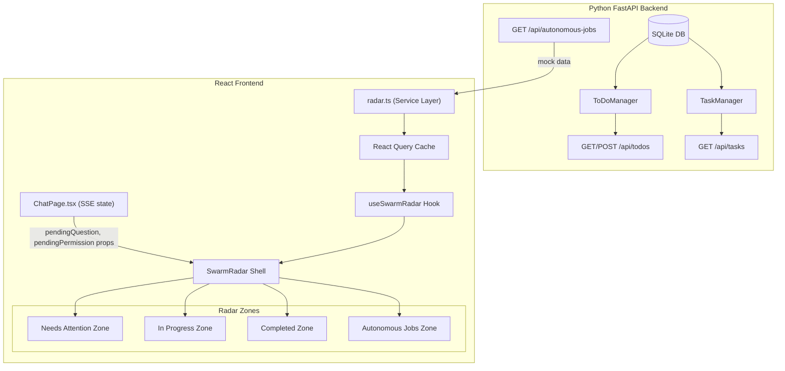
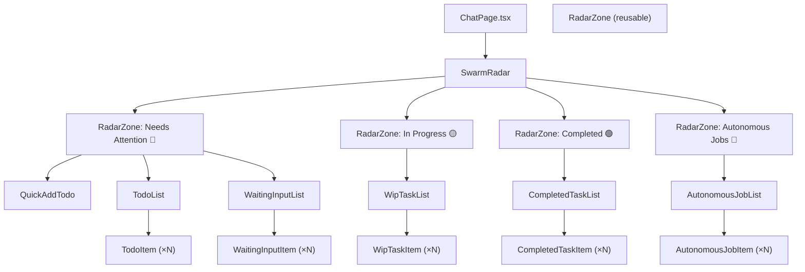

# Design Document — Swarm Radar Redesign

## Overview

The Swarm Radar redesign transforms the current mock `TodoRadarSidebar` into a full unified attention & action control panel. It is the right-sidebar panel in the ChatPage that provides real-time, glanceable awareness of all work items across their lifecycle:

**Source → ToDo → Task (WIP) → Waiting Input / Review → Completed → Archived**

The redesign replaces the existing `TodoRadarSidebar.tsx` (which contains hardcoded `MOCK_OVERDUE_ITEMS` and `MOCK_PENDING_ITEMS`) with a zone-based component hierarchy backed by real API data, mock data infrastructure, and a dedicated state management hook.

### Design Principles Alignment

| Principle | How Swarm Radar Implements It |
|-----------|-------------------------------|
| Chat is the Command Surface | Click actions on Radar items navigate to or create chat threads |
| Visible Planning Builds Trust | WIP Tasks show execution state, agent name, elapsed time |
| Progressive Disclosure | Collapsible zones, hover-only action menus, truncated summaries |
| Human Review Gates | Waiting Input / ToReview surfaces only necessary decisions |
| Glanceable Awareness | Zone badges, priority indicators, fixed zone ordering |

### Key Design Decisions

1. **Click-based actions** — No drag-and-drop in this release. All interactions via click buttons and menus.
2. **Built-in mock data** — All zones ship with realistic mock data from a dedicated module, replaced by real API data as integrations land.
3. **7-day archive window** — Completed tasks auto-hide after 7 days. Configurable constant.
4. **Existing sidebar pattern** — Uses `useRightSidebarGroup` with `todoRadar` ID. Drop-in replacement for `TodoRadarSidebar`.
5. **TSCC independent** — References TSCC data models for awareness but takes no hard dependency.
6. **Optimistic updates** — Lifecycle actions update UI immediately, revert on API failure.
7. **Polling-based refresh** — React Query polling (30s tasks/todos, 60s jobs) rather than SSE push for Radar data.
8. **SSE-based waiting detection** — Waiting Input items are derived from ChatPage's `pendingQuestion` and `pendingPermission` SSE state, passed as props to SwarmRadar. There is no DB status for "waiting_for_input" — the frontend `TaskStatus` type only has `'draft' | 'wip' | 'blocked' | 'completed' | 'cancelled'`.
9. **Ephemeral pending questions** — Pending questions exist only during the active SSE session. They disappear on page reload. This is by design — the agent will re-ask if the question is still relevant when the session resumes.
10. **Deferred review mechanism** — `review_required` and `review_risk_level` fields are always `false`/`null` in the initial release. The To Review sub-section is a placeholder. Risk-assessment logic is deferred to a future spec.
11. **Polling-when-visible** — All React Query polling is gated by `enabled: isVisible` where `isVisible` is derived from `rightSidebars.isActive('todoRadar')`. Zero polling when the sidebar is hidden.

## Architecture

### High-Level Data Flow



### Component Hierarchy



### Integration with ChatPage

The `SwarmRadar` component is a drop-in replacement for `TodoRadarSidebar`. The integration point in `ChatPage.tsx` changes the import, component name, and passes SSE-derived pending state as props:

```tsx
// Before
{rightSidebars.isActive('todoRadar') && (
  <TodoRadarSidebar width={...} isResizing={...} onMouseDown={...} />
)}

// After
{rightSidebars.isActive('todoRadar') && (
  <SwarmRadar
    width={...}
    isResizing={...}
    onMouseDown={...}
    pendingQuestion={pendingQuestion}
    pendingPermission={pendingPermission}
  />
)}
```

The `useRightSidebarGroup` hook, `RIGHT_SIDEBAR_WIDTH_CONFIGS`, and `todoRadar` sidebar ID remain unchanged. The `SwarmRadar` accepts an extended props interface that includes the SSE-derived pending state from ChatPage.


## Components and Interfaces

### Frontend Components

All new components live in `desktop/src/pages/chat/components/radar/`.

#### SwarmRadar (Root Shell)

```typescript
interface SwarmRadarProps {
  width: number;
  isResizing: boolean;
  onClose?: () => void;
  onMouseDown: (e: React.MouseEvent) => void;
  pendingQuestion: PendingQuestion | null;      // From ChatPage SSE state
  pendingPermission: PermissionRequest | null;  // From ChatPage SSE state
}
```

Responsibilities:
- Renders the fixed header bar ("Swarm Radar" title, radar icon, close button)
- Renders the single scrollable content area containing all four `RadarZone` components in fixed order
- Provides the left-edge resize handle (same pattern as current `TodoRadarSidebar`)
- Passes zone data and action handlers from `useSwarmRadar` to child zones
- Passes `pendingQuestion` and `pendingPermission` props to the Needs Attention zone for Waiting Input items
- Uses `aria-label="Swarm Radar"` and `role="region"`

#### RadarZone (Reusable Collapsible Wrapper)

```typescript
interface RadarZoneProps {
  emoji: string;           // Zone indicator: 🔴, 🟡, 🟢, 🤖
  label: string;           // Zone label text
  count: number;           // Item count for Zone_Badge
  badgeTint: 'red' | 'yellow' | 'green' | 'neutral';
  isExpanded: boolean;
  onToggle: () => void;
  children: React.ReactNode;
  emptyMessage?: string;   // Shown when count === 0
}
```

Responsibilities:
- Renders zone header with emoji, label, and tinted `Zone_Badge`
- Handles expand/collapse with smooth animation (150–200ms)
- Uses `aria-expanded` on the header button
- Shows `emptyMessage` in `--color-text-muted` when no children and count is 0
- Uses `aria-live="polite"` region for the Needs Attention zone

#### TodoList

```typescript
interface TodoListProps {
  todos: RadarTodo[];
  onStart: (todoId: string) => void;
  onEdit: (todoId: string) => void;
  onComplete: (todoId: string) => void;
  onCancel: (todoId: string) => void;
  onDelete: (todoId: string) => void;
}
```

Sorts items by: overdue first → priority (high→medium→low→none) → due date (earliest) → created_at (newest).

#### TodoItem

```typescript
interface TodoItemProps {
  todo: RadarTodo;
  onStart: () => void;
  onEdit: () => void;
  onComplete: () => void;
  onCancel: () => void;
  onDelete: () => void;
}
```

Displays: title, source type icon/label, priority indicator, due date. Shows `⋯` overflow menu on hover with actions. Inline confirmation for Cancel/Delete.

#### QuickAddTodo

```typescript
interface QuickAddTodoProps {
  onAdd: (title: string) => Promise<void>;
}
```

Single-line input with placeholder "Add a ToDo..." and submit on Enter or button click. Clears on success, shows inline error on failure. Uses `aria-label="Add a new ToDo"`.

#### WaitingInputList

```typescript
interface WaitingInputListProps {
  waitingItems: RadarWaitingItem[];
  onRespond: (taskId: string) => void;
}
```

> **Note:** To Review items are deferred to a future release (see Key Design Decision #10). The `reviewItems` prop and `onReview`/`onApprove` handlers are omitted from the initial implementation.

Sorts by: creation time (oldest first). Risk-level sorting is deferred until the review mechanism is implemented.

#### WipTaskList

```typescript
interface WipTaskListProps {
  tasks: RadarWipTask[];
  onViewThread: (taskId: string) => void;
  onCancel: (taskId: string) => void;
}
```

> **Note:** Pause/Resume actions are removed — there is no backend support for pausing or resuming tasks. The actual frontend `TaskStatus` is `'draft' | 'wip' | 'blocked' | 'completed' | 'cancelled'`.

Sorts by: `blocked` → `wip` → `draft` → start time (most recent first).

#### CompletedTaskList

```typescript
interface CompletedTaskListProps {
  tasks: RadarCompletedTask[];
  onViewThread: (taskId: string) => void;
  onResume: (taskId: string) => void;
}
```

Sorts by completion time (most recent first). Filters to 7-day archive window client-side.

#### AutonomousJobList

```typescript
interface AutonomousJobListProps {
  systemJobs: RadarAutonomousJob[];
  userJobs: RadarAutonomousJob[];
  onJobClick: (jobId: string) => void;
}
```

Two sub-sections: "System" and "Recurring". Each job shows name, status indicator, schedule (if user-defined), last run timestamp.

### Frontend Service Layer — `radar.ts`

```typescript
// desktop/src/services/radar.ts

export const radarService = {
  // ToDos
  fetchActiveTodos(workspaceId: string): Promise<RadarTodo[]>;
  createTodo(data: QuickAddRequest): Promise<RadarTodo>;
  updateTodoStatus(todoId: string, status: string): Promise<void>;
  convertTodoToTask(todoId: string, agentId: string): Promise<Task>;

  // Tasks (using actual TaskStatus values: wip, draft, blocked, completed, cancelled)
  fetchWipTasks(workspaceId?: string): Promise<RadarWipTask[]>;
  fetchCompletedTasks(workspaceId?: string, completedAfter?: string): Promise<RadarCompletedTask[]>;

  // Autonomous Jobs
  fetchAutonomousJobs(): Promise<RadarAutonomousJob[]>;

  // Task actions
  cancelTask(taskId: string): Promise<void>;
};
```

> **Removed from original design:**
> - `fetchWaitingInputTasks()` — Waiting items come from SSE props (`pendingQuestion`, `pendingPermission`), not from an API endpoint. There is no `waiting_for_input` task status.
> - `fetchReviewTasks()` — Review mechanism is deferred (Key Design Decision #10). `review_required` is always `false`.
> - `pauseTask()` / `resumeTask()` — No backend support for pausing or resuming tasks.

All responses pass through `toCamelCase()` conversion. All request payloads pass through `toSnakeCase()` conversion.

### Frontend State Management — `useSwarmRadar`

The hook is decomposed into per-zone hooks for maintainability, composed inside the main `useSwarmRadar` hook:

```typescript
// Per-zone hooks (internal, not exported)
function useTodoZone(workspaceId: string, isVisible: boolean): {
  todos: RadarTodo[];
  isLoading: boolean;
  quickAddTodo: (title: string) => Promise<void>;
  startTodo: (todoId: string) => void;
  editTodo: (todoId: string) => void;
  completeTodo: (todoId: string) => void;
  cancelTodo: (todoId: string) => void;
  deleteTodo: (todoId: string) => void;
};

function useTaskZone(workspaceId: string, isVisible: boolean): {
  wipTasks: RadarWipTask[];
  completedTasks: RadarCompletedTask[];
  isLoading: boolean;
  viewThread: (taskId: string) => void;
  cancelTask: (taskId: string) => void;
  resumeCompleted: (taskId: string) => void;
};

function useJobZone(isVisible: boolean): {
  systemJobs: RadarAutonomousJob[];
  userJobs: RadarAutonomousJob[];
  isLoading: boolean;
};
```

The main `useSwarmRadar` hook composes these and manages zone expand/collapse state:

```typescript
interface UseSwarmRadarParams {
  workspaceId: string;
  isVisible: boolean;                           // From rightSidebars.isActive('todoRadar')
  pendingQuestion: PendingQuestion | null;      // From ChatPage SSE state
  pendingPermission: PermissionRequest | null;  // From ChatPage SSE state
}

interface UseSwarmRadarReturn {
  // Zone data
  todos: RadarTodo[];
  waitingItems: RadarWaitingItem[];       // Derived from pendingQuestion/pendingPermission props
  wipTasks: RadarWipTask[];
  completedTasks: RadarCompletedTask[];
  systemJobs: RadarAutonomousJob[];
  userJobs: RadarAutonomousJob[];

  // Zone counts (for badges)
  needsAttentionCount: number;            // count(active todos) + count(waiting items)
  inProgressCount: number;
  completedCount: number;
  autonomousJobsCount: number;

  // Zone expand/collapse state
  zoneExpanded: Record<RadarZoneId, boolean>;
  toggleZone: (zoneId: RadarZoneId) => void;

  // Loading states
  isLoading: boolean;

  // ToDo actions (from useTodoZone)
  quickAddTodo: (title: string) => Promise<void>;
  startTodo: (todoId: string) => void;
  editTodo: (todoId: string) => void;
  completeTodo: (todoId: string) => void;
  cancelTodo: (todoId: string) => void;
  deleteTodo: (todoId: string) => void;

  // Task actions (from useTaskZone)
  viewThread: (taskId: string) => void;
  cancelTask: (taskId: string) => void;
  resumeCompleted: (taskId: string) => void;
}
```

> **Removed from original design:**
> - `respondToWaiting`, `reviewTask`, `approveTask` — These come from ChatPage props/navigation, not from Radar hook actions.
> - `pauseTask`, `resumeTask` — No backend support for these operations.
> - `reviewItems` from zone data — Review mechanism is deferred.

Uses React Query with polling (all gated by `enabled: isVisible`):
- `['radar', 'todos']` — 30s interval
- `['radar', 'wipTasks']` — 30s interval
- `['radar', 'completedTasks']` — 30s interval
- `['radar', 'autonomousJobs']` — 60s interval

> **Removed query keys:**
> - `['radar', 'waitingInput']` — Waiting items come from SSE props, not API polling.
> - `['radar', 'reviewTasks']` — Review mechanism is deferred.

Optimistic updates: lifecycle actions (start, complete, cancel, delete) update the React Query cache immediately, then invalidate on API response. On failure, the cache reverts.

### Backend API Extensions

#### ToDo Schema Extensions (Req 15)

Add to `ToDoSourceType` enum in `backend/schemas/todo.py`:
```python
class ToDoSourceType(str, Enum):
    MANUAL = "manual"
    EMAIL = "email"
    SLACK = "slack"
    MEETING = "meeting"
    INTEGRATION = "integration"
    CHAT = "chat"           # NEW
    AI_DETECTED = "ai_detected"  # NEW
```

Add `linked_context` field to `ToDoCreate`, `ToDoUpdate`, `ToDoResponse`:
```python
linked_context: Optional[str] = Field(
    None,
    description="JSON string with reference metadata, e.g. {\"type\": \"thread\", \"thread_id\": \"abc123\"}"
)
```

**SQLite Migration Strategy:**

- **`linked_context` column**: Add via `ALTER TABLE todos ADD COLUMN linked_context TEXT`. SQLite supports `ALTER TABLE ADD COLUMN` — this is safe and non-destructive.
- **`source_type` CHECK constraint**: The existing SQLite `CREATE TABLE` statement has a CHECK constraint on `source_type` that only allows `('manual', 'email', 'slack', 'meeting', 'integration')`. SQLite does **not** support `ALTER TABLE` to modify CHECK constraints. The migration strategy is:
  - **Do NOT attempt to alter the CHECK constraint in SQLite.** The CHECK is only enforced at the SQL level on INSERT/UPDATE.
  - **Use Pydantic enum validation as the enforcement layer** for the new `chat` and `ai_detected` values. The `ToDoSourceType` Python enum is the source of truth for allowed values.
  - **For new rows**: The Pydantic model validates the value before it reaches SQLite. Since the CHECK constraint uses a whitelist, new values will fail the CHECK. The fix is to **recreate the table** with the updated CHECK constraint as part of the migration, using SQLite's standard table-rebuild pattern:
    1. Create new table with updated CHECK constraint
    2. Copy data from old table
    3. Drop old table
    4. Rename new table
  - This is documented explicitly so implementers don't attempt `ALTER TABLE ... ALTER CONSTRAINT`.

#### Autonomous Jobs Placeholder API (Req 16)

New endpoint: `GET /api/autonomous-jobs`

New Pydantic models in `backend/schemas/autonomous_job.py`:
```python
class AutonomousJobCategory(str, Enum):
    SYSTEM = "system"
    USER_DEFINED = "user_defined"

class AutonomousJobStatus(str, Enum):
    RUNNING = "running"
    PAUSED = "paused"
    ERROR = "error"
    COMPLETED = "completed"

class AutonomousJobResponse(BaseModel):
    id: str
    name: str
    category: AutonomousJobCategory
    status: AutonomousJobStatus
    schedule: Optional[str] = None
    last_run_at: Optional[datetime] = None
    next_run_at: Optional[datetime] = None
    description: Optional[str] = None
```

The endpoint returns hardcoded mock data in the initial release.

#### Task Schema Extensions (Req 17)

Add to Task response model:
```python
review_required: bool = Field(default=False, description="Whether this completed task requires user review. Always false in initial release — deferred to future spec.")
review_risk_level: Optional[str] = Field(None, description="Risk level: low, medium, high, critical. Always null in initial release — deferred to future spec.")
```

> **Deferred:** The population mechanism for `review_required` and `review_risk_level` is deferred to a future spec. In the initial release, these fields are always `false`/`null`. No risk-assessment logic exists yet. The To Review sub-section in the Needs Attention zone is a placeholder.

Add query parameter support to `GET /api/tasks`:

**Query parameter format:** Comma-separated values with OR semantics within the same parameter, AND semantics across different parameter types.

Example: `GET /api/tasks?status=wip,draft,blocked&workspace_id=abc` means:
`(status=wip OR status=draft OR status=blocked) AND workspace_id=abc`

Supported filters:
- `status=wip,draft,blocked` — filter by active task statuses (actual frontend `TaskStatus` values)
- `status=completed` — filter completed tasks
- `status=cancelled` — filter cancelled tasks
- `completed_after=<ISO8601>` — filter by completion date (for archive window)
- `workspace_id=<id>` — filter by workspace

> **Removed:** `status=waiting_for_input` filter — this status does not exist in the frontend `TaskStatus` type (`'draft' | 'wip' | 'blocked' | 'completed' | 'cancelled'`). Waiting state is detected via SSE events, not DB status.
> **Removed:** `review_required=true` filter — deferred to future spec (always false).

### Mock Data Module

`desktop/src/pages/chat/components/radar/mockData.ts`

Contains factory functions that produce realistic mock data for all four zones:
- `getMockTodos()` → 3+ ToDo items with varied priorities, sources, due dates
- `getMockWaitingItems()` → 2 waiting input items (derived from mock `PendingQuestion` objects)
- `getMockWipTasks()` → 2 WIP tasks (one `wip`, one `draft`)
- `getMockCompletedTasks()` → 3 completed tasks within 7-day window
- `getMockSystemJobs()` → 3 system jobs (Workspace Sync, Knowledge Indexing, Overdue Check)
- `getMockUserJobs()` → 2 user jobs (Daily Digest, Weekly Report)

Mock data is used as the initial return value from the `useSwarmRadar` hook when API calls haven't resolved yet, and as fallback data from the placeholder autonomous jobs endpoint.

> **Note:** `getMockWaitingItems()` produces mock `RadarWaitingItem` objects for demo purposes. In production, waiting items are derived from the `pendingQuestion` and `pendingPermission` props passed from ChatPage.


## Data Models

### Frontend TypeScript Types

```typescript
// desktop/src/types/radar.ts (or added to index.ts)

type RadarZoneId = 'needsAttention' | 'inProgress' | 'completed' | 'autonomousJobs';

interface RadarTodo {
  id: string;
  workspaceId: string;
  title: string;
  description: string | null;
  source: string | null;
  sourceType: 'manual' | 'email' | 'slack' | 'meeting' | 'integration' | 'chat' | 'ai_detected';
  status: 'pending' | 'overdue' | 'in_discussion' | 'handled' | 'cancelled' | 'deleted';
  priority: 'high' | 'medium' | 'low' | 'none';
  dueDate: string | null;       // ISO 8601
  linkedContext: string | null;  // JSON string
  taskId: string | null;
  createdAt: string;
  updatedAt: string;
}

// Reuses existing Task type via Pick — avoids parallel type duplication (Finding #8)
type RadarWipTask = Pick<Task,
  'id' | 'workspaceId' | 'agentId' | 'sessionId' | 'status' | 'title' |
  'description' | 'priority' | 'sourceTodoId' | 'model' | 'createdAt' |
  'startedAt' | 'error'
> & {
  hasWaitingInput: boolean;  // Derived: true when pendingQuestion references this task's session
};
```

> **`RadarWipTask.status`** uses the actual frontend `TaskStatus` type: `'draft' | 'wip' | 'blocked' | 'completed' | 'cancelled'`. For WIP display, only tasks with status `wip`, `draft`, or `blocked` are shown. The `hasWaitingInput` boolean is computed client-side by checking if `pendingQuestion` references this task's `sessionId`.

```typescript
interface RadarCompletedTask {
  id: string;
  workspaceId: string | null;
  agentId: string;
  sessionId: string | null;
  title: string;
  description: string | null;
  priority: string | null;
  completedAt: string;           // ISO 8601
  reviewRequired: boolean;       // Always false in initial release (deferred)
  reviewRiskLevel: string | null; // Always null in initial release (deferred)
}

interface RadarWaitingItem {
  id: string;                    // task ID (or synthetic ID from pendingQuestion)
  title: string;                 // task title
  agentId: string;
  sessionId: string | null;
  question: string;              // Derived from first element of AskUserQuestion[].question, truncated to 200 chars
  createdAt: string;
}
```

> **`RadarWaitingItem` mapping from SSE state:** The `pendingQuestion` prop from ChatPage contains `{ toolUseId: string, questions: AskUserQuestion[] }` where `AskUserQuestion = { question: string, header: string, options: AskUserQuestionOption[], multiSelect: boolean }`. The mapping is:
> - `question` = `pendingQuestion.questions[0].question` truncated to 200 characters
> - `title` = the associated task's title (looked up from `wipTasks` by matching `sessionId`)
> - `id` = `pendingQuestion.toolUseId`
> - `createdAt` = current timestamp (ephemeral, not persisted)
>
> **Ephemeral nature:** `RadarWaitingItem` objects exist only during the active SSE session. They disappear on page reload. There is no API endpoint for waiting items. The agent will re-ask if the question is still relevant.

```typescript
// PLACEHOLDER — deferred to future spec (Key Design Decision #10)
interface RadarReviewItem {
  id: string;                    // task ID
  title: string;
  agentId: string;
  sessionId: string | null;
  riskLevel: 'low' | 'medium' | 'high' | 'critical';
  completionSummary: string;     // Truncated summary
  completedAt: string;
}
// NOTE: RadarReviewItem is defined for type completeness but will not be
// populated in the initial release. review_required is always false and
// review_risk_level is always null. Risk-assessment logic is deferred.

interface RadarAutonomousJob {
  id: string;
  name: string;
  category: 'system' | 'user_defined';
  status: 'running' | 'paused' | 'error' | 'completed';
  schedule: string | null;       // e.g., "Daily at 9am"
  lastRunAt: string | null;      // ISO 8601
  nextRunAt: string | null;      // ISO 8601
  description: string | null;
}
```

### Backend Pydantic Models

The existing `ToDoResponse` model in `backend/schemas/todo.py` is extended with `linked_context: Optional[str]`. The existing `ToDoSourceType` enum gains `CHAT` and `AI_DETECTED` values.

The existing Task model gains `review_required: bool` and `review_risk_level: Optional[str]` fields (always `false`/`null` in initial release).

A new `backend/schemas/autonomous_job.py` module defines `AutonomousJobResponse`, `AutonomousJobCategory`, and `AutonomousJobStatus`.

### Data Flow Summary

| Zone | Data Source | API Endpoint / Source | Polling Interval | Notes |
|------|------------|----------------------|-----------------|-------|
| ToDos | SQLite (DB-canonical) | `GET /api/todos?status=pending,overdue` | 30s | `enabled: isVisible` |
| Waiting Input | SSE props from ChatPage | `pendingQuestion` / `pendingPermission` props | N/A (reactive) | Ephemeral — disappears on reload |
| WIP Tasks | SQLite (Tasks) | `GET /api/tasks?status=wip,draft,blocked` | 30s | `enabled: isVisible` |
| Completed | SQLite (Tasks) | `GET /api/tasks?status=completed&completed_after=<7d ago>` | 30s | `enabled: isVisible` |
| Autonomous Jobs | Hardcoded mock | `GET /api/autonomous-jobs` | 60s | `enabled: isVisible` |

> **Removed rows:**
> - "Waiting Input" no longer queries `GET /api/tasks?status=waiting_for_input` — that status doesn't exist. Waiting items come from SSE props.
> - "To Review" row removed — `review_required` is always false in initial release. Deferred to future spec.

### Sorting Rules

| List | Sort Order |
|------|-----------|
| ToDos | overdue first → priority (high→med→low→none) → due date (earliest) → created_at (newest) |
| Waiting Input | created_at (oldest first) |
| WIP Tasks | `blocked` → `wip` → `draft` → start time (most recent first) |
| Completed Tasks | completed_at (most recent first) |
| Autonomous Jobs | system before user_defined → alphabetical by name |

> **Changed from original:** WIP Tasks sort was `waiting_for_input → running → pending → paused`. Updated to use actual `TaskStatus` values: `blocked → wip → draft`.


## Correctness Properties

*A property is a characteristic or behavior that should hold true across all valid executions of a system — essentially, a formal statement about what the system should do. Properties serve as the bridge between human-readable specifications and machine-verifiable correctness guarantees.*

### Property 1: ToDo sort ordering is total and consistent

*For any* list of active ToDo items with arbitrary priorities, statuses, due dates, and creation dates, the sort function should produce a list where every adjacent pair (a, b) satisfies: a is overdue and b is not, OR both have the same overdue status and a has higher or equal priority, OR both have the same overdue status and priority and a has an earlier or equal due date, OR all preceding fields are equal and a has a newer or equal creation date.

**Validates: Requirements 4.3, 6.4**

### Property 2: ToDo active filtering shows only pending and overdue items

*For any* set of ToDo items with mixed statuses (pending, overdue, in_discussion, handled, cancelled, deleted), the active filter function should return only items with status `pending` or `overdue`, and the count of returned items should equal the count of pending + overdue items in the input.

**Validates: Requirements 4.1**

### Property 3: Priority and timeline indicator mapping is consistent

*For any* ToDo item, the priority indicator function should map: high → 🔴, medium → 🟡, low → 🔵, none → no indicator. Additionally, for any ToDo with status `overdue`, the ⚠️ indicator should be present, and for any ToDo with due date equal to today, the ⏰ indicator should be present. The source type label function should map each source type to its correct emoji label (manual → ✏️, email → 📧, slack → 💬, meeting → 📅, integration → 🔗, chat → 💭, ai_detected → 🤖).

**Validates: Requirements 4.4, 4.5, 4.6, 12.1, 12.2**

### Property 4: ToDo lifecycle state transitions produce correct status and zone placement

*For any* active ToDo, performing a lifecycle action should result in the correct status transition: Start → status becomes `handled` and a new WIP task is created; Complete → status becomes `handled` with no task created; Cancel → status becomes `cancelled`; Delete → status becomes `deleted`. After any of Complete, Cancel, or Delete, the ToDo should no longer appear in the active ToDo list.

**Validates: Requirements 5.2, 5.4, 5.5, 5.6**

### Property 5: Quick-add creates ToDo with correct defaults and clears input

*For any* non-empty, non-whitespace string submitted via Quick-Add, a new ToDo should be created with `source_type=manual`, `priority=none`, `status=pending`, and the submitted string as the title. After successful creation, the input field value should be empty.

**Validates: Requirements 6.3, 6.5**

### Property 6: Zone badge counts equal the number of items in each zone

*For any* combination of zone data (todos, waiting items, WIP tasks, completed tasks, autonomous jobs), the computed badge count for each zone should equal: Needs Attention = count(active todos) + count(waiting items); In Progress = count(WIP tasks); Completed = count(completed tasks within archive window); Autonomous Jobs = count(all jobs).

> **Changed:** Needs Attention count no longer includes review items (deferred).

**Validates: Requirements 1.4, 19.4, 10.8**

### Property 7: Zone expand/collapse toggling is independent and preserves other zones

*For any* initial expand/collapse state of all four zones, toggling one zone should flip only that zone's expanded state while leaving all other zones unchanged. The resulting state should persist across re-renders within the same session.

**Validates: Requirements 1.5, 1.6, 2.5, 19.3**

### Property 8: WIP task filtering shows only active execution states and sorts correctly

*For any* set of tasks with mixed statuses, the WIP filter should return only tasks with status `wip`, `draft`, or `blocked`. The sort function should order them: `blocked` first (needs attention), then `wip` (active), then `draft` (queued), with ties broken by start time (most recent first).

> **Changed from original:** Filter was `running, pending, waiting_for_input, paused` — these statuses don't exist in the frontend `TaskStatus` type. Updated to use actual values: `wip`, `draft`, `blocked`.

**Validates: Requirements 9.1, 9.6**

### Property 9: Archive window filtering excludes tasks older than 7 days

*For any* set of completed tasks with varying `completedAt` timestamps, the archive window filter should return only tasks where `completedAt` is within the last 7 days (ARCHIVE_WINDOW_DAYS constant). Tasks exactly at the boundary should be included. Tasks one millisecond past the boundary should be excluded. The result should be sorted by `completedAt` descending (most recent first).

**Validates: Requirements 10.1, 10.6, 10.7, 21.1, 21.2**

### Property 10: Task status changes and SSE events produce correct zone placement

*For any* WIP task that transitions to `completed` status, it should no longer appear in the In Progress zone and should appear in the Completed zone. *For any* WIP task whose `sessionId` matches the current `pendingQuestion` prop from ChatPage, the `hasWaitingInput` flag should be `true` and a corresponding `RadarWaitingItem` should appear in the Needs Attention zone (dual presence via props).

> **Changed from original:** Removed `waiting_for_input` status transition. Waiting detection is now SSE-based via `pendingQuestion` props from ChatPage, not a DB status change.

**Validates: Requirements 9.7, 9.8**

### Property 11: Autonomous job categorization separates system and user-defined jobs

*For any* set of autonomous jobs with mixed categories, the categorization function should partition them into exactly two groups: jobs with `category=system` in the System sub-section, and jobs with `category=user_defined` in the Recurring sub-section. No job should appear in both groups or be missing from both.

**Validates: Requirements 11.1**

### Property 12: Badge tint reflects urgency and error state

*For any* set of items in the Needs Attention zone, the badge tint should be `red` when at least one item is overdue or has high priority, and the default tint otherwise. *For any* set of autonomous jobs, the badge tint should be `red` when at least one job has `status=error`, and `neutral` otherwise.

**Validates: Requirements 12.3, 12.6**

### Property 13: toCamelCase and toSnakeCase are inverse operations

*For any* valid backend response object with snake_case field names, applying `toCamelCase` then `toSnakeCase` should produce an object with the same field values (round-trip). Specifically, `toSnakeCase(toCamelCase(backendResponse))` should have equivalent field values to the original `backendResponse` for all mapped fields.

**Validates: Requirements 18.3, 18.4**

### Property 14: Empty zone states display correct messages

*For any* zone with zero items, the rendered output should contain the zone-specific empty state message: Needs Attention → "All clear — nothing needs your attention right now."; In Progress → "No tasks running. Start a ToDo or chat to kick things off."; Completed → "No completed tasks in the last 7 days."; Autonomous Jobs → "No autonomous jobs configured yet."

**Validates: Requirements 24.1, 24.2, 24.3, 24.4**

### Property 15: Waiting Input sort ordering by creation time

*For any* list of waiting input items with arbitrary creation times, the sort function should order items by creation time (oldest first).

> **Changed from original:** Removed risk-level sorting (was `critical → high → medium → low`). Risk levels are part of the deferred review mechanism. Waiting items sort by creation time only.

**Validates: Requirements 7.8**

### Property 16: linked_context round-trip through create and read

*For any* valid JSON string used as `linked_context` when creating a ToDo, reading that ToDo back via the API should return the identical `linked_context` string.

**Validates: Requirements 15.2**

### Property 17: Backend task filtering returns only matching records

*For any* set of tasks in the database, querying with `status=wip,draft,blocked` should return only tasks with those statuses. Querying with `status=completed&completed_after=<date>` should return only tasks with `completed` status and `completed_at` after the specified date. These filters should be composable using comma-separated OR within a parameter and AND across parameters.

> **Changed from original:** Removed `status=waiting_for_input` filter test — that status doesn't exist. Removed `review_required=true` filter test — deferred. Updated to use actual `TaskStatus` values.

**Validates: Requirements 17.1, 17.4, 21.3**


## Error Handling

### Frontend Error Handling

| Scenario | Behavior |
|----------|----------|
| API fetch failure (todos, tasks, jobs) | Show stale cached data if available (React Query). Display subtle error indicator in zone header. Retry on next polling interval. |
| Quick-Add submission failure | Display inline error message below input field. Input retains the entered text for retry. Error auto-dismisses after 5 seconds. |
| ToDo lifecycle action failure (start, complete, cancel, delete) | Revert optimistic update. Show brief inline toast/error near the affected item. Log error to console. |
| Task action failure (cancel) | Revert optimistic update. Show brief inline error. |
| Network timeout | React Query handles retry with exponential backoff (default 3 retries). Stale data remains visible. |
| Empty API response | Treated as empty data — zone shows empty state message. Not an error. |
| Invalid/malformed API response | Caught by toCamelCase conversion. Log warning, treat as empty data for that zone. |
| SSE disconnection (pending questions lost) | Waiting items disappear from Needs Attention zone. This is expected — the agent will re-ask when the session resumes. |

### Backend Error Handling

| Scenario | HTTP Status | Response |
|----------|-------------|----------|
| ToDo not found | 404 | `{"detail": "ToDo not found"}` |
| Invalid ToDo status transition | 400 | `{"detail": "Invalid status transition from X to Y"}` |
| Task not found | 404 | `{"detail": "Task not found"}` |
| Invalid query parameters | 422 | Pydantic validation error |
| Database error | 500 | `{"detail": "Internal server error"}` |
| Autonomous jobs endpoint (mock) | 200 | Always returns mock data, no error cases in initial release |

### Optimistic Update Rollback Strategy

1. Before API call: snapshot current React Query cache state
2. Apply optimistic update to cache
3. On API success: invalidate query to fetch fresh data
4. On API failure: restore snapshot, show error to user

## Testing Strategy

### Dual Testing Approach

This feature requires both unit tests and property-based tests for comprehensive coverage.

**Unit tests** verify specific examples, edge cases, and integration points:
- Component rendering with specific mock data configurations
- Empty state rendering for each zone
- Specific API response handling
- Keyboard navigation and ARIA attribute presence
- Mock data module returns expected structure and counts
- Component props interface compatibility (SwarmRadar accepts extended props including pendingQuestion/pendingPermission)

**Property-based tests** verify universal properties across all valid inputs:
- Sorting functions (ToDo sort, WIP task sort, completed task sort, waiting item sort)
- Filtering functions (active ToDo filter, WIP task filter, archive window filter, backend task query filters)
- Data transformation functions (toCamelCase/toSnakeCase round-trip)
- State management (zone toggle independence, badge count computation)
- Lifecycle state transitions (ToDo actions produce correct status)
- Visual indicator mapping (priority → emoji, source type → label)

### Property-Based Testing Configuration

- **Library**: `fast-check` (already available in the project's test dependencies, or to be added)
- **Minimum iterations**: 100 per property test
- **Test runner**: Vitest (`cd desktop && npm test -- --run`)
- **Tag format**: Each property test must include a comment referencing the design property:
  ```typescript
  // Feature: swarm-radar-redesign, Property 1: ToDo sort ordering is total and consistent
  ```

### Test File Organization

```
desktop/src/pages/chat/components/radar/__tests__/
  todoSort.property.test.ts        — Properties 1, 2, 3
  todoLifecycle.property.test.ts   — Properties 4, 5
  zoneCounts.property.test.ts      — Properties 6, 7, 14
  wipTaskFilter.property.test.ts   — Property 8
  archiveWindow.property.test.ts   — Property 9
  taskTransitions.property.test.ts — Property 10
  jobCategorization.property.test.ts — Properties 11, 12
  caseConversion.property.test.ts  — Property 13
  waitingSort.property.test.ts     — Property 15

backend/tests/
  test_todo_linked_context.py      — Property 16
  test_task_filtering.py           — Property 17
```

> **Removed test files from original:**
> - No test file for waiting input API queries — waiting items come from SSE props, not API.
> - No test file for review task filtering — deferred to future spec.

### Property-to-Test Mapping

| Property | Test Type | Test File | Min Iterations |
|----------|-----------|-----------|---------------|
| 1: ToDo sort ordering | Property (fast-check) | todoSort.property.test.ts | 100 |
| 2: ToDo active filtering | Property (fast-check) | todoSort.property.test.ts | 100 |
| 3: Priority/timeline indicator mapping | Property (fast-check) | todoSort.property.test.ts | 100 |
| 4: ToDo lifecycle state transitions | Property (fast-check) | todoLifecycle.property.test.ts | 100 |
| 5: Quick-add defaults | Property (fast-check) | todoLifecycle.property.test.ts | 100 |
| 6: Zone badge counts | Property (fast-check) | zoneCounts.property.test.ts | 100 |
| 7: Zone toggle independence | Property (fast-check) | zoneCounts.property.test.ts | 100 |
| 8: WIP task filtering and sorting | Property (fast-check) | wipTaskFilter.property.test.ts | 100 |
| 9: Archive window filtering | Property (fast-check) | archiveWindow.property.test.ts | 100 |
| 10: Task zone transitions + SSE waiting | Property (fast-check) | taskTransitions.property.test.ts | 100 |
| 11: Job categorization | Property (fast-check) | jobCategorization.property.test.ts | 100 |
| 12: Badge tint urgency | Property (fast-check) | jobCategorization.property.test.ts | 100 |
| 13: toCamelCase/toSnakeCase round-trip | Property (fast-check) | caseConversion.property.test.ts | 100 |
| 14: Empty zone states | Property (fast-check) | zoneCounts.property.test.ts | 100 |
| 15: Waiting item sort ordering | Property (fast-check) | waitingSort.property.test.ts | 100 |
| 16: linked_context round-trip | Property (pytest + hypothesis) | test_todo_linked_context.py | 100 |
| 17: Backend task filtering | Property (pytest + hypothesis) | test_task_filtering.py | 100 |

### Unit Test Coverage (Examples and Edge Cases)

| Test | Type | What It Verifies |
|------|------|-----------------|
| SwarmRadar renders 4 zones in order | Example | Req 1.2 |
| SwarmRadar header has title, icon, close button | Example | Req 1.3 |
| SwarmRadar accepts pendingQuestion/pendingPermission props | Example | Req 8.1, 8.2 |
| Mock data has minimum item counts per zone | Example | Req 3.2–3.5 |
| Quick-Add shows inline error on failure | Example | Req 6.6 |
| Waiting Input items derived from pendingQuestion prop | Example | Req 7.1, 8.1 |
| Waiting items disappear when pendingQuestion is null | Example | Req 8.5 |
| Autonomous Job click shows "Coming soon" tooltip | Example | Req 11.5 |
| Quick-Add input has aria-label | Example | Req 14.4 |
| Needs Attention zone has aria-live="polite" | Example | Req 14.6 |
| ToDoSourceType enum includes chat and ai_detected | Example | Req 15.1 |
| GET /api/autonomous-jobs returns mock data | Example | Req 16.1, 16.3 |
| SwarmRadar accepts extended props (width, pendingQuestion, etc.) | Example | Req 20.3 |
| ARCHIVE_WINDOW_DAYS is a configurable constant | Example | Req 21.4 |
| Polling intervals are configurable constants | Example | Req 22.4 |
| Polling disabled when isVisible is false | Example | Req 19 (Decision #11) |
| WIP tasks filter by wip/draft/blocked statuses only | Example | Req 9.1 |
| review_required is always false in task responses | Example | Req 17 (Decision #10) |
