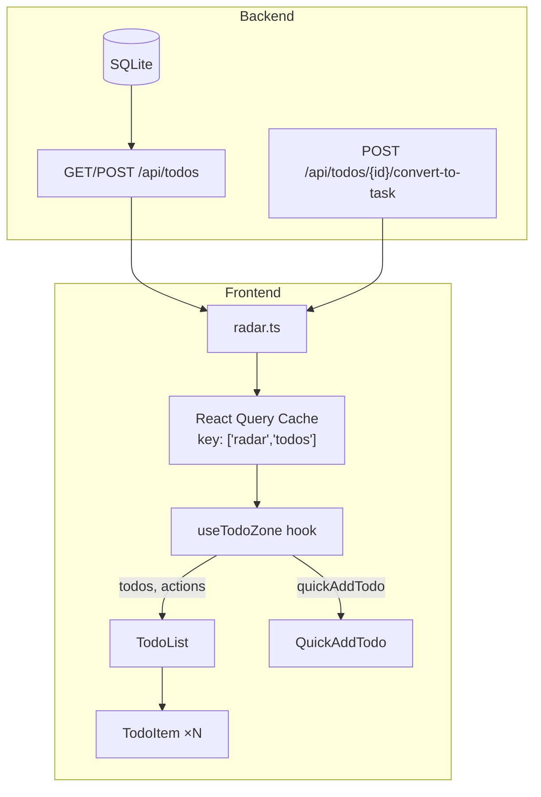
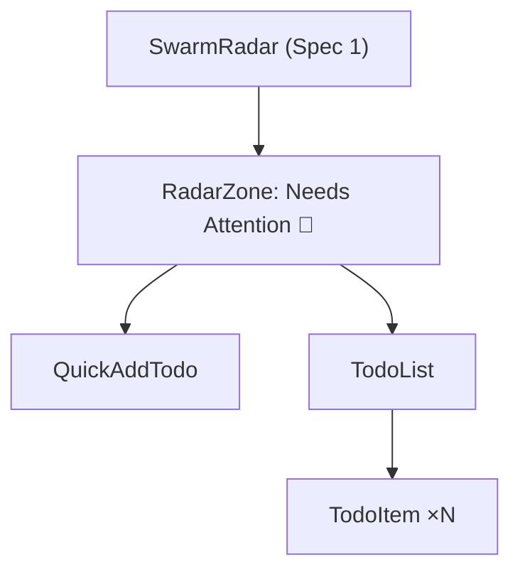
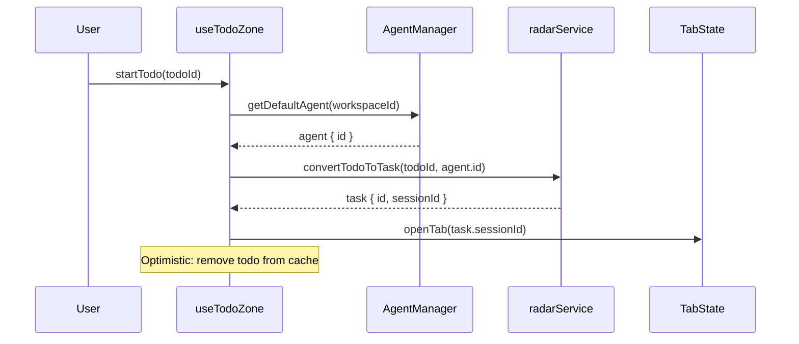

<!-- STALE REFERENCES: This spec references code that has since been refactored or removed:
- ContextPreviewPanel → REMOVED (was planned for future project detail view, never rendered in production)
- useTabState / tabStateRef / saveTabState → SUPERSEDED by useUnifiedTabState hook
- saveCurrentTab → REMOVED (was a no-op in useUnifiedTabState)
This spec is preserved as a historical record of the design decisions made at the time. -->

# Design Document — Swarm Radar ToDos (Sub-Spec 2 of 5)

## Overview

This design covers the ToDo layer of the Swarm Radar — the unified inbox, quick-add input, lifecycle actions, frontend service/state management, and backend schema extensions. It builds on the foundation from Spec 1 (`swarm-radar-foundation`) which provides the SwarmRadar shell, RadarZone component, shared types, sorting utilities, indicator functions, and CSS.

The ToDo layer transforms the Needs Attention zone from a placeholder into a fully functional inbox where users can triage, act on, and create ToDos without leaving the chat surface. The "Start" action bridges the intent layer (ToDo) to the execution layer (Task) via click-to-chat.

### Scope

- **TodoList / TodoItem** — Display and sort active ToDos with indicators and overflow action menu
- **QuickAddTodo** — Inline input for fast ToDo creation
- **Lifecycle actions** — Start, Edit, Complete, Cancel, Delete with optimistic updates
- **radar.ts service** — Centralized API calls with case conversion
- **useTodoZone hook** — React Query polling, filtering, sorting, optimistic updates
- **Backend schema** — `source_type` enum additions (`chat`, `ai_detected`), `linked_context` field, SQLite migration
- **Cleanup** — Delete `TodoRadarSidebar.tsx`, rewire imports to `SwarmRadar`

### Dependencies (from Spec 1)

| Artifact | Location | Used For |
|----------|----------|----------|
| `RadarTodo` type | `desktop/src/types/radar.ts` | ToDo data shape |
| `sortTodos()` | `radar/radarSortUtils.ts` | Deterministic sort with id tiebreaker |
| `getPriorityIndicator()` | `radar/radarIndicators.ts` | Priority emoji mapping |
| `getTimelineIndicator()` | `radar/radarIndicators.ts` | Overdue/due-today emoji |
| `getSourceTypeLabel()` | `radar/radarIndicators.ts` | Source type emoji labels |
| `RadarZone` component | `radar/RadarZone.tsx` | Collapsible zone wrapper |
| `SwarmRadar` shell | `radar/SwarmRadar.tsx` | Root component (receives zone children) |
| CSS styles | `radar/SwarmRadar.css` | All Radar visual styles |

### PE Review Findings Addressed

1. **Finding #4 (API Design)**: "Start" resolves workspace default agent before calling `convertTodoToTask(todoId, agentId)`.
2. **Finding #6 (Determinism)**: `sortTodos` uses `id` as ultimate tiebreaker — defined in Spec 1, property-tested here.
3. **Finding #7 (Schema Evolution)**: SQLite table-rebuild migration in `BEGIN IMMEDIATE ... COMMIT` with version check for idempotency.

## Architecture

### Data Flow



### Component Hierarchy (ToDo Scope)



### File Structure (ToDo Scope)

```
desktop/src/
├── services/
│   └── radar.ts                              # NEW — Radar API service layer
├── pages/chat/components/radar/
│   ├── TodoList.tsx                          # NEW — ToDo list component
│   ├── TodoItem.tsx                          # NEW — Single ToDo item with actions
│   ├── QuickAddTodo.tsx                      # NEW — Inline quick-add input
│   ├── hooks/
│   │   └── useTodoZone.ts                    # NEW — ToDo zone state hook
│   └── __tests__/
│       ├── todoSort.property.test.ts         # NEW — Properties 1, 2, 3
│       ├── todoLifecycle.property.test.ts    # NEW — Properties 4, 5
│       └── caseConversion.property.test.ts   # NEW — Property 6
backend/
├── schemas/
│   └── todo.py                               # MODIFIED — enum + linked_context
├── database/
│   └── sqlite.py                             # MODIFIED — migration for schema changes
└── tests/
    └── test_todo_linked_context.py           # NEW — Property 7
```

### Integration with SwarmRadar Shell

The `SwarmRadar` shell (Spec 1) renders the Needs Attention zone with placeholder children. This spec replaces those placeholders with real components:

```tsx
// Inside SwarmRadar.tsx — Needs Attention zone children (updated by this spec)
<RadarZone
  zoneId="needsAttention"
  emoji="🔴"
  label="Needs Attention"
  count={needsAttentionCount}
  badgeTint={needsAttentionTint}
  isExpanded={zoneExpanded.needsAttention}
  onToggle={() => toggleZone('needsAttention')}
  emptyMessage="All clear — nothing needs your attention right now."
>
  <QuickAddTodo onAdd={quickAddTodo} />
  <TodoList
    todos={todos}
    onStart={startTodo}
    onEdit={editTodo}
    onComplete={completeTodo}
    onCancel={cancelTodo}
    onDelete={deleteTodo}
  />
</RadarZone>
```

## Components and Interfaces

### TodoList

**File:** `desktop/src/pages/chat/components/radar/TodoList.tsx`

```typescript
/**
 * Sorted list of active ToDo items within the Needs Attention zone.
 *
 * Exports:
 * - TodoList — Renders sorted RadarTodo items, delegates actions to parent
 */

interface TodoListProps {
  todos: RadarTodo[];           // Pre-sorted, pre-filtered by useTodoZone
  onStart: (todoId: string) => void;
  onEdit: (todoId: string) => void;
  onComplete: (todoId: string) => void;
  onCancel: (todoId: string) => void;
  onDelete: (todoId: string) => void;
}
```

Responsibilities:
- Renders a `<ul role="list">` containing one `TodoItem` per entry
- Receives pre-sorted, pre-filtered data from `useTodoZone` — no sorting logic here
- Passes per-item action callbacks to each `TodoItem`
- Uses `clsx` for conditional class composition
- Renders nothing (not even the `<ul>`) when `todos.length === 0` — the parent `RadarZone` handles empty state

### TodoItem

**File:** `desktop/src/pages/chat/components/radar/TodoItem.tsx`

```typescript
/**
 * Single ToDo item with indicators, metadata, and overflow action menu.
 *
 * Exports:
 * - TodoItem — Renders one RadarTodo with priority/timeline indicators and ⋯ menu
 */

interface TodoItemProps {
  todo: RadarTodo;
  onStart: () => void;
  onEdit: () => void;
  onComplete: () => void;
  onCancel: () => void;
  onDelete: () => void;
}
```

Responsibilities:
- Renders as `<li role="listitem" className="radar-todo-item">`
- Displays: title (truncated to 1 line), priority indicator via `getPriorityIndicator(todo.priority)`, timeline indicator via `getTimelineIndicator(todo.status, todo.dueDate)`, source type label via `getSourceTypeLabel(todo.sourceType)`, due date (formatted relative, e.g., "Due today", "Overdue 2d")
- Shows `⋯` overflow button on hover (CSS `:hover` on the `<li>`) with `aria-label="Actions for {todo.title}"`
- Overflow menu renders as a positioned `<div>` with 5 action buttons: Start, Edit, Complete, Cancel, Delete
- Cancel and Delete buttons trigger inline confirmation: replaces the menu with "Are you sure?" + Confirm/Cancel buttons
- Uses `--color-text-primary`, `--color-text-muted`, `--color-border` CSS variables
- Overdue items get `className="radar-todo-item--overdue"` for visual emphasis

### QuickAddTodo

**File:** `desktop/src/pages/chat/components/radar/QuickAddTodo.tsx`

```typescript
/**
 * Inline quick-add input for creating ToDos without leaving the Radar.
 *
 * Exports:
 * - QuickAddTodo — Single-line input with Enter/button submit
 */

interface QuickAddTodoProps {
  onAdd: (title: string) => Promise<void>;
}
```

Responsibilities:
- Renders a `<form>` with a single-line `<input>` and a submit `<button>`
- Input: `type="text"`, `placeholder="Add a ToDo..."`, `aria-label="Add a new ToDo"`
- Submit on Enter key or button click
- Trims input; rejects empty/whitespace-only strings (no API call)
- On success: clears input via `useState` setter
- On failure: shows inline error `<span className="radar-quick-add-error">` below input, retains text, auto-dismisses after 5 seconds via `setTimeout`
- Uses `--color-text-primary`, `--color-bg-secondary`, `--color-border` CSS variables
- Submit button uses `material-symbols-outlined` icon `add`

### Overflow Action Menu Pattern

The overflow menu is a local UI pattern shared by `TodoItem` (and later by `WipTaskItem` in Spec 4):

```typescript
// Internal state within TodoItem
const [menuOpen, setMenuOpen] = useState(false);
const [confirmAction, setConfirmAction] = useState<'cancel' | 'delete' | null>(null);
```

- Menu opens on `⋯` button click, closes on outside click or Escape key
- Destructive actions (Cancel, Delete) set `confirmAction` state, which replaces the menu with a confirmation prompt
- Confirmation prompt: "Cancel this ToDo?" / "Delete this ToDo?" with Confirm (red) and Back buttons
- Confirm executes the action; Back returns to the normal menu

## Service Layer

### radar.ts

**File:** `desktop/src/services/radar.ts`

```typescript
/**
 * Swarm Radar API service layer for ToDo-related operations.
 *
 * Centralizes all Radar API calls with snake_case ↔ camelCase conversion.
 * Follows the same HTTP client pattern as tasks.ts.
 *
 * Exports:
 * - radarService          — Object with fetchActiveTodos, createTodo, updateTodoStatus, convertTodoToTask
 * - toCamelCase           — Converts backend snake_case ToDo response to frontend camelCase
 * - toSnakeCase           — Converts frontend camelCase request to backend snake_case
 */

import api from './api';
import type { RadarTodo } from '../types';

/** Convert backend snake_case ToDo response to frontend camelCase RadarTodo. */
export function toCamelCase(todo: Record<string, unknown>): RadarTodo {
  return {
    id: todo.id as string,
    workspaceId: todo.workspace_id as string,
    title: todo.title as string,
    description: (todo.description as string) ?? null,
    source: (todo.source as string) ?? null,
    sourceType: todo.source_type as RadarTodo['sourceType'],
    status: todo.status as RadarTodo['status'],
    priority: todo.priority as RadarTodo['priority'],
    dueDate: (todo.due_date as string) ?? null,
    linkedContext: (todo.linked_context as string) ?? null,
    taskId: (todo.task_id as string) ?? null,
    createdAt: todo.created_at as string,
    updatedAt: todo.updated_at as string,
  };
}

/** Convert frontend camelCase fields to backend snake_case for request payloads. */
export function toSnakeCase(todo: Partial<RadarTodo>): Record<string, unknown> {
  const result: Record<string, unknown> = {};
  if (todo.workspaceId !== undefined) result.workspace_id = todo.workspaceId;
  if (todo.title !== undefined) result.title = todo.title;
  if (todo.description !== undefined) result.description = todo.description;
  if (todo.source !== undefined) result.source = todo.source;
  if (todo.sourceType !== undefined) result.source_type = todo.sourceType;
  if (todo.status !== undefined) result.status = todo.status;
  if (todo.priority !== undefined) result.priority = todo.priority;
  if (todo.dueDate !== undefined) result.due_date = todo.dueDate;
  if (todo.linkedContext !== undefined) result.linked_context = todo.linkedContext;
  if (todo.taskId !== undefined) result.task_id = todo.taskId;
  if (todo.createdAt !== undefined) result.created_at = todo.createdAt;
  if (todo.updatedAt !== undefined) result.updated_at = todo.updatedAt;
  return result;
}

export const radarService = {
  /** Fetch active ToDos (pending + overdue) for a workspace. */
  async fetchActiveTodos(workspaceId: string): Promise<RadarTodo[]> {
    const response = await api.get(`/todos?workspace_id=${workspaceId}`);
    return response.data.map(toCamelCase);
  },

  /** Create a new ToDo via Quick-Add. */
  async createTodo(data: {
    workspaceId: string;
    title: string;
    sourceType?: string;
    priority?: string;
  }): Promise<RadarTodo> {
    const response = await api.post('/todos', {
      workspace_id: data.workspaceId,
      title: data.title,
      source_type: data.sourceType ?? 'manual',
      priority: data.priority ?? 'none',
    });
    return toCamelCase(response.data);
  },

  /** Update a ToDo's status (complete, cancel, delete). */
  async updateTodoStatus(todoId: string, status: string): Promise<void> {
    await api.patch(`/todos/${todoId}`, { status });
  },

  /** Convert a ToDo to a Task. Resolves default agent externally (PE Finding #4). */
  async convertTodoToTask(todoId: string, agentId: string): Promise<unknown> {
    const response = await api.post(`/todos/${todoId}/convert-to-task`, {
      agent_id: agentId,
    });
    return response.data;
  },
};
```

The `toCamelCase` and `toSnakeCase` functions are exported for direct use in tests (Property 6) and by the `useTodoZone` hook.

## State Management

### useTodoZone Hook

**File:** `desktop/src/pages/chat/components/radar/hooks/useTodoZone.ts`

```typescript
/**
 * React hook for ToDo zone state management within the Needs Attention zone.
 *
 * Encapsulates data fetching (React Query, 30s polling), active filtering,
 * sorting, lifecycle actions with optimistic updates, and quick-add.
 *
 * Exports:
 * - useTodoZone — Hook returning sorted active todos, loading state, and action handlers
 */

interface UseTodoZoneParams {
  workspaceId: string;
  isVisible: boolean;  // From rightSidebars.isActive('todoRadar')
}

interface UseTodoZoneReturn {
  todos: RadarTodo[];           // Sorted, active only (pending | overdue)
  isLoading: boolean;
  quickAddTodo: (title: string) => Promise<void>;
  startTodo: (todoId: string) => void;
  editTodo: (todoId: string) => void;
  completeTodo: (todoId: string) => void;
  cancelTodo: (todoId: string) => void;
  deleteTodo: (todoId: string) => void;
}
```

Implementation details:

**Data Fetching:**
- React Query key: `['radar', 'todos']`
- Polling interval: 30,000ms (30s)
- Gated by `enabled: isVisible` — zero queries when sidebar is hidden (Req 7.9)
- `queryFn` calls `radarService.fetchActiveTodos(workspaceId)`

**Filtering & Sorting:**
- Filter response to `status === 'pending' || status === 'overdue'` (Req 7.4)
- Apply `sortTodos()` from Spec 1 to filtered results (Req 7.5)
- Both operations happen in a `useMemo` derived from the query data

**Optimistic Updates (all mutations):**
- Pattern: `useMutation` with `onMutate` / `onError` / `onSettled`
- `onMutate`: snapshot `queryClient.getQueryData(['radar', 'todos'])`, then update cache optimistically
- `onError`: restore snapshot via `queryClient.setQueryData`
- `onSettled`: `queryClient.invalidateQueries(['radar', 'todos'])` to refetch

**Action Handlers:**

| Action | API Call | Optimistic Cache Update | Post-Action |
|--------|----------|------------------------|-------------|
| `quickAddTodo(title)` | `radarService.createTodo({workspaceId, title})` | Append new todo with `status: 'pending'`, `priority: 'none'`, `sourceType: 'manual'` | Re-sort via invalidation |
| `startTodo(todoId)` | 1. Resolve default agent via `agentManager.getDefaultAgent()` 2. `radarService.convertTodoToTask(todoId, agentId)` | Remove todo from list (status → `handled`) | Navigate to chat thread via `useTabState` |
| `editTodo(todoId)` | N/A (opens inline edit form in TodoItem) | N/A | TodoItem manages local edit state |
| `completeTodo(todoId)` | `radarService.updateTodoStatus(todoId, 'handled')` | Remove todo from list | — |
| `cancelTodo(todoId)` | `radarService.updateTodoStatus(todoId, 'cancelled')` | Remove todo from list | — |
| `deleteTodo(todoId)` | `radarService.updateTodoStatus(todoId, 'deleted')` | Remove todo from list | — |

**startTodo Flow (PE Finding #4):**



## Data Models

### Backend Schema Extensions

**File:** `backend/schemas/todo.py`

Changes to existing models:

```python
# 1. Extend ToDoSourceType enum
class ToDoSourceType(str, Enum):
    MANUAL = "manual"
    EMAIL = "email"
    SLACK = "slack"
    MEETING = "meeting"
    INTEGRATION = "integration"
    CHAT = "chat"              # NEW — from chat thread context
    AI_DETECTED = "ai_detected"  # NEW — AI-detected work signal
```

```python
# 2. Add linked_context to ToDoCreate
class ToDoCreate(BaseModel):
    # ... existing fields unchanged ...
    linked_context: Optional[str] = Field(
        None,
        max_length=10000,
        description="JSON string with reference metadata, e.g. "
                    '{"type": "thread", "thread_id": "abc123"}'
    )
```

```python
# 3. Add linked_context to ToDoUpdate
class ToDoUpdate(BaseModel):
    # ... existing fields unchanged ...
    linked_context: Optional[str] = Field(
        None,
        max_length=10000,
        description="JSON string with reference metadata"
    )
```

```python
# 4. Add linked_context to ToDoResponse
class ToDoResponse(BaseModel):
    # ... existing fields unchanged ...
    linked_context: Optional[str] = Field(
        None,
        description="JSON string with reference metadata"
    )
```

The `ToDoStatus` enum is unchanged: `pending`, `overdue`, `in_discussion`, `handled`, `cancelled`, `deleted`.

### SQLite Migration Strategy (PE Finding #7)

**File:** `backend/database/sqlite.py` — added to `_run_migrations()`

Two migration steps, both idempotent:

**Step 1: Add `linked_context` column (safe ALTER TABLE)**

```python
# Migration: Add linked_context column to todos table
cursor = await conn.execute("PRAGMA table_info(todos)")
todo_columns = await cursor.fetchall()
todo_column_names = [col[1] for col in todo_columns]

if "linked_context" not in todo_column_names:
    logger.info("Running migration: Adding linked_context column to todos table")
    await conn.execute("ALTER TABLE todos ADD COLUMN linked_context TEXT")
    await conn.commit()
    logger.info("Migration complete: linked_context column added")
```

**Step 2: Update `source_type` CHECK constraint (table-rebuild)**

SQLite does not support `ALTER TABLE` to modify CHECK constraints. The migration uses the standard table-rebuild pattern wrapped in a single transaction for crash safety:

```python
# Migration: Update source_type CHECK constraint to include 'chat' and 'ai_detected'
# Idempotency check: see if 'chat' is already an allowed value
cursor = await conn.execute(
    "SELECT sql FROM sqlite_master WHERE type='table' AND name='todos'"
)
row = await cursor.fetchone()
create_sql = row[0] if row else ""

if "'chat'" not in create_sql:
    logger.info("Running migration: Updating source_type CHECK constraint in todos table")
    await conn.execute("BEGIN IMMEDIATE")
    try:
        # 1. Create new table with updated CHECK
        await conn.execute("""
            CREATE TABLE todos_new (
                id TEXT PRIMARY KEY,
                workspace_id TEXT NOT NULL,
                title TEXT NOT NULL,
                description TEXT,
                source TEXT,
                source_type TEXT CHECK(source_type IN
                    ('manual','email','slack','meeting','integration','chat','ai_detected')
                ) DEFAULT 'manual',
                status TEXT CHECK(status IN
                    ('pending','overdue','in_discussion','handled','cancelled','deleted')
                ) DEFAULT 'pending',
                priority TEXT CHECK(priority IN ('high','medium','low','none')) DEFAULT 'none',
                due_date TEXT,
                linked_context TEXT,
                task_id TEXT,
                created_at TEXT NOT NULL,
                updated_at TEXT NOT NULL
            )
        """)
        # 2. Copy data
        await conn.execute("""
            INSERT INTO todos_new
            SELECT id, workspace_id, title, description, source, source_type,
                   status, priority, due_date, linked_context, task_id,
                   created_at, updated_at
            FROM todos
        """)
        # 3. Drop old table
        await conn.execute("DROP TABLE todos")
        # 4. Rename new table
        await conn.execute("ALTER TABLE todos_new RENAME TO todos")
        await conn.commit()
        logger.info("Migration complete: source_type CHECK constraint updated")
    except Exception as e:
        await conn.execute("ROLLBACK")
        logger.error("Migration failed: source_type CHECK update: %s", e)
        raise
```

Key design decisions for the migration:
- `BEGIN IMMEDIATE` acquires a write lock immediately, preventing concurrent writes during the rebuild
- Single transaction ensures crash safety — either the full rebuild completes or nothing changes
- Idempotency check (`'chat' not in create_sql`) prevents re-running on already-migrated databases
- The `linked_context` column is included in the new table schema (Step 1 runs before Step 2)
- Pydantic `ToDoSourceType` enum remains the primary enforcement layer; the SQLite CHECK is a secondary safeguard

### Frontend Type Mapping

The `RadarTodo` type is defined in Spec 1 at `desktop/src/types/radar.ts`. The case conversion functions in `radar.ts` map between backend snake_case and frontend camelCase:

| Backend (snake_case) | Frontend (camelCase) | Type |
|---------------------|---------------------|------|
| `id` | `id` | `string` |
| `workspace_id` | `workspaceId` | `string` |
| `title` | `title` | `string` |
| `description` | `description` | `string \| null` |
| `source` | `source` | `string \| null` |
| `source_type` | `sourceType` | `'manual' \| 'email' \| ... \| 'chat' \| 'ai_detected'` |
| `status` | `status` | `'pending' \| 'overdue' \| ...` |
| `priority` | `priority` | `'high' \| 'medium' \| 'low' \| 'none'` |
| `due_date` | `dueDate` | `string \| null` |
| `linked_context` | `linkedContext` | `string \| null` |
| `task_id` | `taskId` | `string \| null` |
| `created_at` | `createdAt` | `string` |
| `updated_at` | `updatedAt` | `string` |

## Correctness Properties

*A property is a characteristic or behavior that should hold true across all valid executions of a system — essentially, a formal statement about what the system should do. Properties serve as the bridge between human-readable specifications and machine-verifiable correctness guarantees.*

The following 7 properties are derived from the acceptance criteria prework analysis. Each is universally quantified and maps to specific requirements. Redundant criteria were consolidated during the prework reflection phase — for example, sort-related criteria from Requirements 1.3, 7.5, and 3.4 are unified into Property 1, and lifecycle transitions from Requirements 2.2, 2.4, 2.5, 2.6, 4.1, and 7.7 are unified into Property 4.

### Property 1: ToDo sort ordering is total and consistent (with id tiebreaker)

*For any* list of active ToDo items with arbitrary priorities, statuses, due dates, creation dates, and ids, the `sortTodos` function SHALL produce a list where every adjacent pair (a, b) satisfies the sort contract: overdue before non-overdue, then higher priority before lower, then earlier due date before later (null last), then newer creation date before older, then lexicographically smaller `id` before larger. Sorting the same input twice SHALL produce identical output (idempotence). No two distinct items SHALL have ambiguous relative ordering — the `id` tiebreaker guarantees a total order (PE Finding #6).

**Validates: Requirements 1.3**

Reasoning: The sort function is defined in Spec 1 but the property test lives here because this spec is the primary consumer. We generate random arrays of `RadarTodo` objects with varied field values (including duplicate priorities and due dates) and verify: (1) adjacent-pair ordering holds, (2) idempotence (`sort(sort(x)) === sort(x)`), (3) input array is not mutated, (4) totality via the `id` tiebreaker.

### Property 2: ToDo active filtering shows only pending and overdue items

*For any* set of ToDo items with mixed statuses (pending, overdue, in_discussion, handled, cancelled, deleted), the active filter function SHALL return only items with status `pending` or `overdue`. The count of returned items SHALL equal the count of pending + overdue items in the input. No item with status `in_discussion`, `handled`, `cancelled`, or `deleted` SHALL appear in the result.

**Validates: Requirements 1.1, 7.4**

Reasoning: The filter is a pure function applied in `useTodoZone`. We generate random arrays of ToDos with all 6 possible statuses and verify the output contains exactly the pending/overdue subset. This consolidates criteria 1.1 (display active items) and 7.4 (hook filters to active only).

### Property 3: Priority and timeline indicator mapping is consistent

*For any* `RadarTodo` item, the priority indicator function SHALL map: `high` → 🔴, `medium` → 🟡, `low` → 🔵, `none` → empty string. The timeline indicator function SHALL map: status `overdue` → ⚠️, due date equal to today → ⏰. The source type label function SHALL map each of the 7 source types to exactly one emoji label. No source type SHALL be unmapped. No two source types SHALL map to the same emoji. The mapping is: manual → ✏️, email → 📧, slack → 💬, meeting → 📅, integration → 🔗, chat → 💭, ai_detected → 🤖.

**Validates: Requirements 1.2, 1.4, 1.5, 1.6**

Reasoning: These indicator functions are defined in Spec 1 but tested here for ToDo-specific correctness. We generate random priority values, statuses, due dates (including today), and source types. We verify: (1) `getPriorityIndicator` is total with correct mapping, (2) `getTimelineIndicator` correctly identifies overdue and due-today, (3) `getSourceTypeLabel` is total and injective (no duplicates). This consolidates four display-related criteria into one comprehensive mapping property.

### Property 4: ToDo lifecycle state transitions produce correct status and zone placement

*For any* active ToDo (status: pending or overdue), performing a lifecycle action SHALL result in the correct status transition:
- Start → status becomes `handled` and a new WIP task is created (via `convert_to_task` API)
- Complete → status becomes `handled` with no task created
- Cancel → status becomes `cancelled`
- Delete → status becomes `deleted`

After any of Complete, Cancel, or Delete, the ToDo SHALL no longer appear in the active ToDo list (filtered out by the active filter). After Start, the ToDo SHALL no longer appear in the active list (status is `handled`).

**Validates: Requirements 2.2, 2.4, 2.5, 2.6**

Reasoning: We generate random active ToDos and random lifecycle actions. For each action, we verify the resulting status matches the expected value and that the active filter excludes the updated item. This consolidates six lifecycle-related criteria (including 4.1 and 7.7 which duplicate 2.2) into one property that covers all four terminal actions.

### Property 5: Quick-add creates ToDo with correct defaults and clears input

*For any* non-empty, non-whitespace string submitted via Quick-Add, a new ToDo SHALL be created with `source_type=manual`, `priority=none`, `status=pending`, and the submitted string as the title. After successful creation, the input field value SHALL be empty. The created ToDo SHALL appear in the active ToDo list (since its status is `pending`).

**Validates: Requirements 3.3, 3.5**

Reasoning: We generate random non-whitespace strings and verify the created ToDo has the correct default field values. We also verify the input clears on success. This consolidates the quick-add creation defaults (3.3) and input clearing (3.5) into one property.

### Property 6: toCamelCase and toSnakeCase are inverse operations (ToDo service layer)

*For any* valid backend ToDo response object with snake_case field names, applying `toCamelCase` then `toSnakeCase` SHALL produce an object with the same field values (round-trip). Specifically, `toSnakeCase(toCamelCase(backendResponse))` SHALL have equivalent field values to the original `backendResponse` for all mapped fields. This covers the new `linked_context` ↔ `linkedContext` mapping.

**Validates: Requirements 6.3, 6.4**

Reasoning: This is a classic round-trip property. We generate random backend response objects with all 13 fields (including `linked_context`) and verify the round-trip preserves all values. This validates that the case conversion functions in `radar.ts` are correct inverses for the ToDo field set.

### Property 7: linked_context round-trip through create and read

*For any* valid JSON string used as `linked_context` when creating a ToDo via `POST /api/todos`, reading that ToDo back via `GET /api/todos` SHALL return the identical `linked_context` string. The round-trip SHALL preserve the exact JSON content without modification.

**Validates: Requirements 5.2**

Reasoning: This is a backend round-trip property testing the new `linked_context` field through the full create → store → read cycle. We generate random valid JSON strings (objects, arrays, nested structures) and verify the API preserves them exactly. This validates the SQLite TEXT column, Pydantic model, and serialization pipeline.

## Error Handling

### Frontend Error Handling

| Scenario | Behavior |
|----------|----------|
| `fetchActiveTodos` API failure | React Query shows stale cached data if available. Retries on next 30s poll. No error UI unless cache is empty (then zone shows empty state). |
| Quick-Add submission failure | Inline error `<span>` below input: "Failed to add ToDo. Try again." Input retains text. Error auto-dismisses after 5s via `setTimeout`. |
| Lifecycle action failure (complete, cancel, delete) | Optimistic update reverts via `onError` snapshot restore. Brief inline error near the affected TodoItem (fades after 3s). Console warning logged. |
| `startTodo` — default agent not found | Show inline error: "No default agent configured." Do not call `convertTodoToTask`. |
| `startTodo` — convert-to-task API failure | Optimistic update reverts. Show inline error: "Failed to start ToDo." Todo reappears in list. |
| `startTodo` — tab navigation failure | Task is created successfully (no revert needed). Log console error. User can find the thread in chat history. |
| Network timeout | React Query default retry (3 attempts, exponential backoff). Stale data remains visible during retries. |
| Empty API response (no todos) | Treated as empty data — zone shows "All clear — nothing needs your attention right now." Not an error. |
| Malformed API response | Caught by `toCamelCase` conversion (field access returns `undefined`). Log warning, treat as empty data. |

### Backend Error Handling

| Scenario | HTTP Status | Response |
|----------|-------------|----------|
| ToDo not found (update/convert) | 404 | `{"detail": "ToDo not found"}` |
| Invalid status transition | 400 | `{"detail": "Invalid status transition from X to Y"}` |
| Empty title on create | 422 | Pydantic validation error (min_length=1) |
| Invalid source_type value | 422 | Pydantic enum validation error |
| Invalid linked_context (exceeds max_length) | 422 | Pydantic validation error |
| Database error during migration | 500 | Migration rolls back via `ROLLBACK`. App logs error. Existing data preserved. |
| Concurrent migration attempt | Blocked by `BEGIN IMMEDIATE` lock. Second attempt waits or times out. |

### Optimistic Update Rollback Strategy

```
1. onMutate(variables):
   - snapshot = queryClient.getQueryData(['radar', 'todos'])
   - Apply optimistic update to cache (remove item for complete/cancel/delete, append for quick-add)
   - return { snapshot }

2. onError(error, variables, context):
   - queryClient.setQueryData(['radar', 'todos'], context.snapshot)
   - Show inline error to user

3. onSettled():
   - queryClient.invalidateQueries(['radar', 'todos'])
```

## Testing Strategy

### Dual Testing Approach

This spec requires both unit tests and property-based tests. Unit tests cover specific examples, edge cases, and rendering. Property tests cover universal invariants across all valid inputs.

### Property-Based Testing Configuration

- **Frontend library**: `fast-check` (added to `desktop/package.json` devDependencies if not present)
- **Backend library**: `hypothesis` (added to `backend/pyproject.toml` dev dependencies if not present)
- **Frontend test runner**: Vitest (`cd desktop && npm test -- --run`)
- **Backend test runner**: pytest (`cd backend && pytest`)
- **Minimum iterations**: 100 per property test
- **Tag format**: Each property test includes a comment referencing the design property:
  ```typescript
  // Feature: swarm-radar-todos, Property 1: ToDo sort ordering is total and consistent
  ```
- Each correctness property is implemented by a SINGLE property-based test

### Test File Organization

```
desktop/src/pages/chat/components/radar/__tests__/
├── todoSort.property.test.ts         # Properties 1, 2, 3
├── todoLifecycle.property.test.ts    # Properties 4, 5
└── caseConversion.property.test.ts   # Property 6

backend/tests/
└── test_todo_linked_context.py       # Property 7
```

### Property-to-Test Mapping

| Property | Test File | Library | Min Iterations | What It Verifies |
|----------|-----------|---------|---------------|-----------------|
| 1: ToDo sort total order | todoSort.property.test.ts | fast-check | 100 | Adjacent-pair ordering, idempotence, purity, totality via id tiebreaker |
| 2: Active filtering | todoSort.property.test.ts | fast-check | 100 | Only pending/overdue pass filter; count matches input subset |
| 3: Indicator mapping | todoSort.property.test.ts | fast-check | 100 | Priority → emoji, timeline → emoji, source type → emoji; total and injective |
| 4: Lifecycle transitions | todoLifecycle.property.test.ts | fast-check | 100 | Start→handled+task, Complete→handled, Cancel→cancelled, Delete→deleted; all removed from active list |
| 5: Quick-add defaults | todoLifecycle.property.test.ts | fast-check | 100 | source_type=manual, priority=none, status=pending; input clears |
| 6: Case conversion round-trip | caseConversion.property.test.ts | fast-check | 100 | toSnakeCase(toCamelCase(x)) ≡ x for all 13 ToDo fields |
| 7: linked_context round-trip | test_todo_linked_context.py | hypothesis | 100 | Create with JSON string → read back identical string |

### Unit Test Coverage (Examples and Edge Cases)

| Test | Type | What It Verifies |
|------|------|-----------------|
| TodoList renders correct number of items | Example | Req 1.8 |
| TodoItem shows overflow menu on hover | Example | Req 2.1 |
| TodoItem inline confirmation for Cancel | Example | Req 2.8 |
| TodoItem inline confirmation for Delete | Example | Req 2.8 |
| QuickAddTodo clears input on success | Example | Req 3.5 |
| QuickAddTodo shows error on failure, retains text | Edge case | Req 3.6 |
| QuickAddTodo rejects whitespace-only input | Edge case | Req 3.3 |
| QuickAddTodo has aria-label | Example | Req 3.8 |
| startTodo resolves default agent before API call | Example | Req 2.2 (PE #4) |
| startTodo navigates to chat thread via useTabState | Example | Req 2.10 |
| ToDoSourceType enum includes chat and ai_detected | Example | Req 5.1 |
| ToDoStatus enum unchanged (6 values) | Example | Req 5.5 |
| linked_context field present in ToDoCreate/Update/Response | Example | Req 5.2 |
| Migration idempotency: running twice produces same schema | Example | Req 5.6 |
| radar.ts exports fetchActiveTodos, createTodo, updateTodoStatus, convertTodoToTask | Example | Req 6.2 |
| useTodoZone returns correct interface shape | Example | Req 7.3 |
| useTodoZone uses cache key ['radar', 'todos'] | Example | Req 7.8 |
| Polling disabled when isVisible=false | Example | Req 7.9 |
| TodoRadarSidebar.tsx deleted | Example | Req 8.1 |
| ChatPage imports SwarmRadar instead of TodoRadarSidebar | Example | Req 8.2 |
| ChatPage passes pendingQuestion/pendingPermission to SwarmRadar | Example | Req 8.5 |
