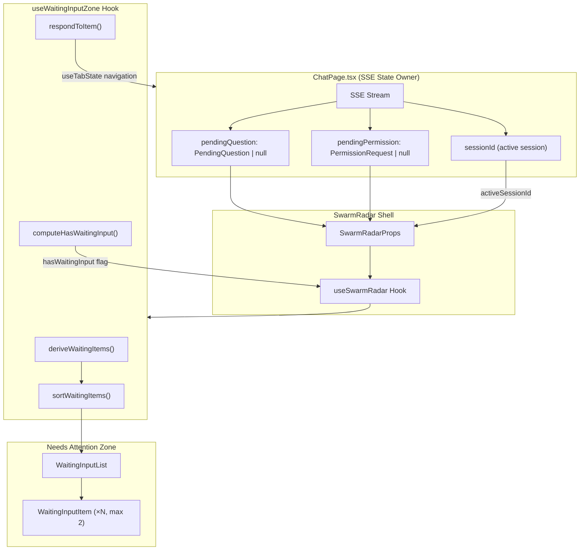
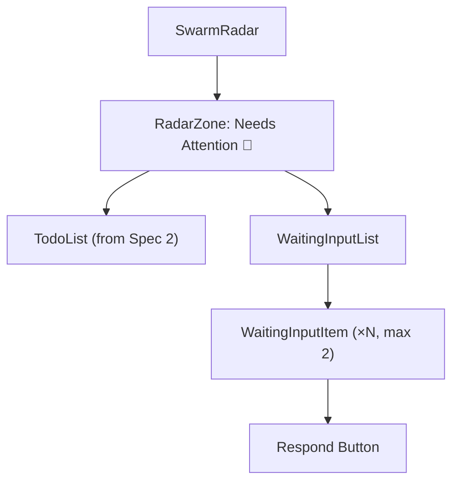

# Design Document — Swarm Radar Waiting Input (Sub-Spec 3 of 5)

## Overview

The Swarm Radar Waiting Input spec implements the Waiting Input sub-section within the Needs Attention zone of the Swarm Radar. It surfaces pending questions and permission requests from SSE events as actionable items, enabling users to quickly unblock AI agents that are waiting for human input.

This is a pure frontend spec — no backend changes are required. All data is derived from SSE props (`pendingQuestion` and `pendingPermission`) passed from `ChatPage` to `SwarmRadar`. Waiting items are ephemeral — they exist only during the active SSE session and disappear on page reload.

### Key Design Decisions

1. **Ephemeral derivation** — Waiting items are derived from SSE props via a pure function, not persisted in DB or fetched from an API. The agent re-asks if the question is still relevant after a reload.
2. **`activeSessionId` correlation** — `ChatPage` passes the active session's `sessionId` as a new prop to `SwarmRadar`. The `useWaitingInputZone` hook matches this against WIP tasks' `sessionId` to look up task titles and set `hasWaitingInput` on the matching WIP task (PE Finding #3).
3. **Stable `createdAt`** — Uses the matched WIP task's `startedAt` as a stable proxy for creation time, NOT `Date.now()` at derivation time (PE Finding #1).
4. **Max 2 items** — Initial release produces at most 2 `RadarWaitingItem` objects (one from `pendingQuestion`, one from `pendingPermission`). Array type for extensibility (PE Finding #2).
5. **Dual presence** — A WIP task with `hasWaitingInput=true` appears in both the In Progress zone (as a WIP task) and the Needs Attention zone (as a Waiting Input item).
6. **"Respond" navigates, doesn't answer** — Clicking "Respond" switches to the chat thread tab where the pending question is displayed inline. The user answers in the chat, not in the Radar.
7. **Exported pure function** — The hook exports `deriveWaitingItems` as a pure function for direct unit and property-based testing without React rendering.

### Design Principles Alignment

| Principle | How Waiting Input Implements It |
|-----------|-------------------------------|
| Human Review Gates Are Essential | Surfaces only decisions that block AI execution |
| Chat is the Command Surface | "Respond" navigates to the chat thread for answering |
| Visible Planning Builds Trust | WIP tasks with `hasWaitingInput=true` show the agent is blocked |
| Progressive Disclosure | Waiting items appear only when SSE events produce them; disappear when resolved |
| Glanceable Awareness | Waiting items in Needs Attention zone provide instant visibility into blocked agents |

### Dependencies

- **Spec 1 (`swarm-radar-foundation`)**: `RadarWaitingItem` type, `RadarWipTask` type, `sortWaitingItems` utility, `RadarZone` component, `SwarmRadar` shell (accepts `pendingQuestion`/`pendingPermission` props), CSS styles, empty state support.
- **Spec 2 (`swarm-radar-todos`)**: `SwarmRadar` integration in `ChatPage` (props already wired), `useTodoZone` hook, `radar.ts` service layer.
- **Existing code**: `PendingQuestion` type (`desktop/src/pages/chat/types.ts`), `PermissionRequest` type (`desktop/src/types/index.ts`), `useTabState` hook (`desktop/src/hooks/useTabState.ts`), `AskUserQuestion` type.

## Architecture

### Data Flow



### Component Hierarchy (Waiting Input Scope)



### File Structure

```
desktop/src/pages/chat/components/radar/
├── WaitingInputList.tsx                    # WaitingInputList + WaitingInputItem components
├── hooks/
│   └── useWaitingInputZone.ts              # Hook + exported deriveWaitingItems pure function
└── __tests__/
    └── waitingInput.property.test.ts       # Property-based tests (7 properties)
```

### Integration Points

1. **`SwarmRadarProps` extension** — Add `activeSessionId: string | undefined` prop (Spec 1 already accepts `pendingQuestion`/`pendingPermission`).
2. **`UseSwarmRadarParams` extension** — Add `activeSessionId: string | undefined` to the hook params interface.
3. **`ChatPage.tsx`** — Pass `sessionId` state variable as `activeSessionId` prop to `SwarmRadar`.
4. **`useSwarmRadar` composition** — Compose `useWaitingInputZone` inside `useSwarmRadar`, passing its outputs to the Needs Attention zone and augmenting WIP tasks with `hasWaitingInput`.


## Components and Interfaces

### SwarmRadarProps Extension

The `SwarmRadarProps` interface (defined in Spec 1) is extended with the `activeSessionId` prop:

```typescript
// Addition to existing SwarmRadarProps in SwarmRadar.tsx
interface SwarmRadarProps {
  width: number;
  isResizing: boolean;
  onClose?: () => void;
  onMouseDown: (e: React.MouseEvent) => void;
  pendingQuestion: PendingQuestion | null;      // Already defined in Spec 1
  pendingPermission: PermissionRequest | null;  // Already defined in Spec 1
  activeSessionId: string | undefined;          // NEW — PE Finding #3 fix
}
```

### ChatPage Integration

```tsx
// In ChatPage.tsx — pass sessionId as activeSessionId
<SwarmRadar
  width={...}
  isResizing={...}
  onClose={...}
  onMouseDown={...}
  pendingQuestion={pendingQuestion}
  pendingPermission={pendingPermission}
  activeSessionId={sessionId}
/>
```

### WaitingInputList Component

**File:** `desktop/src/pages/chat/components/radar/WaitingInputList.tsx`

```typescript
interface WaitingInputListProps {
  waitingItems: RadarWaitingItem[];
  onRespond: (itemId: string) => void;
}
```

Responsibilities:
- Renders a list of `WaitingInputItem` components in the order provided (pre-sorted by `useWaitingInputZone`)
- Uses `role="list"` for screen reader compatibility
- Does not render if `waitingItems` is empty (no empty sub-section message — the zone-level empty state handles the fully-empty case per Req 1.7)

### WaitingInputItem Component

Rendered inline within `WaitingInputList.tsx` (not a separate file — it's small enough to colocate).

```typescript
interface WaitingInputItemProps {
  item: RadarWaitingItem;
  onRespond: () => void;
}
```

Responsibilities:
- Renders task title in `--color-text`
- Renders question text in `--color-text-muted` (already truncated to 200 chars by derivation hook)
- Renders a visually prominent "Respond" button (not hidden behind hover menu — Req 6.5)
- Uses `role="listitem"` for screen reader compatibility
- Focusable via Tab key; "Respond" button accessible via Enter or Space (Req 7.6)
- Uses `clsx` for conditional class composition
- Uses CSS variables only — no hardcoded colors

### useWaitingInputZone Hook

**File:** `desktop/src/pages/chat/components/radar/hooks/useWaitingInputZone.ts`

```typescript
interface UseWaitingInputZoneParams {
  pendingQuestion: PendingQuestion | null;
  pendingPermission: PermissionRequest | null;
  activeSessionId: string | undefined;
  wipTasks: RadarWipTask[];
}

interface UseWaitingInputZoneReturn {
  waitingItems: RadarWaitingItem[];
  respondToItem: (itemId: string) => void;
}
```

Responsibilities:
- Derives `RadarWaitingItem[]` from input props via `useMemo`
- Applies `sortWaitingItems` (from Spec 1) to the derived array
- Provides `respondToItem` action handler that uses `useTabState` to navigate to the chat thread
- Exports `deriveWaitingItems` as a pure function for testing

### deriveWaitingItems Pure Function

```typescript
/**
 * Pure derivation function — no side effects, no API calls, no state mutations.
 * Exported for direct unit and property-based testing.
 */
export function deriveWaitingItems(
  pendingQuestion: PendingQuestion | null,
  pendingPermission: PermissionRequest | null,
  activeSessionId: string | undefined,
  wipTasks: RadarWipTask[]
): RadarWaitingItem[];
```

Derivation logic:

1. Find the matching WIP task: `wipTasks.find(t => t.sessionId === activeSessionId)` (may be `undefined`)
2. If `pendingQuestion` is not null, create a `RadarWaitingItem`:
   - `id` = `pendingQuestion.toolUseId`
   - `title` = matched task's `title` ?? `"Agent Question"`
   - `agentId` = matched task's `agentId` ?? `""`
   - `sessionId` = `activeSessionId ?? null`
   - `question` = `truncate(pendingQuestion.questions[0]?.question ?? "Pending question", 200)`
   - `createdAt` = matched task's `startedAt` ?? `new Date().toISOString()` (stable proxy per PE Finding #1)
3. If `pendingPermission` is not null, create a `RadarWaitingItem`:
   - `id` = `pendingPermission.requestId`
   - `title` = matched task's `title` ?? `"Permission Required"`
   - `agentId` = matched task's `agentId` ?? `""`
   - `sessionId` = `activeSessionId ?? null`
   - `question` = `truncate(pendingPermission.reason, 200)`
   - `createdAt` = matched task's `startedAt` ?? `new Date().toISOString()` (same strategy)
4. Return the array (0, 1, or 2 items) sorted by `sortWaitingItems`

### computeHasWaitingInput Utility

```typescript
/**
 * Computes hasWaitingInput for a WIP task.
 * Returns true iff the task's sessionId matches activeSessionId
 * AND at least one of pendingQuestion/pendingPermission is non-null.
 */
export function computeHasWaitingInput(
  task: RadarWipTask,
  activeSessionId: string | undefined,
  pendingQuestion: PendingQuestion | null,
  pendingPermission: PermissionRequest | null
): boolean {
  if (!activeSessionId) return false;
  if (task.sessionId !== activeSessionId) return false;
  return pendingQuestion !== null || pendingPermission !== null;
}
```

This function is used by `useSwarmRadar` (or `useWaitingInputZone`) to augment WIP tasks with the `hasWaitingInput` flag before passing them to the In Progress zone.

### truncate Utility

```typescript
/**
 * Truncates a string to maxLength characters.
 * If the string exceeds maxLength, appends "..." and the total length is maxLength.
 */
function truncate(text: string, maxLength: number): string {
  if (text.length <= maxLength) return text;
  return text.slice(0, maxLength - 3) + '...';
}
```

### respondToItem Action

The `respondToItem` handler uses the existing `useTabState` hook to navigate to the chat thread:

```typescript
const respondToItem = useCallback((itemId: string) => {
  // Find the waiting item to get its sessionId
  const item = waitingItems.find(w => w.id === itemId);
  if (!item?.sessionId) return;

  // Find or open the tab for this session
  const existingTab = openTabs.find(t => t.sessionId === item.sessionId);
  if (existingTab) {
    setActiveTab(existingTab.id);
  } else {
    // Open a new tab for this session
    const newTab = createTab();
    updateTabSessionId(newTab.id, item.sessionId);
    setActiveTab(newTab.id);
  }
}, [waitingItems, openTabs, setActiveTab, createTab, updateTabSessionId]);
```


## Data Models

### Input Types (Existing — Not Modified)

These types already exist in the codebase and are consumed as-is:

```typescript
// desktop/src/pages/chat/types.ts
interface PendingQuestion {
  toolUseId: string;
  questions: AskUserQuestionType[];  // AskUserQuestion[]
}

// desktop/src/types/index.ts
interface AskUserQuestion {
  question: string;
  header: string;
  options: AskUserQuestionOption[];
  multiSelect: boolean;
}

// desktop/src/types/index.ts
interface PermissionRequest {
  requestId: string;
  toolName: string;
  toolInput: Record<string, unknown>;
  reason: string;
  options: string[];
}
```

### Output Types (Defined in Spec 1 — Used Here)

```typescript
// desktop/src/types/radar.ts (already defined in Spec 1)
interface RadarWaitingItem {
  id: string;                    // pendingQuestion.toolUseId or pendingPermission.requestId
  title: string;                 // Matched WIP task title, or fallback
  agentId: string;               // Matched WIP task agentId, or ""
  sessionId: string | null;      // activeSessionId
  question: string;              // Truncated to 200 chars
  createdAt: string;             // ISO 8601 — task's startedAt as stable proxy
}

// desktop/src/types/radar.ts (already defined in Spec 1)
type RadarWipTask = Pick<Task, ...> & {
  hasWaitingInput: boolean;      // Computed by computeHasWaitingInput()
};
```

### Derivation Mapping Table

| Source | RadarWaitingItem Field | Value |
|--------|----------------------|-------|
| `pendingQuestion` | `id` | `pendingQuestion.toolUseId` |
| `pendingQuestion` | `title` | matched task `title` ?? `"Agent Question"` |
| `pendingQuestion` | `agentId` | matched task `agentId` ?? `""` |
| `pendingQuestion` | `sessionId` | `activeSessionId ?? null` |
| `pendingQuestion` | `question` | `truncate(pendingQuestion.questions[0]?.question ?? "Pending question", 200)` |
| `pendingQuestion` | `createdAt` | matched task `startedAt` ?? captured timestamp |
| `pendingPermission` | `id` | `pendingPermission.requestId` |
| `pendingPermission` | `title` | matched task `title` ?? `"Permission Required"` |
| `pendingPermission` | `agentId` | matched task `agentId` ?? `""` |
| `pendingPermission` | `sessionId` | `activeSessionId ?? null` |
| `pendingPermission` | `question` | `truncate(pendingPermission.reason, 200)` |
| `pendingPermission` | `createdAt` | matched task `startedAt` ?? captured timestamp |

### hasWaitingInput Derivation Truth Table

| `activeSessionId` | `task.sessionId` matches? | `pendingQuestion` | `pendingPermission` | `hasWaitingInput` |
|---|---|---|---|---|
| `undefined` | N/A | any | any | `false` |
| defined | no | any | any | `false` |
| defined | yes | `null` | `null` | `false` |
| defined | yes | non-null | `null` | `true` |
| defined | yes | `null` | non-null | `true` |
| defined | yes | non-null | non-null | `true` |

### Waiting Item Count Constraints

| `pendingQuestion` | `pendingPermission` | Item Count |
|---|---|---|
| `null` | `null` | 0 |
| non-null | `null` | 1 |
| `null` | non-null | 1 |
| non-null | non-null | 2 |

Maximum: 2 items in initial release (PE Finding #2).


## Correctness Properties

*A property is a characteristic or behavior that should hold true across all valid executions of a system — essentially, a formal statement about what the system should do. Properties serve as the bridge between human-readable specifications and machine-verifiable correctness guarantees.*

The following 7 properties are derived from the acceptance criteria prework analysis. Each property is universally quantified and maps directly to one or more acceptance criteria.

### Property 1: Waiting Input sort ordering by creation time (with id tiebreaker)

*For any* list of `RadarWaitingItem` objects with arbitrary `createdAt` timestamps and `id` values, the `sortWaitingItems` function SHALL produce a list ordered by `createdAt` ascending (oldest first). When two items have identical `createdAt` values, the item with the lexicographically smaller `id` SHALL come first. Sorting the same input twice SHALL produce identical output (idempotence). No two distinct items SHALL have ambiguous relative ordering — the `id` tiebreaker guarantees a total order.

Reasoning: The sort function is defined in Spec 1, but this property validates the integration — that the `useWaitingInputZone` hook applies `sortWaitingItems` correctly and the output is always sorted. We generate random arrays of `RadarWaitingItem` with arbitrary `createdAt` and `id` values and verify the sort invariant holds.

**Validates: Requirements 1.5, 2.5**

### Property 2: hasWaitingInput derivation is correct for all input combinations

*For any* set of WIP tasks with arbitrary `sessionId` values, and *for any* `activeSessionId` value (including `undefined`), and *for any* combination of `pendingQuestion` (null or non-null) and `pendingPermission` (null or non-null):
- A WIP task SHALL have `hasWaitingInput = true` if and only if its `sessionId` equals `activeSessionId` AND at least one of `pendingQuestion` or `pendingPermission` is not null.
- The count of WIP tasks with `hasWaitingInput = true` SHALL be at most 1 (since only one task can match the single `activeSessionId`), or 0 if no task matches or both pending props are null.
- When `activeSessionId` is `undefined`, ALL WIP tasks SHALL have `hasWaitingInput = false`.

Reasoning: This collapses Requirements 3.1–3.5 into a single universally quantified property. We generate random WIP task arrays with varied sessionIds, random activeSessionId values, and random pending prop states. The `computeHasWaitingInput` function is applied to each task and we verify the truth table holds for every combination.

**Validates: Requirements 3.1, 3.2, 3.3, 3.4, 3.5**

### Property 3: Waiting item derivation produces correct count and id mapping

*For any* combination of `pendingQuestion` (null or non-null with arbitrary `toolUseId`) and `pendingPermission` (null or non-null with arbitrary `requestId`), and *for any* `activeSessionId` and WIP task set:
- When both are null, the derived `RadarWaitingItem[]` SHALL be empty (length 0).
- When only `pendingQuestion` is non-null, the derived array SHALL have exactly 1 item with `id` equal to `pendingQuestion.toolUseId`.
- When only `pendingPermission` is non-null, the derived array SHALL have exactly 1 item with `id` equal to `pendingPermission.requestId`.
- When both are non-null, the derived array SHALL have exactly 2 items — one with `id` equal to `pendingQuestion.toolUseId` and one with `id` equal to `pendingPermission.requestId`.
- The maximum length of the derived array SHALL be 2.

Reasoning: We generate random `PendingQuestion` and `PermissionRequest` objects (or null) with arbitrary IDs, random WIP tasks, and random activeSessionId. We call `deriveWaitingItems` and verify the count and id mapping invariants.

**Validates: Requirements 1.8, 2.1, 2.2, 2.3, 2.4**

### Property 4: Waiting item question text truncation

*For any* `pendingQuestion` with a `questions[0].question` string of arbitrary length, the derived `RadarWaitingItem.question` SHALL have length at most 200 characters. If the original question is 200 characters or fewer, the derived question SHALL equal the original. If the original question exceeds 200 characters, the derived question SHALL be exactly 200 characters (first 197 characters plus "..."). The same truncation rule SHALL apply to `pendingPermission.reason`.

Reasoning: We generate random strings of varying lengths (0 to 1000+ characters) as question text and permission reasons. We call `deriveWaitingItems` and verify the truncation invariant on the output `question` field.

**Validates: Requirements 1.3, 1.4, 2.2, 2.3**

### Property 5: Waiting items disappear when pending props become null

*For any* non-null `pendingQuestion` that produces a `RadarWaitingItem`, when `pendingQuestion` transitions to null (question answered), the re-derived `RadarWaitingItem[]` SHALL NOT contain an item with the previous `pendingQuestion.toolUseId` as its `id`. The same property SHALL hold for `pendingPermission` transitioning to null. This validates the automatic cleanup behavior — since `deriveWaitingItems` is a pure function of its inputs, setting a pending prop to null removes the corresponding item.

Reasoning: We generate a non-null `pendingQuestion`, call `deriveWaitingItems` to get the "before" array, then call it again with `pendingQuestion = null` to get the "after" array. We verify the item with the original `toolUseId` is absent from the "after" array. Same for `pendingPermission`.

**Validates: Requirements 5.5, 5.6**

### Property 6: Dual presence — hasWaitingInput implies corresponding RadarWaitingItem exists

*For any* WIP task where `computeHasWaitingInput` returns `true`, there SHALL exist exactly one `RadarWaitingItem` in the derived waiting items array whose `sessionId` matches the task's `sessionId`. Conversely, *for any* `RadarWaitingItem` in the derived array, there SHALL be at most one WIP task whose `sessionId` matches the item's `sessionId`. If no WIP task matches, the waiting item still exists but with fallback title/agentId values.

Reasoning: We generate random WIP tasks, random pending props, and random activeSessionId. We compute `hasWaitingInput` for each task and derive the waiting items array. For every task with `hasWaitingInput=true`, we verify a matching waiting item exists. For every waiting item, we verify at most one matching WIP task.

**Validates: Requirements 3.6, 2.2, 2.3**

### Property 7: Derivation is a pure function of inputs

*For any* identical set of inputs (`pendingQuestion`, `pendingPermission`, `activeSessionId`, `wipTasks`), the `deriveWaitingItems` function SHALL produce deeply equal output. Calling the function multiple times with the same inputs SHALL be idempotent — no side effects, no state mutations, no accumulated changes.

Reasoning: We generate random inputs, call `deriveWaitingItems` twice with the same inputs, and verify the outputs are deeply equal. This validates purity and determinism.

**Validates: Requirements 2.6, 8.4**


## Error Handling

Since this spec involves pure derivation from props (no API calls, no DB access), error handling is minimal:

| Scenario | Behavior |
|----------|----------|
| `pendingQuestion.questions` is an empty array | `deriveWaitingItems` uses fallback question text: `"Pending question"`. No crash. |
| `pendingQuestion.questions[0].question` is empty string | Derived `question` field is empty string (within 200 char limit). Renders as empty text in WaitingInputItem. |
| `activeSessionId` is `undefined` | No WIP task match. Waiting items still derived with fallback `title` and empty `agentId`. `hasWaitingInput` is `false` for all WIP tasks. |
| No WIP task matches `activeSessionId` | Waiting items use fallback title ("Agent Question" / "Permission Required") and empty `agentId`. |
| `pendingQuestion` and `pendingPermission` both null | Empty waiting items array. Waiting Input sub-section does not render. Zone-level empty state shown if ToDos are also empty. |
| `respondToItem` called with unknown `itemId` | Handler finds no matching waiting item. No-op — no navigation, no error. |
| `respondToItem` called with item whose `sessionId` is null | Handler checks `sessionId` is truthy before navigating. No-op if null. |
| Tab for session already open | `respondToItem` switches to existing tab. No duplicate tab created. |
| Tab for session not open | `respondToItem` creates a new tab and sets its `sessionId`. |
| SSE disconnection (pending state lost) | `pendingQuestion`/`pendingPermission` become null in ChatPage state. Waiting items disappear from Needs Attention zone. Expected behavior — agent re-asks on session resume. |
| Page reload | All SSE-derived state resets to null. Waiting items array is empty. No stale data. |

## Testing Strategy

### Dual Testing Approach

This spec requires both unit tests and property-based tests for comprehensive coverage.

**Unit tests** verify specific examples, edge cases, and rendering:
- WaitingInputList renders items with title, question text, and Respond button
- WaitingInputList does not render when `waitingItems` is empty
- WaitingInputItem uses `--color-text` for title and `--color-text-muted` for question
- Respond button is visible (not behind hover menu)
- ARIA: `role="list"` on WaitingInputList, `role="listitem"` on each item
- Keyboard: Tab focuses items, Enter/Space activates Respond
- respondToItem navigates to existing tab when session tab is open
- respondToItem creates new tab when session tab is not open
- ChatPage passes `sessionId` as `activeSessionId` prop
- Waiting Input sub-section renders below ToDo sub-section in Needs Attention zone
- Fallback title "Agent Question" when no WIP task matches (pendingQuestion)
- Fallback title "Permission Required" when no WIP task matches (pendingPermission)
- Empty questions array produces "Pending question" fallback text

**Property-based tests** verify universal properties across all valid inputs:
- Sort ordering with createdAt ascending and id tiebreaker (Property 1)
- hasWaitingInput derivation correctness for all input combinations (Property 2)
- Waiting item count and id mapping (Property 3)
- Question text truncation to 200 characters (Property 4)
- Items disappear when pending props become null (Property 5)
- Dual presence consistency between hasWaitingInput and waiting items (Property 6)
- Derivation purity/idempotence (Property 7)

### Property-Based Testing Configuration

- **Library**: `fast-check` (already available in the project's test dependencies)
- **Test runner**: Vitest (`cd desktop && npm test -- --run`)
- **Minimum iterations**: 100 per property test
- **Tag format**: Each property test includes a comment referencing the design property:
  ```typescript
  // Feature: swarm-radar-waiting-input, Property 1: Waiting Input sort ordering by creation time (with id tiebreaker)
  ```
- Each correctness property is implemented by a SINGLE property-based test

### Test File Organization

```
desktop/src/pages/chat/components/radar/__tests__/
└── waitingInput.property.test.ts    # All 7 properties for this spec
```

All 7 properties are colocated in a single test file because they all test the same derivation logic (`deriveWaitingItems` and `computeHasWaitingInput`).

### Property-to-Test Mapping

| Property | Test File | Min Iterations | What It Verifies |
|----------|-----------|---------------|-----------------|
| 1: Sort ordering | waitingInput.property.test.ts | 100 | createdAt ascending, id tiebreaker, idempotence |
| 2: hasWaitingInput derivation | waitingInput.property.test.ts | 100 | Truth table for all sessionId/pending combinations |
| 3: Count and id mapping | waitingInput.property.test.ts | 100 | 0/1/2 items with correct ids, max 2 |
| 4: Truncation | waitingInput.property.test.ts | 100 | question ≤ 200 chars, preserves short strings, truncates long |
| 5: Disappearance on null | waitingInput.property.test.ts | 100 | Item removed when pending prop becomes null |
| 6: Dual presence | waitingInput.property.test.ts | 100 | hasWaitingInput=true ↔ matching waiting item exists |
| 7: Purity | waitingInput.property.test.ts | 100 | Same inputs → same outputs, no side effects |

### Unit Test Coverage (Examples and Edge Cases)

| Test | Type | What It Verifies |
|------|------|-----------------|
| WaitingInputList renders items with title and question | Example | Req 1.3, 1.4, 7.3 |
| WaitingInputList does not render when empty | Example | Req 1.7 |
| Respond button is always visible (not hover-only) | Example | Req 6.5 |
| ARIA: role="list" and role="listitem" present | Example | Req 7.7 |
| Keyboard: Tab + Enter activates Respond | Example | Req 7.6 |
| respondToItem switches to existing tab | Example | Req 6.3 |
| respondToItem creates new tab for unknown session | Example | Req 6.3 |
| ChatPage passes sessionId as activeSessionId | Example | Req 4.2 |
| Fallback title "Agent Question" when no task match | Example | Req 2.2 |
| Fallback title "Permission Required" for permission | Example | Req 2.3 |
| Empty questions array → "Pending question" fallback | Example | Req 2.2 |
| Waiting Input renders below ToDo sub-section | Example | Req 1.1 |
| Zone empty state when no todos and no waiting items | Example | Req 1.6 |

### fast-check Arbitrary Generators

The property tests will use custom `fast-check` arbitraries:

```typescript
// Arbitrary for PendingQuestion
const arbPendingQuestion = fc.record({
  toolUseId: fc.uuid(),
  questions: fc.array(
    fc.record({
      question: fc.string({ minLength: 0, maxLength: 500 }),
      header: fc.string(),
      options: fc.constant([]),
      multiSelect: fc.boolean(),
    }),
    { minLength: 0, maxLength: 3 }
  ),
});

// Arbitrary for PermissionRequest
const arbPermissionRequest = fc.record({
  requestId: fc.uuid(),
  toolName: fc.string({ minLength: 1, maxLength: 50 }),
  toolInput: fc.constant({}),
  reason: fc.string({ minLength: 0, maxLength: 500 }),
  options: fc.array(fc.string(), { minLength: 0, maxLength: 3 }),
});

// Arbitrary for RadarWipTask (minimal fields needed for derivation)
const arbWipTask = fc.record({
  id: fc.uuid(),
  sessionId: fc.option(fc.uuid(), { nil: null }),
  title: fc.string({ minLength: 1, maxLength: 100 }),
  agentId: fc.uuid(),
  startedAt: fc.date({ min: new Date('2024-01-01'), max: new Date('2025-12-31') })
    .map(d => d.toISOString()),
  // ... other required Pick<Task, ...> fields with sensible defaults
  hasWaitingInput: fc.constant(false), // Will be recomputed
});

// Arbitrary for RadarWaitingItem (for sort tests)
const arbWaitingItem = fc.record({
  id: fc.uuid(),
  title: fc.string({ minLength: 1, maxLength: 100 }),
  agentId: fc.uuid(),
  sessionId: fc.option(fc.uuid(), { nil: null }),
  question: fc.string({ minLength: 0, maxLength: 200 }),
  createdAt: fc.date({ min: new Date('2024-01-01'), max: new Date('2025-12-31') })
    .map(d => d.toISOString()),
});
```
