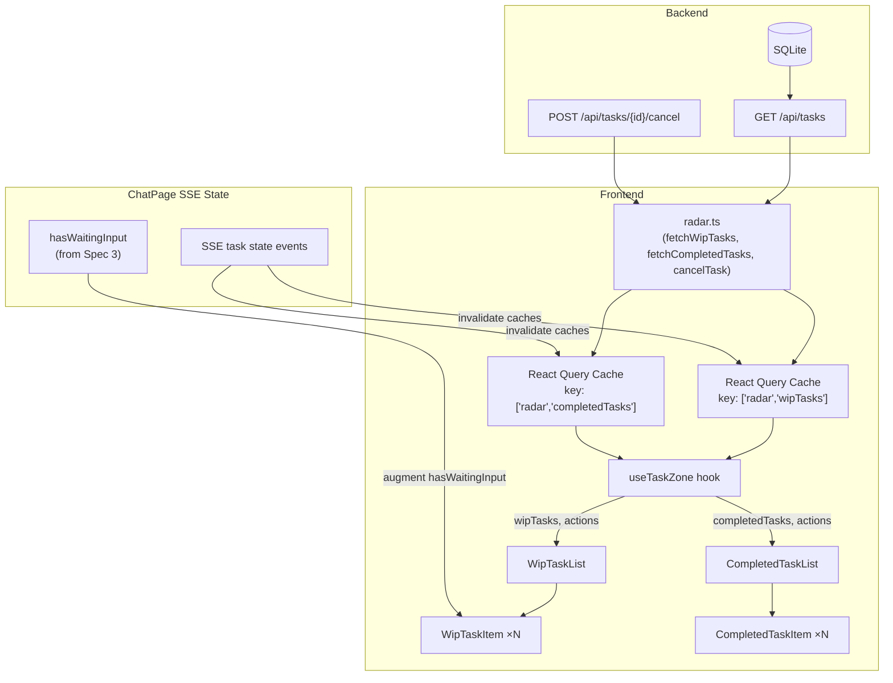
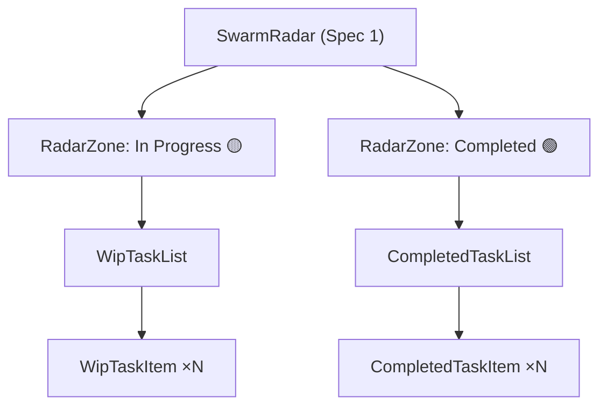
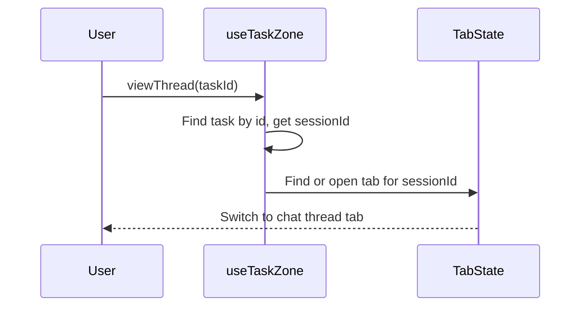

<!-- STALE REFERENCES: This spec references code that has since been refactored or removed:
- ContextPreviewPanel → REMOVED (was planned for future project detail view, never rendered in production)
- useTabState / tabStateRef / saveTabState → SUPERSEDED by useUnifiedTabState hook
- saveCurrentTab → REMOVED (was a no-op in useUnifiedTabState)
This spec is preserved as a historical record of the design decisions made at the time. -->

# Design Document — Swarm Radar WIP & Completed Tasks (Sub-Spec 4 of 5)

## Overview

This design covers the WIP Tasks and Completed Tasks layers of the Swarm Radar — the In Progress zone display, Completed zone display, 7-day archive window enforcement, backend task query extensions, frontend task service layer additions, the `useTaskZone` state management hook, polling-based real-time updates, and the optimistic update pattern for task actions. It builds on the foundation from Spec 1 (`swarm-radar-foundation`), the ToDo infrastructure from Spec 2 (`swarm-radar-todos`), and the Waiting Input derivation from Spec 3 (`swarm-radar-waiting-input`).

The WIP & Completed layer transforms the In Progress and Completed zones from placeholders into fully functional displays where users can monitor executing tasks, cancel WIP tasks, view execution threads, and review recently completed work — all without leaving the chat surface.

### Scope

- **WipTaskList / WipTaskItem** — Display and sort active WIP tasks with status indicators, elapsed time, and overflow action menu
- **CompletedTaskList / CompletedTaskItem** — Display recently completed tasks within the 7-day archive window with completion timestamps and overflow action menu
- **Click-to-Chat actions** — "View Thread" (WIP and Completed), "Cancel" (WIP), "Resume" (Completed)
- **Backend extensions** — `completed_after` query parameter, `review_required`/`review_risk_level` fields on TaskResponse, comma-separated status filtering with OR semantics
- **radar.ts service additions** — `fetchWipTasks`, `fetchCompletedTasks`, `cancelTask` with `toCamelCase` conversion
- **useTaskZone hook** — React Query polling (30s), archive window filtering, optimistic updates for cancel
- **radarConstants.ts** — `ARCHIVE_WINDOW_DAYS`, `TASK_POLLING_INTERVAL_MS` constants
- **SSE-triggered cache invalidation** — Immediate refresh on task state change events

### Dependencies (from Earlier Specs)

| Artifact | Location | Used For |
|----------|----------|----------|
| `RadarWipTask` type | `desktop/src/types/radar.ts` | WIP task data shape |
| `RadarCompletedTask` type | `desktop/src/types/radar.ts` | Completed task data shape |
| `sortWipTasks()` | `radar/radarSortUtils.ts` | Deterministic WIP sort with id tiebreaker |
| `sortCompletedTasks()` | `radar/radarSortUtils.ts` | Deterministic completed sort with id tiebreaker |
| `RadarZone` component | `radar/RadarZone.tsx` | Collapsible zone wrapper |
| `SwarmRadar` shell | `radar/SwarmRadar.tsx` | Root component (receives zone children) |
| CSS styles | `radar/SwarmRadar.css` | All Radar visual styles |
| `radar.ts` service | `desktop/src/services/radar.ts` | Existing ToDo service (task functions added here) |
| `useTodoZone` hook pattern | `radar/hooks/useTodoZone.ts` | Hook pattern reference for `useTaskZone` |
| `hasWaitingInput` derivation | `radar/hooks/useWaitingInputZone.ts` | Augments WIP tasks with waiting indicator |
| `useTabState` hook | `desktop/src/hooks/useTabState.ts` | Tab management for View Thread / Resume actions |

### Design Principles Alignment

| Principle | How WIP & Completed Implements It |
|-----------|----------------------------------|
| Visible Planning Builds Trust | WIP tasks show execution state, agent name, elapsed time transparently |
| Chat is the Command Surface | "View Thread" and "Resume" navigate to chat threads for deep work |
| Progressive Disclosure | Hover-only action menus on task items, archive window auto-hides old completions |
| Glanceable Awareness | Status indicators, elapsed time, completion timestamps provide instant context |
| Human Review Gates | "Cancel" action on WIP tasks gives users control over agent execution |

### PE Review Findings Addressed

1. **Finding #5 (Error Handling, Medium)**: The optimistic update rollback strategy uses React Query's built-in `onMutate`/`onError`/`onSettled` pattern with `queryClient.cancelQueries` before mutation. This handles concurrent mutations correctly by canceling in-flight queries and using the `previousData` from `onMutate` context.

2. **Finding #6 (Determinism, Medium)**: All sort functions use `id` as the ultimate tiebreaker (defined in Spec 1 sorting utilities). The property tests in this spec validate the WIP task sort and completed task sort with the `id` tiebreaker.


## Architecture

### Data Flow



### Component Hierarchy (WIP & Completed Scope)



### File Structure (WIP & Completed Scope)

```
desktop/src/
├── services/
│   └── radar.ts                              # MODIFIED — add task-related functions
├── pages/chat/components/radar/
│   ├── WipTaskList.tsx                       # NEW — WIP task list component
│   ├── WipTaskItem.tsx                       # NEW — Single WIP task item with actions
│   ├── CompletedTaskList.tsx                 # NEW — Completed task list component
│   ├── CompletedTaskItem.tsx                 # NEW — Single completed task item with actions
│   ├── radarConstants.ts                     # NEW — ARCHIVE_WINDOW_DAYS, TASK_POLLING_INTERVAL_MS
│   ├── hooks/
│   │   └── useTaskZone.ts                    # NEW — Task zone state hook
│   └── __tests__/
│       ├── wipTaskFilter.property.test.ts    # NEW — Property 1
│       ├── archiveWindow.property.test.ts    # NEW — Properties 2, 7
│       └── taskTransitions.property.test.ts  # NEW — Properties 3, 5, 6
backend/
├── schemas/
│   └── task.py                               # MODIFIED — add review_required, review_risk_level
├── routers/
│   └── tasks.py                              # MODIFIED — add completed_after, workspace_id, comma-separated status
└── tests/
    └── test_task_filtering.py                # NEW — Property 4
```

### Integration with SwarmRadar Shell

The `SwarmRadar` shell (Spec 1) renders the In Progress and Completed zones with placeholder children. This spec replaces those placeholders with real components:

```tsx
// Inside SwarmRadar.tsx — In Progress zone children (updated by this spec)
<RadarZone
  zoneId="inProgress"
  emoji="🟡"
  label="In Progress"
  count={wipTasks.length}
  badgeTint="yellow"
  isExpanded={zoneExpanded.inProgress}
  onToggle={() => toggleZone('inProgress')}
  emptyMessage="No tasks running. Start a ToDo or chat to kick things off."
>
  <WipTaskList
    tasks={wipTasks}
    onViewThread={viewThread}
    onCancel={cancelTask}
  />
</RadarZone>

// Inside SwarmRadar.tsx — Completed zone children (updated by this spec)
<RadarZone
  zoneId="completed"
  emoji="🟢"
  label="Completed"
  count={completedTasks.length}
  badgeTint="green"
  isExpanded={zoneExpanded.completed}
  onToggle={() => toggleZone('completed')}
  emptyMessage="No completed tasks in the last 7 days."
>
  <CompletedTaskList
    tasks={completedTasks}
    onViewThread={viewThread}
    onResume={resumeCompleted}
  />
</RadarZone>
```


## Components and Interfaces

### WipTaskList

**File:** `desktop/src/pages/chat/components/radar/WipTaskList.tsx`

```typescript
/**
 * Sorted list of active WIP task items within the In Progress zone.
 *
 * Exports:
 * - WipTaskList — Renders sorted RadarWipTask items, delegates actions to parent
 */

interface WipTaskListProps {
  tasks: RadarWipTask[];           // Pre-sorted, pre-filtered by useTaskZone
  onViewThread: (taskId: string) => void;
  onCancel: (taskId: string) => void;
}
```

Responsibilities:
- Renders a `<ul role="list">` containing one `WipTaskItem` per entry
- Receives pre-sorted, pre-filtered data from `useTaskZone` — no sorting logic here
- Passes per-item action callbacks to each `WipTaskItem`
- Uses `clsx` for conditional class composition
- Renders nothing (not even the `<ul>`) when `tasks.length === 0` — the parent `RadarZone` handles empty state

### WipTaskItem

**File:** `desktop/src/pages/chat/components/radar/WipTaskItem.tsx`

```typescript
/**
 * Single WIP task item with status indicator, elapsed time, and overflow action menu.
 *
 * Exports:
 * - WipTaskItem — Renders one RadarWipTask with status, elapsed time, and ⋯ menu
 */

interface WipTaskItemProps {
  task: RadarWipTask;
  onViewThread: () => void;
  onCancel: () => void;
}
```

Responsibilities:
- Renders as `<li role="listitem" className="radar-wip-item">`
- Displays: task title (truncated to 1 line), execution status indicator (🔄 WIP (active), 📋 Draft (queued), 🚫 Blocked), elapsed time since start (computed from `startedAt`, e.g., "3m", "1h 20m"), progress hint (truncated from `description` field, 1 line)
- When `task.hasWaitingInput === true`: displays a ⏳ "Waiting" badge next to the status indicator
- Clicking the item body (outside the action menu) triggers `onViewThread`
- Shows `⋯` overflow button on hover (CSS `:hover` on the `<li>`) with `aria-label="Actions for {task.title}"`
- Overflow menu renders as a positioned `<div>` with 2 action buttons: "View Thread" and "Cancel"
- "Cancel" button triggers inline confirmation: replaces the menu with "Cancel this task?" + Confirm/Back buttons (same pattern as TodoItem in Spec 2)
- Uses `--color-text-primary`, `--color-text-muted`, `--color-border` CSS variables
- Blocked items get `className="radar-wip-item--blocked"` for visual emphasis
- Focusable via Tab key navigation, action menu accessible via Enter or Space

### CompletedTaskList

**File:** `desktop/src/pages/chat/components/radar/CompletedTaskList.tsx`

```typescript
/**
 * Sorted list of recently completed task items within the Completed zone.
 *
 * Exports:
 * - CompletedTaskList — Renders sorted RadarCompletedTask items, delegates actions to parent
 */

interface CompletedTaskListProps {
  tasks: RadarCompletedTask[];     // Pre-sorted, pre-filtered by useTaskZone
  onViewThread: (taskId: string) => void;
  onResume: (taskId: string) => void;
}
```

Responsibilities:
- Renders a `<ul role="list">` containing one `CompletedTaskItem` per entry
- Receives pre-sorted, pre-filtered data from `useTaskZone` — no sorting logic here
- Passes per-item action callbacks to each `CompletedTaskItem`
- Uses `clsx` for conditional class composition
- Renders nothing when `tasks.length === 0` — the parent `RadarZone` handles empty state

### CompletedTaskItem

**File:** `desktop/src/pages/chat/components/radar/CompletedTaskItem.tsx`

```typescript
/**
 * Single completed task item with completion timestamp and overflow action menu.
 *
 * Exports:
 * - CompletedTaskItem — Renders one RadarCompletedTask with timestamp and ⋯ menu
 */

interface CompletedTaskItemProps {
  task: RadarCompletedTask;
  onViewThread: () => void;
  onResume: () => void;
}
```

Responsibilities:
- Renders as `<li role="listitem" className="radar-completed-item">`
- Displays: task title (truncated to 1 line), completion timestamp (relative, e.g., "2h ago", "Yesterday", "3d ago"), agent name (from `agentId`), brief outcome summary (truncated to 1 line from `description` field)
- Clicking the item body (outside the action menu) triggers `onViewThread`
- Shows `⋯` overflow button on hover with `aria-label="Actions for {task.title}"`
- Overflow menu renders as a positioned `<div>` with 2 action buttons: "View Thread" and "Resume"
- "Resume" does not require inline confirmation (non-destructive action)
- Uses `--color-text-primary`, `--color-text-muted`, `--color-border` CSS variables
- Focusable via Tab key navigation, action menu accessible via Enter or Space

### Overflow Action Menu Pattern

The overflow menu follows the same local UI pattern established by `TodoItem` in Spec 2:

```typescript
// Internal state within WipTaskItem / CompletedTaskItem
const [menuOpen, setMenuOpen] = useState(false);
const [confirmAction, setConfirmAction] = useState<'cancel' | null>(null); // WipTaskItem only
```

- Menu opens on `⋯` button click, closes on outside click or Escape key
- Destructive actions ("Cancel" on WipTaskItem) set `confirmAction` state, which replaces the menu with a confirmation prompt
- Confirmation prompt: "Cancel this task?" with Confirm (red) and Back buttons
- Confirm executes the action; Back returns to the normal menu
- CompletedTaskItem has no destructive actions, so no confirmation state is needed

### Radar Constants

**File:** `desktop/src/pages/chat/components/radar/radarConstants.ts`

```typescript
/**
 * Shared constants for the Swarm Radar feature.
 *
 * Exports:
 * - ARCHIVE_WINDOW_DAYS          — Number of days completed tasks remain visible (default: 7)
 * - TASK_POLLING_INTERVAL_MS     — Polling interval for task data in milliseconds (default: 30000)
 */

/** Number of days completed tasks remain visible in the Completed zone. */
export const ARCHIVE_WINDOW_DAYS = 7;

/** Polling interval for WIP and completed task data (milliseconds). */
export const TASK_POLLING_INTERVAL_MS = 30_000;
```


## Service Layer

### radar.ts — Task Function Additions

**File:** `desktop/src/services/radar.ts` (additions to existing file from Spec 2)

The following functions are added alongside the existing ToDo functions:

```typescript
import type { RadarWipTask, RadarCompletedTask } from '../types';

/** Convert backend snake_case task response to frontend camelCase RadarWipTask. */
export function taskToCamelCase(task: Record<string, unknown>): RadarWipTask {
  return {
    id: task.id as string,
    workspaceId: (task.workspace_id as string) ?? null,
    agentId: task.agent_id as string,
    sessionId: (task.session_id as string) ?? null,
    status: task.status as RadarWipTask['status'],
    title: task.title as string,
    description: (task.description as string) ?? null,
    priority: (task.priority as string) ?? null,
    sourceTodoId: (task.source_todo_id as string) ?? null,
    model: (task.model as string) ?? null,
    createdAt: task.created_at as string,
    startedAt: (task.started_at as string) ?? null,
    error: (task.error as string) ?? null,
    hasWaitingInput: false, // Always false at service layer; computed by Spec 3's hook
  };
}

/** Convert backend snake_case task response to frontend camelCase RadarCompletedTask. */
export function completedTaskToCamelCase(task: Record<string, unknown>): RadarCompletedTask {
  return {
    id: task.id as string,
    workspaceId: (task.workspace_id as string) ?? null,
    agentId: task.agent_id as string,
    sessionId: (task.session_id as string) ?? null,
    title: task.title as string,
    description: (task.description as string) ?? null,
    priority: (task.priority as string) ?? null,
    completedAt: task.completed_at as string,
    reviewRequired: (task.review_required as boolean) ?? false,
    reviewRiskLevel: (task.review_risk_level as string) ?? null,
  };
}

// Added to the existing radarService object:
export const radarService = {
  // ... existing ToDo functions from Spec 2 ...

  /** Fetch WIP tasks (wip, draft, blocked) for a workspace. */
  async fetchWipTasks(workspaceId?: string): Promise<RadarWipTask[]> {
    const params = new URLSearchParams();
    params.append('status', 'wip,draft,blocked');
    if (workspaceId) params.append('workspace_id', workspaceId);

    const response = await api.get(`/tasks?${params.toString()}`);
    return response.data.map(taskToCamelCase);
  },

  /** Fetch completed tasks within the archive window. */
  async fetchCompletedTasks(workspaceId?: string, completedAfter?: string): Promise<RadarCompletedTask[]> {
    const params = new URLSearchParams();
    params.append('status', 'completed');
    if (workspaceId) params.append('workspace_id', workspaceId);
    if (completedAfter) params.append('completed_after', completedAfter);

    const response = await api.get(`/tasks?${params.toString()}`);
    return response.data.map(completedTaskToCamelCase);
  },

  /** Cancel a WIP task via the backend API. */
  async cancelTask(taskId: string): Promise<void> {
    await api.post(`/tasks/${taskId}/cancel`);
  },
};
```

The `taskToCamelCase` and `completedTaskToCamelCase` functions are exported for direct use in tests and by the `useTaskZone` hook. The `hasWaitingInput` field is always set to `false` at the service layer — the actual value is computed by Spec 3's `useWaitingInputZone` hook at the composition layer.

## State Management

### useTaskZone Hook

**File:** `desktop/src/pages/chat/components/radar/hooks/useTaskZone.ts`

```typescript
/**
 * React hook for task zone state management (In Progress + Completed zones).
 *
 * Encapsulates data fetching (React Query, 30s polling), WIP filtering,
 * archive window filtering, sorting, lifecycle actions with optimistic updates,
 * and SSE-triggered cache invalidation.
 *
 * Exports:
 * - useTaskZone — Hook returning sorted WIP tasks, sorted completed tasks,
 *                 loading state, and action handlers
 */

interface UseTaskZoneParams {
  workspaceId: string;
  isVisible: boolean;  // From rightSidebars.isActive('todoRadar')
}

interface UseTaskZoneReturn {
  wipTasks: RadarWipTask[];               // Sorted, active statuses only
  completedTasks: RadarCompletedTask[];   // Sorted, within archive window
  isLoading: boolean;
  viewThread: (taskId: string) => void;
  cancelTask: (taskId: string) => void;
  resumeCompleted: (taskId: string) => void;
}
```

Implementation details:

**Data Fetching — WIP Tasks:**
- React Query key: `['radar', 'wipTasks']`
- Polling interval: `TASK_POLLING_INTERVAL_MS` (30,000ms)
- Gated by `enabled: isVisible` — zero queries when sidebar is hidden
- `queryFn` calls `radarService.fetchWipTasks(workspaceId)`

**Data Fetching — Completed Tasks:**
- React Query key: `['radar', 'completedTasks']`
- Polling interval: `TASK_POLLING_INTERVAL_MS` (30,000ms)
- Gated by `enabled: isVisible` — zero queries when sidebar is hidden
- `queryFn` calls `radarService.fetchCompletedTasks(workspaceId, completedAfterISO)` where `completedAfterISO` is computed from `ARCHIVE_WINDOW_DAYS`

**Filtering & Sorting:**
- WIP tasks: Apply `sortWipTasks()` from Spec 1 to the query results (already filtered by status at the API level)
- Completed tasks: Filter client-side by `completedAt` within `ARCHIVE_WINDOW_DAYS`, then apply `sortCompletedTasks()` from Spec 1
- Both operations happen in `useMemo` derived from the query data

**Archive Window Filtering (Client-Side):**

```typescript
import { ARCHIVE_WINDOW_DAYS } from '../radarConstants';

function filterByArchiveWindow(tasks: RadarCompletedTask[]): RadarCompletedTask[] {
  const cutoff = new Date();
  cutoff.setDate(cutoff.getDate() - ARCHIVE_WINDOW_DAYS);
  const cutoffISO = cutoff.toISOString();
  return tasks.filter(t => t.completedAt >= cutoffISO);
}
```

Tasks exactly at the 7-day boundary are included. Tasks one millisecond past the boundary are excluded. The `completedAfter` server-side parameter provides a coarse pre-filter to reduce payload size; the client-side filter is the authoritative boundary.

**Optimistic Updates — Cancel Task (PE Finding #5):**

```
1. onMutate(taskId):
   - await queryClient.cancelQueries(['radar', 'wipTasks'])
   - previousData = queryClient.getQueryData(['radar', 'wipTasks'])
   - queryClient.setQueryData(['radar', 'wipTasks'], old =>
       old.filter(t => t.id !== taskId))
   - return { previousData }

2. onError(error, taskId, context):
   - queryClient.setQueryData(['radar', 'wipTasks'], context.previousData)
   - Show inline error to user

3. onSettled():
   - queryClient.invalidateQueries(['radar', 'wipTasks'])
   - queryClient.invalidateQueries(['radar', 'completedTasks'])
```

The `cancelQueries` call in `onMutate` prevents stale in-flight responses from overwriting the optimistic state. Each mutation's `onMutate` captures its own independent snapshot, so concurrent mutations are handled correctly.

**Action Handlers:**

| Action | API Call | Optimistic Cache Update | Post-Action |
|--------|----------|------------------------|-------------|
| `viewThread(taskId)` | N/A | N/A | Navigate to chat thread via `useTabState` using the task's `sessionId` |
| `cancelTask(taskId)` | `radarService.cancelTask(taskId)` | Remove task from `['radar', 'wipTasks']` cache | Invalidate both WIP and completed caches via `onSettled` |
| `resumeCompleted(taskId)` | Create new chat thread seeded with completion context | N/A | Navigate to new thread tab via `useTabState` |

**viewThread Flow:**



**SSE-Triggered Cache Invalidation:**

When `ChatPage` receives SSE events that affect task state (e.g., task completion, status change), it invalidates the relevant React Query cache keys:

```typescript
// In ChatPage.tsx or useSwarmRadar composition layer
const queryClient = useQueryClient();

// On SSE task state change event:
queryClient.invalidateQueries(['radar', 'wipTasks']);
queryClient.invalidateQueries(['radar', 'completedTasks']);
```

This triggers an immediate refresh rather than waiting for the next 30-second polling interval.


## Data Models

### Backend Schema Extensions

**File:** `backend/schemas/task.py`

Changes to existing `TaskResponse` model:

```python
class TaskResponse(BaseModel):
    """Task response model."""
    id: str
    agent_id: str
    session_id: Optional[str] = None
    status: TaskStatus
    title: str
    description: Optional[str] = None
    priority: Optional[str] = None
    source_todo_id: Optional[str] = None
    blocked_reason: Optional[str] = None
    model: Optional[str] = None
    created_at: datetime
    started_at: Optional[datetime] = None
    completed_at: Optional[datetime] = None
    error: Optional[str] = None
    work_dir: Optional[str] = None
    workspace_id: Optional[str] = None
    # NEW fields for Spec 4
    review_required: bool = False                    # Always false in initial release
    review_risk_level: Optional[str] = None          # Always null in initial release
```

The `review_required` and `review_risk_level` fields are always `false`/`null` in the initial release. The population mechanism for risk-assessment is deferred to a future spec.

### Backend Router Extensions

**File:** `backend/routers/tasks.py`

Changes to the `list_tasks` endpoint:

```python
@router.get("", response_model=list[TaskResponse])
async def list_tasks(
    status: Optional[str] = Query(None, description="Filter by status (comma-separated, OR semantics)"),
    agent_id: Optional[str] = Query(None, description="Filter by agent ID"),
    workspace_id: Optional[str] = Query(None, description="Filter by workspace ID"),
    completed_after: Optional[str] = Query(None, description="Filter completed tasks after ISO8601 date"),
):
    """List all tasks, optionally filtered.

    Status filter uses comma-separated values with OR semantics:
    ?status=wip,draft,blocked means (status=wip OR status=draft OR status=blocked).
    Different parameter types use AND semantics:
    ?status=completed&workspace_id=abc means (status=completed AND workspace_id=abc).
    """
    tasks = await task_manager.list_tasks(
        status=status,
        agent_id=agent_id,
        workspace_id=workspace_id,
        completed_after=completed_after,
    )
    return [TaskResponse(**task) for task in tasks]
```

The `task_manager.list_tasks` method is extended to support:
- `workspace_id` parameter for workspace-scoped queries
- `completed_after` parameter (ISO 8601 string) for archive window pre-filtering
- Comma-separated `status` values with OR semantics (e.g., `status=wip,draft,blocked`)

### Frontend Type Mapping — WIP Tasks

The `RadarWipTask` type is defined in Spec 1 at `desktop/src/types/radar.ts`. The `taskToCamelCase` function in `radar.ts` maps between backend snake_case and frontend camelCase:

| Backend (snake_case) | Frontend (camelCase) | Type |
|---------------------|---------------------|------|
| `id` | `id` | `string` |
| `workspace_id` | `workspaceId` | `string \| null` |
| `agent_id` | `agentId` | `string` |
| `session_id` | `sessionId` | `string \| null` |
| `status` | `status` | `TaskStatus` |
| `title` | `title` | `string` |
| `description` | `description` | `string \| null` |
| `priority` | `priority` | `string \| null` |
| `source_todo_id` | `sourceTodoId` | `string \| null` |
| `model` | `model` | `string \| null` |
| `created_at` | `createdAt` | `string` |
| `started_at` | `startedAt` | `string \| null` |
| `error` | `error` | `string \| null` |
| — | `hasWaitingInput` | `boolean` (always `false` at service layer) |

### Frontend Type Mapping — Completed Tasks

The `RadarCompletedTask` type is defined in Spec 1 at `desktop/src/types/radar.ts`. The `completedTaskToCamelCase` function maps:

| Backend (snake_case) | Frontend (camelCase) | Type |
|---------------------|---------------------|------|
| `id` | `id` | `string` |
| `workspace_id` | `workspaceId` | `string \| null` |
| `agent_id` | `agentId` | `string` |
| `session_id` | `sessionId` | `string \| null` |
| `title` | `title` | `string` |
| `description` | `description` | `string \| null` |
| `priority` | `priority` | `string \| null` |
| `completed_at` | `completedAt` | `string` |
| `review_required` | `reviewRequired` | `boolean` (always `false`) |
| `review_risk_level` | `reviewRiskLevel` | `string \| null` (always `null`) |

### Frontend Task Type Extension

**File:** `desktop/src/types/index.ts`

The existing `Task` interface needs `reviewRequired` and `reviewRiskLevel` added:

```typescript
export interface Task {
  // ... existing fields ...
  reviewRequired: boolean;          // NEW — always false in initial release
  reviewRiskLevel: string | null;   // NEW — always null in initial release
}
```

**File:** `desktop/src/services/tasks.ts`

The existing `toCamelCase` function needs the new fields:

```typescript
function toCamelCase(task: Record<string, unknown>): Task {
  return {
    // ... existing fields ...
    reviewRequired: (task.review_required as boolean) ?? false,
    reviewRiskLevel: (task.review_risk_level as string) ?? null,
  };
}
```


## Correctness Properties

*A property is a characteristic or behavior that should hold true across all valid executions of a system — essentially, a formal statement about what the system should do. Properties serve as the bridge between human-readable specifications and machine-verifiable correctness guarantees.*

The following 7 properties are derived from the acceptance criteria prework analysis. Each is universally quantified and maps to specific requirements. Redundant criteria were consolidated during the prework reflection phase — for example, WIP filtering (1.1) and WIP sorting (1.4, 8.5) are unified into Property 1; archive window filtering (3.1, 5.1, 5.2, 5.5) and completed sorting (3.3, 8.6) are unified into Property 2; and optimistic update criteria (2.5, 8.9, 9.2) are unified into Property 5.

### Property 1: WIP task filtering shows only active execution states and sorts correctly

*For any* set of tasks with mixed statuses (`draft`, `wip`, `blocked`, `completed`, `cancelled`), the WIP filter function SHALL return only tasks with status `wip`, `draft`, or `blocked`. No task with status `completed` or `cancelled` SHALL appear in the result. The count of returned tasks SHALL equal the count of `wip` + `draft` + `blocked` tasks in the input. All returned tasks SHALL have `hasWaitingInput === false` (set at the service layer). The `sortWipTasks` function SHALL order them: `blocked` first (needs attention), then `wip` (active), then `draft` (queued), with ties broken by start time (most recent first), then by `id` ascending as the ultimate tiebreaker (PE Finding #6). Sorting the same input twice SHALL produce identical output (idempotence).

**Validates: Requirements 1.1, 1.4, 7.6**

Reasoning: We generate random arrays of tasks with all 5 possible statuses. We filter to active statuses and verify: (1) only wip/draft/blocked pass, (2) count matches input subset, (3) hasWaitingInput is false on all, (4) sort order follows the multi-key comparator, (5) idempotence holds. This consolidates the WIP filtering criterion (1.1), the sort criterion (1.4), and the hasWaitingInput-at-service-layer invariant (7.6) into one comprehensive property.

### Property 2: Archive window filtering excludes tasks older than 7 days

*For any* set of completed tasks with varying `completedAt` timestamps, the archive window filter function SHALL return only tasks where `completedAt` is within the last `ARCHIVE_WINDOW_DAYS` days. Tasks exactly at the boundary SHALL be included. Tasks one millisecond past the boundary SHALL be excluded. The result SHALL be sorted by `completedAt` descending (most recent first), then by `id` ascending as the ultimate tiebreaker (PE Finding #6). The count of returned tasks SHALL equal the count of tasks within the archive window in the input. Sorting the same input twice SHALL produce identical output (idempotence).

**Validates: Requirements 3.1, 3.3, 5.1, 5.2**

Reasoning: We generate random arrays of completed tasks with `completedAt` timestamps spanning from well within the window to well outside it, including boundary cases. We apply the archive window filter and sort, then verify: (1) only tasks within the window pass, (2) boundary inclusion/exclusion is correct, (3) sort order is completedAt desc → id asc, (4) idempotence holds. This consolidates four archive-window-related criteria into one property.

### Property 3: Task status changes produce correct zone placement (WIP to Completed transition)

*For any* WIP task that transitions from an active status (`wip`, `draft`, `blocked`) to `completed` status, the task SHALL no longer appear in the WIP filter result and SHALL appear in the completed filter result (assuming `completedAt` is within the archive window). *For any* WIP task that transitions to `cancelled` status, the task SHALL no longer appear in the WIP filter result and SHALL NOT appear in the completed filter result. The WIP filter and completed filter SHALL be mutually exclusive — no task SHALL appear in both results simultaneously.

**Validates: Requirements 9.6, 2.4**

Reasoning: We generate random WIP tasks and simulate status transitions (to `completed` or `cancelled`). For each transition, we apply both the WIP filter and the completed filter and verify: (1) the task is absent from the WIP result, (2) completed tasks appear in the completed result (if within archive window), (3) cancelled tasks appear in neither, (4) no task appears in both filters simultaneously. This validates the zone placement invariant.

### Property 4: Backend task filtering returns only matching records

*For any* set of tasks in the database with mixed statuses and completion dates, querying with `status=wip,draft,blocked` SHALL return only tasks with those statuses. Querying with `status=completed&completed_after=<date>` SHALL return only tasks with `completed` status AND `completed_at` after the specified date. The comma-separated status filter SHALL use OR semantics (a task matches if its status is any of the listed values). The `completed_after` filter SHALL use AND semantics with the status filter. No task outside the filter criteria SHALL appear in the result.

**Validates: Requirements 6.1, 6.4, 6.7**

Reasoning: We generate random task sets with all 5 statuses and random completion dates. We apply the backend filter with various status combinations and `completed_after` values. We verify: (1) OR semantics within comma-separated status values, (2) AND semantics across different parameter types, (3) `completed_after` correctly filters by date, (4) no false positives. This is a backend property test using pytest + hypothesis.

### Property 5: Optimistic cancel removes task from WIP and invalidates both caches

*For any* WIP task list and any task within that list, the optimistic cancel operation SHALL immediately remove the task from the `['radar', 'wipTasks']` cache. The resulting cache SHALL contain all original tasks except the cancelled one. On API failure, the cache SHALL be restored to the exact `previousData` snapshot captured in `onMutate`. On success, both `['radar', 'wipTasks']` and `['radar', 'completedTasks']` caches SHALL be invalidated. The `queryClient.cancelQueries` call in `onMutate` SHALL prevent stale in-flight responses from overwriting the optimistic state (PE Finding #5).

**Validates: Requirements 2.4, 2.5, 8.9**

Reasoning: We generate random WIP task arrays and pick a random task to cancel. We simulate the optimistic update by removing the task from the array and verify: (1) the task is absent from the result, (2) all other tasks remain, (3) the result length is original length minus 1, (4) restoring from the snapshot produces the original array. This consolidates three optimistic-update-related criteria into one property.

### Property 6: Polling is gated by visibility — zero queries when hidden

*For any* state where `isVisible` is `false`, the `useTaskZone` hook SHALL execute zero polling queries for both `['radar', 'wipTasks']` and `['radar', 'completedTasks']`. When `isVisible` transitions from `false` to `true`, polling SHALL resume at the configured interval. When `isVisible` transitions from `true` to `false`, polling SHALL stop immediately.

**Validates: Requirements 8.3, 8.8, 9.5**

Reasoning: We generate random sequences of `isVisible` state transitions and verify: (1) when `isVisible` is false, the React Query `enabled` option is false and no queries fire, (2) when `isVisible` becomes true, queries resume, (3) the transition is immediate in both directions. This consolidates three visibility-gating criteria into one property.

### Property 7: Archive window constant controls filtering boundary

*For any* positive integer value of `ARCHIVE_WINDOW_DAYS`, the archive window filter SHALL include only completed tasks where `completedAt` is within the last `ARCHIVE_WINDOW_DAYS` days. Changing `ARCHIVE_WINDOW_DAYS` from 7 to N SHALL change the filtering boundary accordingly — a task that was excluded at 7 days may be included at N days (if N > 7 and the task is within N days), and vice versa. The filter SHALL be parameterized by this constant, not hardcoded to 7.

**Validates: Requirements 5.4**

Reasoning: We generate random `ARCHIVE_WINDOW_DAYS` values (1 to 30) and random completed task sets. We apply the filter with the parameterized window and verify: (1) the boundary shifts correctly with the constant, (2) tasks within the window are included, (3) tasks outside are excluded, (4) the filter is not hardcoded to any specific value.


## Error Handling

### Frontend Error Handling

| Scenario | Behavior |
|----------|----------|
| `fetchWipTasks` API failure | React Query shows stale cached data if available. Retries on next 30s poll. No error UI unless cache is empty (then zone shows empty state). |
| `fetchCompletedTasks` API failure | Same as above — stale cache shown, retries on next poll. |
| `cancelTask` API failure | Optimistic update reverts via `onError` snapshot restore. Brief inline error near the affected WipTaskItem (fades after 3s). Console warning logged. |
| `cancelTask` — task not found (404) | Optimistic update reverts. Show inline error: "Task not found." Task reappears in WIP list. |
| `cancelTask` — task not running (400) | Optimistic update reverts. Show inline error: "Task is not running." Task reappears in WIP list. |
| `viewThread` — sessionId is null | No-op. Log console warning. Task may not have an associated session yet. |
| `viewThread` — tab navigation failure | Log console error. User can find the thread in chat history. |
| `resumeCompleted` — thread creation failure | Show inline error: "Failed to resume task." Console error logged. |
| Network timeout | React Query default retry (3 attempts, exponential backoff). Stale data remains visible during retries. |
| Empty API response (no tasks) | Treated as empty data — zone shows appropriate empty state message. Not an error. |
| Malformed API response | Caught by `taskToCamelCase`/`completedTaskToCamelCase` conversion (field access returns `undefined`). Log warning, treat as empty data. |
| SSE cache invalidation during active mutation | `cancelQueries` in `onMutate` prevents stale in-flight responses from overwriting optimistic state (PE Finding #5). |
| Concurrent cancel mutations | Each mutation's `onMutate` captures its own independent snapshot. Concurrent mutations are handled correctly by React Query's mutation queue. |

### Backend Error Handling

| Scenario | HTTP Status | Response |
|----------|-------------|----------|
| Task not found (cancel) | 400 | `{"detail": "Task {id} is not running"}` |
| Task not running (cancel) | 400 | `{"detail": "Task {id} is not running"}` |
| Invalid status filter value | 200 | Returns empty list (no tasks match unknown status) |
| Invalid `completed_after` format | 422 | Pydantic/FastAPI validation error |
| Database error during query | 500 | Internal server error. Frontend retries via polling. |
| `review_required` / `review_risk_level` not in DB | N/A | Pydantic defaults (`False` / `None`) applied at response serialization. No migration needed — fields are response-only with defaults. |

### Optimistic Update Rollback Strategy (PE Finding #5)

```
1. onMutate(taskId):
   - await queryClient.cancelQueries(['radar', 'wipTasks'])
   - previousData = queryClient.getQueryData(['radar', 'wipTasks'])
   - queryClient.setQueryData(['radar', 'wipTasks'], old =>
       old.filter(t => t.id !== taskId))
   - return { previousData }

2. onError(error, taskId, context):
   - queryClient.setQueryData(['radar', 'wipTasks'], context.previousData)
   - Show inline error to user

3. onSettled():
   - queryClient.invalidateQueries(['radar', 'wipTasks'])
   - queryClient.invalidateQueries(['radar', 'completedTasks'])
```


## Testing Strategy

### Dual Testing Approach

This spec requires both unit tests and property-based tests. Unit tests cover specific examples, edge cases, and rendering. Property tests cover universal invariants across all valid inputs.

### Property-Based Testing Configuration

- **Frontend library**: `fast-check` (already available in the project's test dependencies)
- **Backend library**: `hypothesis` (already available in `backend/pyproject.toml` dev dependencies)
- **Frontend test runner**: Vitest (`cd desktop && npm test -- --run`)
- **Backend test runner**: pytest (`cd backend && pytest`)
- **Minimum iterations**: 100 per property test
- **Tag format**: Each property test includes a comment referencing the design property:
  ```typescript
  // Feature: swarm-radar-wip-completed, Property 1: WIP task filtering shows only active execution states and sorts correctly
  ```
- Each correctness property is implemented by a SINGLE property-based test

### Test File Organization

```
desktop/src/pages/chat/components/radar/__tests__/
├── wipTaskFilter.property.test.ts      # Property 1
├── archiveWindow.property.test.ts      # Properties 2, 7
└── taskTransitions.property.test.ts    # Properties 3, 5, 6

backend/tests/
└── test_task_filtering.py              # Property 4
```

### Property-to-Test Mapping

| Property | Test File | Library | Min Iterations | What It Verifies |
|----------|-----------|---------|---------------|-----------------|
| 1: WIP task filtering + sorting | wipTaskFilter.property.test.ts | fast-check | 100 | Only wip/draft/blocked pass filter; hasWaitingInput=false; sort order correct; idempotent |
| 2: Archive window filtering + sorting | archiveWindow.property.test.ts | fast-check | 100 | Only tasks within ARCHIVE_WINDOW_DAYS pass; boundary inclusion/exclusion; sort order correct; idempotent |
| 3: Zone placement transitions | taskTransitions.property.test.ts | fast-check | 100 | completed→Completed zone; cancelled→neither zone; WIP and completed filters mutually exclusive |
| 4: Backend task filtering | test_task_filtering.py | hypothesis | 100 | OR semantics for comma-separated status; AND semantics across params; completed_after filter |
| 5: Optimistic cancel | taskTransitions.property.test.ts | fast-check | 100 | Task removed from cache; other tasks preserved; snapshot restore on error; length = original - 1 |
| 6: Polling visibility gating | taskTransitions.property.test.ts | fast-check | 100 | isVisible=false → zero queries; transitions resume/stop polling |
| 7: Archive window constant | archiveWindow.property.test.ts | fast-check | 100 | Parameterized by ARCHIVE_WINDOW_DAYS; boundary shifts with constant value |

### Unit Test Coverage (Examples and Edge Cases)

| Test | Type | What It Verifies |
|------|------|-----------------|
| WipTaskList renders correct number of items | Example | Req 1.1 |
| WipTaskItem shows status indicator (🔄, 📋, 🚫) | Example | Req 1.2 |
| WipTaskItem shows ⏳ badge when hasWaitingInput=true | Example | Req 1.3 |
| WipTaskItem shows overflow menu on hover | Example | Req 2.1 |
| WipTaskItem click navigates to chat thread | Example | Req 2.2 |
| WipTaskItem inline confirmation for Cancel | Example | Req 2.4 |
| CompletedTaskList renders correct number of items | Example | Req 3.1 |
| CompletedTaskItem shows relative completion timestamp | Example | Req 3.2 |
| CompletedTaskItem shows overflow menu on hover | Example | Req 4.1 |
| CompletedTaskItem click navigates to chat thread | Example | Req 4.2 |
| CompletedTaskItem "Resume" creates new thread | Example | Req 4.4 |
| Archive window boundary: task at exactly 7 days included | Edge case | Req 5.2 |
| Archive window boundary: task at 7 days + 1ms excluded | Edge case | Req 5.2 |
| Backend review_required defaults to false | Example | Req 6.2 |
| Backend review_risk_level defaults to null | Example | Req 6.3 |
| Backend comma-separated status filter with OR semantics | Example | Req 6.7 |
| radar.ts exports fetchWipTasks, fetchCompletedTasks, cancelTask | Example | Req 7.1 |
| taskToCamelCase maps all snake_case fields correctly | Example | Req 7.5 |
| completedTaskToCamelCase maps all snake_case fields correctly | Example | Req 7.5 |
| fetchWipTasks sets hasWaitingInput=false on all tasks | Example | Req 7.6 |
| useTaskZone returns correct interface shape | Example | Req 8.4 |
| useTaskZone uses cache keys ['radar', 'wipTasks'] and ['radar', 'completedTasks'] | Example | Req 8.7 |
| Polling disabled when isVisible=false | Example | Req 8.8 |
| SSE event triggers cache invalidation | Example | Req 9.3 |
| TASK_POLLING_INTERVAL_MS = 30000 in radarConstants | Example | Req 9.4 |
| ARCHIVE_WINDOW_DAYS = 7 in radarConstants | Example | Req 5.4 |
| WipTaskItem focusable via Tab key | Example | Req 1.8 |
| CompletedTaskItem focusable via Tab key | Example | Req 3.8 |
| viewThread uses useTabState to switch tabs | Example | Req 10.4 |

### fast-check Arbitrary Generators

The property tests will use custom `fast-check` arbitraries:

```typescript
// Arbitrary for task status (all 5 values)
const arbTaskStatus = fc.constantFrom('draft', 'wip', 'blocked', 'completed', 'cancelled');

// Arbitrary for WIP task status (active only)
const arbWipStatus = fc.constantFrom('draft', 'wip', 'blocked');

// Arbitrary for a minimal RadarWipTask
const arbWipTask = fc.record({
  id: fc.uuid(),
  workspaceId: fc.option(fc.uuid(), { nil: null }),
  agentId: fc.uuid(),
  sessionId: fc.option(fc.uuid(), { nil: null }),
  status: arbWipStatus,
  title: fc.string({ minLength: 1, maxLength: 100 }),
  description: fc.option(fc.string({ maxLength: 200 }), { nil: null }),
  priority: fc.option(fc.constantFrom('high', 'medium', 'low', 'none'), { nil: null }),
  sourceTodoId: fc.option(fc.uuid(), { nil: null }),
  model: fc.option(fc.string({ maxLength: 50 }), { nil: null }),
  createdAt: fc.date({ min: new Date('2024-01-01'), max: new Date('2025-12-31') })
    .map(d => d.toISOString()),
  startedAt: fc.option(
    fc.date({ min: new Date('2024-01-01'), max: new Date('2025-12-31') })
      .map(d => d.toISOString()),
    { nil: null }
  ),
  error: fc.option(fc.string({ maxLength: 200 }), { nil: null }),
  hasWaitingInput: fc.constant(false),
});

// Arbitrary for a task with any status (for filtering tests)
const arbTaskWithAnyStatus = fc.record({
  ...arbWipTask.arbs,  // Spread base fields
  status: arbTaskStatus,
  completedAt: fc.option(
    fc.date({ min: new Date('2024-01-01'), max: new Date('2025-12-31') })
      .map(d => d.toISOString()),
    { nil: null }
  ),
});

// Arbitrary for RadarCompletedTask
const arbCompletedTask = fc.record({
  id: fc.uuid(),
  workspaceId: fc.option(fc.uuid(), { nil: null }),
  agentId: fc.uuid(),
  sessionId: fc.option(fc.uuid(), { nil: null }),
  title: fc.string({ minLength: 1, maxLength: 100 }),
  description: fc.option(fc.string({ maxLength: 200 }), { nil: null }),
  priority: fc.option(fc.constantFrom('high', 'medium', 'low', 'none'), { nil: null }),
  completedAt: fc.date({ min: new Date('2024-06-01'), max: new Date('2025-12-31') })
    .map(d => d.toISOString()),
  reviewRequired: fc.constant(false),
  reviewRiskLevel: fc.constant(null),
});

// Arbitrary for ARCHIVE_WINDOW_DAYS (Property 7)
const arbArchiveWindowDays = fc.integer({ min: 1, max: 30 });
```

### hypothesis Generators (Backend — Property 4)

```python
from hypothesis import strategies as st

# Strategy for task status
task_status = st.sampled_from(["draft", "wip", "blocked", "completed", "cancelled"])

# Strategy for a task record
task_record = st.fixed_dictionaries({
    "id": st.uuids().map(str),
    "agent_id": st.uuids().map(str),
    "title": st.text(min_size=1, max_size=100),
    "status": task_status,
    "created_at": st.datetimes(
        min_value=datetime(2024, 1, 1),
        max_value=datetime(2025, 12, 31),
    ).map(lambda d: d.isoformat()),
    "completed_at": st.one_of(
        st.none(),
        st.datetimes(
            min_value=datetime(2024, 1, 1),
            max_value=datetime(2025, 12, 31),
        ).map(lambda d: d.isoformat()),
    ),
})

# Strategy for a list of tasks
task_list = st.lists(task_record, min_size=0, max_size=20)
```
