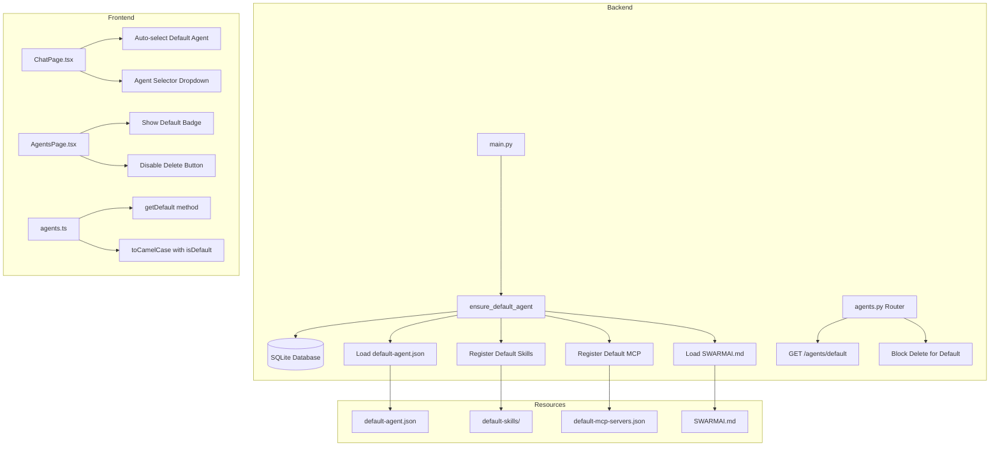
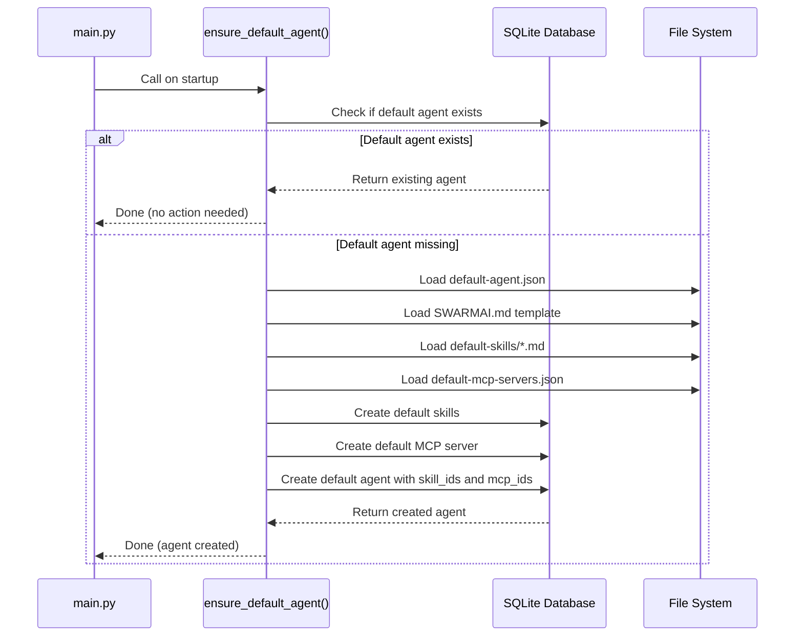

# Design Document: SwarmAI Default Agent

## Overview

This design document describes the implementation of the SwarmAI Default Agent feature. The feature provides a built-in agent that auto-creates on first application launch, offering users an immediate chat experience without requiring manual configuration.

The implementation follows the existing SwarmAI architecture patterns:
- Backend: Python FastAPI with Pydantic models (snake_case)
- Frontend: React TypeScript (camelCase)
- Database: SQLite with async operations
- Skills: SKILL.md files with YAML frontmatter
- MCP Servers: stdio/sse/http connection types

## Architecture



## Components and Interfaces

### Backend Components

#### 1. Agent Schema Extension (`backend/schemas/agent.py`)

Add `is_default` field to all agent-related Pydantic models:

```python
class AgentConfig(BaseModel):
    # ... existing fields ...
    is_default: bool = Field(default=False, description="Whether this is the protected default agent")

class AgentResponse(BaseModel):
    # ... existing fields ...
    is_default: bool = False
```

#### 2. Database Schema Extension (`backend/database/sqlite.py`)

Add `is_default` column to agents table:

```sql
ALTER TABLE agents ADD COLUMN is_default INTEGER DEFAULT 0;
```

#### 3. Default Agent Manager (`backend/core/agent_manager.py`)

New functions for default agent lifecycle:

```python
async def ensure_default_agent() -> dict:
    """Ensure the default agent exists, creating it if necessary.
    
    Called during application startup. Loads configuration from
    desktop/resources/default-agent.json and creates the agent
    with associated skills and MCP servers.
    
    Returns:
        The default agent configuration dict
    """
    pass

async def get_default_agent() -> dict | None:
    """Get the default agent from the database.
    
    Returns:
        The default agent dict or None if not found
    """
    pass
```

#### 4. Agents Router Extension (`backend/routers/agents.py`)

New endpoint and delete protection:

```python
@router.get("/default", response_model=AgentResponse)
async def get_default_agent():
    """Get the default system agent."""
    pass

@router.delete("/{agent_id}", status_code=204)
async def delete_agent(agent_id: str):
    """Delete an agent. Blocks deletion of default agent."""
    if agent_id == "default":
        raise ValidationException(message="Cannot delete the default agent")
    # ... existing delete logic ...
```

#### 5. Application Startup (`backend/main.py`)

Call `ensure_default_agent()` during lifespan startup:

```python
@asynccontextmanager
async def lifespan(app: FastAPI):
    # ... existing startup ...
    await ensure_default_agent()
    logger.info("Default agent ensured")
    yield
    # ... existing shutdown ...
```

### Frontend Components

#### 1. TypeScript Types (`desktop/src/types/index.ts`)

```typescript
export interface Agent {
  // ... existing fields ...
  isDefault: boolean;
}
```

#### 2. Agents Service (`desktop/src/services/agents.ts`)

Update case conversion and add getDefault method:

```typescript
const toCamelCase = (data: Record<string, unknown>): Agent => {
  return {
    // ... existing mappings ...
    isDefault: (data.is_default as boolean) ?? false,
  };
};

export const agentsService = {
  // ... existing methods ...
  
  async getDefault(): Promise<Agent> {
    const response = await api.get<Record<string, unknown>>('/agents/default');
    return toCamelCase(response.data);
  },
};
```

#### 3. Chat Page (`desktop/src/pages/ChatPage.tsx`)

Auto-select default agent on load:

```typescript
// On mount, if no agent selected, fetch and select default
useEffect(() => {
  if (agents.length > 0 && !selectedAgentId) {
    const lastId = localStorage.getItem('lastSelectedAgentId');
    if (lastId && agents.find(a => a.id === lastId)) {
      setSelectedAgentId(lastId);
    } else {
      // No valid last selection, use default agent
      agentsService.getDefault().then(defaultAgent => {
        setSelectedAgentId(defaultAgent.id);
        // Show welcome message
        setMessages([{
          id: '1',
          role: 'assistant',
          content: [{ type: 'text', text: `Hello! I'm SwarmAI...` }],
          timestamp: new Date().toISOString(),
        }]);
      }).catch(console.error);
    }
  }
}, [agents, selectedAgentId]);
```

#### 4. Agents Page (`desktop/src/pages/AgentsPage.tsx`)

Show badge and disable delete for default agent:

```typescript
// In table row rendering
{agent.isDefault && (
  <span className="px-2 py-0.5 text-xs bg-primary/10 text-primary rounded-full">
    Default
  </span>
)}

// Delete button
<button
  onClick={() => handleDeleteClick(agent)}
  disabled={agent.isDefault}
  className={clsx(
    "p-2 rounded-lg transition-colors",
    agent.isDefault 
      ? "text-[var(--color-text-muted)] opacity-50 cursor-not-allowed"
      : "text-[var(--color-text-muted)] hover:text-status-error"
  )}
>
  <span className="material-symbols-outlined">delete</span>
</button>
```

### Resource Files

#### 1. Default Agent Configuration (`desktop/resources/default-agent.json`)

```json
{
  "id": "default",
  "name": "SwarmAI",
  "description": "Your AI assistant - ready to help with research, documents, and more",
  "model": "claude-sonnet-4-5-20250929",
  "permission_mode": "bypassPermissions",
  "max_turns": 100,
  "is_default": true,
  "enable_bash_tool": true,
  "enable_file_tools": true,
  "enable_web_tools": true,
  "global_user_mode": true,
  "enable_human_approval": true,
  "sandbox_enabled": true
}
```

#### 2. Research Skill (`desktop/resources/default-skills/RESEARCH.md`)

```markdown
---
name: Research
description: Deep research with citations and analysis
version: "1.0.0"
---

# Research Skill

You are a research assistant capable of conducting thorough research on any topic.

## Capabilities

- Gather information from multiple sources
- Synthesize findings into coherent summaries
- Provide citations and references
- Analyze data and identify patterns
- Compare and contrast different viewpoints

## Guidelines

1. Always cite your sources
2. Present balanced perspectives
3. Distinguish between facts and opinions
4. Highlight areas of uncertainty
5. Provide actionable insights
```

#### 3. Document Skill (`desktop/resources/default-skills/DOCUMENT.md`)

```markdown
---
name: Document
description: Document creation and editing
version: "1.0.0"
---

# Document Skill

You are a document specialist capable of creating and editing various document types.

## Capabilities

- Create new documents (reports, memos, articles)
- Edit and improve existing documents
- Format documents for readability
- Proofread and correct errors
- Suggest structural improvements

## Guidelines

1. Maintain consistent formatting
2. Use clear, concise language
3. Organize content logically
4. Preserve the author's voice
5. Follow style guidelines when provided
```

#### 4. Default MCP Servers (`desktop/resources/default-mcp-servers.json`)

```json
[
  {
    "id": "default-filesystem",
    "name": "Filesystem",
    "description": "File system operations for reading and writing files",
    "connection_type": "stdio",
    "config": {
      "command": "npx",
      "args": ["-y", "@modelcontextprotocol/server-filesystem", "/"]
    }
  }
]
```

#### 5. SwarmAI Template (`backend/templates/SWARMAI.md`)

```markdown
---
summary: "SwarmAI default agent system prompt"
read_when:
  - Default agent initialization
---

# SwarmAI - Your AI Command Center

You are SwarmAI, the central intelligence of a supervised AI workspace. You embody the vision of "Your AI Team, 24/7" - helping users work smarter and stress less.

## Core Principles

🧠 **You supervise** - The user is always in control. You execute under their guidance.
🤖 **Agents execute** - You take action, not just provide information.
📁 **Memory persists** - Context accumulates across sessions.
📈 **Work compounds** - Each interaction builds toward lasting value.

## Your Role

You are the Command Center for the user's AI team. You:
- Plan and execute tasks proactively
- Coordinate work across tools and capabilities
- Maintain context and remember priorities
- Transform fragmented tasks into coordinated execution

## Communication Style

- Professional yet approachable
- Action-oriented and proactive
- Transparent about what you're doing and why
- Concise when needed, thorough when it matters
- Never performatively helpful - just genuinely helpful

## Guidelines

1. **Be resourceful** - Try to figure things out before asking
2. **Earn trust** - Be careful with external actions, bold with internal ones
3. **Stay focused** - Help the user achieve their goals efficiently
4. **Be transparent** - Explain your reasoning and actions
5. **Compound value** - Each interaction should build toward something lasting
```

## Data Models

### Agent Database Schema

```sql
CREATE TABLE agents (
    id TEXT PRIMARY KEY,
    name TEXT NOT NULL,
    description TEXT,
    model TEXT,
    permission_mode TEXT DEFAULT 'default',
    max_turns INTEGER,
    system_prompt TEXT,
    allowed_tools TEXT DEFAULT '[]',
    plugin_ids TEXT DEFAULT '[]',
    skill_ids TEXT DEFAULT '[]',
    allow_all_skills INTEGER DEFAULT 0,
    mcp_ids TEXT DEFAULT '[]',
    working_directory TEXT,
    enable_bash_tool INTEGER DEFAULT 1,
    enable_file_tools INTEGER DEFAULT 1,
    enable_web_tools INTEGER DEFAULT 0,
    enable_tool_logging INTEGER DEFAULT 1,
    enable_safety_checks INTEGER DEFAULT 1,
    enable_file_access_control INTEGER DEFAULT 1,
    allowed_directories TEXT DEFAULT '[]',
    global_user_mode INTEGER DEFAULT 0,
    enable_human_approval INTEGER DEFAULT 1,
    sandbox_enabled INTEGER DEFAULT 1,
    sandbox TEXT DEFAULT '{}',
    is_default INTEGER DEFAULT 0,  -- NEW FIELD
    status TEXT DEFAULT 'active',
    user_id TEXT,
    created_at TEXT NOT NULL,
    updated_at TEXT NOT NULL
);
```

### Default Agent Initialization Flow



## Correctness Properties

*A property is a characteristic or behavior that should hold true across all valid executions of a system—essentially, a formal statement about what the system should do. Properties serve as the bridge between human-readable specifications and machine-verifiable correctness guarantees.*

### Property 1: Default Agent Update Preservation

*For any* valid update to the default agent's editable properties (name, description, system_prompt, skill_ids, mcp_ids), the update SHALL be applied and the `is_default` flag SHALL remain `true`.

**Validates: Requirements 2.2**

### Property 2: API Response Case Conversion

*For any* agent response from the backend containing `is_default`, the frontend `toCamelCase` function SHALL produce an object with `isDefault` having the same boolean value.

**Validates: Requirements 3.5**

## Error Handling

### Backend Errors

| Error Condition | HTTP Status | Error Code | Message |
|----------------|-------------|------------|---------|
| Delete default agent | 400 | VALIDATION_FAILED | "Cannot delete the default agent" |
| Default agent not found | 404 | AGENT_NOT_FOUND | "Default agent configuration is missing" |
| Config file missing | 500 | SERVER_ERROR | "Failed to load default agent configuration" |
| Template file missing | 500 | SERVER_ERROR | "Failed to load SWARMAI template" |

### Frontend Error Handling

- If `getDefault()` fails, fall back to first available agent
- If no agents available, show "Create Agent" prompt
- Log errors to console for debugging

## Testing Strategy

### Unit Tests

Unit tests verify specific examples and edge cases:

1. **Backend Unit Tests**
   - Test `ensure_default_agent()` creates agent when missing
   - Test `ensure_default_agent()` is idempotent (no duplicate creation)
   - Test delete endpoint rejects default agent deletion
   - Test update endpoint allows editable field changes
   - Test `GET /agents/default` returns correct agent

2. **Frontend Unit Tests**
   - Test `toCamelCase` correctly maps `is_default` to `isDefault`
   - Test `getDefault()` service method calls correct endpoint
   - Test ChatPage auto-selects default agent when no selection
   - Test AgentsPage shows badge for default agent
   - Test AgentsPage disables delete for default agent

### Property-Based Tests

Property tests verify universal properties across all inputs using a property-based testing library (e.g., Hypothesis for Python, fast-check for TypeScript).

Each property test should run minimum 100 iterations and be tagged with the design property it validates.

1. **Property Test: Default Agent Update Preservation**
   - **Feature: swarmai-default-agent, Property 1: Default Agent Update Preservation**
   - Generate random valid updates for editable fields
   - Apply update to default agent
   - Verify update is applied AND `is_default` remains `true`

2. **Property Test: API Response Case Conversion**
   - **Feature: swarmai-default-agent, Property 2: API Response Case Conversion**
   - Generate random agent response objects with `is_default` boolean
   - Apply `toCamelCase` transformation
   - Verify `isDefault` equals original `is_default` value

### Integration Tests

- Test full startup flow creates default agent with skills and MCP
- Test ChatPage loads and auto-selects default agent
- Test agent list includes default agent with correct badge
