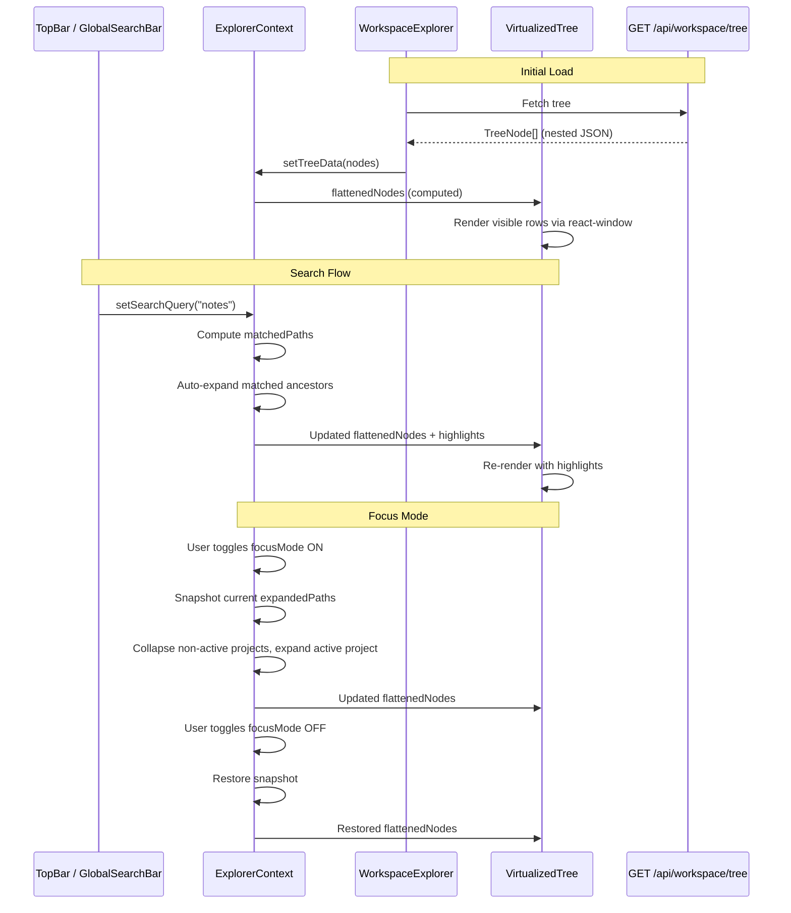

# Design Document — SwarmWS Explorer UX (Cadence 3 of 4)

## Overview

This design covers the Workspace Explorer UX redesign: the primary frontend cadence that transforms the middle column from a multi-workspace file browser into a semantically-zoned, single-workspace explorer with progressive disclosure, focus mode, global search, and virtualized rendering for scalability.

Cadence 1 established the backend folder structure (Shared Knowledge, Active Work), depth guardrails, the Knowledge domain (Knowledge Base/, Notes/, Memory/), and system-managed item registry. Cadence 2 added project CRUD, enriched metadata, schema versioning, and frontend type/service layers. This cadence builds the visual layer on top of those foundations.

The current `WorkspaceExplorer` component uses a `WorkspaceHeader` with a workspace dropdown selector, Global/SwarmWS toggle, "Show Archived" checkbox, and an inline search bar. Below it, `SectionNavigation` renders six collapsible section headers (Signals, Plan, Execute, Communicate, Artifacts, Reflection) with counts. The `FileTree` and `FileTreeNode` components render a recursive tree with `workspaceId`-scoped nodes. All of this is replaced.

### Key Design Decisions

1. **Semantic zones as visual groupings, not separate components**: The two zones (Shared Knowledge, Active Work) are rendered by a single `VirtualizedTree` component with zone separator rows injected into the flat node list. This keeps virtualization simple and avoids multiple scroll containers.
2. **Search in Top Bar, results in Explorer**: The global search input lives in `ThreeColumnLayout`'s `TopBar` component (full-width, above all three columns). Search state is lifted to a React context (`ExplorerContext`) so the Top Bar can write the query and the Explorer can read it.
3. **react-window for virtualization**: We use `react-window` (`FixedSizeList`) for the tree. Each row is a fixed 32px height. The tree is flattened into a list of visible nodes (respecting expand/collapse state), and `FixedSizeList` renders only the visible viewport. This handles 500+ nodes smoothly.
4. **Focus Mode as state modifier**: Focus Mode doesn't create a separate view. It modifies the `expandedPaths` set: auto-expands the active project, collapses non-active project trees, and keeps Knowledge/ visible (collapsed but accessible). A toggle button in the explorer header controls it. Disabling restores the previous expand/collapse snapshot.
5. **Substring search via lightweight client-side matching**: Search operates on the already-fetched tree data using a case-insensitive substring match (no external library needed). Matched paths are auto-expanded and highlighted with a CSS class. The search scope is filesystem-only (no DB entities like chat threads or ToDos).
6. **Single backend endpoint**: One new `GET /api/workspace/tree` endpoint returns the full filesystem tree as nested JSON. The frontend caches this and re-fetches on mutation events. No polling — invalidation is event-driven. After any folder/file CRUD operation (create project, delete project, create file, rename, etc.), the mutation handler calls `ExplorerContext.refreshTree()`, which re-fetches `GET /api/workspace/tree` (without the cached ETag). For external filesystem changes (e.g., agent-created files), the backend can emit an SSE event `workspace_tree_changed` that the frontend listens for and triggers `refreshTree()`. Until SSE is wired (Cadence 4), a manual refresh button in the ExplorerHeader provides a fallback.
7. **CSS variables for all colors**: Every color in the explorer uses `--color-*` CSS variables. New variables are added for zone separators, indentation guides, search highlights, and focus mode accents.

## Architecture

### Component Hierarchy

```mermaid
graph TB
    subgraph "ThreeColumnLayout"
        TB[TopBar]
        LS[LeftSidebar]
        WE[WorkspaceExplorer]
        MC[MainChatPanel]
    end

    subgraph "TopBar (modified)"
        SB[GlobalSearchBar]
    end

    subgraph "WorkspaceExplorer (redesigned)"
        EH[ExplorerHeader<br/>"SwarmWS" title + Focus toggle]
        VT[VirtualizedTree<br/>react-window FixedSizeList]
    end

    subgraph "VirtualizedTree rows"
        RF[RootFileRow<br/>system-prompts.md, context-L0/L1]
        ZS1[ZoneSeparator<br/>"Shared Knowledge"]
        TN1[TreeNode — Knowledge/]
        ZS2[ZoneSeparator<br/>"Active Work"]
        TN2[TreeNode — Projects/]
    end

    TB --> SB
    WE --> EH
    WE --> VT
    VT --> RF
    VT --> ZS1
    VT --> TN1
    VT --> ZS2
    VT --> TN2

    subgraph "State Management"
        EC[ExplorerContext<br/>searchQuery, focusMode,<br/>expandedPaths, selectedPath,<br/>activeProjectId]
    end

    SB -.->|writes searchQuery| EC
    EH -.->|toggles focusMode| EC
    VT -.->|reads/writes expandedPaths| EC
    TN1 -.->|reads from| EC
```

### Data Flow




## Components and Interfaces

### 1. Backend: Workspace Tree Endpoint

**File**: `backend/routers/workspace_api.py` (extended)

A single new endpoint returns the filesystem tree for the explorer.

```python
@router.get("/api/workspace/tree")
async def get_workspace_tree(
    depth: int = Query(default=3, ge=1, le=5),
    if_none_match: str | None = Header(default=None),
) -> list[dict]:
    """Return the SwarmWS filesystem tree as nested JSON.

    Supports conditional requests via ETag / If-None-Match.
    Returns 304 Not Modified when the workspace tree has not changed.

    Walks the workspace root directory up to `depth` levels.
    Each node includes:
    - name: str (display name)
    - path: str (relative to workspace root)
    - type: "file" | "directory"
    - isSystemManaged: bool
    - children: list[node] (for directories, if expanded)

    System-managed items are annotated so the frontend can show
    lock badges and suppress delete/rename actions.
    """
```

**Response shape** (TypeScript equivalent):

```typescript
interface TreeNode {
  name: string;
  path: string;           // relative to workspace root, e.g. "Knowledge/Notes/README.md"
  type: 'file' | 'directory';
  isSystemManaged: boolean;
  children?: TreeNode[];
}
```

**Implementation notes**:
- Uses `os.walk()` bounded by `depth` parameter
- Calls `is_system_managed()` from Cadence 1 for each path
- Excludes hidden files (starting with `.`) except `.project.json`
- Sorts directories first, then files, both alphabetically
- Returns the full tree in a single response (no pagination — workspace trees are bounded by depth guardrails)

**Caching**: The endpoint computes an `ETag` from the workspace root
directory's recursive `mtime` (maximum `os.stat().st_mtime` across all
entries up to `depth`). Clients send `If-None-Match`; if the ETag
matches, the endpoint returns `304 Not Modified`. The frontend
`workspaceService.getTree()` stores the last ETag and sends it on
subsequent requests. This avoids re-serialising and re-transferring the
full tree when nothing has changed. On CRUD mutations (create/delete
project, create/delete file), the frontend calls `refreshTree()` which
fetches without the cached ETag, forcing a fresh response.

### 2. ExplorerContext (New)

**File**: `desktop/src/contexts/ExplorerContext.tsx`

A React context that holds all explorer state, shared between the TopBar (search input) and the WorkspaceExplorer (tree rendering).

```typescript
interface ExplorerState {
  // Tree data
  treeData: TreeNode[];
  isLoading: boolean;
  error: string | null;

  // Expand/collapse
  expandedPaths: Set<string>;
  toggleExpand: (path: string) => void;
  expandAll: () => void;
  collapseAll: () => void;

  // Selection
  selectedPath: string | null;
  setSelectedPath: (path: string | null) => void;

  // Search
  searchQuery: string;
  setSearchQuery: (query: string) => void;
  matchedPaths: Set<string>;       // paths that match the query
  highlightedPaths: Set<string>;   // matchedPaths + their ancestors (for auto-expand)

  // Focus Mode
  focusMode: boolean;
  toggleFocusMode: () => void;
  activeProjectId: string | null;
  setActiveProjectId: (id: string | null) => void;

  // Actions
  refreshTree: () => void;
}
```

**Context splitting for render performance**: To avoid re-rendering the
entire tree on every keystroke or focus toggle, the provider internally
splits state into three stable-reference sub-contexts:

1. **TreeDataContext** — `treeData`, `isLoading`, `error`, `refreshTree`
   (changes only on fetch).
2. **SelectionContext** — `expandedPaths`, `selectedPath`, `matchedPaths`,
   `highlightedPaths`, `focusMode`, `activeProjectId` (changes on user
   interaction).
3. **SearchContext** — `searchQuery`, `setSearchQuery` (changes on every
   debounced keystroke).

`VirtualizedTree` subscribes to `TreeDataContext` + `SelectionContext`.
`GlobalSearchBar` subscribes to `SearchContext` only. Each sub-context
uses `React.memo` boundaries so that a search keystroke does not
re-render the tree until the debounced query produces new
`matchedPaths`. The public `useExplorerContext()` hook composes all
three for convenience; performance-sensitive components use the
individual hooks (`useTreeData`, `useSelection`, `useSearch`).

**Key behaviors**:

- `expandedPaths` is persisted to `sessionStorage` so it survives page navigation within a session (Req 10.5).
- When `searchQuery` changes, `matchedPaths` is recomputed via `React.startTransition` (or `useDeferredValue`) to avoid blocking the main thread during large-tree traversals. The match computation runs against all node names in `treeData` using case-insensitive substring matching. `highlightedPaths` includes all ancestors of matched nodes. `expandedPaths` is temporarily overridden to include `highlightedPaths`.
- When `searchQuery` is cleared, `expandedPaths` reverts to the pre-search snapshot (Req 13.5).
- When `focusMode` is toggled ON: snapshot `expandedPaths`, then collapse all non-active project trees under `Projects/`, expand the active project path recursively, keep `Knowledge/` in the flattened list but collapsed (visible, not expanded). (Req 12.1–12.3)
- When `focusMode` is toggled OFF: restore the snapshot (Req 12.5).

### 3. ExplorerHeader (Replaces WorkspaceHeader)

**File**: `desktop/src/components/workspace-explorer/ExplorerHeader.tsx`

Replaces the old `WorkspaceHeader` entirely. Removes: workspace dropdown, Global/SwarmWS toggle, "Show Archived" checkbox, "New Workspace" button, add-context area, inline search bar.

```typescript
interface ExplorerHeaderProps {
  onCollapseToggle?: () => void;
}
```

**Renders**:
- Title: "SwarmWS" (static text, `font-medium`, `text-sm`)
- Collapse button (chevron, same as current)
- Focus Mode toggle: a small icon button labeled "Focus on Current Project" (tooltip). Uses `toggleFocusMode` from `ExplorerContext`.

**Removed elements** (Req 9.3–9.7):
- Workspace selector dropdown
- "Show Archived Workspaces" checkbox
- Global|SwarmWS toggle switch
- "New Workspace" button
- Add-context area

### 4. GlobalSearchBar (New, in TopBar)

**File**: `desktop/src/components/layout/GlobalSearchBar.tsx`

A search input rendered inside the `TopBar` component. Centered, full-width within the top bar's content area (leaving space for the macOS traffic lights on the left).

```typescript
/** Global search bar rendered in the TopBar, above all three columns. */
export default function GlobalSearchBar() {
  const { searchQuery, setSearchQuery } = useExplorerContext();
  // Renders a text input with search icon, placeholder "Search files and folders..."
  // Debounces input by 150ms before updating context
}
```

**Integration**: The `TopBar` function in `ThreeColumnLayout.tsx` is modified to include `<GlobalSearchBar />` centered in the bar. The bar remains draggable (Tauri window drag) except over the search input.

### 5. VirtualizedTree (New)

**File**: `desktop/src/components/workspace-explorer/VirtualizedTree.tsx`

The core rendering component. Uses `react-window` `FixedSizeList` to render a flat list of visible rows.

```typescript
interface VirtualizedTreeProps {
  /** Height of the tree container (from parent layout) */
  height: number;
  /** Width of the tree container */
  width: number;
}
```

**Flattening algorithm**:

1. Start with `treeData` from `ExplorerContext`.
2. Inject zone separator pseudo-nodes at the correct positions:
   - Root-level files (system-prompts.md, context-L0.md, context-L1.md) come first.
   - Zone separator: "Shared Knowledge" before Knowledge/.
   - Shared Knowledge folder: Knowledge/.
   - Zone separator: "Active Work" before Projects/.
   - Active Work: Projects/.
3. For each directory node, if its path is in `expandedPaths`, recursively include its children.
4. Each flattened row has: `{ type: 'node' | 'zone-separator', node?: TreeNode, zoneLabel?: string, depth: number, isMatched: boolean }`.

**Row rendering**:
- `zone-separator` rows: Render a subtle label with a horizontal line. Non-interactive. Height: 32px.
- `node` rows: Render a `TreeNodeRow` with indentation, icon, name, and hover actions.

**Row height**: Fixed 32px for all rows (required by `FixedSizeList`).

**Stable keys**: The `FixedSizeList` uses an `itemKey` callback that
returns the node's `path` for `kind: 'node'` rows and
`zone:{zoneLabel}` for `kind: 'zone-separator'` rows. This ensures
stable React keys across expand/collapse operations, preventing
unnecessary unmount/remount of row components.

**Scroll position preservation** (Req 11.4): `FixedSizeList` naturally preserves scroll position when the item count changes (expand/collapse only inserts/removes items below the current scroll offset).

### 6. TreeNodeRow (Replaces FileTreeNode)

**File**: `desktop/src/components/workspace-explorer/TreeNodeRow.tsx`

Renders a single tree node row inside the virtualized list.

```typescript
interface TreeNodeRowProps {
  node: TreeNode;
  depth: number;
  isExpanded: boolean;
  isSelected: boolean;
  isMatched: boolean;       // search highlight
  isSystemManaged: boolean;
  onToggle: () => void;
  onSelect: () => void;
  onContextMenu: (e: React.MouseEvent) => void;
  onDoubleClick: () => void;
  style: React.CSSProperties;  // from react-window (position, height)
}
```

**Visual design** (Req 14):
- Indentation: `depth * 16px` left padding, with optional vertical indentation guides (1px lines using `--color-explorer-indent-guide`).
- Font weight: depth 0 = `font-medium` (500), depth 1+ = `font-normal` (400).
- System-managed items: lock icon badge, muted text color (`--color-text-muted`).
- User-managed items: accent color on hover (`--color-explorer-accent`), CRUD action icons (`+`, `⋯`) shown only on hover.
- Search match highlight: background `--color-explorer-search-highlight`.
- Selected state: background `--color-primary` at 20% opacity.
- Hover state: background `--color-hover`.
- Expand/collapse chevron: `chevron_right` (collapsed) / `expand_more` (expanded), animated with 150ms CSS transition on `transform: rotate()`.

**Animations** (Req 11.3): The chevron rotation is CSS-animated. Expand/collapse of children is handled by the virtualized list (items appear/disappear instantly since react-window doesn't animate list changes — the chevron animation provides the visual cue).

**Accessibility**: The `VirtualizedTree` list container carries
`role="tree"` and `aria-label="Workspace Explorer"`. Each `TreeNodeRow`
carries `role="treeitem"`, `aria-level={depth + 1}`,
`aria-expanded={isExpanded}` (directories only), `aria-selected={isSelected}`,
and `tabIndex={isSelected ? 0 : -1}` for roving tabindex keyboard
navigation. Zone separators carry `role="separator"` and
`aria-orientation="horizontal"`.

### 7. WorkspaceExplorer (Redesigned)

**File**: `desktop/src/components/workspace-explorer/WorkspaceExplorer.tsx`

The main explorer component, rendered in the middle column of `ThreeColumnLayout`.

```typescript
interface WorkspaceExplorerProps {
  onFileDoubleClick?: (node: TreeNode) => void;
}
```

**Structure**:
```
<div className="explorer-container">
  <ExplorerHeader onCollapseToggle={...} />
  <AutoSizer>
    {({ height, width }) => (
      <VirtualizedTree height={height} width={width} />
    )}
  </AutoSizer>
</div>
```

Uses `react-virtualized-auto-sizer` (peer dependency of `react-window`) to measure available space and pass it to `VirtualizedTree`.

**Data fetching**: On mount, calls `GET /api/workspace/tree` via `workspaceService.getTree()`. Stores result in `ExplorerContext`. Re-fetches when `refreshTree()` is called (triggered after folder/file CRUD operations).

### 8. Frontend Service Extension

**File**: `desktop/src/services/workspace.ts` (extended)

```typescript
export const workspaceService = {
  // ... existing getConfig(), updateConfig() from Cadence 2

  /** Fetch the workspace filesystem tree. */
  async getTree(depth?: number): Promise<TreeNode[]> {
    const params = depth ? `?depth=${depth}` : '';
    const response = await api.get<TreeNode[]>(`/api/workspace/tree${params}`);
    return response.data.map(treeNodeToCamelCase);
  },
};

/** Convert snake_case tree node to camelCase (recursive).
 *
 * Note: For trees with 1000+ nodes, consider deferring conversion to
 * render time or using a streaming approach. The current eager conversion
 * is acceptable for trees bounded by depth guardrails (max ~500 nodes).
 */
function treeNodeToCamelCase(data: Record<string, unknown>): TreeNode {
  return {
    name: data.name as string,
    path: data.path as string,
    type: data.type as 'file' | 'directory',
    isSystemManaged: data.is_system_managed as boolean,
    children: data.children
      ? (data.children as Record<string, unknown>[]).map(treeNodeToCamelCase)
      : undefined,
  };
}
```

### 9. CSS Variable Extensions

**File**: `desktop/src/index.css` (additions)

New CSS variables for the explorer, added to both `:root` (light) and `:root.dark` (dark) blocks:

```css
/* Light theme additions */
:root {
  /* ... existing variables ... */
  --color-explorer-zone-label: #94a3b8;
  --color-explorer-zone-separator: #e2e8f0;
  --color-explorer-indent-guide: #e2e8f0;
  --color-explorer-search-highlight: rgba(43, 108, 238, 0.12);
  --color-explorer-accent: #2b6cee;
  --color-explorer-system-badge: #d97706;
  --color-explorer-focus-indicator: #2b6cee;
}

/* Dark theme additions */
:root.dark {
  /* ... existing variables ... */
  --color-explorer-zone-label: #6b7280;
  --color-explorer-zone-separator: #2d3548;
  --color-explorer-indent-guide: #2d3548;
  --color-explorer-search-highlight: rgba(43, 108, 238, 0.2);
  --color-explorer-accent: #3d7ef0;
  --color-explorer-system-badge: #f59e0b;
  --color-explorer-focus-indicator: #3d7ef0;
}
```


## Data Models

### TreeNode (Backend Response)

```python
"""Pydantic model for workspace tree API response."""

class TreeNodeResponse(BaseModel):
    """A single node in the workspace filesystem tree."""
    name: str
    path: str                          # relative to workspace root
    type: Literal["file", "directory"]
    is_system_managed: bool
    children: Optional[list["TreeNodeResponse"]] = None
```

### TreeNode (Frontend)

```typescript
/** A node in the workspace filesystem tree. */
export interface TreeNode {
  name: string;
  path: string;           // relative to workspace root
  type: 'file' | 'directory';
  isSystemManaged: boolean;
  children?: TreeNode[];
}
```

Added to `desktop/src/types/index.ts`.

### FlattenedRow (Internal to VirtualizedTree)

```typescript
/** A row in the flattened virtualized list. Not exported — internal to VirtualizedTree. */
type FlattenedRow =
  | { kind: 'zone-separator'; zoneLabel: string }
  | { kind: 'node'; node: TreeNode; depth: number; isMatched: boolean; isExpanded: boolean };
```

### ExplorerSessionState (sessionStorage)

```typescript
/** Persisted to sessionStorage under key "swarmws-explorer-state". */
interface ExplorerSessionState {
  expandedPaths: string[];
  focusMode: boolean;
  activeProjectId: string | null;
}
```

### Semantic Zone Definitions (Constant)

```typescript
/** Zone configuration — maps filesystem paths to semantic zones. */
const SEMANTIC_ZONES = [
  {
    label: 'Shared Knowledge',
    paths: ['Knowledge'],
  },
  {
    label: 'Active Work',
    paths: ['Projects'],
  },
] as const;

/** Root-level files displayed above the first zone separator. */
const ROOT_FILES = ['system-prompts.md', 'context-L0.md', 'context-L1.md'];
```

### Substring Search Algorithm

The search implementation is a simple case-insensitive substring match on node names. No external library is needed.

```typescript
/** Check if a node name matches the query (case-insensitive substring). */
function substringMatch(name: string, query: string): boolean {
  if (!query) return false;
  const lowerName = name.toLowerCase();
  const lowerQuery = query.toLowerCase();
  // Simple substring match — sufficient for filesystem names
  return lowerName.includes(lowerQuery);
}

/** Find all matching paths and their ancestors in the tree. */
function findMatches(
  nodes: TreeNode[],
  query: string,
  parentPath: string = ''
): { matched: Set<string>; ancestors: Set<string> } {
  const matched = new Set<string>();
  const ancestors = new Set<string>();

  function walk(node: TreeNode, ancestorPaths: string[]): boolean {
    const isMatch = substringMatch(node.name, query);
    let hasMatchingDescendant = false;

    if (node.children) {
      for (const child of node.children) {
        if (walk(child, [...ancestorPaths, node.path])) {
          hasMatchingDescendant = true;
        }
      }
    }

    if (isMatch) {
      matched.add(node.path);
      for (const ap of ancestorPaths) ancestors.add(ap);
    }

    if (hasMatchingDescendant) {
      ancestors.add(node.path);
    }

    return isMatch || hasMatchingDescendant;
  }

  for (const node of nodes) walk(node, []);
  return { matched, ancestors };
}
```


## Correctness Properties

*A property is a characteristic or behavior that should hold true across all valid executions of a system — essentially, a formal statement about what the system should do. Properties serve as the bridge between human-readable specifications and machine-verifiable correctness guarantees.*

### Property 1: Semantic Zone Grouping Correctness

*For any* valid workspace tree containing a Knowledge/ folder and a Projects/ folder, the flattened row list shall: (a) place root-level files before the first zone separator, (b) contain exactly two zone separators in order ("Shared Knowledge", "Active Work"), (c) place Knowledge/ in the "Shared Knowledge" zone and Projects/ in the "Active Work" zone, and (d) maintain the defined ordering within each zone.

**Validates: Requirements 10.1, 10.3**

### Property 2: System-Managed Items Suppress CRUD Actions and Accent Colors

*For any* tree node where `isSystemManaged` is `true`, the rendered row shall not include delete or rename action controls and shall not apply accent color styling. *For any* tree node where `isSystemManaged` is `false`, the rendered row shall include CRUD action controls on hover and apply accent color styling on hover.

**Validates: Requirements 14.4, 14.5**

### Property 3: Default Collapsed View

*For any* valid workspace tree and an empty `expandedPaths` set (initial load with no session state), the flattened row list shall contain only: root-level file nodes, zone separator rows, and top-level section folder nodes (Knowledge, Projects). No child nodes of any folder shall appear.

**Validates: Requirements 10.4, 11.1**

### Property 4: Toggle Expand/Collapse

*For any* folder path and *for any* `expandedPaths` set, calling `toggleExpand(path)` shall add the path to `expandedPaths` if it was absent, or remove it if it was present. The resulting set shall differ from the original by exactly one element.

**Validates: Requirements 11.2**

### Property 5: Flattening Respects Expand State

*For any* valid workspace tree and *for any* `expandedPaths` set, the flattened row list shall include a directory's children if and only if that directory's path is in `expandedPaths`. Directories not in `expandedPaths` shall appear as leaf rows with no children visible.

**Validates: Requirements 11.2**

### Property 6: Focus Mode State Transformation

*For any* valid workspace tree and *for any* active project path under `Projects/`, enabling Focus Mode shall produce an `expandedPaths` set where: (a) the active project path and all its ancestor paths are included (auto-expanded), (b) no non-active project paths under `Projects/` are included (collapsed), and (c) the `Knowledge` path is NOT in `expandedPaths` but `Knowledge/` still appears in the flattened list (visible but collapsed).

**Validates: Requirements 12.1, 12.2, 12.3**

### Property 7: Focus Mode Round-Trip Restore

*For any* `expandedPaths` state, enabling Focus Mode and then immediately disabling it shall restore the original `expandedPaths` set exactly. No paths shall be added or removed compared to the pre-focus state.

**Validates: Requirements 12.5**

### Property 8: Search Match, Expand, and Highlight

*For any* valid workspace tree and *for any* non-empty search query that is a case-insensitive substring of at least one node's name: (a) `matchedPaths` shall contain every node whose name contains the query as a substring, (b) `expandedPaths` shall include all ancestor paths of every matched node (so matched nodes are visible), and (c) each matched node's flattened row shall have `isMatched = true`.

**Validates: Requirements 13.2, 13.3, 13.4**

### Property 9: Search Clear Restores State

*For any* `expandedPaths` state, setting a non-empty search query and then clearing it (setting to empty string) shall restore the original `expandedPaths` set exactly.

**Validates: Requirements 13.5**

### Property 10: Session State Round-Trip

*For any* `expandedPaths` set, `focusMode` boolean, and `activeProjectId` string, serializing the explorer state to `sessionStorage` and deserializing it on re-mount shall produce an identical state. Specifically: the restored `expandedPaths` set shall contain exactly the same paths, `focusMode` shall have the same value, and `activeProjectId` shall be the same.

**Validates: Requirements 10.5**

### Property 11: Virtualization Renders Fewer DOM Nodes

*For any* flattened row list with more than 50 items, the `VirtualizedTree` component shall render fewer DOM row elements than the total item count. The number of rendered rows shall be bounded by `ceil(containerHeight / rowHeight) + overscanCount`.

**Validates: Requirements 15.1, 15.2**

### Property 12: Depth-Based Visual Properties

*For any* tree node at depth `d`, the rendered row shall have left padding equal to `d * 16` pixels. Nodes at depth 0 shall use `font-weight: 500` (medium). Nodes at depth 1 or greater shall use `font-weight: 400` (normal).

**Validates: Requirements 14.1, 14.2**


## Error Handling

| Scenario | Handling |
|----------|----------|
| `GET /api/workspace/tree` fails (network/server error) | Explorer shows inline error message with retry button. `ExplorerContext.error` is set. Tree area displays "Failed to load workspace tree. [Retry]" |
| `GET /api/workspace/tree` returns empty array | Explorer shows empty state: "SwarmWS is empty. Initialize your workspace to get started." |
| Workspace root directory doesn't exist | Backend returns 500. Frontend shows error state. User is prompted to restart the app (triggers re-initialization). |
| `sessionStorage` read fails (quota exceeded, disabled) | Silently fall back to default state (all collapsed, no focus mode). Log warning to console. |
| `sessionStorage` contains invalid JSON | Silently fall back to default state (all collapsed, no focus mode). Do **not** clear the key — the next valid write will overwrite it naturally. Log warning to console. |
| Search query produces no matches | Explorer shows all nodes in their current expand/collapse state with a subtle "No matches found" message below the search bar. No auto-expand changes. |
| Focus Mode toggled with no active project | Focus Mode toggle is disabled (grayed out) when `activeProjectId` is null. Tooltip: "Select a project first." |
| Tree node with missing `type` field | Treat as `file` (safe default). Log warning. |
| Very deep tree exceeding depth parameter | Backend truncates at `depth` parameter. Nodes at the limit depth show a "..." indicator if they have children. |
| `react-window` container has zero height | `AutoSizer` returns 0 height during initial render. `VirtualizedTree` renders nothing until a non-zero height is available (next frame). |

## Testing Strategy

### Property-Based Testing

**Library**: [fast-check](https://github.com/dubzzz/fast-check) for TypeScript frontend tests (consistent with existing project pattern from Cadence 2).

Each correctness property is implemented as a single fast-check test with a minimum of 100 iterations. Tests are tagged with comments referencing the design property.

```typescript
// Feature: swarmws-explorer-ux, Property 1: Semantic Zone Grouping Correctness
fc.assert(
  fc.property(
    arbitraryWorkspaceTree(),
    (tree) => {
      const rows = flattenTree(tree, new Set());
      // Verify zone separators exist in correct order ("Shared Knowledge", "Active Work")
      // Verify Knowledge/ is in Shared Knowledge zone, Projects/ is in Active Work zone
      // Verify root files come before first separator
    }
  ),
  { numRuns: 100 }
);
```

**Backend property test** (Hypothesis, Python):

```python
# Feature: swarmws-explorer-ux, Property: Tree endpoint returns valid structure
@given(workspace_tree=st.recursive(
    st.fixed_dictionaries({"name": st.text(min_size=1, max_size=50), "type": st.just("file")}),
    lambda children: st.fixed_dictionaries({
        "name": st.text(min_size=1, max_size=50),
        "type": st.just("directory"),
        "children": st.lists(children, max_size=5),
    }),
    max_leaves=20,
))
@settings(max_examples=100, deadline=None)
def test_tree_endpoint_structure(workspace_tree, tmp_path):
    """For any workspace filesystem, the tree endpoint returns valid nested JSON."""
    ...
```

**Property tests to implement**:

| Property | Test File | Key Generators |
|----------|-----------|----------------|
| P1: Zone Grouping | `VirtualizedTree.property.test.tsx` | Random TreeNode[] with Knowledge/ and Projects/ folders |
| P2: System-Managed CRUD/Accent Suppression | `TreeNodeRow.property.test.tsx` | TreeNode with random isSystemManaged boolean |
| P3: Default Collapsed View | `VirtualizedTree.property.test.tsx` | Random TreeNode[] with empty expandedPaths |
| P4: Toggle Expand/Collapse | `ExplorerContext.property.test.tsx` | Random path strings and expandedPaths sets |
| P5: Flattening Respects Expand | `VirtualizedTree.property.test.tsx` | Random TreeNode[] and random expandedPaths subsets |
| P6: Focus Mode Transformation | `ExplorerContext.property.test.tsx` | Random TreeNode[] with random project paths under Projects/ |
| P7: Focus Mode Round-Trip | `ExplorerContext.property.test.tsx` | Random expandedPaths sets |
| P8: Search Match/Expand/Highlight | `ExplorerContext.property.test.tsx` | Random TreeNode[] and random substring queries |
| P9: Search Clear Restore | `ExplorerContext.property.test.tsx` | Random expandedPaths sets and queries |
| P10: Session State Round-Trip | `ExplorerContext.property.test.tsx` | Random ExplorerSessionState objects |
| P11: Virtualization DOM Count | `VirtualizedTree.property.test.tsx` | Large TreeNode[] (500+ nodes). Requires JSDOM + RTL with mocked `AutoSizer` dimensions (e.g., height=320, width=300). Asserts `querySelectorAll('[data-testid="tree-row"]').length < totalItems`. |
| P12: Depth-Based Visuals | `TreeNodeRow.property.test.tsx` | Random depth values (0–5) |

### Unit Tests

Unit tests complement property tests for specific examples, edge cases, and integration points:

- **ExplorerHeader**: Verify "SwarmWS" title renders, old controls are absent (Req 9.1–9.7)
- **GlobalSearchBar**: Verify renders in TopBar, debounce behavior, placeholder text
- **Zone separators**: Verify non-interactive (no onClick handler, correct ARIA role)
- **Focus Mode toggle**: Verify disabled state when no project selected (Req 12.4)
- **Empty tree**: Verify empty state message renders
- **Error state**: Verify error message and retry button render
- **Backend tree endpoint**: Verify correct JSON structure, `is_system_managed` annotation, hidden file exclusion, depth limiting
- **Edge cases**: Tree with no projects, tree with only root files, search query matching all nodes, search query matching no nodes

### Test Organization

```
desktop/src/components/workspace-explorer/
├── VirtualizedTree.property.test.tsx     # P1, P3, P5, P11
├── TreeNodeRow.property.test.tsx         # P2, P12
├── ExplorerHeader.test.tsx               # Unit tests for header
├── GlobalSearchBar.test.tsx              # Unit tests for search bar

desktop/src/contexts/
├── ExplorerContext.property.test.tsx      # P4, P6, P7, P8, P9, P10

backend/tests/
├── test_workspace_tree_endpoint.py       # Unit + property tests for GET /api/workspace/tree
```

### Test Configuration

- fast-check settings: `numRuns: 100` for all property tests
- Each test tagged: `// Feature: swarmws-explorer-ux, Property N: {title}`
- Frontend tests use `vitest` with `@testing-library/react` for component rendering
- Backend tests use `pytest` + `hypothesis` with `tmp_path` fixture for filesystem operations
- Property test generators for `TreeNode[]` use recursive strategies to produce trees of varying depth and breadth
- `react-window` tests mock `AutoSizer` to provide fixed dimensions
