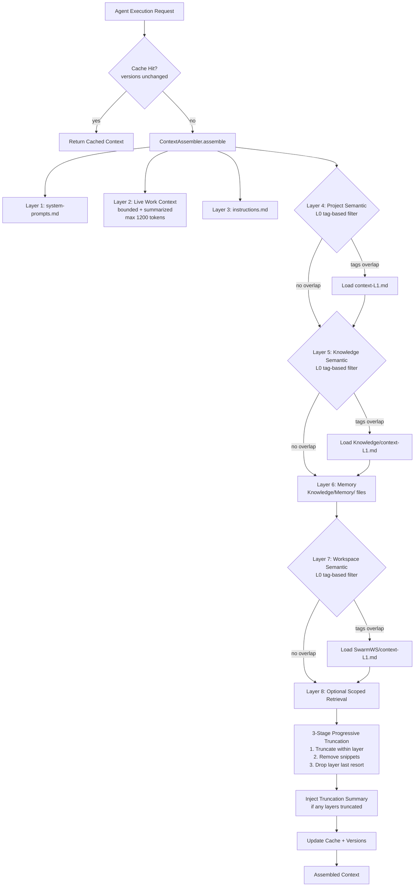
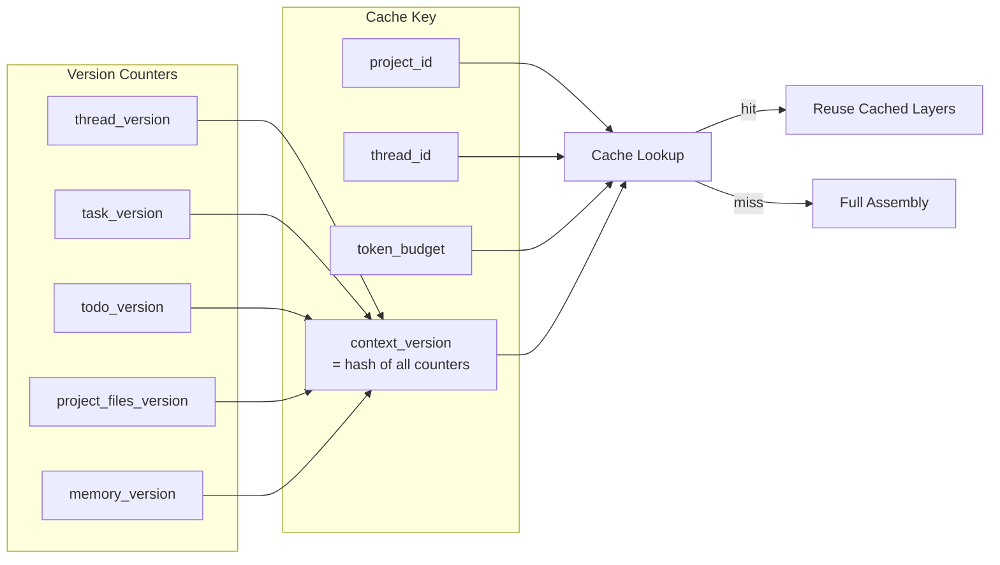
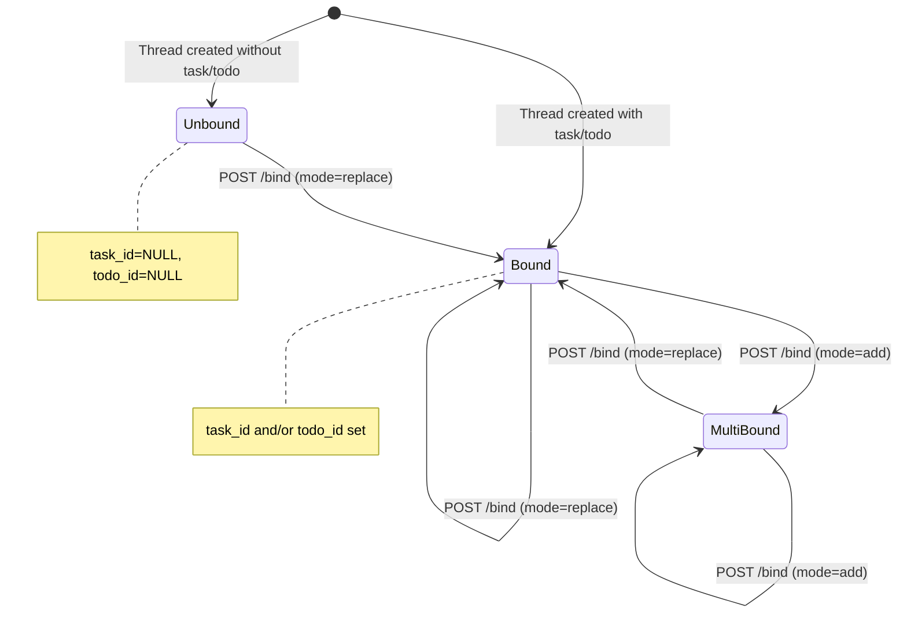
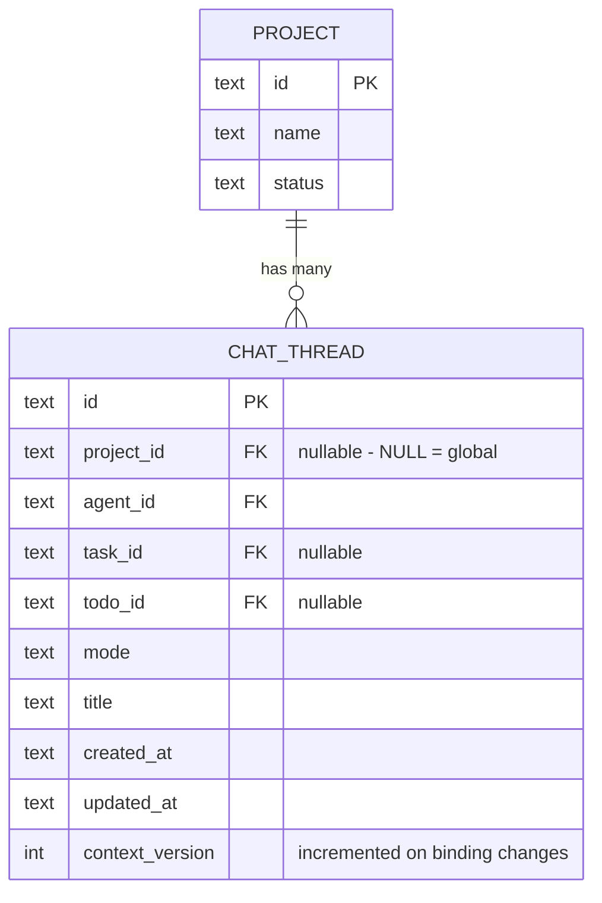
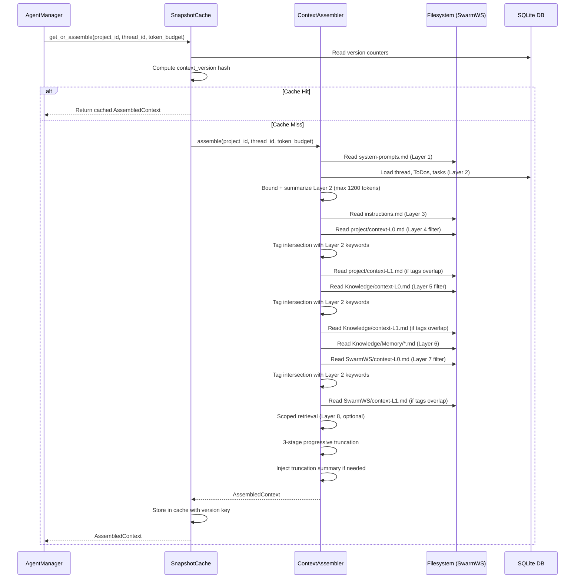

# Design Document — SwarmWS Intelligence (Cadence 4 of 4)

## Overview

This cadence implements the intelligence layer of the SwarmWS redesign: the 8-layer context assembly engine that powers agent runtime, chat thread association with projects, and a context assembly preview API for transparency.

The context assembler replaces the existing `ContextManager` (which reads a single `context.md` / `compressed-context.md` file) with a structured 8-layer pipeline that reads from the new SwarmWS folder hierarchy established in Cadences 1–3. Each layer has a defined priority, and the assembler enforces a configurable token budget using a 3-stage progressive truncation strategy (not whole-layer drops).

Chat threads gain a `project_id` column (replacing `workspace_id` semantics) so conversations are contextually bound to the project they relate to. Threads without a project are global SwarmWS chats (`project_id = NULL`). A thread binding API supports mid-session task/ToDo drag-drop binding with explicit state machine semantics.

The context preview API (`GET /api/projects/{id}/context`) exposes the assembled context layers to the frontend, enabling the "Visible Planning Builds Trust" design principle — users can inspect exactly what context an agent would see. The preview API uses ETag/version-based caching to avoid wasteful polling.

### Design Principles Alignment

- **Workspace is Primary Memory Container** — The 8-layer assembly treats SwarmWS as the persistent cognitive root, with Knowledge and Memory as shared semantic layers.
- **Visible Planning Builds Trust** — The context preview API and frontend panel let users see and understand agent context.
- **Context > Conversation** — Context files (L0/L1), instructions, and memory are first-class inputs to agent reasoning, not afterthoughts.
- **Gradual Disclosure** — The preview panel is collapsible; layers are shown with token counts and expandable content.

### Key Design Decisions

1. **New module `context_assembler.py`** rather than modifying the existing `context_manager.py`. The old ContextManager has a fundamentally different approach (single file + compressed cache). The assembler is a clean implementation aligned with the 8-layer model. The old ContextManager can be deprecated and removed in a follow-up cleanup.

2. **L0 fast-filter uses keyword/tag overlap** (layers 4, 5, 7). L0 files have structured YAML frontmatter with `tags` and `active_domains` fields. The filter performs token intersection between Layer 2 live context keywords and L0 semantic tags, rather than a simple "exists and non-template" check. Memory (layer 6) is loaded directly since it contains distilled user preferences/patterns that are always relevant. Layers 1–3 are always loaded (system prompt, live context, instructions).

3. **3-stage progressive truncation** replaces whole-layer drops. Stage 1: truncate within a layer (keep headers + top N tokens). Stage 2: remove least important files/snippets inside a layer. Stage 3: drop entire layer only as last resort. This preserves partial context from lower-priority layers rather than losing them entirely.

4. **Layer 2 is always present but bounded and summarized.** Long chat threads are summarized to prevent token explosion. Includes thread title, last user message, last assistant message, bound task/todo summary. Older messages are summarized. Bounded to configurable limit (default 800–1200 tokens).

5. **Context snapshot caching** with version counters avoids redundant DB + FS reads. Cache keyed by `(project_id, thread_id, token_budget, context_version)`. Lightweight version counters (`thread_version`, `task_version`, `todo_version`, `project_files_version`, `memory_version`) track changes. Cached layers reused when versions unchanged.

6. **`project_id` column added via schema update with safe evolution.** Cadence 1 (foundation) uses a clean-slate approach, but the schema update is applied safely using `PRAGMA table_info()` to check column existence before `ALTER TABLE ADD COLUMN` (SQLite does not support `IF NOT EXISTS` for columns). This clarifies the clean-slate expectation while protecting against partial migrations.

7. **Stable project pathing** uses `Projects/{project_id}/...` internally instead of `Projects/{name}/...`. Display name is stored in `.project.json`. This prevents path breakage when projects are renamed.

8. **Token estimation uses word-based heuristic** (1 token ≈ 0.75 words) consistent with the existing `estimate_tokens()` in `context_manager.py`. No external tokenizer dependency.

9. **Deterministic assembly guarantee.** Same inputs + same token budget → identical assembled context. Layer ordering is stable (ascending layer number), truncation is deterministic (same content + same budget = same truncation decisions), and no randomness is introduced.

10. **Truncation summary injection.** When layers are truncated, a `[Context truncated: <summary>]` marker is injected so the agent knows context was omitted and avoids hallucinating missing information.

11. **Preview API returns workspace-relative paths only.** Absolute filesystem paths are never exposed to the frontend to protect sensitive user directory information.

12. **Thread binding state machine** supports mid-session task/ToDo drag-drop. API: `POST /api/chat_threads/{thread_id}/bind` with `task_id`, `todo_id`, `mode` (replace|add). Validates binding, updates DB, increments `thread_context_version`, triggers context re-assembly on next turn.

## Architecture

### Context Assembly Pipeline

The assembler reads files from the SwarmWS filesystem in priority order, applies L0 tag-based fast-filtering on semantic layers, bounds Layer 2, and uses 3-stage progressive truncation when the token budget is exceeded.



### Context Snapshot Cache Architecture



### Thread Binding State Machine



### Chat Thread Project Association



### System Integration



## Components and Interfaces

### Backend Components

#### 1. `backend/core/context_assembler.py` — Context Assembly Engine

```python
"""8-layer context assembly engine for agent runtime.

This module implements the priority-ordered context assembly pipeline
defined in Requirement 16. It replaces the legacy ``ContextManager``
approach of reading a single context file with a structured 8-layer
pipeline that reads from the SwarmWS folder hierarchy.

Key design changes from PE review:
- L0 fast-filter uses tag/keyword overlap (not just exists-check)
- 3-stage progressive truncation (not whole-layer drops)
- Layer 2 is bounded and summarized
- Deterministic assembly guarantee
- Truncation summary injection for agent awareness
- Stable project pathing via project_id (not name)

Key public symbols:

- ``ContextAssembler``       — Main assembler class
- ``ContextLayer``           — Dataclass representing one assembled layer
- ``AssembledContext``        — Dataclass for the full assembly result
- ``TruncationInfo``         — Dataclass tracking truncation decisions
- ``LAYER_*`` constants      — Layer priority numbers
- ``DEFAULT_TOKEN_BUDGET``   — Default max token budget (10_000)
- ``LAYER_2_TOKEN_LIMIT``    — Default Layer 2 bound (1_200)
"""
from dataclasses import dataclass, field
from pathlib import Path
from typing import Optional
import logging
import yaml

logger = logging.getLogger(__name__)

# Layer priority constants (1 = highest priority)
LAYER_SYSTEM_PROMPT = 1
LAYER_LIVE_WORK = 2
LAYER_PROJECT_INSTRUCTIONS = 3
LAYER_PROJECT_SEMANTIC = 4
LAYER_KNOWLEDGE_SEMANTIC = 5
LAYER_MEMORY = 6
LAYER_WORKSPACE_SEMANTIC = 7
LAYER_SCOPED_RETRIEVAL = 8

DEFAULT_TOKEN_BUDGET = 10_000
LAYER_2_TOKEN_LIMIT = 1_200  # Max tokens for Layer 2 (live work context)
LAYER_2_MAX_MESSAGES = 10    # Max recent messages before summarization


@dataclass
class TruncationInfo:
    """Tracks truncation decisions for observability."""
    stage: int  # 1=within-layer, 2=snippet-removal, 3=layer-drop
    layer_number: int
    original_tokens: int
    truncated_tokens: int
    reason: str


@dataclass
class ContextLayer:
    """A single layer in the assembled context."""
    layer_number: int
    name: str
    source_path: str  # workspace-relative path (never absolute)
    content: str
    token_count: int
    truncated: bool = False
    truncation_stage: int = 0  # 0=none, 1/2/3 = stage


@dataclass
class AssembledContext:
    """Result of the full context assembly pipeline."""
    layers: list[ContextLayer] = field(default_factory=list)
    total_token_count: int = 0
    budget_exceeded: bool = False
    token_budget: int = DEFAULT_TOKEN_BUDGET
    truncation_log: list[TruncationInfo] = field(default_factory=list)
    truncation_summary: str = ""  # Injected into context when truncation occurs


class ContextAssembler:
    """Assembles context layers for agent runtime.

    Guarantees:
    - Deterministic: same inputs + same budget → identical output
    - Layers appear in strictly ascending layer_number order
    - Layer 2 is always present but bounded to LAYER_2_TOKEN_LIMIT
    - Progressive truncation preserves partial context from lower layers
    - Workspace-relative paths only (no absolute paths exposed)

    Args:
        workspace_path: Absolute path to the SwarmWS root directory.
        token_budget: Maximum token budget for assembled context.
    """

    def __init__(self, workspace_path: str, token_budget: int = DEFAULT_TOKEN_BUDGET):
        self._ws_path = Path(workspace_path)
        self._token_budget = token_budget

    async def assemble(
        self,
        project_id: str,
        thread_id: Optional[str] = None,
    ) -> AssembledContext:
        """Assemble all 8 context layers for a project.

        Assembly is deterministic: same inputs produce identical output.

        Validates: Requirement 16.1, 16.3, 16.4
        """
        ...

    async def _load_layer_1_system_prompt(self) -> Optional[ContextLayer]:
        """Read system-prompts.md from workspace root."""
        ...

    async def _load_layer_2_live_work(
        self, project_id: str, thread_id: Optional[str]
    ) -> Optional[ContextLayer]:
        """Load active chat thread, ToDos, tasks, files from DB.

        Layer 2 is always present but bounded and summarized:
        - Includes thread title, last user message, last assistant message
        - Includes bound task/todo summary
        - Limits to last K messages OR last N tokens (LAYER_2_TOKEN_LIMIT)
        - Older messages are summarized into a brief recap

        Validates: Requirement 16.1, PE Fix #3 (Layer 2 bounding)
        """
        ...

    def _summarize_layer_2(self, thread_data: dict, tasks: list, todos: list) -> str:
        """Produce a bounded summary of live work context.

        Returns a string bounded to LAYER_2_TOKEN_LIMIT tokens containing:
        - Thread title
        - Last user message
        - Last assistant message
        - Task/ToDo summary (title + status)
        - Summarized older messages if present
        """
        ...

    async def _load_layer_3_instructions(self, project_path: Path) -> Optional[ContextLayer]:
        """Read project instructions.md."""
        ...

    async def _load_layer_4_project_semantic(
        self, project_path: Path, live_context_keywords: set[str]
    ) -> Optional[ContextLayer]:
        """Load project context-L0.md for tag-based filtering, then context-L1.md if relevant.

        Validates: Requirement 16.2, PE Fix #1 (tag-based L0 filtering)
        """
        ...

    async def _load_layer_5_knowledge_semantic(
        self, live_context_keywords: set[str]
    ) -> Optional[ContextLayer]:
        """Load Knowledge/context-L0.md for tag-based filtering, then Knowledge/context-L1.md.

        Validates: Requirement 16.2, PE Fix #1 (tag-based L0 filtering)
        """
        ...

    async def _load_layer_6_memory(self) -> Optional[ContextLayer]:
        """Load all .md files from Knowledge/Memory/ directory.

        Memory files contain persistent semantic memory (user preferences,
        recurring themes, historical decisions). Always loaded — no L0 filter.
        Files are loaded in sorted order for determinism.
        """
        ...

    async def _load_layer_7_workspace_semantic(
        self, live_context_keywords: set[str]
    ) -> Optional[ContextLayer]:
        """Load SwarmWS/context-L0.md for tag-based filtering, then SwarmWS/context-L1.md.

        Validates: Requirement 16.2, PE Fix #1 (tag-based L0 filtering)
        """
        ...

    async def _load_layer_8_scoped_retrieval(self, project_id: str) -> Optional[ContextLayer]:
        """Optional scoped retrieval within SwarmWS. Placeholder for future RAG."""
        ...

    def _enforce_token_budget(self, layers: list[ContextLayer]) -> AssembledContext:
        """3-stage progressive truncation until within budget.

        Stage 1: Truncate within layer — keep headers + top N tokens of content
        Stage 2: Remove least important files/snippets inside the layer
        Stage 3: Drop entire layer as last resort

        Truncation proceeds from layer 8 upward. Layers 1–2 are never
        fully dropped (stage 3 never applied to them).

        After truncation, injects a truncation summary marker into the
        assembled context so the agent knows context was omitted.

        Validates: Requirement 16.4, PE Fix #2 (progressive truncation)
        """
        ...

    def _truncate_within_layer(self, layer: ContextLayer, target_tokens: int) -> ContextLayer:
        """Stage 1: Keep headers and first N tokens of a layer's content."""
        ...

    def _remove_snippets_from_layer(self, layer: ContextLayer, target_tokens: int) -> ContextLayer:
        """Stage 2: Remove least important sections/snippets within a layer."""
        ...

    def _build_truncation_summary(self, truncation_log: list[TruncationInfo]) -> str:
        """Build a truncation summary string for agent injection.

        Example: '[Context truncated: older memory + retrieval snippets omitted.
        Layers affected: 6 (Memory), 8 (Retrieval). Use tools to access full content.]'

        Validates: PE Enhancement A (truncation summary for agent)
        """
        ...

    def _is_l0_relevant(self, l0_content: str, live_context_keywords: set[str]) -> bool:
        """Determine if an L0 abstract indicates the L1 content is relevant.

        Parses YAML frontmatter from L0 content to extract `tags` and
        `active_domains` fields. Performs token intersection between these
        tags and the live_context_keywords derived from Layer 2.

        Returns True if there is any overlap between L0 tags/domains and
        the live context keywords. Also returns True if L0 has no frontmatter
        (backward compatibility) but has non-empty, non-template content.

        Validates: Requirement 16.2, PE Fix #1 (tag-based L0 filtering)
        """
        ...

    def _extract_l0_tags(self, l0_content: str) -> set[str]:
        """Extract tags and active_domains from L0 YAML frontmatter.

        Expected L0 format:
        ```
        ---
        tags: [python, api-design, authentication]
        active_domains: [backend, security]
        ---
        # Project Context Abstract
        ...
        ```
        """
        ...

    def _extract_live_context_keywords(self, layer_2_content: str) -> set[str]:
        """Extract keywords from Layer 2 live work context for L0 filtering.

        Extracts significant tokens from thread title, task titles,
        todo descriptions, and recent message content.
        """
        ...

    def _resolve_project_path(self, project_id: str) -> Optional[Path]:
        """Resolve project filesystem path from project_id.

        Uses Projects/{project_id}/ path (stable, ID-based) rather than
        Projects/{name}/ (unstable, name-based).

        Falls back to scanning .project.json files if ID-based directory
        doesn't exist (backward compatibility with name-based dirs).

        Validates: PE Fix #7 (stable project pathing)
        """
        ...

    def _to_workspace_relative(self, absolute_path: Path) -> str:
        """Convert absolute path to workspace-relative path.

        Validates: PE Fix #8 (no absolute paths in API responses)
        """
        ...

    @staticmethod
    def estimate_tokens(text: str) -> int:
        """Estimate token count using word-based heuristic (1 token ≈ 0.75 words)."""
        ...
```

#### 2. `backend/core/context_snapshot_cache.py` — Context Snapshot Cache

```python
"""Context snapshot cache with version-based invalidation.

This module implements the context snapshot caching layer (PE Fix #4)
to avoid redundant DB + FS reads during agent turns and preview polling.

Cache is keyed by (project_id, thread_id, token_budget, context_version).
Version counters are lightweight integers incremented on relevant changes.

Key public symbols:

- ``ContextSnapshotCache``   — Cache manager class
- ``VersionCounters``        — Dataclass holding all version counters
- ``CacheEntry``             — Cached assembly result with version metadata
"""
from dataclasses import dataclass
from typing import Optional
import hashlib
import logging

logger = logging.getLogger(__name__)


@dataclass
class VersionCounters:
    """Lightweight version counters for cache invalidation."""
    thread_version: int = 0
    task_version: int = 0
    todo_version: int = 0
    project_files_version: int = 0
    memory_version: int = 0

    def compute_hash(self) -> str:
        """Deterministic hash of all version counters."""
        raw = f"{self.thread_version}:{self.task_version}:{self.todo_version}:{self.project_files_version}:{self.memory_version}"
        return hashlib.sha256(raw.encode()).hexdigest()[:16]


@dataclass
class CacheEntry:
    """A cached context assembly result."""
    context: "AssembledContext"
    version_hash: str
    project_id: str
    thread_id: Optional[str]
    token_budget: int


class ContextSnapshotCache:
    """In-memory cache for assembled context snapshots.

    Avoids redundant DB + FS reads when context hasn't changed.
    Cache entries are invalidated when version counters change.

    Validates: PE Fix #4 (context snapshot caching)
    """

    def __init__(self, max_entries: int = 50):
        self._cache: dict[str, CacheEntry] = {}
        self._max_entries = max_entries

    def _make_key(self, project_id: str, thread_id: Optional[str], token_budget: int, version_hash: str) -> str:
        """Build cache key from parameters."""
        ...

    async def get_or_assemble(
        self,
        assembler: "ContextAssembler",
        project_id: str,
        thread_id: Optional[str],
        token_budget: int,
    ) -> "AssembledContext":
        """Return cached context if versions unchanged, else re-assemble.

        1. Read current version counters from DB
        2. Compute version hash
        3. Check cache for matching key
        4. On hit: return cached result
        5. On miss: call assembler.assemble(), store result, return
        """
        ...

    async def _read_version_counters(self, project_id: str, thread_id: Optional[str]) -> VersionCounters:
        """Read current version counters from DB."""
        ...

    def invalidate(self, project_id: str) -> None:
        """Invalidate all cache entries for a project."""
        ...

    def clear(self) -> None:
        """Clear entire cache."""
        ...
```

#### 3. `backend/schemas/context.py` — Context Pydantic Models

```python
"""Pydantic models for the context assembly preview API.

This module defines request/response schemas for the context preview
endpoint (Requirement 33). All field names use snake_case per the
backend API naming convention.

Key public symbols:

- ``ContextLayerResponse``    — Single layer in the preview response
- ``ContextPreviewResponse``  — Full preview response with all layers
- ``ThreadBindRequest``       — Request body for thread binding API
- ``ThreadBindResponse``      — Response for thread binding API
"""
from pydantic import BaseModel, Field
from typing import Optional


class ContextLayerResponse(BaseModel):
    """A single context layer in the preview response.

    source_path is always workspace-relative (never absolute).

    Validates: Requirement 33.2, PE Fix #8 (path safety)
    """
    layer_number: int = Field(..., description="Layer priority (1=highest)")
    name: str = Field(..., description="Human-readable layer name")
    source_path: str = Field(..., description="Workspace-relative path of the source")
    token_count: int = Field(..., description="Estimated token count for this layer")
    content_preview: str = Field(..., description="Content truncated to preview limit")
    truncated: bool = Field(False, description="Whether this layer was truncated")
    truncation_stage: int = Field(0, description="Truncation stage applied (0=none, 1/2/3)")


class ContextPreviewResponse(BaseModel):
    """Full context assembly preview response.

    Validates: Requirement 33.2, 33.3, 33.7
    """
    project_id: str = Field(..., description="Project UUID")
    thread_id: Optional[str] = Field(None, description="Optional chat thread ID")
    layers: list[ContextLayerResponse] = Field(default_factory=list)
    total_token_count: int = Field(0, description="Sum of all layer token counts")
    budget_exceeded: bool = Field(False, description="Whether token budget was exceeded")
    token_budget: int = Field(10000, description="Configured token budget")
    truncation_summary: str = Field("", description="Human-readable truncation summary")
    etag: str = Field("", description="Version-based ETag for caching")


class ThreadBindRequest(BaseModel):
    """Request body for mid-session thread binding.

    Validates: PE Fix #5 (mid-session task/ToDo binding)
    """
    task_id: Optional[str] = Field(None, description="Task ID to bind")
    todo_id: Optional[str] = Field(None, description="ToDo ID to bind")
    mode: str = Field("replace", description="Binding mode: 'replace' or 'add'")


class ThreadBindResponse(BaseModel):
    """Response for thread binding API.

    Validates: PE Fix #5 (mid-session task/ToDo binding)
    """
    thread_id: str
    task_id: Optional[str] = None
    todo_id: Optional[str] = None
    context_version: int = Field(..., description="Incremented version after binding")
```

#### 4. L0 File YAML Frontmatter Specification

L0 context files (`context-L0.md`) must include structured YAML frontmatter for tag-based filtering:

```yaml
---
tags: [python, api-design, authentication, fastapi]
active_domains: [backend, security, database]
---
# Project Context Abstract

Brief semantic abstract of the project scope, goals, and key concepts...
```

The `tags` field contains topic keywords relevant to the content. The `active_domains` field contains broader domain categories. Both are used for token intersection with Layer 2 live context keywords during L0 fast-filtering.

If an L0 file lacks YAML frontmatter (backward compatibility), the filter falls back to checking if the content is non-empty and non-template.

#### 5. Chat Thread Schema Changes

The `chat_threads` table gains a `project_id` column and a `context_version` counter. The schema update uses safe evolution:

```sql
-- Updated chat_threads table (Validates: Requirement 26.5, PE Fix #10)
-- Safe evolution: uses PRAGMA table_info() to check column existence
-- before ALTER TABLE ADD COLUMN (SQLite lacks IF NOT EXISTS for columns).
-- See _run_migrations() in sqlite.py for the actual implementation.
ALTER TABLE chat_threads ADD COLUMN project_id TEXT DEFAULT NULL;
ALTER TABLE chat_threads ADD COLUMN context_version INTEGER DEFAULT 0;
CREATE INDEX IF NOT EXISTS idx_chat_threads_project_id ON chat_threads(project_id);
```

**Schema Evolution Strategy (PE Fix #10, SE1):** The design expects a clean-slate DB from Cadence 1, but applies safe column addition using `PRAGMA table_info()` to check existence before `ALTER TABLE ADD COLUMN` (SQLite does not support `IF NOT EXISTS` for columns). This means:
- On clean installs: columns are part of the CREATE TABLE definition
- On existing installs: ALTER TABLE adds them safely without data loss
- No complex migration framework needed at this stage

The `SQLiteChatThreadsTable` class gains new query methods:

```python
async def list_by_project(self, project_id: str) -> list[dict]:
    """List all chat threads associated with a specific project.

    Validates: Requirement 26.1
    """
    ...

async def list_global(self) -> list[dict]:
    """List all chat threads not associated with any project (project_id IS NULL).

    Validates: Requirement 26.4
    """
    ...

async def bind_thread(self, thread_id: str, task_id: Optional[str], todo_id: Optional[str], mode: str) -> dict:
    """Bind or rebind a thread to a task/todo mid-session.

    Validates binding constraints:
    - mode='replace': overwrites existing task_id/todo_id
    - mode='add': only sets fields that are currently NULL
    - Increments context_version on any change
    - Validates task/todo belong to same project (cross-project guardrail)

    Validates: PE Fix #5 (mid-session binding)
    """
    ...

async def increment_context_version(self, thread_id: str) -> int:
    """Increment and return the new context_version for a thread."""
    ...
```

The `ChatThreadCreate` schema adds an optional `project_id` field:

```python
class ChatThreadCreate(BaseModel):
    """Updated to support project association."""
    project_id: Optional[str] = Field(None, description="Project UUID, NULL for global chats")
    # ... existing fields remain
```

The `ChatThreadResponse` schema adds `project_id` and `context_version`:

```python
class ChatThreadResponse(BaseModel):
    """Updated to include project association and version tracking."""
    project_id: Optional[str] = Field(None, description="Project UUID, NULL for global chats")
    context_version: int = Field(0, description="Version counter for cache invalidation")
    # ... existing fields remain
```

#### 6. Context Preview API Endpoint

```python
# In backend/routers/context.py

@router.get("/api/projects/{project_id}/context")
async def get_project_context(
    project_id: str,
    thread_id: Optional[str] = Query(None),
    token_budget: int = Query(10000),
    preview_limit: int = Query(500, description="Max chars per layer preview"),
    since_version: Optional[str] = Query(None, description="Version hash from previous response; returns 304 if unchanged"),
    if_none_match: Optional[str] = Header(None, alias="If-None-Match"),
) -> ContextPreviewResponse:
    """Return the assembled context for a project.

    Supports ETag-based caching (PE Fix #6):
    - Returns ETag header based on context version hash
    - If client sends If-None-Match matching current ETag, returns 304
    - ``since_version`` query param provides an alternative to ETag for
      clients that cannot set custom headers (PE Fix API2)
    - Avoids redundant assembly when context hasn't changed

    All source_path values are workspace-relative (PE Fix #8).

    Validates: Requirement 33.1, 33.4, 33.7, PE Fix #6, PE Fix #8
    """
    ...
```

#### 7. Thread Binding API Endpoint

```python
# In backend/routers/chat.py or backend/routers/context.py

@router.post("/api/chat_threads/{thread_id}/bind")
async def bind_thread(
    thread_id: str,
    request: ThreadBindRequest,
) -> ThreadBindResponse:
    """Bind or rebind a thread to a task/todo mid-session.

    Validates binding constraints:
    - task/todo must belong to the same project as the thread
    - Cross-project binding is blocked by default with warning (PE Enhancement C)
    - Increments thread context_version to trigger cache invalidation
    - Context re-assembly happens on next agent turn

    Validates: PE Fix #5 (mid-session binding), PE Enhancement C (cross-project guardrail)
    """
    ...
```

#### 8. Version Counter Management

Version counters are incremented at mutation points throughout the codebase:

```python
# In relevant managers/routers:

# thread_version: incremented when messages are added to a thread
# task_version: incremented when tasks are created/updated/deleted
# todo_version: incremented when todos are created/updated/deleted
# project_files_version: incremented when project files change (via file watcher or API)
# memory_version: incremented when Memory/ files are written

# Example in chat message handler:
async def add_message(self, thread_id: str, message: dict):
    # ... store message ...
    await db.chat_threads.increment_context_version(thread_id)
```

#### 9. Observability & Logging (PE Enhancement B)

The context assembler and cache include structured logging for debugging:

```python
# Logged at INFO level:
logger.info("Context assembly: project=%s thread=%s budget=%d", project_id, thread_id, token_budget)
logger.info("Layer sizes: %s", {l.name: l.token_count for l in layers})
logger.info("Cache %s: project=%s version=%s", "hit" if cached else "miss", project_id, version_hash)

# Logged at DEBUG level:
logger.debug("L0 filter: layer=%d tags=%s keywords=%s overlap=%s", layer_num, l0_tags, keywords, overlap)
logger.debug("Truncation: stage=%d layer=%d %d→%d tokens", stage, layer_num, original, truncated)
logger.debug("Binding change: thread=%s task=%s todo=%s mode=%s", thread_id, task_id, todo_id, mode)
```

#### 10. AgentManager Integration

The `AgentManager._build_system_prompt()` method is updated to use `ContextAssembler` via the `ContextSnapshotCache`:

```python
async def _build_system_prompt(self, agent_config, working_directory, channel_context):
    """Build system prompt with 8-layer context assembly.

    Replaces the old ContextManager.inject_context() call with
    ContextAssembler.assemble() via ContextSnapshotCache for structured,
    priority-ordered context injection with caching.
    """
    try:
        ws_config = await db.workspace_config.get_config()
        if ws_config:
            assembler = ContextAssembler(
                workspace_path=ws_config["file_path"],
                token_budget=agent_config.get("context_token_budget", DEFAULT_TOKEN_BUDGET),
            )
            project_id = self._resolve_project_id(agent_config, channel_context)
            thread_id = agent_config.get("thread_id")

            if project_id:
                result = await context_cache.get_or_assemble(
                    assembler, project_id, thread_id,
                    agent_config.get("context_token_budget", DEFAULT_TOKEN_BUDGET),
                )
                context_text = "\n\n".join(
                    f"## {layer.name}\n{layer.content}"
                    for layer in result.layers
                    if layer.content.strip()
                )
                # Inject truncation summary if any layers were truncated
                if result.truncation_summary:
                    context_text += f"\n\n{result.truncation_summary}"

                if context_text:
                    existing = agent_config.get("system_prompt", "") or ""
                    agent_config["system_prompt"] = (
                        existing + "\n\n" + context_text if existing else context_text
                    )
    except Exception as e:
        logger.warning(f"Failed to assemble context: {e}")
    # ... rest of existing method
```

### Frontend Components

#### 11. `desktop/src/types/index.ts` — New Type Additions

```typescript
/** A single layer in the context assembly preview. */
export interface ContextLayer {
  layerNumber: number;
  name: string;
  sourcePath: string;  // workspace-relative, never absolute
  tokenCount: number;
  contentPreview: string;
  truncated: boolean;
  truncationStage: number;
}

/** Full context assembly preview response. */
export interface ContextPreview {
  projectId: string;
  threadId: string | null;
  layers: ContextLayer[];
  totalTokenCount: number;
  budgetExceeded: boolean;
  tokenBudget: number;
  truncationSummary: string;
  etag: string;
}

/** Thread binding request. */
export interface ThreadBindRequest {
  taskId?: string;
  todoId?: string;
  mode: 'replace' | 'add';
}

/** Thread binding response. */
export interface ThreadBindResponse {
  threadId: string;
  taskId: string | null;
  todoId: string | null;
  contextVersion: number;
}
```

#### 12. `desktop/src/services/context.ts` — Context Service

```typescript
/**
 * Context assembly preview service.
 *
 * Provides methods to fetch the assembled context preview for a project,
 * with snake_case → camelCase conversion per the API naming convention.
 * Supports ETag-based caching to avoid redundant requests.
 *
 * Key exports:
 * - ``getContextPreview`` — Fetch context preview with ETag support
 * - ``bindThread``        — Bind task/todo to a thread mid-session
 * - ``toCamelCase``       — Convert snake_case API response to camelCase
 */

let lastEtag: string | null = null;

function toCamelCase(data: Record<string, unknown>): ContextPreview {
  return {
    projectId: data.project_id as string,
    threadId: (data.thread_id as string) ?? null,
    layers: ((data.layers as Record<string, unknown>[]) ?? []).map(layerToCamelCase),
    totalTokenCount: data.total_token_count as number,
    budgetExceeded: data.budget_exceeded as boolean,
    tokenBudget: data.token_budget as number,
    truncationSummary: (data.truncation_summary as string) ?? '',
    etag: (data.etag as string) ?? '',
  };
}

function layerToCamelCase(data: Record<string, unknown>): ContextLayer {
  return {
    layerNumber: data.layer_number as number,
    name: data.name as string,
    sourcePath: data.source_path as string,
    tokenCount: data.token_count as number,
    contentPreview: data.content_preview as string,
    truncated: data.truncated as boolean,
    truncationStage: (data.truncation_stage as number) ?? 0,
  };
}

async function getContextPreview(
  projectId: string,
  threadId?: string,
  tokenBudget?: number,
): Promise<ContextPreview | null> {
  const params = new URLSearchParams();
  if (threadId) params.set('thread_id', threadId);
  if (tokenBudget) params.set('token_budget', String(tokenBudget));
  const url = `/api/projects/${projectId}/context?${params}`;

  const headers: Record<string, string> = {};
  if (lastEtag) headers['If-None-Match'] = lastEtag;

  const response = await fetch(url, { headers });
  if (response.status === 304) return null; // Not modified
  const data = await response.json();
  const result = toCamelCase(data);
  lastEtag = result.etag || null;
  return result;
}

async function bindThread(
  threadId: string,
  request: { taskId?: string; todoId?: string; mode: 'replace' | 'add' },
): Promise<ThreadBindResponse> {
  const response = await fetch(`/api/chat_threads/${threadId}/bind`, {
    method: 'POST',
    headers: { 'Content-Type': 'application/json' },
    body: JSON.stringify({
      task_id: request.taskId,
      todo_id: request.todoId,
      mode: request.mode,
    }),
  });
  const data = await response.json();
  return {
    threadId: data.thread_id,
    taskId: data.task_id ?? null,
    todoId: data.todo_id ?? null,
    contextVersion: data.context_version,
  };
}
```

#### 13. `desktop/src/components/workspace/ContextPreviewPanel.tsx` — Preview UI

```tsx
/**
 * Collapsible context preview panel for project detail / chat views.
 *
 * Displays the 8-layer context assembly with token counts, source paths,
 * and expandable content previews. Uses ETag-based polling to avoid
 * redundant updates when context hasn't changed.
 *
 * Key exports:
 * - ``ContextPreviewPanel`` — Main panel component
 *
 * Validates: Requirement 33.5, 33.6, PE Fix #6 (scalable preview)
 */

interface ContextPreviewPanelProps {
  projectId: string;
  threadId?: string;
}

// Component renders:
// - Collapsible panel header with total token count badge
// - Truncation summary banner (if any layers truncated)
// - List of context layers, each showing:
//   - Layer number and name
//   - Source path (workspace-relative, muted text)
//   - Token count badge
//   - Truncation indicator with stage info if applicable
//   - Expandable content preview
// - Uses CSS variables (--color-*) for all theming
// - Polls every 5 seconds with ETag — skips re-render on 304 (Req 33.6, PE Fix #6)
```

## Data Models

### Context Assembly Data Flow

| Layer | Priority | Source Path | L0 Filter | Always Loaded | Bounded |
|-------|----------|-------------|-----------|---------------|---------|
| 1 — System Prompt | 1 (highest) | `system-prompts.md` | No | Yes | No |
| 2 — Live Work | 2 | DB: chat thread, ToDos, tasks | No | Yes | Yes (1200 tokens) |
| 3 — Instructions | 3 | `Projects/{project_id}/instructions.md` | No | Yes | No |
| 4 — Project Semantic | 4 | `Projects/{project_id}/context-L0.md`, `context-L1.md` | Yes (tag-based) | No | No |
| 5 — Knowledge Semantic | 5 | `Knowledge/context-L0.md`, `Knowledge/context-L1.md` | Yes (tag-based) | No | No |
| 6 — Memory | 6 | `Knowledge/Memory/*.md` | No | Yes | No |
| 7 — Workspace Semantic | 7 | `SwarmWS/context-L0.md`, `SwarmWS/context-L1.md` | Yes (tag-based) | No | No |
| 8 — Scoped Retrieval | 8 (lowest) | Various (future RAG) | No | No | No |

Note: All source paths are workspace-relative. `Projects/{project_id}/` uses the project UUID for stable pathing (PE Fix #7). Display name is stored in `.project.json`.

### Chat Thread Schema (Updated)

| Column | Type | Nullable | Description |
|--------|------|----------|-------------|
| id | TEXT | No | Primary key (UUID) |
| project_id | TEXT | Yes | Project UUID from `.project.json`. NULL = global SwarmWS chat |
| workspace_id | TEXT | No | Legacy field, retained for transition |
| agent_id | TEXT | No | Agent associated with thread |
| task_id | TEXT | Yes | Optional task binding |
| todo_id | TEXT | Yes | Optional ToDo binding |
| mode | TEXT | No | `explore` or `execute` |
| title | TEXT | No | Thread title |
| context_version | INTEGER | No | Version counter, incremented on binding changes |
| created_at | TEXT | No | ISO 8601 timestamp |
| updated_at | TEXT | No | ISO 8601 timestamp |

**Migration Plan: `workspace_id` → `project_id` Transition (PE Fix D1)**

The `workspace_id` column is retained for backward compatibility during the transition period:

1. **Current state (Cadence 4):** `project_id` is the canonical project association column. `workspace_id` is populated by legacy code paths but not used by the context assembler or thread queries.
2. **Deprecation (Cadence 5+):** New code paths will stop writing `workspace_id`. A migration will copy any remaining `workspace_id` values to `project_id` where `project_id IS NULL`.
3. **Removal (Cadence 6+):** The `workspace_id` column will be dropped via `ALTER TABLE` after confirming no code references remain.

Until removal, both columns coexist. The context assembler and all new queries use `project_id` exclusively.

### Token Budget Enforcement — 3-Stage Progressive Truncation

The token budget enforcement algorithm (PE Fix #2):

1. Assemble all layers in priority order (1–8)
2. Calculate cumulative token count
3. If total exceeds budget, apply 3-stage progressive truncation starting from layer 8 upward:

   **Stage 1 — Truncate within layer:**
   - Keep markdown headers and first N tokens of content
   - Preserves structure while reducing volume
   - Applied first to the lowest-priority layer that exceeds its share

   **Stage 2 — Remove snippets:**
   - Remove least important files/sections within the layer
   - For Memory (layer 6): keep most recent files, drop oldest
   - For Retrieval (layer 8): keep highest-relevance snippets
   - Applied when Stage 1 alone isn't sufficient

   **Stage 3 — Drop entire layer:**
   - Remove the layer entirely as last resort
   - Never applied to layers 1–2 (system prompt and live work are essential)
   - Applied only when Stages 1+2 on this layer still leave budget exceeded

4. After truncation, inject truncation summary: `[Context truncated: <details>]`
5. Return `AssembledContext` with `budget_exceeded = True` if any truncation occurred

### L0 Fast-Filter Logic (Tag-Based)

For layers 4, 5, and 7 (the semantic layers with L0/L1 files):

1. Read the `context-L0.md` file
2. Parse YAML frontmatter to extract `tags` and `active_domains`
3. Extract keywords from Layer 2 live work context (thread title, task titles, todo descriptions, recent messages)
4. Perform token intersection: `l0_tags ∩ live_context_keywords`
5. If intersection is non-empty → load the corresponding `context-L1.md` and combine both into the layer
6. If intersection is empty → skip the layer entirely (no token cost)
7. Fallback: if L0 has no YAML frontmatter, use legacy check (non-empty and non-template → load L1)

This provides a semantically meaningful relevance gate rather than a simple existence check.

### Layer 2 Bounding Strategy

Layer 2 (Live Work Context) is always present but bounded (PE Fix #3):

1. **Thread summary:** title + mode (explore/execute)
2. **Recent messages:** last K messages (default 10) or last N tokens (default 1200), whichever is smaller
3. **Older message summary:** if thread has more than K messages, summarize older messages into a 1-2 sentence recap
4. **Bound task/todo:** title + status + description snippet (first 100 chars)
5. **Total bound:** LAYER_2_TOKEN_LIMIT (default 1200 tokens)

### Context Snapshot Cache

Cache structure (PE Fix #4):

| Field | Type | Description |
|-------|------|-------------|
| cache_key | str | `{project_id}:{thread_id}:{token_budget}:{version_hash}` |
| context | AssembledContext | Cached assembly result |
| version_hash | str | SHA-256 hash of all version counters |
| created_at | float | Timestamp for LRU eviction |

Version counters stored in DB:

| Counter | Incremented When |
|---------|-----------------|
| thread_version | Message added, thread updated |
| task_version | Task created/updated/deleted |
| todo_version | ToDo created/updated/deleted |
| project_files_version | Project files modified (instructions.md, context files) |
| memory_version | Memory/ files written or deleted |

### Cross-Project Binding Guardrail (PE Enhancement C)

When a user drags a task/todo from a different project onto a thread:

1. Check if `task.project_id != thread.project_id`
2. If cross-project: return 409 Conflict with warning message
3. Warning: "Task belongs to project '{task_project_name}'. Binding cross-project tasks may cause context confusion. To proceed, re-send with `force: true`."
4. If `force: true` in request: allow binding, log warning, auto-switch thread's project context


## Correctness Properties

*A property is a characteristic or behavior that should hold true across all valid executions of a system — essentially, a formal statement about what the system should do. Properties serve as the bridge between human-readable specifications and machine-verifiable correctness guarantees.*

### Property 1: Context assembly priority ordering

*For any* project with context files at any subset of the 8 layers, the assembled context layers SHALL appear in strictly ascending layer number order (1 through 8). No layer with a higher number shall precede a layer with a lower number in the output list.

**Validates: Requirements 16.1**

### Property 2: Tag-based L0 fast-filter gating

*For any* L0 context file with YAML frontmatter containing `tags` and `active_domains`, and *for any* set of live context keywords extracted from Layer 2, the L1 file SHALL be loaded if and only if the intersection of (L0 tags ∪ active_domains) and live context keywords is non-empty. If the L0 file lacks YAML frontmatter, the L1 file SHALL be loaded if the L0 content is non-empty and non-template (backward compatibility).

**Validates: Requirements 16.2**

### Property 3: Token budget invariant

*For any* assembled context with a configured token budget B, the `total_token_count` of the result SHALL be less than or equal to B. This holds regardless of the number of layers, the size of individual layer content, or the token budget value.

**Validates: Requirements 16.3**

### Property 4: Progressive truncation respects priority and produces summary

*For any* context that exceeds the token budget, truncation SHALL proceed from layer 8 upward. Within each layer, truncation SHALL progress through stages (1: truncate within layer, 2: remove snippets, 3: drop layer) before moving to the next higher-priority layer. Stage 3 (full drop) SHALL never be applied to layers 1 or 2. When any truncation occurs, the `truncation_summary` field SHALL be non-empty and describe which layers were affected.

**Validates: Requirements 16.4**

### Property 5: Layer 2 bounding invariant

*For any* Layer 2 content, regardless of the number of messages in the chat thread or the size of bound tasks/todos, the resulting layer's token count SHALL not exceed `LAYER_2_TOKEN_LIMIT` (default 1200 tokens). The bounded content SHALL always include the thread title and the last user message.

**Validates: Requirements 16.1**

### Property 6: Chat thread project_id semantics

*For any* chat thread record in the database, the `project_id` field SHALL be either a valid project UUID (matching an existing `.project.json` `id`) or NULL. Threads created with a project context SHALL have a non-null `project_id`, and threads created without a project context SHALL have `project_id = NULL`.

**Validates: Requirements 26.4, 26.5**

### Property 8: Context preview layer completeness and path safety

*For any* context preview response, every layer in the `layers` array SHALL contain a non-empty `name`, a workspace-relative `source_path` (containing no absolute filesystem prefix), a non-negative `token_count`, and a `content_preview` whose length does not exceed the configured preview limit.

**Validates: Requirements 33.2**

### Property 9: Token count consistency

*For any* context preview response, the `total_token_count` field SHALL equal the sum of all individual layer `token_count` values, and `budget_exceeded` SHALL be `true` if and only if at least one layer has `truncated = true`.

**Validates: Requirements 33.3**

### Property 10: Deterministic assembly

*For any* identical inputs (same project_id, thread_id, token_budget, and identical file contents and DB state), two consecutive calls to `assemble()` SHALL produce byte-identical output — same layers in the same order with the same content and token counts.

**Validates: Requirements 16.1**

### Property 11: Cache correctness

*For any* two consecutive assembly requests with identical version counters (thread_version, task_version, todo_version, project_files_version, memory_version), the cache SHALL return the previously computed result without re-reading the database or filesystem. If any version counter has changed, the cache SHALL trigger a fresh assembly.

**Validates: Requirements 33.6**

### Property 12: Thread binding increments version

*For any* successful thread binding operation (via `POST /api/chat_threads/{thread_id}/bind`), the thread's `context_version` SHALL be strictly greater after the operation than before. The bound `task_id` and/or `todo_id` SHALL reflect the binding request according to the specified mode (`replace` overwrites, `add` fills NULLs only).

**Validates: Requirements 26.5**

### Property 13: Stable project pathing

*For any* project, the context assembler SHALL resolve the project's filesystem path using `project_id` (not project name). If a project is renamed (display name changed in `.project.json`), the assembly SHALL still locate and load the correct context files without path breakage.

**Validates: Requirements 16.1**

## Error Handling

### Context Assembly Errors

| Error Scenario | Handling | HTTP Status |
|---------------|----------|-------------|
| Project not found (invalid `project_id`) | Return 404 with descriptive message | 404 |
| Workspace path does not exist | Log warning, return empty context | 200 (empty layers) |
| Context file unreadable (permissions, encoding) | Skip layer, log warning, continue assembly | N/A (graceful skip) |
| Thread not found (invalid `thread_id`) | Skip layer 2 live work, log warning | 200 (layer 2 empty) |
| Token budget ≤ 0 | Use DEFAULT_TOKEN_BUDGET (10,000) | N/A |
| Memory directory empty | Layer 6 returns empty content, no error | N/A |
| L0 file missing but L1 exists | Treat as relevant (load L1 anyway) | N/A |
| L0 YAML frontmatter parse error | Log warning, fall back to legacy check | N/A |
| Layer 2 thread has 0 messages | Return minimal layer with thread title only | N/A |

### Chat Thread Errors

| Error Scenario | Handling | HTTP Status |
|---------------|----------|-------------|
| Create thread with invalid `project_id` | Validate project exists, return 404 if not | 404 |
| Create thread with NULL `project_id` | Store as global SwarmWS chat | 201 |
| Query threads by non-existent project | Return empty list | 200 |
| Depth guardrail violation in `chats/` | Reject with descriptive message | 400 |
| Bind thread with cross-project task | Return 409 with warning (PE Enhancement C) | 409 |
| Bind thread with invalid task/todo ID | Return 404 | 404 |

### Preview API Errors

| Error Scenario | Handling | HTTP Status |
|---------------|----------|-------------|
| ETag matches (context unchanged) | Return 304 Not Modified | 304 |
| Invalid project_id | Return 404 | 404 |
| Cache miss | Full assembly, return 200 | 200 |
| Assembly failure | Log error, return 200 with empty layers | 200 |

### Graceful Degradation

The context assembler is designed to be resilient:
- If any individual layer fails to load, the assembler skips that layer and continues with the remaining layers.
- The assembler never throws an exception that would prevent agent execution. All errors are caught, logged, and result in a degraded (but functional) context.
- The `AgentManager` wraps the entire assembly call in a try/except to ensure agent execution proceeds even if context assembly fails completely.
- Cache failures fall through to fresh assembly — cache is an optimization, not a requirement.
- L0 YAML parse failures fall back to legacy non-empty check — tag-based filtering degrades gracefully.

## Testing Strategy

### Property-Based Testing

Property-based tests use the `hypothesis` library (Python) for the backend. Each test runs a minimum of 100 iterations with randomized inputs.

Each property test references its design document property with a tag comment:

```python
# Feature: swarmws-intelligence, Property 1: Context assembly priority ordering
```

**Property tests to implement:**

1. **Context assembly priority ordering** — Generate random sets of context files across layers 1–8 with random content sizes. Verify assembled layers are in ascending order.

2. **Tag-based L0 fast-filter gating** — Generate random L0 YAML frontmatter with random tags/active_domains and random live context keywords. Verify L1 loading matches tag intersection logic.

3. **Token budget invariant** — Generate random context across all layers with random token budgets (100–50,000). Verify total never exceeds budget.

4. **Progressive truncation respects priority with summary** — Generate random oversized contexts. Verify truncation proceeds from layer 8 upward through stages 1→2→3, never drops layers 1–2, and produces non-empty truncation_summary.

5. **Layer 2 bounding invariant** — Generate random thread data with varying message counts (0 to 1000) and varying task/todo sizes. Verify Layer 2 token count never exceeds LAYER_2_TOKEN_LIMIT.

6. **Chat thread project_id semantics** — Generate random thread creation requests with and without project_id. Verify DB records match expectations.

7. **Chat thread project filesystem storage** — Generate random project IDs and thread IDs. Create threads and verify filesystem paths within project chats/ directory.

8. **Context preview layer completeness and path safety** — Generate random assembled contexts, map to preview responses. Verify every layer has non-empty name, workspace-relative source_path (no absolute prefix), non-negative token_count, and content_preview within limit.

9. **Token count consistency** — Generate random assembled contexts. Verify total_token_count equals sum of layer counts, and budget_exceeded flag is consistent with truncation.

10. **Deterministic assembly** — Generate random but fixed inputs. Call assemble() twice. Verify byte-identical output.

11. **Cache correctness** — Generate random version counters. Verify cache hit when counters unchanged, cache miss when any counter changes.

12. **Thread binding increments version** — Generate random binding requests. Verify context_version increases and task_id/todo_id reflect the request mode.

13. **Stable project pathing** — Generate random project names, create projects, rename them, verify assembly still resolves correct files.

### Unit Tests

Unit tests cover specific examples, edge cases, and integration points:

- **Context assembler**: Empty workspace (no files), single-layer context, all layers present, L0 YAML parse errors, L0 without frontmatter (legacy fallback)
- **L0 tag filtering**: Empty tags, disjoint tags, exact match, partial overlap, missing frontmatter
- **Token budget**: Exact budget match, budget of 0, very large context exceeding budget, progressive truncation stages
- **Layer 2 bounding**: Thread with 0 messages, thread with 1000 messages, thread with large task descriptions
- **Truncation summary**: Verify summary text describes affected layers, verify injection into assembled context
- **Chat threads**: Create with project, create global, list by project, list global, depth guardrail enforcement in chats/
- **Thread binding**: Bind task to unbound thread, rebind (replace mode), add mode on partially bound thread, cross-project binding rejection
- **Preview API**: Valid project, invalid project (404), with thread_id, without thread_id, preview truncation at configurable limit, ETag 304 response
- **Cache**: Cache hit, cache miss, cache invalidation on version change, LRU eviction
- **Path safety**: Verify no absolute paths in preview responses, verify workspace-relative conversion
- **Determinism**: Same inputs produce same output across multiple calls
- **AgentManager integration**: Verify `_build_system_prompt` calls ContextAssembler via cache, verify graceful degradation on failure, verify truncation summary injection
- **Schema**: Verify `project_id` column exists, NULL default, index creation, `context_version` column, safe ALTER TABLE on existing DB

### Test File Locations

| Test File | What It Tests |
|-----------|--------------|
| `backend/tests/test_context_assembler.py` | ContextAssembler unit + property tests (Properties 1–5, 10, 13) |
| `backend/tests/test_context_snapshot_cache.py` | ContextSnapshotCache unit + property tests (Property 11) |
| `backend/tests/test_chat_thread_project.py` | Chat thread project_id schema + queries + binding (Properties 6, 7, 12) |
| `backend/tests/test_context_preview_api.py` | Context preview endpoint integration tests (Properties 8, 9) |
| `desktop/src/components/__tests__/ContextPreviewPanel.test.tsx` | Frontend panel rendering + ETag polling |
| `desktop/src/services/__tests__/context.test.ts` | toCamelCase conversion + API calls + ETag handling |
