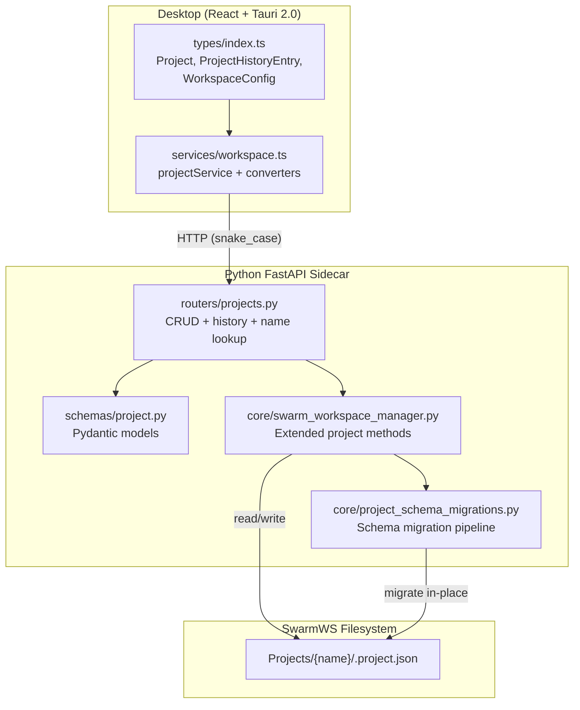

# Design Document — SwarmWS Projects (Cadence 2 of 4)

## Overview

Cadence 2 builds on the foundation established by Cadence 1 (`swarmws-foundation`), which delivers the single SwarmWS workspace, the `Knowledge/` domain (Knowledge Base/, Notes/, Memory/), the `Projects/` folder, depth guardrails, the system-managed item registry, and a basic `SwarmWorkspaceManager` with skeletal `create_project`, `delete_project`, `get_project`, and `list_projects` methods.

Cadence 2 extends this foundation with:

1. **Rich project metadata** — `.project.json` gains `description`, `priority`, `schema_version`, `version` counter, and an append-only `update_history` array (capped at 50 entries).
2. **Schema versioning** — A dedicated `project_schema_migrations.py` module applies forward-compatible migrations when the app reads an older `.project.json`.
3. **Full project CRUD** — `SwarmWorkspaceManager` gains `update_project`, `get_project_by_name`, and `get_project_history` methods; existing methods are extended to write the richer metadata.
4. **Projects API router** — A new `backend/routers/projects.py` extracts project endpoints from `workspace_api.py`, adding `GET /api/projects?name=`, `GET /api/projects/{id}/history`, and the enriched `PUT`.
5. **Frontend types** — `Project`, `ProjectCreateRequest`, `ProjectUpdateRequest`, `ProjectHistoryEntry`, and `WorkspaceConfig` interfaces are updated with all new fields.
6. **Frontend service layer** — `projectService` gains `getByName(name)` and `getHistory(id)` methods; `projectToCamelCase` / `projectUpdateToSnakeCase` converters handle the new fields.

### What Cadence 2 does NOT cover

- Workspace Explorer UX (Cadence 3)
- Context assembly, chat threads inside projects, preview API (Cadence 4)
- Knowledge/ CRUD — handled in Cadence 1
- No `Artifacts/` folder or Artifacts CRUD — the old Artifacts concept is replaced by `Knowledge/` in Cadence 1

## Architecture



### Component Interaction Flow

1. Frontend calls `projectService` methods using camelCase interfaces.
2. `projectService` converts to snake_case via `projectUpdateToSnakeCase` and calls the backend API.
3. `routers/projects.py` validates via Pydantic schemas and delegates to `SwarmWorkspaceManager`.
4. `SwarmWorkspaceManager` reads `.project.json`, applies schema migrations if needed (via `project_schema_migrations.py`), performs the operation, appends to `update_history`, and writes back.
5. Response flows back through the router as `ProjectResponse` (snake_case), converted to camelCase by `projectToCamelCase` in the frontend.

## Components and Interfaces

### 1. Project Schema Migrations Module (`backend/core/project_schema_migrations.py`)

Isolated, testable module for forward-compatible `.project.json` schema migrations.

```python
"""Forward-compatible schema migrations for .project.json metadata.

This module keeps all migration logic isolated from the workspace manager
so that each version-step function can be independently tested.

- ``CURRENT_SCHEMA_VERSION``  — The version the running app expects
- ``migrate()``               — Entry point: brings any older dict up to current
- ``_migrate_X_to_Y()``      — Individual step functions
"""

CURRENT_SCHEMA_VERSION = "1.0.0"

def migrate_if_needed(metadata: dict) -> tuple[dict, bool]:
    """Migrate a .project.json dict to CURRENT_SCHEMA_VERSION.

    Args:
        metadata: Raw parsed JSON dict from .project.json.

    Returns:
        (migrated_data, changed) — the updated dict and a boolean
        indicating whether any migration was applied.
        Returns the data unchanged with False if already current
        or if schema_version is newer than CURRENT_SCHEMA_VERSION.
    """
    ...

def compare_versions(a: str, b: str) -> int:
    """Compare two semver strings (MAJOR.MINOR.PATCH only). Returns -1, 0, or 1.

    Uses tuple comparison on ``(int, int, int)`` parsed from each string.
    Raises ``ValueError`` for malformed version strings (non-numeric parts,
    missing components, pre-release suffixes).
    """
    ...
```

Design decisions:
- Each migration step is a pure function `dict → dict` for testability.
- `migrate()` returns history entries separately so the caller can append them.
- If `schema_version` is newer than `CURRENT_SCHEMA_VERSION`, the data is returned as-is (forward compatibility — never downgrade).
- Migration steps are chained: `1.0.0 → 1.1.0 → 1.2.0 → ...`

### 2. Extended SwarmWorkspaceManager Methods

Building on the Cadence 1 skeleton, these methods are added or extended:

| Method | Change | Description |
|--------|--------|-------------|
| `create_project(name, workspace_path)` | **Extended** | Writes full `.project.json` with `description`, `priority`, `schema_version`, `version`, and initial `update_history` entry. Validates name via `_validate_project_name()` (length, characters, reserved names, case-insensitive collision) before creating the directory. |
| `update_project(project_id, updates, source, workspace_path)` | **New** | Updates metadata fields, auto-increments `version`, appends to `update_history`, renames directory if name changes |
| `get_project(project_id, workspace_path)` | **Extended** | Applies schema migration on read, returns enriched metadata |
| `get_project_by_name(name, workspace_path)` | **New** | Finds a project by display name, applies migration |
| `list_projects(workspace_path)` | **Extended** | Applies schema migration on each project read |
| `get_project_history(project_id, workspace_path)` | **New** | Returns the `update_history` array from `.project.json` |
| `_apply_migration_if_needed(project_dir, data)` | **New (private)** | Calls `project_schema_migrations.migrate()`, writes back if changed, returns migrated data |
| `_append_history_entry(data, action, changes, source)` | **New (private)** | Appends to `update_history`, enforces 50-entry cap, increments `version`, updates `updated_at` |
| `_detect_changes(old, new, fields)` | **New (private)** | Compares old vs new metadata to build a `changes` dict with `{field: {from, to}}` |
| `_find_project_dir(project_id, workspace_path)` | **New (private)** | Looks up UUID in `_uuid_index` (in-memory `dict[str, Path]` built on first call and updated by CRUD methods). Falls back to full `Projects/` scan if index miss. Raises `ValueError` if not found. |
| `_rebuild_uuid_index(workspace_path)` | **New (private)** | Scans all `Projects/` subdirs, reads each `.project.json`, populates `_uuid_index: dict[str, Path]`. Called lazily on first `_find_project_dir` invocation and after `create_project` / `delete_project`. |
| `_compute_action_type(changes)` | **New (private)** | Determines history action from changes dict using priority mapping: if `"name"` in changes → `renamed`; elif `"status"` → `status_changed`; elif `"tags"` → `tags_modified`; elif `"priority"` → `priority_changed`; else → `updated`. First match wins. |
| `_project_locks` | **New (class-level)** | `dict[str, asyncio.Lock]` — per-project lock keyed by UUID. Acquired in `update_project`, `get_project`, and `delete_project` to serialise `.project.json` access. |

> **Note:** `delete_project` (inherited from Cadence 1) also acquires the per-project lock before removing the project directory, ensuring no concurrent read or write is in progress during deletion.

#### Concurrency Model

All methods that read, write, or delete `.project.json` acquire a per-project
`asyncio.Lock` stored in `_project_locks: dict[str, asyncio.Lock]`.
The lock is keyed by project UUID and lazily created on first access
via `dict.setdefault` for atomic insertion.
This prevents lost-write races when concurrent API requests target the
same project, and prevents reads during deletion. The lock is *not* held across directory renames — the
rename itself is atomic on POSIX and near-atomic on Windows (NTFS).

```python
# In SwarmWorkspaceManager.__init__:
self._project_locks: dict[str, asyncio.Lock] = {}

def _get_project_lock(self, project_id: str) -> asyncio.Lock:
    """Return (or create) the asyncio.Lock for a project UUID."""
    return self._project_locks.setdefault(project_id, asyncio.Lock())
```

```python
async def update_project(
    self,
    project_id: str,
    updates: dict,
    source: str = "user",
    workspace_path: str = None,
) -> dict:
    """Update project metadata and record change in update_history.

    Args:
        project_id: UUID of the project.
        updates: Dict of fields to update (name, status, tags, priority, description).
        source: Who initiated the change — "user", "agent", "system", or "migration".
        workspace_path: Workspace root. If None, uses default.

    Returns:
        Updated project metadata dict.

    Raises:
        ValueError: If project not found or name conflict on rename.
    """
    ...

> **Nullable field handling:** The API router uses `model_dump(exclude_unset=True)` to distinguish between 'field not sent' (omitted) and 'field sent as null' (explicit clear). This correctly handles nullable fields like `priority` — sending `{"priority": null}` clears it, while omitting `priority` leaves it unchanged.

**Atomic rename strategy**: When a name change is requested, the method
follows a crash-safe sequence: (1) write updated metadata (with new name)
to the *existing* directory, (2) rename the directory, (3) on rename
failure, revert the metadata write. On rename failure, the original OS error is logged at ERROR level before reverting metadata, and the raised ValueError chains the original exception via `from exc` for full traceback preservation. This ensures the `.project.json`
always reflects the actual directory name. A per-project `asyncio.Lock`
(see below) serialises concurrent updates to the same project.
```

### 3. Projects API Router (`backend/routers/projects.py`)

Extracted from `workspace_api.py` into a dedicated router for project endpoints.

| Endpoint | Method | Description |
|----------|--------|-------------|
| `/api/projects` | GET | List all projects (returns `list[ProjectResponse]`). When `?name={name}` is provided, returns a **filtered list** containing at most one matching project (empty list if no match) — the return type remains `list` for API consistency. |
| `/api/projects` | POST | Create a new project. Returns 201 with metadata. |
| `/api/projects/{id}` | GET | Get project by UUID. |
| `/api/projects/{id}` | PUT | Update project metadata (name, status, tags, priority, description). |
| `/api/projects/{id}` | DELETE | Delete project. Returns 204. |
| `/api/projects/{id}/history` | GET | Get project update history array. |

All endpoints use `project_id` (UUID) as the path parameter. The `GET /api/projects?name={name}` query parameter provides human-readable lookup without changing the UUID-based API contract.

### 4. Frontend Type Definitions

```typescript
/** Project metadata from .project.json (Cadence 2 enriched). */
export interface Project {
  id: string;
  name: string;
  description: string;
  path: string;
  createdAt: string;
  updatedAt: string;
  status: 'active' | 'archived' | 'completed';
  priority?: 'low' | 'medium' | 'high' | 'critical';
  tags: string[];
  schemaVersion: string;
  version: number;
}

/** Request to create a new project. */
export interface ProjectCreateRequest {
  name: string;
}

/** Request to update a project. */
export interface ProjectUpdateRequest {
  name?: string;
  description?: string;
  status?: string;
  tags?: string[];
  priority?: string;
}

/** A single entry in the project update history. */
export interface ProjectHistoryEntry {
  version: number;
  timestamp: string;
  action: string;
  changes: Record<string, { from: unknown; to: unknown }>;
  source: 'user' | 'agent' | 'system' | 'migration';
}
```

### 5. Frontend Service Layer

`projectService` in `desktop/src/services/workspace.ts` is extended:

```typescript
/** Convert a snake_case project API response to camelCase (Cadence 2). */
export const projectToCamelCase = (data: Record<string, unknown>): Project => ({
  id: data.id as string,
  name: data.name as string,
  description: (data.description as string) || '',
  path: (data.path as string) || '',
  createdAt: data.created_at as string,
  updatedAt: data.updated_at as string,
  status: data.status as 'active' | 'archived' | 'completed',
  priority: data.priority as 'low' | 'medium' | 'high' | 'critical' | undefined,
  tags: (data.tags as string[]) || [],
  schemaVersion: data.schema_version as string,
  version: data.version as number,
});

/** Convert a camelCase project update request to snake_case (Cadence 2). */
export const projectUpdateToSnakeCase = (
  data: ProjectUpdateRequest
): Record<string, unknown> => {
  const result: Record<string, unknown> = {};
  if (data.name !== undefined) result.name = data.name;
  if (data.description !== undefined) result.description = data.description;
  if (data.status !== undefined) result.status = data.status;
  if (data.tags !== undefined) result.tags = data.tags;
  if (data.priority !== undefined) result.priority = data.priority;
  return result;
};

/** Convert a snake_case history entry to camelCase. */
export const historyEntryToCamelCase = (
  data: Record<string, unknown>
): ProjectHistoryEntry => ({
  version: data.version as number,
  timestamp: data.timestamp as string,
  action: data.action as string,
  changes: data.changes as Record<string, { from: unknown; to: unknown }>,
  source: data.source as 'user' | 'agent' | 'system' | 'migration',
});

export const projectService = {
  async listProjects(): Promise<Project[]> { ... },
  async createProject(data: ProjectCreateRequest): Promise<Project> { ... },
  async getProject(id: string): Promise<Project> { ... },
  async getProjectByName(name: string): Promise<Project> { ... },
  async updateProject(id: string, data: ProjectUpdateRequest): Promise<Project> { ... },
  async deleteProject(id: string): Promise<void> { ... },
  async getHistory(id: string): Promise<ProjectHistoryEntry[]> { ... },
};
```

## Data Models

### `.project.json` Schema (v1.0.0)

```json
{
  "id": "550e8400-e29b-41d4-a716-446655440000",
  "name": "My Project",
  "description": "",
  "created_at": "2025-01-15T10:30:00+00:00",
  "updated_at": "2025-01-15T10:30:00+00:00",
  "status": "active",
  "tags": [],
  "priority": null,
  "schema_version": "1.0.0",
  "version": 1,
  "update_history": [
    {
      "version": 1,
      "timestamp": "2025-01-15T10:30:00+00:00",
      "action": "created",
      "changes": {},
      "source": "user"
    }
  ]
}
```

### Pydantic Models (`backend/schemas/project.py`)

```python
"""Project metadata schemas for the SwarmWS single-workspace model (Cadence 2).

Enriched from Cadence 1 with description, priority, schema_version, version
counter, and update_history tracking.

- ``ProjectStatus``          — Literal type for lifecycle statuses
- ``ProjectPriority``        — Literal type for priority levels
- ``ProjectHistoryAction``   — Literal type for history action kinds
- ``ProjectHistorySource``   — Literal type for change sources
- ``ProjectHistoryEntry``    — Single update_history entry
- ``ProjectMetadata``        — Full .project.json model
- ``ProjectCreate``          — POST request body
- ``ProjectUpdate``          — PUT request body
- ``ProjectResponse``        — API response model
- ``ProjectHistoryResponse`` — GET /projects/{id}/history response
"""
from datetime import datetime, timezone
from typing import Any, Literal, Optional
from uuid import uuid4

from pydantic import BaseModel, Field

ProjectStatus = Literal["active", "archived", "completed"]
ProjectPriority = Literal["low", "medium", "high", "critical"]
ProjectHistoryAction = Literal[
    "created", "updated", "status_changed", "renamed",
    "archived", "restored", "tags_modified", "priority_changed",
    "schema_migrated",
]
ProjectHistorySource = Literal["user", "agent", "system", "migration"]


class ProjectHistoryEntry(BaseModel):
    """A single entry in the project update_history array."""
    version: int
    timestamp: str
    action: ProjectHistoryAction
    changes: dict[str, Any] = Field(default_factory=dict)
    source: ProjectHistorySource


class ProjectMetadata(BaseModel):
    """Full project metadata stored in .project.json."""
    id: str = Field(default_factory=lambda: str(uuid4()))
    name: str = Field(..., min_length=1, max_length=100)
    description: str = Field(default="")
    created_at: str = Field(
        default_factory=lambda: datetime.now(timezone.utc).isoformat()
    )
    updated_at: str = Field(
        default_factory=lambda: datetime.now(timezone.utc).isoformat()
    )
    status: ProjectStatus = Field(default="active")
    tags: list[str] = Field(default_factory=list)
    priority: Optional[ProjectPriority] = None
    schema_version: str = Field(default="1.0.0")
    version: int = Field(default=1)
    update_history: list[ProjectHistoryEntry] = Field(default_factory=list)


class ProjectCreate(BaseModel):
    """POST /api/projects request body."""
    name: str = Field(..., min_length=1, max_length=100)


class ProjectUpdate(BaseModel):
    """PUT /api/projects/{id} request body."""
    name: Optional[str] = Field(None, min_length=1, max_length=100)
    description: Optional[str] = None
    status: Optional[ProjectStatus] = None
    tags: Optional[list[str]] = None
    priority: Optional[ProjectPriority] = None


class ProjectResponse(ProjectMetadata):
    """API response model for a project (extends full metadata)."""
    path: str = Field(default="")


class ProjectHistoryResponse(BaseModel):
    """GET /api/projects/{id}/history response."""
    project_id: str
    history: list[ProjectHistoryEntry]
```

### Name Validation Rules

Project names must satisfy:
- Length: 1–100 characters
- Allowed characters: alphanumeric, spaces, hyphens, underscores, periods
- Regex: `^[a-zA-Z0-9][a-zA-Z0-9 _.\-]{0,99}$`
- Must not collide with an existing project name (case-insensitive comparison)
- Must not be a reserved filesystem name (e.g., `CON`, `PRN`, `NUL` on Windows)
- Must not have leading or trailing whitespace or trailing periods (stripped silently or rejected with error)

## Correctness Properties

The following properties were derived from the acceptance criteria in Requirements 4, 5, 18, 21, 22, 27, 31, and 32. Each property is universally quantified and references the specific requirements it validates.

### Property 1: Project creation produces complete metadata and template

*For any* valid project name (1–100 chars, filesystem-safe), creating a project should produce a directory under `Projects/` containing all Standard Project Template items (`context-L0.md`, `context-L1.md`, `instructions.md`, `chats/`, `research/`, `reports/`, `.project.json`), and the `.project.json` should contain all required fields (`id`, `name`, `description`, `created_at`, `updated_at`, `status`, `tags`, `priority`, `schema_version`, `version`) with `version` equal to 1 and an `update_history` array containing exactly one entry with action `created`.

**Validates: Requirements 4.2, 4.3, 5.1, 5.5, 18.1, 27.1, 27.2, 27.3, 27.4, 31.3**

### Property 2: Project deletion removes directory and deregisters project

*For any* existing project, deleting it by UUID should remove the project directory from the filesystem, and the project should no longer appear in the list returned by `list_projects`.

**Validates: Requirements 4.6, 18.6**

### Property 3: Project update reflects changes with version increment and history

*For any* existing project and any valid update (changing one or more of: name, description, status, tags, priority), after the update: the returned metadata should reflect the new values, `version` should be exactly one greater than before, `updated_at` should be newer than before, and `update_history` should contain one additional entry with the correct `action`, `changes` (with before/after values for each changed field), and `source`.

**Validates: Requirements 4.7, 18.5, 27.8, 31.1, 31.2**

### Property 4: Project name uniqueness and validation

*For any* project name that is empty, exceeds 100 characters, contains filesystem-unsafe characters, or duplicates an existing project name (case-insensitive), project creation should fail with an appropriate error. *For any* valid, unique name, creation should succeed.

**Validates: Requirements 18.2**

### Property 5: Project create-then-read round trip

*For any* set of created projects, `list_projects` should return all of them with metadata matching what was returned at creation time (modulo `updated_at` if migrations ran). Additionally, `get_project(id)` for any created project should return metadata equivalent to the corresponding entry in the list.

**Validates: Requirements 18.3, 18.4, 27.7**

### Property 6: Project name lookup equivalence

*For any* created project, `GET /api/projects?name={name}` should return the same project metadata as `GET /api/projects/{id}` for that project's UUID.

**Validates: Requirements 18.9**

### Property 7: Frontend snake_case ↔ camelCase conversion round trip

*For any* valid project metadata dict with all fields populated (including `description`, `priority`, `schema_version`, `version`), converting from snake_case to camelCase via `projectToCamelCase` should correctly map all fields. Separately, for the *updatable field subset* (name, description, status, tags, priority), converting a camelCase `ProjectUpdateRequest` to snake_case via `projectUpdateToSnakeCase` should preserve all values. Note: `projectUpdateToSnakeCase` only handles updatable fields — read-only fields like `id`, `createdAt`, `schemaVersion` are not round-tripped.. Similarly, `historyEntryToCamelCase` should correctly map all fields of any valid history entry.

**Validates: Requirements 21.6, 22.4**

### Property 8: Update history cap enforcement

*For any* project that has undergone N updates where N > 50, the `update_history` array should contain exactly 50 entries, and those entries should be the 50 most recent (by version number). No entries with version ≤ (N − 50) should be present.

**Validates: Requirements 27.5**

### Property 9: Update history source tracking and append-only invariant

*For any* sequence of project updates with varying `source` values (`user`, `agent`, `system`), each appended history entry should carry the correct `source`. Existing history entries (those not removed by cap enforcement) should remain unmodified across subsequent updates — their `version`, `timestamp`, `action`, `changes`, and `source` fields should not change.

**Validates: Requirements 31.4, 31.5, 31.8**

### Property 10: Schema migration correctness and forward compatibility

*For any* valid `.project.json` at schema version N where N < `CURRENT_SCHEMA_VERSION`, applying `migrate()` should produce a dict with `schema_version` equal to `CURRENT_SCHEMA_VERSION` that validates against the `ProjectMetadata` Pydantic model, and should include a `schema_migrated` history entry with source `system`. *For any* `.project.json` with `schema_version` > `CURRENT_SCHEMA_VERSION`, `migrate()` should return the data unchanged with no history entries.

**Validates: Requirements 27.10, 32.2, 32.3, 32.4, 32.6**

## Error Handling

| Scenario | HTTP Status | Error Detail | Source |
|----------|-------------|-------------|--------|
| Project name empty or too long | 422 | Pydantic validation error | `ProjectCreate` / `ProjectUpdate` schema |
| Project name contains unsafe characters | 400 | "Project name contains invalid characters" | `SwarmWorkspaceManager.create_project` |
| Project name already exists | 409 | "A project named '{name}' already exists" | `SwarmWorkspaceManager.create_project` |
| Project not found by UUID | 404 | "Project not found" | `SwarmWorkspaceManager.get_project` |
| Project not found by name | 404 | "No project found with name '{name}'" | `SwarmWorkspaceManager.get_project_by_name` |
| Name conflict on rename | 409 | "A project named '{name}' already exists" | `SwarmWorkspaceManager.update_project` |
| Corrupt `.project.json` (invalid JSON) | 500 | "Failed to read project metadata" | `SwarmWorkspaceManager._read_project_metadata` |
| Schema migration failure | 500 | "Schema migration failed for project '{name}'" | `project_schema_migrations.migrate` |
| Delete system-managed item | 403 | "Cannot delete system-managed item" | `workspace_api.py` (Cadence 1) |
| Depth guardrail exceeded | 400 | "Maximum folder depth of {N} exceeded" | `SwarmWorkspaceManager.validate_depth` (Cadence 1) |
| Path traversal attempt | 400 | "Path traversal not allowed" | `_validate_relative_path` |

All errors follow the existing `ErrorResponse` pattern defined in `backend/schemas/error.py`. Backend returns snake_case error responses; the frontend error handling layer processes them as-is.

## Testing Strategy

### Dual Testing Approach

This feature requires both unit tests and property-based tests for comprehensive coverage.

**Unit tests** focus on:
- Specific examples: creating a project with a known name and verifying exact field values
- Edge cases: empty names, max-length names, names with special characters, Windows reserved names
- Integration points: API router → SwarmWorkspaceManager → filesystem
- Error conditions: duplicate names, missing projects, corrupt `.project.json`
- History endpoint returns correct data for a known sequence of updates

**Property-based tests** focus on:
- Universal properties that hold for all valid inputs (Properties 1–10 above)
- Comprehensive input coverage through randomized project names, update sequences, and schema versions

### Property-Based Testing Configuration

- Library: `hypothesis` (Python, already in use in the project)
- Minimum iterations: 100 per property test
- Each property test must reference its design document property with a tag comment:
  - Format: `# Feature: swarmws-projects, Property {N}: {title}`
- Each correctness property is implemented by a single property-based test function

### Test File Organization

| File | Scope |
|------|-------|
| `backend/tests/test_project_crud_properties.py` | Properties 1–6 (create, delete, update, round-trip, name lookup) |
| `backend/tests/test_project_history.py` | Properties 8–9 (history cap, source tracking, append-only) |
| `backend/tests/test_project_schema_migrations.py` | Property 10 (migration correctness, forward compat) |
| `desktop/src/services/__tests__/projects.property.test.ts` | Property 7 (snake_case ↔ camelCase round trip) |
| `backend/tests/test_projects_api.py` | Unit/integration tests for API endpoints |
| `desktop/src/services/__tests__/workspace.test.ts` | Unit tests for `projectToCamelCase`, `projectUpdateToSnakeCase`, `historyEntryToCamelCase` |

### Hypothesis Strategies

Key generators for property tests:

```python
"""Hypothesis strategies for project property tests.

- ``valid_project_names``   — Generates filesystem-safe names (1–100 chars)
- ``project_updates``       — Generates valid ProjectUpdate dicts
- ``history_sources``       — Samples from user/agent/system/migration
- ``schema_versions``       — Generates valid semver strings
"""
from hypothesis import strategies as st

valid_project_names = st.from_regex(
    r"[a-zA-Z0-9][a-zA-Z0-9 _.\-]{0,99}", fullmatch=True
).filter(lambda n: n.strip() == n)

project_statuses = st.sampled_from(["active", "archived", "completed"])
project_priorities = st.sampled_from(["low", "medium", "high", "critical", None])
history_sources = st.sampled_from(["user", "agent", "system"])

project_updates = st.fixed_dictionaries({}, optional={
    "name": valid_project_names,
    "description": st.text(max_size=500),
    "status": project_statuses,
    "tags": st.lists(st.text(min_size=1, max_size=30), max_size=10),
    "priority": project_priorities,
}).filter(lambda d: len(d) > 0)
```
