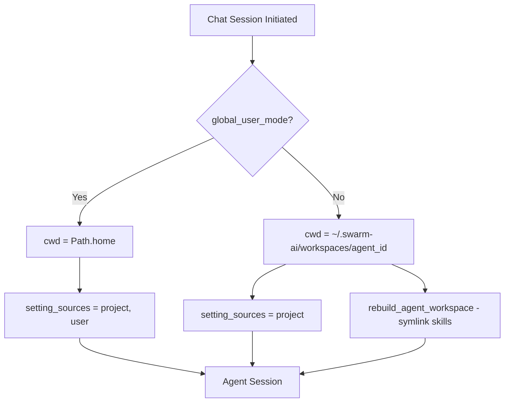
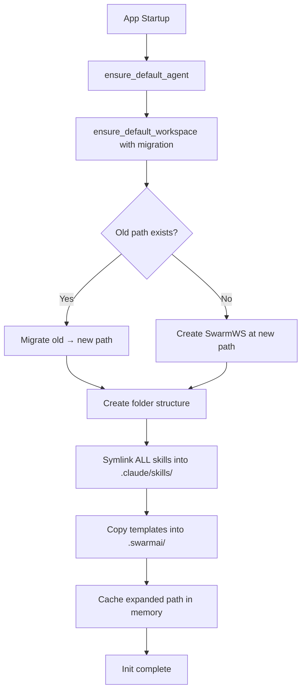
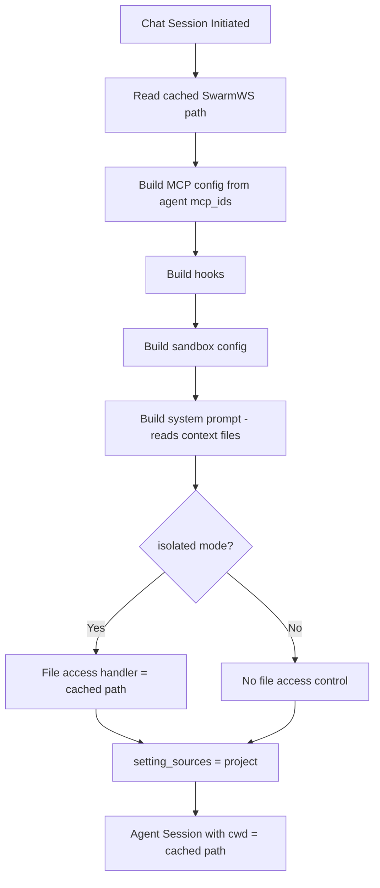
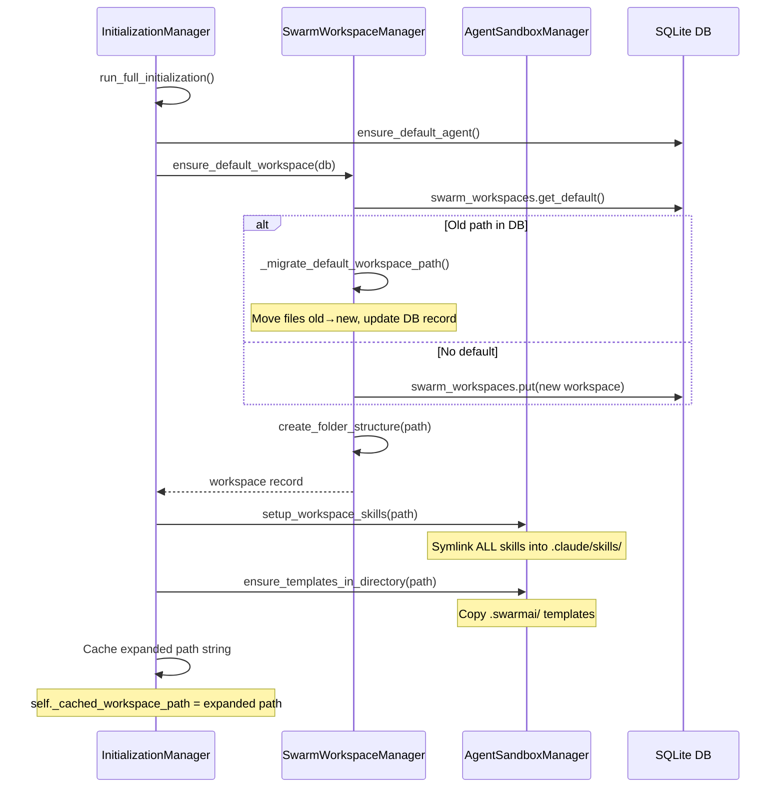
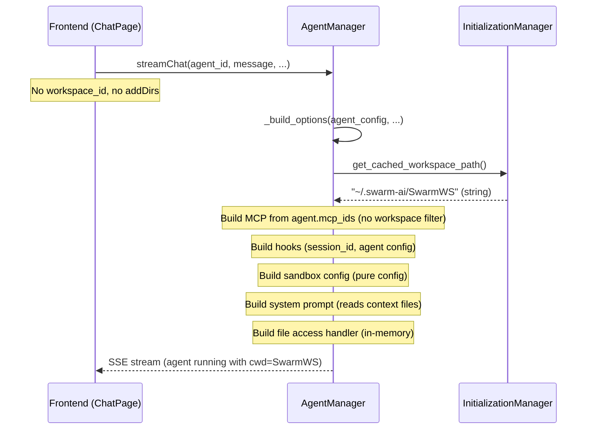

# Design Document: Unified SwarmWorkspace CWD

## Overview

This feature eliminates the dual working-directory model in SwarmAI (home directory for global mode, per-agent dirs for isolated mode) and replaces it with a single, hardcoded approach: all agents use `~/.swarm-ai/SwarmWS` as their working directory.

The design is split into two phases:

1. **App Init (heavy, one-time)**: Folder structure creation, skill symlinks, templates, path migration, default workspace DB record, and caching the expanded path in memory.
2. **Per-Session (lightweight, no filesystem I/O)**: Read cached path string, build MCP config from agent's `mcp_ids`, build hooks, build sandbox config, build system prompt (reads context files), build file access handler.

Key simplifications:
- Only one workspace ever exists (`SwarmWS` at `~/.swarm-ai/SwarmWS`)
- No `workspace_id` parameter in chat/session APIs
- `_resolve_workspace_mode()` is eliminated — its minimal remaining logic is inlined into `_build_options()`
- `WorkspaceConfigResolver` class is removed entirely
- Skill symlinks are set up at app init + on skill CRUD events, not per-session
- MCP config uses agent's `mcp_ids` directly, no workspace filtering

This aligns with the product design principle that **Workspace is the Primary Memory Container** — all agent outputs land directly in the single SwarmWorkspace.

### Current Flow



### Proposed Flow: App Init (Heavy)



### Proposed Flow: Per-Session (Lightweight)



## Architecture

### Component Interaction: App Init



### Component Interaction: Per-Session



### Key Design Decisions

1. **Single workspace, cached path**: There is only one workspace (`SwarmWS`). Its expanded path is cached in memory at app init. Per-session reads this string — no DB lookup, no path resolution logic.

2. **All heavy setup at app init**: Folder structure, skill symlinks, templates, and migration all happen in `InitializationManager.run_full_initialization()`. Per-session does zero filesystem I/O for workspace setup.

3. **Skills shared across all agents**: All skills are symlinked into `SwarmWS/.claude/skills/` at init. Per-agent skill restrictions are enforced via the PreToolUse hook (security layer 2), not by filesystem visibility.

4. **Skill re-sync on CRUD events**: When skills are created/updated/deleted via the API, `setup_workspace_skills()` is called to re-sync symlinks. This is the only time skill symlinks change outside of app init.

5. **MCP uses agent mcp_ids directly**: `_build_mcp_config()` iterates over `agent_config["mcp_ids"]` and looks up each MCP server from the DB. No `workspace_config_resolver.get_effective_mcps()` call, no `workspace_id` parameter.

6. **`_resolve_workspace_mode()` eliminated**: Its remaining logic (read cached path + build file access handler) is inlined into `_build_options()`. No separate method needed for 5 lines of code.

7. **`WorkspaceConfigResolver` removed**: Its initialization logic (skill/MCP registration) is folded into the init flow. Its runtime filtering (effective skills/MCPs per workspace) is no longer needed in a single-workspace model.

8. **Migration over breaking change**: For the path change from `swarm-workspaces/SwarmWS` to `SwarmWS`, existing data is migrated at startup rather than requiring manual user action.

## Components and Interfaces

### 1. `InitializationManager.run_full_initialization()` (Modified)

Gains workspace setup responsibilities. After ensuring the default workspace exists (with migration), it sets up skills, templates, and caches the path.

**New steps added after existing `ensure_default_workspace` call:**

```python
async def run_full_initialization(self) -> bool:
    from core.agent_manager import ensure_default_agent
    from core.swarm_workspace_manager import swarm_workspace_manager
    from core.agent_sandbox_manager import agent_sandbox_manager

    # ... existing: ensure_default_agent() ...

    # Create/migrate default workspace (includes folder structure)
    workspace = await swarm_workspace_manager.ensure_default_workspace(db)
    workspace_path = swarm_workspace_manager.expand_path(workspace["file_path"])

    # Setup skill symlinks (all skills, shared across agents)
    await agent_sandbox_manager.setup_workspace_skills(Path(workspace_path))

    # Ensure templates
    agent_sandbox_manager.ensure_templates_in_directory(Path(workspace_path))

    # Cache the expanded path for per-session use
    self._cached_workspace_path = workspace_path

    await self.set_initialization_complete(True)
    return True
```

**New accessor:**

```python
def get_cached_workspace_path(self) -> str:
    """Return the cached expanded SwarmWorkspace path.

    This path is set once during app init and read per-session.
    No DB lookup occurs.
    """
    if not hasattr(self, '_cached_workspace_path') or not self._cached_workspace_path:
        # Fallback: compute from DEFAULT_WORKSPACE_CONFIG
        from core.swarm_workspace_manager import swarm_workspace_manager
        self._cached_workspace_path = swarm_workspace_manager.expand_path(
            swarm_workspace_manager.DEFAULT_WORKSPACE_CONFIG["file_path"]
        )
    return self._cached_workspace_path
```

### 2. `AgentManager._build_options()` (Modified)

The `_resolve_workspace_mode()` call is replaced by inline logic that reads the cached path and builds the file access handler.

```python
async def _build_options(
    self,
    agent_config: dict,
    enable_skills: bool,
    enable_mcp: bool,
    resume_session_id: Optional[str] = None,
    session_context: Optional[dict] = None,
    channel_context: Optional[dict] = None,
) -> ClaudeAgentOptions:
    # 1. Resolve allowed tools
    allowed_tools = self._resolve_allowed_tools(agent_config)

    # 2. Build MCP server configuration (no workspace_id)
    mcp_servers = await self._build_mcp_config(agent_config, enable_mcp)

    # 3. Build hooks
    hooks, effective_skill_ids, allow_all_skills = await self._build_hooks(
        agent_config, enable_skills, enable_mcp,
        resume_session_id, session_context,
    )

    # 4. Resolve working directory and file access (inlined, no _resolve_workspace_mode)
    working_directory = initialization_manager.get_cached_workspace_path()
    setting_sources = ["project"]
    global_user_mode = agent_config.get("global_user_mode", True)

    if global_user_mode:
        file_access_handler = None
    else:
        allowed_directories = [working_directory]
        extra_dirs = agent_config.get("allowed_directories", [])
        if extra_dirs:
            allowed_directories.extend(extra_dirs)
        file_access_handler = create_file_access_permission_handler(allowed_directories)

    # 5. Build sandbox configuration
    sandbox_settings = self._build_sandbox_config(agent_config)

    # 6. Inject channel-specific MCP servers
    mcp_servers = self._inject_channel_mcp(mcp_servers, channel_context, working_directory)

    # 7. Resolve model
    model = self._resolve_model(agent_config)

    # 8. Build system prompt (reads context files — stays per-session)
    system_prompt_config = await self._build_system_prompt(
        agent_config, working_directory, channel_context,
    )

    # Assemble final options
    permission_mode = agent_config.get("permission_mode", "bypassPermissions")
    max_buffer_size = int(os.environ.get("MAX_BUFFER_SIZE", 10 * 1024 * 1024))

    return ClaudeAgentOptions(
        system_prompt=system_prompt_config,
        allowed_tools=allowed_tools if allowed_tools else None,
        mcp_servers=mcp_servers if mcp_servers else None,
        plugins=None,
        permission_mode=permission_mode,
        model=model,
        stderr=lambda msg: logger.error(msg),
        cwd=working_directory,
        setting_sources=setting_sources,
        hooks=hooks if hooks else None,
        resume=resume_session_id,
        sandbox=sandbox_settings,
        can_use_tool=file_access_handler,
        max_buffer_size=max_buffer_size,
        add_dirs=None,  # No longer used
    )
```

**Removed methods:**
- `_resolve_workspace_mode()` — eliminated entirely
- No `_resolve_swarm_workspace_path()` helper needed

**Removed parameters:**
- `workspace_id` removed from `_build_options()`, `_build_mcp_config()`, `_build_hooks()`, `_build_system_prompt()`

### 3. `AgentManager._build_mcp_config()` (Simplified)

Removes workspace filtering. Uses agent's `mcp_ids` directly.

```python
async def _build_mcp_config(
    self,
    agent_config: dict,
    enable_mcp: bool,
) -> dict:
    """Build MCP server configuration dict from agent's mcp_ids.

    Iterates over the agent's mcp_ids, looks up each MCP server record
    from the database, and assembles the mcp_servers dict.

    No workspace filtering — all agent MCPs are included.
    """
    mcp_servers: dict = {}

    if not (enable_mcp and agent_config.get("mcp_ids")):
        return mcp_servers

    # No workspace_config_resolver.get_effective_mcps() call
    # Use agent's mcp_ids directly

    used_names: set = set()
    for mcp_id in agent_config["mcp_ids"]:
        mcp_config = await db.mcp_servers.get(mcp_id)
        if mcp_config:
            connection_type = mcp_config.get("connection_type", "stdio")
            config = mcp_config.get("config", {})

            server_name = mcp_config.get("name", mcp_id)
            base_name = server_name
            suffix = 1
            while server_name in used_names:
                server_name = f"{base_name}_{suffix}"
                suffix += 1
            used_names.add(server_name)

            if connection_type == "stdio":
                mcp_servers[server_name] = {
                    "type": "stdio",
                    "command": config.get("command"),
                    "args": config.get("args", []),
                }
                env = config.get("env")
                if env and isinstance(env, dict):
                    mcp_servers[server_name]["env"] = env
            elif connection_type == "sse":
                mcp_servers[server_name] = {
                    "type": "sse",
                    "url": config.get("url"),
                }
            elif connection_type == "http":
                mcp_servers[server_name] = {
                    "type": "http",
                    "url": config.get("url"),
                }

    return mcp_servers
```

### 4. `AgentSandboxManager.setup_workspace_skills()` (New)

Replaces `rebuild_agent_workspace()`. Manages skill symlinks in the single workspace. Called at app init and on skill CRUD events. Symlinks ALL available skills (per-agent restrictions enforced via hooks).

```python
async def setup_workspace_skills(self, workspace_path: Path) -> None:
    """Setup skill symlinks in SwarmWS/.claude/skills/.

    Symlinks ALL available skills. Per-agent restrictions are enforced
    by the PreToolUse hook, not by filesystem visibility.

    Called at:
    - App init (InitializationManager.run_full_initialization)
    - Skill CRUD events (create, update, delete API handlers)

    Args:
        workspace_path: The SwarmWorkspace root directory.
    """
    skills_dir = workspace_path / ".claude" / "skills"
    skills_dir.mkdir(parents=True, exist_ok=True)

    # Get all available skill names
    target_skill_names = set(await self.get_all_skill_names())

    # Get current symlinks
    existing_links = {p.name for p in skills_dir.iterdir() if p.is_symlink()}

    # Remove stale symlinks
    for stale in existing_links - target_skill_names:
        (skills_dir / stale).unlink()

    # Add missing symlinks
    for skill_name in target_skill_names - existing_links:
        skill_record = await self._get_skill_by_name(skill_name)
        source_path = self._get_skill_source_path(skill_name, skill_record)
        if source_path and source_path.exists():
            try:
                (skills_dir / skill_name).symlink_to(source_path.resolve())
            except OSError as e:
                logger.error(f"Failed to symlink skill {skill_name}: {e}")
        else:
            logger.warning(f"Skill source not found, skipping: {skill_name}")
```

### 5. `SwarmWorkspaceManager` Changes

#### `DEFAULT_WORKSPACE_CONFIG` update:
```python
DEFAULT_WORKSPACE_CONFIG = {
    "name": "SwarmWS",
    "file_path": "{app_data_dir}/SwarmWS",  # Changed from {app_data_dir}/swarm-workspaces/SwarmWS
    "context": "Default SwarmAI workspace for general tasks and projects.",
    "icon": "🏠",
    "is_default": True,
}
```

#### `ensure_default_workspace()` modification:
Add migration logic when existing default has old path:

```python
async def ensure_default_workspace(self, db) -> dict:
    existing_default = await db.swarm_workspaces.get_default()

    if existing_default:
        # Check if migration needed (old path → new path)
        old_path_pattern = "{app_data_dir}/swarm-workspaces/SwarmWS"
        if existing_default["file_path"] == old_path_pattern:
            await self._migrate_default_workspace_path(existing_default, db)
            return await db.swarm_workspaces.get_default()
        logger.info("Default workspace already exists")
        return existing_default

    # ... existing creation logic with new DEFAULT_WORKSPACE_CONFIG ...
```

#### `_migrate_default_workspace_path()` (New):
```python
async def _migrate_default_workspace_path(self, workspace: dict, db) -> None:
    """Migrate default workspace from old nested path to new flat path."""
    old_expanded = self.expand_path(workspace["file_path"])
    new_file_path = self.DEFAULT_WORKSPACE_CONFIG["file_path"]
    new_expanded = self.expand_path(new_file_path)

    old_exists = Path(old_expanded).exists()
    new_exists = Path(new_expanded).exists()

    if old_exists and not new_exists:
        shutil.move(old_expanded, new_expanded)
        logger.info(f"Migrated workspace from {old_expanded} to {new_expanded}")
    elif old_exists and new_exists:
        logger.warning(
            f"Both old ({old_expanded}) and new ({new_expanded}) paths exist. "
            "Keeping new path. Old path left for manual cleanup."
        )
    # else: old doesn't exist, new may or may not — just update DB

    # Update database record
    workspace["file_path"] = new_file_path
    await db.swarm_workspaces.put(workspace)
    logger.info(f"Updated default workspace DB record to {new_file_path}")
```

### 6. Frontend Changes

#### `ChatPage.tsx`:
- Remove `addDirs: workDir ? [workDir] : undefined` from `streamChat()` call
- Remove `workspaceId` from `streamChat()` call
- Remove workspace selector dropdown component

#### `useWorkspaceSelection.ts`:
Simplified to return the single SwarmWS path. No workspace switching logic.

```typescript
// Simplified hook — returns the single SwarmWS for UI components that need the path
export function useWorkspaceSelection() {
  const { data: workspaces } = useWorkspaces();
  const defaultWorkspace = workspaces?.find(w => w.isDefault) ?? workspaces?.[0];
  const workDir = defaultWorkspace?.filePath ?? null;

  return {
    selectedWorkspace: defaultWorkspace ?? null,
    workDir,
    // No setSelectedWorkspace, no workspace switching
  };
}
```

#### `chat.ts` service:
- Remove `add_dirs` from the request body
- Remove `workspace_id` from the request body

### 7. Config Changes

#### `config.py`:
- `agent_workspaces_dir` setting is deprecated/removed since per-agent directories are no longer created.

### 8. Removed Components

- **`AgentManager._resolve_workspace_mode()`** — eliminated. Logic inlined into `_build_options()`.
- **`AgentManager._resolve_swarm_workspace_path()`** — not needed. Cached path read replaces it.
- **`WorkspaceConfigResolver` class** (`workspace_config_resolver.py`) — removed entirely. Init logic folded into `InitializationManager`. Runtime filtering no longer needed.
- **`AgentSandboxManager.rebuild_agent_workspace()`** — replaced by `setup_workspace_skills()` called at init.
- **`AgentSandboxManager.get_agent_workspace()`** — no longer called.
- **`AgentSandboxManager.delete_agent_workspace()`** — no longer needed.

## Data Models

### SwarmWorkspace (Database Record — unchanged schema)

The database schema does not change. Only the `file_path` value changes for the default workspace. The `swarm_workspaces` table is retained for future extensibility.

| Field | Type | Description |
|-------|------|-------------|
| `id` | `str (UUID)` | Unique workspace identifier |
| `name` | `str` | Display name ("SwarmWS") |
| `file_path` | `str` | Filesystem path with placeholders (`{app_data_dir}/SwarmWS`) |
| `context` | `str` | Workspace context/description |
| `icon` | `str` | Emoji icon |
| `is_default` | `bool` | Whether this is the default workspace |
| `archived` | `bool` | Whether workspace is archived |
| `created_at` | `str (ISO)` | Creation timestamp |
| `updated_at` | `str (ISO)` | Last update timestamp |

### Filesystem Layout (After Change)

> **Reconciliation Note:** This layout was written before the SwarmWS Redesign (Cadence 1) was implemented. The actual implemented layout differs — see below.

**Actual implemented layout (as of Cadence 1 `swarmws-foundation`):**
```
~/.swarm-ai/
├── data.db
├── logs/
├── SwarmWS/                          # Single workspace (flattened path)
│   ├── system-prompts.md             # Root system files
│   ├── context-L0.md
│   ├── context-L1.md
│   ├── Signals/                      # Operating Loop sections
│   ├── Plan/
│   ├── Execute/
│   ├── Communicate/
│   ├── Reflection/
│   ├── Artifacts/                    # Shared knowledge (legacy naming)
│   │   ├── context-L0.md
│   │   └── context-L1.md
│   ├── Notebooks/                    # Shared knowledge (legacy naming)
│   │   ├── context-L0.md
│   │   └── context-L1.md
│   ├── Projects/                     # Active work
│   │   ├── context-L0.md
│   │   └── context-L1.md
│   ├── Knowledge/
│   │   └── Memory/                   # Persistent semantic memory
│   ├── .claude/
│   │   └── skills/                   # ALL skill symlinks (shared across agents)
│   └── .swarmai/                     # Templates (set up at init)
```

> **Known gap:** The parent redesign spec defines `Knowledge/` with `Knowledge Base/`, `Notes/`, `Memory/` replacing `Artifacts/` and `Notebooks/`. The explorer (Cadence 3) expects `Knowledge` as a semantic zone folder. A folder structure migration spec is needed to resolve this.

### Removed Filesystem Layout

```
~/.swarm-ai/
└── workspaces/                       # REMOVED
    └── {agent_id}/                   # REMOVED
        ├── .claude/skills/           # REMOVED (now in SwarmWS)
        └── .swarmai/                 # REMOVED (now in SwarmWS)
```


## Correctness Properties

*Properties that should hold true across all valid executions of the system.*

### Property 1: Cached path equals expanded default workspace path

*For any* app initialization, the value returned by `get_cached_workspace_path()` should equal `swarm_workspace_manager.expand_path(DEFAULT_WORKSPACE_CONFIG["file_path"])` — i.e., the expanded form of `{app_data_dir}/SwarmWS`.

**Validates: Requirements 1.1, 1.2, 2.1**

### Property 2: Unified cwd regardless of workspace mode

*For any* agent configuration (whether `global_user_mode` is True or False), the `cwd` in the assembled `ClaudeAgentOptions` should be the cached SwarmWorkspace path — never `Path.home()` and never a per-agent directory under `workspaces/{agent_id}/`.

**Validates: Requirements 1.3, 1.4, 5.1**

### Property 3: Setting sources always project-only

*For any* agent configuration (regardless of `global_user_mode` value), the `setting_sources` in the assembled `ClaudeAgentOptions` should always be `['project']`.

**Validates: Requirement 5.4**

### Property 4: Skill symlink set equals all available skills

*For any* set of available skills in the database, after calling `setup_workspace_skills(workspace_path)`, the set of symlink names in `{workspace_path}/.claude/skills/` should be exactly equal to the set of all available skill names. Stale symlinks are removed, missing symlinks are added.

**Validates: Requirements 3.2, 3.4**

### Property 5: Skill symlink idempotence

*For any* workspace path, calling `setup_workspace_skills(workspace_path)` twice in succession with the same skill set should produce the same filesystem state as calling it once. The second call is a no-op.

**Validates: Requirements 3.2, 3.4**

### Property 6: Template idempotence

*For any* workspace path, after calling `ensure_templates_in_directory(workspace_path)`, the `.swarmai/` directory should contain all expected template files. If a template file already exists with modified content, the existing content should be preserved (not overwritten). Calling the method again does not change the filesystem.

**Validates: Requirements 4.1, 4.2**

### Property 7: File access control determined by workspace mode

*For any* agent configuration with `global_user_mode=False`, the `can_use_tool` handler in `ClaudeAgentOptions` should allow file access within the cached SwarmWorkspace path (and any additional `allowed_directories`) and deny access outside. *For any* agent configuration with `global_user_mode=True`, `can_use_tool` should be `None`.

**Validates: Requirements 7.1, 7.2, 7.3**

### Property 8: Non-destructive folder structure integrity

*For any* SwarmWorkspace path that may already contain files, after `create_folder_structure()` completes, the standard folders (`Artifacts/`, `ContextFiles/`, `Transcripts/` and subdirectories) should exist, and any pre-existing files should remain unmodified.

**Validates: Requirements 8.1, 8.2**

### Property 9: MCP config built without workspace filtering

*For any* agent configuration with `mcp_ids`, the MCP servers dict returned by `_build_mcp_config()` should contain entries for all valid MCP IDs in the agent's `mcp_ids` list — with no filtering by workspace. The method should not reference `workspace_config_resolver`.

**Validates: Requirements 9.1, 9.2, 9.3**

### Property 10: Migration preserves workspace contents

*For any* existing workspace at the old path `{app_data_dir}/swarm-workspaces/SwarmWS`, after migration, the new path `{app_data_dir}/SwarmWS` should contain all files that were in the old path. The DB record should reference the new path pattern.

**Validates: Requirements 2.3, 2.4, 2.5**

### Property 11: No per-session filesystem I/O for workspace setup

*For any* chat session, the `_build_options()` method should not call `Path.mkdir()`, `setup_workspace_skills()`, `ensure_templates_in_directory()`, `create_folder_structure()`, or any other filesystem-writing operation for workspace setup. It should only read the cached path string and build in-memory config objects.

**Validates: Requirements 1.2, 3.6, 4.3, 8.3**

## Error Handling

### App Init Errors

| Scenario | Handling |
|----------|----------|
| `shutil.move()` fails during migration | Log error, keep old path in DB, don't crash startup |
| Both old and new paths exist | Keep new path, log warning, leave old path for manual cleanup |
| Folder structure creation fails (permissions) | Log error, fail initialization (critical) |
| Skill symlink creation fails for one skill | Log error, continue with remaining skills |
| Template copy fails | Log warning, continue (non-critical) |

### Per-Session Errors

| Scenario | Handling |
|----------|----------|
| Cached path not set (init incomplete) | Fallback: compute from `DEFAULT_WORKSPACE_CONFIG` |
| MCP server record not found in DB | Skip that MCP, continue with remaining |

### Frontend Error Handling

| Scenario | Handling |
|----------|----------|
| Backend returns error for chat | Display error in chat, allow retry |
| No workspaces returned from API | Show empty state, workspace created at next app restart |

## Testing Strategy

### Property-Based Testing

Use `hypothesis` (Python) for backend property tests. Each property test runs a minimum of 100 iterations.

**Library:** `hypothesis` for Python backend tests

**Tests to implement:**

1. **Property 1 test** — Verify `get_cached_workspace_path()` returns the expanded default path after init.
   - Tag: `Feature: unified-swarm-workspace-cwd, Property 1: Cached path equals expanded default`

2. **Property 2 test** — Generate random agent configs with varying `global_user_mode` values, verify `cwd` is always the cached SwarmWS path.
   - Tag: `Feature: unified-swarm-workspace-cwd, Property 2: Unified cwd regardless of workspace mode`

3. **Property 3 test** — Generate random agent configs, verify `setting_sources` is always `['project']`.
   - Tag: `Feature: unified-swarm-workspace-cwd, Property 3: Setting sources always project-only`

4. **Property 4 test** — Generate random sets of skill names, call `setup_workspace_skills()`, verify symlink set matches all available skills.
   - Tag: `Feature: unified-swarm-workspace-cwd, Property 4: Skill symlink set equals all available skills`

5. **Property 5 test** — Generate random skill sets, call `setup_workspace_skills()` twice, verify filesystem state is identical after both calls.
   - Tag: `Feature: unified-swarm-workspace-cwd, Property 5: Skill symlink idempotence`

6. **Property 6 test** — Generate random template content modifications, call `ensure_templates_in_directory()`, verify modified files preserved and missing files created.
   - Tag: `Feature: unified-swarm-workspace-cwd, Property 6: Template idempotence`

7. **Property 7 test** — Generate random agent configs and workspace paths, verify file access handler behavior matches mode.
   - Tag: `Feature: unified-swarm-workspace-cwd, Property 7: File access control determined by workspace mode`

8. **Property 8 test** — Generate random file trees in a workspace, call `create_folder_structure()`, verify standard folders exist and pre-existing files untouched.
   - Tag: `Feature: unified-swarm-workspace-cwd, Property 8: Non-destructive folder structure integrity`

### Unit Tests

- **Migration tests**: Old path exists → moved to new; both exist → new kept; neither → created fresh
- **Default workspace config**: Verify `DEFAULT_WORKSPACE_CONFIG["file_path"]` equals `"{app_data_dir}/SwarmWS"`
- **Cached path fallback**: Verify fallback computation when `_cached_workspace_path` not set
- **Edge case: empty skill set**: `setup_workspace_skills()` with no skills in DB should remove all existing symlinks
- **Edge case: skill source missing**: Verify warning logged and other skills still linked
- **MCP config**: Verify all agent `mcp_ids` included, no workspace filtering
- **Frontend**: Verify `streamChat` request body has no `add_dirs` or `workspace_id`
- **Removed methods**: Verify `_resolve_workspace_mode` no longer exists on `AgentManager`

### Test Configuration

- Property tests: minimum 100 iterations via `@settings(max_examples=100)`
- Use `tmp_path` pytest fixture for filesystem tests
- Mock database calls in unit tests; use in-memory SQLite for integration tests
- Each property test must reference its design document property via comment tag
