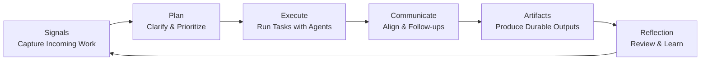

# Swarm Workspace — High-Level Design Specification
## Swarm Workspace = Daily Work Operating Loop

> This document defines the architecture for Swarm Workspaces in SwarmAI.  
> Swarm Workspace is a **Daily Work Operating Loop** that supports the full lifecycle of knowledge work:  
> **Signals → Plan → Execute → Communicate → Artifacts → Reflection → (repeat)**

This model ensures that SwarmAI does not merely store tasks or files, but actively orchestrates the daily rhythm of professional work.

---

# 1. Vision & Core Concept

Swarm Workspace is a **Persistent Agentic Operating Environment** where AI agents and users collaborate to manage the entire flow of daily knowledge work.

It is not a static container.  
It is a **dynamic operating loop** that continuously cycles through:



Each loop phase corresponds to a first-class workspace section.

---

# 2. Goals & Design Principles

## 2.1 Product Goals

1. Support the complete daily workflow of knowledge workers.
2. Convert fragmented signals into structured execution.
3. Provide governed multi-agent execution under human supervision.
4. Transform outputs into durable institutional knowledge.
5. Enable compounding productivity through reflection and memory.

## 2.2 Core Design Principles

* Workspace mirrors real daily work loops.
* Tasks are execution threads, not conversations.
* Communication is a first-class workload.
* Artifacts are durable knowledge outputs.
* Reflection closes the loop and enables learning.
* Progressive disclosure prevents cognitive overload.
* Hybrid storage ensures portability + structured governance.

---

# 3. Workspace Hierarchy

## 3.1 SwarmWS — Root Workspace (Global Daily Work Operating System)

**SwarmWS** is the built-in, non-deletable Root Workspace automatically created for every user. It serves as the **Global Daily Work Operating System** and primary cockpit for managing a knowledge worker's entire daily work lifecycle.

```mermaid
flowchart TD
A[SwarmWS - Root Workspace\n(Global Daily Work Loop)]
B1[Workspace: Project Alpha]
B2[Workspace: Customer Account]
B3[Workspace: Personal Initiatives]

A --> B1
A --> B2
A --> B3
```

### SwarmWS Core Responsibilities

| Function | Role |
|----------|------|
| Signals | Universal inbox — aggregates all incoming work signals |
| Plan | Cross-workspace planning dashboard |
| Execute | Default execution context for general/ad-hoc work |
| Communicate | Global communication command center |
| Artifacts | Personal long-term knowledge repository |
| Reflection | Learning and improvement hub across all work |

### SwarmWS Behavioral Rules

* **Non-deletable**: SwarmWS cannot be deleted or archived
* **Default routing**: New signals and tasks without workspace assignment belong to SwarmWS
* **Inheritance anchor**: Provides baseline context, tools, and policies for all custom workspaces

> See `SwarmWS-system-workspace-design.md` for detailed SwarmWS specification.

## 3.2 Custom Workspaces (Project / Domain)

User-created workspaces for focused domain or project work. They inherit from SwarmWS but maintain:

* Domain-specific context
* Independent signals, plans, tasks, communications, and artifacts
* Scoped tool permissions and autonomy policies (stricter only)

### Comparison: SwarmWS vs Custom Workspace

| Dimension | SwarmWS (Root) | Custom Workspace |
|-----------|----------------|------------------|
| Scope | Global, cross-domain | Focused domain/project |
| Deletable | ❌ No | ✅ Yes |
| Signal Intake | All sources aggregated | Scoped signals only |
| Planning | Cross-workspace prioritization | Local prioritization |
| Execution | Default & ad-hoc tasks | Domain-specific tasks |
| Communication | Unified global inbox | Scoped communications |
| Artifacts | Personal/global knowledge | Domain/project knowledge |
| Reflection | Cross-domain learning | Domain retrospectives |

Hierarchy is flat (no nested workspaces in v1).

---

# 4. Daily Work Operating Loop — Section Layout

## 4.1 Signals — Capture Incoming Work

### Purpose

Capture and triage all incoming work signals before execution commitment.

### Contents

* Pending signals
* Overdue items
* In Discussion items
* Quick Capture (notes, ideas, thoughts)
* Source attribution (email, Slack, meetings, integrations)

### Key Actions

* Accept / Snooze / Dismiss
* Convert to Task
* Assign Workspace
* Tag and prioritize

> Signals are raw inputs, not yet execution commitments.

---

## 4.2 Plan — Clarify & Prioritize

### Purpose

Turn signals into an intentional and prioritized execution plan.

### Contents

* Today's Focus
* Upcoming Priorities
* Blocked decisions
* AI-suggested next actions
* Priority ranking and queue

### Key Actions

* Reorder priorities
* Confirm or defer tasks
* Break down large signals
* Define daily or weekly focus

> Planning is an explicit step rather than implicit inside execution.

---

## 4.3 Execute — Task Execution Threads

### Purpose

Run structured execution via supervised multi-agent orchestration.

### Contents

* Draft Tasks
* WIP Tasks
* Blocked Tasks
* Completed Tasks
* Execution plans, logs, and progress

### Key Actions

* Create / resume / cancel tasks
* Configure agents and tool scope
* Override autonomy (stricter only)
* Attach context or artifacts

> Execution = observable, governed agent collaboration.

---

## 4.4 Communicate — Align & Follow Up

### Purpose

Manage alignment work with stakeholders and external systems.

### Contents

* Pending replies (email, Slack, etc.)
* AI-generated draft responses
* Follow-up reminders
* Stakeholder update log
* Communication audit trail

### Key Actions

* Approve & send communications
* Edit drafts
* Schedule follow-ups
* Record decisions communicated externally

> Communication is first-class work, not a side effect of tasks.

---

## 4.5 Artifacts — Durable Knowledge Outputs

### Purpose

Store reusable outputs that represent completed or ongoing work.

### Artifact Types

* Plans
* Reports
* Docs
* Decision records
* Other extensible formats

### Features

* Versioning (v001, v002…)
* Provenance tracking (task, agent, timestamps)
* Tagging and reuse across workspaces

> Artifacts convert execution into long-term institutional knowledge.

---

## 4.6 Reflection — Review & Learn

### Purpose

Close the loop by reviewing progress and capturing insights.

### Contents

* Daily recap
* Weekly summary
* Key decisions made
* Lessons learned (optional)
* AI-generated retrospectives

### Key Actions

* Confirm or edit summaries
* Promote lessons to context memory
* Generate planning suggestions for next cycle

> Reflection enables compounding productivity and smarter future execution.

---

# 5. Supporting Layers (Non-Loop Persistent Layers)

These layers support all loop phases but are not shown as primary loop sections.

## 5.1 Context (Advanced)

* Notes
* Pinned items
* Key links
* Semantic memory items

## 5.2 Files & Sources

* Uploaded files
* External knowledge connectors (MCP, drives, web)
* Indexed references

## 5.3 Tools & Policies (Expert)

* Allowed Skills & MCP tools
* Autonomy level defaults
* Review gates and execution policies
* Governance and audit settings

---

# 6. Hybrid Storage Architecture

## 6.1 Design Principle

Separate human-owned content from structured execution state.

```
Filesystem:  Artifacts, uploaded files, exported notes
Local DB:    Metadata, tasks, todos, policies, events, chat threads
```

### Benefits

* Offline portability and user trust
* Powerful search, governance, and relationships
* Versioning and provenance tracking

---

## 6.2 Filesystem Layout

SwarmWorkspace folders are stored in the application data directory:

```
<app_data_dir>/swarm-workspaces/
  SwarmWS/                          # Root workspace (non-deletable)
    Context/                        # Notes, pinned items, key links
    Docs/                           # General documents
    Projects/                       # Project-related files
    Tasks/                          # Task-related artifacts
    ToDos/                          # ToDo-related files
    Plans/                          # Planning artifacts
    Historical-Chats/               # Archived chat transcripts
    Reports/                        # Generated reports
  <custom-workspace-name>/          # User-created workspaces
    Context/
    Docs/
    Projects/
    Tasks/
    ToDos/
    Plans/
    Historical-Chats/
    Reports/
```

Platform-specific `<app_data_dir>`:
* macOS: `~/.swarm-ai/`
* Windows: `%APPDATA%/swarm-ai/`
* Linux: `~/.swarm-ai/`

DB metadata indexes all file paths and maintains relationships.

---

# 7. Artifact Model

## 7.1 First-Class Durable Outputs

Artifacts are not just files; they are indexed knowledge objects.

### Metadata Fields

* artifact_id
* workspace_id
* task_id (nullable)
* type (plan | report | doc | decision | other)
* version
* file_path
* created_by (user | agent)
* timestamps
* tags[]

---

# 8. Task & ToDo Management Subsystem

## 8.1 Tasks (Execution State Machine)

### States

* Draft
* WIP
* Blocked
* Completed
* Cancelled

### Capabilities

* Create / resume / cancel tasks
* View plans, progress, and logs
* Attach artifacts
* Set priority and queue
* Apply stricter autonomy rules

---

## 8.2 Signals / ToDo Radar (Intent State Machine)

### States

* Pending
* Overdue
* In Discussion
* Handled (mapped to Task)
* Cancelled
* Deleted

### Capabilities

* Triage signals
* Convert to tasks
* Split or merge signals
* Track source origin
* Quick capture ideas and notes

---

# 9. Chat History & Summarized Memory Model

## 9.1 Design Principle

Preserve traceability while preventing raw chat from polluting workspace memory.

Store:

* Full transcripts (for audit/review)
* Indexed thread summaries (for retrieval)
* Links: Workspace ↔ Task ↔ Chat ↔ Artifacts

---

## 9.2 Chat Thread Types

1. Task Threads (Execution Mode) — canonical and persistent
2. Exploration Threads — lightweight and promoted only when valuable

---

## 9.3 Data Model

### ChatThread

* thread_id
* workspace_id
* task_id (nullable)
* mode (explore | execute)
* title
* timestamps

### ChatMessage

* message_id
* thread_id
* role (user | assistant | tool | system)
* content_ref
* created_at

### ThreadSummary (Indexed)

* thread_id
* workspace_id
* task_id
* summary_type (rolling | final)
* summary_text
* decisions[]
* open_questions[]
* key_entities[]
* updated_at

---

## 9.4 Retrieval Rules

Workspace memory retrieval uses:

1. Pinned context
2. Relevant artifacts
3. Thread summaries
4. Semantic context items

Raw chat messages are only retrieved when:

* User opens thread
* Detailed recall requested
* Audit mode enabled

---

# 10. Workspace Memory Retrieval Rules

When executing tasks, system retrieves:

* Pinned context
* Relevant artifacts
* Thread summaries
* Semantic context
* Allowed sources & tool scope

Agents operate only within retrieved and permitted context.

---

# 11. Tool / MCP / Skills Governance Scope

Inheritance model:

```
effective_tools = swarmws_allowed ∩ workspace_allowed
```

Applies to Skills, MCP connectors, and external actions.

Custom workspaces can only be **stricter** than SwarmWS defaults, never looser.

---

# 12. Autonomy & Review Gates

## 12.1 Autonomy Levels

* Suggest (plan only)
* Ask-before-execute
* Auto-execute (safe scope)
* Full autonomy (policy + audit required)

## 12.2 Default Review Gates

* External communication → approval required
* Irreversible actions → always require approval
* Safe read-only operations → auto allowed

Tasks may be stricter but never looser than workspace defaults.

---

# 13. Core User Flows

### Create Workspace

* Input name + description
* Inherit SwarmWS tool scope and policies
* Optional README generated

### Switch Workspace

* Sidebar selection sets active context
* New tasks bind to active workspace
* SwarmWS always pinned at top

### Capture Signal

* Automatically from integrations or quick capture
* Triage into Plan or convert to Task
* Default to SwarmWS unless assigned

### Promote Chat → Task

* Confirm execution intent
* Bind to workspace
* Generate plan and assign agents

### Save Output as Artifact

* Select type
* Auto version increment
* Link to origin task

---

# 14. Navigation Model

Primary navigation reflects the daily operating loop:

1. Signals
2. Plan
3. Execute
4. Communicate
5. Artifacts
6. Reflection

Supporting layers (Context, Files, Tools & Policies) are expandable.

### Workspace Navigation

```text
Workspaces
────────────
• SwarmWS (Global)      ← Always pinned at top
• Project Alpha
• Customer X
• Personal Growth
```

---

# 15. Event & Audit Model

Events emitted:

* workspace_created
* signal_captured
* plan_updated
* task_created / updated / completed
* todo_state_changed
* communication_drafted / sent
* artifact_saved
* thread_summary_updated
* reflection_generated
* autonomy_action_executed

Used for:

* Recent activity feed
* Audit logs
* Analytics and recommendations

---

# 16. Non-Functional Requirements

* Workspace switch latency < 200ms (cached)
* Local-first privacy with optional encrypted sync
* Full audit logs for agent execution and communication
* Offline read access for cached artifacts and context

---

# 17. Summary

Swarm Workspace architecture consists of:

> **SwarmWS** — The permanent Root Workspace functioning as the user's Global Daily Work Operating System, coordinating all signals, planning, execution, communication, artifacts, and reflection.

> **Custom Workspaces** — Focused domain/project environments that inherit from SwarmWS and provide scoped execution contexts.

Together, they form a **Daily Work Operating Loop** where signals are captured, plans are formed, tasks are executed, communications are aligned, outputs become artifacts, and reflection drives continuous improvement.

This architecture ensures that SwarmAI fully supports the real responsibilities, rhythms, and cognitive workflows of modern knowledge workers.

---

# 18. Related Documents

* `SwarmWS-system-workspace-design.md` — Detailed SwarmWS Root Workspace specification
