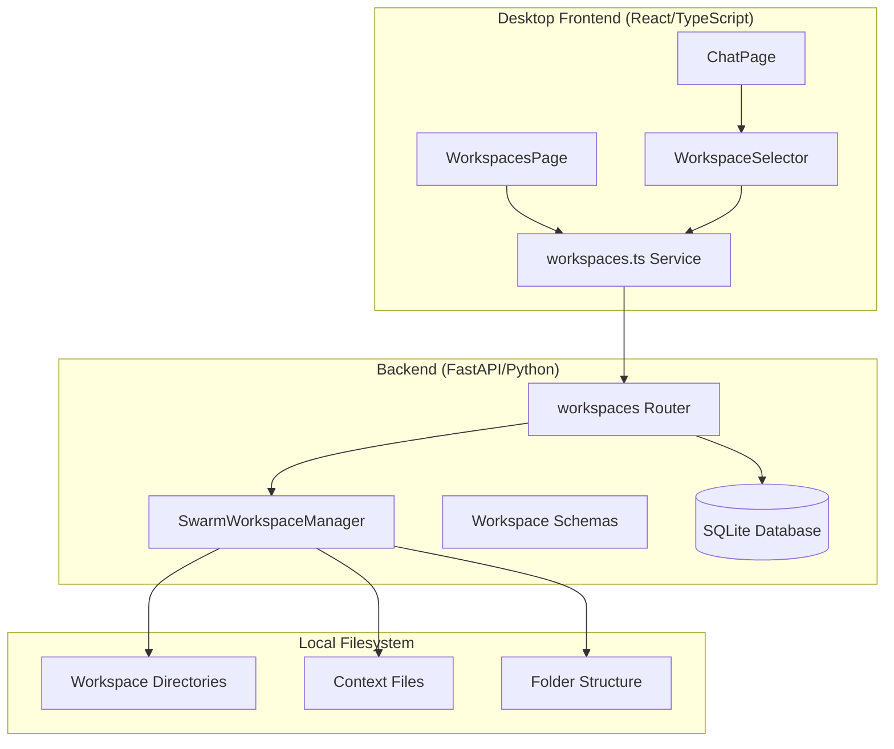

# Design Document: Swarm Workspaces

## Overview

Swarm Workspaces provides persistent, structured memory containers for organizing work by domain or project in SwarmAI. This feature introduces a new entity type (Workspace) that replaces the current ad-hoc folder selection mechanism with a more structured approach where workspaces have their own context, folder structure, and metadata.

The design follows existing patterns in the SwarmAI codebase for entity management (similar to Agents, Skills, MCP Servers) while introducing workspace-specific functionality like auto-created folder structures and context file injection.

## Architecture



### Key Design Decisions

1. **Separate from Agent Workspaces**: Swarm Workspaces are distinct from the existing agent workspace isolation system. Agent workspaces handle skill isolation per-agent, while Swarm Workspaces are user-facing project containers that any agent can use.

2. **Default Workspace Auto-Creation**: The system automatically creates a default workspace on first launch, ensuring users always have a workspace available without manual setup.

3. **Context Injection**: Workspace context files are read and injected into the system prompt, providing persistent memory across chat sessions.

4. **Workspace-Scoped File Access**: When a workspace is selected, file operations are scoped to that workspace's file path, replacing the current folder selection mechanism.

## Components and Interfaces

### Backend Components

#### 1. Workspace Pydantic Schemas (`backend/schemas/swarm_workspace.py`)

```python
from datetime import datetime
from typing import Optional
from pydantic import BaseModel, Field

class SwarmWorkspaceBase(BaseModel):
    """Base workspace model with common fields."""
    name: str = Field(..., min_length=1, max_length=100)
    file_path: str = Field(..., min_length=1)
    context: str = Field(..., min_length=1)
    icon: Optional[str] = None

class SwarmWorkspaceCreate(SwarmWorkspaceBase):
    """Request model for creating a workspace."""
    pass

class SwarmWorkspaceUpdate(BaseModel):
    """Request model for updating a workspace."""
    name: Optional[str] = Field(None, min_length=1, max_length=100)
    file_path: Optional[str] = Field(None, min_length=1)
    context: Optional[str] = Field(None, min_length=1)
    icon: Optional[str] = None

class SwarmWorkspaceResponse(SwarmWorkspaceBase):
    """Response model for workspace."""
    id: str
    is_default: bool = False
    created_at: str
    updated_at: str
```

#### 2. SwarmWorkspaceManager (`backend/core/swarm_workspace_manager.py`)

```python
class SwarmWorkspaceManager:
    """Manages Swarm Workspace filesystem operations."""
    
    FOLDER_STRUCTURE = [
        "Context",
        "Docs", 
        "Projects",
        "Tasks",
        "ToDos",
        "Plans",
        "Historical-Chats",
        "Reports"
    ]
    
    async def create_folder_structure(workspace_path: str) -> None
    async def create_context_files(workspace_path: str, workspace_name: str) -> None
    async def read_context_files(workspace_path: str) -> str
    async def validate_path(file_path: str) -> bool
    async def ensure_default_workspace() -> dict
```

#### 3. Workspaces Router (`backend/routers/swarm_workspaces.py`)

```python
router = APIRouter(prefix="/swarm-workspaces", tags=["swarm-workspaces"])

@router.get("", response_model=list[SwarmWorkspaceResponse])
async def list_workspaces()

@router.get("/default", response_model=SwarmWorkspaceResponse)
async def get_default_workspace()

@router.get("/{workspace_id}", response_model=SwarmWorkspaceResponse)
async def get_workspace(workspace_id: str)

@router.post("", response_model=SwarmWorkspaceResponse, status_code=201)
async def create_workspace(request: SwarmWorkspaceCreate)

@router.put("/{workspace_id}", response_model=SwarmWorkspaceResponse)
async def update_workspace(workspace_id: str, request: SwarmWorkspaceUpdate)

@router.delete("/{workspace_id}", status_code=204)
async def delete_workspace(workspace_id: str)

@router.post("/{workspace_id}/init-folders", status_code=200)
async def init_workspace_folders(workspace_id: str)
```

### Frontend Components

#### 1. TypeScript Types (`desktop/src/types/index.ts`)

```typescript
// Swarm Workspace Types
export interface SwarmWorkspace {
  id: string;
  name: string;
  filePath: string;
  context: string;
  icon?: string;
  isDefault: boolean;
  createdAt: string;
  updatedAt: string;
}

export interface SwarmWorkspaceCreateRequest {
  name: string;
  filePath: string;
  context: string;
  icon?: string;
}

export interface SwarmWorkspaceUpdateRequest {
  name?: string;
  filePath?: string;
  context?: string;
  icon?: string;
}
```

#### 2. Workspaces Service (`desktop/src/services/swarmWorkspaces.ts`)

```typescript
export const swarmWorkspacesService = {
  async list(): Promise<SwarmWorkspace[]>
  async get(id: string): Promise<SwarmWorkspace>
  async getDefault(): Promise<SwarmWorkspace>
  async create(data: SwarmWorkspaceCreateRequest): Promise<SwarmWorkspace>
  async update(id: string, data: SwarmWorkspaceUpdateRequest): Promise<SwarmWorkspace>
  async delete(id: string): Promise<void>
  async initFolders(id: string): Promise<void>
}
```

#### 3. WorkspacesPage Component (`desktop/src/pages/WorkspacesPage.tsx`)

- List view of all workspaces with name, icon, file path
- Create workspace form with folder picker integration
- Edit workspace modal
- Delete confirmation dialog (disabled for default workspace)
- Visual indicator for default workspace

#### 4. WorkspaceSelector Component (`desktop/src/components/chat/WorkspaceSelector.tsx`)

- Dropdown component for selecting active workspace
- Shows workspace name and icon
- Replaces current folder picker in chat interface
- Triggers context reload on workspace change

## Data Models

### Database Schema

```sql
-- Swarm Workspaces table
CREATE TABLE IF NOT EXISTS swarm_workspaces (
    id TEXT PRIMARY KEY,
    name TEXT NOT NULL,
    file_path TEXT NOT NULL,
    context TEXT NOT NULL,
    icon TEXT,
    is_default INTEGER DEFAULT 0,
    created_at TEXT NOT NULL,
    updated_at TEXT NOT NULL
);
CREATE INDEX IF NOT EXISTS idx_swarm_workspaces_is_default ON swarm_workspaces(is_default);
```

### Default Workspace Configuration

```python
DEFAULT_WORKSPACE = {
    "name": "SwarmWS-Default",
    "file_path": "{app_data_dir}/swarm-workspaces/SwarmWS",
    "context": "Default SwarmAI workspace for general tasks and projects.",
    "icon": "🏠",
    "is_default": True
}
```

### Context File Templates

**overall-context.md Template:**
```markdown
# {workspace_name} Workspace Context

## Workspace Purpose
[Describe the main purpose of this workspace]

## Key Goals
- [Goal 1]
- [Goal 2]

## Important Context
[Add any important background information]

## Notes
[Additional notes and reminders]
```

**compressed-context.md:**
Created as empty file, populated by future context compression features.

## Correctness Properties

*A property is a characteristic or behavior that should hold true across all valid executions of a system—essentially, a formal statement about what the system should do. Properties serve as the bridge between human-readable specifications and machine-verifiable correctness guarantees.*

### Property 1: Default Workspace Protection
*For any* attempt to delete the default workspace (where isDefault=true), the system should reject the deletion with a 403 error and the default workspace should remain in the database.
**Validates: Requirements 1.3, 6.8**

### Property 2: Folder Structure Creation
*For any* newly created workspace with a valid file path, all required subdirectories (Context, Docs, Projects, Tasks, ToDos, Plans, Historical-Chats, Reports) should exist within the workspace's file path after creation completes.
**Validates: Requirements 2.1, 2.4**

### Property 3: Context Files Creation
*For any* newly created workspace, the Context folder should contain an `overall-context.md` file that includes the workspace name and sections for Workspace Purpose, Key Goals, Important Context, and Notes, plus an empty `compressed-context.md` file.
**Validates: Requirements 2.2, 2.3, 7.1, 7.2, 7.3**

### Property 4: Workspace Entity Invariants
*For any* workspace entity, all required fields (id, name, filePath, context, createdAt, updatedAt) should be non-null, the id should be a valid UUID, isDefault should default to false for non-default workspaces, and timestamps should be valid ISO format strings.
**Validates: Requirements 3.1, 3.2, 3.3, 3.4**

### Property 5: Workspace CRUD Round-Trip
*For any* valid workspace creation request, creating the workspace and then retrieving it by ID should return an equivalent workspace with all provided fields preserved. Similarly, updating a workspace and retrieving it should reflect all updates.
**Validates: Requirements 6.4, 6.6, 9.3**

### Property 6: Path Security Validation
*For any* workspace file path containing path traversal sequences (`..`) or that is a relative path not starting with `~`, the system should reject the workspace creation with a validation error.
**Validates: Requirements 8.1, 8.5**

### Property 7: Name Validation
*For any* workspace creation request with an empty name or a name exceeding 100 characters, the system should reject the request with a validation error.
**Validates: Requirements 8.4**

### Property 8: API Error Handling for Non-Existent Resources
*For any* GET, PUT, or DELETE request to `/swarm-workspaces/{id}` with a non-existent ID, the API should return a 404 error.
**Validates: Requirements 6.3**

### Property 9: List Completeness
*For any* set of workspaces in the database, a GET request to `/swarm-workspaces` should return all workspaces including the default workspace, each with name, icon, and filePath fields.
**Validates: Requirements 6.1, 4.2**

### Property 10: Default Workspace Persistence
*For any* sequence of workspace operations (create, update, delete), the default workspace should always exist and be retrievable via GET `/swarm-workspaces/default`.
**Validates: Requirements 6.9, 1.5**

### Property 11: Workspace File Access Isolation
*For any* file operation during a chat session with a selected workspace, file paths should be validated to be within the workspace's file path, and operations targeting paths outside should be rejected.
**Validates: Requirements 8.2, 8.3**

### Property 12: API Serialization Convention
*For any* API response from workspace endpoints, field names should use camelCase format (e.g., `filePath`, `isDefault`, `createdAt`).
**Validates: Requirements 9.5**

### Property 13: Default Workspace Initialization Readiness
*For any* application startup sequence, the default workspace SHALL be fully initialized (created with folder structure and context files) before the System_Status_API reports `swarm_workspace.ready` as `true`.
**Validates: Requirements 1.6, 1.7**

## Error Handling

### API Error Responses

| Scenario | HTTP Status | Error Code | Message |
|----------|-------------|------------|---------|
| Workspace not found | 404 | WORKSPACE_NOT_FOUND | Workspace with ID '{id}' does not exist |
| Delete default workspace | 403 | FORBIDDEN | Cannot delete default workspace |
| Invalid workspace data | 422 | VALIDATION_FAILED | Validation error details |
| Path traversal detected | 400 | VALIDATION_FAILED | Invalid file path: path traversal not allowed |
| Invalid path format | 400 | VALIDATION_FAILED | File path must be absolute or start with ~ |
| Name too long | 400 | VALIDATION_FAILED | Name must not exceed 100 characters |
| Filesystem error | 500 | SERVER_ERROR | Failed to create workspace folders |

### Error Handling Strategy

1. **Validation Errors**: Return 422 with detailed field-level errors using existing `ValidationException` pattern
2. **Not Found Errors**: Return 404 using pattern from `AgentNotFoundException`
3. **Permission Errors**: Return 403 for protected resource operations (default workspace deletion)
4. **Filesystem Errors**: Log error, return 500 with user-friendly message, ensure database consistency

### Graceful Degradation

- If context file creation fails, workspace creation should still succeed (log warning)
- If folder structure creation fails, return error but don't leave partial state
- If default workspace is missing on startup, auto-recreate it

## Testing Strategy

### Unit Tests

Unit tests should cover specific examples and edge cases:

1. **Default Workspace Tests**
   - Verify default workspace is created on first initialization
   - Verify default workspace has correct name, path, and isDefault flag
   - Verify delete operation fails for default workspace

2. **Validation Tests**
   - Empty name rejection
   - Name exceeding 100 characters rejection
   - Path traversal sequence rejection
   - Relative path rejection (not starting with ~)

3. **API Endpoint Tests**
   - GET /swarm-workspaces returns list
   - GET /swarm-workspaces/{id} returns workspace
   - GET /swarm-workspaces/default returns default workspace
   - POST /swarm-workspaces creates workspace
   - PUT /swarm-workspaces/{id} updates workspace
   - DELETE /swarm-workspaces/{id} deletes non-default workspace

### Property-Based Tests

Property-based tests should use `hypothesis` library with minimum 100 iterations per test.

**Test Configuration:**
```python
from hypothesis import given, strategies as st, settings

@settings(max_examples=100)
```

**Property Test Tags:**
Each test should include a docstring tag: `Feature: swarm-workspaces, Property N: {property_text}`

**Properties to Test:**
1. Property 1: Default workspace protection
2. Property 4: Workspace entity invariants
3. Property 5: CRUD round-trip consistency
4. Property 6: Path security validation
5. Property 7: Name validation
6. Property 9: List completeness
7. Property 10: Default workspace persistence

### Integration Tests

1. **Workspace-Chat Integration**
   - Verify workspace selector updates session context
   - Verify context files are injected into system prompt
   - Verify file browser shows workspace contents

2. **Filesystem Integration**
   - Verify folder structure creation on real filesystem
   - Verify context file templates are created correctly
   - Verify path expansion for ~ works correctly

