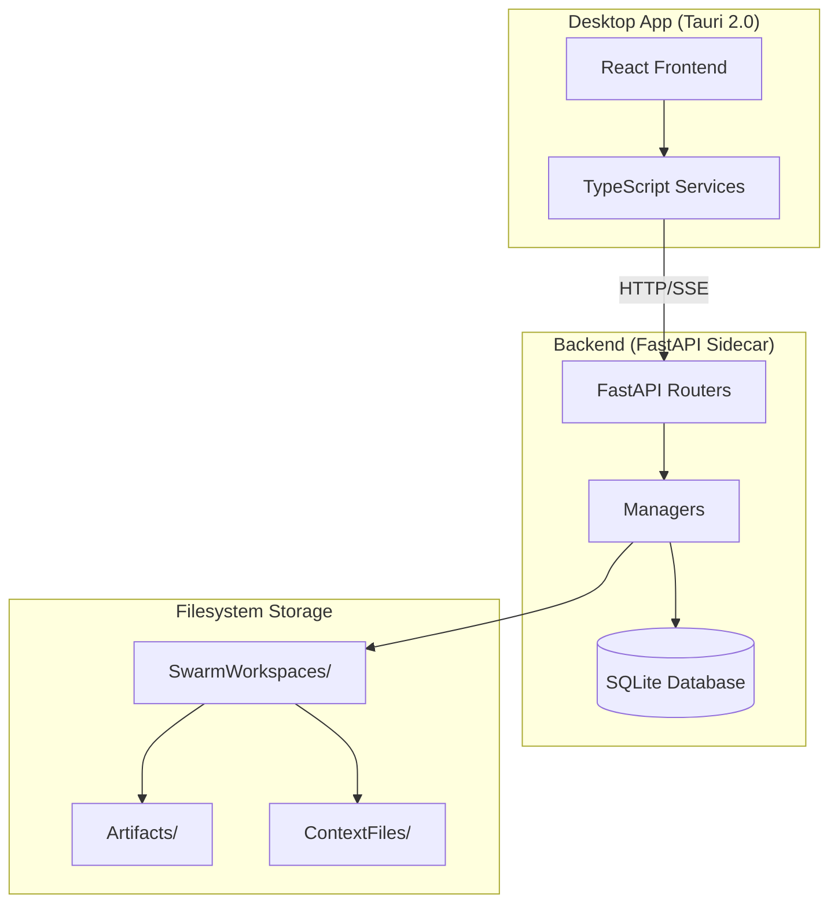
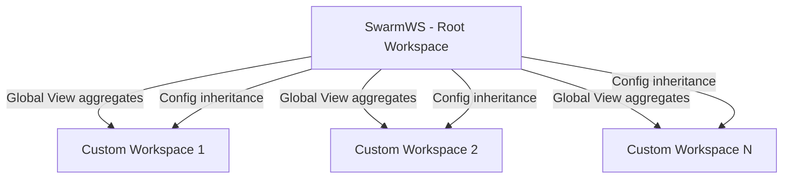

# Design Document: Workspace Refactor - Daily Work Operating Loop

## Overview

This design document describes the architecture for refactoring the SwarmAI workspace system to implement the "Daily Work Operating Loop" architecture. The refactor transforms the current file-tree-based workspace explorer into a section-based navigation system following six phases: Signals → Plan → Execute → Communicate → Artifacts → Reflection.

### Goals

1. **Unified Work Operating System**: SwarmWS serves as the permanent root workspace (Global Daily Work Operating System)
2. **Section-Based Navigation**: Replace file-tree navigation with six Daily Work Loop sections
3. **DB-Canonical Storage**: Structured entities (Tasks, ToDos, PlanItems, Communications, ChatThreads) stored in SQLite database
4. **Filesystem Content Storage**: Artifacts and Context files stored in filesystem with metadata in database
5. **Configuration Inheritance**: Skills/MCPs use intersection model; Knowledgebases use union model with exclusions

### Key Architectural Decisions

| Decision | Rationale |
|----------|-----------|
| SQLite for structured entities | Single-file database, no external dependencies, ACID compliance |
| Filesystem for content | Portability, direct file access, version control friendly |
| Intersection model for Skills/MCPs | Security: custom workspaces can only restrict, not expand capabilities |
| Union model for Knowledgebases | Flexibility: domain-specific knowledge enrichment with controlled inheritance |
| Section-based UI | Aligns with natural knowledge work flow, reduces cognitive load |


## Architecture

### System Architecture Diagram



### Data Flow Architecture

```mermaid
flowchart LR
    subgraph "UI Layer"
        WE[Workspace Explorer]
        SP[Section Pages]
        SM[Settings Modal]
    end
    
    subgraph "Service Layer"
        WS[workspaces.ts]
        TD[todos.ts]
        TK[tasks.ts]
        SC[sections.ts]
    end
    
    subgraph "API Layer"
        WR[/workspaces]
        TR[/todos]
        SR[/sections]
        CR[/config]
    end
    
    subgraph "Data Layer"
        DB[(SQLite)]
        FS[Filesystem]
    end
    
    WE --> WS & SC
    SP --> TD & TK
    SM --> CR
    WS & TD & TK & SC --> WR & TR & SR & CR
    WR & TR & SR --> DB
    CR --> DB & FS
```

### Workspace Hierarchy




## Components and Interfaces

### Backend Components

#### 1. Database Tables (SQLite)

**New Tables:**

| Table | Purpose | Key Columns |
|-------|---------|-------------|
| `todos` | Signal/ToDo entities | id, workspace_id, title, description, source, source_type, status, priority, due_date, task_id |
| `plan_items` | Plan section items | id, workspace_id, title, source_todo_id, source_task_id, status, focus_type, sort_order |
| `communications` | Communicate section | id, workspace_id, title, recipient, channel_type, status, ai_draft_content |
| `artifacts` | Artifact metadata | id, workspace_id, task_id, artifact_type, title, file_path, version |
| `reflections` | Reflection metadata | id, workspace_id, reflection_type, title, file_path, period_start, period_end |
| `chat_threads` | Chat thread entities | id, workspace_id, agent_id, task_id, todo_id, mode, title |
| `chat_messages` | Chat messages | id, thread_id, role, content, tool_calls |
| `thread_summaries` | Thread search index | id, thread_id, summary_type, summary_text, key_decisions |
| `workspace_skills` | Skill config junction | id, workspace_id, skill_id, enabled |
| `workspace_mcps` | MCP config junction | id, workspace_id, mcp_server_id, enabled |
| `workspace_knowledgebases` | KB config | id, workspace_id, source_type, source_path, excluded_sources |
| `audit_log` | Config change audit | id, workspace_id, change_type, entity_type, entity_id, old_value, new_value |
| `artifact_tags` | Artifact tagging | id, artifact_id, tag |

**Modified Tables:**

| Table | Changes |
|-------|---------|
| `tasks` | Add: workspace_id, source_todo_id, blocked_reason; Update status enum |
| `skills` | Add: is_privileged |
| `mcp_servers` | Add: is_privileged |
| `swarm_workspaces` | Add: is_archived, archived_at |

#### 2. API Routers

**New Routers:**

```python
# backend/routers/todos.py
@router.get("/api/todos")
@router.post("/api/todos")
@router.get("/api/todos/{id}")
@router.put("/api/todos/{id}")
@router.delete("/api/todos/{id}")
@router.post("/api/todos/{id}/convert-to-task")

# backend/routers/sections.py
@router.get("/api/workspaces/{id}/sections")
@router.get("/api/workspaces/{id}/sections/signals")
@router.get("/api/workspaces/{id}/sections/plan")
@router.get("/api/workspaces/{id}/sections/execute")
@router.get("/api/workspaces/{id}/sections/communicate")
@router.get("/api/workspaces/{id}/sections/artifacts")
@router.get("/api/workspaces/{id}/sections/reflection")

# backend/routers/plan_items.py
@router.get("/api/workspaces/{id}/plan-items")
@router.post("/api/workspaces/{id}/plan-items")
@router.put("/api/workspaces/{id}/plan-items/{item_id}")
@router.delete("/api/workspaces/{id}/plan-items/{item_id}")

# backend/routers/communications.py
@router.get("/api/workspaces/{id}/communications")
@router.post("/api/workspaces/{id}/communications")
@router.put("/api/workspaces/{id}/communications/{comm_id}")
@router.delete("/api/workspaces/{id}/communications/{comm_id}")

# backend/routers/artifacts.py
@router.get("/api/workspaces/{id}/artifacts")
@router.post("/api/workspaces/{id}/artifacts")
@router.put("/api/workspaces/{id}/artifacts/{artifact_id}")
@router.delete("/api/workspaces/{id}/artifacts/{artifact_id}")

# backend/routers/reflections.py
@router.get("/api/workspaces/{id}/reflections")
@router.post("/api/workspaces/{id}/reflections")
@router.put("/api/workspaces/{id}/reflections/{reflection_id}")
@router.delete("/api/workspaces/{id}/reflections/{reflection_id}")

# backend/routers/search.py
@router.get("/api/search")
@router.get("/api/search/threads")

# backend/routers/workspace_config.py
@router.get("/api/workspaces/{id}/skills")
@router.put("/api/workspaces/{id}/skills")
@router.get("/api/workspaces/{id}/mcps")
@router.put("/api/workspaces/{id}/mcps")
@router.get("/api/workspaces/{id}/knowledgebases")
@router.post("/api/workspaces/{id}/knowledgebases")
@router.put("/api/workspaces/{id}/knowledgebases/{kb_id}")
@router.delete("/api/workspaces/{id}/knowledgebases/{kb_id}")
@router.get("/api/workspaces/{id}/context")
@router.put("/api/workspaces/{id}/context")
@router.post("/api/workspaces/{id}/context/compress")
@router.get("/api/workspaces/{id}/audit-log")
```


#### 3. Manager Classes

**New Managers:**

```python
# backend/core/todo_manager.py
class ToDoManager:
    async def create(workspace_id: str, data: ToDoCreate) -> ToDo
    async def get(todo_id: str) -> ToDo
    async def list(workspace_id: str, status: str = None) -> list[ToDo]
    async def update(todo_id: str, data: ToDoUpdate) -> ToDo
    async def delete(todo_id: str) -> bool
    async def convert_to_task(todo_id: str, task_data: TaskCreate) -> Task
    async def check_overdue() -> int  # Background job

# backend/core/section_manager.py
class SectionManager:
    async def get_section_counts(workspace_id: str) -> SectionCounts
    async def get_signals(workspace_id: str, limit: int, offset: int) -> SectionResponse
    async def get_plan(workspace_id: str, limit: int, offset: int) -> SectionResponse
    async def get_execute(workspace_id: str, limit: int, offset: int) -> SectionResponse
    async def get_communicate(workspace_id: str, limit: int, offset: int) -> SectionResponse
    async def get_artifacts(workspace_id: str, limit: int, offset: int) -> SectionResponse
    async def get_reflection(workspace_id: str, limit: int, offset: int) -> SectionResponse

# backend/core/workspace_config_resolver.py
class WorkspaceConfigResolver:
    async def get_effective_skills(workspace_id: str) -> list[Skill]
    async def get_effective_mcps(workspace_id: str) -> list[MCPServer]
    async def get_effective_knowledgebases(workspace_id: str) -> list[Knowledgebase]
    async def update_skill_config(workspace_id: str, skill_id: str, enabled: bool) -> None
    async def update_mcp_config(workspace_id: str, mcp_id: str, enabled: bool) -> None
    async def validate_execution_policy(workspace_id: str, required_skills: list, required_mcps: list) -> PolicyValidation

# backend/core/context_manager.py
class ContextManager:
    async def get_context(workspace_id: str) -> str
    async def update_context(workspace_id: str, content: str) -> None
    async def compress_context(workspace_id: str) -> str
    async def inject_context(workspace_id: str, token_budget: int = 4000) -> str

# backend/core/search_manager.py
class SearchManager:
    async def search(query: str, scope: str, entity_types: list) -> SearchResults
    async def search_threads(query: str, scope: str) -> list[ThreadSummary]
```

**Modified Managers:**

```python
# backend/core/task_manager.py - Updates
class TaskManager:
    # Add workspace_id parameter to existing methods
    async def create(agent_id: str, workspace_id: str = None, ...) -> Task
    async def list(workspace_id: str = None, status: str = None) -> list[Task]
    # Add status mapping for backward compatibility
    def _map_legacy_status(status: str) -> str  # pending→draft, running→wip, failed→blocked

# backend/core/swarm_workspace_manager.py - Updates
class SwarmWorkspaceManager:
    async def archive(workspace_id: str) -> SwarmWorkspace
    async def unarchive(workspace_id: str) -> SwarmWorkspace
    async def list_non_archived() -> list[SwarmWorkspace]
```

### Frontend Components

#### 1. New TypeScript Types

```typescript
// desktop/src/types/index.ts - New types

// ToDo/Signal Types
export type ToDoStatus = 'pending' | 'overdue' | 'inDiscussion' | 'handled' | 'cancelled' | 'deleted';
export type ToDoSourceType = 'manual' | 'email' | 'slack' | 'meeting' | 'integration';
export type Priority = 'high' | 'medium' | 'low' | 'none';

export interface ToDo {
  id: string;
  workspaceId: string;
  title: string;
  description?: string;
  source?: string;
  sourceType: ToDoSourceType;
  status: ToDoStatus;
  priority: Priority;
  dueDate?: string;
  taskId?: string;
  createdAt: string;
  updatedAt: string;
}

// PlanItem Types
export type PlanItemStatus = 'active' | 'deferred' | 'completed' | 'cancelled';
export type FocusType = 'today' | 'upcoming' | 'blocked';

export interface PlanItem {
  id: string;
  workspaceId: string;
  title: string;
  description?: string;
  sourceTodoId?: string;
  sourceTaskId?: string;
  status: PlanItemStatus;
  priority: Priority;
  scheduledDate?: string;
  focusType: FocusType;
  sortOrder: number;
  createdAt: string;
  updatedAt: string;
}

// Communication Types
export type CommunicationStatus = 'pendingReply' | 'aiDraft' | 'followUp' | 'sent' | 'cancelled';
export type ChannelType = 'email' | 'slack' | 'meeting' | 'other';

export interface Communication {
  id: string;
  workspaceId: string;
  title: string;
  description?: string;
  recipient: string;
  channelType: ChannelType;
  status: CommunicationStatus;
  priority: Priority;
  dueDate?: string;
  aiDraftContent?: string;
  sentAt?: string;
  createdAt: string;
  updatedAt: string;
}

// Artifact Types
export type ArtifactType = 'plan' | 'report' | 'doc' | 'decision' | 'other';

export interface Artifact {
  id: string;
  workspaceId: string;
  taskId?: string;
  artifactType: ArtifactType;
  title: string;
  filePath: string;
  version: number;
  createdBy: string;
  createdAt: string;
  updatedAt: string;
}

// Reflection Types
export type ReflectionType = 'dailyRecap' | 'weeklySummary' | 'lessonsLearned';

export interface Reflection {
  id: string;
  workspaceId: string;
  reflectionType: ReflectionType;
  title: string;
  filePath: string;
  periodStart: string;
  periodEnd: string;
  generatedBy: 'user' | 'agent' | 'system';
  createdAt: string;
  updatedAt: string;
}

// ChatThread Types
export type ChatMode = 'explore' | 'execute';

export interface ChatThread {
  id: string;
  workspaceId: string;
  agentId: string;
  taskId?: string;
  todoId?: string;
  mode: ChatMode;
  title: string;
  createdAt: string;
  updatedAt: string;
}

export interface ThreadSummary {
  id: string;
  threadId: string;
  summaryType: 'rolling' | 'final';
  summaryText: string;
  keyDecisions?: string[];
  openQuestions?: string[];
  updatedAt: string;
}

// Section Types
export type WorkspaceSection = 'signals' | 'plan' | 'execute' | 'communicate' | 'artifacts' | 'reflection';

export interface SectionCounts {
  signals: { total: number; pending: number; overdue: number; inDiscussion: number };
  plan: { total: number; today: number; upcoming: number; blocked: number };
  execute: { total: number; draft: number; wip: number; blocked: number; completed: number };
  communicate: { total: number; pendingReply: number; aiDraft: number; followUp: number };
  artifacts: { total: number; plan: number; report: number; doc: number; decision: number };
  reflection: { total: number; dailyRecap: number; weeklySummary: number; lessonsLearned: number };
}

export interface SectionGroup<T> {
  name: string;
  items: T[];
}

export interface Pagination {
  limit: number;
  offset: number;
  total: number;
  hasMore: boolean;
}

export interface SectionResponse<T> {
  counts: Record<string, number>;
  groups: SectionGroup<T>[];
  pagination: Pagination;
  sortKeys: string[];
  lastUpdatedAt: string;
}

// Workspace Config Types
export interface WorkspaceSkillConfig {
  skillId: string;
  skillName: string;
  enabled: boolean;
  isPrivileged: boolean;
}

export interface WorkspaceMcpConfig {
  mcpServerId: string;
  mcpServerName: string;
  enabled: boolean;
  isPrivileged: boolean;
}

export interface WorkspaceKnowledgebaseConfig {
  id: string;
  sourceType: 'localFile' | 'url' | 'indexedDocument' | 'contextFile' | 'vectorIndex';
  sourcePath: string;
  displayName: string;
  metadata?: Record<string, unknown>;
  excludedSources?: number[];
}

// Updated Task type
export type TaskStatus = 'draft' | 'wip' | 'blocked' | 'completed' | 'cancelled';

export interface Task {
  id: string;
  workspaceId?: string;
  agentId: string;
  sessionId: string | null;
  status: TaskStatus;
  title: string;
  description?: string;
  priority: Priority;
  sourceTodoId?: string;
  blockedReason?: string;
  model: string | null;
  createdAt: string;
  startedAt: string | null;
  completedAt: string | null;
  error: string | null;
  workDir: string | null;
}

// Updated SwarmWorkspace type
export interface SwarmWorkspace {
  id: string;
  name: string;
  filePath: string;
  context: string;
  icon?: string;
  isDefault: boolean;
  isArchived: boolean;
  archivedAt?: string;
  createdAt: string;
  updatedAt: string;
}
```


#### 2. New React Components

```
desktop/src/components/workspace-explorer/
├── WorkspaceExplorer.tsx          # Main container component
├── WorkspaceHeader.tsx            # Workspace selector, view toggle, search
├── OverviewContextCard.tsx        # Goal, Focus, Context, Priorities display
├── SectionNavigation.tsx          # Six collapsible section headers
├── SectionHeader.tsx              # Individual section header with icon/count
├── SectionContent.tsx             # Expanded section content
├── WorkspaceFooter.tsx            # New workspace, settings buttons

desktop/src/pages/
├── SignalsPage.tsx                # ToDo management page
├── PlanPage.tsx                   # PlanItem management page
├── ExecutePage.tsx                # Renamed from TasksPage
├── CommunicatePage.tsx            # Communication management page
├── ArtifactsPage.tsx              # Artifact browser page
├── ReflectionPage.tsx             # Reflection management page

desktop/src/components/modals/
├── WorkspaceSettingsModal.tsx     # Skills, MCPs, Knowledgebases tabs
├── ConvertToTaskModal.tsx         # ToDo to Task conversion dialog
├── PrivilegedCapabilityModal.tsx  # Confirmation for privileged capabilities
```

#### 3. New Services

```typescript
// desktop/src/services/todos.ts
export const todosService = {
  list: (workspaceId?: string, status?: string) => Promise<ToDo[]>,
  get: (id: string) => Promise<ToDo>,
  create: (data: ToDoCreateRequest) => Promise<ToDo>,
  update: (id: string, data: ToDoUpdateRequest) => Promise<ToDo>,
  delete: (id: string) => Promise<void>,
  convertToTask: (id: string, taskData: TaskCreateRequest) => Promise<Task>,
};

// desktop/src/services/sections.ts
export const sectionsService = {
  getCounts: (workspaceId: string) => Promise<SectionCounts>,
  getSignals: (workspaceId: string, params: PaginationParams) => Promise<SectionResponse<ToDo>>,
  getPlan: (workspaceId: string, params: PaginationParams) => Promise<SectionResponse<PlanItem>>,
  getExecute: (workspaceId: string, params: PaginationParams) => Promise<SectionResponse<Task>>,
  getCommunicate: (workspaceId: string, params: PaginationParams) => Promise<SectionResponse<Communication>>,
  getArtifacts: (workspaceId: string, params: PaginationParams) => Promise<SectionResponse<Artifact>>,
  getReflection: (workspaceId: string, params: PaginationParams) => Promise<SectionResponse<Reflection>>,
};

// desktop/src/services/workspaceConfig.ts
export const workspaceConfigService = {
  getSkills: (workspaceId: string) => Promise<WorkspaceSkillConfig[]>,
  updateSkills: (workspaceId: string, configs: WorkspaceSkillConfig[]) => Promise<void>,
  getMcps: (workspaceId: string) => Promise<WorkspaceMcpConfig[]>,
  updateMcps: (workspaceId: string, configs: WorkspaceMcpConfig[]) => Promise<void>,
  getKnowledgebases: (workspaceId: string) => Promise<WorkspaceKnowledgebaseConfig[]>,
  addKnowledgebase: (workspaceId: string, data: KnowledgebaseCreateRequest) => Promise<WorkspaceKnowledgebaseConfig>,
  updateKnowledgebase: (workspaceId: string, id: string, data: KnowledgebaseUpdateRequest) => Promise<WorkspaceKnowledgebaseConfig>,
  deleteKnowledgebase: (workspaceId: string, id: string) => Promise<void>,
  getContext: (workspaceId: string) => Promise<string>,
  updateContext: (workspaceId: string, content: string) => Promise<void>,
  compressContext: (workspaceId: string) => Promise<string>,
};

// desktop/src/services/search.ts
export const searchService = {
  search: (query: string, scope: string, entityTypes?: string[]) => Promise<SearchResults>,
  searchThreads: (query: string, scope: string) => Promise<ThreadSummary[]>,
};
```


## Data Models

### Database Schema

#### ToDos Table

```sql
CREATE TABLE todos (
    id TEXT PRIMARY KEY,
    workspace_id TEXT NOT NULL REFERENCES swarm_workspaces(id),
    title TEXT NOT NULL,
    description TEXT,
    source TEXT,
    source_type TEXT NOT NULL DEFAULT 'manual' CHECK (source_type IN ('manual', 'email', 'slack', 'meeting', 'integration')),
    status TEXT NOT NULL DEFAULT 'pending' CHECK (status IN ('pending', 'overdue', 'in_discussion', 'handled', 'cancelled', 'deleted')),
    priority TEXT NOT NULL DEFAULT 'none' CHECK (priority IN ('high', 'medium', 'low', 'none')),
    due_date TEXT,
    task_id TEXT REFERENCES tasks(id),
    created_at TEXT NOT NULL,
    updated_at TEXT NOT NULL
);

CREATE INDEX idx_todos_workspace_id ON todos(workspace_id);
CREATE INDEX idx_todos_status ON todos(status);
CREATE INDEX idx_todos_workspace_status ON todos(workspace_id, status);
CREATE INDEX idx_todos_due_date ON todos(due_date);
```

#### PlanItems Table

```sql
CREATE TABLE plan_items (
    id TEXT PRIMARY KEY,
    workspace_id TEXT NOT NULL REFERENCES swarm_workspaces(id),
    title TEXT NOT NULL,
    description TEXT,
    source_todo_id TEXT REFERENCES todos(id),
    source_task_id TEXT REFERENCES tasks(id),
    status TEXT NOT NULL DEFAULT 'active' CHECK (status IN ('active', 'deferred', 'completed', 'cancelled')),
    priority TEXT NOT NULL DEFAULT 'none' CHECK (priority IN ('high', 'medium', 'low', 'none')),
    scheduled_date TEXT,
    focus_type TEXT NOT NULL DEFAULT 'upcoming' CHECK (focus_type IN ('today', 'upcoming', 'blocked')),
    sort_order INTEGER NOT NULL DEFAULT 0,
    created_at TEXT NOT NULL,
    updated_at TEXT NOT NULL
);

CREATE INDEX idx_plan_items_workspace_id ON plan_items(workspace_id);
CREATE INDEX idx_plan_items_focus_type ON plan_items(focus_type);
CREATE INDEX idx_plan_items_workspace_focus ON plan_items(workspace_id, focus_type);
```

#### Communications Table

```sql
CREATE TABLE communications (
    id TEXT PRIMARY KEY,
    workspace_id TEXT NOT NULL REFERENCES swarm_workspaces(id),
    title TEXT NOT NULL,
    description TEXT,
    recipient TEXT NOT NULL,
    channel_type TEXT NOT NULL DEFAULT 'other' CHECK (channel_type IN ('email', 'slack', 'meeting', 'other')),
    status TEXT NOT NULL DEFAULT 'pending_reply' CHECK (status IN ('pending_reply', 'ai_draft', 'follow_up', 'sent', 'cancelled')),
    priority TEXT NOT NULL DEFAULT 'none' CHECK (priority IN ('high', 'medium', 'low', 'none')),
    due_date TEXT,
    ai_draft_content TEXT,
    source_task_id TEXT REFERENCES tasks(id),
    source_todo_id TEXT REFERENCES todos(id),
    sent_at TEXT,
    created_at TEXT NOT NULL,
    updated_at TEXT NOT NULL
);

CREATE INDEX idx_communications_workspace_id ON communications(workspace_id);
CREATE INDEX idx_communications_status ON communications(status);
CREATE INDEX idx_communications_workspace_status ON communications(workspace_id, status);
```

#### Artifacts Table

```sql
CREATE TABLE artifacts (
    id TEXT PRIMARY KEY,
    workspace_id TEXT NOT NULL REFERENCES swarm_workspaces(id),
    task_id TEXT REFERENCES tasks(id),
    artifact_type TEXT NOT NULL DEFAULT 'other' CHECK (artifact_type IN ('plan', 'report', 'doc', 'decision', 'other')),
    title TEXT NOT NULL,
    file_path TEXT NOT NULL,
    version INTEGER NOT NULL DEFAULT 1,
    created_by TEXT NOT NULL,
    created_at TEXT NOT NULL,
    updated_at TEXT NOT NULL
);

CREATE INDEX idx_artifacts_workspace_id ON artifacts(workspace_id);
CREATE INDEX idx_artifacts_type ON artifacts(artifact_type);
CREATE INDEX idx_artifacts_workspace_type ON artifacts(workspace_id, artifact_type);
```

#### Artifact Tags Table

```sql
CREATE TABLE artifact_tags (
    id TEXT PRIMARY KEY,
    artifact_id TEXT NOT NULL REFERENCES artifacts(id) ON DELETE CASCADE,
    tag TEXT NOT NULL,
    created_at TEXT NOT NULL
);

CREATE INDEX idx_artifact_tags_artifact_id ON artifact_tags(artifact_id);
CREATE INDEX idx_artifact_tags_tag ON artifact_tags(tag);
```

#### Reflections Table

```sql
CREATE TABLE reflections (
    id TEXT PRIMARY KEY,
    workspace_id TEXT NOT NULL REFERENCES swarm_workspaces(id),
    reflection_type TEXT NOT NULL CHECK (reflection_type IN ('daily_recap', 'weekly_summary', 'lessons_learned')),
    title TEXT NOT NULL,
    file_path TEXT NOT NULL,
    period_start TEXT NOT NULL,
    period_end TEXT NOT NULL,
    generated_by TEXT NOT NULL DEFAULT 'user' CHECK (generated_by IN ('user', 'agent', 'system')),
    created_at TEXT NOT NULL,
    updated_at TEXT NOT NULL
);

CREATE INDEX idx_reflections_workspace_id ON reflections(workspace_id);
CREATE INDEX idx_reflections_type ON reflections(reflection_type);
CREATE INDEX idx_reflections_workspace_type ON reflections(workspace_id, reflection_type);
```

#### ChatThreads Table

```sql
CREATE TABLE chat_threads (
    id TEXT PRIMARY KEY,
    workspace_id TEXT NOT NULL REFERENCES swarm_workspaces(id),
    agent_id TEXT NOT NULL REFERENCES agents(id),
    task_id TEXT REFERENCES tasks(id),
    todo_id TEXT REFERENCES todos(id),
    mode TEXT NOT NULL DEFAULT 'explore' CHECK (mode IN ('explore', 'execute')),
    title TEXT NOT NULL,
    created_at TEXT NOT NULL,
    updated_at TEXT NOT NULL
);

CREATE INDEX idx_chat_threads_workspace_id ON chat_threads(workspace_id);
CREATE INDEX idx_chat_threads_agent_id ON chat_threads(agent_id);
CREATE INDEX idx_chat_threads_task_id ON chat_threads(task_id);
```

#### ChatMessages Table

```sql
CREATE TABLE chat_messages (
    id TEXT PRIMARY KEY,
    thread_id TEXT NOT NULL REFERENCES chat_threads(id) ON DELETE CASCADE,
    role TEXT NOT NULL CHECK (role IN ('user', 'assistant', 'tool', 'system')),
    content TEXT NOT NULL,
    tool_calls TEXT,
    created_at TEXT NOT NULL
);

CREATE INDEX idx_chat_messages_thread_id ON chat_messages(thread_id);
```

#### ThreadSummaries Table

```sql
CREATE TABLE thread_summaries (
    id TEXT PRIMARY KEY,
    thread_id TEXT NOT NULL REFERENCES chat_threads(id) ON DELETE CASCADE,
    summary_type TEXT NOT NULL DEFAULT 'rolling' CHECK (summary_type IN ('rolling', 'final')),
    summary_text TEXT NOT NULL,
    key_decisions TEXT,
    open_questions TEXT,
    updated_at TEXT NOT NULL
);

CREATE INDEX idx_thread_summaries_thread_id ON thread_summaries(thread_id);
CREATE INDEX idx_thread_summaries_text ON thread_summaries(summary_text);
```


#### Workspace Configuration Tables

```sql
-- Workspace Skills Junction Table
CREATE TABLE workspace_skills (
    id TEXT PRIMARY KEY,
    workspace_id TEXT NOT NULL REFERENCES swarm_workspaces(id) ON DELETE CASCADE,
    skill_id TEXT NOT NULL REFERENCES skills(id) ON DELETE CASCADE,
    enabled INTEGER NOT NULL DEFAULT 1,
    created_at TEXT NOT NULL,
    updated_at TEXT NOT NULL,
    UNIQUE(workspace_id, skill_id)
);

CREATE INDEX idx_workspace_skills_workspace_id ON workspace_skills(workspace_id);

-- Workspace MCPs Junction Table
CREATE TABLE workspace_mcps (
    id TEXT PRIMARY KEY,
    workspace_id TEXT NOT NULL REFERENCES swarm_workspaces(id) ON DELETE CASCADE,
    mcp_server_id TEXT NOT NULL REFERENCES mcp_servers(id) ON DELETE CASCADE,
    enabled INTEGER NOT NULL DEFAULT 1,
    created_at TEXT NOT NULL,
    updated_at TEXT NOT NULL,
    UNIQUE(workspace_id, mcp_server_id)
);

CREATE INDEX idx_workspace_mcps_workspace_id ON workspace_mcps(workspace_id);

-- Workspace Knowledgebases Table
CREATE TABLE workspace_knowledgebases (
    id TEXT PRIMARY KEY,
    workspace_id TEXT NOT NULL REFERENCES swarm_workspaces(id) ON DELETE CASCADE,
    source_type TEXT NOT NULL CHECK (source_type IN ('local_file', 'url', 'indexed_document', 'context_file', 'vector_index')),
    source_path TEXT NOT NULL,
    display_name TEXT NOT NULL,
    metadata TEXT,
    excluded_sources TEXT,  -- JSON array of KnowledgebaseSource IDs
    created_at TEXT NOT NULL,
    updated_at TEXT NOT NULL
);

CREATE INDEX idx_workspace_knowledgebases_workspace_id ON workspace_knowledgebases(workspace_id);

-- Audit Log Table
CREATE TABLE audit_log (
    id TEXT PRIMARY KEY,
    workspace_id TEXT NOT NULL REFERENCES swarm_workspaces(id),
    change_type TEXT NOT NULL CHECK (change_type IN ('enabled', 'disabled', 'added', 'removed', 'updated')),
    entity_type TEXT NOT NULL CHECK (entity_type IN ('skill', 'mcp', 'knowledgebase', 'workspace_setting')),
    entity_id TEXT NOT NULL,
    old_value TEXT,
    new_value TEXT,
    changed_by TEXT NOT NULL,
    changed_at TEXT NOT NULL
);

CREATE INDEX idx_audit_log_workspace_id ON audit_log(workspace_id);
CREATE INDEX idx_audit_log_changed_at ON audit_log(changed_at);
```

#### Modified Tables

```sql
-- Add columns to tasks table
ALTER TABLE tasks ADD COLUMN workspace_id TEXT REFERENCES swarm_workspaces(id);
ALTER TABLE tasks ADD COLUMN source_todo_id TEXT REFERENCES todos(id);
ALTER TABLE tasks ADD COLUMN blocked_reason TEXT;
ALTER TABLE tasks ADD COLUMN priority TEXT DEFAULT 'none' CHECK (priority IN ('high', 'medium', 'low', 'none'));
ALTER TABLE tasks ADD COLUMN description TEXT;

CREATE INDEX idx_tasks_workspace_id ON tasks(workspace_id);

-- Add is_privileged to skills table
ALTER TABLE skills ADD COLUMN is_privileged INTEGER NOT NULL DEFAULT 0;

-- Add is_privileged to mcp_servers table
ALTER TABLE mcp_servers ADD COLUMN is_privileged INTEGER NOT NULL DEFAULT 0;

-- Add archive columns to swarm_workspaces table
ALTER TABLE swarm_workspaces ADD COLUMN is_archived INTEGER NOT NULL DEFAULT 0;
ALTER TABLE swarm_workspaces ADD COLUMN archived_at TEXT;

CREATE INDEX idx_swarm_workspaces_archived ON swarm_workspaces(is_archived);
```

### Pydantic Schemas (Backend)

```python
# backend/schemas/todo.py
class ToDoStatus(str, Enum):
    PENDING = "pending"
    OVERDUE = "overdue"
    IN_DISCUSSION = "in_discussion"
    HANDLED = "handled"
    CANCELLED = "cancelled"
    DELETED = "deleted"

class ToDoSourceType(str, Enum):
    MANUAL = "manual"
    EMAIL = "email"
    SLACK = "slack"
    MEETING = "meeting"
    INTEGRATION = "integration"

class Priority(str, Enum):
    HIGH = "high"
    MEDIUM = "medium"
    LOW = "low"
    NONE = "none"

class ToDoCreate(BaseModel):
    workspace_id: str
    title: str
    description: Optional[str] = None
    source: Optional[str] = None
    source_type: ToDoSourceType = ToDoSourceType.MANUAL
    priority: Priority = Priority.NONE
    due_date: Optional[datetime] = None

class ToDoUpdate(BaseModel):
    title: Optional[str] = None
    description: Optional[str] = None
    status: Optional[ToDoStatus] = None
    priority: Optional[Priority] = None
    due_date: Optional[datetime] = None

class ToDoResponse(BaseModel):
    id: str
    workspace_id: str
    title: str
    description: Optional[str]
    source: Optional[str]
    source_type: ToDoSourceType
    status: ToDoStatus
    priority: Priority
    due_date: Optional[datetime]
    task_id: Optional[str]
    created_at: datetime
    updated_at: datetime

# backend/schemas/section.py
class SectionGroup(BaseModel, Generic[T]):
    name: str
    items: list[T]

class Pagination(BaseModel):
    limit: int
    offset: int
    total: int
    has_more: bool

class SectionResponse(BaseModel, Generic[T]):
    counts: dict[str, int]
    groups: list[SectionGroup[T]]
    pagination: Pagination
    sort_keys: list[str]
    last_updated_at: datetime

class SectionCounts(BaseModel):
    signals: dict[str, int]
    plan: dict[str, int]
    execute: dict[str, int]
    communicate: dict[str, int]
    artifacts: dict[str, int]
    reflection: dict[str, int]
```

### Configuration Inheritance Algorithms

#### Skills/MCPs Intersection Model

```python
async def get_effective_skills(workspace_id: str) -> list[Skill]:
    """Compute effective skills using intersection model."""
    swarmws = await get_swarmws()
    
    # Get SwarmWS enabled skills
    swarmws_skills = await db.workspace_skills.list_by_workspace(swarmws.id)
    swarmws_enabled = {s.skill_id for s in swarmws_skills if s.enabled}
    
    if workspace_id == swarmws.id:
        return await db.skills.get_by_ids(list(swarmws_enabled))
    
    # Get workspace enabled skills
    ws_skills = await db.workspace_skills.list_by_workspace(workspace_id)
    ws_enabled = {s.skill_id for s in ws_skills if s.enabled}
    
    # Intersection: only skills enabled in BOTH
    effective_ids = swarmws_enabled & ws_enabled
    return await db.skills.get_by_ids(list(effective_ids))
```

#### Knowledgebases Union Model with Exclusions

```python
async def get_effective_knowledgebases(workspace_id: str) -> list[Knowledgebase]:
    """Compute effective knowledgebases using union model with exclusions."""
    swarmws = await get_swarmws()
    
    # Step 1: Union of SwarmWS and workspace sources
    swarmws_kbs = await db.workspace_knowledgebases.list_by_workspace(swarmws.id)
    ws_kbs = await db.workspace_knowledgebases.list_by_workspace(workspace_id)
    
    all_kbs = {kb.id: kb for kb in swarmws_kbs}
    all_kbs.update({kb.id: kb for kb in ws_kbs})
    
    # Step 2: Apply workspace exclusions
    ws_config = await db.workspace_knowledgebases.get_config(workspace_id)
    excluded_ids = set(ws_config.excluded_sources or [])
    
    effective = [kb for kb in all_kbs.values() if kb.id not in excluded_ids]
    return effective
```


## Correctness Properties

*A property is a characteristic or behavior that should hold true across all valid executions of a system—essentially, a formal statement about what the system should do. Properties serve as the bridge between human-readable specifications and machine-verifiable correctness guarantees.*

### Property 1: SwarmWS Always First in Workspace List

*For any* list of workspaces returned by the API, the workspace with `is_default=true` (SwarmWS) SHALL always appear at index 0.

**Validates: Requirements 1.1**

### Property 2: SwarmWS Deletion Prevention

*For any* delete operation targeting a workspace where `is_default=true`, the operation SHALL fail with an appropriate error and the workspace SHALL remain in the database.

**Validates: Requirements 1.2**

### Property 3: Default Workspace Assignment

*For any* ToDo or Task created without an explicit `workspace_id`, the resulting entity SHALL have `workspace_id` equal to the SwarmWS workspace ID.

**Validates: Requirements 1.3, 1.4**

### Property 4: Workspace Creation Creates Required Folders

*For any* workspace created successfully, the filesystem SHALL contain exactly the folders `Artifacts/` (with subfolders `Plans/`, `Reports/`, `Docs/`, `Decisions/`) and `ContextFiles/` at the workspace's `file_path`. No other entity folders (Tasks/, ToDos/, Plans/, Communications/, etc.) SHALL exist.

**Validates: Requirements 2.3, 2.7, 4.9, 5.8, 35.1-35.6**

### Property 5: Custom Workspace Deletion

*For any* workspace where `is_default=false` and `is_archived=false`, a delete operation SHALL succeed and the workspace SHALL no longer exist in the database.

**Validates: Requirements 2.5**

### Property 6: Entity Enum Field Validation

*For any* ToDo, the `status` field SHALL be one of: `pending`, `overdue`, `in_discussion`, `handled`, `cancelled`, `deleted`. *For any* ToDo, the `source_type` field SHALL be one of: `manual`, `email`, `slack`, `meeting`, `integration`. *For any* ToDo or Task or PlanItem or Communication, the `priority` field SHALL be one of: `high`, `medium`, `low`, `none`. *For any* Task, the `status` field SHALL be one of: `draft`, `wip`, `blocked`, `completed`, `cancelled`.

**Validates: Requirements 4.2, 4.3, 4.4, 5.2, 5.3**

### Property 7: Overdue Detection

*For any* ToDo where `due_date` is in the past and `status` is `pending`, after the overdue check job runs, the `status` SHALL be `overdue`.

**Validates: Requirements 4.5, 4.6**

### Property 8: ToDo to Task Conversion Round-Trip

*For any* ToDo converted to a Task, the resulting Task SHALL have `source_todo_id` equal to the original ToDo's `id`, AND the original ToDo SHALL have `task_id` equal to the new Task's `id`, AND the original ToDo's `status` SHALL be `handled`.

**Validates: Requirements 4.7, 4.8, 5.6**

### Property 9: Task Status Backward Compatibility

*For any* legacy task status value, the mapping SHALL be: `pending` → `draft`, `running` → `wip`, `failed` → `blocked`. The mapped status SHALL be a valid new status value.

**Validates: Requirements 5.4**

### Property 10: Blocked Task Preserves Reason

*For any* Task where `status` transitions to `blocked` due to a failure, the `blocked_reason` field SHALL contain the failure context (non-empty string).

**Validates: Requirements 5.5**

### Property 11: Section Endpoint Unified Response Contract

*For any* section endpoint (`/sections/signals`, `/sections/plan`, `/sections/execute`, `/sections/communicate`, `/sections/artifacts`, `/sections/reflection`), the response SHALL contain: `counts` (dict), `groups` (list of {name, items}), `pagination` ({limit, offset, total, has_more}), `sort_keys` (list), and `last_updated_at` (ISO8601 timestamp).

**Validates: Requirements 7.1-7.12, 33.1-33.6**

### Property 12: Skills Configuration Intersection Model

*For any* workspace, the effective Skills SHALL equal the intersection of SwarmWS enabled Skills and the workspace's enabled Skills. Formally: `effective_skills = swarmws_enabled ∩ workspace_enabled`.

**Validates: Requirements 16.1-16.11, 21.1-21.7, 24.3**

### Property 13: MCPs Configuration Intersection Model

*For any* workspace, the effective MCP servers SHALL equal the intersection of SwarmWS enabled MCPs and the workspace's enabled MCPs. Formally: `effective_mcps = swarmws_enabled ∩ workspace_enabled`.

**Validates: Requirements 17.1-17.11, 21.1-21.7, 24.4**

### Property 14: Knowledgebases Configuration Union Model with Exclusions

*For any* workspace, the effective Knowledgebases SHALL equal the union of SwarmWS sources and workspace sources, minus the workspace's excluded sources. Formally: `effective_kbs = (swarmws_sources ∪ workspace_sources) - workspace_excluded`.

**Validates: Requirements 18.1-18.9, 24.5**

### Property 15: Privileged Capability Requires Explicit Enablement

*For any* Skill or MCP where `is_privileged=true`, it SHALL NOT be automatically enabled in any workspace. Enabling it SHALL require explicit user action.

**Validates: Requirements 16.2, 16.11, 17.2, 17.11**

### Property 16: Configuration Change Audit Logging

*For any* change to workspace Skills, MCPs, or Knowledgebases configuration, an audit log entry SHALL be created with: `workspace_id`, `change_type`, `entity_type`, `entity_id`, `old_value`, `new_value`, `changed_by`, and `changed_at`.

**Validates: Requirements 25.1-25.8**

### Property 17: Policy Enforcement Blocks Execution

*For any* Task execution where a required Skill or MCP is disabled in the workspace, the execution SHALL be blocked with a 409 Conflict response containing a `policy_violations` array listing the missing capabilities.

**Validates: Requirements 26.1-26.7, 34.1-34.7**

### Property 18: Artifact Hybrid Storage

*For any* Artifact created, the content SHALL be stored as a file in the workspace's `Artifacts/{type}/` folder, AND metadata SHALL be stored in the `artifacts` database table with `file_path` pointing to the content file.

**Validates: Requirements 27.1-27.11**

### Property 19: Artifact Versioning

*For any* Artifact with a new version created, the version number SHALL increment by 1, the new file SHALL be named `{filename}_v{NNN}.{ext}`, and the previous version file SHALL be preserved.

**Validates: Requirements 27.4, 27.5**

### Property 20: Reflection Hybrid Storage

*For any* Reflection created, the content SHALL be stored as a markdown file in the workspace's `Artifacts/Reports/` folder with naming convention `{reflection_type}_{date}.md`, AND metadata SHALL be stored in the `reflections` database table.

**Validates: Requirements 28.1-28.11**

### Property 21: Context File Creation

*For any* workspace created, the filesystem SHALL contain `ContextFiles/context.md`. The `compressed-context.md` file SHALL be created when context compression is triggered.

**Validates: Requirements 29.1-29.10**

### Property 22: ChatThread Workspace Binding

*For any* ChatThread created, it SHALL have a valid `workspace_id` reference. If created from a ToDo, it SHALL inherit the ToDo's `workspace_id`. If created from a Task, it SHALL inherit the Task's `workspace_id`.

**Validates: Requirements 30.1-30.14**

### Property 23: ThreadSummary Search Indexing

*For any* search query on chat threads, the search SHALL query `ThreadSummary.summary_text` and `ThreadSummary.key_decisions`, NOT raw `ChatMessages.content`.

**Validates: Requirements 31.1-31.7**

### Property 24: Archived Workspace Read-Only

*For any* workspace where `is_archived=true`, all write operations (create ToDo, create Task, create PlanItem, create Communication, start Task execution) SHALL fail with an appropriate error. Read operations SHALL succeed.

**Validates: Requirements 36.1-36.11**

### Property 25: Archived Workspace Excluded from Aggregation

*For any* "All Workspaces" aggregation query, workspaces where `is_archived=true` SHALL NOT be included in the aggregated results.

**Validates: Requirements 36.5**

### Property 26: Archived Workspace Not Suggested for Conversion

*For any* ToDo-to-Task conversion, archived workspaces SHALL NOT appear in the suggested workspace list. If user attempts to select an archived workspace, the operation SHALL be blocked.

**Validates: Requirements 32.6, 32.7**

### Property 27: SwarmWS Global View Aggregation

*For any* section query with SwarmWS selected and Global View mode active, the results SHALL aggregate items from all non-archived workspaces. The counts SHALL reflect the aggregated totals.

**Validates: Requirements 37.1-37.12**

### Property 28: Search Respects Scope

*For any* search query, if scope is a specific workspace_id, results SHALL only include items where `workspace_id` matches. If scope is "all", results SHALL include items from all non-archived workspaces.

**Validates: Requirements 38.1-38.12**

### Property 29: PlanItem Linked Task Completion Cascade

*For any* PlanItem linked to a Task via `source_task_id`, when the Task's status changes to `completed`, the PlanItem's status SHALL automatically change to `completed`.

**Validates: Requirements 22.7**

### Property 30: Communication Sent Timestamp

*For any* Communication where status changes to `sent`, the `sent_at` field SHALL be set to the current timestamp.

**Validates: Requirements 23.6**


## Error Handling

### API Error Responses

All API endpoints SHALL return consistent error responses following this structure:

```json
{
  "code": "ERROR_CODE",
  "message": "Human-readable error message",
  "detail": "Additional context if available",
  "suggestedAction": "What the user can do to resolve"
}
```

### Error Codes

| Code | HTTP Status | Description |
|------|-------------|-------------|
| `WORKSPACE_NOT_FOUND` | 404 | Workspace ID does not exist |
| `TODO_NOT_FOUND` | 404 | ToDo ID does not exist |
| `TASK_NOT_FOUND` | 404 | Task ID does not exist |
| `SWARMWS_DELETE_FORBIDDEN` | 403 | Cannot delete SwarmWS (root workspace) |
| `ARCHIVED_WORKSPACE_READONLY` | 403 | Cannot modify archived workspace |
| `POLICY_VIOLATION` | 409 | Execution blocked due to disabled capabilities |
| `INVALID_STATUS_TRANSITION` | 400 | Invalid status change for entity |
| `INVALID_ENUM_VALUE` | 400 | Enum field contains invalid value |
| `WORKSPACE_PATH_EXISTS` | 409 | Workspace file path already in use |
| `CONTEXT_TOKEN_LIMIT_EXCEEDED` | 400 | Context exceeds token budget |
| `PRIVILEGED_CAPABILITY_NOT_CONFIRMED` | 403 | Privileged capability requires confirmation |

### Policy Violation Response

When execution is blocked due to policy violations:

```json
{
  "code": "POLICY_VIOLATION",
  "message": "Execution blocked: required capabilities are disabled",
  "detail": "Task requires capabilities that are disabled in this workspace",
  "policy_violations": [
    {
      "type": "skill",
      "id": "skill-123",
      "name": "FileSystemAccess",
      "reason": "Disabled in workspace configuration"
    },
    {
      "type": "mcp",
      "id": "mcp-456",
      "name": "GitHubIntegration",
      "reason": "Disabled in SwarmWS"
    }
  ],
  "suggestedAction": "Enable required capabilities in workspace settings"
}
```

### Database Error Handling

- All database operations use transactions for atomicity
- Foreign key violations return `INVALID_REFERENCE` error
- Unique constraint violations return `DUPLICATE_RESOURCE` error
- Connection failures trigger automatic retry with exponential backoff

### Filesystem Error Handling

- Missing workspace folder triggers automatic recreation
- Permission errors return `FILESYSTEM_PERMISSION_DENIED`
- Disk full errors return `STORAGE_QUOTA_EXCEEDED`
- File not found during artifact read returns `ARTIFACT_CONTENT_MISSING`


## Testing Strategy

### Dual Testing Approach

This feature requires both unit tests and property-based tests for comprehensive coverage:

- **Unit tests**: Verify specific examples, edge cases, integration points, and error conditions
- **Property tests**: Verify universal properties across all valid inputs using randomized testing

### Property-Based Testing Configuration

- **Library**: `hypothesis` (Python backend), `fast-check` (TypeScript frontend)
- **Minimum iterations**: 100 per property test
- **Tag format**: `Feature: workspace-refactor, Property {number}: {property_text}`

### Backend Property Tests (Python/Hypothesis)

```python
# backend/tests/test_workspace_refactor_properties.py

from hypothesis import given, strategies as st, settings

# Property 1: SwarmWS Always First
@given(workspaces=st.lists(st.builds(Workspace), min_size=1))
@settings(max_examples=100)
def test_swarmws_always_first(workspaces):
    """Feature: workspace-refactor, Property 1: SwarmWS always first in list"""
    # Ensure one workspace is SwarmWS
    workspaces[0].is_default = True
    result = sort_workspaces(workspaces)
    assert result[0].is_default == True

# Property 2: SwarmWS Deletion Prevention
@given(workspace=st.builds(Workspace, is_default=st.just(True)))
@settings(max_examples=100)
def test_swarmws_deletion_blocked(workspace):
    """Feature: workspace-refactor, Property 2: SwarmWS deletion prevention"""
    with pytest.raises(ForbiddenError):
        delete_workspace(workspace.id)

# Property 3: Default Workspace Assignment
@given(todo_data=st.builds(ToDoCreate, workspace_id=st.none()))
@settings(max_examples=100)
def test_default_workspace_assignment(todo_data):
    """Feature: workspace-refactor, Property 3: Default workspace assignment"""
    todo = create_todo(todo_data)
    swarmws = get_swarmws()
    assert todo.workspace_id == swarmws.id

# Property 6: Enum Validation
@given(status=st.sampled_from(ToDoStatus))
@settings(max_examples=100)
def test_todo_status_enum_valid(status):
    """Feature: workspace-refactor, Property 6: Entity enum field validation"""
    assert status in ['pending', 'overdue', 'in_discussion', 'handled', 'cancelled', 'deleted']

# Property 7: Overdue Detection
@given(
    todo=st.builds(ToDo, 
        due_date=st.datetimes(max_value=datetime.now() - timedelta(days=1)),
        status=st.just('pending')
    )
)
@settings(max_examples=100)
def test_overdue_detection(todo):
    """Feature: workspace-refactor, Property 7: Overdue detection"""
    run_overdue_check()
    updated = get_todo(todo.id)
    assert updated.status == 'overdue'

# Property 8: ToDo to Task Conversion
@given(todo=st.builds(ToDo, status=st.just('pending')))
@settings(max_examples=100)
def test_todo_task_conversion_roundtrip(todo):
    """Feature: workspace-refactor, Property 8: ToDo to Task conversion round-trip"""
    task = convert_todo_to_task(todo.id)
    updated_todo = get_todo(todo.id)
    assert task.source_todo_id == todo.id
    assert updated_todo.task_id == task.id
    assert updated_todo.status == 'handled'

# Property 12: Skills Intersection Model
@given(
    swarmws_skills=st.sets(st.text(min_size=1)),
    workspace_skills=st.sets(st.text(min_size=1))
)
@settings(max_examples=100)
def test_skills_intersection_model(swarmws_skills, workspace_skills):
    """Feature: workspace-refactor, Property 12: Skills configuration intersection model"""
    effective = compute_effective_skills(swarmws_skills, workspace_skills)
    expected = swarmws_skills & workspace_skills
    assert effective == expected

# Property 14: Knowledgebases Union Model
@given(
    swarmws_kbs=st.sets(st.text(min_size=1)),
    workspace_kbs=st.sets(st.text(min_size=1)),
    excluded=st.sets(st.text(min_size=1))
)
@settings(max_examples=100)
def test_knowledgebases_union_model(swarmws_kbs, workspace_kbs, excluded):
    """Feature: workspace-refactor, Property 14: Knowledgebases union model with exclusions"""
    effective = compute_effective_knowledgebases(swarmws_kbs, workspace_kbs, excluded)
    expected = (swarmws_kbs | workspace_kbs) - excluded
    assert effective == expected

# Property 24: Archived Workspace Read-Only
@given(workspace=st.builds(Workspace, is_archived=st.just(True)))
@settings(max_examples=100)
def test_archived_workspace_readonly(workspace):
    """Feature: workspace-refactor, Property 24: Archived workspace read-only"""
    with pytest.raises(ForbiddenError):
        create_todo(ToDoCreate(workspace_id=workspace.id, title="Test"))
```

### Frontend Property Tests (TypeScript/fast-check)

```typescript
// desktop/src/services/__tests__/workspace.property.test.ts

import * as fc from 'fast-check';

// Property 11: Section Response Contract
test('Feature: workspace-refactor, Property 11: Section endpoint unified response contract', () => {
  fc.assert(
    fc.property(
      fc.record({
        counts: fc.dictionary(fc.string(), fc.integer()),
        groups: fc.array(fc.record({ name: fc.string(), items: fc.array(fc.anything()) })),
        pagination: fc.record({
          limit: fc.integer({ min: 1 }),
          offset: fc.integer({ min: 0 }),
          total: fc.integer({ min: 0 }),
          hasMore: fc.boolean(),
        }),
        sortKeys: fc.array(fc.string()),
        lastUpdatedAt: fc.date().map(d => d.toISOString()),
      }),
      (response) => {
        expect(response).toHaveProperty('counts');
        expect(response).toHaveProperty('groups');
        expect(response).toHaveProperty('pagination');
        expect(response).toHaveProperty('sortKeys');
        expect(response).toHaveProperty('lastUpdatedAt');
        expect(response.pagination.limit).toBeGreaterThan(0);
        expect(response.pagination.offset).toBeGreaterThanOrEqual(0);
      }
    ),
    { numRuns: 100 }
  );
});

// Property 9: Task Status Backward Compatibility
test('Feature: workspace-refactor, Property 9: Task status backward compatibility', () => {
  const legacyStatusMap = {
    pending: 'draft',
    running: 'wip',
    failed: 'blocked',
  };
  
  fc.assert(
    fc.property(
      fc.constantFrom('pending', 'running', 'failed'),
      (legacyStatus) => {
        const newStatus = mapLegacyStatus(legacyStatus);
        expect(newStatus).toBe(legacyStatusMap[legacyStatus]);
        expect(['draft', 'wip', 'blocked', 'completed', 'cancelled']).toContain(newStatus);
      }
    ),
    { numRuns: 100 }
  );
});
```

### Unit Tests

Unit tests focus on:

1. **Edge cases**: Empty lists, null values, boundary conditions
2. **Integration points**: API endpoint responses, database queries
3. **Error conditions**: Invalid inputs, permission errors, not found errors
4. **Specific examples**: Known scenarios from requirements

```python
# backend/tests/test_workspace_refactor_unit.py

def test_swarmws_created_on_init():
    """Requirement 1.5: SwarmWS created on first launch"""
    # Clear database
    clear_workspaces()
    # Run initialization
    initialize_app()
    # Verify SwarmWS exists
    swarmws = get_swarmws()
    assert swarmws is not None
    assert swarmws.is_default == True
    assert swarmws.name == "SwarmWS"

def test_workspace_folders_created():
    """Requirement 2.3: Workspace folders created"""
    workspace = create_workspace(name="TestWS", context="Test context")
    path = Path(workspace.file_path)
    assert (path / "Artifacts" / "Plans").exists()
    assert (path / "Artifacts" / "Reports").exists()
    assert (path / "Artifacts" / "Docs").exists()
    assert (path / "Artifacts" / "Decisions").exists()
    assert (path / "ContextFiles").exists()
    # Verify no DB-canonical folders
    assert not (path / "Tasks").exists()
    assert not (path / "ToDos").exists()

def test_context_injection_token_limit():
    """Requirement 14.5: Context injection token limit"""
    workspace = create_workspace_with_large_context()
    context = inject_context(workspace.id, token_budget=4000)
    assert count_tokens(context) <= 4000
```

### Test Coverage Requirements

| Component | Unit Test Coverage | Property Test Coverage |
|-----------|-------------------|----------------------|
| ToDo CRUD | 90% | Properties 3, 6, 7, 8 |
| Task CRUD | 90% | Properties 3, 6, 9, 10 |
| Section Endpoints | 85% | Property 11 |
| Config Inheritance | 90% | Properties 12, 13, 14, 15 |
| Audit Logging | 85% | Property 16 |
| Policy Enforcement | 90% | Property 17 |
| Artifact Storage | 85% | Properties 18, 19 |
| Archive Behavior | 90% | Properties 24, 25, 26 |
| Search | 80% | Properties 23, 28 |

