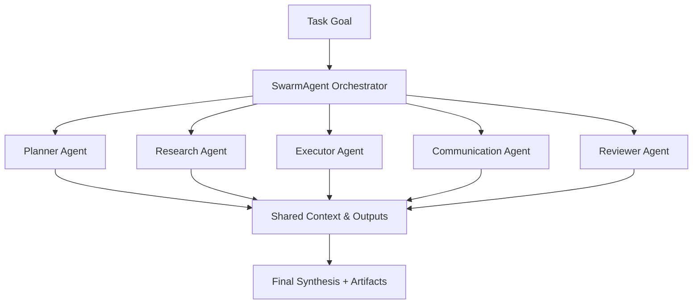
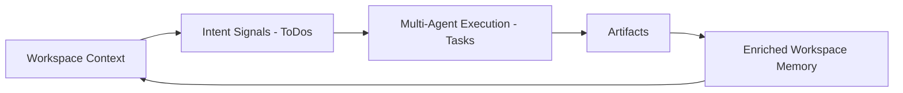
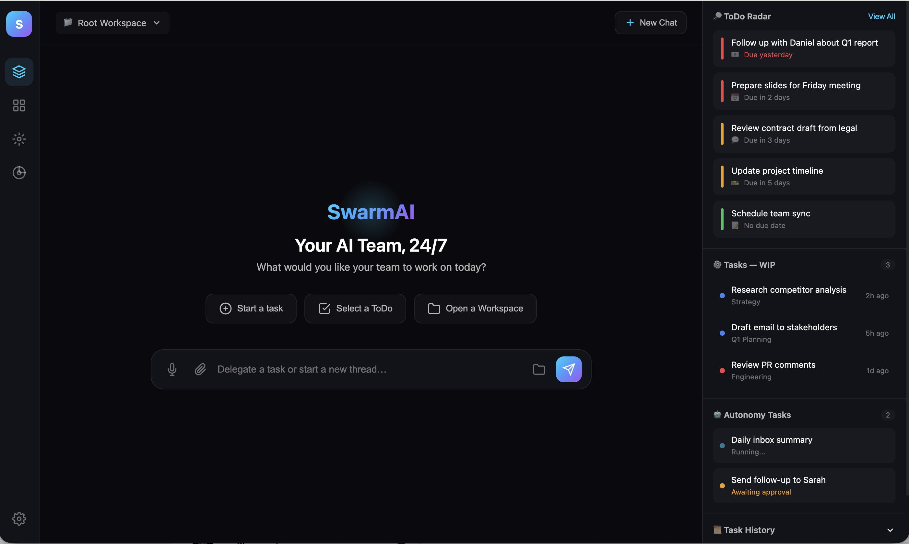
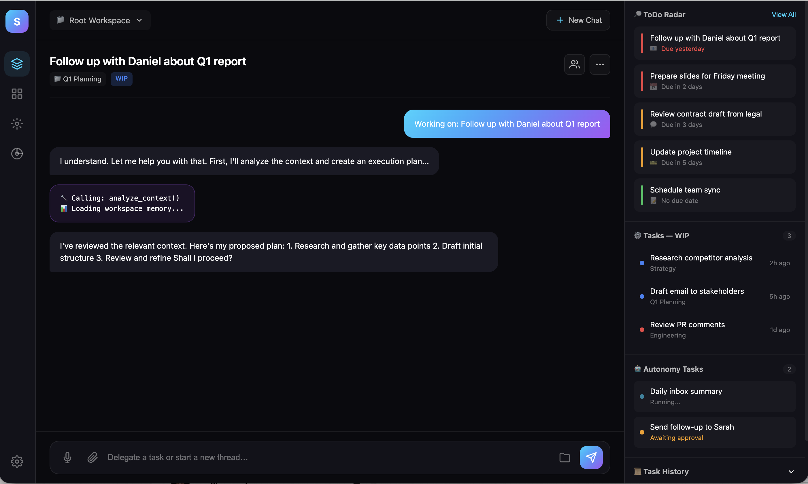
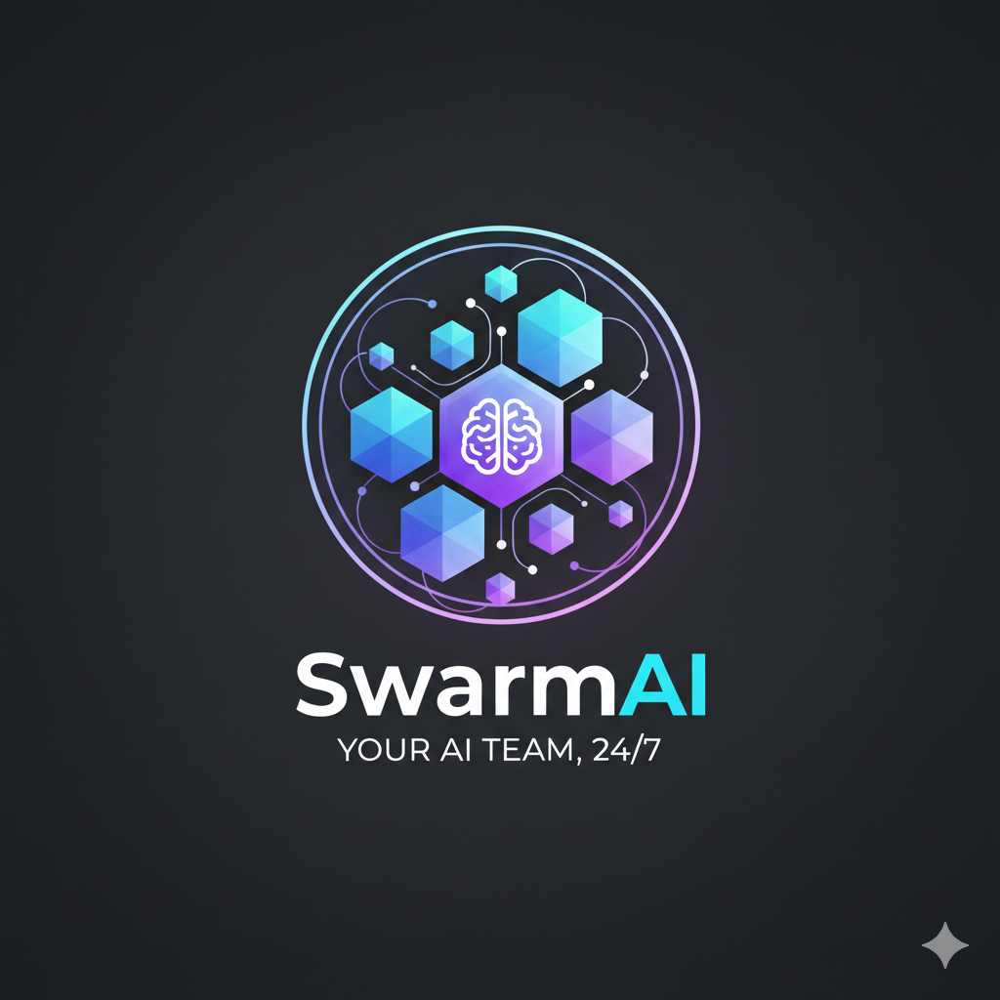

# SwarmAI — Product Design & Architecture (Revised)

> This revised version consolidates:
> - SwarmAI Context Engine & Workspace Memory model
> - Chat Session & Thread Management design
> - Multi-Agent Orchestration (SwarmAgent + Sub-Agents)
> - Lessons from Kiro (governed agents), Claude Code (execution-first threads), Claude Co-work (collaborative AI)
> - Enterprise governance, artifact-first knowledge model, and local-first performance strategy

---

# SwarmAI — Product Overview

## **SwarmAI — Your AI Team, 24/7**

**_Work Smarter. Stress Less._**

SwarmAI provides a supervised team of AI agents that plan, act, and follow through across your daily work. It unifies emails, meetings, communications, tasks, documents, and projects into a single intelligent command center — where context persists, actions are coordinated, and progress compounds over time.

Unlike traditional AI tools that reset every session, SwarmAI maintains persistent private memory. It remembers context, preferences, and ongoing priorities so productivity improves instead of restarting each day. You delegate. Your AI team executes. Every action is transparent, reviewable, and governed.

SwarmAI transforms fragmented effort into coordinated execution — turning daily work into durable outcomes and institutional knowledge.

---

## 🎯 Core Product Concept

SwarmAI is a **Persistent Agentic Workspace** for knowledge workers.

It replaces fragmented tools with a coordinated AI team that executes daily work under human supervision — turning disconnected tasks into structured, compounding progress.

---

## 🧾 Product Thesis

SwarmAI is a persistent, supervised agentic workspace where AI teams execute daily work under human guidance — transforming fragmented effort into durable, reviewable, and reusable knowledge and results.

---

## 🧠 Core Product Mental Model

SwarmAI is **not**:
- A chat app
- A task manager
- A project tracker
- A simple automation bot

It **is**:

> **A Command Center for Your AI Team**

Four foundational principles:

- 🧠 You supervise  
- 🤖 Agents execute  
- 📁 Memory persists  
- 📈 Work compounds  

Over time:
- Context accumulates inside Workspaces
- Agents specialize and collaborate
- Threads execute real work, not just chat
- Artifacts accumulate as reusable knowledge
- Productivity scales naturally across sessions and users

---

# SwarmAI — Product Architecture (5 Pillars)

The architecture aligns with:
- Kiro: explicit agent governance + skills/MCP scoping
- Claude Code: threads as executable workspaces with tool transparency
- Claude Co-work: collaborative human-in-the-loop workflows
- SwarmAI Context Engine: workspace-scoped persistent memory

---

# 1️⃣ Command  
## (Execution & Interaction Layer)

### Purpose
The Command layer is the operational control center where users delegate work to their AI team through **chat threads that become executable work contexts**.

---

## Core Principle
> Chat is the Command Surface — but not every message becomes a Task.

Threads support both:
- lightweight exploration
- structured multi-agent execution

---

## Dual Interaction Modes

### A. Exploration Mode (Lightweight Reasoning)
Used for:
- brainstorming
- clarifying requirements
- refining goals
- knowledge exploration

No Task is created automatically. Context still accumulates inside the workspace memory.

### B. Execution Mode (Structured Multi-Agent Run)
When user commits intent:
- A Swarm Task is created
- SwarmAgent generates execution plan
- Sub-agents are orchestrated in parallel
- Outputs become artifacts

```mermaid
flowchart LR
    A[User Message] --> B{Exploration or Execution?}
    B -->|Explore| C[Thread Only - No Task]
    B -->|Execute| D[Create Swarm Task]
    D --> E[SwarmAgent Plan]
    E --> F[Sub-Agent Execution]
    F --> G[Artifacts + Logs]
````

---

## Work Thread Model (Execution-First Threads)

Inspired by Claude Code, each thread is a **live execution workspace**, not a chat log.

A Swarm Task Thread contains:

* Goal and intent
* Execution plan (editable)
* Active sub-agents & roles
* Tool usage logs (Skills/MCP)
* Status updates & milestones
* Generated artifacts
* Human review checkpoints
* Full audit trail

Threads can run in parallel with isolated execution runs.

---

## Task States (Execution Lifecycle)

* **Draft** — Intent being refined (discussion)
* **WIP** — Active multi-agent execution
* **Blocked** — Waiting for dependency or approval
* **Completed** — Successfully finished
* **Cancelled** — Stopped by user/system

---

# 2️⃣ Workspaces

## (Persistent Memory & Context Engine Layer)

### Purpose

Workspaces are persistent cognitive containers defining:

* memory boundaries
* context scope
* knowledge accumulation
* execution governance

> Workspace = Persistent Memory Boundary for Context + Artifacts + Execution History

---

## Workspace Hierarchy

### Root Workspace (SwarmWS — Global Memory)

Automatically created and contains:

* Global goals, role, priorities
* Shared knowledge sources & tools
* Cross-workspace ToDos & Tasks
* Global reflections & artifacts

Acts as the **Global Daily Work Operating System**.

---

### Custom Workspaces (Project / Domain Memory)

Each workspace:

* inherits global context
* maintains domain-specific memory
* defines execution boundary for tasks & agents

Contains:

* Context files & notes
* Knowledge sources
* Tool scope & permissions
* Artifacts (Plans, Reports, Docs, Decisions)
* Signals (ToDos) and Tasks

---

## Context Engine (Persistent Memory Core)

The Context Engine builds a **W-Frame (Workspace Frame)** for each execution:

* workspace context files
* active tasks & signals
* knowledgebase sources
* effective Skills & MCP configuration
* thread summaries

This prevents regenerating full context each session and enables fast, local-first execution.

---

## Progressive Disclosure Design

| Level    | Default Visibility                         |
| -------- | ------------------------------------------ |
| Basic    | Context + Tasks                            |
| Advanced | Knowledge Sources + Tools                  |
| Expert   | Artifact graph + integrations + governance |

---

# 3️⃣ Swarm ToDos

## (Structured Intent & Signal Layer)

### Purpose

ToDos represent structured **work signals** before execution commitment.

> ToDo = Intent Signal
> Task = Governed Execution Commitment

---

## Signal Ingestion Sources

Automatically extracted from:

* Email
* Calendar
* Slack / Teams / communications
* Jira / SIM / Taskei / task centers
* Meeting notes
* Workspace artifacts
* Other integrations

Signals are normalized, deduplicated, and routed to appropriate workspaces.

---

## Refined ToDo Lifecycle

```mermaid
flowchart LR
    A[Pending Signal] --> B[In Discussion]
    B --> C[Handled → Task Created]
    C --> D[Execution WIP]
```

---

## ToDo Status Model

* Pending
* Overdue
* In Discussion
* Handled (mapped to Task)
* Cancelled
* Deleted

---

# 4️⃣ Autonomy

## (Supervised Multi-Agent Orchestration Layer)

### Core Principle

> Autonomy with Guardrails, Transparency, and Human Oversight

---

## SwarmAgent as Default Orchestrator

SwarmAgent is the central orchestrator that:

* interprets goals
* selects sub-agents
* validates workspace capability policies
* coordinates parallel execution
* synthesizes outputs
* proposes artifacts

This design is inspired by:

* Kiro: governed modular agents
* Claude Code: execution-first workflow
* Claude Co-work: collaborative checkpoints

---

## Multi-Agent Orchestration Model



---

## Standard Sub-Agent Roles

| Agent               | Responsibility                        |
| ------------------- | ------------------------------------- |
| Planner Agent       | Decompose goals into executable plans |
| Research Agent      | Gather knowledge from sources         |
| Executor Agent      | Perform tool calls & implementations  |
| Communication Agent | Draft emails, Slack, updates          |
| Reviewer Agent      | Validate correctness & compliance     |

Additional agents may be dynamically activated (classifier, summarizer, dedupe).

---

## Capability Governance (Kiro-inspired)

Each execution enforces:

```
effective_skills = swarmws_allowed ∩ workspace_allowed
effective_mcps   = swarmws_allowed ∩ workspace_allowed
```

If required capability is disabled:

* Execution is blocked
* User prompted to resolve policy conflict
* All actions logged in audit trail

---

## Autonomy Guardrails

| Level                     | Behavior                      |
| ------------------------- | ----------------------------- |
| Suggest                   | Plan only, no execution       |
| Ask-before-execute        | Confirm critical steps        |
| Auto-execute (safe scope) | Runs within approved tools    |
| Full autonomy             | Requires admin policy & audit |

---

## Human-in-the-loop Checkpoints (Co-work Principle)

Before:

* external replies
* privileged tool usage
* artifact publishing
* irreversible actions

SwarmAI requires explicit user approval.

---

# 5️⃣ Swarm Core

## (Personalization, Governance, Integrations & Multi-Agent Infrastructure)

### Purpose

Provide the intelligence and governance backbone powering the SwarmAI agent team.

---

## Personal Context Memory

Persistent user model including:

* role & profile
* goals and priorities
* communication style
* long-term preferences

---

## Memory Strategy (Local-First + Enterprise Sync)

* Local-first persistent memory (default)
* Optional secure cloud sync for cross-device collaboration
* Workspace-level sharing permissions for teams

---

## Sub-Agents & Skills Model

Sub-agents operate using configured:

* Skills (capabilities)
* MCP tools (external integrations)
* Knowledgebases (context sources)

Each agent is capability-scoped and governed by workspace policies.

---

## Tools, Integrations & Governance

Includes:

* MCP connectors (Slack, Email, Jira, SIM, Taskei)
* Execution policies & approval flows
* Role-based permissions
* Full audit trail of agent actions

---

# 🔁 Unified Relationship Model (Refined)

| Entity      | Layer           | Function                                     |
| ----------- | --------------- | -------------------------------------------- |
| Workspace   | Memory Layer    | Persistent context & artifacts               |
| ToDo        | Intent Layer    | Structured work signal                       |
| Task        | Execution Layer | Multi-agent governed execution thread        |
| Chat Thread | Command Layer   | Execution workspace (explore → run → review) |
| Artifact    | Knowledge Layer | Durable reusable outputs                     |

---

# SwarmAI — Core Product Models (Final)

* **Swarm Workspace** = Persistent memory & knowledge container
* **Swarm ToDo** = Structured intent signal
* **Swarm Task Thread** = Governed multi-agent execution workspace
* **Chat** = Command interface (explore → delegate → review)
* **Artifacts** = Durable reusable knowledge outputs

---

## Continuous Value Loop



This loop ensures work compounds over time instead of resetting each session.

---

# Appendix

> Data directory paths are platform-specific. The app uses `get_app_data_dir()` to resolve local storage. Local-first architecture ensures performance and privacy, while optional sync enables enterprise collaboration.







