# SwarmAI — System Flowcharts

Mermaid diagrams for the key flows in SwarmAI.

---

## 1. App Startup Flow

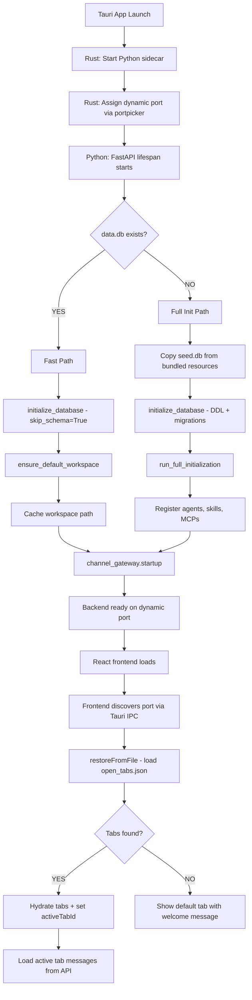
```mermaid
flowchart TD
    A[Tauri App Launch] --> B[Rust: Start Python sidecar]
    B --> C[Rust: Assign dynamic port via portpicker]
    C --> D[Python: FastAPI lifespan starts]
    D --> E{data.db exists?}

    E -->|YES| F[Fast Path]
    F --> F1[initialize_database - skip_schema=True]
    F1 --> F2[ensure_default_workspace]
    F2 --> F3[Cache workspace path]
    F3 --> G[channel_gateway.startup]

    E -->|NO| H[Full Init Path]
    H --> H1[Copy seed.db from bundled resources]
    H1 --> H2[initialize_database - DDL + migrations]
    H2 --> H3[run_full_initialization]
    H3 --> H4[Register agents, skills, MCPs]
    H4 --> G

    G --> I[Backend ready on dynamic port]
    I --> J[React frontend loads]
    J --> K[Frontend discovers port via Tauri IPC]
    K --> L[restoreFromFile - load open_tabs.json]
    L --> M{Tabs found?}
    M -->|YES| N[Hydrate tabs + set activeTabId]
    N --> O[Load active tab messages from API]
    M -->|NO| P[Show default tab with welcome message]
```

---

## 2. Multi-Tab Chat — Message Send Flow

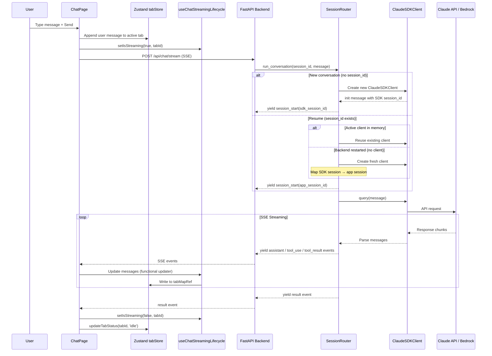
```mermaid
sequenceDiagram
    participant User
    participant ChatPage
    participant TabMap as Zustand tabStore
    participant StreamHook as useChatStreamingLifecycle
    participant API as FastAPI Backend
    participant AM as SessionRouter
    participant SDK as ClaudeSDKClient
    participant Claude as Claude API / Bedrock

    User->>ChatPage: Type message + Send
    ChatPage->>TabMap: Append user message to active tab
    ChatPage->>StreamHook: setIsStreaming(true, tabId)
    ChatPage->>API: POST /api/chat/stream (SSE)

    API->>AM: run_conversation(session_id, message)

    alt New conversation (no session_id)
        AM->>SDK: Create new ClaudeSDKClient
        SDK-->>AM: init message with SDK session_id
        AM-->>API: yield session_start(sdk_session_id)
    else Resume (session_id exists)
        alt Active client in memory
            AM->>SDK: Reuse existing client
        else Backend restarted (no client)
            AM->>SDK: Create fresh client
            Note over AM: Map SDK session → app session
        end
        AM-->>API: yield session_start(app_session_id)
    end

    AM->>SDK: query(message)
    SDK->>Claude: API request

    loop SSE Streaming
        Claude-->>SDK: Response chunks
        SDK-->>AM: Parse messages
        AM-->>API: yield assistant / tool_use / tool_result events
        API-->>ChatPage: SSE events
        ChatPage->>StreamHook: Update messages (functional updater)
        StreamHook->>TabMap: Write to tabMapRef
    end

    AM-->>API: yield result event
    API-->>ChatPage: result event
    ChatPage->>StreamHook: setIsStreaming(false, tabId)
    ChatPage->>TabMap: updateTabStatus(tabId, 'idle')
```

---

## 3. Context and Memory Assembly Flow

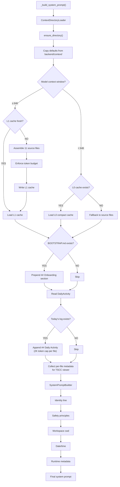
```mermaid
flowchart TD
    A["_build_system_prompt()"] --> B[ContextDirectoryLoader]
    B --> B1["ensure_directory()"]
    B1 --> B2["Copy defaults from backend/context/"]
    B2 --> B3{"Model context window?"}

    B3 -->|"≥ 64K"| C{L1 cache fresh?}
    C -->|YES| D[Load L1 cache]
    C -->|NO| E["Assemble 11 source files"]
    E --> E1["Enforce token budget"]
    E1 --> E2["Write L1 cache"]
    E2 --> D

    B3 -->|"< 64K"| F{L0 cache exists?}
    F -->|YES| G[Load L0 compact cache]
    F -->|NO| H[Fallback to source files]

    D --> I{BOOTSTRAP.md exists?}
    G --> I
    H --> I

    I -->|YES| J["Prepend ## Onboarding section"]
    I -->|NO| K[Skip]
    J --> L
    K --> L

    L["Read DailyActivity"] --> L1{"Today's log exists?"}
    L1 -->|YES| L2["Append ## Daily Activity<br/>(2K token cap per file)"]
    L1 -->|NO| L3[Skip]
    L2 --> M
    L3 --> M

    M["Collect per-file metadata<br/>for TSCC viewer"] --> N[SystemPromptBuilder]
    N --> N1["Identity line"]
    N1 --> N2["Safety principles"]
    N2 --> N3["Workspace cwd"]
    N3 --> N4["Date/time"]
    N4 --> N5["Runtime metadata"]
    N5 --> O["Final system prompt"]
```

---

## 4. Context File Two-Mode Copy

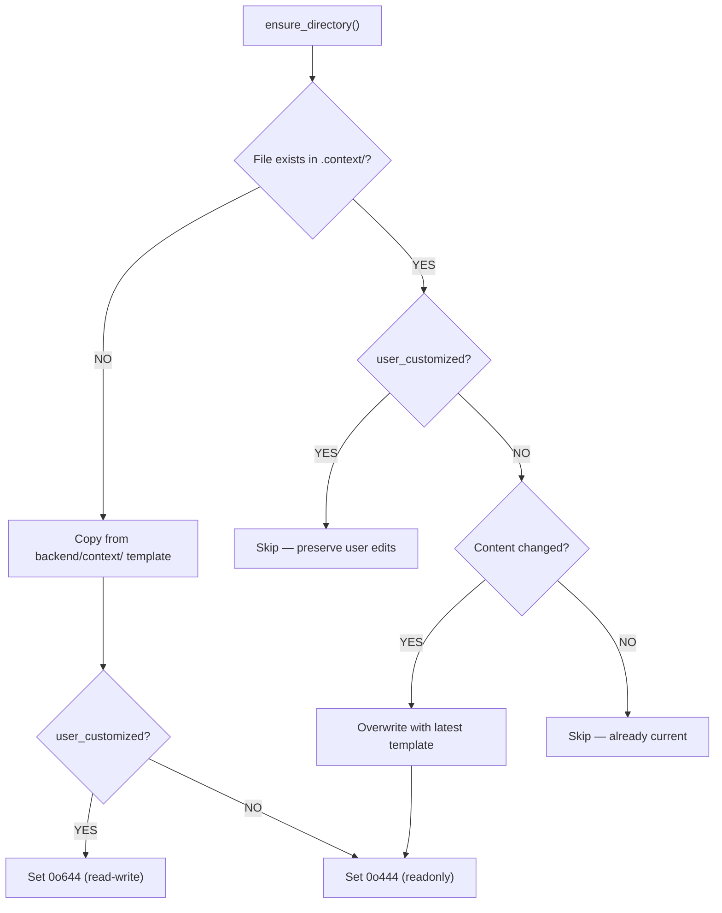
```mermaid
flowchart TD
    A["ensure_directory()"] --> B{File exists in .context/?}

    B -->|NO| C["Copy from backend/context/ template"]
    C --> D{user_customized?}
    D -->|YES| E["Set 0o644 (read-write)"]
    D -->|NO| F["Set 0o444 (readonly)"]

    B -->|YES| G{user_customized?}
    G -->|YES| H["Skip — preserve user edits"]
    G -->|NO| I{Content changed?}
    I -->|YES| J["Overwrite with latest template"]
    J --> F
    I -->|NO| K["Skip — already current"]
```

---

## 5. Token Budget Enforcement

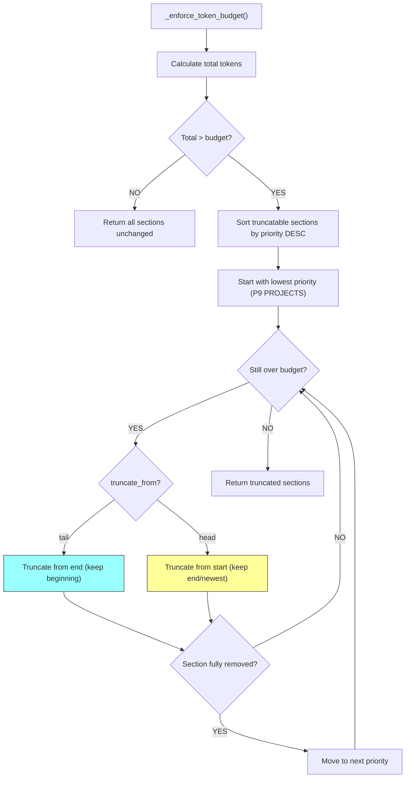
```mermaid
flowchart TD
    A["_enforce_token_budget()"] --> B["Calculate total tokens"]
    B --> C{Total > budget?}
    C -->|NO| D["Return all sections unchanged"]
    C -->|YES| E["Sort truncatable sections by priority DESC"]
    E --> F["Start with lowest priority (P9 PROJECTS)"]
    F --> G{Still over budget?}
    G -->|YES| H{truncate_from?}
    H -->|tail| I["Truncate from end (keep beginning)"]
    H -->|head| J["Truncate from start (keep end/newest)"]
    I --> K{Section fully removed?}
    J --> K
    K -->|NO| G
    K -->|YES| L["Move to next priority"]
    L --> G
    G -->|NO| M["Return truncated sections"]

    style J fill:#ff9,stroke:#333
    style I fill:#9ff,stroke:#333
```

---

## 6. Tab Switching Flow

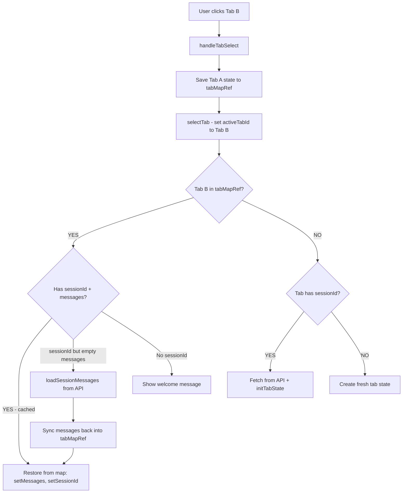
```mermaid
flowchart TD
    A[User clicks Tab B] --> B[handleTabSelect]
    B --> C[Save Tab A state to tabMapRef]
    C --> D[selectTab - set activeTabId to Tab B]
    D --> E{Tab B in tabMapRef?}

    E -->|YES| F{Has sessionId + messages?}
    F -->|YES - cached| G[Restore from map: setMessages, setSessionId]
    F -->|sessionId but empty messages| H[loadSessionMessages from API]
    H --> H1[Sync messages back into tabMapRef]
    H1 --> G
    F -->|No sessionId| I[Show welcome message]

    E -->|NO| J{Tab has sessionId?}
    J -->|YES| K[Fetch from API + initTabState]
    J -->|NO| L[Create fresh tab state]
```

---

## 7. Tab Persistence Flow

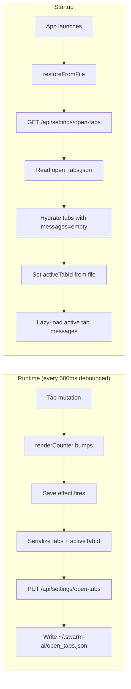
```mermaid
flowchart LR
    subgraph "Runtime (every 500ms debounced)"
        A[Tab mutation] --> B[renderCounter bumps]
        B --> C[Save effect fires]
        C --> D[Serialize tabs + activeTabId]
        D --> E[PUT /api/settings/open-tabs]
        E --> F[Write ~/.swarm-ai/open_tabs.json]
    end

    subgraph "Startup"
        G[App launches] --> H[restoreFromFile]
        H --> I[GET /api/settings/open-tabs]
        I --> J[Read open_tabs.json]
        J --> K[Hydrate tabs with messages=empty]
        K --> L[Set activeTabId from file]
        L --> M[Lazy-load active tab messages]
    end
```

---

## 8. Session ID Mapping — Resume After Restart

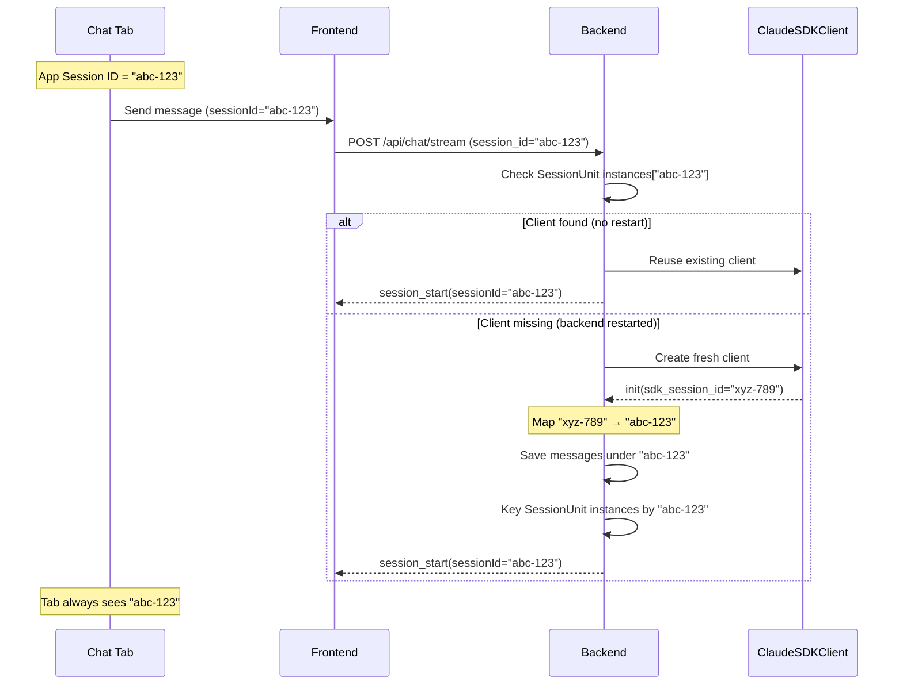
```mermaid
sequenceDiagram
    participant Tab as Chat Tab
    participant FE as Frontend
    participant BE as Backend
    participant SDK as ClaudeSDKClient

    Note over Tab: App Session ID = "abc-123"

    Tab->>FE: Send message (sessionId="abc-123")
    FE->>BE: POST /api/chat/stream (session_id="abc-123")

    BE->>BE: Check SessionUnit instances["abc-123"]

    alt Client found (no restart)
        BE->>SDK: Reuse existing client
        BE-->>FE: session_start(sessionId="abc-123")
    else Client missing (backend restarted)
        BE->>SDK: Create fresh client
        SDK-->>BE: init(sdk_session_id="xyz-789")
        Note over BE: Map "xyz-789" → "abc-123"
        BE->>BE: Save messages under "abc-123"
        BE->>BE: Key SessionUnit instances by "abc-123"
        BE-->>FE: session_start(sessionId="abc-123")
    end

    Note over Tab: Tab always sees "abc-123"
```

---

## 9. Tool Use & Permission Flow

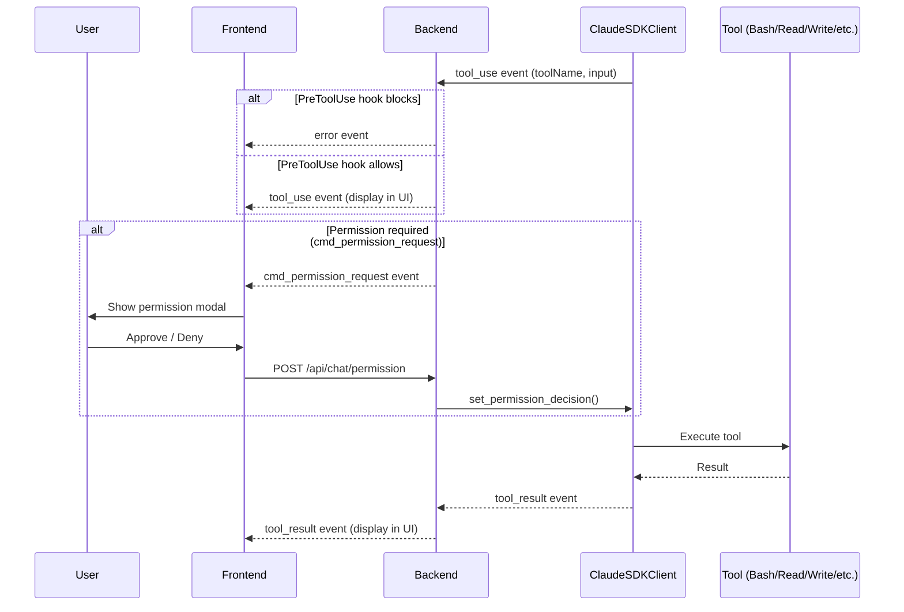
```mermaid
sequenceDiagram
    participant User
    participant FE as Frontend
    participant BE as Backend
    participant SDK as ClaudeSDKClient
    participant Tool as Tool (Bash/Read/Write/etc.)

    SDK->>BE: tool_use event (toolName, input)

    alt PreToolUse hook blocks
        BE-->>FE: error event
    else PreToolUse hook allows
        BE-->>FE: tool_use event (display in UI)
    end

    alt Permission required (cmd_permission_request)
        BE-->>FE: cmd_permission_request event
        FE->>User: Show permission modal
        User->>FE: Approve / Deny
        FE->>BE: POST /api/chat/permission
        BE->>SDK: set_permission_decision()
    end

    SDK->>Tool: Execute tool
    Tool-->>SDK: Result
    SDK-->>BE: tool_result event
    BE-->>FE: tool_result event (display in UI)
```

---

## 10. Skill Projection Flow

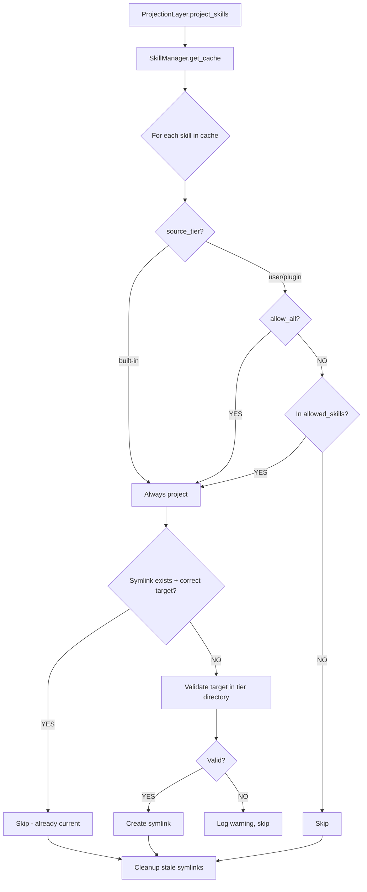
```mermaid
flowchart TD
    A[ProjectionLayer.project_skills] --> B[SkillManager.get_cache]
    B --> C{For each skill in cache}

    C --> D{source_tier?}
    D -->|built-in| E[Always project]
    D -->|user/plugin| F{allow_all?}
    F -->|YES| E
    F -->|NO| G{In allowed_skills?}
    G -->|YES| E
    G -->|NO| H[Skip]

    E --> I{Symlink exists + correct target?}
    I -->|YES| J[Skip - already current]
    I -->|NO| K[Validate target in tier directory]
    K --> L{Valid?}
    L -->|YES| M[Create symlink]
    L -->|NO| N[Log warning, skip]

    M --> O[Cleanup stale symlinks]
    J --> O
    H --> O
```

---

## 11. Memory Write Flow

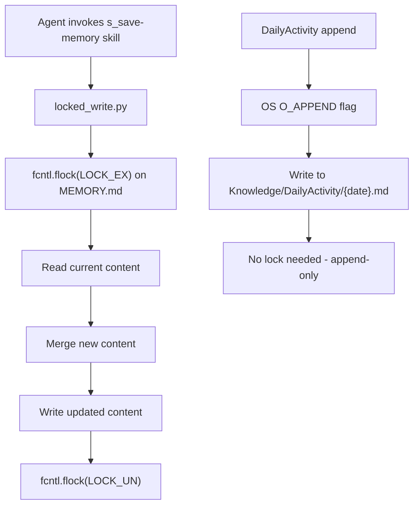
```mermaid
flowchart TD
    A[Agent invokes s_save-memory skill] --> B[locked_write.py]
    B --> C["fcntl.flock(LOCK_EX) on MEMORY.md"]
    C --> D[Read current content]
    D --> E[Merge new content]
    E --> F[Write updated content]
    F --> G["fcntl.flock(LOCK_UN)"]

    H[DailyActivity append] --> I["OS O_APPEND flag"]
    I --> J["Write to Knowledge/DailyActivity/{date}.md"]
    J --> K[No lock needed - append-only]
```

---

## 12. SwarmWS Workspace Integrity Flow

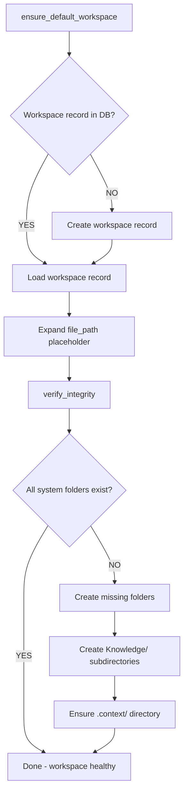
```mermaid
flowchart TD
    A[ensure_default_workspace] --> B{Workspace record in DB?}
    B -->|NO| C[Create workspace record]
    B -->|YES| D[Load workspace record]
    C --> D
    D --> E[Expand file_path placeholder]
    E --> F[verify_integrity]
    F --> G{All system folders exist?}
    G -->|YES| H[Done - workspace healthy]
    G -->|NO| I[Create missing folders]
    I --> J[Create Knowledge/ subdirectories]
    J --> K[Ensure .context/ directory]
    K --> H
```

---

## 13. Skill Execution Flow

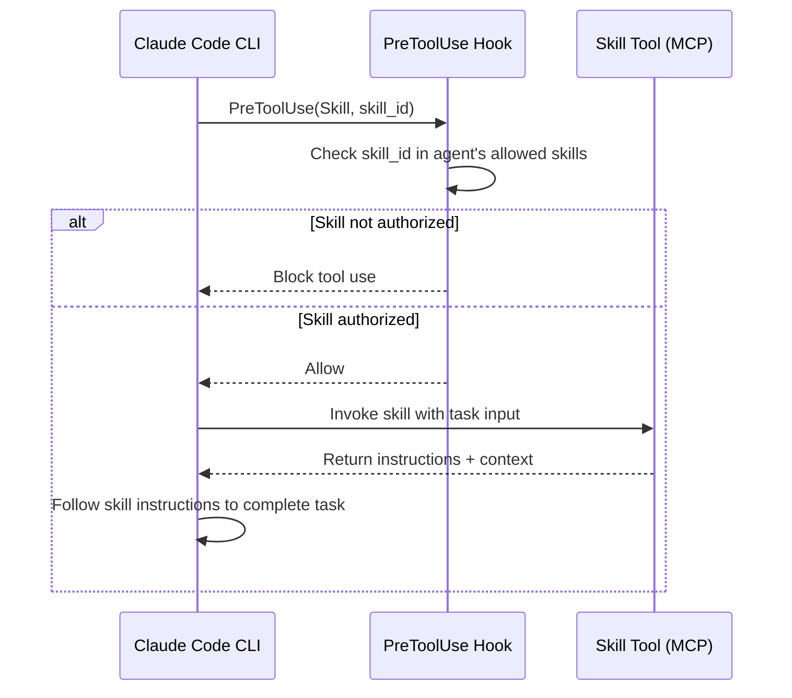
```mermaid
sequenceDiagram
    participant Claude as Claude Code CLI
    participant Hook as PreToolUse Hook
    participant Skill as Skill Tool (MCP)

    Claude->>Hook: PreToolUse(Skill, skill_id)
    Hook->>Hook: Check skill_id in agent's allowed skills

    alt Skill not authorized
        Hook-->>Claude: Block tool use
    else Skill authorized
        Hook-->>Claude: Allow
        Claude->>Skill: Invoke skill with task input
        Skill-->>Claude: Return instructions + context
        Claude->>Claude: Follow skill instructions to complete task
    end
```

---

## 14. Build Pipeline Flow

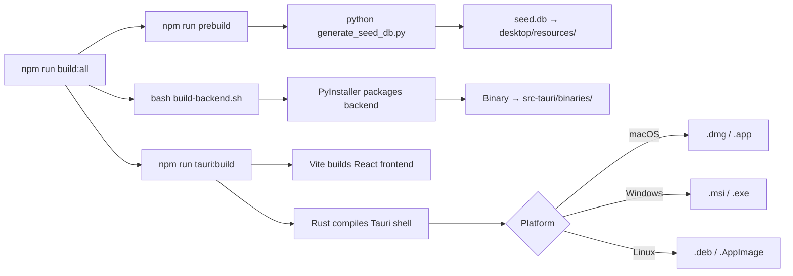
```mermaid
flowchart LR
    A[npm run build:all] --> B[npm run prebuild]
    B --> C[python generate_seed_db.py]
    C --> D[seed.db → desktop/resources/]

    A --> E[bash build-backend.sh]
    E --> F[PyInstaller packages backend]
    F --> G[Binary → src-tauri/binaries/]

    A --> H[npm run tauri:build]
    H --> I[Vite builds React frontend]
    H --> J[Rust compiles Tauri shell]
    J --> K{Platform}
    K -->|macOS| L[.dmg / .app]
    K -->|Windows| M[.msi / .exe]
    K -->|Linux| N[.deb / .AppImage]
```

---

## 15. ChatThread Binding Flow

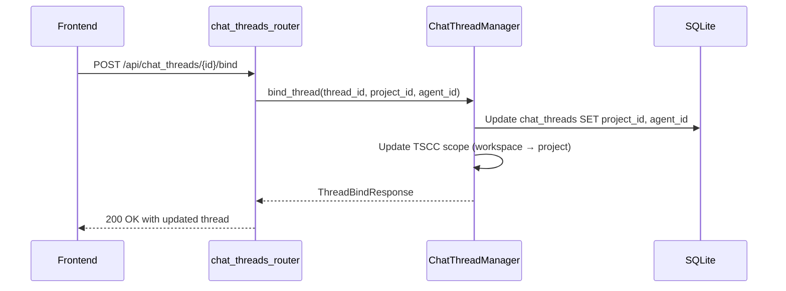
```mermaid
sequenceDiagram
    participant FE as Frontend
    participant API as chat_threads_router
    participant CTM as ChatThreadManager
    participant DB as SQLite

    FE->>API: POST /api/chat_threads/{id}/bind
    API->>CTM: bind_thread(thread_id, project_id, agent_id)
    CTM->>DB: Update chat_threads SET project_id, agent_id
    CTM->>CTM: Update TSCC scope (workspace → project)
    CTM-->>API: ThreadBindResponse
    API-->>FE: 200 OK with updated thread
```

---

## 16. Answer User Question Flow

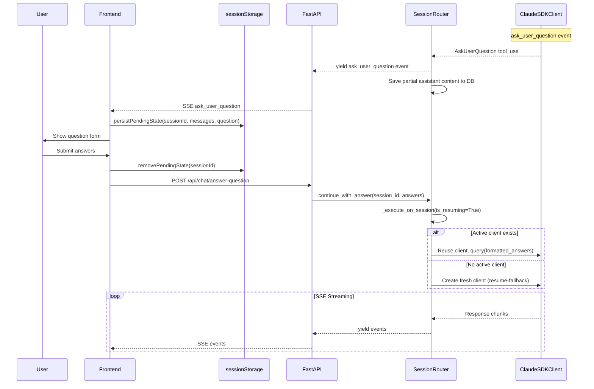
```mermaid
sequenceDiagram
    participant User
    participant FE as Frontend
    participant SS as sessionStorage
    participant API as FastAPI
    participant AM as SessionRouter
    participant SDK as ClaudeSDKClient

    Note over SDK: ask_user_question event
    SDK-->>AM: AskUserQuestion tool_use
    AM-->>API: yield ask_user_question event
    AM->>AM: Save partial assistant content to DB
    API-->>FE: SSE ask_user_question
    FE->>SS: persistPendingState(sessionId, messages, question)
    FE->>User: Show question form

    User->>FE: Submit answers
    FE->>SS: removePendingState(sessionId)
    FE->>API: POST /api/chat/answer-question
    API->>AM: continue_with_answer(session_id, answers)
    AM->>AM: _execute_on_session(is_resuming=True)

    alt Active client exists
        AM->>SDK: Reuse client, query(formatted_answers)
    else No active client
        AM->>SDK: Create fresh client (resume-fallback)
    end

    loop SSE Streaming
        SDK-->>AM: Response chunks
        AM-->>API: yield events
        API-->>FE: SSE events
    end
```

---

## 17. Command Permission Flow (Full)

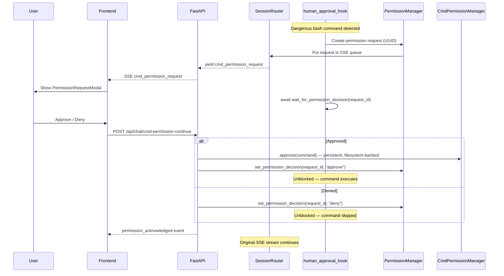
```mermaid
sequenceDiagram
    participant User
    participant FE as Frontend
    participant API as FastAPI
    participant AM as SessionRouter
    participant Hook as human_approval_hook
    participant PM as PermissionManager
    participant CmdPM as CmdPermissionManager

    Note over Hook: Dangerous bash command detected
    Hook->>PM: Create permission request (UUID)
    PM->>AM: Put request in SSE queue
    AM-->>API: yield cmd_permission_request
    API-->>FE: SSE cmd_permission_request
    FE->>User: Show PermissionRequestModal
    Hook->>Hook: await wait_for_permission_decision(request_id)

    User->>FE: Approve / Deny
    FE->>API: POST /api/chat/cmd-permission-continue

    alt Approved
        API->>CmdPM: approve(command) — persistent, filesystem-backed
        API->>PM: set_permission_decision(request_id, "approve")
        Note over Hook: Unblocked — command executes
    else Denied
        API->>PM: set_permission_decision(request_id, "deny")
        Note over Hook: Unblocked — command skipped
    end

    API-->>FE: permission_acknowledged event
    Note over AM: Original SSE stream continues
```

---

## 18. sessionStorage Persistence Flow

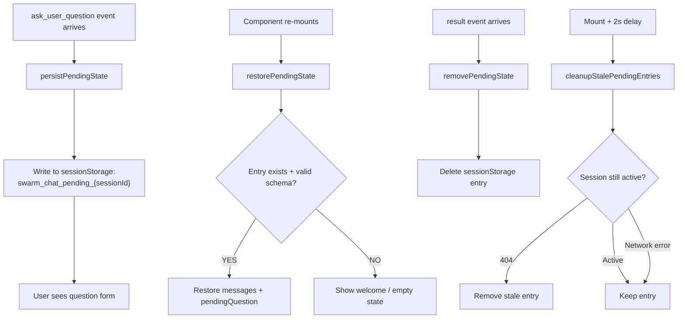
```mermaid
flowchart TD
    A[ask_user_question event arrives] --> B[persistPendingState]
    B --> C["Write to sessionStorage:<br/>swarm_chat_pending_{sessionId}"]
    C --> D[User sees question form]

    E[Component re-mounts] --> F[restorePendingState]
    F --> G{Entry exists + valid schema?}
    G -->|YES| H[Restore messages + pendingQuestion]
    G -->|NO| I[Show welcome / empty state]

    J[result event arrives] --> K[removePendingState]
    K --> L[Delete sessionStorage entry]

    M[Mount + 2s delay] --> N[cleanupStalePendingEntries]
    N --> O{Session still active?}
    O -->|404| P[Remove stale entry]
    O -->|Active| Q[Keep entry]
    O -->|Network error| Q
```

---

## 19. Auto-Commit Workspace Flow

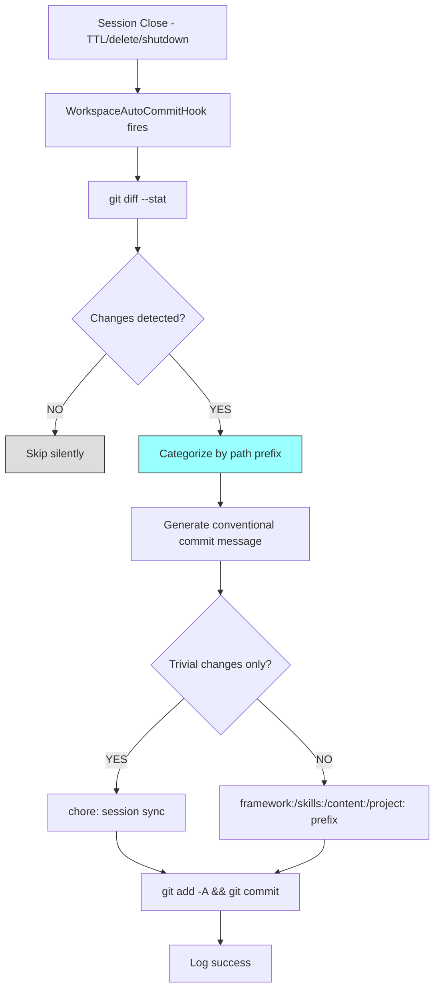
```mermaid
flowchart TD
    A[Session Close - TTL/delete/shutdown] --> B["WorkspaceAutoCommitHook fires"]
    B --> C["git diff --stat"]
    C --> D{Changes detected?}
    D -->|NO| E[Skip silently]
    D -->|YES| F["Categorize by path prefix"]
    F --> G["Generate conventional commit message"]
    G --> H{Trivial changes only?}
    H -->|YES| I["chore: session sync"]
    H -->|NO| J["framework:/skills:/content:/project: prefix"]
    I --> K["git add -A && git commit"]
    J --> K
    K --> L[Log success]

    style E fill:#ddd,stroke:#333
    style F fill:#9ff,stroke:#333
```

---

## 20. Deferred Startup & Session Cleanup Flow

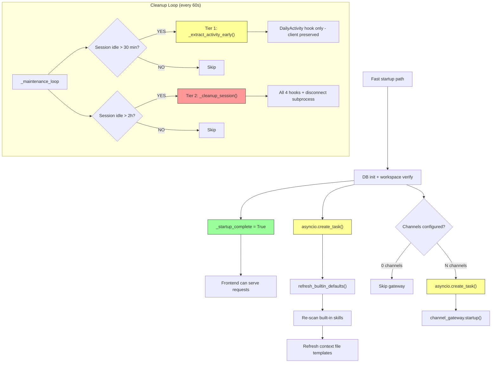
```mermaid
flowchart TD
    A[Fast startup path] --> B[DB init + workspace verify]
    B --> C["_startup_complete = True"]
    C --> D[Frontend can serve requests]

    B --> E["asyncio.create_task()"]
    E --> F["refresh_builtin_defaults()"]
    F --> G[Re-scan built-in skills]
    G --> H[Refresh context file templates]

    B --> I{Channels configured?}
    I -->|0 channels| J[Skip gateway]
    I -->|N channels| K["asyncio.create_task()"]
    K --> L["channel_gateway.startup()"]

    subgraph "Cleanup Loop (every 60s)"
        M["_maintenance_loop"] --> N{Session idle > 30 min?}
        N -->|YES| O["Tier 1: _extract_activity_early()"]
        O --> P[DailyActivity hook only - client preserved]
        N -->|NO| Q[Skip]
        M --> R{Session idle > 2h?}
        R -->|YES| S["Tier 2: _cleanup_session()"]
        S --> T[All 4 hooks + disconnect subprocess]
        R -->|NO| U[Skip]
    end

    style C fill:#9f9,stroke:#333
    style E fill:#ff9,stroke:#333
    style K fill:#ff9,stroke:#333
    style O fill:#ff9,stroke:#333
    style S fill:#f99,stroke:#333
```

---

## Diagram Legend

| Symbol | Meaning |
|--------|---------|
| Solid arrow | Synchronous call or data flow |
| Dashed arrow | Async response or SSE event |
| Diamond | Decision point |
| Rectangle | Process or component |
| Yellow fill | Head truncation (MEMORY.md) / Deferred background task |
| Cyan fill | Tail truncation (default) / Background thread |
| Green fill | Startup complete / success state |
| Red fill | Destructive cleanup (session teardown) |
| Grey fill | Skipped / no-op |
