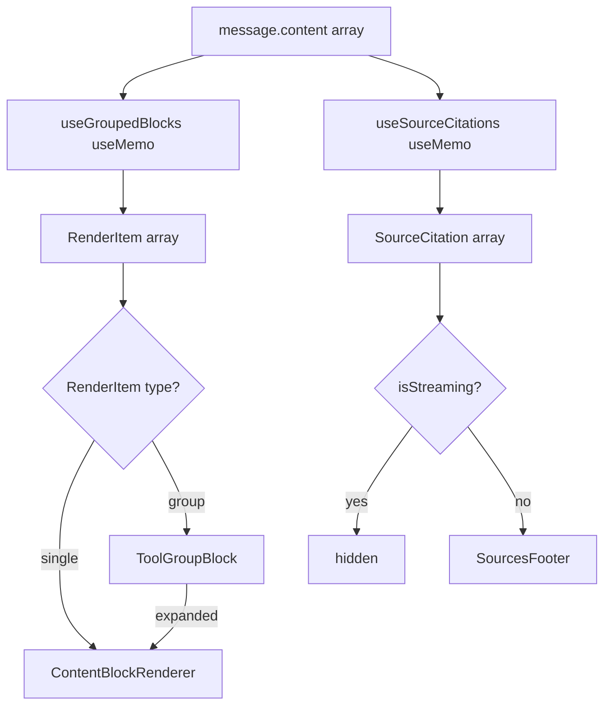

# Design Document: Tool Grouping and Source Citations

## Overview

This feature adds two complementary UX improvements to the SwarmAI chat interface:

1. **Consecutive Tool Call Grouping** — Collapses consecutive same-category tool_use blocks into a single summary row (e.g., "Fetched 7 URLs") with an expand/collapse toggle. This reduces visual noise when the agent performs many tool calls of the same type in sequence.

2. **Source Citations** — Automatically tracks URLs (`web_fetch`) and file paths (`read`) accessed during an assistant message and renders a "Sources" footer with clickable links after streaming completes.

Both features are purely frontend — no backend changes required. They build on the existing `category` and `summary` fields on `ToolUseContent` blocks and the `resultMap` already computed in `AssistantMessageView`.

### Key Design Decisions

- **Grouping at AssistantMessageView level**: The grouping logic runs as a `useMemo` pass over `message.content`, producing an array of `RenderItem` unions (single blocks or groups). This keeps `ContentBlockRenderer` unchanged.
- **Source tracking as a separate `useMemo`**: Source extraction is a pure scan of `message.content` + `resultMap`, decoupled from grouping.
- **No new backend API**: All data needed (category, summary, isError) is already present on SSE-streamed content blocks.



## Architecture

The feature touches three layers of the existing component tree:

### Component Tree (before → after)

```
AssistantMessageView
├── contentBlocks.map(block =>        ← BEFORE: flat iteration
│   <ContentBlockRenderer block />)
│
├── groupedItems.map(item =>          ← AFTER: grouped iteration
│   item.kind === 'single'
│     ? <ContentBlockRenderer block />
│     : <ToolGroupBlock group />)
│
└── <SourcesFooter citations />       ← NEW: rendered after content
```

### Data Flow

1. `AssistantMessageView` receives `message.content: ContentBlock[]`
2. `useGroupedBlocks(message.content)` → `RenderItem[]` (groups consecutive same-category tool_use blocks)
3. `useSourceCitations(message.content, resultMap)` → `SourceCitation[]` (extracts URLs/paths from web_fetch/read blocks)
4. Render loop iterates `RenderItem[]` instead of raw `ContentBlock[]`
5. `SourcesFooter` renders after content blocks when `!isStreaming && citations.length > 0`

### New Files

| File | Purpose |
|------|---------|
| `useGroupedBlocks.ts` | Hook: groups consecutive same-category tool_use blocks into `RenderItem[]` |
| `useSourceCitations.ts` | Hook: extracts and deduplicates source citations from tool_use blocks |
| `ToolGroupBlock.tsx` | Component: collapsed/expanded view for a group of same-category tool calls |
| `SourcesFooter.tsx` | Component: renders the "Sources" section with clickable links |
| `sourceExtractor.ts` | Pure utility: extracts URL/path from a summary string |

### Modified Files

| File | Change |
|------|--------|
| `AssistantMessageView.tsx` | Replace flat `contentBlocks` iteration with grouped iteration; add `SourcesFooter` |

## Components and Interfaces

### 1. `useGroupedBlocks` Hook

Location: `desktop/src/pages/chat/components/useGroupedBlocks.ts`

```typescript
type SingleItem = { kind: 'single'; block: ContentBlock; index: number };
type GroupItem = {
  kind: 'group';
  category: string;
  blocks: ToolUseContent[];
  startIndex: number;
};
type RenderItem = SingleItem | GroupItem;

function useGroupedBlocks(content: ContentBlock[]): RenderItem[];
```

Algorithm:
- Iterate `content` linearly. For each `tool_use` block, compare its `category` to the previous `tool_use` block's category.
- If same category and the previous item was also a tool_use (no intervening text/ask_user_question), extend the current group.
- Otherwise, flush the current group (if size > 1, emit `GroupItem`; if size === 1, emit `SingleItem`) and start a new accumulator.
- Non-tool_use blocks always flush the current group and emit as `SingleItem`.
- `tool_result` blocks are skipped entirely (they are consumed via `resultMap` in `MergedToolBlock`).

### 2. `ToolGroupBlock` Component

Location: `desktop/src/pages/chat/components/ToolGroupBlock.tsx`

Props:
```typescript
interface ToolGroupBlockProps {
  category: string;
  blocks: ToolUseContent[];
  resultMap: Map<string, ToolResultContent>;
  isStreaming?: boolean;
}
```

Behavior:
- **Collapsed (default)**: Single row with category icon, human-readable summary label (e.g., "Fetched 7 URLs"), status indicator, and expand/collapse chevron.
- **Expanded**: Renders each `ToolUseContent` block as a `MergedToolBlock` (reusing existing component).
- Status logic: if all results pending → spinner; if any result has `isError` → show error count; otherwise → check icon.
- Accessibility: `role="group"`, `aria-label`, `aria-expanded` on toggle button, keyboard-activatable via Enter/Space.

Summary label mapping:
```typescript
const CATEGORY_VERBS: Record<string, { verb: string; noun: string }> = {
  web_fetch: { verb: 'Fetched', noun: 'URLs' },
  read:      { verb: 'Read', noun: 'files' },
  write:     { verb: 'Wrote', noun: 'files' },
  bash:      { verb: 'Ran', noun: 'commands' },
  search:    { verb: 'Searched', noun: 'queries' },
  web_search:{ verb: 'Searched', noun: 'queries' },
  list_dir:  { verb: 'Listed', noun: 'directories' },
  todowrite: { verb: 'Updated', noun: 'items' },
  fallback:  { verb: 'Used', noun: 'tools' },
};
// Label: `${verb} ${count} ${noun}` → "Fetched 7 URLs"
```

### 3. `useSourceCitations` Hook

Location: `desktop/src/pages/chat/components/useSourceCitations.ts`

```typescript
interface SourceCitation {
  type: 'url' | 'file';
  raw: string;        // Full URL or full file path
  display: string;    // Truncated display label (domain+path or parent/filename)
  toolUseId: string;  // For traceability
}

function useSourceCitations(
  content: ContentBlock[],
  resultMap: Map<string, ToolResultContent>,
): SourceCitation[];
```

Algorithm:
- Scan `content` for `tool_use` blocks where `category` is `web_fetch` or `read`.
- For each, check `resultMap` — if the matching result has `isError === true`, skip it.
- Extract URL or file path from `summary` using `extractSource()`.
- Deduplicate by `raw` value (keep first occurrence).
- Preserve insertion order.

### 4. `sourceExtractor` Utility

Location: `desktop/src/pages/chat/components/sourceExtractor.ts`

```typescript
function extractSource(summary: string, category: 'web_fetch' | 'read'): string | null;
function formatUrlDisplay(url: string): string;   // "https://bbc.com/news" → "bbc.com/news"
function formatFileDisplay(path: string): string;  // "/home/user/src/core/agent.py" → "core/agent.py"
function truncateDisplay(label: string, maxLen?: number): string; // truncate at 60 chars with "…"
```

Extraction rules:
- If summary matches `"Fetching <url>"` or `"Reading <path>"` — extract the portion after the verb prefix.
- If summary contains a URL (`https?://...`) — extract the URL via regex.
- Otherwise, treat the trimmed summary as the raw path/URL.
- Trim trailing whitespace and punctuation from extracted values.

Display formatting:
- URLs: strip protocol, show `domain/path` (e.g., `bbc.com/news/article-123`).
- File paths: show last two path segments (e.g., `core/agent_manager.py`).
- Truncate at 60 characters with `…` suffix; full value shown in tooltip.

### 5. `SourcesFooter` Component

Location: `desktop/src/pages/chat/components/SourcesFooter.tsx`

Props:
```typescript
interface SourcesFooterProps {
  citations: SourceCitation[];
}
```

Behavior:
- Renders a `<nav aria-label="Sources">` landmark with a "Sources" heading.
- Each citation is a clickable link with a category icon (`language` for URLs, `description` for files).
- URL citations open in the default browser (via Tauri's `shell.open`).
- File citations open in the editor (via existing file-open mechanism).
- Shows max 10 citations; if more, displays "and N more" indicator.
- Each link has `aria-label` describing the destination/action.
- Tooltip on hover shows full URL/path when display label is truncated.

### 6. `AssistantMessageView` Changes

The existing flat iteration:
```typescript
const contentBlocks = message.content.map((block, index) => (
  <ContentBlockRenderer key={...} block={block} ... />
));
```

Becomes:
```typescript
const groupedItems = useGroupedBlocks(message.content);
const citations = useSourceCitations(message.content, resultMap);

const renderedItems = groupedItems.map((item, i) => {
  if (item.kind === 'single') {
    return <ContentBlockRenderer key={...} block={item.block} ... />;
  }
  return <ToolGroupBlock key={...} category={item.category} blocks={item.blocks} ... />;
});

// In JSX:
<div className="space-y-3">
  {renderedItems}
  {!isStreaming && citations.length > 0 && <SourcesFooter citations={citations} />}
</div>
```

## Data Models

### Existing Types (unchanged)

```typescript
// From desktop/src/types/index.ts — no modifications needed
interface ToolUseContent {
  type: 'tool_use';
  id: string;
  name: string;
  summary: string;
  category?: string;
}

interface ToolResultContent {
  type: 'tool_result';
  toolUseId: string;
  content?: string;
  isError: boolean;
  truncated: boolean;
}

type ContentBlock = TextContent | ToolUseContent | ToolResultContent | AskUserQuestionContent;
```

### New Types

```typescript
// RenderItem — output of useGroupedBlocks
type SingleItem = {
  kind: 'single';
  block: ContentBlock;
  index: number;
};

type GroupItem = {
  kind: 'group';
  category: string;
  blocks: ToolUseContent[];
  startIndex: number;
};

type RenderItem = SingleItem | GroupItem;

// SourceCitation — output of useSourceCitations
interface SourceCitation {
  type: 'url' | 'file';
  raw: string;        // Full URL or absolute file path
  display: string;    // Formatted display label (≤60 chars)
  toolUseId: string;  // ID of the originating tool_use block
}

// Category verb/noun mapping for group labels
interface CategoryLabel {
  verb: string;   // Past tense: "Fetched", "Read", "Wrote", etc.
  noun: string;   // Plural object: "URLs", "files", "commands", etc.
}
```

### State Management

No new global state or context is introduced. All state is local:

- `useGroupedBlocks` — pure `useMemo` derivation from `message.content`
- `useSourceCitations` — pure `useMemo` derivation from `message.content` + `resultMap`
- `ToolGroupBlock` — local `useState` for expand/collapse per group instance
- `SourcesFooter` — stateless presentation component

## Correctness Properties

*A property is a characteristic or behavior that should hold true across all valid executions of a system — essentially, a formal statement about what the system should do. Properties serve as the bridge between human-readable specifications and machine-verifiable correctness guarantees.*

### Property 1: Grouping correctness — consecutive same-category tool_use blocks form a single group

*For any* array of `ContentBlock` items, all maximal runs of consecutive `tool_use` blocks sharing the same `category` value shall be emitted as a single `GroupItem`, and `tool_use` blocks with differing categories shall belong to separate groups.

**Validates: Requirements 1.1, 1.3, 8.5**

### Property 2: Group order preservation

*For any* array of `ContentBlock` items, the `tool_use` blocks within each `GroupItem` shall appear in the same relative order as they appear in the original `content` array.

**Validates: Requirements 1.2**

### Property 3: Non-tool_use blocks break groups

*For any* array of `ContentBlock` items where a non-tool_use block (text, ask_user_question) appears between two `tool_use` blocks of the same category, those two `tool_use` blocks shall belong to different groups.

**Validates: Requirements 1.4**

### Property 4: Singleton tool_use blocks are not wrapped in group chrome

*For any* array of `ContentBlock` items, every group containing exactly one `tool_use` block shall be emitted as a `SingleItem` (kind: 'single'), not a `GroupItem` (kind: 'group').

**Validates: Requirements 1.5**

### Property 5: Group summary label correctness

*For any* valid tool category and any positive integer count, the generated summary label shall contain the correct past-tense verb for that category and the exact count value (e.g., category `web_fetch` with count 7 produces "Fetched 7 URLs").

**Validates: Requirements 2.1, 2.2, 2.3**

### Property 6: Group status indicator

*For any* `ToolGroupBlock` with a list of `tool_use` blocks and a `resultMap`, the status shall be: "pending" if all results are missing from the map; "error" with the correct error count if any result has `isError === true`; "success" otherwise.

**Validates: Requirements 2.5, 2.6, 8.3**

### Property 7: Expand/collapse toggle round-trip

*For any* `ToolGroupBlock` that starts in collapsed state, clicking the toggle once shall expand it (showing all individual `MergedToolBlock` children), and clicking the toggle again shall return it to collapsed state with the same summary row.

**Validates: Requirements 3.1, 3.3**

### Property 8: Source extraction from content array

*For any* array of `ContentBlock` items and a corresponding `resultMap`, the `useSourceCitations` hook shall produce a `SourceCitation` for every `tool_use` block with `category` equal to `web_fetch` or `read` whose matching result does not have `isError === true`.

**Validates: Requirements 4.1, 4.2**

### Property 9: Citation deduplication and order preservation

*For any* array of `ContentBlock` items containing multiple `tool_use` blocks with the same extracted URL or file path, the `useSourceCitations` hook shall produce exactly one `SourceCitation` per unique `raw` value, and the citations shall appear in the order of their first occurrence in the content array.

**Validates: Requirements 4.3, 4.4**
