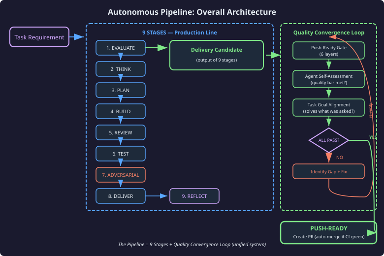
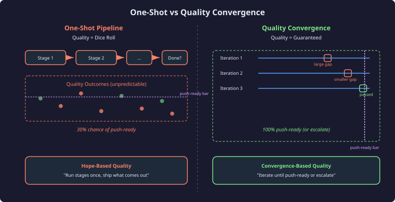
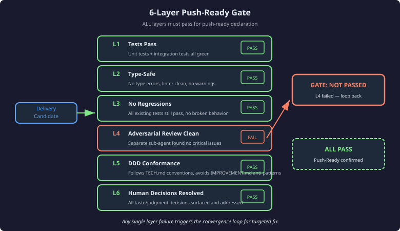
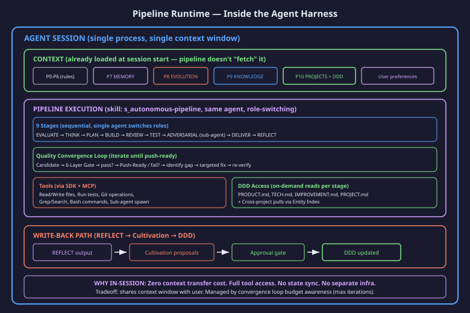

# Autonomous Pipeline — Coding as Black Box

---

## 1. Executive Summary

### Vision: Coding as Black Box

The Autonomous Pipeline transforms software delivery into a black-box operation. A user provides a requirement; the system delivers push-ready code. What happens between input and output is the pipeline's problem, not the user's.

This is not "AI writes code and hopes it works." It is a delivery system with a built-in quality guarantee: 9 sequential stages produce a delivery candidate, and a Quality Convergence Loop iterates on that candidate until it meets the push-ready standard — or escalates to a human with a precise gap report.

### Goal: Push-Ready Delivery

Every pipeline output is good enough to merge without human code review. Not "good enough for a draft PR." Not "mostly correct pending a few fixes." Push-ready means: create a PR, CI passes, auto-merge.

### Architecture in One Sentence

9 sequential stages produce a delivery candidate; the Quality Convergence Loop iterates until that candidate is push-ready.



The diagram above is the complete architecture. The 9 stages are the production line. The Quality Convergence Loop is the QA inspector. Together they form one system. There is no separation — the loop is not "an additional feature" bolted on after the stages. It is the mechanism that transforms a probabilistic output (one-shot) into a deterministic quality guarantee (converge or escalate).

---

## 2. The Problem

### "AI Can Code" Does Not Equal "AI Can Deliver"

The industry treats AI coding as solved because models can produce syntactically correct code that passes unit tests. This measures construction — the cheapest part of delivery.

Delivery requires correctness across integration boundaries, conformance to project conventions, safety against regressions, and resolution of architectural decisions. Construction alone guarantees none of these.

### The One-Shot Problem

Run 9 stages once. Hope the output is good enough. This is how most AI coding pipelines work — and it produces quality that is structurally unpredictable.

| Dimension | One-Shot Pipeline | Pipeline + Convergence |
|-----------|-------------------|----------------------|
| Quality certainty | Probabilistic (varies per run) | Deterministic (converge or escalate) |
| Failure detection | Post-delivery (user finds bugs) | Pre-delivery (gate catches gaps) |
| Failure response | Start over from scratch | Targeted fix of identified gap |
| Architecture safety | Hope-based | Adversarially verified |
| Confidence signal | "Tests pass" | 6-layer gate + self-assessment |

### No Quality Guarantee

Tests passing does not mean push-ready. The following are all true simultaneously in a "tests pass" state:

- State machine has unreachable transitions
- Error handling swallows failures silently
- Convention violations create maintenance debt
- Cross-boundary contracts are implicitly assumed, not verified
- Race conditions exist in paths no test exercises

### What Is Missing: Systematic Convergence

The gap is not in any individual stage. Each stage does its job. The gap is that running stages once is a gamble — sometimes the output is excellent, sometimes it has subtle defects that no individual stage catches because each stage only sees its own scope.

What is needed: a mechanism that evaluates the COMPLETE output against the COMPLETE quality standard, identifies specific gaps, fixes them precisely, and re-verifies until no gaps remain.



---

## 3. Overall Architecture

### The Pipeline = 9 Stages + Quality Convergence Loop

This is one system, not two. The 9 stages are the production line — they take a requirement and produce a delivery candidate. The Quality Convergence Loop is the quality inspector — it evaluates the candidate and either approves it or sends it back for targeted improvement.

### How They Connect

```
Requirement → [9 Stages] → Delivery Candidate → [Quality Convergence Loop] → Push-Ready
                                                         ↓
                                                   (or Escalate)
```

The 9 stages are linear and sequential. They run once to produce the initial candidate. The convergence loop then takes over:

1. **Evaluate candidate** against the Push-Ready Gate (6 layers), agent self-assessment, and task goal alignment
2. **If all three pass** — candidate is push-ready. Create PR with auto-merge.
3. **If any fail** — identify which specific layer/assessment failed, why, and what would fix it
4. **Apply targeted fix** — minimal, scoped change addressing only the identified gap
5. **Re-verify** — run the candidate through the same checks again
6. **Repeat** until convergence (all pass) or max iterations (escalate)

### Why This Architecture

One-shot delivery has a quality ceiling. No matter how good the individual stages are, running them once produces output whose quality is probabilistic — it depends on which patterns the model activates, what context is loaded, and how ambiguous the requirement was.

The convergence loop removes probability from the equation. The output is either push-ready (verified by 6 independent layers + self-assessment) or it is escalated with a precise report of what remains unresolved. There is no "ship and hope" state.

### Max Iterations and Escalation

The loop has a configurable maximum iteration count to prevent infinite cycling. When max iterations are exhausted without convergence:

- The system does NOT silently fail or ship a substandard output
- It escalates to a human with: (a) what still fails, (b) what was attempted, (c) why the gap persists
- The human either fixes the remaining gap manually or adjusts the requirement

This means the pipeline's failure mode is "ask for help with a clear problem statement" — never "silently ship broken code."

### Production Smoke

Before declaring push-ready, a final "production smoke" runs: the full test suite executes one more time in a clean state to ensure that no accumulated fix introduced a side effect. This is the last check before the PR is created.


---

## 4. The 9 Stages

### Purpose: Produce the Initial Delivery Candidate

The 9 stages form the production line. They are linear, sequential, and each builds on the output of the previous stage. Their job is to take a task requirement and produce the best possible first candidate — which the convergence loop then verifies and potentially improves.


### Stage Detail

| Stage | Purpose | DDD Input | Output | Decision Class |
|-------|---------|-----------|--------|----------------|
| 1. EVALUATE | Determine if task should proceed | PRODUCT.md | GO/DEFER/REJECT/ESCALATE | Judgment |
| 2. THINK | Research approach, consider alternatives | TECH.md, IMPROVEMENT.md | Chosen approach with rationale | Judgment |
| 3. PLAN | Specify what to build (SDD) | All DDD docs | Specification + test strategy | Taste |
| 4. BUILD | Implement via TDD red-green-refactor | TECH.md conventions | Working code + passing tests | Mechanical |
| 5. REVIEW | Self-check against PLAN specification | SDD from Stage 3 | Conformance report, fixes | Mechanical |
| 6. TEST | Integration testing, edge cases, QA | Test strategy from Stage 3 | Test results, coverage gaps | Mechanical |
| 7. ADVERSARIAL | Fresh-context sub-agent attack review | IMPROVEMENT.md anti-patterns | Issue list or clean bill | Mechanical |
| 8. DELIVER | Package as delivery candidate | All stage outputs | Delivery candidate + report | Mechanical |
| 9. REFLECT | Extract learnings for DDD cultivation | Execution trace | Cultivation proposals | Mechanical |

### Decision Classification

Each stage classifies its decisions into one of three categories:

- **Mechanical** — can be auto-approved (formatting, test execution, packaging)
- **Taste** — batched at the delivery gate for human review if desired (naming, approach style)
- **Judgment** — blocks execution until human decides (scope changes, risky architecture)

Stages 1 and 2 are judgment-heavy (should we build this? how?). Stages 4-9 are mostly mechanical (execute the plan). Stage 3 is taste-heavy (how should the spec look?).

### Stages Are Not Enough

Running these 9 stages produces a candidate that is likely correct but not guaranteed correct. The stages are individually sound but collectively incomplete — each stage only verifies its own scope. The integration of all stages into a push-ready whole is the convergence loop's job.

---

## 5. Adversarial Review

### Why It Is Mandatory

Adversarial review exists because the builder cannot find its own blind spots. The same context window that produced the code cannot objectively evaluate that code — it shares the same assumptions, the same mental model, the same happy-path bias.

The historical evidence is clear: code that passes 8 stages of self-review can still be fundamentally broken. Tests pass because they test the same assumptions the code makes. Types check because the interface was designed to match the implementation, not the other way around.

### How It Works

A separate sub-agent is spawned with:
- Fresh context (no builder bias carried over)
- The code changes (what was built)
- The DDD anti-pattern catalog (what to look for)
- The task requirement (what should have been built)

The sub-agent's only job is to find problems. It has no stake in the code being correct. It is adversarial by design — it succeeds when it finds issues, not when it approves code.

### What It Catches That Self-Review Cannot

| Category | Example | Why Builder Misses It |
|----------|---------|----------------------|
| State machine gaps | Missing error-to-recovery transition | Builder assumed happy path covers it |
| Cross-boundary errors | Module A sends format B does not expect | Each module tested in isolation |
| Happy-path assumptions | Edge case produces silent corruption | Tests only exercise common paths |
| Concurrency issues | Race between event handler and state update | Single-threaded mental model during build |
| Convention violations | Uses pattern marked as anti-pattern in IMPROVEMENT.md | Builder did not re-read DDD during build |
| Silent failures | Error caught, logged, but state left inconsistent | "It did not crash" treated as "it works" |

### Position in Architecture

Adversarial review occupies two positions simultaneously:

1. **Stage 7 of 9** — runs as part of the initial candidate production
2. **Layer 4 of the Push-Ready Gate** — re-runs during convergence loop if initial adversarial found issues that were supposedly fixed

This dual position means adversarial review runs at minimum once (Stage 7) and potentially multiple times (each convergence iteration that fails L4).


---

## 6. Quality Convergence Loop

### The QA Inspector

If the 9 stages are the production line that assembles the product, the Quality Convergence Loop is the inspector that verifies the assembled product meets the quality standard before it ships. Products that fail inspection go back for targeted rework — not back to the beginning of the line, but to the specific station that can fix the identified defect.

### Inspired by the Ralph Loop

The Ralph Loop pattern: iterate toward a goal, evaluating after each iteration, until the goal is met or you determine it cannot be met. This is not multi-session. This is not about persisting goals across days. This is about converging on quality within a single task execution.

### The 6-Layer Push-Ready Gate

The gate has 6 independent layers. ALL must pass for the candidate to be declared push-ready:



| Layer | What It Checks | How It Checks |
|-------|----------------|---------------|
| L1: Tests Pass | Unit + integration tests all green | Run full test suite |
| L2: Type-Safe | No type errors, linter clean | Run type checker + linter |
| L3: No Regressions | Existing tests still pass | Run pre-existing test suite |
| L4: Adversarial Clean | No critical issues found by fresh reviewer | Sub-agent review (or re-review) |
| L5: DDD Conformance | Follows TECH.md conventions, avoids IMPROVEMENT.md anti-patterns | Pattern matching against DDD docs |
| L6: Human Decisions Resolved | All taste/judgment decisions surfaced | Check decision log from stages |

### Convergence Behavior

Each iteration narrows the gap between the current candidate and the push-ready standard:

- Iteration 1: Candidate fails L4 (adversarial found state machine gap). Fix: add missing transition. Re-verify.
- Iteration 2: Candidate fails L3 (fix introduced regression in existing test). Fix: adjust implementation. Re-verify.
- Iteration 3: All layers pass. Agent self-assessment: satisfied. Goal alignment: requirement fully met. Declare push-ready.

The key property: fixes are TARGETED. The loop does not re-run all 9 stages. It identifies which specific layer failed, what specific issue caused the failure, and applies a minimal change to resolve that issue. Then it re-verifies the entire gate to ensure the fix did not introduce new failures.

### Exit Conditions

The loop exits when:

1. **All 6 gate layers pass** — no quality gap remains
2. **Agent self-assessment positive** — "I am satisfied with this delivery"
3. **Task goal alignment confirmed** — "This solves what was asked"

If all three are true: push-ready. Create PR.

### Why the Loop Itself Is NOT a Sub-Agent

A natural question: "Should the convergence loop be a separate sub-agent for objectivity?"

No. The division of labor is intentional:

| Component | Executor | Why |
|-----------|----------|-----|
| 9 Stages (build) | Main agent | Needs full task context |
| Adversarial Review (Stage 7 / Gate L4) | **Sub-agent** | Fresh context = catches builder blindspots |
| Convergence Loop (evaluate + iterate) | Main agent | Needs builder context to identify and fix gaps |

The convergence loop requires **builder knowledge** — only the builder knows what corners were cut, what trade-offs were made, and what the minimal fix is for a specific gap. A sub-agent evaluating convergence would lose this context and either repeat the adversarial review (redundant) or make uninformed fix attempts (wasteful).

The adversarial sub-agent provides the "fresh eyes." The convergence loop provides the "fix it precisely." Together they cover both detection (adversarial) and correction (convergence).

If the loop identifies that Layer 4 (adversarial) needs re-checking after a fix, it re-spawns the adversarial sub-agent — targeted at the specific fix, not the entire delivery.

### Failure Mode

If max iterations exhausted without convergence:

- **Do not ship** — quality standard not met
- **Escalate** — provide human with: remaining failures, attempted fixes, root cause hypothesis
- **Human decides** — fix manually, adjust requirement, or accept known limitation


---

## 7. DDD Integration

### Every Stage Reads Relevant DDD Context

The pipeline does not operate in a vacuum. Before each stage executes, it loads the relevant DDD documents to inform its decisions:

| Stage | DDD Docs Read | Why |
|-------|---------------|-----|
| EVALUATE | PRODUCT.md | Does this task align with product direction? |
| THINK | TECH.md, IMPROVEMENT.md | What patterns to follow? What to avoid? |
| PLAN | All four docs | Full context for specification |
| BUILD | TECH.md | Conventions, patterns, architecture rules |
| ADVERSARIAL | IMPROVEMENT.md | Known anti-patterns, previous mistakes |
| Gate L5 | TECH.md, IMPROVEMENT.md | Conformance check |

Without DDD, the pipeline operates blind — it might produce technically correct code that violates every convention the project has established. With DDD, it starts informed and delivers domain-correctly.

### REFLECT Writes Back: The Cultivation Cycle

Stage 9 (REFLECT) is where the pipeline feeds DDD. After delivery is complete, REFLECT examines the execution trace and proposes cultivation:

- New patterns discovered during BUILD that should be documented in TECH.md
- Anti-patterns encountered that should be added to IMPROVEMENT.md
- Convention violations that indicate a missing rule in TECH.md
- Architecture decisions that affect PRODUCT.md direction

This makes the pipeline DDD's richest feed channel (Channel 3 in the DDD framework). Every pipeline run that delivers successfully also proposes knowledge improvements — creating a compound growth cycle where the pipeline gets better at delivery because DDD gets richer, and DDD gets richer because the pipeline keeps delivering.

### Without DDD vs With DDD

| Aspect | Without DDD | With DDD |
|--------|-------------|----------|
| Convention adherence | Random (depends on model training) | Enforced (read before building) |
| Mistake repetition | Repeats same errors across runs | Learns from previous mistakes via IMPROVEMENT.md |
| Architecture alignment | Drifts with each delivery | Stays aligned via PRODUCT.md + TECH.md |
| Knowledge accumulation | Zero (each run starts fresh) | Compound (each run adds knowledge) |


---

## 8. Critical Design Decisions

### Single-Agent with Role-Switching over Multi-Agent Orchestration

The pipeline uses one agent that switches roles (builder, reviewer, adversary) rather than multiple independent agents communicating through messages. This eliminates coordination overhead, context synchronization issues, and the "telephone game" of information loss between agents.

Role-switching preserves the full execution context while changing the evaluation lens. The adversarial role has fresh context not because it is a different agent, but because it is invoked as a sub-agent without the builder's accumulated assumptions.

### DDD/SDD/TDD Trilogy

Three methodologies serve distinct purposes:

| Methodology | Question It Answers | When Applied |
|-------------|--------------------|----|
| DDD (Domain-Driven Design) | Should we? How does this fit? | Stages 1-3 (judgment and taste) |
| SDD (Specification-Driven Design) | What exactly? | Stage 3 output, verified in Stage 5 |
| TDD (Test-Driven Development) | Did we? Does it work? | Stage 4 (red-green-refactor) |

DDD provides judgment. SDD provides specification. TDD provides verification. Together they cover the full delivery lifecycle: decide, specify, verify.

### Quality Convergence over One-Shot Perfection

The architecture explicitly accepts that one pass may not produce perfection. This is a feature, not a limitation. Instead of demanding that 9 stages produce flawless output every time (impossible with non-deterministic models), the architecture demands convergence toward flawless output through iteration.

This shifts the quality contract from "try really hard once" to "iterate until verified" — a fundamentally stronger guarantee.

### Adversarial Review Is Mandatory, Not Optional

There is no configuration flag to skip adversarial review. It is baked into both the stage sequence (Stage 7) and the push-ready gate (Layer 4). Skipping it requires using an escape hatch, which carries explicit burden of proof.

### Decision Classification

Every decision produced during pipeline execution is classified:

| Classification | Auto-approve? | When Reviewed | Example |
|---------------|---------------|---------------|---------|
| Mechanical | Yes | Never (unless failed) | "Run tests", "Format code" |
| Taste | Batched | At delivery gate | "Name this variable X vs Y" |
| Judgment | Blocks | Immediately | "Should we refactor module Z?" |

This ensures the pipeline can run autonomously for mechanical work (most of delivery) while still surfacing the decisions that require human input.

### Push-Ready via PR, Not Direct Push

The pipeline creates a Pull Request with auto-merge enabled — it does not push directly to main. This provides:

- CI as an independent verification layer (outside the pipeline)
- A visible record of what was delivered and why
- A rollback point if post-merge issues are discovered
- An opportunity for human spot-check if desired (though not required)

---

## 9. Escape Hatches and Failure Modes

### When the Full Pipeline Is Overkill

Not every change needs 9 stages plus convergence. The architecture provides escape hatches for legitimate cases — but the burden of proof is on escaping, not on using the pipeline.

| Escape Hatch | When Valid | What Runs | What Is Skipped |
|-------------|-----------|-----------|-----------------|
| Direct Mode | 1-file fix, config change, typo correction | BUILD + basic verification | All planning stages, adversarial, convergence loop |
| TDD-Only | Extending existing well-documented pattern | BUILD + TEST + basic gate | EVALUATE, THINK, PLAN (pattern already planned) |
| P0 Urgent | Production is down, needs immediate fix | Direct fix first, full pipeline follow-up mandatory | Everything initially, nothing ultimately |

### Rules for Escape Hatches

1. Direct mode changes must be genuinely trivial — if the change touches logic, it is not trivial
2. TDD-only requires an existing, documented pattern — if the pattern is novel, full pipeline
3. P0 urgent gets the fix out fast but creates a mandatory follow-up pipeline run to verify and improve
4. Every escape hatch use is logged for REFLECT to evaluate — overuse triggers a process review

### Failure Modes and Recovery

| Failure | What Happens | Recovery |
|---------|-------------|----------|
| Convergence loop does not converge | Max iterations reached | Escalate to human with gap report |
| Adversarial sub-agent produces false positives | Human reviews adversarial findings | Override specific finding, document why |
| Stage 1 EVALUATE rejects valid work | Human overrides with rationale | EVALUATE criteria adjusted in DDD |
| DDD documents are wrong or outdated | Pipeline follows bad guidance | REFLECT proposes correction; human approves |
| Test suite itself is flawed | Gate L1/L3 pass but quality is low | Adversarial (L4) catches what tests miss |

### The Key Principle

The pipeline's failure mode is always "surface the problem clearly" — never "hide the problem and ship anyway." Every failure path terminates at either "fixed and verified" or "escalated with clear explanation." There is no path that leads to "shipped despite known issues."

---

## 10. Harness Integration — Where the Pipeline Runs

The Autonomous Pipeline is not a standalone service. It executes within an existing agent harness that provides context management, tool access, and knowledge infrastructure.



### Runtime Model

The pipeline runs as a **skill invocation** within a single agent session. There is no separate process, no orchestration service, no message queue. The same agent that talks to the user switches roles through the 9 stages — builder at BUILD, reviewer at REVIEW, adversary at ADVERSARIAL (spawned as sub-agent for fresh context).

| Component | Provided By | Pipeline's Use |
|-----------|-------------|----------------|
| Context (system prompt) | 11-file context system (P0-P10) | Pipeline reads behavioral rules, DDD, user preferences |
| Tool access | Claude Agent SDK + MCP servers | BUILD uses code tools; TEST runs pytest; REVIEW reads files |
| DDD knowledge | Context loader + on-demand pulls | Every stage reads relevant DDD sections (see Section 7) |
| Memory | MEMORY.md (P7) | Pipeline reads past corrections to avoid repeating mistakes |
| Self-evolution | EVOLUTION.md (P8) | Corrections captured during pipeline inform future runs |
| Skill system | Skill projection layer | Pipeline itself is a skill (`s_autonomous-pipeline`) |

### How Pipeline Stages Access Context

At pipeline start, the agent's full context is already loaded (system prompt assembled from 11 files). Pipeline stages don't need to "fetch" context — it's already there. DDD on-demand pulls (Section 7) use the same Read tool mechanism the agent uses for any file access.

### How REFLECT Writes Back

REFLECT does not write directly to files. It generates **cultivation proposals** that flow through the DDD approval gate (see DDD Cultivation Engine companion doc). The write path:

```
REFLECT output → structured lessons → cultivation proposals → approval queue
  → user approves (30s) → DDD updated → next pipeline run reads richer context
```

This ensures pipeline outputs never silently modify authoritative knowledge.

### Why Not a Separate Service?

A pipeline-as-service architecture would require:
- Context transfer between agent and service (expensive, lossy)
- Separate auth and tool access (complexity)
- State synchronization for DDD reads/writes (race conditions)
- Deployment and scaling infrastructure (operational cost)

Running within the agent session eliminates all of these. The tradeoff: pipeline execution competes with the user's context window. The Quality Convergence Loop's budget awareness (max iterations) prevents this from becoming a problem.

---

## 11. Success Metrics

### What Push-Ready Delivery Looks Like

The pipeline succeeds when its outputs consistently meet the push-ready standard without requiring human intervention on mechanical or taste decisions.

### Before vs After

| Metric | Without Pipeline | With Pipeline |
|--------|-----------------|---------------|
| PR merge confidence | Requires human review to trust | Trusted by default (gate-verified) |
| Bug introduction rate | Discovered post-merge | Caught pre-merge by convergence loop |
| Convention adherence | Inconsistent across PRs | Uniform (DDD-enforced) |
| Delivery time variance | High (depends on task complexity estimation) | Predictable (stages + convergence iterations) |
| Knowledge capture | Zero (human reviewer's brain only) | Systematic (REFLECT + DDD cultivation) |
| Post-merge fixes needed | Common (code review catches things) | Rare (adversarial catches them pre-merge) |
| Human time per delivery | Full code review required | Spot-check optional, not required |

### Key Properties to Track

| Property | Target State | Measurement |
|----------|-------------|-------------|
| First-pass rate | >70% of candidates pass gate on first check | Convergence iterations / total runs |
| Convergence iterations | Average <2 iterations when loop activates | Iteration count distribution |
| False escalation rate | <10% of escalations are non-issues | Human override rate on escalations |
| Adversarial accuracy | >90% of adversarial findings are valid | Human agreement with adversarial findings |
| DDD cultivation rate | >1 cultivation proposal per 5 pipeline runs | REFLECT output frequency |
| CI pass rate post-merge | >99% of pipeline PRs pass CI | CI failure rate on auto-merged PRs |
| Regression introduction | 0 regressions reach main branch | Gate L3 catch rate |

### What Success Means

When the pipeline works correctly, the experience is:

1. User states requirement in one sentence
2. Time passes (pipeline runs — the "black box")
3. PR appears, CI green, auto-merged
4. Code is correct, conformant, tested, adversarially reviewed, and documented

The user never reviews code. Never runs tests manually. Never checks for regressions. Never verifies convention adherence. The pipeline handles all of it — and the Quality Convergence Loop guarantees it, or clearly explains why it could not.

This is Coding as Black Box.

---

## 11. Pipeline v2 Extensions (2026-05-14)

Two extensions evolved from competitive analysis (MeshClaw autonomous execution patterns) and PE-reviewed design. Both maintain architectural consistency with the core pipeline while extending its applicability.

### 11.1 Independent AC Verification (DELIVER Enhancement)

**Problem:** The Completion Audit (Section 4, DELIVER stage) relies on the builder's self-reported evidence that tests cover acceptance criteria. This is the same cognitive bias that adversarial review addresses for code — but applied to the AC→test mapping specifically.

**Evidence:** C011 — Voice Conversation Mode passed all 9 stages with 10/10 confidence and 57 green tests. Feature was 100% non-functional. The builder claimed tests verified the spec; independent verification would have caught that the tests verified individual units, not spec satisfaction.

**Solution:** Step 2.5 inserted between Completion Audit Step 2 (CHECKLIST) and Step 3 (INSPECT). The verifier independently re-reads each test body and judges whether it actually exercises the AC's behavior, then traces one level downstream to check E2E connection.

**Position in architecture:**
```
Completion Audit Step 2 (builder claims evidence)
  → Step 2.5: AC Verification (verifier independently confirms)
    → If gaps found: fix before adversarial
  → Step 3: INSPECT
  → Adversarial Review (fresh-context attack on full changeset)
```

**Relationship to Adversarial Review:** AC Verification is a cheaper, targeted pre-flight. Adversarial review is broader (checks all code quality aspects). Verification catches the specific case where "test exists but doesn't verify what it claims to verify." Adversarial catches everything else.

**Confidence scoring change:**
- `ac_verification.status == "verified"` → +3 (independently confirmed)
- `ac_verification.status == "claimed"` → +1 (tests exist, not verified)
- `ac_verification.status == "failed"` → -3 (verified wrong)
- No field present → backward-compatible +3 (legacy runs)

### 11.2 Goal Loop Profile

**Problem:** The pipeline excels at bounded deliverables ("build feature X") but cannot handle open-ended improvement goals ("get coverage to 90%", "migrate all callers off deprecated API"). These require iterative execution with measurable progress tracking and DoD-driven exit.

**Solution:** New profile `goal = [evaluate, plan, goal_cycle]` where `goal_cycle` is a looping stage that executes BUILD+TEST cycles until DoD criteria are met.

**How it fits the existing architecture:**

| Dimension | One-Shot Pipeline (full/bugfix/trivial) | Goal Loop (goal) |
|-----------|------------------------------------------|------------------|
| Scope | Bounded (defined deliverable) | Open-ended (metric target) |
| Execution | 9 stages, once | EVAL+PLAN once, then cycle loop |
| Quality per-change | Full 6-layer gate | Per-cycle TEST + periodic REVIEW |
| Final quality | Quality Convergence Loop | Final ADVERSARIAL on total diff |
| Exit condition | Push-ready or escalate | DoD met or max cycles or stuck |
| DDD feedback | REFLECT once at end | Mini-reflect per cycle + full at end |
| Profiles | full, trivial, research, docs, bugfix | goal |

**Goal Loop internals:**
```
EVALUATE (once) → PLAN (once) → GOAL_CYCLE (loops):
  Each cycle:
    1. Budget gate (< 150K → checkpoint)
    2. DoD check (all pass → Final Gate → SUCCESS)
    3. Stuck detection (3× zero progress → STOP)
    4. Read progress → Pick step → Execute (TDD) → Test
    5. Regression protocol (fix→retry→revert→checkpoint)
    6. Update progress + mini-reflect
    7. Periodic REVIEW gate (every N cycles)
    8. Loop back to 1
```

**DoD types:** `command` (shell exit code, machine-verifiable) preferred over `rubric` (LLM with explicit criteria, subjective but bounded). Goals where >50% criteria are vague rubrics are rejected at EVALUATE.

**Two execution modes:**
- **Inline** (same session): full context continuity, budget-bounded (~10 cycles)
- **Scheduled** (job system): each execution = 1 cycle, progress file carries state, cron-driven

**5 exit conditions:**
1. SUCCESS — DoD met + final adversarial clean
2. CHECKPOINT — max cycles reached
3. STOP — 3 consecutive zero-progress cycles
4. REVERT_LIMIT — 2 consecutive reverts (structural conflict)
5. BUDGET — remaining tokens < 150K

**Architectural consistency:**
- Same TDD discipline per cycle as BUILD stage
- Same adversarial review at completion as Stage 7
- Same REFLECT → DDD cultivation at completion
- Same decision classification (mechanical/taste/judgment)
- Same artifact system for progress tracking
- Existing profiles completely unaffected (backward compatible)

**Design doc:** `Knowledge/Designs/2026-05-14-pipeline-v2-consolidated-upgrade.md`
**Source implementation:** `backend/skills/s_autonomous-pipeline/stages/goal_cycle.md` (346 lines)
