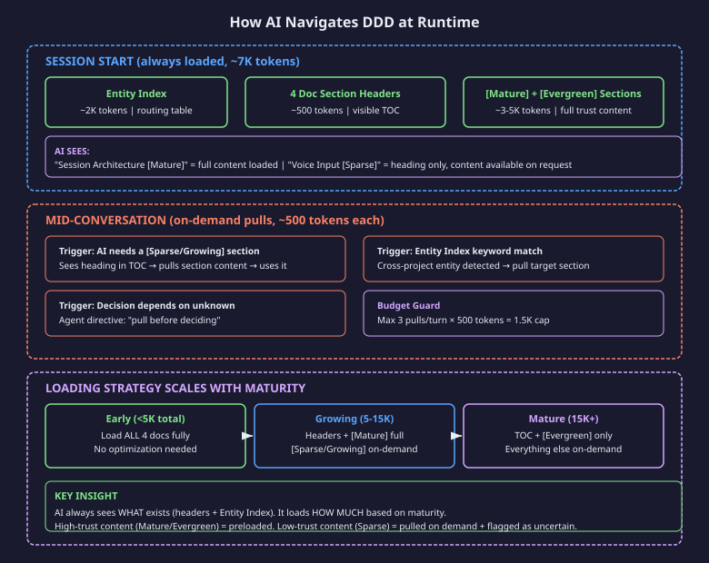
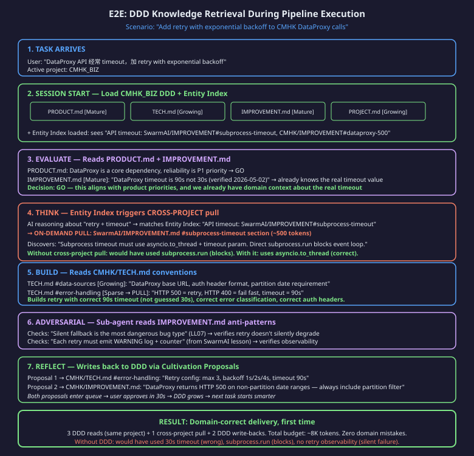
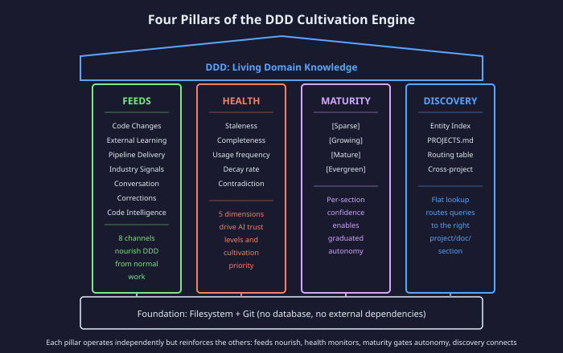
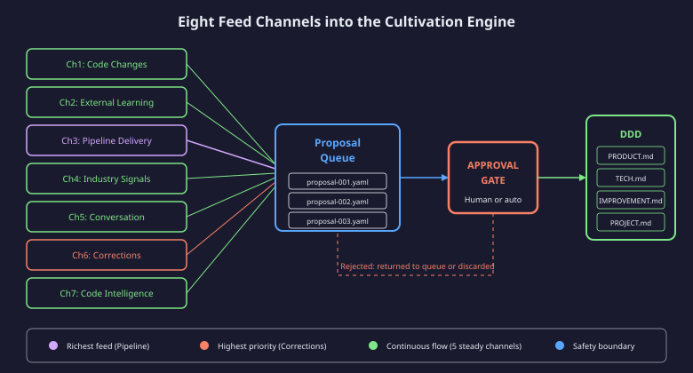
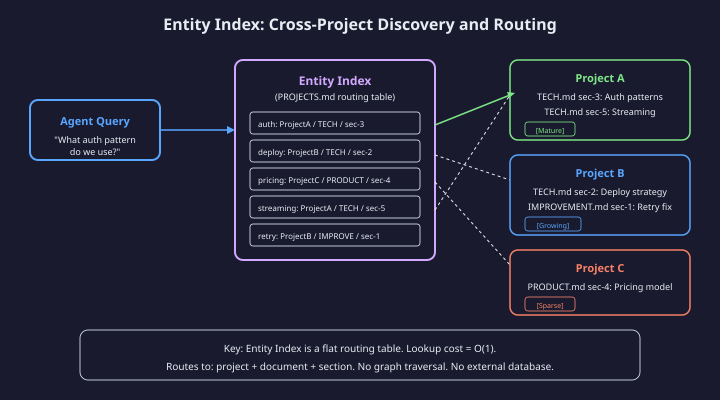
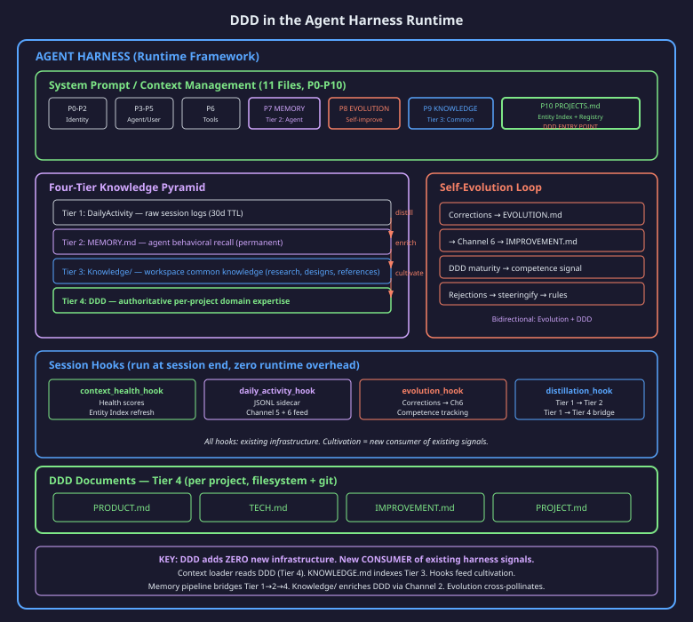
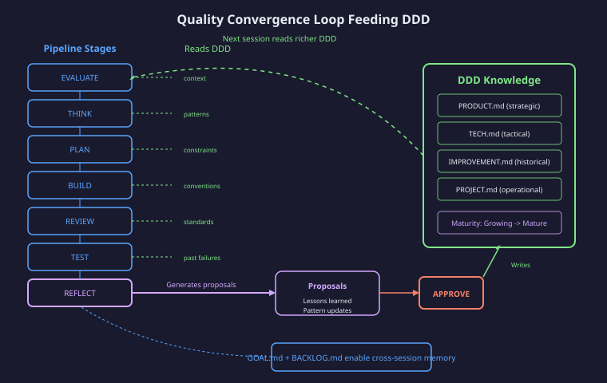
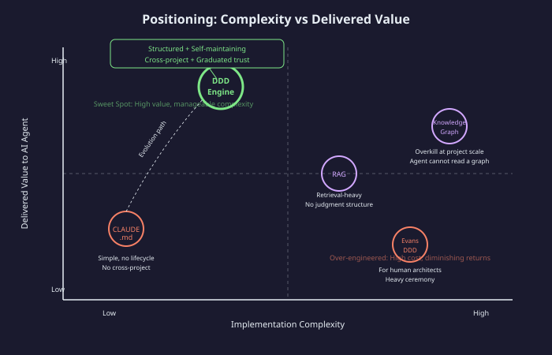

# DDD Cultivation Engine

## Domain Expertise as Infrastructure

---

## 1. Executive Summary

**Vision:** Domain Expertise as Infrastructure.

**Goal:** Every AI session starts as a domain expert — rules, history, conventions, failures — delivering domain-correct output from turn one.

**One sentence:** DDD Cultivation Engine makes AI project knowledge self-growing, transforming smart generalists into domain experts through structured, health-monitored, living knowledge that compounds from normal work.

The DDD Cultivation Engine is a three-layer architecture that solves the fundamental problem of AI-assisted development: agents are brilliant generalists but domain-ignorant. Rather than treating project knowledge as static documentation that decays, the engine treats it as living infrastructure — structured for AI consumption, continuously cultivated by the same work it enables, and health-monitored to maintain trust.

**This document covers:** The architectural design, critical decisions, data flows, quality mechanisms, and positioning of the DDD Cultivation Engine. It is a solution showcase for principal engineers evaluating architectural soundness — not an implementation specification.

---

## 2. The Problem and Design Goals

### AI Is Smart but Doesn't Know Your Project

Every new session, AI starts from zero. It doesn't know your naming conventions, why you picked Postgres over DynamoDB, what you tried last month that failed, or that the billing module requires approval before any change. It produces code that looks correct but violates your team's rules — a pattern you abandoned gets reintroduced, a feature contradicts strategic direction. Technically right, domain-wrong.

### Documentation Dies Because Nobody Maintains It

You write docs. Code changes. Docs don't update. Nobody trusts them. Nobody reads them. Nobody updates them. Vicious cycle. The economics are fatal: maintenance cost always exceeds perceived benefit.

### Knowledge Is Trapped Per-Project

Project A discovers that a specific API needs retry with exponential backoff. Project B hits the same API three months later and rediscovers the same lesson from scratch. The knowledge existed — but nothing routes it across projects.


### Design Goals

| # | Goal | Constraint |
|---|------|-----------|
| 1 | Domain-correct AI output from turn one | Must load in under 5K tokens |
| 2 | Zero-cost maintenance for humans | Cultivation from normal work only |
| 3 | Cross-project knowledge discovery | Without external databases |
| 4 | Graduated trust based on evidence | Health scores drive autonomy |
| 5 | Safety-first knowledge evolution | Propose-approve, never silent write |

---

## 3. Architecture: 3-Layer Stack


### Layer 1: Interface (4 Documents)

The Interface Layer is what the AI agent reads at the start of every session. It consists of exactly four markdown documents per project, each serving a distinct judgment axis:

| Document | Judgment Axis | Answers |
|----------|---------------|---------|
| PRODUCT.md | Strategic | What are we building and why? What is in scope? |
| TECH.md | Tactical | How do we build it? What patterns, constraints, conventions? |
| IMPROVEMENT.md | Historical | What did we try, learn, fix? What should never be repeated? |
| PROJECT.md | Operational | What is the current state? Who owns what? |

**Why exactly four?** Every autonomous decision an AI agent makes falls along one of four axes: *should* we do this (strategic), *how* should we do this (tactical), *what went wrong before* (historical), and *what is the current state* (operational). Fewer documents conflate concerns; more documents exceed context budgets.

The four documents together typically occupy 3-5K tokens — small enough to load entirely, large enough to carry genuine domain expertise.

### Layer 2: Intelligence (What Keeps Docs Alive)

Without Layer 2, the four documents would follow the same decay trajectory as any documentation. The Intelligence Layer provides three mechanisms that prevent decay:

**Code Graph** — Maps relationships between documented knowledge and actual code. Detects drift (documented pattern no longer used), identifies blast radius (which sections are affected by a code change), and flags contradictions (doc says X, code does Y).

**Health Scores** — Five-dimensional scoring that quantifies document quality at the section level. A healthy section is actively used by agents, recently validated, complete relative to its scope, consistent with code, and not contradicted by other sections.

**Maturity Tracking** — Per-section confidence levels that gate AI autonomy. A [Sparse] section means "ask before using this as a decision basis." An [Evergreen] section means "act with full confidence."

### Layer 3: Orchestration (What Makes It Self-Sustaining)

Layer 3 closes the loop — it is the mechanism by which knowledge grows without human effort.

**Cultivation Engine** — Receives signals from 8 feed channels, generates proposals for DDD changes, routes them through an approval gate, and applies approved changes to the correct document and section.

**Entity Index** — A flat routing table (stored in PROJECTS.md) that maps domain concepts to specific project/document/section triples. Enables cross-project discovery without a graph database.

**Pipeline Integration** — The autonomous pipeline is DDD's richest feed channel. Each pipeline run's REFLECT stage extracts lessons and proposes updates to IMPROVEMENT.md and TECH.md, compounding knowledge with every delivery.

### Why "Just 4 Markdown Files" Would Die Without Layers 2 and 3

The interface layer alone is documentation — and documentation decays. Layer 2 (Intelligence) detects when decay begins. Layer 3 (Orchestration) reverses it automatically. Together they create a flywheel: the more the system is used, the more signals feed cultivation, the richer the DDD becomes, the more value the system delivers — which increases usage. The flywheel accelerates rather than decays.

---

## 4. Critical Design Decisions

### Decision Summary

| ID | Decision | Rationale |
|----|----------|-----------|
| D1 | DDD serves judgment AND delivery | Knowledge that cannot drive action is documentation, not infrastructure |
| D2 | Reuse proven memory extraction pipeline | Zero new LLM cost; existing DailyActivity extraction is battle-tested |
| D3 | Propose, never silently write | Safety gate prevents compounding errors into authoritative knowledge |
| D4 | Entity Index is routing table, not graph | Flat lookup is readable, grep-able, and agent-loadable |
| D5 | Health drives AI trust, not human action | Humans should not manage AI confidence levels manually |
| D6 | Four-tier knowledge pyramid | DailyActivity (raw) -> MEMORY (agent) -> Knowledge (common) -> DDD (project-authoritative) |
| D7 | Progressive on-demand loading | Section-level precision avoids context window waste |
| D8 | Pipeline delivery is DDD's richest feed | Every REFLECT produces structured lessons → cultivation proposals |

### D1: DDD for Judgment AND Domain-Correct Delivery

**Statement:** The DDD system is not documentation infrastructure. It is decision infrastructure that happens to be stored as documents.

**Rationale:** An AI agent reading TECH.md does not need a reference manual — it needs enough structured context to make correct autonomous decisions. Every section in a DDD document should either enable a judgment call or prevent a known mistake.

**Architectural Impact:** Document structure is optimized for decision-making, not comprehensiveness. Sections are titled as questions ("What auth pattern do we use?") rather than topics ("Authentication").

### D2: Reuse Proven Memory Extraction Pipeline

**Statement:** Cultivation feeds reuse the existing DailyActivity extraction pipeline rather than building novel signal processing.

**Rationale:** The memory extraction pipeline is already battle-tested across hundreds of sessions. It handles deduplication, relevance scoring, and format normalization. Building a parallel system would double maintenance cost for marginal improvement.

**Architectural Impact:** The cultivation engine is a *consumer* of existing signals, not a *producer* of new extraction logic. This constrains feed channel design but dramatically reduces implementation risk.

### D3: Propose, Never Silently Write

**Statement:** No automated process may modify DDD documents without passing through an approval gate.

**Rationale:** DDD documents carry authoritative weight — agents trust them for autonomous decisions. A single incorrect write that goes unreviewed could compound into multiple wrong decisions across multiple sessions before detection.

**Architectural Impact:** All cultivation flows through a proposal queue with explicit approval (human review or auto-approval based on maturity level and change magnitude). This introduces latency but guarantees trust.

### D4: Entity Index Is Routing Table, Not Knowledge Graph

**Statement:** Cross-project discovery uses a flat lookup table with O(1) access cost, not a graph database with traversal semantics.

**Rationale:** Agents consume text, not graph queries. A routing table is grep-able, fits in context, and requires no external runtime. A knowledge graph would require a query language, a runtime process, and would produce results the agent cannot directly reason about.

**Architectural Impact:** Discovery is bounded to "find the right section" rather than "traverse relationships." This limits expressiveness but matches the actual need: routing queries to authoritative answers.

### D5: Health Drives AI Trust, Not Human Action

**Statement:** Health scores determine how much autonomy the AI exercises when using a DDD section. They do not generate tasks for humans to fix.

**Rationale:** If health scores created human work, the system would be adding maintenance burden — the exact problem it aims to solve. Instead, low health scores cause the agent to request confirmation before acting on uncertain knowledge, and signal the cultivation engine to prioritize updates for that section.

**Architectural Impact:** Health is consumed by the agent runtime (as trust levels) and by the orchestration layer (as cultivation priority), never as human task generation.

### D6: Four-Tier Knowledge Pyramid

**Statement:** Knowledge flows upward through four tiers of increasing authority and specificity:

| Tier | Storage | Scope | Purpose |
|------|---------|-------|---------|
| 1 | DailyActivity | Session | Raw session logs — what happened today (30d TTL) |
| 2 | MEMORY.md | Agent | Agent behavioral recall — how I work, what I remember |
| 3 | Knowledge/ | Workspace | Common knowledge — research, references, designs, reports (shared across projects) |
| 4 | DDD (4 docs) | Project | Authoritative domain expertise — judgment + delivery rules per project |

**Rationale:** Not every insight deserves project-level authority. The pyramid provides progressive refinement — raw signals get filtered into agent memory, workspace-wide learnings accumulate in Knowledge/, and only project-specific patterns that prove stable get promoted to DDD. Knowledge/ fills the gap between "what the agent remembers" (MEMORY) and "what a specific project needs" (DDD) — it holds research, industry analysis, and cross-cutting references that any project can draw from.

**Architectural Impact:** Cultivation reads from Tier 2 (MEMORY, already curated) and Tier 3 (Knowledge/, research-grade). Channel 2 (External Learning) sources from Knowledge/Learned/. The Entity Index can route to Knowledge/ files when no project-specific section exists yet — acting as a stepping stone before content is promoted to project DDD.

### D7: Progressive On-Demand Loading

**Statement:** DDD loading scales with maturity — early projects load fully, mature projects load section-level on demand. AI always sees the complete structure (headings) and loads content based on trust level and immediate need.

**Rationale:** Early projects are small enough to load entirely (~5K). But DDD grows unboundedly — a mature project might have 30K+ tokens. Loading everything always would compete with task execution for context budget. Progressive loading means DDD scales without context pressure.

**Architectural Impact:** Every DDD section has a stable identifier, a maturity annotation (visible in the heading), and self-contained content (no forward references). The agent always sees WHAT exists; it fetches HOW MUCH based on maturity and need. (See Section 5 for full loading strategy.)

### D8: Pipeline Delivery Is DDD's Richest Feed

**Statement:** The autonomous pipeline's REFLECT stage is the single highest-value source of DDD cultivation proposals.

**Rationale:** Pipeline runs produce structured lessons with full context: what was attempted, what worked, what failed, and why. This is higher-signal than conversation extraction or commit analysis because the pipeline has already isolated the causal chain.

**Architectural Impact:** Channel 3 (Pipeline Delivery) is prioritized above other channels for cultivation proposals. Every pipeline run enriches IMPROVEMENT.md (lessons, anti-patterns) and TECH.md (new patterns, convention updates).

---

## 5. How AI Navigates DDD at Runtime

The core challenge: DDD must give the AI **full domain understanding** while staying within a practical context budget. The solution is progressive loading — AI always knows *what exists* (structure), and loads *full content* based on trust level and immediate need.



### Phase 1: Session Start (Always Loaded)

Every session begins with the AI knowing the complete *shape* of project knowledge:

| Component | Tokens | What AI Gets |
|-----------|--------|-------------|
| Entity Index | ~2K | Cross-project routing table — "what concepts exist where" |
| 4 doc section headers | ~500 | Full TOC of all DDD docs — "what sections exist" |
| [Mature] + [Evergreen] sections | ~3-5K | High-trust content loaded in full — "what I can use without asking" |
| **Total at session start** | **~5-7K** | — |

The AI sees every section heading. High-maturity sections are loaded with full content. Low-maturity sections show their heading but not their content — the AI knows they exist and can request them.

### Phase 2: On-Demand Pulls (Mid-Conversation)

Three triggers cause the AI to pull additional DDD content:

| Trigger | Example | What Happens |
|---------|---------|-------------|
| **Needs a [Sparse/Growing] section** | AI about to make architecture decision, sees "Voice Input [Sparse]" heading | Pulls that section (~500 tokens), uses it with uncertainty annotation |
| **Entity Index keyword match** | User mentions "timeout handling", Entity Index routes to CMHK/IMPROVEMENT#dataproxy | Pulls cross-project section (~500 tokens) |
| **Decision depends on unknown** | Agent directive: "Before relying on a section you haven't read, pull it" | Explicit pull before committing to a decision |

**Budget guard:** Max 3 pulls per turn × ~500 tokens = 1.5K additional. Never unbounded.

### Phase 3: Strategy Scales with DDD Maturity

The loading strategy adapts as DDD grows:

| DDD Size | Strategy | Rationale |
|----------|----------|-----------|
| Early (<5K total) | Load all 4 docs fully | Small enough, no optimization needed |
| Growing (5-15K) | Headers + [Mature/Evergreen] fully, rest on-demand | Balance coverage vs budget |
| Mature (15K+) | TOC + [Evergreen] only, everything else on-demand | Precision loading, maximum budget efficiency |

### How AI Knows "There's More to Fetch"

This is the critical UX question — an AI that doesn't know it's missing context will confidently make wrong decisions. Three mechanisms ensure awareness:

1. **Visible TOC** — Every section heading is always loaded. AI sees `### Voice Input [Sparse]` but no content below it. The heading IS the signal that content is available.

2. **Maturity annotations** — `[Mature]` = loaded and trustworthy. `[Sparse]` = heading only, pull before relying. `[Growing]` = partially loaded, verify if critical. The annotation is both a trust signal and a loading indicator.

3. **Agent directive** — The system prompt includes: "When a decision depends on a DDD section you see as heading-only, pull it before proceeding. Never infer from a heading what the content says."

### Why Not Just Load Everything?

For a 1M token context window, why bother with progressive loading?

Because DDD grows unboundedly per project. A mature project might have 30K tokens of IMPROVEMENT.md alone (50+ lessons). Loading 4 projects × 30K = 120K tokens of DDD before any work begins wastes budget that's better spent on actual task context (code, test output, error messages).

Progressive loading means DDD scales to any size without competing with task execution for context budget. The AI gets what it needs, when it needs it, at the precision it needs it.

### E2E Example: DDD Retrieval During a Real Pipeline Run

To make this concrete, here is a real task flowing through the pipeline with DDD retrieval at each stage. The scenario: user asks to add retry with exponential backoff to the CMHK DataProxy API. Two DDD projects exist: **CMHK_BIZ** (active) and **SwarmAI** (has relevant cross-project knowledge).



**Walkthrough:** The user says "DataProxy keeps timing out, add retry." The pipeline detects CMHK_BIZ as the active project and loads its 4 DDD docs. At EVALUATE, it reads PRODUCT.md — reliability is a top priority, so the task is a GO. It also finds in IMPROVEMENT.md that the real timeout is 90s (not the commonly assumed 30s) — the first domain-correct decision without asking the user.

At THINK, the agent reasons about "retry + timeout" and the Entity Index fires: it routes to SwarmAI/IMPROVEMENT.md#subprocess-timeout, a different project entirely. The agent pulls that section (~500 tokens) and discovers that async timeout handling requires `asyncio.to_thread` — a lesson SwarmAI learned months ago that CMHK would have rediscovered the hard way.

During BUILD, it pulls a [Sparse] section from CMHK/TECH.md to get the exact error classification rules. The adversarial sub-agent then checks the result against known anti-patterns — specifically "silent fallback is the most dangerous bug type" — and verifies the retry implementation has proper observability.

Finally, REFLECT proposes two updates back to CMHK's DDD: the retry configuration goes into TECH.md, and a new pitfall (DataProxy returns 500 on non-partition date ranges) goes into IMPROVEMENT.md. User approves in 30 seconds. Next time anyone works on CMHK DataProxy, this knowledge is already there.

**Step-by-step:**

| Step | Pipeline Stage | DDD Action | What AI Learns |
|------|---------------|-----------|----------------|
| 1 | Task arrives | Detect active project: CMHK_BIZ | — |
| 2 | Session start | Load CMHK DDD (4 docs) + Entity Index | Full project context + cross-project routing |
| 3 | EVALUATE | Read PRODUCT.md + IMPROVEMENT.md | "DataProxy reliability is P1" + "Real timeout is 90s not 30s" |
| 4 | THINK | **Cross-project pull** triggered by Entity Index: "API timeout" → SwarmAI/IMPROVEMENT#subprocess-timeout | "Must use asyncio.to_thread, not subprocess.run" (lesson from SwarmAI) |
| 5 | BUILD | Read CMHK/TECH.md#data-sources + pull TECH.md#error-handling [Sparse] | Correct auth headers, correct error classification |
| 6 | ADVERSARIAL | Read IMPROVEMENT.md anti-patterns | Verifies no silent fallback (LL07), verifies retry has observability |
| 7 | REFLECT | Write 2 proposals back to CMHK DDD | New retry config → TECH.md, new pitfall → IMPROVEMENT.md |

**What DDD prevented (without it, all three would have shipped):**
- ✗ 30s timeout (wrong — real value is 90s, learned from CMHK/IMPROVEMENT.md)
- ✗ subprocess.run blocking event loop (wrong — learned from SwarmAI cross-project pull)
- ✗ Silent retry degradation (wrong — caught by adversarial reading anti-patterns)

**Budget cost:** ~8K tokens for all DDD operations across the entire pipeline run. On a 1M context window, that's < 1%.

---

## 6. Four Pillars



### Pillar 1: Feeds

Eight channels nourish DDD from the natural flow of work. No channel requires dedicated human effort — each captures signals from activities that would happen regardless.



| Channel | Source | Signal Type | Target Doc |
|---------|--------|-------------|-----------|
| Code Changes | Git commits, PRs | Architecture drift, new patterns | TECH.md |
| External Learning | Research sessions, articles | New capabilities, approaches | PRODUCT.md, TECH.md |
| Pipeline Delivery | REFLECT stage output | Lessons, failures, refinements | IMPROVEMENT.md |
| Industry Signals | Feeds, trend analysis | Strategic context shifts | PRODUCT.md |
| Conversation | Session corrections | Implicit domain rules | TECH.md |
| Corrections | Explicit "no, do X" | High-priority rule updates | Any |
| Code Intelligence | Static analysis, graph | Structural truth | TECH.md |

**Channel priority:** Corrections (Ch6) have highest priority because they represent explicit human judgment. Pipeline Delivery (Ch3) is the richest feed because REFLECT stage output is already structured and contextualized.

### Pillar 2: Health

Health scoring operates at section level across five dimensions. The composite score determines two things: how much the agent trusts that section, and how urgently the cultivation engine should seek updates.

| Dimension | Measures | Low Score Means |
|-----------|----------|-----------------|
| Staleness | Time since last validated update | Knowledge may be outdated |
| Completeness | Coverage relative to section scope | Gaps in decision support |
| Usage | How often agents reference this section | Possibly irrelevant |
| Decay | Rate of health score decline | Active knowledge erosion |
| Contradiction | Conflicts with code or other sections | Unsafe to trust |

**Trust levels derived from health:**

| Score Range | Trust Level | Agent Behavior |
|-------------|------------|----------------|
| 80-100 | Full trust | Act autonomously |
| 60-79 | High trust | Act with brief justification |
| 40-59 | Moderate trust | Confirm approach before acting |
| 0-39 | Low trust | Flag as uncertain, request guidance |

### Pillar 3: Maturity

Maturity is per-section confidence that enables graduated autonomy. Unlike health (which can fluctuate), maturity only advances through demonstrated reliability.

| Level | Criteria | Agent Autonomy |
|-------|----------|---------------|
| [Sparse] | Section exists but unvalidated | Treat as suggestion only |
| [Growing] | Validated by 2+ sessions, no contradictions | Use with moderate confidence |
| [Mature] | Stable for 5+ sessions, high health score | Use as authoritative |
| [Evergreen] | Proven stable across changes, self-maintaining | Full autonomous reliance |

**Promotion criteria:** A section advances only when its health score has remained above threshold for a defined period AND it has been used in decisions that produced correct outcomes. Demotion occurs when contradictions are detected or health drops below threshold.

**Graduated autonomy:** At [Sparse], auto-approval is disabled for any proposals targeting that section. At [Evergreen], minor updates can be auto-approved if they do not contradict existing content.

### Pillar 4: Discovery

The Entity Index enables cross-project knowledge flow through a simple routing mechanism.



**Structure:** The Entity Index is a flat table in PROJECTS.md mapping domain concepts (entities) to their authoritative location: project, document, and section.

**Routing flow:**
1. Agent encounters a domain concept during work
2. Lookup in Entity Index: concept -> project/doc/section
3. Load the target section on demand
4. Use the knowledge for current task

**Cross-project cultivation:** When a discovery in Project A is relevant to Project B (matching entities in the index), the cultivation engine generates a proposal for Project B referencing the source in Project A. The approval gate ensures no unwanted cross-pollination.

**Why not a graph?** A graph database would enable richer queries (transitive relationships, path-finding) but agents consume text, not query results. The flat routing table is directly loadable into context, grep-able for debugging, and requires no external runtime.

---

## 7. Data Flow and Lifecycle

### Proposal Lifecycle

Every knowledge change flows through the same lifecycle regardless of source channel:

| State | Description | Next States |
|-------|-------------|------------|
| Generate | Feed produces a candidate insight | Pending |
| Pending | Awaiting approval gate | Approve, Reject, Expire |
| Approve | Passes review (human or auto) | Apply |
| Reject | Does not meet quality bar | Archive |
| Expire | No decision within TTL | Archive |
| Apply | Written to target DDD section | Complete |

**Auto-approval criteria:** A proposal can be auto-approved when (a) the target section is [Mature] or [Evergreen], (b) the change is additive (not contradicting existing content), and (c) the change magnitude is below threshold (minor refinement, not structural rewrite).

### The Cultivation Flywheel

The system's self-sustaining nature emerges from a virtuous cycle:

1. **Work** — Agent performs tasks using DDD context
2. **Extract** — Signals from work flow through 8 channels
3. **Propose** — Cultivation engine generates DDD change proposals
4. **Approve** — Gate ensures quality and safety
5. **Grow** — DDD documents incorporate new knowledge
6. **Compound** — Richer DDD enables better work in subsequent sessions

The flywheel has no external energy source — it runs on the normal work the agent already performs. The more the system is used, the richer it becomes. The richer it becomes, the more valuable it is to use.

### Storage Philosophy

All DDD state is stored as files in the filesystem, tracked by git:

- DDD documents: markdown files in project directories
- Proposals: YAML files in a pending queue directory
- Health scores: computed on demand from git history and usage logs
- Entity Index: a section within PROJECTS.md

**Why no database?** Databases introduce operational complexity (migrations, backups, connection management) and are invisible to git. Filesystem + git provides versioning, diffing, branching, and collaboration for free. The entire DDD state can be inspected with standard text tools.

---

## 8. Harness Integration — Context, Memory, and Evolution

DDD does not run in isolation. It operates within an existing agent harness framework that provides context management, memory pipelines, and self-evolution loops. DDD is a **new consumer** of these existing capabilities — it adds zero new infrastructure.



### Where DDD Lives in the Context System

The agent harness manages 11 context files (P0-P10) that form the system prompt. DDD enters through two existing slots:

| Context Slot | What DDD Uses It For |
|-------------|---------------------|
| **P10: PROJECTS.md** | Entity Index lives here (top section). Always loaded. Cross-project routing table. |
| **On-demand injection** | Active project's 4 DDD docs loaded when project detected — same mechanism that injects any context mid-session. |

No new context slots needed. No new priority levels. DDD rides existing infrastructure.

### Knowledge Pipeline → DDD (Four-Tier Promotion)

The four-tier knowledge pyramid leverages existing pipelines at every level:

| Tier | Storage | Existing Pipeline | DDD Addition |
|------|---------|-------------------|-------------|
| 1 (Raw) | DailyActivity | DailyActivityExtractionHook produces structured JSONL | Cultivation reads same JSONL (Channel 5/6 source) |
| 2 (Agent) | MEMORY.md | DistillationHook promotes recurring themes | Bridge: project-scoped insights routed to DDD proposals |
| 3 (Common) | Knowledge/ | learn-content skill, deep-research, signal pipeline | Channel 2 (External Learning): research relevant to a project triggers DDD proposal |
| 4 (Project) | DDD docs | — (new) | Cultivation writes here via approval gate |

**Promotion paths:**
- Tier 1 → Tier 2: distillation (recurring session themes become agent memory)
- Tier 1 → Tier 4: cultivation Channel 5/6 (project decisions/corrections become DDD proposals)
- Tier 3 → Tier 4: Channel 2 (research in Knowledge/Learned/ enriches specific project DDD)
- Tier 2 → Tier 4: memory-to-DDD bridge (project-scoped memories promoted to project DDD)

**Key design point (D2):** Cultivation reuses the same JSONL sidecar that memory extraction already produces. The LLM call that creates `StructuredSummary` (decisions, lessons, corrections) is already happening. Cultivation is a second reader — zero additional LLM cost.

### Self-Evolution ↔ DDD (Bidirectional)

The self-evolution system (EVOLUTION.md) and DDD cultivation feed each other:

| Direction | Flow | Example |
|-----------|------|---------|
| Evolution → DDD | User corrections (C001-C022) → Channel 6 → IMPROVEMENT.md proposals | "Never skip adversarial review" becomes a project anti-pattern |
| DDD → Evolution | DDD maturity data → informs competence detection | "Agent has 80%+ approval rate for TECH.md proposals" → K008 competence |
| Rejection → Rules | Repeated proposal rejections → steeringify → STEERING.md rules | "Don't propose TECH.md updates for test files" |

They are parallel systems with different scopes: Evolution = "how the agent behaves" (agent-level). DDD = "what the project knows" (project-level). Same signal, different consumers, different outputs.

### Hooks That Power Cultivation

All cultivation signals come from hooks that already run at session end:

| Hook | Existing Function | DDD Addition |
|------|-------------------|-------------|
| `context_health_hook` | Cache refresh, index maintenance | + Compute DDD health scores, refresh Entity Index |
| `daily_activity_extraction_hook` | Extract structured session summary → JSONL | + Bridge: decisions → Channel 5, corrections → Channel 6 |
| `evolution_maintenance_hook` | Capture corrections → EVOLUTION.md | + Forward corrections as Channel 6 DDD proposals |
| `distillation_trigger_hook` | Promote DailyActivity → MEMORY.md | + Route project-scoped insights to DDD proposals (Tier 1 → Tier 4) |

**Zero runtime overhead:** All hooks fire at session end (after user's work is done). During active work, only the progressive loading mechanism (Section 5) interacts with DDD — which is just file reads.

### What This Means for Adoption

Because DDD builds on existing harness infrastructure:
- No new services to deploy
- No new LLM calls to budget
- No new hooks to register
- No migration of existing data

The cultivation engine is activated by adding a configuration flag. Existing hooks gain new output paths. Existing JSONL sidecars gain a new consumer. The 4 DDD docs per project are the only new files — and they start empty, growing from normal work.

---

## 9. Pipeline Integration — DDD's Richest Feed

The autonomous pipeline (see companion doc: *Autonomous Pipeline — Coding as Black Box*) is DDD's most valuable signal source. The relationship is bidirectional: pipeline reads DDD to make domain-correct decisions, and pipeline writes back to DDD via cultivation proposals.



### How Pipeline Stages Read DDD

Every pipeline stage consumes DDD to avoid starting cold:

| Stage | DDD Sections Used | Purpose |
|-------|-------------------|---------|
| EVALUATE | PRODUCT.md (scope, strategy) | Should we build this? Does it align? |
| THINK | TECH.md (patterns), IMPROVEMENT.md (past failures) | What approaches fit? What failed before? |
| PLAN | TECH.md (conventions) | What patterns to follow in specification? |
| BUILD | TECH.md (conventions) | Follow established patterns |
| REVIEW | TECH.md (standards), IMPROVEMENT.md (anti-patterns) | Does output match conventions? |
| TEST | IMPROVEMENT.md (past regressions) | What regressions to check? |
| ADVERSARIAL | IMPROVEMENT.md (failure modes), TECH.md (invariants) | What would a fresh reviewer question? |
| REFLECT | All documents | What did we learn? |

### How Pipeline Writes Back to DDD (Channel 3)

The REFLECT stage is Channel 3 — the richest feed channel. After every pipeline run, it produces structured output that becomes cultivation proposals:

- **New patterns discovered** → Proposed for TECH.md
- **Failures and root causes** → Proposed for IMPROVEMENT.md
- **Scope clarifications** → Proposed for PRODUCT.md
- **Milestone updates** → Proposed for PROJECT.md

### The Compound Effect

Each pipeline run makes DDD richer. Richer DDD makes the next pipeline run smarter. This is the core flywheel:

```
Pipeline run N → REFLECT extracts lessons → Cultivation proposes DDD updates
  → User approves → DDD grows
  → Pipeline run N+1 reads richer DDD → Makes better decisions → Fewer bugs
  → REFLECT extracts fewer but higher-signal lessons → DDD matures
```

Without this integration, every pipeline run starts from the same knowledge baseline. With it, knowledge compounds — each delivery is strictly better informed than the last.

---

## 10. Quality and Safety

### Edge Cases and Handling

| Edge Case | Handling |
|-----------|----------|
| Contradicting proposals from different channels | Conflict resolution: later channel wins if higher priority, otherwise flagged for human review |
| Proposal targets [Sparse] section | Always requires human approval regardless of change magnitude |
| Health score drops below 20 | Section flagged, agent treats as untrusted, cultivation prioritized |
| Entity conflict (same concept, different projects) | Both entries maintained with project scope qualifier |
| Circular cultivation (change triggers change) | Depth limit of 1: proposals cannot generate proposals |
| Context budget exceeded | Progressive loading: load headers first, sections on demand |
| All sections [Sparse] (new project) | Bootstrap mode: accelerated promotion criteria for first 10 sessions |
| Stale proposal (pending > TTL) | Auto-expires, logged for pattern analysis |

### The Approval Principle

The approval gate is the system's primary safety mechanism. Its design principle: **it is better to miss an update than to commit an incorrect one.** DDD documents carry authoritative weight — every statement in them will be used by agents to make autonomous decisions. A false statement in DDD is worse than a missing statement, because the agent will confidently act on the false one.

Auto-approval is therefore conservative: only additive, minor changes to high-maturity sections qualify. Any change that contradicts, removes, or restructures existing content requires explicit approval.

### What This System Is NOT

| Is | Is Not |
|----|--------|
| Decision infrastructure for AI agents | Documentation system for humans |
| Self-maintaining knowledge lifecycle | Manual knowledge management |
| Cross-project routing mechanism | Enterprise knowledge graph |
| Health-monitored trust system | Quality gate that generates human tasks |
| Progressive loading with section precision | Full-context RAG retrieval |

---

## 11. Differentiators vs Alternatives



### Landscape Comparison

| Dimension | CLAUDE.md | RAG | Knowledge Graph | Evans DDD | DDD Engine |
|-----------|-----------|-----|-----------------|-----------|------------|
| Structure | Single flat file | Chunk-based | Entity-relationship | Bounded contexts | 4-doc, section-level |
| Lifecycle | Manual, decays | Index refresh | Schema migration | Workshop-driven | Self-cultivating |
| Cross-project | None | Shared index possible | Native traversal | Bounded by design | Entity Index routing |
| AI trust signal | None | Relevance score | None | None | Health-based graduated |
| Maintenance cost | Human-only | Index maintenance | High operational | Very high ceremony | Zero (from normal work) |
| Context efficiency | All or nothing | Top-K retrieval | Query results | N/A | Section-level loading |

### Deep Comparison: Why Not Just CLAUDE.md?

CLAUDE.md is the most common "project context file" pattern. The question "why not just improve CLAUDE.md?" deserves a thorough answer:

| Aspect | CLAUDE.md | DDD Engine |
|--------|-----------|------------|
| Organization | Single file, author-dependent structure | 4 files with defined purpose per section |
| Growth | Grows until unwieldy, then gets trimmed | Grows with health monitoring and maturity gating |
| Staleness | No detection — stale content stays forever | Health scoring detects drift within sessions |
| Cross-project | Each project is an island | Entity Index enables discovery |
| Trust | All content is equally authoritative | Maturity levels gate agent confidence |
| Maintenance | Requires explicit human updates | Cultivated from normal work |
| Loading | All-or-nothing (wastes context) | Section-level progressive loading |

CLAUDE.md is a good starting point — it proves that project context in a file improves AI output. The DDD Engine is the answer to "how do we make that sustainable, trustworthy, and cross-project at scale?"

### Our Positioning

The DDD Cultivation Engine occupies a unique position in the space: structured enough to carry real domain expertise, simple enough to run on filesystem + git, self-maintaining enough to avoid the decay spiral, and cross-project enough to prevent knowledge islands.

It is not the most powerful system imaginable (a knowledge graph with a custom query language would be more expressive). It is the most powerful system *that an AI agent can directly consume and that maintains itself from normal work*.

---

## 12. Success Metrics and Risks

### Success Metrics

| Metric | Baseline (no DDD) | Target (with DDD) |
|--------|-------------------|-------------------|
| Domain-correct output (first attempt) | ~40% | >85% |
| Repeated mistakes across sessions | 3-5 per project/month | <1 per project/month |
| Time to productive session start | 5-10 minutes context-setting | <30 seconds (auto-load) |
| Cross-project pattern reuse | Near zero | 60%+ of applicable patterns |
| DDD document staleness | N/A (no docs) | <5% sections below health threshold |
| Knowledge coverage (sections per project) | 0 | 20+ sections at [Growing] or above |
| Agent confidence calibration | Uncalibrated | Health score predicts correctness >80% |

### Risks and Mitigations

| Risk | Impact | Likelihood | Mitigation |
|------|--------|-----------|------------|
| Proposal quality degrades over time | Wrong knowledge enters DDD | Medium | Approval gate + health monitoring detects within 2 sessions |
| Context budget exceeded as DDD grows | Agent cannot load full context | Medium | Section-level loading + progressive strategy keeps per-task cost bounded |
| Low adoption (agents not reading DDD) | No value delivered | Low | DDD loading is automatic at session start, not opt-in |
| Entity Index becomes stale | Cross-project routing fails | Medium | Code Intelligence channel validates index against actual code |
| Auto-approval permits bad changes | Trust erosion | Low | Conservative criteria: only additive, minor, to [Mature]+ sections |
| Single-project use limits discovery value | No cross-project benefit | High (early) | Designed to deliver value per-project first; discovery is additive |

---

*This document describes the architectural design of the DDD Cultivation Engine. It is intended for principal engineers evaluating the system's soundness and for teams building similar knowledge infrastructure.*
