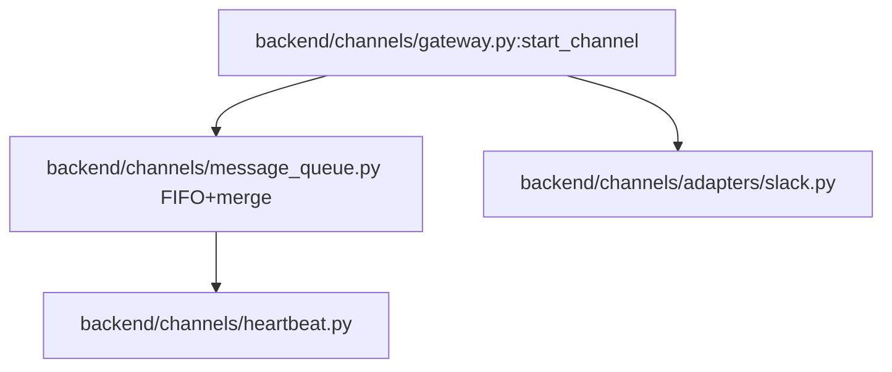

# 规格:Channel Runtime & Message Queue
<!-- spec-hash: b86f09837fb12cb95ad35b992d583e37022bd350a88aa0a6dccc521158f96fa6 -->

## 1. 域概述
职责:External-platform channel runtime: FIFO per-session message queue with merge semantics, start/stop/restart lifecycle, and access-mode / allowed-sender enforcement.
核心实体:Gateway, MessageQueue, Heartbeat
复杂度:complex

## 2. 架构图(本域)

## 3. 用户流程图(每条 flow)
_(无流程图)_

## 4. 业务流 & 步骤规格
### 业务流:flow:channel-start — 入口 route:post-api-channels-channel-id-start-75c59884
#### 步骤 1 — FIFO merge queue dispatch (`backend/channels/message_queue.py`)

## 5. 业务规则汇总(域级不变量)
<!-- [human] 区:人工增补业务承诺,merge 时受保护不覆盖(§8.2) -->
_(待人工增补 `[human]` 业务规则)_

## 6. 潜在问题 & 风险
| 严重度 | 位置 | 问题 | 来源 |
|---|---|---|---|

## 7. Gaps & 改进区
| 类型 | 位置 | 建议 | 来源 |
|---|---|---|---|

## 8. 关联
上下游域:无
项目级教训:see IMPROVEMENT.md#(升级的问题上浮到此)
