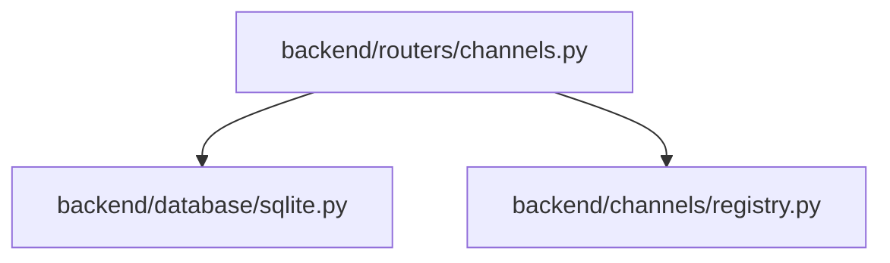
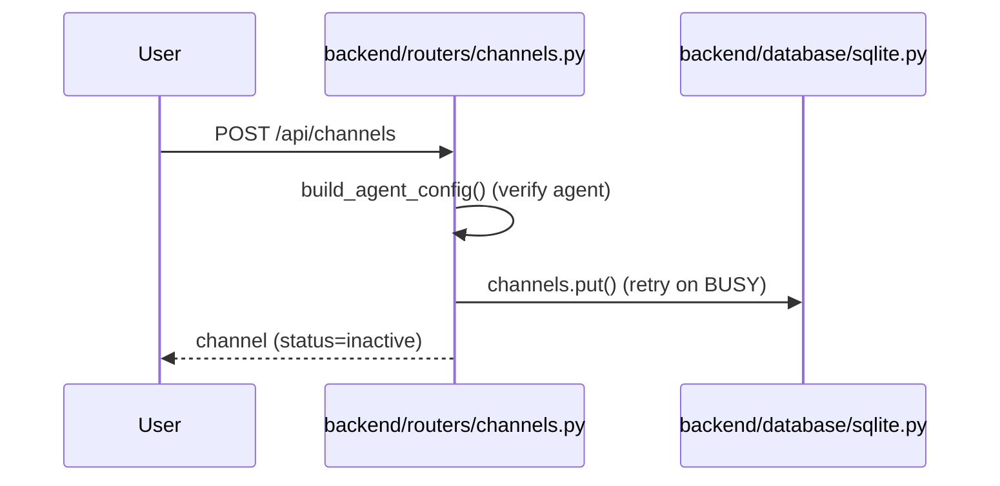

# 规格:Multi-Platform Channels
<!-- spec-hash: c4f2ce0787d1047eedd6d224c7356a6c93fbe6e2db3a354d5a16e0f8e218ddab -->

## 1. 域概述
职责:Slack/external channel bindings; external→internal session mapping; per-channel access modes + allowlists.
核心实体:Channel, ChannelSession
复杂度:moderate

## 2. 架构图(本域)

## 3. 用户流程图(每条 flow)

## 4. 业务流 & 步骤规格
### 业务流:Create a channel binding — 入口 route:post-api-channels-d3628108
#### 步骤 1 — verify agent + DB insert (`backend/routers/channels.py:1-1`)
| 项 | 内容 |
|---|---|
| 业务规则 | [llm-claim] agent must exist (build_agent_config) before insert (anchor: `backend/routers/channels.py:115`); [llm-claim] DB put retries on SQLITE_BUSY up to 3x exponential backoff (anchor: `backend/database/sqlite.py:119`) |

## 5. 业务规则汇总(域级不变量)
<!-- [human] 区:人工增补业务承诺,merge 时受保护不覆盖(§8.2) -->
_(待人工增补 `[human]` 业务规则)_

## 6. 潜在问题 & 风险
| 严重度 | 位置 | 问题 | 来源 |
|---|---|---|---|

## 7. Gaps & 改进区
| 类型 | 位置 | 建议 | 来源 |
|---|---|---|---|

## 8. 关联
上下游域:无
项目级教训:see IMPROVEMENT.md#(升级的问题上浮到此)
