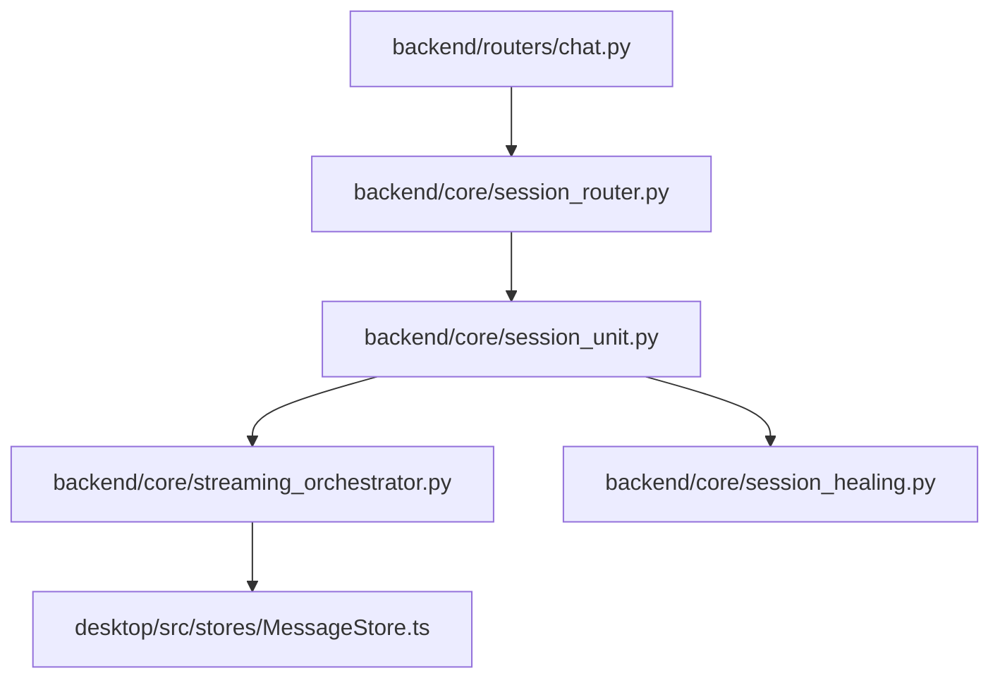
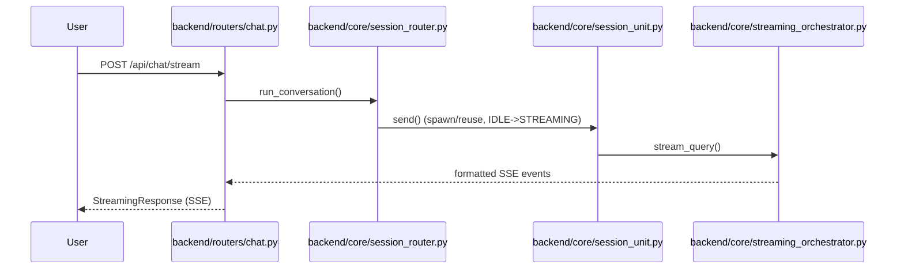
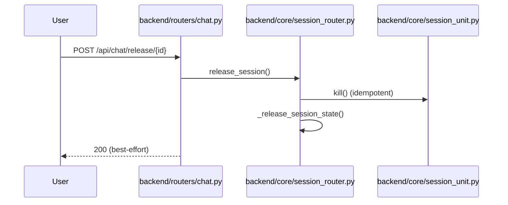
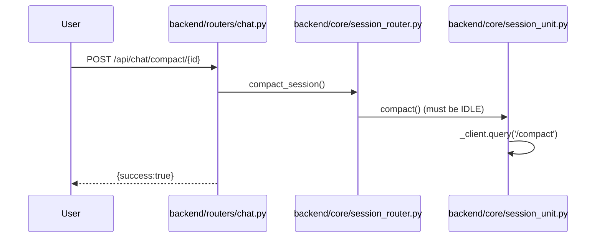

# 规格:Chat & Session Lifecycle
<!-- spec-hash: 451fb936c16f50441203f38efd95b23b17a4d412c8fc3f33bb193c5a713a289a -->

## 1. 域概述
职责:Streaming chat turns over the 5-state session machine (COLD→STREAMING→IDLE→WAITING_INPUT→DEAD); MessageStore single-writer; resume/compaction/slot-release.
核心实体:Session, Turn, MessageStore
复杂度:complex

## 2. 架构图(本域)

## 3. 用户流程图(每条 flow)

## 4. 业务流 & 步骤规格
### 业务流:Send a chat message (streaming turn) — 入口 route:post-api-chat-answer-question-cbe65088
#### 步骤 1 — Stream SDK response via orchestrator (`backend/core/streaming_orchestrator.py`)
| 项 | 内容 |
|---|---|
| 输入 | session_id + prompt |
| 输出 | SSE event stream |

#### 步骤 2 — Persist via MessageStore single-writer (`desktop/src/stores/MessageStore.ts:6--`)
| 项 | 内容 |
|---|---|
| 业务规则 | [llm-claim] all writes go through MessageStore.append/replace/endStreaming — never setMessages directly (anchor: `desktop/src/stores/MessageStore.ts:6-9`) |

### 业务流:Release session slot on tab close — 入口 route:post-api-chat-release-session-id-062b9f01
#### 步骤 1 — idempotent kill + slot release (`backend/core/session_router.py:2-1`)
| 项 | 内容 |
|---|---|
| 业务规则 | [llm-claim] STREAMING/WAITING_INPUT require force=True to release (anchor: `backend/core/session_router.py:2220`); [llm-claim] channel sessions are skipped (never released via this path) (anchor: `backend/core/session_router.py:2216`) |

### 业务流:Compact a session — 入口 route:post-api-chat-compact-session-id-86c5b0bc
#### 步骤 1 — compact via /compact command (`backend/core/session_unit.py:3-7`)
| 项 | 内容 |
|---|---|
| 业务规则 | [llm-claim] session must be IDLE to compact (else error) (anchor: `backend/core/session_unit.py:3727`); [llm-claim] compact serializes vs concurrent send() via _client_io lock (anchor: `backend/core/session_unit.py:3757`) |

### 业务流:Delete a chat session — 入口 route:delete-api-chat-sessions-session-id-722b9b33
#### 步骤 1 — delete_session route handler — kill + cleanup (`backend/routers/chat.py:1236-1260`)
### 业务流:Enable a deferred MCP mid-session — 入口 route:post-api-chat-sessions-session-id-enable-mcp-ec868c40
#### 步骤 1 — enable_mcp route handler (`backend/routers/chat.py:1214-1235`)

## 5. 业务规则汇总(域级不变量)
<!-- [human] 区:人工增补业务承诺,merge 时受保护不覆盖(§8.2) -->

- **绝不在 STREAMING 态跨 tab 驱逐 session — 用户会丢失正在生成的回复** `[human]` — anchor `session_router.py` ✅ (OT01 根治承诺,骨架抽取抓不到"为什么")

## 6. 潜在问题 & 风险
| 严重度 | 位置 | 问题 | 来源 |
|---|---|---|---|
| high | `desktop/src/stores/MessageStore.ts:0` | append has very high fan-in (6347 callers) — change-propagation risk | risk_areas |
| high | `desktop/src/stores/MessageStore.ts:0` | replace has very high fan-in (760 callers) — change-propagation risk | risk_areas |
| medium | `desktop/src/pages/ChatPage.tsx:0` | error has very high fan-in (244 callers) — change-propagation risk | risk_areas |

## 7. Gaps & 改进区
| 类型 | 位置 | 建议 | 来源 |
|---|---|---|---|

## 8. 关联
上下游域:domain:eval
项目级教训:see IMPROVEMENT.md#(升级的问题上浮到此)
