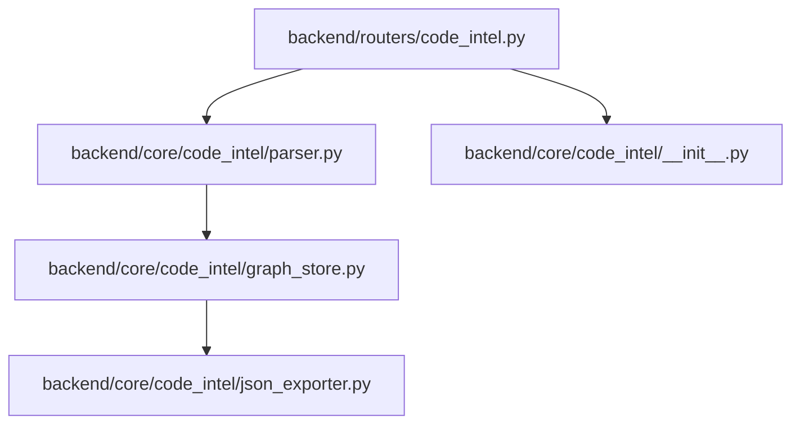
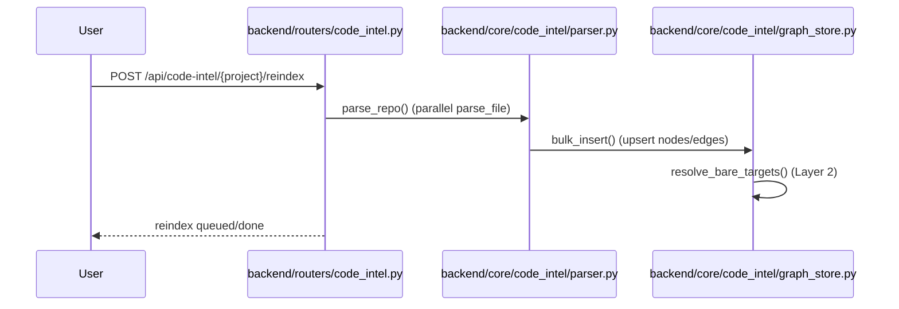
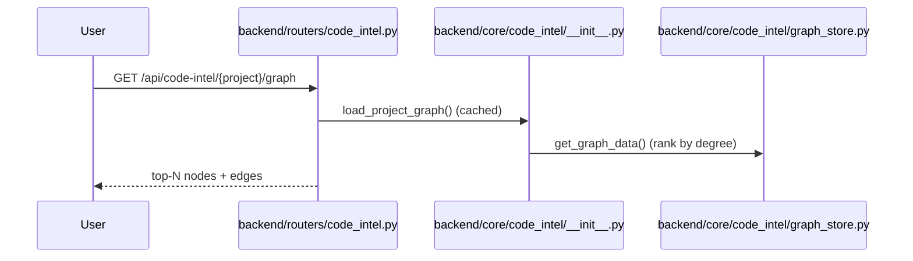

# 规格:Code Intelligence
<!-- spec-hash: cdb87e232777515b7f527ead7d73428f624bcd2f6db7d7f4827f91ae83c8b31c -->

## 1. 域概述
职责:Per-project symbol graph (code_intel.db) + reindex + v2/v3 code-intel.json export (domains/flows/steps).
核心实体:GraphStore, Route, Domain
复杂度:complex

## 2. 架构图(本域)

## 3. 用户流程图(每条 flow)

## 4. 业务流 & 步骤规格
### 业务流:Reindex a project graph — 入口 route:post-api-code-intel-project-reindex-55be2a5f
#### 步骤 1 — Trigger background reindex (`backend/routers/code_intel.py`)
| 项 | 内容 |
|---|---|
| 输入 | project name |
| 输出 | ReindexResponse(status) \| 400 \| 404 |
| 接口契约 | `trigger_reindex(project, background_tasks)` · POST /api/code-intel/{project}/reindex · 202=accepted (background); 400=invalid project name; 404=code intel not found |
| 前置条件 | [llm-claim] project name valid (anchor: `backend/routers/code_intel.py:171`) |
| 异常路径 | [llm-claim] invalid name → 400 (anchor: `backend/routers/code_intel.py:171`); [llm-claim] project not indexed → 404 (anchor: `backend/routers/code_intel.py:176`) |

#### 步骤 2 — parse repo + bulk insert graph (`backend/core/code_intel/parser.py:5-6`)
| 项 | 内容 |
|---|---|
| 业务规则 | [llm-claim] parse_repo walks tree (parallel parse_file), then bulk_insert upserts + resolves bare targets (Layer 2) (anchor: `backend/core/code_intel/graph_store.py:802`) |

### 业务流:Fetch a project graph — 入口 route:get-api-code-intel-project-graph-fcff2079
#### 步骤 1 — load cached graph + rank (`backend/core/code_intel/graph_store.py:6-1`)
| 项 | 内容 |
|---|---|
| 业务规则 | [llm-claim] load_project_graph caches GraphStore; get_graph_data uses a read-only connection ranked by degree (anchor: `backend/core/code_intel/__init__.py:36`) |

## 5. 业务规则汇总(域级不变量)
<!-- [human] 区:人工增补业务承诺,merge 时受保护不覆盖(§8.2) -->
_(待人工增补 `[human]` 业务规则)_

## 6. 潜在问题 & 风险
| 严重度 | 位置 | 问题 | 来源 |
|---|---|---|---|

## 7. Gaps & 改进区
| 类型 | 位置 | 建议 | 来源 |
|---|---|---|---|

## 8. 关联
上下游域:domain:cultivation
项目级教训:see IMPROVEMENT.md#(升级的问题上浮到此)
