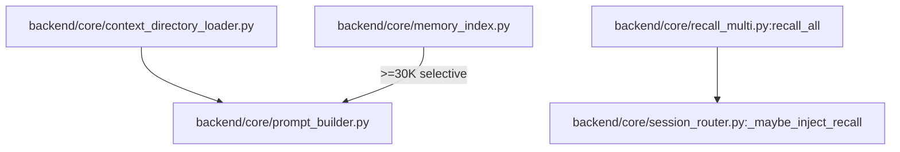

# 规格:Context Assembly & Memory Recall
<!-- spec-hash: be9e776ebc27fadeaec39f21f51df3aa3ef7303d4d4e63171d68cb1f6cc98df5 -->

## 1. 域概述
职责:Assembles the 11-file system prompt (session-type exclusions + token budget), selectively injects MEMORY above 30K, serves pure-filesystem keyword/FTS recall (read-only, zero Bedrock embed by default), and persists session memory.
核心实体:ContextDirectoryLoader, PromptBuilder, MemoryIndex, BucketedRecall
复杂度:complex

## 2. 架构图(本域)

## 3. 用户流程图(每条 flow)
_(无流程图)_

## 4. 业务流 & 步骤规格
### 业务流:flow:memory-save — 入口 route:post-api-memory-save-session-56cbb24b
#### 步骤 1 — Distill + persist session memory (`backend/core/memory_index.py`)
### 业务流:flow:recall-coverage — 入口 route:get-api-recall-coverage-33247bc4
#### 步骤 1 — Aggregate read-only recall coverage (`backend/core/recall_multi.py`)

## 5. 业务规则汇总(域级不变量)
<!-- [human] 区:人工增补业务承诺,merge 时受保护不覆盖(§8.2) -->
_(待人工增补 `[human]` 业务规则)_

## 6. 潜在问题 & 风险
| 严重度 | 位置 | 问题 | 来源 |
|---|---|---|---|

## 7. Gaps & 改进区
| 类型 | 位置 | 建议 | 来源 |
|---|---|---|---|

## 8. 关联
上下游域:无
项目级教训:see IMPROVEMENT.md#(升级的问题上浮到此)
