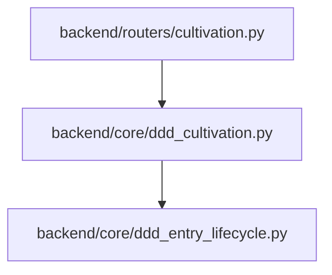
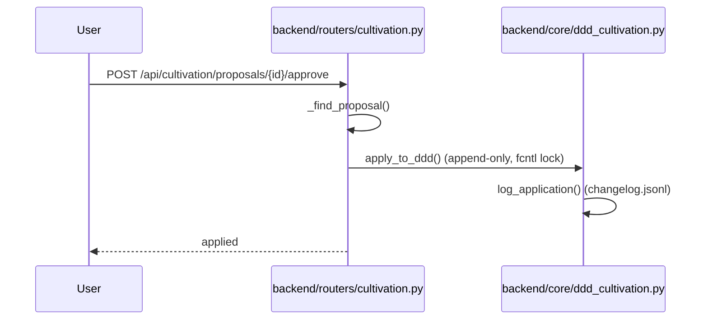

# 规格:DDD Cultivation Governance
<!-- spec-hash: ff8686847b8b9e6d11cb0f668459b9f13553acaf5c46e5af64d097448f610b96 -->

## 1. 域概述
职责:Event-driven DDD knowledge growth; gate-based promotion; protected-zone guard; escalation proposals queue.
核心实体:CultivationProposal
复杂度:moderate

## 2. 架构图(本域)

## 3. 用户流程图(每条 flow)

## 4. 业务流 & 步骤规格
### 业务流:Approve a cultivation proposal — 入口 route:post-api-cultivation-proposals-proposal-id-approve-0dcaf070
#### 步骤 1 — append-only apply + changelog (`backend/core/ddd_cultivation.py:4-1`)
| 项 | 内容 |
|---|---|
| 业务规则 | [llm-claim] apply_to_ddd hard-refuses retire/rewrite (append-only), acquires fcntl lock, dedups within section, atomic temp→rename (anchor: `backend/core/ddd_cultivation.py:464`) |

## 5. 业务规则汇总(域级不变量)
<!-- [human] 区:人工增补业务承诺,merge 时受保护不覆盖(§8.2) -->
_(待人工增补 `[human]` 业务规则)_

## 6. 潜在问题 & 风险
| 严重度 | 位置 | 问题 | 来源 |
|---|---|---|---|

## 7. Gaps & 改进区
| 类型 | 位置 | 建议 | 来源 |
|---|---|---|---|

## 8. 关联
上下游域:无
项目级教训:see IMPROVEMENT.md#(升级的问题上浮到此)
