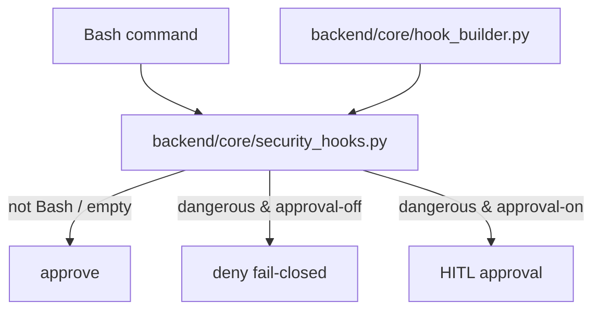
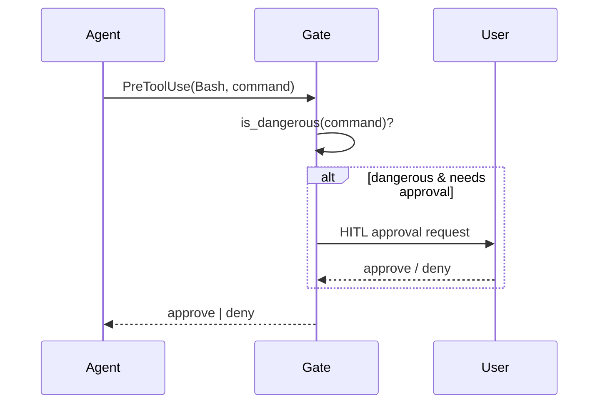

# 规格:Dangerous Command Gate
<!-- spec-hash: d3506b85d769ecfb6fcf2bcaa6f730b4ad9408788c7c3204ff1db3cda83057d8 -->

## 1. 域概述
职责:PreToolUse Bash gate — each Bash command is adjudicated dangerous before execution; dangerous → human approval (HITL) or, when approval is disabled, fail-closed deny. Three danger classes: glob patterns, recursive-rm predicate, irreversible external-op predicate (C041).
核心实体:command, patterns, permission_mgr, session_key
复杂度:moderate

## 2. 架构图(本域)

## 3. 用户流程图(每条 flow)

## 4. 业务流 & 步骤规格
### 业务流:Command admission adjudication — 入口 (未锚定)
#### 步骤 1 — Adjudicate three danger classes (`backend/core/security_hooks.py`)
| 项 | 内容 |
|---|---|
| 输入 | command string |
| 输出 | is_dangerous: bool |

#### 步骤 2 — Fail-closed deny when approval disabled (`backend/core/security_hooks.py`)
| 项 | 内容 |
|---|---|
| 输入 | is_dangerous + approval state |
| 输出 | approve \| deny |

## 5. 业务规则汇总(域级不变量)
<!-- [human] 区:人工增补业务承诺,merge 时受保护不覆盖(§8.2) -->

- **凡改仓库可见性/删除/force-push 等不可逆外部操作,必须过同一审批流(C041 教训)** `[human]` — anchor `security_hooks.py:181` ✅ verified(此条为人工从 C041 事故补充的业务承诺,骨架抽取抓不全其"为什么")

## 6. 潜在问题 & 风险
| 严重度 | 位置 | 问题 | 来源 |
|---|---|---|---|
| info | `backend/core/security_hooks.py:280` | _is_irreversible_external_op relies on segmented parsing; wrapper-with-arg and subshell bypass are known LOW residuals needing a real shell parser | llm |

## 7. Gaps & 改进区
| 类型 | 位置 | 建议 | 来源 |
|---|---|---|---|
| parser-limitation | `backend/core/security_hooks.py` | root-fix wrapper/subshell bypass with a real shell parser (current tokenizer is approximate) | llm |

## 8. 关联
上下游域:无
项目级教训:see IMPROVEMENT.md#(升级的问题上浮到此)
