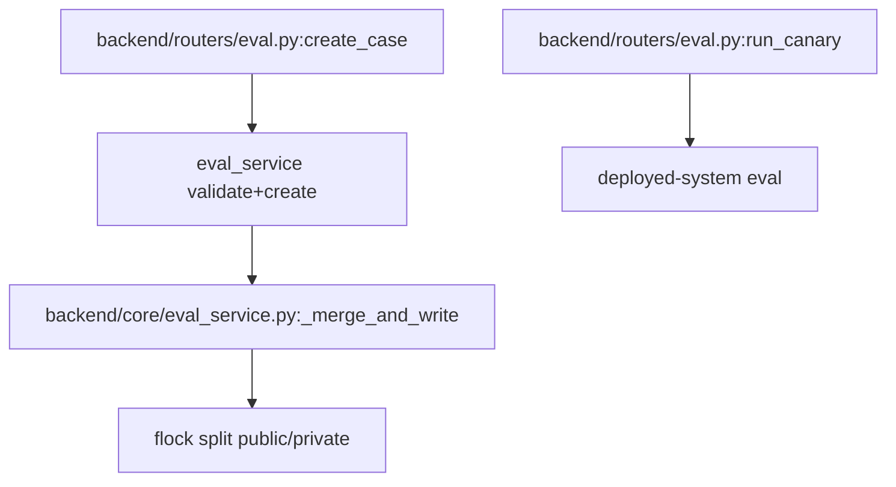
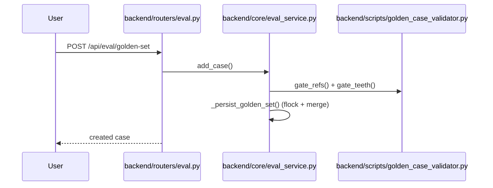
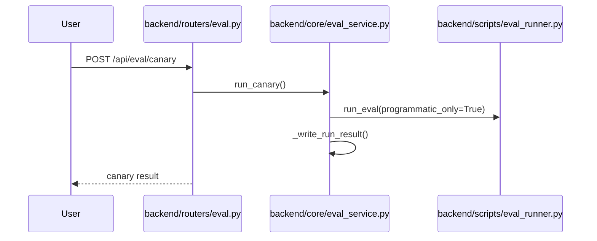

# 规格:Evaluation & Golden Set
<!-- spec-hash: 4c396fe37b834e33673c88c70161688ae9f60f1a1d634f7dfc9f1dd1fbfbc391 -->

## 1. 域概述
职责:Golden-case CRUD + canary/context-health eval; public/private origin split; release-gate binds report to code_digest.
核心实体:GoldenCase, EvalRun
复杂度:moderate

## 2. 架构图(本域)

## 3. 用户流程图(每条 flow)

## 4. 业务流 & 步骤规格
### 业务流:Add a golden case — 入口 route:post-api-eval-golden-set-baa79ee4
#### 步骤 1 — Validate + create case (`backend/routers/eval.py`)
| 项 | 内容 |
|---|---|
| 输入 | CreateCaseRequest {case fields} |
| 输出 | {status:created, case} \| 400 |
| 接口契约 | `create_case(req: CreateCaseRequest)` · POST /api/eval/golden-set · 200=created; 400=invalid case (ValueError) |
| 业务规则 | [llm-claim] 4-gate validate (schema/dup/non-vacuous/privacy) before persist (anchor: `backend/routers/eval.py:123`) |
| 异常路径 | [llm-claim] invalid case → 400 (anchor: `backend/routers/eval.py:131`) |

#### 步骤 2 — flock + merge-write golden set (`backend/core/eval_service.py:1-0`)
| 项 | 内容 |
|---|---|
| 业务规则 | [llm-claim] persist re-reads disk + partitions by origin + atomic rename (cross-process flock) (anchor: `backend/core/eval_service.py:1140`) |

### 业务流:Run eval canary — 入口 route:post-api-eval-canary-4738fa96
#### 步骤 1 — Run canary eval (`backend/routers/eval.py`)
| 项 | 内容 |
|---|---|
| 输入 | (none) |
| 输出 | canary result \| 500 |
| 接口契约 | `run_canary()` · POST /api/eval/canary · 200=canary result; 500=eval error |
| 业务规则 | [llm-claim] sync def → FastAPI runs in threadpool, not blocking event loop (anchor: `backend/routers/eval.py:190`) |

### 业务流:Trigger a full eval run — 入口 route:post-api-eval-run-5f7c9038
#### 步骤 1 — trigger_eval_run route handler (`backend/routers/eval.py:169-200`)
#### 步骤 2 — eval_service.trigger_run — background run + run_id (`backend/core/eval_service.py:481-510`)
### 业务流:Promote stable golden cases to public — 入口 route:post-api-eval-promote-stable-4f86f106
#### 步骤 1 — promote_stable_cases route handler (`backend/routers/eval.py:218-236`)

## 5. 业务规则汇总(域级不变量)
<!-- [human] 区:人工增补业务承诺,merge 时受保护不覆盖(§8.2) -->
_(待人工增补 `[human]` 业务规则)_

## 6. 潜在问题 & 风险
| 严重度 | 位置 | 问题 | 来源 |
|---|---|---|---|

## 7. Gaps & 改进区
| 类型 | 位置 | 建议 | 来源 |
|---|---|---|---|

## 8. 关联
上下游域:无
项目级教训:see IMPROVEMENT.md#(升级的问题上浮到此)
