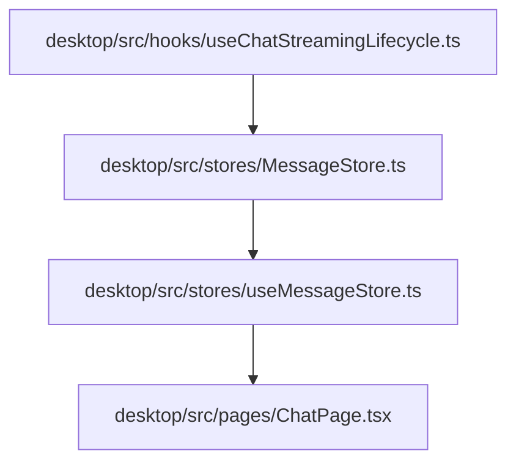
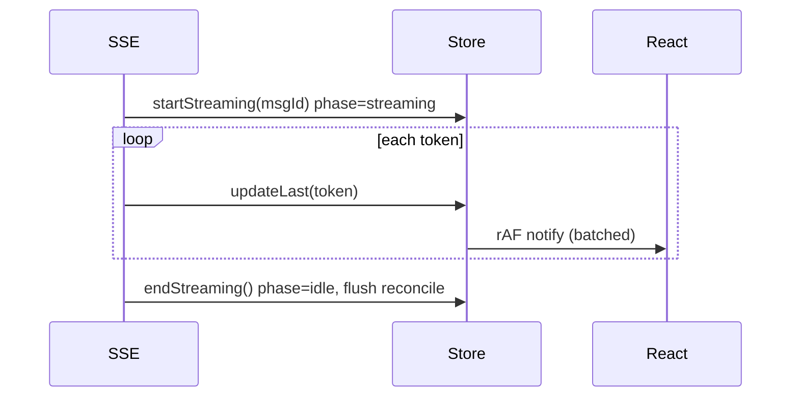

# 规格:MessageStore (frontend single-writer)
<!-- spec-hash: aa997d0677ec2e565ce67c110aa43aa244c4c215d46cfa4954952f69412bb276 -->

## 1. 域概述
职责:One MessageStore per chat tab — the single-writer authority for chat messages. Phase-gated (idle/streaming): append/updateLast pass during streaming, reconcile/replace queue or NO-OP. rAF-gated notify + watchdog. Highest fan-in domain in code-intel (append 6347 callers).
核心实体:_messages, _phase, _streamingMessageId, watchdog
复杂度:complex

## 2. 架构图(本域)

## 3. 用户流程图(每条 flow)

## 4. 业务流 & 步骤规格
### 业务流:Streaming-phase message write — 入口 (未锚定)
#### 步骤 1 — updateLast hot path (new array ref + reset watchdog) (`desktop/src/stores/MessageStore.ts`)
| 项 | 内容 |
|---|---|
| 输入 | updater + optional predicate |
| 输出 | new _messages ref + notify |

#### 步骤 2 — reconcile phase-gate (queue during streaming) (`desktop/src/stores/MessageStore.ts`)
| 项 | 内容 |
|---|---|
| 输入 | DB messages |
| 输出 | merged _messages (streaming wins) |

## 5. 业务规则汇总(域级不变量)
<!-- [human] 区:人工增补业务承诺,merge 时受保护不覆盖(§8.2) -->

- **单写者:所有消息写入必须经 store,React 端只读投影,绝不直接 setMessages** `[human]` — anchor `MessageStore.ts:6-9`(docstring)✅ verified(此为 OT01 根治的架构承诺,骨架抽取抓不到"为什么单写者")

## 6. 潜在问题 & 风险
| 严重度 | 位置 | 问题 | 来源 |
|---|---|---|---|
| critical | `desktop/src/stores/MessageStore.ts:0` | append has fan-in 6347 callers, risk_score 1.0 — highest in the repo; any signature/semantic change has huge blast radius | risk_areas |
| high | `desktop/src/stores/MessageStore.ts:0` | replace has fan-in 760 callers, risk_score 1.0 — second highest | risk_areas |
| high | `desktop/src/stores/MessageStore.ts:0` | OT01 frontend reconcile race — #1 recurring bug source (~33 patches); root cause in the render-source layer (store must be sole render authority) | llm |
| medium | `desktop/src/stores/MessageStore.ts:47` | watchdog races the first-token delay; may force-end streaming before first content (race documented in code comment) | llm |
| medium | `desktop/src/stores/MessageStore.ts:184` | updateLast HOT PATH spreads a new array each token (O(n)); very long conversations accumulate O(n^2) append cost | llm |

## 7. Gaps & 改进区
| 类型 | 位置 | 建议 | 来源 |
|---|---|---|---|
| perf | `desktop/src/stores/MessageStore.ts` | consider segmented/ring buffer for the O(n) spread on very long conversations (only if a profiler proves it a bottleneck) | llm |
| test-coverage | `desktop/src/stores/MessageStore.ts` | property tests for streaming<->idle phase interleaving + multi-tab (MEMORY OT05) | llm |

## 8. 关联
上下游域:domain:chat-session
项目级教训:see IMPROVEMENT.md#(升级的问题上浮到此)
