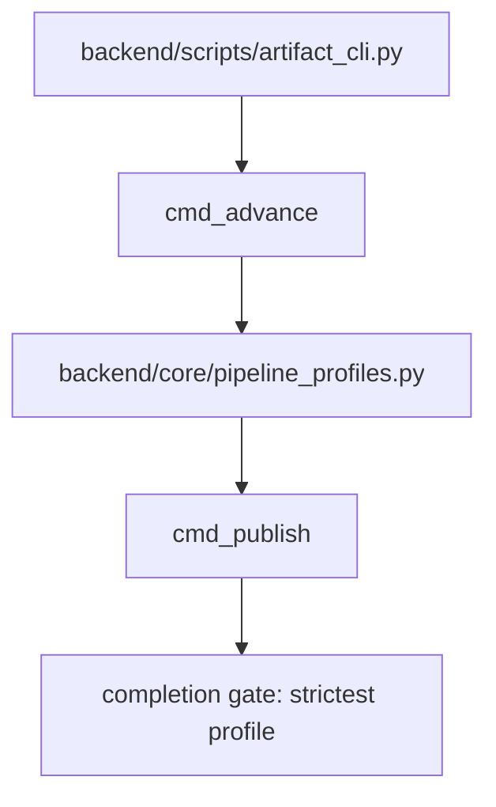

# 规格:Autonomous Pipeline State Machine
<!-- spec-hash: 30bbf4e7b6252e9a2289e1ce140f8a0813d4bad258e847341c00d19e07bff138 -->

## 1. 域概述
职责:Run/stage state management for the autonomous pipeline — profile-driven stage sequence, immutable after EVALUATE, validated at each advance and at completion; supports advance/learn/publish/supersede/cancel.
核心实体:run, stage, artifact, profile
复杂度:complex

## 2. 架构图(本域)

## 3. 用户流程图(每条 flow)
_(无流程图)_

## 4. 业务流 & 步骤规格
### 业务流:flow:pipeline-advance — 入口 route:post-api-artifacts-pipeline-advance-a92299c2
#### 步骤 1 — Advance stage with profile validation (`backend/scripts/artifact_cli.py`)
### 业务流:Publish a pipeline stage artifact — 入口 route:post-api-artifacts-pipeline-publish-64ce478a
#### 步骤 1 — publish route handler (thread-offloaded) (`backend/routers/artifacts.py:421-445`)
#### 步骤 2 — artifact_registry.publish — validate + persist artifact (`backend/core/artifact_registry.py:163-210`)
### 业务流:Supersede a pipeline run — 入口 route:post-api-artifacts-pipeline-supersede-a46bcbad
#### 步骤 1 — supersede route handler (`backend/routers/artifacts.py:462-482`)
### 业务流:Record a pipeline outcome for learning — 入口 route:post-api-artifacts-pipeline-learn-0619eaf0
#### 步骤 1 — learn route handler (`backend/routers/artifacts.py:483-505`)

## 5. 业务规则汇总(域级不变量)
<!-- [human] 区:人工增补业务承诺,merge 时受保护不覆盖(§8.2) -->
_(待人工增补 `[human]` 业务规则)_

## 6. 潜在问题 & 风险
| 严重度 | 位置 | 问题 | 来源 |
|---|---|---|---|

## 7. Gaps & 改进区
| 类型 | 位置 | 建议 | 来源 |
|---|---|---|---|

## 8. 关联
上下游域:无
项目级教训:see IMPROVEMENT.md#(升级的问题上浮到此)
