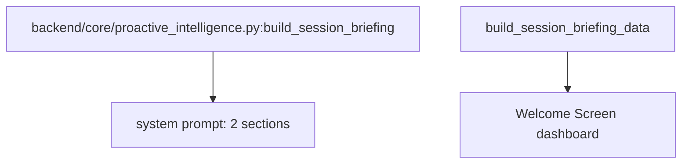

# 规格:Proactive Intelligence & Session Briefing
<!-- spec-hash: 02f10d2498d8954967519e9328451fa598823a91725e0b90a6c8ab3e3f2bc3ee -->

## 1. 域概述
职责:Builds the session-start cognition briefing (system-prompt) cut to the two cognition-load-bearing sections (Suggested focus + System health), plus a separate structured data twin for the frontend Welcome Screen.
核心实体:build_session_briefing, build_session_briefing_data
复杂度:moderate

## 2. 架构图(本域)

## 3. 用户流程图(每条 flow)
_(无流程图)_

## 4. 业务流 & 步骤规格
### 业务流:flow:session-briefing — 入口 route:get-api-system-briefing-40692970
#### 步骤 1 — Assemble 2-section briefing (`backend/core/proactive_intelligence.py`)

## 5. 业务规则汇总(域级不变量)
<!-- [human] 区:人工增补业务承诺,merge 时受保护不覆盖(§8.2) -->
_(待人工增补 `[human]` 业务规则)_

## 6. 潜在问题 & 风险
| 严重度 | 位置 | 问题 | 来源 |
|---|---|---|---|

## 7. Gaps & 改进区
| 类型 | 位置 | 建议 | 来源 |
|---|---|---|---|

## 8. 关联
上下游域:无
项目级教训:see IMPROVEMENT.md#(升级的问题上浮到此)
