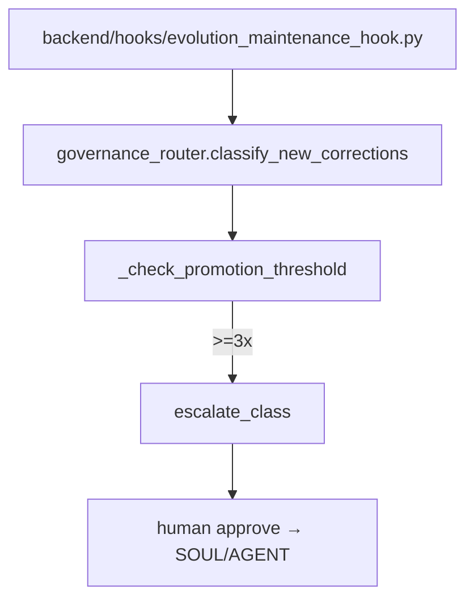

# 规格:Self-Evolution & Governance Ladder
<!-- spec-hash: d1f093f2f6e12f4d72fa7d9f3892c500780169581f9c78025cf3af2852d122df -->

## 1. 域概述
职责:Post-session evolution maintenance: classifies corrections, counts recurrence, and auto-fires structural-fix proposals at the 3x threshold via the escalation ladder; escalations are surfaced and resolved per project.
核心实体:EvolutionMaintenanceHook, EscalationTracker, GovernanceRouter
复杂度:complex

## 2. 架构图(本域)

## 3. 用户流程图(每条 flow)
_(无流程图)_

## 4. 业务流 & 步骤规格
### 业务流:flow:escalation-resolve — 入口 route:post-api-escalations-project-escalation-id-resolve-b2da5346
#### 步骤 1 — Escalate/resolve correction class (`backend/hooks/evolution_maintenance_hook.py`)

## 5. 业务规则汇总(域级不变量)
<!-- [human] 区:人工增补业务承诺,merge 时受保护不覆盖(§8.2) -->
_(待人工增补 `[human]` 业务规则)_

## 6. 潜在问题 & 风险
| 严重度 | 位置 | 问题 | 来源 |
|---|---|---|---|

## 7. Gaps & 改进区
| 类型 | 位置 | 建议 | 来源 |
|---|---|---|---|

## 8. 关联
上下游域:无
项目级教训:see IMPROVEMENT.md#(升级的问题上浮到此)
