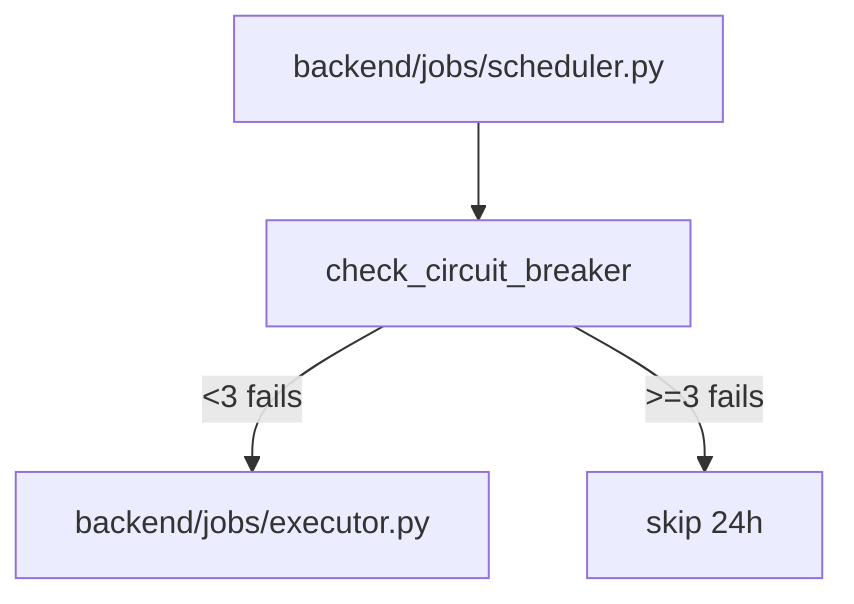

# 规格:Scheduled Jobs & Services
<!-- spec-hash: 816a791f29a5b440d666579201881c4ee4abd5f91b18bcb5aafada239253a67b -->

## 1. 域概述
职责:Unified scheduler for system + user jobs (cron/dependency/event triggers) with a circuit breaker: 3 consecutive failures skip the job, auto-reset after 24h.
核心实体:Scheduler, Job, SchedulerState, Executor
复杂度:complex

## 2. 架构图(本域)

## 3. 用户流程图(每条 flow)
_(无流程图)_

## 4. 业务流 & 步骤规格
### 业务流:flow:job-run — 入口 route:post-api-jobs-run-cc53052a
#### 步骤 1 — Circuit-breaker gate + dispatch (`backend/jobs/scheduler.py`)
### 业务流:Cancel a running background task — 入口 route:post-api-tasks-task-id-cancel-b844a0d2
#### 步骤 1 — cancel_task route handler (`backend/routers/tasks.py:169-178`)
#### 步骤 2 — task_manager.cancel_task — signal + status update (`backend/core/task_manager.py:464-492`)
### 业务流:Send a message to a running task — 入口 route:post-api-tasks-task-id-message-ba007d6e
#### 步骤 1 — send_message route handler (`backend/routers/tasks.py:178-191`)
#### 步骤 2 — task_manager.send_message — inject into task stream (`backend/core/task_manager.py:441-463`)
### 业务流:Convert a todo into an executable task — 入口 route:post-api-todos-todo-id-convert-to-task-410cf8e6
#### 步骤 1 — convert_todo_to_task route handler (`backend/routers/todos.py:107-128`)
#### 步骤 2 — todo_manager.convert_to_task — create task + set todo handled (`backend/core/todo_manager.py:328-360`)
### 业务流:Bind a todo to a chat session — 入口 route:post-api-todos-bind-session-session-id-f59cb1e0
#### 步骤 1 — bind_todo_to_session route handler (`backend/routers/todos.py:166-190`)
### 业务流:Delete a task (cancel + purge buffers + DB row) — 入口 route:delete-api-tasks-task-id-8fd83328
#### 步骤 1 — delete_task route handler (`backend/routers/tasks.py:160-169`)
#### 步骤 2 — task_manager.delete_task — cancel + clear buffers + delete row + bump version (`backend/core/task_manager.py:726-760`)

## 5. 业务规则汇总(域级不变量)
<!-- [human] 区:人工增补业务承诺,merge 时受保护不覆盖(§8.2) -->
_(待人工增补 `[human]` 业务规则)_

## 6. 潜在问题 & 风险
| 严重度 | 位置 | 问题 | 来源 |
|---|---|---|---|

## 7. Gaps & 改进区
| 类型 | 位置 | 建议 | 来源 |
|---|---|---|---|

## 8. 关联
上下游域:无
项目级教训:see IMPROVEMENT.md#(升级的问题上浮到此)
