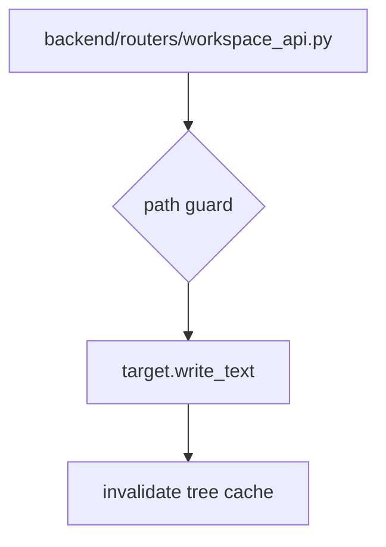
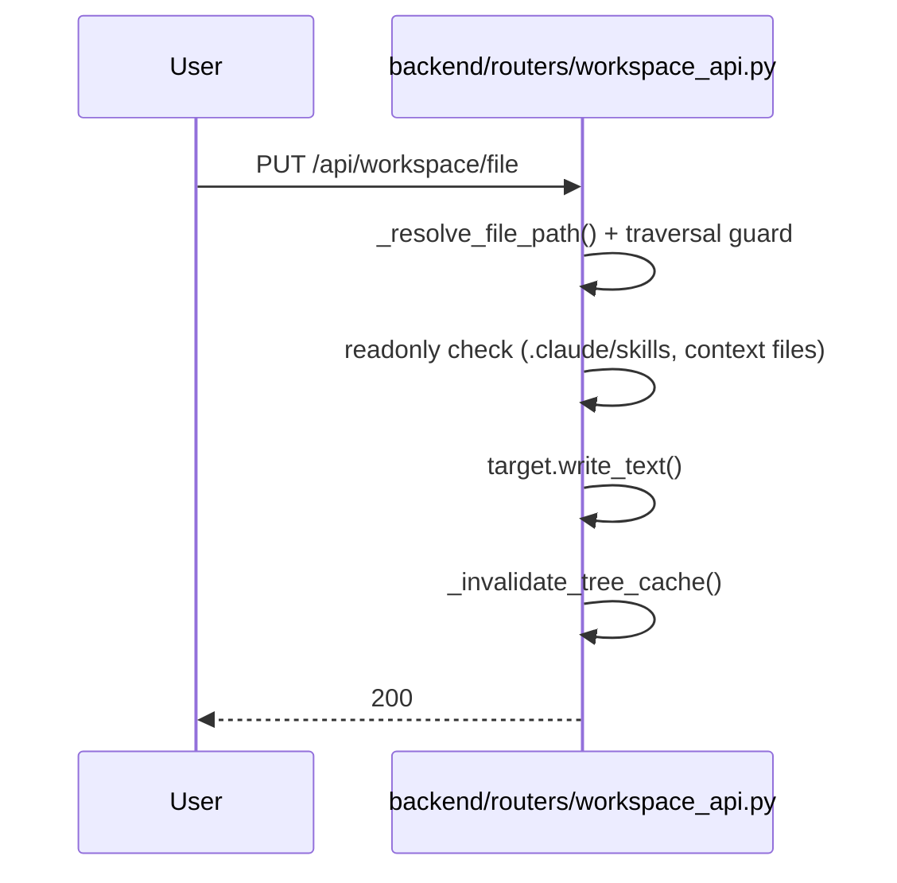

# 规格:Workspace Explorer & Files
<!-- spec-hash: 1157e5e2d5bdab80785b9394ed369c8c0fe7da82b256d69fb1c2e09ed6bffb16 -->

## 1. 域概述
职责:Hybrid filesystem-tree + git-status explorer; file read/write; ETag-based polling.
核心实体:WorkspaceFile, GitStatus
复杂度:moderate

## 2. 架构图(本域)

## 3. 用户流程图(每条 flow)

## 4. 业务流 & 步骤规格
### 业务流:Write a workspace file — 入口 route:put-api-workspace-file-2194ae2c
#### 步骤 1 — path traversal + readonly guard (`backend/routers/workspace_api.py:1-3`)
| 项 | 内容 |
|---|---|
| 业务规则 | [llm-claim] reject paths escaping workspace (is_relative_to guard) (anchor: `backend/routers/workspace_api.py:777`); [llm-claim] reject writes to .claude/skills/* and system-default context files (anchor: `backend/routers/workspace_api.py:1304`) |

#### 步骤 2 — write + cache invalidate (`backend/routers/workspace_api.py:1-3`)
| 项 | 内容 |
|---|---|
| 业务规则 | [llm-claim] parent dirs created; tree cache invalidated so next poll re-runs git status (anchor: `backend/routers/workspace_api.py:1318`) |

## 5. 业务规则汇总(域级不变量)
<!-- [human] 区:人工增补业务承诺,merge 时受保护不覆盖(§8.2) -->
_(待人工增补 `[human]` 业务规则)_

## 6. 潜在问题 & 风险
| 严重度 | 位置 | 问题 | 来源 |
|---|---|---|---|

## 7. Gaps & 改进区
| 类型 | 位置 | 建议 | 来源 |
|---|---|---|---|
| test-coverage | `backend/routers/workspace_api.py` | add concurrent-write / ETag-race coverage | llm |

## 8. 关联
上下游域:无
项目级教训:see IMPROVEMENT.md#(升级的问题上浮到此)
