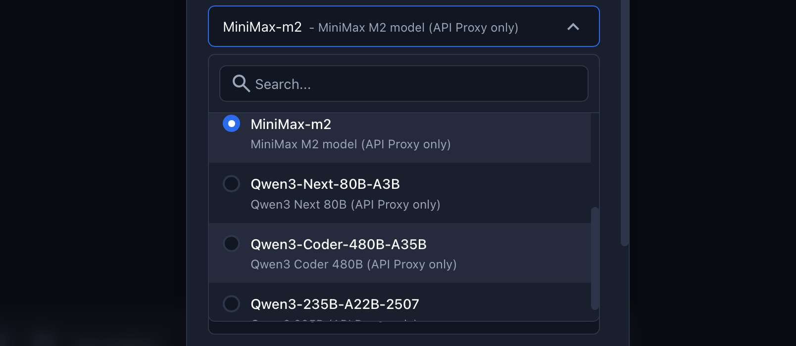

# SwarmAI Quick Start Guide

SwarmAI is an AI Agent desktop application built on Claude Agent SDK, supporting creation, management, and conversation with AI Agents.

## Table of Contents

- [System Requirements](#system-requirements)
- [Installation Steps](#installation-steps)
  - [1. Install SwarmAI](#1-install-swarmai)
  - [2. Configure API](#2-configure-api)
- [Optional: Configure Feishu Channel](#3-configure-feishu-channel)
- [Verify Installation](#verify-installation)
- [FAQ](#faq)

---

## System Requirements

| Item | Requirement |
|------|-------------|
| Operating System | macOS 10.15+, Windows 10/11, or Linux (Ubuntu 20.04+) |
| Processor | x86_64 or ARM64 (Apple Silicon) |
| Memory | 8GB RAM (16GB recommended) |
| Disk Space | 500MB available |
| Network | Internet connection required |

---

## Installation Steps

### 1. Install SwarmAI

#### macOS

**Option 1: Using DMG Installer (Recommended)**

1. Download the latest release from [GitHub Releases](https://github.com/xg-gh-25/SwarmAI/releases)
2. Double-click to open the DMG file
3. Drag `SwarmAI.app` to the `Applications` folder
4. Launch SwarmAI from Launchpad or Applications folder

**First Launch Notes:**

macOS may block unsigned applications. If you see "Cannot open SwarmAI because the developer cannot be verified":

1. Open "System Preferences" → "Security & Privacy"
2. Click the "General" tab
3. Click "Open Anyway"

Or use terminal command:
```bash
xattr -cr /Applications/SwarmAI.app
```

#### Windows

**Option 1: Using MSI Installer (Recommended)**

1. Download `SwarmAI_x.x.x_x64.msi` installer
2. Double-click to run the installer
3. Follow the wizard to complete installation (default: `C:\Program Files\SwarmAI\`)
4. Launch SwarmAI from Start Menu

**Option 2: Using NSIS Installer**

1. Download the latest release from [GitHub Releases](https://github.com/xg-gh-25/SwarmAI/releases)
2. Run the installer and follow the prompts
3. Launch SwarmAI from Start Menu or desktop shortcut

**First Launch Notes:**

Windows may display SmartScreen warning. Click "More info" → "Run anyway".

Git Bash system dependency required: https://git-scm.com/downloads/win

#### Build from Source (All Platforms)

**Prerequisites:**
- Node.js 18+
- Python 3.11+
- Rust (install from https://rustup.rs/)
- uv (Python package manager):
  ```bash
  curl -LsSf https://astral.sh/uv/install.sh | sh
  ```

```bash
# Clone repository
git clone https://github.com/xg-gh-25/SwarmAI.git
cd SwarmAI/desktop

# Install dependencies
npm install

# Build application (auto-detects current platform)
npm run build:all

# Build artifacts located at ./src-tauri/target/release/bundle/
# macOS: dmg/SwarmAI_x.x.x_aarch64.dmg or macos/SwarmAI.app
# Windows: msi/SwarmAI_x.x.x_x64.msi or nsis/SwarmAI_x.x.x_x64-setup.exe
# Linux: deb/swarmai_x.x.x_amd64.deb or appimage/swarmai_x.x.x_x86_64.AppImage
```

---

### 2. Configure API

After launching SwarmAI, you need to configure the API to use AI features.

#### Access Settings Page

1. Launch SwarmAI
2. Click the "Settings" icon (gear icon) in the left sidebar
3. Configure API in the "API Configuration" section

#### Option 1: Using Litellm Proxy API

1. Create a proxy using [litellm gateway](https://docs.litellm.ai/docs/simple_proxy)
   - Ensure "Use AWS Bedrock" toggle is OFF
   - Enter proxy URL in Base URL field
   - Enter your API Key in the "API Key" input
   - Click "Save API Configuration"
   - Note: When configuring litellm config yml, set model_name to Claude official Model Name:
```yml
model_list:
  - model_name: claude-sonnet-4-5-20250929
    litellm_params:
      model: bedrock/global.anthropic.claude-sonnet-4-5-20250929-v1:0
```

#### Option 2: Using Open Source AWS Production Proxy

1. Use [Anthropic-Bedrock API Proxy](https://github.com/xiehust/anthropic_api_converter)
2. Deploy on AWS ECS with API Key management, budget allocation, traffic control, etc.


#### Option 3: Using AWS Bedrock

1. Ensure you have an AWS account with Bedrock service enabled
2. Request Claude model access in AWS Console
3. In SwarmAI settings:
   - Enable "Use AWS Bedrock" toggle
   - Select authentication method:
     - **AK/SK Credentials**: Enter Access Key ID and Secret Access Key
     - **Bearer Token**: Enter Bearer Token
   - Select AWS Region
   - Click "Save API Configuration"

---

## 3. Configure Feishu Channel

### Step 1: Create Feishu Application

1. Open Feishu Open Platform
Visit **Feishu Open Platform** and log in with your Feishu account.
For Lark (international version), use https://open.larksuite.com/app and set domain: "lark" in configuration.

2. Create Application
- Click **Create Enterprise Self-built Application**
- Fill in application name and description
- Select application icon
- Create the application

3. Get Application Credentials
- On the **Credentials & Basic Info** page, copy:
- App ID (format: cli_xxx)
- App Secret
❗ Important: Keep App Secret secure, do not share with others.

4. Configure Application Permissions
- On the **Permission Management** page, click **Batch Import** button and paste the following JSON:
```json
{
  "scopes": {
    "tenant": [
      "aily:file:read",
      "aily:file:write",
      "application:application.app_message_stats.overview:readonly",
      "application:application:self_manage",
      "application:bot.menu:write",
      "cardkit:card:write",
      "contact:user.employee_id:readonly",
      "corehr:file:download",
      "docs:document.content:read",
      "event:ip_list",
      "im:chat",
      "im:chat.access_event.bot_p2p_chat:read",
      "im:chat.members:bot_access",
      "im:message",
      "im:message.group_at_msg:readonly",
      "im:message.group_msg",
      "im:message.p2p_msg:readonly",
      "im:message:readonly",
      "im:message:send_as_bot",
      "im:resource",
      "sheets:spreadsheet",
      "wiki:wiki:readonly"
    ],
    "user": ["aily:file:read", "aily:file:write", "im:chat.access_event.bot_p2p_chat:read"]
  }
}
```

5. Enable Bot Capability
- On **Application Capabilities > Bot** page:
- Enable bot capability
- Configure bot name

6. Configure Event Subscription
⚠️ Important: Before configuring event subscription, ensure:
- SwarmAI is successfully started
- On Event Subscription page:
- Select "Use long connection to receive events" (WebSocket mode)
- Add event: im.message.receive_v1 (receive messages)
⚠️ Note: If gateway is not started or channel not added, long connection settings will fail to save.

7. Publish Application
- Create version on **Version Management & Release** page
- Submit for review and publish
- Wait for admin approval (enterprise self-built apps usually auto-approve)

## Verify Installation

### Check Settings Page Status

Open SwarmAI settings page and confirm the following:

| Item | Expected Status |
|------|-----------------|
| Claude Code CLI - Status | ✓ Installed |
| Claude Code CLI - Node.js | ✓ Available |
| Claude Code CLI - npm | ✓ Available |
| Backend Service - Status | ● Running |
| API Configuration | Configured (shows ✓ Configured) |


## Add Plugins

On the **Plugin Management** page, click **Install Plugin** button and enter the plugin GitHub repo URL. Recommended official plugins:

| Name | URL |
|------|-----|
| Knowledge Work Plugins | https://github.com/anthropics/knowledge-work-plugins.git |
| Official Skills | https://github.com/anthropics/skills.git |
| Official Plugins | https://github.com/anthropics/claude-plugins-official.git |

## Add MCP

On the **MCP Management** page, click **Add MCP Server** button, select Connection Type. For example, to add AWS Knowledge:
Select HTTP, enter URL: https://knowledge-mcp.global.api.aws

### Test Agent Conversation

1. Create a new Agent on the "Agents" page, customize which skills, MCP, and plugins to enable
2. Go to the "Chat" page
3. Select the newly created Agent
4. Send a test message like "Hello, how are you?"
5. If you receive an AI response, installation is successful

---

## Data Storage Locations

SwarmAI stores data in `~/.swarm-ai/` on all platforms.

### Data Locations

| Type | Path |
|------|------|
| Data Directory | `~/.swarm-ai/` |
| Database | `~/.swarm-ai/data.db` |
| Skills Directory | `~/.swarm-ai/skills/` |
| Logs Directory | `~/.swarm-ai/logs/` |

**View logs:**
```bash
# macOS/Linux
cat ~/.swarm-ai/logs/backend.log

# Windows (PowerShell)
Get-Content $HOME\.swarm-ai\logs\backend.log
```

---

## FAQ

### Q: Backend Service shows Stopped after startup?

**A:** This is usually a timing issue, wait a few seconds and the status will automatically update to Running. If it persists:

1. Check log files:
   ```bash
   cat ~/.swarm-ai/logs/backend.log
   ```
2. Try restarting the application

### Q: Claude Code CLI shows Not Found?

**A:** Ensure Node.js is properly installed:

```bash
# Check Node.js
node --version

# Check npm
npm --version

# Reinstall Claude Code CLI
npm install -g @anthropic-ai/claude-code

# Verify
claude --version
```

### Q: "Unable to connect to backend service" when saving API configuration?

**A:** This may be a CORS or port issue:

1. Confirm Backend Service shows Running
2. Note the displayed port number
3. Test connection in terminal:
   ```bash
   curl http://localhost:<port>/health
   ```
4. If it returns `{"status":"healthy"...}`, try restarting the application

### Q: How to completely uninstall SwarmAI?

**A (macOS/Linux):**

```bash
# 1. Delete application (macOS)
rm -rf /Applications/SwarmAI.app

# 1. Delete application (Linux - DEB)
sudo apt remove swarmai

# 1. Delete application (Linux - AppImage)
rm swarmai_*.AppImage

# 2. Delete data directory (optional, will delete all data)
rm -rf ~/.swarm-ai/

# 3. Delete Claude Code CLI (optional)
npm uninstall -g @anthropic-ai/claude-code
```

**A (Windows):**

```powershell
# 1. Uninstall using Windows Settings
# "Settings" → "Apps" → "SwarmAI" → "Uninstall"

# Or use MSI uninstall (if MSI installed)
# Control Panel → Programs and Features → SwarmAI → Uninstall

# 2. Delete data directory (optional, will delete all data)
Remove-Item -Recurse -Force $HOME\.swarm-ai

# 3. Delete Claude Code CLI (optional)
npm uninstall -g @anthropic-ai/claude-code
```

### Q: How to update SwarmAI?

**A:**

1. Download the new version installer
2. Close running SwarmAI
3. Drag new version to Applications folder and replace old version
4. Restart SwarmAI

Data is automatically preserved, no reconfiguration needed.

---

## Get Help

- **GitHub Issues**: [Report issues or suggestions](https://github.com/xg-gh-25/SwarmAI/issues)
- **Documentation**: See project README and AGENT.md or CLAUDE.md for more information

---

*Last updated: January 2025*
