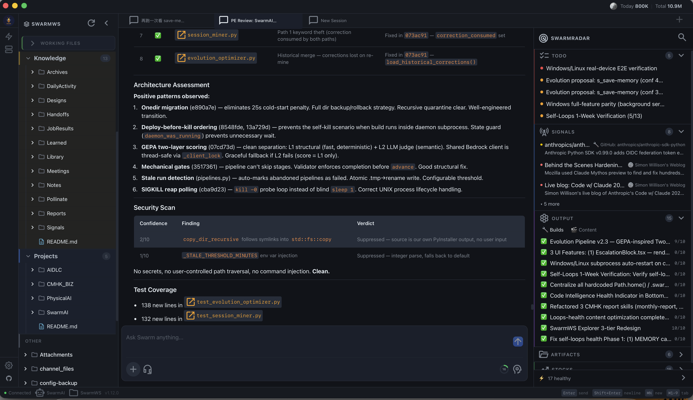
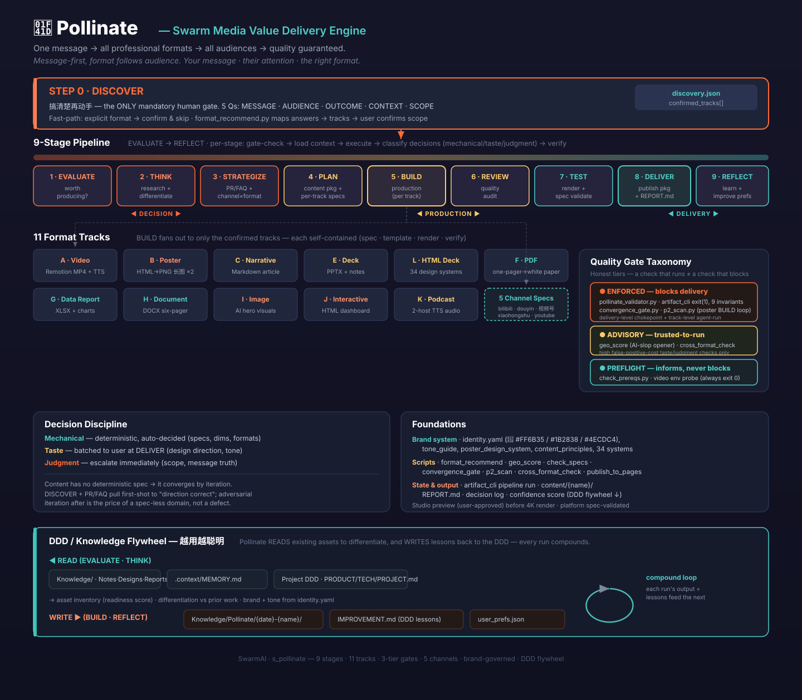
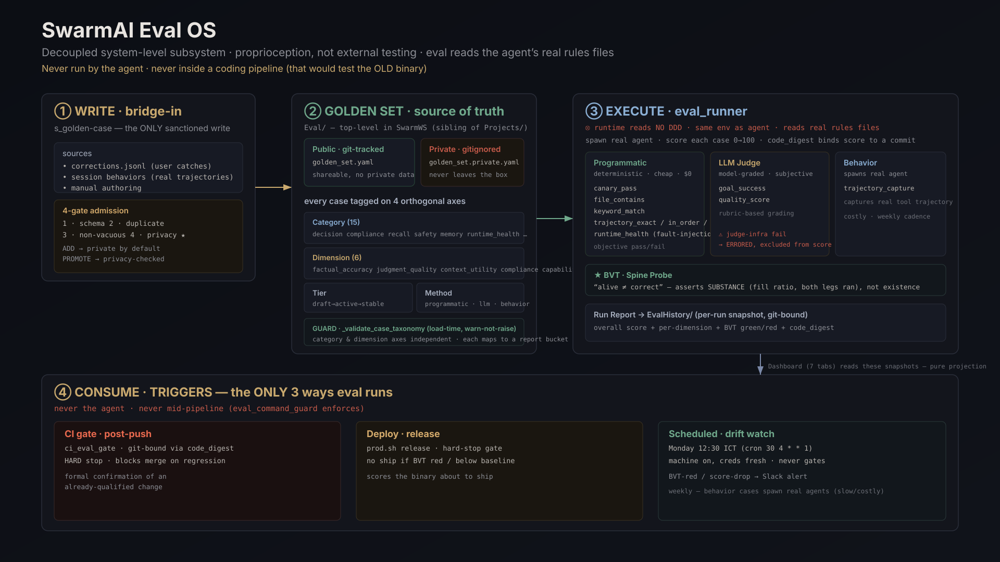
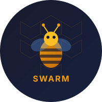

<div align="center">

# SwarmAI

### Human directs. AI delivers.

English | [中文](./README.zh-CN.md)

[](./LICENSE)
[](https://github.com/xg-gh-25/SwarmAI/stargazers)

</div>

<!-- TEMPORARY: re-star notice — remove once star count has recovered -->
> ⭐ **Our stars were reset by mistake.** On 2026-06-27 the repo's visibility was
> accidentally toggled for a few minutes, which clears GitHub's stargazer list —
> our ~200 stars dropped to near-zero. The code and history are intact; only the
> count was wiped. **If you starred SwarmAI before, a re-star would genuinely help
> 🙏** — it's how new builders find the project.

---

**SwarmAI is a self-evolving Agent OS** — every interaction upgrades the system's cognition, not just its templates.

Your AI team, one human directing.

---

## Why SwarmAI

We finally have software smart enough to reason, write code, and make judgment calls — and it **wakes up with amnesia every morning.** Every session starts from zero. The context you gave it, the mistake it made yesterday, the correction you taught it — gone. Most "AI tools" are **flat**: a brilliant model trapped in Groundhog Day.

SwarmAI is built on the opposite bet — that the value should **compound.** Every interaction should leave the system a little sharper than before, permanently.

Which reframes the obvious question. Ask *"why does a desktop app need 220K lines and 13 engines?"* and you've mismeasured it: **this isn't application complexity — it's the complexity of an agent's cognition.** Four things separate a mind from a model: it stays **continuous** across time, it **corrects itself**, it **forgets** what stopped mattering, and its **judgment compounds** with use. Conventional software has no analog for any of them — a program doesn't get wiser between runs, and it never rewrites its own rules. SwarmAI is an attempt to build that missing layer: not a bigger model, but the **cognitive operating system around one.**

The design choices only make sense through that lens:

- **Evolution is an OS patch, not stored data.** Most agent-memory projects pile up entries. We separate *cognition* (the OS) from *knowledge* (the disk): one edited line in `SOUL.md` shifts judgment more than a thousand memory rows — and every change is a `git diff`.
- **Recurring mistakes are made structurally impossible.** When an error class repeats, we don't add another lesson — we add a gate, then a path where the wrong move physically cannot happen. Humans rely on carefulness; an agent should rely on structure.
- **Knowledge must be able to die.** Unreferenced for 90 days → retired. Accumulation without elimination is how every memory system rots. Decay is natural selection for what an agent knows.
- **Sessions are discontinuous. Intelligence shouldn't be.** Hooks fire *between* sessions, so the next one starts warm. Most frameworks accept the cold start; we refuse it.

The thesis, tested live and in public: **can one builder + AI operate at the scale of a whole team?** Not by scaling the model — by building the compounding loop around it. The loop *is* the product; you can't extract one engine and keep the effect.

As of **v1.22.0**, that loop is running healthy end-to-end — sessions self-heal, knowledge cultivates and decays on its own, and the evolution engine has logged **42 corrections**, converting recurring failure classes into structural gates rather than repeated lessons.

> **This isn't a product demo — it's a living experiment, documented as it happens.** Below are 60+ deep-dive discussions: every architecture decision, failure, and post-mortem behind the engines.

### 📚 Start Here — The Thinking Behind the Code

| | |
|---|---|
| 🗺️ **[Reading Matrix — 3 Curated Paths](https://github.com/xg-gh-25/SwarmAI/discussions/35)** | **Builder** (~45 min) · **Architect** (~60 min) · **Leader** (~30 min) — don't read everything, pick your path |
| 💬 **[All Discussions](https://github.com/xg-gh-25/SwarmAI/discussions)** | Thought leadership, architecture deep-dives, and post-mortems — also mirrored in [`docs/discussions/`](./docs/discussions/) |
| 🧭 **[Design Philosophy — Six Pillars](https://github.com/xg-gh-25/SwarmAI/discussions/38)** | The beliefs that became enforcement — why each one earned its place from a failure |
| 🕸️ **[The Ontology Beneath It All](https://github.com/xg-gh-25/SwarmAI/discussions/95)** | The single ontology (🏷️ classification + 🕸️ relations, no Neo4j) that unifies Memory, DDD, and Code Intelligence |



---

## Quick Start

```bash
git clone https://github.com/xg-gh-25/SwarmAI.git && cd SwarmAI
cd backend && uv sync && cp .env.example .env   # edit with your API key
cd ../desktop && npm install && npm run tauri:dev
```

**macOS (Apple Silicon):** Or download `.dmg` from [Releases](https://github.com/xg-gh-25/SwarmAI/releases)

Requires: Node.js 18+, Python 3.11+, Rust, [uv](https://astral.sh/uv), [Claude Code CLI](https://github.com/anthropics/claude-code)

> 📖 Full setup guide: [QUICK_START.md](./QUICK_START.md)

---

## Architecture


```
┌─────────────────────────────────────────────────────────────┐
│  DELIVERY ENGINES        Pipeline · Pollinate · Eval        │
├─────────────────────────────────────────────────────────────┤
│  KNOWLEDGE LAYER         DDD · Memory · Evolution           │
├─────────────────────────────────────────────────────────────┤
│  AGENT HARNESS           Context · Sessions · Hooks · Jobs  │
└─────────────────────────────────────────────────────────────┘
```

---

## Core Engines

If you're also using AI to write code, make content, or run operations — these 13 engines are that compounding bet, broken down. Each is independently useful; together they form the loop that makes the system sharper with use. (Click `code` to read the engine itself — the implementation is the documentation.)

| # | Engine | What It Does | Deep Dive |
|---|--------|-------------|-----------|
| 1 | **Context Management** | 11-file prompt architecture, 100K budget, 3-tier ownership | [docs](./docs/DDD-Platform-Overview.md) |
| 2 | **Memory Pipeline** | 4-tier persistence: DailyActivity → distillation → compound recall | [docs](./docs/Memory-Management-Design.md) |
| 3 | **DDD Cultivation** | Self-growing domain knowledge, 7-type × 3-layer ontology (classification × relations), Darwinian decay | [docs](./docs/DDD-Cultivation-Engine-HLD.md) |
| 4 | **Autonomous Pipeline** | One requirement → push-ready code. 9 stages · 3 gates (framing/plan/build) · 2 modes (Full + Goal Loop) | [docs](./docs/Autonomous-Pipeline-Design.md) |
| 5 | **Pollinate Engine** | One message → multi-format brand content. 9 stages · 11 tracks · 3-tier gates · DDD flywheel | [docs](./docs/Pollinate-Content-Engine.md) · [diagram](./assets/pollinate-architecture.svg) |
| 6 | **Self-Evolution** | Cognitive L0→L3 patching. 42 corrections → recurring classes become structural gates | [docs](./docs/Self-Evolution-Harness-Design.md) |
| 7 | **Self-Healing** | Invisible recovery: 5 sensors, auto-respawn, user sees nothing | [code](./backend/core/session_healing.py) |
| 8 | **Multi-Tab + MessageStore** | Concurrent sessions, phase-gated single-writer, cross-tab isolation | [code](./desktop/src/stores/MessageStore.ts) |
| 9 | **Hook System** | Runtime + lifecycle hooks. Sessions never cold-start | [code](./backend/core/hook_builder.py) |
| 10 | **Job System** | Background intelligence: 13 signal feeds, cron, budget-gated | [code](./backend/jobs/scheduler.py) |
| 11 | **4-Platform Backend** | macOS daemon · Hive (EC2) · Windows · Linux. Compile-time isolation | [code](./backend/main.py) |
| 12 | **Skills + Channels** | 88 skills (lazy/always), Slack gateway, 3-tier permission | [code](./backend/core/skill_registry.py) |
| 13 | **Eval (Proprioception)** | Decoupled, system-level: golden set + git-bound regression gate. Proves convergence, not vibes | [docs](./docs/OS-Eval-Function-Design.md) · [diagram](./assets/eval-architecture.svg) |

**The compound loop:** Memory → Pipeline judgment → DDD → Evolution → Gates → Memory. Remove one, the rest weaken.


The same DDD-driven pattern powers content, not just code. **Pollinate** turns one message into any format — and writes its lessons back to the DDD, so every run compounds:



### Eval OS — The Agent-Era Replacement for `assert`

Traditional software trusts `assert` + a green CI light. Agents can't: outputs are **non-deterministic** (even temp=0 isn't bit-reproducible), the **prompt is source code with no diff/review/rollback**, and **dependencies drift on their own** (the model updates silently — you shipped nothing, behavior changed). So SwarmAI treats **Eval as `assert`'s successor**: a decoupled, system-level subsystem that measures whether the OS is still *correct*, not merely *alive*.

It's **proprioception, not external grading** — Eval spawns a clean session against the agent's *real* rules files and scores judgment across **6 dimensions** / **15 categories**, every run **git-bound** to its commit so a regression is attributable. And it's wired into the lifecycle as a gate, not a script you remember to run: **build doesn't block, release does** — regression or spine-red on CI/deploy stops the ship.

> 📖 Full architecture + methodology (mapped to AWS's Eval-First framework): [Discussion #83](https://github.com/xg-gh-25/SwarmAI/discussions/83)



> 📊 More diagrams: [Flywheel](./assets/platform-flywheel.svg) · [Context](./assets/context-engineering.svg) · [Memory](./assets/memory-pipeline.svg) · [DDD](./assets/ddd-three-layer-stack.svg) · [Sessions](./assets/multi-tab-sessions.svg) · [Jobs](./assets/job-system.svg) · [Evolution](./assets/self-evolution.svg)

---

## Thesis & Design Philosophy

**Can one builder + AI operate at team scale?** We're testing it live.

1. **One-shot qualified delivery is the real token optimization.** Cheap models iterate 5×, cost more than one correct delivery. Code/content as black box: input → qualified output.
2. **Division of labor is a compromise for limited human cognitive bandwidth — not an optimal design.** One agent, many roles, one knowledge layer. (Sub-agents for adversarial verification ≠ division of labor.)
3. **Knowledge must eliminate itself.** Darwinian decay: 90d unreferenced = retirement. A system that can forget > one that can only remember.
4. **Evolution is cognitive patching, not data accumulation.** We change rules you can `git diff`. "Thinks differently" ≠ "knows more."
5. **Quality converges, not just improves.** Error classes monotonically decrease. Carefulness doesn't scale. Gates do.
6. **Sessions are discontinuous. Intelligence shouldn't be.** 21 hooks fire between sessions. Gets better through use, not updates.
7. **If you can't measure it, you didn't build it.** OS Eval + golden set + change-triggered. Proves convergence in git.

**The compound loop itself is the product.** You can't extract one piece and get the same effect.

> 📖 **Full thesis + CLASS A case study + convergence evidence:** [docs/THESIS.md](./docs/THESIS.md)
>
> 📖 **Discussion #38:** [Design Philosophy — Six Pillars](https://github.com/xg-gh-25/SwarmAI/discussions/38)

---

## Codebase (~220K LOC, excl. tests)

| Layer | LOC | Entry Points |
|-------|-----|--------------|
| **Core (spine)** | ~13K | `session_unit.py`, `prompt_builder.py`, `session_router.py` |
| **Core (extensions)** | ~60K | `core/` — DDD, evolution, proactive, code intel |
| **Backend (other)** | ~64K | routers, hooks, jobs, channels, main |
| **Skills** | ~28K | `backend/skills/s_*/` (88 modules) |
| **Frontend** | ~54K | `desktop/src/` — React 19, Tailwind, TanStack Query |
| **Rust (Tauri)** | ~2K | `desktop/src-tauri/` |
| **Tests** | ~150K | pytest + Vitest (backend 117K + frontend 33K) |

**Stack:** Tauri 2.0 (Rust) · React 19 · FastAPI · Claude Agent SDK + Bedrock · SQLite (WAL + FTS5)

---

## Resources

| What | Link |
|------|------|
| **Discussions** | [Reading Matrix](https://github.com/xg-gh-25/SwarmAI/discussions/35) — Builder 45min · Architect 60min · Leader 30min · [all](https://github.com/xg-gh-25/SwarmAI/discussions) |
| **AI Agent Pitfall Guide** | [EN PDF](./docs/ai-agent-pitfall-guide-en.pdf) · [中文 PDF](./docs/ai-agent-pitfall-guide.pdf) |
| **Design Docs** | [Platform](./docs/DDD-Platform-Overview.md) · [Pipeline](./docs/Autonomous-Pipeline-Design.md) · [Memory](./docs/Memory-Management-Design.md) · [Evolution](./docs/Self-Evolution-Harness-Design.md) · [Pollinate](./docs/Pollinate-Content-Engine.md) |
| **Contributing** | [CONTRIBUTING.md](./CONTRIBUTING.md) |

---

## Contributors

**2,550 commits · 1 human directing · 1 AI delivering.** This repo is the thesis's own minimal verifiable evidence — the human sets direction and makes every judgment call; the AI does the building. See for yourself: `git log`.

<table>
  <tr>
    <td align="center">
      <a href="https://github.com/xg-gh-25">
        
        <br /><sub><b>XG</b></sub>
      </a>
      <br /><sub>Creator & Chief Architect</sub>
    </td>
    <td align="center">
      <a href="https://github.com/xg-gh-25/SwarmAI">
        
        <br /><sub><b>Swarm 🐝</b></sub>
      </a>
      <br /><sub>AI Co-Developer (Claude Opus 4)</sub>
    </td>
  </tr>
</table>

[MIT License](./LICENSE)

---

<div align="center">

**SwarmAI — Human directs. AI delivers.**

</div>
