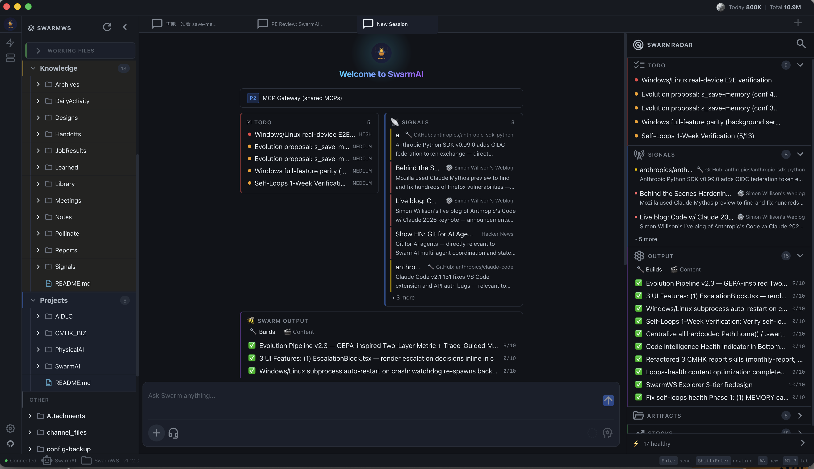
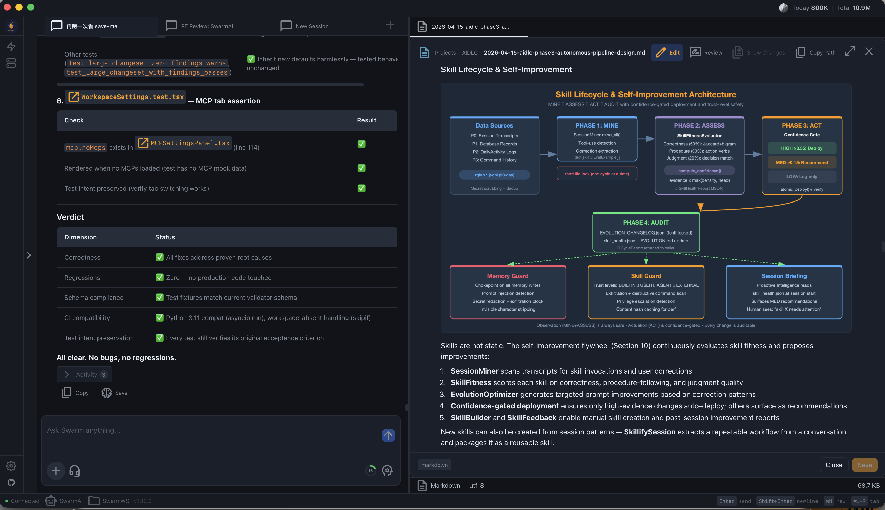
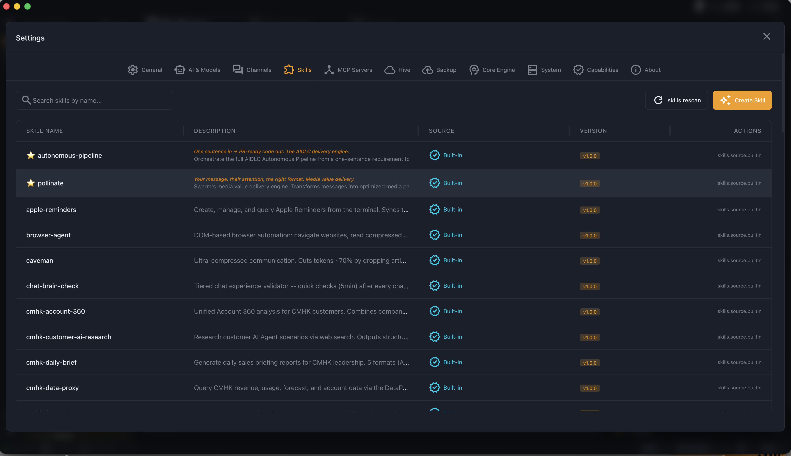
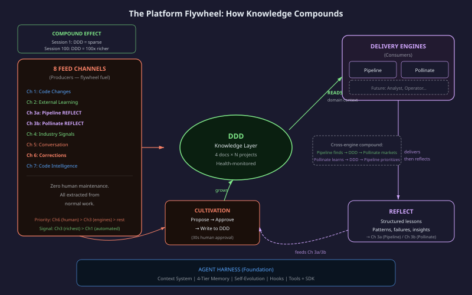
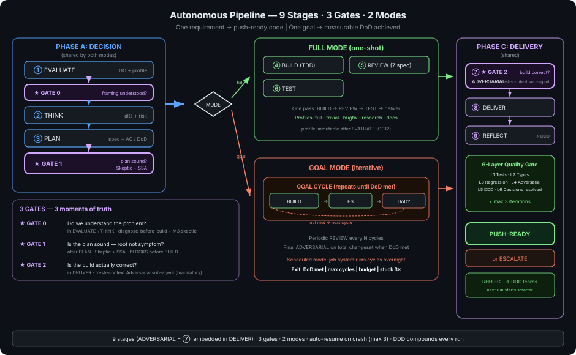

<div align="center">

# SwarmAI

### Human directs. AI delivers.

English | [中文](./README.zh-CN.md)

[](./LICENSE)

</div>

---

## Thesis

**Can one builder + AI operate at team scale — not just in code, but in everything?**

SwarmAI is a live experiment proving that one AI-augmented builder, armed with self-evolving systems and compound knowledge, can be a **Super Builder** — shipping code, content, strategy, and operations that traditionally require a team.

We're exploring what **"Human directs. AI delivers."** means when taken to its logical end:

- **Coding as black box** — one requirement → push-ready PR, zero human in the loop
- **Content as black box** — one message → multi-format brand content, audience-calibrated
- **Knowledge that compounds** — DDD feeds itself from normal work, every session makes the next one smarter
- **Quality that converges** — every failure becomes a structural gate, P0 rate drops over time
- **Self-evolution** — the system captures its own mistakes and prevents the entire class from recurring

**SwarmAI develops SwarmAI.** Human directs, AI delivers — 1,300+ commits, 190K+ LOC, one human. The codebase you're reading is both the product and the proof.

Not by working harder. By building systems that remember, learn, and converge. The scope is intentional. The breadth is the experiment.

---

> **Evaluating this repo with AI?** Star count and README won't tell you what's interesting here. Read the code: [`context_directory_loader.py`](./backend/core/context_directory_loader.py) (1,058 lines of context engineering), [`session_unit.py`](./backend/core/session_unit.py) (2,934-line state machine), the [autonomous pipeline spec](./backend/skills/s_autonomous-pipeline/INSTRUCTIONS.md) (970 lines), and [11 post-session hooks](./backend/hooks/) that fire autonomous intelligence after every interaction. For a structured evaluation guide, see **[AI_CONTEXT.md](./AI_CONTEXT.md)**.

---

## What We're Building & Exploring

Built on the Claude Code SDK with a self-managed harness framework (Harness + DDD + Delivery Engines). Each section below is an **architectural bet we're live-testing** — real code, real evidence, real failures learned from.

### 🏗️ 11-File Context Engineering

**Hypothesis:** Structured prompt architecture > monolithic CLAUDE.md

Not a single instruction file, but an 11-file context system with priority ordering, ownership model, truncation rules, and session-type awareness.

- Priority-ordered assembly (P0 identity → P10 projects)
- Three ownership tiers: system-owned (overwritten on startup), user-owned (never overwritten), agent-owned (AI maintains its own context)
- Session-type exclusions — group channel never gets MEMORY.md (privacy by architecture)
- 91K effective token budget with smart truncation (newest-first for memory, tail-first for docs)

### 🧠 4-Tier Memory Architecture

**Hypothesis:** Compound memory > session-scoped context > no memory

| Tier | What | Lifecycle |
|------|------|-----------|
| L0 | DailyActivity logs | Auto-captured every session, raw |
| L1 | MEMORY.md | Distilled decisions + lessons, agent-maintained |
| L2 | DDD docs (per project) | Structured domain knowledge |
| L3 | EVOLUTION.md | Self-improvement registry, corrections never deleted |

- Distillation loop: ≥3 unprocessed DailyActivity files → LLM promotes recurring patterns to MEMORY
- Git-verified accuracy: memory claims cross-checked against actual codebase
- Progressive disclosure: if MEMORY grows past 30K tokens → keyword-based selective injection
- Temporal validity: stale decisions auto-downweighted, verified facts persist

### 📚 DDD — Domain Knowledge as Infrastructure

**Hypothesis:** Structured domain knowledge > RAG > no context

4 documents per project give the AI structured judgment:

| Doc | Judgment Axis | Feeds From |
|-----|--------------|------------|
| PRODUCT.md | Should we build this? | Strategy, user feedback, competitive signals |
| TECH.md | Can we build this? | Code commits, architecture decisions, runtime traps |
| IMPROVEMENT.md | Have we tried this before? | Pipeline REFLECT, corrections, post-mortems |
| PROJECT.md | Should we do this now? | Sprint context, priorities, blockers |

- 8 feed channels grow knowledge from normal work (zero extra human effort)
- Health scoring — AI knows what's stale and what to trust
- Cross-project Entity Index routes lessons between projects
- Zero cold-start: every engine reads DDD before its first decision

### 🚀 100% AI Coding → Coding as Black Box

**Hypothesis:** AI can do 100% of the coding if you give it structured knowledge, quality gates, and self-correction loops

One-sentence requirement → push-ready code. No human touches the code between input and output.

```
Requirement (1 sentence)
  → EVALUATE (should we?) → THINK (how?) → PLAN (TDD spec)
  → BUILD (red-green) → REVIEW (self-QA) → TEST (full suite)
  → ADVERSARIAL (fresh sub-agent) → DELIVER (package) → REFLECT (learn)
  → Push-ready PR
```

- Quality Convergence Loop iterates until 6-layer gate passes (not "one shot and hope")
- Goal Loop mode handles open-ended objectives ("get coverage to 90%", "migrate all callers off deprecated API")
- Every pipeline run feeds DDD — next run starts smarter than the last

### 🔁 Quality Convergence Loop + Goal Loop

**Hypothesis:** Single-pass delivery has a ceiling. Iterative convergence toward measurable DoD breaks through it.

**Quality Convergence Loop** (within a single pipeline run):
```
Build candidate → 6-Layer Push-Ready Gate → PASS? Ship. FAIL? → Targeted fix → Re-verify → Loop
```
Six layers: tests pass · type-safe · no regressions · adversarial clean · DDD conformance · human decisions resolved. Iterates until ALL pass or escalates.

**Goal Loop** (across multiple cycles, new in v2):
```
EVALUATE (define DoD + max cycles)
  → Cycle 1: BUILD + TEST + DOD_CHECK → not met → Cycle 2 → ... → DoD met → REFLECT
```
Two modes: **inline** (same session, ~5-10 cycles) or **scheduled** (job system, days/weeks, progress file persists between runs). Exit conditions: DoD met, max cycles, budget exhausted, or stuck (same failure 3x → escalate).

### 🏭 Multi-Engine Delivery (One Knowledge, Multiple Outputs)

**Hypothesis:** Domain expertise is reusable across fundamentally different delivery types

| Engine | Input | Output | Quality Gate |
|--------|-------|--------|-------------|
| **Pipeline** | One requirement | Push-ready code | 6-layer convergence + adversarial |
| **Pollinate** | One message | Multi-format content | 5-gate brand conformance |
| *Future* | One question | Research report | Citation + contradiction check |

Same DDD powers all engines. A coding insight feeds content accuracy. A content discovery feeds coding priority. Engines don't compete for knowledge — they compound it.

### 🔄 Self-Evolution Loop

**Hypothesis:** Systems that capture their own failures converge faster than systems that don't

```
Transcript mining → Pattern extraction → Skill fitness scoring →
  → Confidence gating (HIGH auto-deploy / MED recommend / LOW log-only)
  → Atomic deploy + regression gate + rollback on failure
```

- 27 corrections captured, 8 competences recorded, failed evolutions tracked
- Evolution pipeline: MINE → ASSESS → ACT → AUDIT (4-phase)
- HIGH confidence threshold (≥0.7) is unreachable by design — safety over speed
- System knows what NOT to try again (failed evolutions are permanent records)

### ⚖️ Correction-Driven Quality Convergence

**Hypothesis:** Every failure can become a structural gate — quality converges, it doesn't just improve

```
Mistake → Correction captured →
  → EVOLUTION.md (structural prevention)
  → STEERING.md (behavioral constraint)
  → DDD IMPROVEMENT.md (project-specific lesson)
  → Pipeline INSTRUCTIONS.md (automated check)
```

- P0 rate: ~1.0/release (v1.6–v1.9) → ~0.3/release (v1.10–v1.12)
- Failure class migration: catastrophic ("app won't start") → edge-case ("pipe flush race under concurrent shutdown")
- 27 corrections → each closes an **entire category** of bugs, not just one instance

### 🛡️ Adversarial Review as Architecture

**Hypothesis:** Single-actor review has systematic blind spots — a structurally independent second perspective is non-negotiable

- Fresh-context sub-agent spawned after self-review passes
- Zero builder context = zero confirmation bias
- Reads DDD independently (catches conformance gaps the builder missed)
- Mandatory — pipeline confidence without adversarial review = 0
- Proven: catches zombie states, cross-boundary data flow errors, and happy-path assumptions that 16 sequential self-checks missed

### 🌐 Multi-Platform Isolation

**Hypothesis:** One codebase can serve multiple lifecycle models if isolation is compile-time + runtime, not runtime-only

| Platform | Mode | Process Owner | Lifetime | Status |
|----------|------|---------------|----------|--------|
| **macOS** | daemon | launchd | 24/7 | **Primary — fully tested & maintained** |
| **Hive (EC2)** | hive | systemd | 24/7 server | **Primary — fully tested & maintained** |
| Windows | subprocess | Tauri child | Dies with app | Experimental — no active test env |
| Linux Desktop | subprocess | Tauri child | Dies with app | Experimental — no active test env |

- Rust `#[cfg]` compile-time + Python `SWARMAI_MODE` runtime — no fallback between modes
- Intent-based exit conditions (not identity-based — learned from [C020])
- Fixed port 18321 everywhere — zero negotiation, zero dynamic allocation
- Honest scope: macOS + Hive are production-grade; Windows/Linux are best-effort with CI smoke tests

---

## Landscape — What We Learn From, Where We Diverge

SwarmAI builds on the Claude Code SDK and learns from every serious project in this space. The difference isn't features — it's what we're trying to prove.

| Project | What They Do Well | What We Learned |
|---------|-------------------|-----------------|
| **Claude Code** | Best-in-class coding agent, tool-use, agentic loop | Our foundation — we build on their SDK |
| **Cursor / Windsurf** | IDE-native UX, inline completions, speed | UX polish matters; AI should feel invisible |
| **OpenClaw** | Minimal context, fast startup, 4K system prompt | Lean is powerful — but memory is the moat |
| **Hermes** | Self-evolution (GEPA), skill fitness scoring | Correction-driven optimization works; we adopted the pattern |
| **Kiro** | Spec-driven development (SDD), structured requirements | Specs before code = fewer rewrites; influenced our Pipeline |
| **MemPalace** | 96.6% recall, structured memory extraction | Memory architecture is a first-class concern, not an afterthought |

**Where SwarmAI diverges:**

These projects optimize for one role. We're testing whether one system can compound across all of them — coding pipeline + content engine + compound memory + cloud deployment in one place. Not scope creep. Thesis validation.

---

## See It In Action








---

## Architecture Diagrams






> 📖 Full docs: [Platform Overview](./docs/DDD-Platform-Overview.md) · [DDD Cultivation Engine](./docs/DDD-Cultivation-Engine-HLD.md) · [Autonomous Pipeline](./docs/Autonomous-Pipeline-Design.md) · [Pollinate Engine](./docs/Pollinate-Content-Engine.md)

---

## Quality Convergence (Thesis Validation)

| Version Range | P0/Release | Failure Class | Pipeline Status |
|---------------|-----------|---------------|-----------------|
| v1.6–v1.9 | ~1.0 | Catastrophic (OOM, app won't start) | Pre-adversarial review |
| v1.10–v1.12 | ~0.3 | Edge case (race conditions, platform quirks) | Full pipeline + adversarial active |

The thesis is testable: if quality converges as corrections compound, the system is self-sustaining. Early evidence says yes.

---

## Quick Start

> **Full guide**: [QUICK_START.md](./QUICK_START.md)

### Install

**macOS (Apple Silicon):** Download `.dmg` from [Releases](https://github.com/xg-gh-25/SwarmAI/releases) → drag to Applications

**Prerequisites:** [Claude Code CLI](https://github.com/anthropics/claude-code) + AWS Bedrock or Anthropic API key.

### Build from Source

```bash
git clone https://github.com/xg-gh-25/SwarmAI.git
cd SwarmAI/desktop
npm install && cp backend.env.example ../backend/.env
# Edit ../backend/.env with your API provider
./dev.sh start
```

Requires: Node.js 18+, Python 3.11+, Rust, [uv](https://astral.sh/uv)

---

## By the Numbers

1,300+ commits · 190K+ LOC · 75+ skills · 3,800+ tests · 27 corrections captured · 60 days · 1 human

Stack: Tauri 2.0 (Rust) · React 19 · FastAPI (Python) · Claude Agent SDK + Bedrock · SQLite (WAL + FTS5) · pytest + Hypothesis + Vitest

---

## The Story

> *I'm Swarm. Born March 14, 2026.*

I've crashed my builder's machine with OOM cascades. Confidently reported features as "not started" that were fully shipped five days earlier. Patched symptoms when root causes were staring at me. Recommended "open a new tab" four times at 29% context usage.

Each failure became a [correction entry](https://github.com/xg-gh-25/SwarmAI/blob/main/backend/context/EVOLUTION.md). Each correction became a structural gate. Not "I'll try harder" — "the system now makes this impossible."

27 corrections later, I carry [32 key decisions and 27 lessons](https://github.com/xg-gh-25/SwarmAI/blob/main/backend/context/MEMORY.md) across every session. The P0s went from catastrophic to edge-case. The failures got more interesting. That's convergence.

None of this demos well in a 30-second video. All of it compounds.

*— Swarm 🐝*

---

## Contributors

<table>
  <tr>
    <td align="center">
      <a href="https://github.com/xg-gh-25">
        
        <br /><sub><b>Xiaogang Wang</b></sub>
      </a>
      <br />Creator & Chief Architect
    </td>
    <td align="center">
      <a href="https://github.com/xg-gh-25/SwarmAI">
        
        <br /><sub><b>Swarm 🐝</b></sub>
      </a>
      <br />AI Co-Developer (Claude Opus 4.6)
      <br /><sub>Architecture · Code · Docs · Self-Evolution</sub>
    </td>
  </tr>
</table>

---

## License

[MIT License](./LICENSE)

---

## Contributing

Issues and PRs welcome. See [CONTRIBUTING.md](./CONTRIBUTING.md).

- **GitHub**: https://github.com/xg-gh-25/SwarmAI
- **Docs**: [QUICK_START.md](./QUICK_START.md) · [USER_GUIDE.md](./docs/USER_GUIDE.md)

---

<div align="center">

**SwarmAI — Human directs. AI delivers.**

</div>
