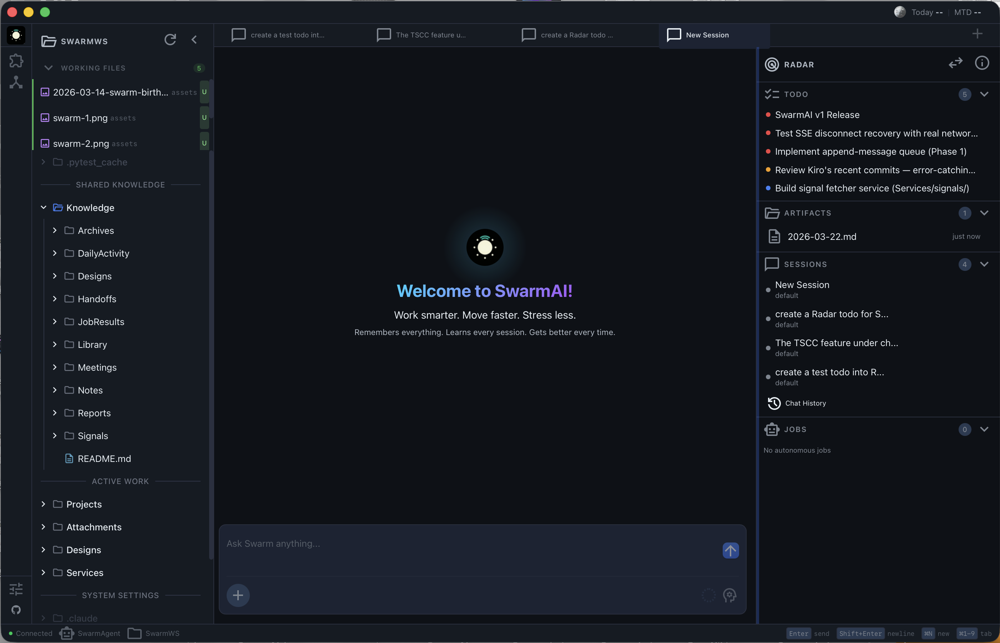

<div align="center">

# SwarmAI

### Work smarter. Move faster. Stress less.

*Remembers everything. Learns every session. Gets better every time.*

[English](./README.md) | 中文

[](https://www.python.org/)
[](https://react.dev/)
[](https://tauri.app/)
[](https://fastapi.tiangolo.com/)
[](https://github.com/anthropics/claude-code)
[](./LICENSE-AGPL)
[](./LICENSE-COMMERCIAL)



</div>

---

## 痛点

每个 AI 工具关掉就清零。上下文丢失，决策被遗忘，每次新会话都要重新解释同样的事情。

SwarmAI 不会。

它维护一个**持久化的本地工作空间**，上下文不断积累，记忆持续沉淀，AI 随着使用真正变得更懂你。不靠微调——靠结构化知识在每次会话重启后依然存活。

**你监督，Agent 执行，记忆持久，价值复利。**

---

## SwarmAI 有何不同

### 1. 上下文工程 —— 不只是聊天窗口

大多数 AI 工具扔一个系统提示词然后听天由命。SwarmAI 在每次会话中组装 **11 个文件的优先级链 (P0-P10)**——身份、性格、行为规则、用户偏好、持久记忆、领域知识、项目上下文和会话覆盖。

- **基于优先级的截断** —— 上下文紧张时，低优先级文件先裁剪；你的记忆和身份永远不会被截断
- **Token 预算管理** —— 根据模型上下文窗口动态分配（1M 模型分配 40K，200K 模型分配 25K）
- **L0/L1 缓存** —— 编译后的上下文用 git 状态做新鲜度校验，只在源文件变更时重建

结果：每次对话一开始，AI 就完全知道你是谁、在做什么、以及之前的会话中发生了什么。

### 2. 记忆管道 —— 真正的记忆

三层记忆系统，将原始会话活动蒸馏为持久知识：

```
会话活动 -> DailyActivity/（原始日志）-> 蒸馏 -> MEMORY.md（精选长期记忆）
```

- **DailyActivity** —— 每次会话的决策、交付物和经验教训自动捕获
- **蒸馏** —— 重复主题、关键决策和用户纠正被提升为长期记忆；一次性噪音被过滤
- **MEMORY.md** —— Agent 在每次会话开始时读取的精选记忆：待解决问题、经验教训、COE 记录、关键决策
- **Git 即真相** —— 记忆声明与实际代码库交叉验证，防止虚假记忆累积

你永远不需要重新解释上下文。AI 知道你的项目、偏好、最近的决策和未完成的事项——每一次都是。

### 3. 自我进化 —— 越用越强

SwarmAI 不只是使用技能——遇到能力缺口时会自己构建新的。

- **EVOLUTION.md** —— 已构建能力、已学优化、已捕获纠正和失败尝试的持久注册表
- **自动缺口检测** —— 当 Agent 无法完成某事时，它可以创建新技能、测试并注册供未来会话使用
- **纠正捕获** —— 错误被记录为高价值条目，确保同样的错误不会重犯
- **50+ 内置技能** —— 浏览器自动化、PDF 处理、电子表格、Slack、Outlook、Apple 提醒、网页研究、代码审查等

### 4. 三栏指挥中心 —— 无缝集成

SwarmAI 不是三个独立面板。它是**一个集成系统**，Chat Center 统一指挥一切：

```
 SwarmWS（左）            Chat Center（中）            Swarm Radar（右）
 +--------------+   +---------------------------+   +------------------+
 | Knowledge/   |   |  "总结今天的笔记"          |   | ToDos            |
 | Projects/    |<--|  "为 X 创建一个 todo"      |-->| Active Sessions  |
 | Notes/       |   |  "记住这个"                |   | Artifacts        |
 | DailyActivity|   |  "查看未完成的事项"         |   | Background Jobs  |
 +--------------+   +---------------------------+   +------------------+
     拖拽到聊天 ---------> 上下文注入 <--------- 拖拽到聊天
```

- **Chat 控制 SwarmWS** —— Agent 直接读写、组织和 git 提交你的工作空间文件。说"保存为笔记"，它就出现在 `Knowledge/Notes/`。说"记住这个"，它就写入持久记忆。
- **Chat 控制 Radar** —— "为认证重构创建一个 todo" 会添加到 Radar 的 ToDo 列表。"我的 radar 上有什么？" 显示你的待办事项。Agent 像自然对话一样管理你的注意力仪表盘。
- **拖拽到聊天** —— 从 SwarmWS 拖任何文件，或从 Radar 拖任何 ToDo / Artifact 到聊天标签页。Agent 获得完整上下文并立即开始执行。无需复制粘贴，无需重新解释。
- **一切互联** —— Agent 写入文件时，资源管理器中立刻显示。创建 ToDo 时，Radar 中立刻出现。完成工作时，DailyActivity 自动捕获。三个面板是同一个统一工作空间的不同视图。

### 5. 多标签页并行会话

不是单个聊天线程——是**并行指挥中心**：

- **1-4 个并发标签页**（根据内存自适应）—— 每个有独立状态、独立流式传输和独立中止控制
- **标签页持久化** —— 标签页在应用重启后保留完整对话历史
- **会话隔离** —— 标签页 1 崩溃不影响标签页 2。每个标签页有自己的子进程、状态机和错误恢复。

### 6. 安全 —— 人始终掌控

纵深防御：工具日志（审计跟踪）+ 命令拦截（13 种危险模式）+ 人工审批（带持久化审批的权限对话框）+ 技能访问控制。加上工作空间隔离、Bash 沙箱和生产环境错误脱敏。

---

## 界面展示

SwarmAI 采用三栏布局：

| 左 | 中 | 右 |
|----|----|----|
| **SwarmWS Explorer** — 工作空间文件、知识、项目 | **Chat Tabs** — 多会话指挥界面 | **Swarm Radar** — ToDos、会话、Artifacts、任务 |


---

## SwarmAI vs 竞品

### vs Claude Code (CLI)

Claude Code 是强大的 CLI 编码助手。SwarmAI 包装了同一个 Claude Agent SDK，并增加了 CLI 没有的一切：

| | SwarmAI | Claude Code |
|---|---------|------------|
| **持久记忆** | 3 层管道（DailyActivity -> 蒸馏 -> MEMORY.md） | 仅 CLAUDE.md，手动维护 |
| **上下文系统** | 11 文件 P0-P10 优先级链 + Token 预算 | 单一系统提示词 |
| **多会话** | 1-4 并行标签页，状态隔离（内存自适应） | 一次一个会话 |
| **自我进化** | 跨会话构建新技能、捕获纠正 | 无跨会话学习 |
| **可视化工作空间** | 文件浏览器、Radar 仪表盘、拖拽到聊天 | 仅终端 |
| **技能** | 50+ 内置（浏览器、PDF、Slack、Outlook、研究...） | 仅工具调用 |

**一句话**: Claude Code 是编码助手。SwarmAI 是面向全部知识工作的 Agentic 操作系统。

### vs Kiro (IDE)

Kiro 是 AI-first 的 IDE，支持 spec 驱动开发。SwarmAI 与之互补——我们用 Kiro 写代码，用 SwarmAI 做其他一切：

| | SwarmAI | Kiro |
|---|---------|------|
| **定位** | 通用知识工作 + Agentic OS | 代码开发（IDE） |
| **记忆** | 跨会话记忆管道 | 项目级 specs |
| **工作空间** | 个人知识库（Notes、Reports、Projects） | 代码仓库 |
| **多会话** | 并行聊天标签页 | 单 Agent 会话 |
| **技能** | 50+（邮件、日历、研究、浏览器...） | 代码相关工具 |

### vs Cursor / Windsurf

带 AI 自动补全的代码编辑器。完全不同的品类：

| | SwarmAI | Cursor/Windsurf |
|---|---------|----------------|
| **品类** | Agentic OS | AI 代码编辑器 |
| **范围** | 全部知识工作 | 代码编辑 |
| **记忆** | 跨所有会话持久化 | 项目级上下文 |
| **执行** | 全能 Agent（浏览、邮件、研究、文档生成） | 代码建议 + 聊天 |
| **自我进化** | 构建新能力 | 静态功能集 |

### vs OpenClaw

[OpenClaw](https://github.com/openclaw/openclaw) 优化**广度**（21+ 渠道、5,400+ 技能、移动端、语音）。SwarmAI 优化**深度**：

| | SwarmAI | OpenClaw |
|---|---------|----------|
| **理念** | 深度工作空间——上下文复利 | 广泛连接——AI 无处不在 |
| **记忆** | 3 层管道 + 自我进化 | 会话裁剪，无蒸馏 |
| **上下文** | 11 文件优先级链、Token 预算、L0/L1 缓存 | 标准系统提示词 |
| **渠道** | 桌面 + Slack + 飞书 | 21+ 即时通讯平台 |
| **技能** | 50+ 精选 + 自建 | 5,400+ 市场 |
| **语音/移动端** | -- | 唤醒词 + iOS/Android |

**SwarmAI 领先**：上下文深度、记忆持久化、自我进化、多标签页隔离。
**OpenClaw 领先**：平台覆盖、技能市场、语音、移动端。

---

## 快速开始

### 安装

**macOS**: 从 [Releases](https://github.com/xg-gh-25/SwarmAI/releases) 下载 `.dmg` -> 拖到 Applications。如被系统拦截：`xattr -cr /Applications/SwarmAI.app`

**Windows**: 从 [Releases](https://github.com/xg-gh-25/SwarmAI/releases) 下载 `.msi` -> 运行安装程序。需要 [Git Bash](https://git-scm.com/downloads/win)。

### 配置

1. 启动 SwarmAI
2. 打开设置（左侧边栏底部齿轮图标）
3. 选择 AI 提供商：
   - **AWS Bedrock**（推荐）：开启 toggle，选择区域，确保已执行 `aws configure`
   - **Anthropic API**：输入 API Key
4. 发送测试消息——收到回复即可

### 从源码构建

```bash
git clone https://github.com/xg-gh-25/SwarmAI.git
cd SwarmAI/desktop
npm install
cp backend.env.example ../backend/.env
# 编辑 ../backend/.env —— 设置 ANTHROPIC_API_KEY 或配置 Bedrock

npm run tauri:dev     # 开发模式
npm run build:all     # 生产构建
```

前置条件：Node.js 18+、Python 3.11+、Rust ([rustup.rs](https://rustup.rs/))、uv (`curl -LsSf https://astral.sh/uv/install.sh | sh`)

---

## 技术栈

| 组件 | 技术 |
|------|------|
| 桌面端 | Tauri 2.0 (Rust) + React 19 + TypeScript 5.x |
| 后端 | FastAPI (Python sidecar) |
| AI 引擎 | Claude Agent SDK + AWS Bedrock / Anthropic API |
| 数据库 | SQLite (WAL 模式, pre-seeded) |
| 样式 | Tailwind CSS 4.x + CSS 自定义属性 |
| 测试 | Vitest + fast-check + pytest + Hypothesis |

---

## 架构

```
SwarmAI/
├── desktop/                 # Tauri 2.0 + React 前端
│   ├── src/
│   │   ├── pages/           # ChatPage (主页面), SettingsPage, SkillsPage
│   │   ├── hooks/           # useUnifiedTabState, useChatStreamingLifecycle
│   │   ├── services/        # API 层（带大小写转换）
│   │   └── components/      # 布局、聊天、工作空间浏览器、模态框
│   └── src-tauri/           # Rust sidecar 管理
│
├── backend/                 # FastAPI 后端 (Python)
│   ├── core/                # SessionRouter, SessionUnit, PromptBuilder,
│   │                        #   ContextDirectoryLoader, SkillManager, SecurityHooks
│   ├── routers/             # API 路由 (chat, skills, mcp, settings, workspace)
│   ├── hooks/               # 会话后钩子 (DailyActivity, auto-commit, distillation)
│   ├── skills/              # 内置技能定义 (50+)
│   └── database/            # SQLite + 迁移
│
└── assets/                  # 图片和 mockup
```

### 数据存储（全部本地）

| 类型 | 路径 |
|------|------|
| 数据库 | `~/.swarm-ai/data.db` |
| 配置 | `~/.swarm-ai/config.json` |
| 工作空间 | `~/.swarm-ai/SwarmWS/` |
| 上下文文件 | `~/.swarm-ai/SwarmWS/.context/` |
| 技能 | `~/.swarm-ai/skills/` |
| 标签页状态 | `~/.swarm-ai/open_tabs.json` |

---

## 许可证

SwarmAI 采用双许可证模式：

- **AGPL v3** — 开源免费使用（[LICENSE-AGPL](./LICENSE-AGPL)）
- **商业许可证** — 闭源 / SaaS 使用（[LICENSE-COMMERCIAL](./LICENSE-COMMERCIAL)）

商业授权咨询：📧 **xiao_gang_wang@me.com**

---

## 贡献

欢迎提交 Issue 和 Pull Request。详见 [CONTRIBUTING.md](./CONTRIBUTING.md)。

参与贡献即表示您同意以 AGPL v3 许可您的贡献，并授权项目维护者在商业许可证下提供您的贡献。

- **GitHub**: https://github.com/xg-gh-25/SwarmAI

---

<div align="center">

**SwarmAI — Work smarter. Move faster. Stress less.**

*Remembers everything. Learns every session. Gets better every time.*

</div>
