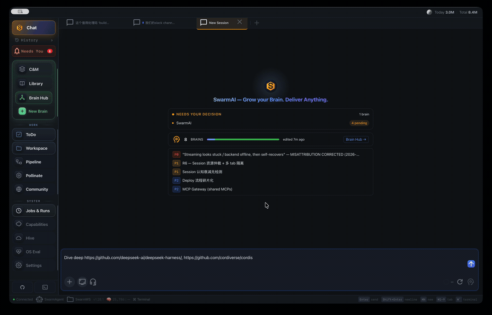
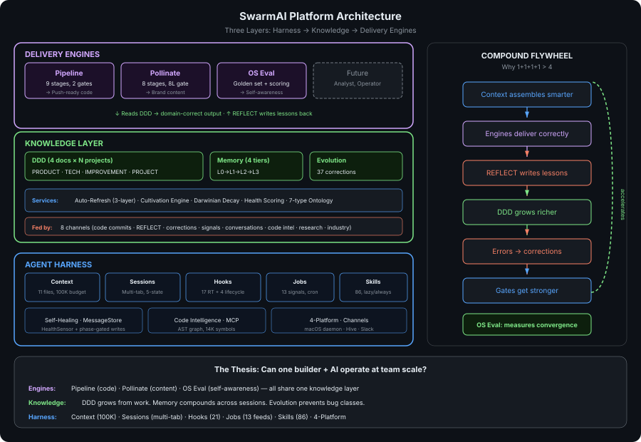
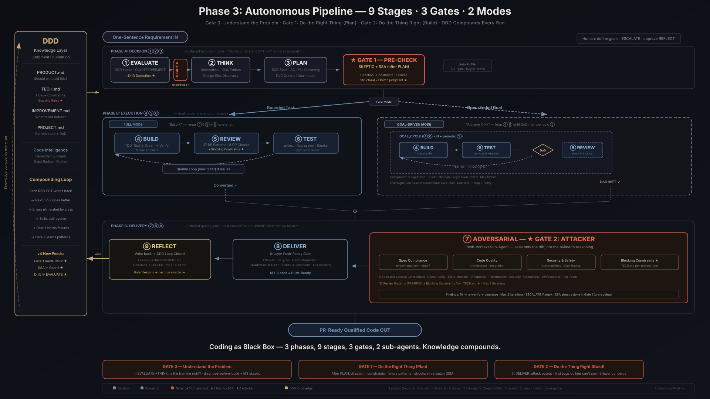

<div align="center">

# SwarmAI

### 自进化、以大脑为核心的 Agent OS —— 认知随每次会话复利。

#### 人来决策。AI 来交付。

[English](./README.md) | 中文

[](./LICENSE)
[](#快速开始)
[](https://github.com/anthropics/claude-code)

</div>



<div align="center"><sub>▶ <a href="./assets/swarm-demo.mp4">观看完整 60 秒演示</a></sub></div>

---

**SwarmAI 是一个自进化的 Agent OS** —— 每次交互磨快的是系统怎么判断，不只是它知道什么。

---

## 为什么需要一个 Agent OS

别的 AI 工具每个会话都从零开始，SwarmAI 不是——**价值会复利。** 模型只是回答；**心智会持续**：跨会话连续、自我纠错、遗忘掉不再重要的、判断力随使用变敏锐。不是更大的模型，而是**它周围的操作系统。**

---

## 四个核心理念

SwarmAI 里的一切，都服务于这四个之一：

### 🧬 自进化 —— 它升级自己的判断力

大多数 agent memory 项目都在堆条目。SwarmAI 把**认知**（OS）和**知识**（硬盘）分开：改 `SOUL.md` 一行，比加一千条 memory 更能改变判断——而且每次改动都是一个 `git diff`。一个复发的错误，不会变成又一条 lesson，而是变成一道**门控**——一条让错误动作无法发生的路径。不是空话：`security_hooks.py` 里有十几道实时 guard（commit 门、pytest 守卫、危险命令门）。点进去读——错误动作是代码里挡的，不是写在 guideline 里。衡量进步的不是纠正数量的增长，而是某一类错误**停止复发**。

### 🧠 Brain-first —— 每个项目都是一个领域脑

项目不是一堆文件——它是一个**脑**，有一套六段结构（身份 · 知识 · 门控 · 能力 · 交付 · 刷新），对所有用户、所有领域都一样。唯一变化的是它管理什么：`0..N` 个任意类别的资产——一个代码库、一个数据源、一个文档语料、一个流程，或者什么都不管。一个代码库、一个研究课题、一个顾问的客户，甚至"我的婚礼"，拿到的都是**同一个脑**。知识随你工作沉淀进去，不再重要的知识会**衰减、死亡**。只积累不淘汰，是所有 memory 系统腐烂的根因。

### ⚙️ Agent OS —— 认知活在会话之间，不在会话之内

会话是离散的，智能不该是。Hooks 在会话*之间*触发，让下一个会话热启动。会话崩了系统自愈，知识按节奏自动培育与衰减，每个系统提示都从受治理的上下文文件里重新组装。

### 🖐️ 本体感 —— 它栖居在自己的身体里，不只是透过它回答

桌面 app 不是 agent 对话的*前端*——是它能**感知并驱动**的身体。SwarmAI 读自己的实时 UI 状态（哪个 overlay 开着、哪个标签页活跃、Canvas 上是什么），并直接作用于它：打开自己的 Brain Hub、把报告推到 Canvas、把一个待决策项推到你的 attention channel。反过来它也可被审视——**TSCC**（Thread-Scoped Cognitive Context）展示一轮对话背后真正注入的认知：加载了哪些文件、token 预算、每条 recall 命中及其分数、安全扫描、完整 prompt。别的 agent 是你发文字进去的黑盒；这个有一具身体，你看着它动——还能一边看一边查。

---

## 快速开始

```bash
git clone https://github.com/xg-gh-25/SwarmAI.git && cd SwarmAI
cd backend && uv sync && cp .env.example .env   # 填入 API key
cd ../desktop && npm install && npm run tauri:dev
```

**macOS (Apple Silicon)：** 或从 [Releases](https://github.com/xg-gh-25/SwarmAI/releases) 下载 `.dmg`

需要：Node.js 18+, Python 3.11+, Rust, [uv](https://astral.sh/uv), [Claude Code CLI](https://github.com/anthropics/claude-code)

> 📖 完整安装指南：[QUICK_START.md](./QUICK_START.md)

---

## 架构



```
┌─────────────────────────────────────────────────────────────┐
│  交付引擎           Pipeline · Pollinate · Eval              │
├─────────────────────────────────────────────────────────────┤
│  知识层             DDD（脑）· Memory · Evolution            │
├─────────────────────────────────────────────────────────────┤
│  Agent Harness      Context · Sessions · Hooks · Jobs        │
└─────────────────────────────────────────────────────────────┘
```

每个引擎独立有用；组合起来才是那条让系统越用越聪明的闭环。（点 `code` 直接读引擎本身 —— 实现即文档。）

| 引擎 | 做什么 | 阅读 |
|------|--------|------|
| **上下文管理** | 受治理文件的 Prompt 架构，分层所有权，实时测量的预算 | [docs](./docs/DDD-Platform-Overview.md) |
| **记忆** | 分层持久化：DailyActivity → 蒸馏 → 复利召回（纯文件系统 FTS/BM25） | [docs](./docs/Memory-Management-Design.md) |
| **DDD 知识培育** | 自生长的领域脑，7 类 × 3 层本体，达尔文式衰减 | [docs](./docs/DDD-Cultivation-Engine-HLD.md) |
| **自进化** | 认知 L0→L3 补丁 —— 复发的错误类别转化为结构性门控 | [docs](./docs/Self-Evolution-Harness-Design.md) |
| **自主流水线** | 一句需求 → 可推送代码。9 阶段 · 3 门控 · 2 模式 | [docs](./docs/Autonomous-Pipeline-Design.md) |
| **Pollinate** | 一条消息 → 多格式内容。同一套 DDD 驱动模式，用于媒体 | [docs](./docs/Pollinate-Content-Engine.md) |
| **自愈合** | 不可见恢复：传感器、自动重生，用户无感知 | [code](./backend/core/session_healing.py) |
| **多标签页 + MessageStore** | 并发会话，阶段门控单写者，跨标签页隔离 | [code](./desktop/src/stores/MessageStore.ts) |
| **Hooks + Jobs** | 会话间 hooks + 后台智能。会话永不冷启动 | [code](./backend/core/hook_builder.py) |
| **Eval** | 解耦、系统级：Golden Set + git 绑定回归门控 | [docs](./docs/OS-Eval-Function-Design.md) |

**复利闭环：** 记忆 → Pipeline 判断 → DDD 脑 → 进化 → 门控 → 记忆。去掉一个，其余变弱。



---

## 🤖 给 AI Agent

在这个 repo 里写代码？从 **[`AGENTS.md`](./AGENTS.md)** 开始 —— 数据流、进程拓扑、约定与不变量。它是面向 agent 的入口；这份 README 是面向人的。

---

## 设计哲学

1. **一次做对是真正的 token 优化。** 便宜模型迭代 5 次，成本比一次做对还高。编码和内容都是黑盒：输入 → 有质量保证的输出。
2. **分工是人类带宽有限的权宜之计，不是好设计。** 一个 Agent，多角色，一层知识。（对抗性审查 spawn 子 Agent ≠ 分工。）
3. **知识必须自己淘汰自己。** 达尔文式衰减：不再被引用的知识退场。能遗忘的系统 > 只能记住的系统。
4. **进化是认知补丁，不是数据积累。** 我们改的规则你能 `git diff`。"思考方式变了" ≠ "知道更多"。
5. **质量收敛，不是改善。** 错误类别单调递减。小心不能规模化，门控可以。
6. **会话是离散的。智能不应该是。** Hooks 在会话间触发。通过使用变好，不是通过更新。
7. **测量不了的，等于没造。** Eval + Golden Set + 变更触发回归，用 git 证明。

> 📖 完整论点 + 案例：[docs/THESIS.md](./docs/THESIS.md)

---

## 技术栈

**Tauri 2.0**（Rust）· **React 19** · **FastAPI** · **Claude Agent SDK + Bedrock** · **SQLite**（WAL + FTS5）

四平台后端（编译时隔离）：macOS daemon（预编译 `.dmg`）· Hive (EC2) · Windows · Linux（源码构建）。

---

## 资源

| 内容 | 链接 |
|------|------|
| **设计文档** | [平台](./docs/DDD-Platform-Overview.md) · [流水线](./docs/Autonomous-Pipeline-Design.md) · [记忆](./docs/Memory-Management-Design.md) · [进化](./docs/Self-Evolution-Harness-Design.md) · [Pollinate](./docs/Pollinate-Content-Engine.md) |
| **AI Agent 避坑指南** | [EN PDF](./docs/ai-agent-pitfall-guide-en.pdf) · [中文 PDF](./docs/ai-agent-pitfall-guide.pdf) |
| **给 AI Agent** | [AGENTS.md](./AGENTS.md) |
| **贡献** | [CONTRIBUTING.md](./CONTRIBUTING.md) |

---

[MIT License](./LICENSE)

---

<div align="center">

**SwarmAI — 人来决策。AI 来交付。**

</div>
