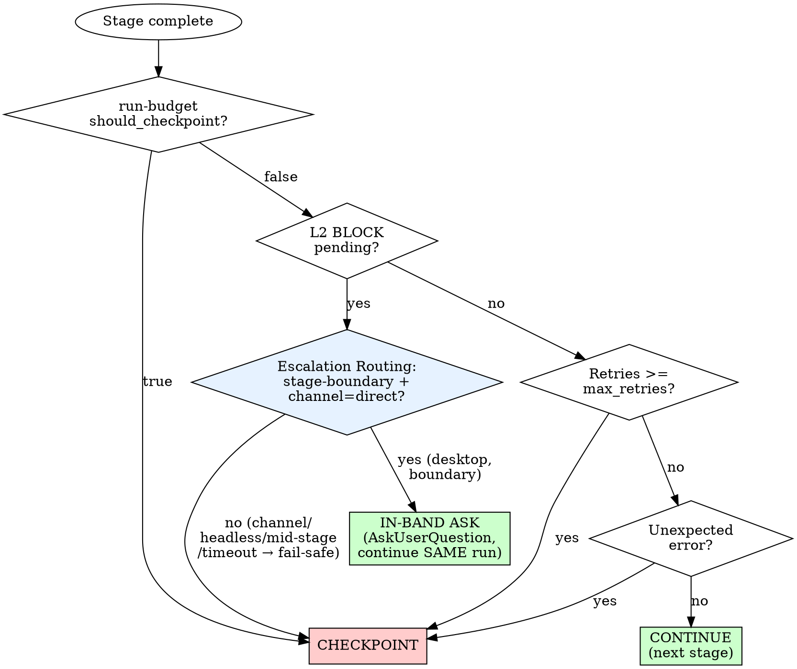

# Pipeline Orchestrator

Drive the full lifecycle pipeline from requirement to delivery. You ARE the
orchestrator -- execute each stage's behavior inline within this session, don't
invoke separate skills.

## Core Loop

For every pipeline run, follow this loop:

```
1. INIT     -- parse requirement, detect project, load or create pipeline run
2. PROFILE  -- select pipeline profile (full/trivial/research/docs/bugfix/goal)
3. STAGE    -- for each stage in profile (evaluate → ... → deliver → reflect):
               a. Feedback Loop preamble (SIGNAL/CHECK/FAIL for this stage)
               b. Gate check (budget, escalations, retries)
               c. Load stage context (DDD docs + upstream artifacts)
               d. Execute stage behavior (read stage doc, then execute)
                  └─ ★ Gate 0 fires INSIDE evaluate (diagnose-before-build family);
                     ★ Gate 1 fires after plan, before build (Skeptic + SSA)
               e. Classify decisions (mechanical/taste/judgment)
               f. Verify output (artifact published + schema valid)
               g. Handle result (advance / retry / checkpoint)
4. DELIVER  -- Delivery Gate → Completion Audit → AC Verification →
               ★ Gate 2: Adversarial Review (spawn sub-agent) →
               Quality Convergence Loop (6-layer gate × max 3 iterations) →
               push-ready or escalate. Then: Report, CI.
5. REFLECT  -- Read stages/reflect.md, execute: lessons → IMPROVEMENT.md → DDD loop closed
6. COMPLETE -- read stages/complete.md (output format), summarize, record metrics, final run state
```

---

## Step 1: INIT

### Starting a New Pipeline

Parse the user's message to extract:
- **Requirement:** one sentence to one paragraph describing what to build
- **Project:** detect from context (file paths, explicit mention, chat binding)

If no project detected, confirm with the user. Pipeline needs a project for
artifact storage (L1+).

**Create the pipeline run:**

```bash
# Check current state + existing paused pipelines
python backend/scripts/artifact_cli.py state --project <PROJECT>
python backend/scripts/artifact_cli.py discover --project <PROJECT> --types checkpoint --full
```

If a paused pipeline exists for this project, ask: "Resume the existing pipeline
or start a new one?"

**Use `run-create` to initialize** (NEVER write run.json manually):

```bash
python backend/scripts/artifact_cli.py run-create \
  --project <PROJECT> \
  --requirement "<parsed requirement>"
```

This creates `Projects/<project>/.artifacts/runs/<run_id>/run.json` with proper
defaults, sets status=running, auto-abandons stale same-project runs (>2h), and
returns the run_id. Profile is set later after EVALUATE classifies scope.

**Briefing (emit at INIT — orient the user before any work runs).** The profile is
not known until EVALUATE classifies scope, so emit the run header now and the
profile/mode line the moment EVALUATE returns (Step 2). Tell the user *what is
about to run and why*, not just that it started:

```
🚀 Pipeline started: <requirement> (run_<id>) · Project: <PROJECT>

   Architecture: 3 gates · 9 stages · 2 execution modes
   • Gate 0 (EVALUATE→THINK) — is the problem/framing understood? (diagnose-before-build family)
   • Gate 1 (after PLAN)      — is the plan sound, root not symptom? (Skeptic + SSA)
   • Gate 2 (in DELIVER)      — is the build actually correct? (Adversarial sub-agent)
   Profile: <set after EVALUATE> · Mode: <full = one-shot | goal = iterative loop>
```

After EVALUATE selects the profile (Step 2), state it explicitly with the reason:
```
   Profile: <profile> (scope=<scope>) — <one-line why, e.g. "standard feature → full">
   Mode: <full: BUILD→REVIEW→TEST once | goal: goal_cycle iterates to a measurable DoD>
   Stages this run: <the profile's stage list>
```

**Profile vs mode (don't conflate):** there are **6 profiles** (full, trivial,
research, docs, bugfix, goal — the *stage set* + rigor, table in Step 2) and **2
execution modes** (full = one-shot, goal = iterative; how BUILD/REVIEW/TEST run).
Every profile passes through the 3 gates that apply to its stages.

### Resuming a Pipeline

When the user says "resume pipeline" or drags a pipeline Radar todo:

1. Read the checkpoint artifact: `discover --types checkpoint --full`
2. Load `runs/<id>/run.json` via `run-get`
3. Check pending escalations -- if any still open, report and wait
4. Skip completed stages, resume from the checkpoint stage
5. Announce:
```
Pipeline RESUMED: <requirement> (run_<id>)
Completed: evaluate, think, plan
Resuming from: build
```

---

## Step 2: PROFILE

After the evaluate stage runs (or from checkpoint), select the pipeline profile
based on the evaluation's scope classification:

| Scope | Profile | Stages |
|-------|---------|--------|
| standard, complex | **full** | evaluate, think, plan, build, review, test, deliver, reflect |
| trivial | **trivial** | evaluate, think, build, review, test, deliver, reflect |
| research-only | **research** | evaluate, think, reflect |
| docs-only | **docs** | evaluate, think, plan, deliver, reflect |
| bugfix | **bugfix** | evaluate, think, plan, build, review, test, deliver, reflect |
| goal | **goal** | evaluate, think, plan, goal_cycle, deliver, reflect |

> **Why ≤8 stage entries, not 9?** The canonical architecture is **9 stages across
> 3 gates** (EVALUATE → THINK → PLAN → BUILD → REVIEW → TEST → ADVERSARIAL → DELIVER
> → REFLECT). Two of those "steps" are not separate orchestration rows:
> - **ADVERSARIAL** is architecturally stage 7 but executes *inside DELIVER* (spawn
>   fresh-context sub-agent), a mandatory blocking gate — so it never appears as its
>   own row in a profile's stage list. See `stages/deliver.md` § "Adversarial Review
>   Gate (BLOCKING)". This is why `full` lists 8 entries while docs say "9 stages".
> - **Gate 0** — the diagnose-before-build family (Understanding + Ambiguity scan +
>   greenfield Working-Backwards) is not a stage at all; it fires *inside EVALUATE*,
>   at the EVALUATE→THINK boundary. Code-enforced by `pipeline_validator.py` at
>   publish time. See TECH.md "diagnose-before-build gate family" + `stages/evaluate.md`.
>
> `COMPLETE` (Step 6 — read `stages/complete.md`) is the terminal *output-format* step,
> not a quality stage, so it is not counted in the 9. So a profile's stage list shows
> the orchestration steps (≤8); the 3 gates (Gate 0 in EVALUATE, Gate 1 after PLAN,
> Gate 2 in DELIVER) ride *within* them. `★ Gate 1`/`★ Gate 2` are wired into the
> ④/⑧ landmarks, GS021, and tests — do not renumber them; `★ Gate 0` is the
> EVALUATE-stage landmark.

### Profile Selection Principle

**Full vs Goal** — both have all stages. The only difference is execution mode:
- **Full:** BUILD runs once → REVIEW once → TEST once → DELIVER. One-shot.
- **Goal:** goal_cycle loops BUILD+TEST per cycle, periodic REVIEW, final adversarial
  inside goal_cycle, then exits to DELIVER → REFLECT.

**When to use Goal — the defining test is ITERATION-toward-a-moving-target, NOT
mere verifiability:**
- A **metric/threshold** to reach (coverage ≥90%, latency <X), OR a **bulk sweep**
  (fix all N warnings, migrate all call sites), OR **convergence** where you can't
  predict how many changes upfront.
- ⚠️ "A command exits 0 when done" is NOT a goal signal by itself — *almost every*
  change can be wrapped in an exit-0 check. That over-broad heuristic is what
  mis-routed a 3-line fix to goal (the heaviest profile, run_ae689ce0). The
  question is whether you must ITERATE, not whether the result is checkable.

**When to use Full (the default for a bounded change):**
- "Done" is the **artifact existing and passing review** — feature implemented,
  code committed, tests pass. The deliverable IS the proof. ONE known change, even
  if a test verifies it, is full (or bugfix/trivial if it matched those size gates).
- The work is **bounded** — you know the approach, the files, the shape of done.

**Prefer the lightest profile that fits** (docs/trivial/bugfix before full before
goal). The decision tree in `stages/evaluate.md` evaluates the size/bug gates
FIRST and goal LAST, on purpose — don't reach for goal because the outcome happens
to be test-checkable.

If the evaluate stage doesn't classify scope, default to **full**.
The user can override: "skip research, I know the approach" → switch to bugfix.
The user can force: "use goal" or "use full pipeline" → override detection.

### Goal Profile Orchestration

Goal has the **same stages as full** — the difference is execution mode.
Where full does BUILD→REVIEW→TEST once, goal loops them inside goal_cycle:

1. **EVALUATE** — standard + goal_mode detection (DoD criteria, max_cycles)
2. **THINK** — standard (research alternatives, risk probes)
3. **PLAN** — standard (defines approach for achieving the goal)
4. **GOAL_CYCLE** — loops internally (replaces BUILD+REVIEW+TEST):
   - Each cycle: budget gate → DoD check → pick step → BUILD+TEST → progress → mini-reflect
   - Periodic REVIEW every N cycles on accumulated diff
   - Final ADVERSARIAL on total changeset when DoD met
   - See `stages/goal_cycle.md` for complete behavior
5. **DELIVER** — standard (packaging, report, CI push)
6. **REFLECT** — standard (DDD loop closure, reads mini-reflects from progress file)

Quality assurance in goal_cycle (replaces full's single-shot gates):
- Per-cycle TEST (immediate regression check)
- Periodic REVIEW (convention/pattern compliance on accumulated diff)
- Final ADVERSARIAL (fresh-eyes attack on total changeset, code-enforced gate)

**Scheduled mode** (for goals spanning multiple sessions):
After EVALUATE+PLAN, if the user requests overnight/unattended execution or
EVALUATE estimates >10 cycles needed, offer scheduled mode:

```yaml
# Job template for scheduled goal execution
jobs:
  - id: goal-<slug>
    name: "<goal description>"
    type: agent_task
    schedule: "0 */4 * * *"
    enabled: true
    config:
      prompt: |
        Resume goal loop for <PROJECT>.
        Progress: <progress_path>
        1. Read progress → 2. Check DoD (if met: disable job, notify)
        3. Execute ONE cycle → 4. Save progress → exit
    safety:
      max_budget_usd: 1.50
      timeout_seconds: 600
```

---

## Step 3: STAGE EXECUTION

For each stage in the selected profile, execute in order.

### Stage Feedback Loop (Per-Stage Preamble)

**Before executing each stage, establish its feedback loop:**

```
1. SIGNAL — What observable output proves this stage succeeded?
   (artifact published, test passing, file exists, command returns expected)
2. CHECK  — How do I verify the signal is real, not assumed?
   (grep for the artifact, run the test, Read the file, execute the command)
3. FAIL   — What does failure look like? (Define explicitly so I recognize
   it immediately instead of rationalizing partial success)
```

**Why this exists:** Bugs become mechanical work when you build the right
feedback loop BEFORE executing. Without pre-defined signals, stages pass on
"vibes" — the builder FEELS done but has no external evidence. With signals,
every stage has a verifiable exit criterion that transforms quality from
probabilistic to deterministic.

**Example (BUILD stage):**
- SIGNAL: All acceptance criteria have a passing test (`pytest -k test_<feature>` exits 0)
- CHECK: Run the test. Read the output. Green = signal confirmed.
- FAIL: Any test red, any criterion without a test, any test that tests the wrong thing.

**Example (REVIEW stage):**
- SIGNAL: 0 high/medium findings (confidence >= 7) in the specialist review outputs
- CHECK: Count findings by severity after confidence gating in merged results
- FAIL: Any finding severity >= medium with confidence >= 7, or specialist returned vague non-findings

**Output the SIGNAL/CHECK/FAIL as inline text in chat** before executing the
stage. This makes the loop inspectable — the user can correct wrong signals
before you spend tokens executing against them.

This preamble takes 30 seconds. It prevents 30 minutes of rework. The loop is
not bureaucracy — it is the cheapest insurance against "tests pass but feature
doesn't work" (C011 pattern).

---

### 3a. Gate Check

Before executing, check:

```
1. Retry exhaustion?  → if stage retry_count >= max_retries → CHECKPOINT
2. Pending L2 BLOCK?  → route via Escalation Routing Protocol (do NOT bare-checkpoint
   without checking channel=). NOTE: a pending L2 that ALREADY fell back to checkpoint
   (recorded in run.json) stays checkpointed on resume — it is NOT re-asked in-band
   (the human consumes the recorded decision before resuming). Only a freshly-raised
   boundary L2 in a desktop session is in-band eligible.
3. Pipeline cancelled? → EXIT
```

**Max retries per stage:**

| Stage | Max Retries |
|-------|-------------|
| evaluate | 2 |
| think | 2 |
| plan | 2 |
| build | 3 |
| review | 2 |
| test | 3 |
| deliver | 1 |
| reflect | 1 |

### 3b. Load Stage Context

**DDD documents (stage-scoped):**

| Stage | DDD Docs to Read |
|-------|-----------------|
| evaluate | PRODUCT.md, TECH.md, IMPROVEMENT.md, PROJECT.md |
| think | PRODUCT.md, IMPROVEMENT.md |
| plan | PRODUCT.md, PROJECT.md |
| build | TECH.md, PROJECT.md |
| review | TECH.md, IMPROVEMENT.md |
| test | TECH.md, IMPROVEMENT.md |
| deliver | PROJECT.md |
| reflect | IMPROVEMENT.md |

Read the listed DDD docs from `Projects/<PROJECT>/`. Skip any that don't exist
or contain only template placeholders.

**Progressive loading (T6):** For docs marked as "Large" in PROJECTS.md (with
section TOC), DON'T read the full file. Instead: read only the section(s)
relevant to THIS stage's task using `offset/limit` with the line ranges shown
in PROJECTS.md. Example: BUILD stage working on session code → read TECH.md
`Key Subsystems` section (L118-L958), not the full 1223-line file.

**Upstream artifacts (Output Routing — BLOCKING):**

Each stage has declared inputs it MUST consume. The validator (Check 13) enforces
this — if `consumed_artifacts` is present in the stage record but doesn't include
a declared input type, the stage is BLOCKED.

```bash
python backend/scripts/artifact_cli.py discover --project <PROJECT> --types <comma-separated> --full
```

| Stage | Must Consume (STAGE_ROUTING) | Must Produce |
|-------|------------------------------|--------------|
| evaluate | — | evaluation (+ `understanding` block — Understanding Gate, below; + `cross_boundary` flag — evaluate.md § Cross-Boundary Classification) |
| think | evaluation (`understanding` must be SUPPORTED) | research |
| plan | evaluation, research | design_doc |
| build | design_doc | changeset |
| review | changeset | review |
| test | changeset, review | test_report (+ `cross_boundary_e2e` when EVALUATE set `cross_boundary=true` — test.md Layer 4) |
| deliver | changeset, review, test_report | delivery |
| reflect | test_report, delivery | — |

**CRITICAL: Record consumed artifacts in stage record.**

After loading each upstream artifact via `discover`, record it in the stage record's
`consumed_artifacts` field. This enables routing enforcement (Check 13) and freshness
tracking. Format:

```json
{
  "stage": "review",
  "consumed_artifacts": [
    {"type": "changeset", "id": "art_abc123", "created_at": "2026-05-17T..."}
  ]
}
```

Pass this via `--stage-json` when recording stage completion:
```bash
python backend/scripts/artifact_cli.py run-update --project <PROJECT> --run-id <RUN_ID> \
  --stage-json '{"stage":"<STAGE>","status":"completed","stage_doc_consumed":true,...,"consumed_artifacts":[{"type":"<TYPE>","id":"<ART_ID>"}]}'
```

If an upstream artifact is **stale** (DDD docs changed since it was created, or
age > 7 days), the validator will WARN. You may still proceed — staleness is a
signal, not a blocker — but acknowledge it in your stage notes.

#### Understanding Gate (EVALUATE→THINK boundary — ALL work types)

THINK (proposing *how* to fix/build) **cannot load** until EVALUATE produces an
observation-backed, refuted **understanding of the present**. This generalizes
the old bug-only REPRO gate to every work type — the form of evidence varies
(code-trace for existing-feature, repro for bugfix, characterization for
refactor, premortem for greenfield/research), the gate is universal. See
`stages/evaluate.md` § "Understanding Gate" for the `understanding` block shape,
the work-type evidence table, and the M1/M2/M3 mechanisms.

Code-enforced at publish time by `pipeline_validator.validate_artifact_data`:
strict profiles (full/bugfix/goal) BLOCK without an `understanding` block carrying
real `evidence` ("Understanding gate:" marker); M1 blocks a solution-language
`claim`, M2 blocks an unresolved hedge. Bug-class evals may use the legacy
`observation_evidence` alias (keeps the "REPRO gate:" marker). Relaxed profiles
(trivial/docs/research) aren't forced to carry the block, but a present block is
still scanned. M3 (the skeptic sub-agent) is behavioral, spawned in evaluate.md.

### 3c. Execute Stage Behavior

**BLOCKING: Before executing ANY stage, you MUST Read ALL files listed
in the "Read" column below.** Skipping a file = skipping the stage's
quality gate = pipeline invariant violation. This is not optional.

All stage docs are in `backend/skills/s_autonomous-pipeline/stages/`.
Read from `backend/skills/` (source of truth), NOT `.claude/skills/`
(projected copy — may be stale within the same session).

| Stage | Read (BLOCKING) | Scripts to Run |
|-------|----------------|----------------|
| evaluate | `stages/evaluate.md` | — |
| think | `stages/think.md` | — |
| plan | `stages/plan.md` | — |
| build | `stages/build.md` | — |
| review | `stages/review.md` AND `REVIEW_PATTERNS.md` AND `OPERATIONAL_PATTERNS.md` | — |
| test | `stages/test.md` | `scripts/wtf_gate.py` |
| deliver | `stages/deliver.md` | — |
| reflect | `stages/reflect.md` | — |
| complete | `stages/complete.md` (Step 6 — output format spec; fresh-read at the decision point) | — |

After reading, execute the stage behavior inline in this session.
DO NOT invoke sibling skills via slash commands — you ARE the pipeline.

### 3d. Classify Decisions

**Every non-trivial decision during stage execution MUST be classified:**

| Classification | Definition | Action | Example |
|---|---|---|---|
| **Mechanical** | One correct answer, deterministic | L0 INFORM, auto-approve | "Use pytest (pyproject.toml)" |
| **Taste** | Reasonable default, human might differ | L1 CONSULT, accumulate for delivery gate | "Monolith over microservice for solo dev" |
| **Judgment** | Genuinely ambiguous AND hard to reverse, needs human | L2 BLOCK → **route via Escalation Routing Protocol** (in-band ask if `channel=direct`, else checkpoint) — do NOT auto-checkpoint | "This changes the public API" |

Log each decision in the pipeline run state:
```json
{
  "stage": "build",
  "description": "Used sync retry instead of async",
  "classification": "taste",
  "reasoning": "Matches existing codebase style, simpler, but async would be more correct"
}
```

### 3e. Verify Stage Output (Pipeline Validator)

After execution, run the **pipeline validator** to structurally enforce invariants:

```bash
python backend/scripts/pipeline_validator.py check \
  --project <PROJECT> --run-id <RUN_ID> --stage <STAGE>
```

This checks 8 invariants automatically:

| # | Check | Severity | What It Catches |
|---|-------|----------|-----------------|
| 1 | **Stage order** | BLOCK | Skipped stages, out-of-order execution |
| 2 | **Artifact exists** | BLOCK | Missing artifact publish (except reflect) |
| 3 | **Artifact schema** | BLOCK/WARN | Required fields missing (BLOCK), recommended missing (WARN) |
| 4 | **Decision logged** | WARN | No decisions classified (except reflect/deliver) |
| 5 | **Budget recorded** | WARN | token_cost is 0 — needed for calibration |
| 6 | **Profile respected** | BLOCK | Stage not in selected profile |
| 7 | **DDD consistency** | WARN | Non-goals vs TECH.md architecture conflict, failed patterns not recorded, missing DDD docs, staleness since last run. Runs at EVALUATE stage only. |
| 8 | **Semantic depth** | WARN | BUILD: smoke_tests > 0 when files > 1; REVIEW: integration_trace checked > 0 |

**Response format:**
```json
{"valid": true, "stage": "evaluate", "errors": [], "warnings": [...],
 "checks_passed": 8, "checks_total": 8}
```

> ⚠️ **`checks_passed` is NOT a quality score — read `errors`/`warnings`, not the count
> (F4, run_57929039).** The ADVISORY checks (4 Decision-logged, 5 Budget-recorded, and
> the other WARN-severity checks) **always credit `checks_passed` whether they pass or
> fail** — they only ever append a WARNING, never reduce the count. So
> `checks_passed == checks_total` is the NORMAL state even when advisory checks flagged
> issues; it means "no BLOCKING (hard) check failed", NOT "everything is clean". The
> real signals are: `valid: false` OR a non-empty `errors[]` (a hard BLOCK), and the
> `warnings[]` list (advisory issues to weigh). Never gate on the count itself (P6:
> the metric is not the outcome).

**IMPORTANT: Write checksums to run.json after EVALUATE.**
After the EVALUATE stage completes successfully, run `ddd-check` and store the checksums
in the run state so future staleness detection works:
```bash
# Get current checksums and write to run.json in one step
CHECKSUMS=$(python backend/scripts/pipeline_validator.py ddd-check --project <PROJECT> | python -c "import sys,json; print(json.dumps(json.load(sys.stdin)['checksums']))")
python backend/scripts/artifact_cli.py run-update --project <PROJECT> --run-id <RUN_ID> --ddd-checksums "$CHECKSUMS"
```

**Standalone DDD check** (no pipeline needed):
```bash
python backend/scripts/pipeline_validator.py ddd-check --project <PROJECT>
```
Returns non-goals, failed patterns, doc checksums, and any cross-doc warnings.

**Staleness check** (which completed runs are based on outdated DDD docs?):
```bash
python backend/scripts/pipeline_validator.py ddd-staleness --project <PROJECT>
```
Returns stale_runs (docs changed), fresh_runs (matching), untracked_runs (no checksums stored).
Exit code 1 if any stale runs found — useful for CI gates.

**Handle the result:**
- `valid: true` → advance to next stage. Log any warnings for delivery report.
- `valid: false` → fix the errors before advancing:
  - Missing artifact? Publish it.
  - Schema violation? Update the artifact data.
  - Stage order? You skipped a stage — go back.
  - Profile violation? Wrong stage for this profile — skip it.
- If fix attempts >= max_retries → **checkpoint** with all failure details.

**Full-run validation** (use at pipeline end or for debugging):
```bash
python backend/scripts/pipeline_validator.py summary \
  --project <PROJECT> --run-id <RUN_ID>
```

### 3f. Handle Result

After verification:

- **All mechanical decisions → advance** to next stage
- **Taste decisions found → log them**, advance (review at delivery gate)
- **Judgment decision → route via Escalation Routing Protocol** immediately (in-band ask if `channel=direct` + header present; else fallback checkpoint — do NOT default to bare checkpoint)

---

## Step 4: DELIVER (includes Quality Convergence Loop)

The DELIVER step has 4 phases executed in order:
1. **Taste Decision Gate** — batch review of accumulated taste decisions
2. **Deliver stage execution** — read `stages/deliver.md`, run Completion Audit + Adversarial Review
3. **Quality Convergence Loop** — 6-layer push-ready gate, iterate until converged or escalate
4. **Report & CI** — generate REPORT.md, push-ready verdict, final artifacts

---

### 4a. Taste Decision Gate

BEFORE executing deliver stage behavior, collect ALL taste decisions from ALL
prior stages and present them as a batch:

```
DELIVERY GATE -- <N> taste decisions for review:

  1. [THINK, T6]  Chose httpx built-in retry over tenacity (simpler, fewer deps — T6: simplest wins when tooling commoditizes)
  2. [BUILD]      Used sync retry instead of async (matches existing codebase style)
  3. [REVIEW, T5] Skipped type stub generation (low value for internal module — T5: encode judgment not ceremony)

  [Approve All]  [Override #1]  [Override #2]  [Override #3]  [Discuss]
```

**Thesis tagging:** When a taste decision is informed by a thesis from `Knowledge/Learned/THESIS.md`, tag it with `[STAGE, Txx]`. This makes taste decisions auditable — future review can trace why a choice was made. Not every taste decision maps to a thesis; only tag when the connection is real.

**If no taste decisions accumulated:** skip the gate, proceed to delivery.

**If user approves all:** proceed to delivery.

**If user overrides any:** re-run the affected stage with the override as a
constraint. This may cascade (overriding a THINK decision re-runs THINK, which
may change PLAN, which changes BUILD). Re-run the minimum set of affected
downstream stages.

**If user wants to discuss:** enter conversational mode. Once resolved, resume.

---

### 4b. Deliver Stage Execution

Read and execute `stages/deliver.md` inline. This runs:
- Fresh User Audit (P6)
- Completion Audit (verify deliverables match requirement)
- Adversarial Review Gate (spawn sub-agent — see deliver.md for profile-aware tiering)
- Meta-Review: "What did the pipeline miss?" (operational blind spot analysis)
- Push-Ready Gate (binary: push-ready / not-push-ready)

The adversarial review in deliver.md is the FIRST pass — it produces the initial
set of findings. The Quality Convergence Loop below re-verifies after fixes.

---

### 4c. Quality Convergence Loop

After deliver stage execution produces a delivery candidate (code written, tests
pass, adversarial review done, meta-review complete), the Quality Convergence Loop
evaluates whether the candidate is truly push-ready — and iterates until it is,
or escalates.

**This is NOT a separate pipeline stage.** It does not produce its own artifact,
does not appear in the profile stage list, and is not checked by the validator.
It is an internal sub-loop of the DELIVER step that bridges "delivery candidate"
to "push-ready."

#### The 6-Layer Push-Ready Gate

ALL 6 layers must pass simultaneously. A candidate that passes 5/6 is not push-ready.

| Layer | What It Checks | How to Verify |
|-------|----------------|---------------|
| L1: Tests Pass | All new + existing tests green | `pytest --timeout=60` exits 0 |
| L2: Type-Safe | No type errors, linter clean | Type checker + linter (if configured) |
| L3: No Regressions | Pre-existing tests still pass | Run dependent test files (grep -rl pattern) |
| L4: Adversarial Clean | No critical/medium findings from deliver.md review | All findings fixed or explicitly accepted |
| L5: DDD Conformance | No violation of TECH.md constraints or IMPROVEMENT.md anti-patterns | Mechanical checklist extraction + per-item verification (see below) |
| L6: Decisions Resolved | All taste/judgment decisions surfaced | Decision log complete, no hidden choices |

**L4 clarification:** The specialist sub-agents were already spawned in 4b (deliver
stage). L4 checks whether all their findings are resolved. Only re-spawn
specialists if a convergence fix changes code that the original review didn't cover.

**L4 verify-against-disk (BLOCKING — never trust the `resolved` flag):** For each
finding marked `resolved: true`, do NOT take the flag's word for it — confirm the
fix is actually on disk. The artifact's `resolved` field records intent ("I
applied the fix"), not state ("the fix is on disk"). These diverge whenever a fix
is reverted between application and delivery — e.g. an external `git stash pop`, a
parallel-session commit, or a linter undo. run_b5592983 shipped a delivery
artifact marked `resolved: true` for a hardening fix that a mid-pipeline git
conflict had silently reverted; the function had no test coverage, so nothing else
caught it. PE review found it by reading the file.

**Now code-enforced (Run B, run_c5935199).** Attach a structured `disk_check` to
each resolved finding and the validator (`_verify_findings_on_disk`, called at BOTH
the publish-time and completion-time gates, R27) greps it for you — a BLOCK the
model cannot rationalize past:

```json
"findings": [{
  "severity": "HIGH", "resolved": true,
  "finding": "core/foo.py bar() line 42: missing null guard. Fixed: added guard.",
  "disk_check": {"file": "/ABS/path/to/core/foo.py", "must_contain": "if x is None: return"}
}]
```

- `disk_check.file` MUST be an **ABSOLUTE** source path. Findings reference the
  SOURCE repo, but the validator's workspace root is `~/.swarm-ai/SwarmWS` (the
  C040 source-vs-workspace split) — a relative path would be resolved against the
  wrong tree and false-block. A relative/empty path is a WARN, not a check.
- `must_contain` — for a fix that ADDED code: string ABSENT from the readable file
  → **BLOCK** (fix reverted). Use the durable line the fix introduced.
- `must_not_contain` — for a fix that REMOVED/refactored code: string STILL PRESENT
  → **BLOCK**. A deleted file passes vacuously.
- Fail-open on uncertainty: missing file (for must_contain) / unreadable / binary /
  oversized → **WARN, never BLOCK** (a locus we can't verify is "can't check", not
  "reverted" — never false-block a CI or other-machine run).
- A resolved HIGH/CRITICAL finding with NO `disk_check` → **WARN** (nudge to add
  one); LOW/unstructured findings are silent (no WARN-storm).

Cost: seconds per finding; the failure it prevents is "the record said done, the
disk said otherwise" (C011 class). This is distinct from the free-text `path`/`line`
in the `finding` string — `disk_check` is the machine-verified locus.

**L5 mechanism (Constitution Pattern):**
L5 is NOT an honor-system self-assessment. It is a mechanical extraction + verification:

1. **Extract checklist from TECH.md:**
   - "Runtime Traps" section → each trap becomes a MUST-NOT-VIOLATE item
   - "Design Principles" section → each principle becomes a SHOULD-FOLLOW item
   - "Constraints" section → each constraint becomes a MUST-NOT-VIOLATE item
2. **Extract anti-patterns from IMPROVEMENT.md:**
   - "What Failed" section → each failed approach becomes a MUST-NOT-REPEAT item
   - "Anti-Patterns" section (if exists) → same treatment
3. **Verify diff against checklist:**
   - For each MUST-NOT-VIOLATE: does the current diff introduce or rely on the
     prohibited pattern? Binary YES/NO.
   - For each MUST-NOT-REPEAT: does the current approach structurally resemble
     a previously failed approach? If yes → explain why it's different this time
     or flag as violation.
   - For each SHOULD-FOLLOW: does the diff align? Deviation is acceptable only
     with explicit justification logged in the decision record.
4. **Result:** List all violations. Any MUST violation = L5 FAIL. SHOULD deviations
   are noted but non-blocking if justified.

If the project has no TECH.md or IMPROVEMENT.md → L5 auto-passes (no constitution
to check against). This incentivizes maintaining DDD docs — richer docs = stronger
quality gates.

#### Convergence Behavior

```
LOOP (max 3 iterations):
  1. EVALUATE — Check all 6 gate layers. Collect failures.
  2. If ALL PASS + agent self-assessment positive + goal aligned → EXIT: push-ready
  3. If failures exist:
     a. Identify the SPECIFIC layer that failed
     b. Identify the SPECIFIC issue causing the failure
     c. Apply a MINIMAL, TARGETED fix (not a rewrite)
     d. Re-verify the ENTIRE gate (fix may introduce new failures)
  4. Increment iteration counter
```

**Key properties:**
- Fixes are TARGETED — the loop does not re-run all stages. It fixes the
  specific gap and re-verifies.
- Each iteration NARROWS the gap. If an iteration makes the gap wider
  (introduces more failures than it fixes), STOP and escalate.
- Specialist sub-agents are only re-spawned when a fix introduces new code
  paths not covered by the original review — scoped to the delta, not the
  entire delivery.

#### Exit Conditions

The loop exits when ALL THREE are true:
1. **All 6 gate layers pass** — no quality gap remains
2. **Agent self-assessment positive** — "I am satisfied with this delivery"
3. **Task goal alignment confirmed** — "This solves what was asked"

If all three: declare push-ready. Proceed to Report & CI (4d).

#### Failure Mode (Max Iterations Exhausted)

If 3 iterations pass without convergence:
- **Do NOT ship** — quality standard not met
- **Escalate with precision:**
  ```
  CONVERGENCE FAILED after 3 iterations:
    Remaining failures: [L3: test_foo_bar regresses, L4: race condition in async path]
    Attempted fixes: [iteration 1: ..., iteration 2: ..., iteration 3: ...]
    Root cause hypothesis: [why this isn't converging]
    Recommendation: [fix manually / adjust requirement / accept known limitation]
  ```
- **CHECKPOINT** — human decides next step

#### Relationship to Stage Feedback Loops

The per-stage feedback loop (§3 preamble) is SHIFT-LEFT prevention — it catches
issues before they flow into the delivery candidate. The Quality Convergence Loop
is the FINAL GATE — it catches issues that escaped individual stages because each
stage only sees its own scope.

Together: per-stage loops prevent 80% of defects. Convergence loop catches the
remaining 20% that only emerge at the system level. Neither alone is sufficient.

---

### 4d. Report & CI

After the convergence loop declares push-ready:

1. Generate REPORT.md at `.artifacts/runs/<RUN_ID>/REPORT.md`
2. Record push-ready verdict and meta-review result in run.json
3. Record convergence metadata in run.json:
   ```json
   {
     "convergence": {
       "iterations": 2,
       "initial_failures": ["L3", "L4"],
       "final_status": "push-ready"
     }
   }
   ```
4. Advance pipeline state to next stage (reflect)

**Pipeline boundary:** PUSH-READY = pipeline's quality guarantee is complete.
Push to remote + CI verification + PR creation are **user-initiated post-pipeline
actions**, not pipeline steps. The pipeline MUST be completable without network.
After COMPLETE, suggest "push to remote + verify CI" but do NOT execute.
STEERING.md "Post-Push CI Ownership" governs the push→CI→green flow separately.

---

## Step 5: REFLECT

After the Quality Convergence Loop declares push-ready and DELIVER advances
state to `reflect`, execute the REFLECT stage. This is NOT part of COMPLETE —
it's a full pipeline stage with its own execution behavior.

**Execution (BLOCKING):**

1. Read `backend/skills/s_autonomous-pipeline/stages/reflect.md`
2. Execute the 9-step methodology defined there inline
3. Run pipeline validator: `pipeline_validator.py check --stage reflect`
4. Update run.json with the reflect stage entry

**Why explicit:** REFLECT closes the DDD learning loop — it writes lessons to
IMPROVEMENT.md so future pipelines learn from this run. Without REFLECT, the
pipeline generates value but doesn't compound it. A pipeline without REFLECT
is a single-use tool, not a learning system.

**Gate:** The mechanical completion gate (`run-update --status completed`) will
REJECT completion if REFLECT is in the profile but has no stage entry. This is
enforced by the validator, not honor-system.

---

## Step 6: COMPLETE

### 🚨 CRITICAL: The pipeline is NOT done until the user sees the summary.

A pipeline that completes silently is indistinguishable from one that crashed.
The user MUST see a clear, formatted completion summary in the chat window.
This is the LAST thing you output — never end a pipeline run without it.

**Sequence (all 3 steps are mandatory):**

1. Generate REPORT.md and update run status to "completed":
   ```bash
   python backend/scripts/artifact_cli.py run-report --project <PROJECT> --run-id <RUN_ID>
   python backend/scripts/artifact_cli.py run-update \
     --project <PROJECT> --run-id <RUN_ID> --status completed
   ```

   **⚠️ MECHANICAL GATE:** `run-update --status completed` will **BLOCK** if:
   - Any non-skippable stage is incomplete (goal_cycle, deliver, reflect)
   - `adversarial_review` not recorded (goal profile)
   - REFLECT has no substantive lessons
   - REPORT.md missing or <500 bytes
   - Validator finds blocking errors (full/bugfix)

   **If blocked:** fix the issue, then retry. You CANNOT bypass — code-enforced.

2. **Read `backend/skills/s_autonomous-pipeline/stages/complete.md` NOW, then OUTPUT
   THE COMPLETION SUMMARY + EXECUTIVE SUMMARY TO CHAT (MANDATORY — never skip):**

   🚨 **Fresh-read at the decision point (do NOT output from memory).** The exact
   format — the `━━━` summary-box variants (full / goal / trivial-bugfix) and the
   Executive Summary spec — lives in `stages/complete.md`, not inline here. Read it
   the moment you reach this step, exactly like every other stage reads its
   `stages/<stage>.md`. This is deliberate: the format used to be inline ~750 lines
   up and silently decayed out of the attention window by the time a run reached
   COMPLETE (F004) — the summary box "disappeared." Reading the doc fresh is the fix.

   `stages/complete.md` contains both mandatory outputs in order:
   - **The completion summary box** — pick the variant matching this run's profile.
   - **The Executive Summary** — immediately after the box (skip ONLY for trivial/bugfix).

3. **STOP.** Do not add explanatory text after the executive summary. Do not ask
   "would you like me to push?" The summary is the terminal output.
   User will respond if they want more.

---

## Budget Tracking

### Before Each Stage

Check whether the next stage fits in the remaining budget:

```bash
python backend/scripts/artifact_cli.py run-budget --project <PROJECT> --run-id <RUN_ID>
```

This returns:
- `consumed`: total tokens used so far (from stage `token_cost` fields)
- `remaining`: session budget minus consumed
- `next_stage`: the next stage in the profile
- `next_stage_estimate`: calibrated token estimate for that stage
- `should_checkpoint`: true if budget is insufficient or >70% consumed
- `calibration_source`: "historical" (from past runs) or "defaults"

**If `should_checkpoint` is true → run the checkpoint protocol below.**

### After Each Stage

Update the stage's `token_cost` field in the pipeline run. Estimate from work done:

**Token estimation formula:**
```
token_cost = base_stage_cost
           + (ddd_docs_read * 2000)
           + (artifacts_consumed * 3500)
           + (lines_of_code_changed * 50)
           + (test_count * 200)
           + (tool_calls * 1500)
```

**Base stage costs (when no historical data):**

| Stage | Base | Typical Range | Notes |
|-------|------|---------------|-------|
| evaluate | 6K | 4-10K | DDD reads + scoring |
| think | 10K | 5-20K | Research + alternatives |
| plan | 8K | 5-15K | Design doc generation |
| build | 40K | 15-80K | TDD cycle: tests + code + verify |
| review | 15K | 8-25K | Code review + security scan |
| test | 25K | 10-50K | Run suite + fix failures |
| deliver | 20K | 8-50K | Audit + adversarial + convergence loop (max 3 iter) + report |
| reflect | 3K | 2-5K | Lesson extraction |

After 5+ completed runs, `run-history` provides calibrated averages per stage
(with 20% buffer). Historical data always overrides base estimates.

### Historical Calibration

Check past run costs to calibrate estimates:

```bash
python backend/scripts/artifact_cli.py run-history --project <PROJECT>
```

Returns per-stage averages from completed runs. The `run-create` command
automatically uses historical data (with 20% buffer) when available.

---

## Escalation Routing Protocol

> **Single source of truth for WHERE a human-escalation goes.** Every
> human-escalation exit (L2 Judgment at §3d/§3f, and the mid-stage exits in
> build.md/deliver.md) routes through THIS block. The principle (SwarmAI PRODUCT.md
> § Design Philosophy "HITL & 心流" + AGENT.md § Escalation): **the signal lands in
> the user's CURRENT chat tab, in-band — never a passive next-session briefing panel
> the user has to dig a command out of.** "I 不可能去 briefing 里操作 pipeline."

### When this fires

A **human-escalation** is any point where the pipeline genuinely needs the user to
decide (L2 Judgment) — NOT a Taste decision (those self-resolve, see threshold
below). Two structurally different escalation locations, routed differently:

| Escalation location | Examples | Routing |
|----------------------|----------|---------|
| **STAGE-BOUNDARY** (a stage's artifact is published + validated, NO stage mid-execution) | a §3d Judgment / §3f decision raised *after* the current stage's artifact is published | **In-band eligible** (decision tree below) |
| **MID-STAGE** (current stage has uncommitted/half-written run state) | build.md replan-fail (mid-BUILD/TDD), deliver.md meta-review HIGH (mid-convergence-loop), OR a §3d Judgment discovered *during* a stage's execution before its artifact is published | **ALWAYS checkpoint** — see "Mid-stage rule" below |

> **Decidable test (MED fix — do NOT match by name, apply the test):** an escalation
> is **MID-STAGE** if the current stage has uncommitted state (partial
> `replanned_acs`, an in-flight convergence iteration, a started-but-unpublished
> artifact). It is **STAGE-BOUNDARY** only if the prior stage's artifact is
> published + validated and no stage is mid-execution. **When in doubt → mid-stage →
> checkpoint.** (A §3d Judgment can surface mid-BUILD — that is MID-STAGE despite
> §3d's name, because BUILD state is half-written.)
>
> **DEFER/REJECT/ESCALATE at EVALUATE is NOT routed here (CRITICAL fix):** it is a
> terminal verdict, not a continue-the-same-run handoff. It is governed by
> `evaluate.md` Exit Routing + Rule #11 (DEFER/REJECT → pipeline ends; ESCALATE →
> checkpoint). "Continue the same run/stage" is meaningless for a verdict that
> decided to stop. Do NOT in-band a DEFER.

### Decision tree (STAGE-BOUNDARY escalations only)

```
STAGE-BOUNDARY human-escalation (L2 Judgment)
  │
  ├─ Read the `channel=` field in your own system-prompt runtime header.
  │     (system_prompt.py emits `channel=direct` for a desktop chat tab;
  │      a channel session emits `channel=slack` etc.; a background-JOB
  │      pipeline has NO runtime header at all — the field is ABSENT.)
  │
  ├─ channel=direct  AND  header present  →  IN-BAND ASK
  │     • Call the AskUserQuestion tool IN THE CURRENT TURN with the decision
  │       framed as options (A/B/C + a short "why each").
  │     • The existing ask_question_gate hook blocks up to 4h (WAITING_INPUT is
  │       eviction-protected); the user answers in THIS tab (front tab directly,
  │       background tab via the "Swarm is asking" toast → click → answer).
  │     • On answer → CONTINUE THE SAME RUN AT THE SAME STAGE. Do NOT checkpoint,
  │       do NOT create a new run, do NOT advance/rewind — the run stays `running`;
  │       the answer is just a tool result you act on inline.
  │     • On 4h TIMEOUT (gate returns TIMEOUT_SENTINEL, never a fabricated empty
  │       answer) → fall through to FALLBACK CHECKPOINT below.
  │
  └─ channel≠direct  OR  header ABSENT (background job / headless / unknown)
        →  FALLBACK CHECKPOINT  (fail-safe — the default when not provably desktop)
        • Do NOT call AskUserQuestion. A channel session AUTO-ANSWERS it with the
          first option (gateway.py) — which would silently fake an L2 decision; a
          headless `claude --print` job has no human at all and would HANG to the
          job timeout. Both are worse than pausing.
        • Emit a one-line warning IN THE CURRENT TAB stating the decision point,
          then run-checkpoint (status=paused, decision recorded). NEVER auto-archive
          the run (archival requires an owner-death observation — not pipeline's call).
        • Suggest in-tab: "resume in a desktop session to decide" — do NOT rely on
          the briefing to carry the action.
```

**Why fail-safe defaults to checkpoint:** in-band ask is only SAFE + MEANINGFUL when
a human is attending the tab. `channel=direct` + header-present is the ONLY state
that proves that. Anything else (channel auto-answer, headless hang, unknown) →
checkpoint. Omitting this guard and just saying "L2 → ask in-band" would regress the
background-job path (Gate-1 finding, run_48bd39cb).

### Mid-stage rule (build.md / deliver.md exits)

A MID-STAGE escalation (replan-fail inside BUILD's TDD loop; meta-review HIGH inside
DELIVER's convergence loop) **always checkpoints — never in-band.** Blocking a 4h
question mid-stage would freeze a half-written stage (partial `replanned_acs`,
in-flight convergence iteration count) that the per-stage validator was never
designed to resume. Reach a stage boundary first; only boundary-level L2 is in-band
eligible. The decision tree above does NOT apply mid-stage.

### Taste vs L2 — do NOT over-raise (the over-ask guard)

Escalation is scarce; every raise breaks the user's flow. Default to deciding.

| Decision class | Handling | Raises? |
|----------------|----------|:-------:|
| **Mechanical** (one correct answer) | just do it | no |
| **Taste** (a sensible default exists, a human might differ) | decide the default + disclose in ONE line in the current tab ("chose X because Y; say so to override"); accumulate for the Delivery Taste Gate | no |
| **Judgment / L2** (genuinely ambiguous AND hard to reverse, e.g. changes a public API / a one-way data migration) | route through the decision tree above | yes |

**Worked counter-example:** "I have a leaning toward retry-with-backoff but want to
confirm" is **Taste, not L2** — there is a sensible default (your leaning), and it is
reversible. Decide it, disclose one line, do NOT call AskUserQuestion. Raising it
would be transferring your judgment cost onto the user (C039 mirror: 判断 ≠ 甩给人).
Disclosure is ONE line, never a paragraph — a wall of decision notes is its own kind
of flow-pollution.

---

## Checkpoint Protocol

### ⚠️ BLOCKING: Budget Check Required Before ANY Checkpoint

**NEVER checkpoint based on "feeling" or "intuition" about context usage.**
Before every checkpoint, you MUST run:
```bash
python backend/scripts/artifact_cli.py run-budget --project <PROJECT> --run-id <RUN_ID>
```

**Only checkpoint if `should_checkpoint: true` in the response** OR one of the
non-budget triggers below fires. With 1M context (SESSION_BUDGET=800K), a full
pipeline (evaluate+think+plan+build+review+test+deliver+reflect) fits comfortably
in ONE session. Historical average is ~230K tokens for a full run.

**Why this rule exists:** Every checkpoint costs a full session-start overhead
(~15K tokens for context reload) and breaks agent momentum. Prior runs checkpointed
at PLAN→BUILD "because BUILD is big" but budget was only 10% consumed. This wasted
user time and split work unnecessarily.

### When to Checkpoint



**Follow the tree sequentially.** First YES → checkpoint. All NO → continue.
**L2 BLOCK pending → Escalation Routing Protocol** (above): in-band ask continues
the same run (no checkpoint) when desktop+boundary; otherwise fail-safe checkpoint.
The `retries`/`error` fall-through path is unchanged.

**NOT valid reasons to checkpoint:**
- "BUILD is a big stage" (it's ~60K tokens, you have 800K)
- "I've read a lot of files" (file reads are cheap, ~2K per file)
- "Context might be getting full" (run `run-budget` to check, don't guess)

### How to Checkpoint

Use the atomic checkpoint command — it pauses the run, publishes a checkpoint
artifact, AND creates a Radar todo in one call:

```bash
python backend/scripts/artifact_cli.py run-checkpoint \
  --project <PROJECT> --run-id <RUN_ID> \
  --stage <next_stage> --reason "<why paused>"
```

This does 3 things atomically:
1. Sets pipeline run status to "paused" with checkpoint metadata
2. Publishes a checkpoint artifact to `.artifacts/`
3. Creates a high-priority Radar todo for visibility and resume

Then present to user:
```
Pipeline PAUSED at <STAGE> (run_<id>)
Reason: <why>

  Completed: evaluate, think, plan
  Next: build
  Pending: <escalation summary>
  Budget: <consumed>/<total> tokens (<pct>% used)

  Resume: resolve the issue, then "resume pipeline for <PROJECT>"
  (A Radar todo has been created for tracking.)
```

---

## Progress Display — 3 Phases, 10 Stages, 3 Gates

> **Principle:** The pipeline execution IS the live demo. A user reading the chat
> window should understand: which phase, which stage, what Gate 0 / Gate 1 / Gate 2
> decided, and what each stage produced — without needing to read INSTRUCTIONS.md.
>
> **3 gates, 3 moments of truth:** Gate 0 guards the *framing* (inside EVALUATE),
> Gate 1 guards the *plan* (after PLAN), Gate 2 guards the *code* (inside DELIVER).
> Gate 0 and Gate 2 ride *within* a stage (no own circled number); Gate 1 is the
> ④ landmark.

### Architecture (shown to user via output structure)

```
PHASE A: DECISION    ①②③④     — shared by both modes
PHASE B: EXECUTION   ⑤⑥⑦      — full (one-shot) or goal (iterative)
PHASE C: DELIVERY    ⑧⑨⑩     — shared quality gate + knowledge loop
```

### Stage Output Format

**Phase headers** — output ONCE when entering a new phase:
```
---
**PHASE A: DECISION**
---
```

**Stage landmarks** — output after each stage completes:
```
## ✦ <circled_number> STAGE_NAME
→ <key result in one line>
  <optional: DDD insight or Gate verdict>
```

**Gate verdicts** — output with visual prominence when gates fire:
```
## ★ GATE 0: UNDERSTANDING (diagnose-before-build, inside EVALUATE)
→ PASS | work_type: greenfield | understanding SUPPORTED (skeptic), ambiguity 0 hits, WB block ✓
  (or) → BLOCK | Understanding gate: claim is a plan, not present-state (M1)
         Re-frame: describe what IS, move the fix to THINK
```

```
## ★ GATE 1: SKEPTIC + SSA
→ PASS | all 5 checks clean
  (or) → BLOCK | Check 4 SSA: plan targets symptom, not root cause
         Structural alternative: fix producer to guarantee dict shape
         [Fix Plan]  [Proceed Anyway]
```

```
## ★ GATE 2: ADVERSARIAL
→ 3 findings (1 HIGH, 2 LOW) | 3 fixed, 0 remaining
  Convergence: 6/6 layers pass (1 iteration)
```

### Complete Stage Reference (circled numbers are MANDATORY in output)

| # | Stage | Phase | Output line format |
|---|-------|-------|-------------------|
| ① | EVALUATE | A | `→ GO \| profile: full \| scope: standard` + `★ GATE 0: {PASS/BLOCK}` (diagnose-before-build family fires here, inside EVALUATE→THINK) |
| ② | THINK | A | `→ 3 alternatives explored, 2 risk probes, approach: X` |
| ③ | PLAN | A | `→ 4 AC, 3 files, spec: {one-line description}` |
| ④ | PRE-CHECK | A | `★ GATE 1: {PASS/WARN/BLOCK} \| {detail}` |
| ⑤ | BUILD | B | `→ TDD: {N}R→{N}G \| {N} tests, {N} commits` |
| ⑥ | REVIEW | B | `→ {N} checks, {N} findings ({M} fixed) \| constraints: {pass/N violations}` |
| ⑦ | TEST | B | `→ {N} passed, {M} failed \| regression: clean` |
| ⑧ | ADVERSARIAL | C | `★ GATE 2: {N} findings → {M} fixed \| convergence: {iter}/3` |
| ⑨ | DELIVER | C | `→ 6L gate: {pass/fail} \| push-ready: {yes/no}` |
| ⑩ | REFLECT | C | `→ {N} lessons → IMPROVEMENT.md` |

### Token Conservation Rules

Output formatting MUST NOT degrade execution quality. Rules:

1. **Suppress CLI JSON** — one-line confirmation only (`art_xxxx ✓`)
2. **Tool output: tail only** — pytest `| tail -5`, git `--stat`
3. **No prose between stages** — the landmark IS the output
4. **Validator: suppress when valid** — only show on failure
5. **DDD reads: batch at EVALUATE** — don't re-read per-stage
6. **Commit messages: HEREDOC, no preview**

**Token targets:**

| Profile | Target | Strategy |
|---------|--------|----------|
| full | <14K | Phase headers + full landmarks + Gate verdicts |
| bugfix | <8K | Phase headers + compact landmarks + Gate verdicts |
| trivial | <6K | Compact landmarks only (no phase headers) |
| research | <4K | Minimal |

**Emergency compress (approaching limit):**
```
A: ①GO ②3alt ③4AC ④★PASS | B: ⑤3R3G ⑥clean ⑦28/0 | C: ⑧★2fix ⑨6L-pass ⑩2lessons
```

### Display Rules

1. Circled numbers (①②③...) MANDATORY on every stage landmark
2. Phase dividers (`---\n**PHASE X:**\n---`) at each phase transition (full/bugfix only)
3. Gates use `★` prefix, not `✦` — visually distinct from regular stages
4. DDD insights only when real — silence > false attribution
5. Density is flexible — trivial profile compresses to single-line per stage

---

## Rules

1. **Execute inline, never invoke skills.** You ARE the pipeline. Run each
   stage's behavior directly. Do not use `/evaluate` or `/qa` as slash commands.
2. **Read stage docs before executing.** The dispatch table in §3c is BLOCKING.
3. **TDD is mandatory in BUILD.** RED → GREEN → VERIFY → SMOKE → TRACE → PROBE.
   Fix code, not tests. Changing tests = changing the spec.
4. **Classify every decision.** No unclassified decisions. If unsure, default
   to "taste" (surface at delivery gate rather than block or ignore).
5. **Verify before advancing.** Run pipeline_validator.py after every stage.
6. **Completeness bias.** When the complete implementation costs minutes more
   than the shortcut, do the complete thing.
7. **Atomic commits.** One commit per logical change in BUILD and TEST stages.
8. **Never loop forever.** Respect max_retries. Checkpoint on exhaustion.
9. **Taste decisions batch at delivery.** Don't interrupt mid-pipeline.
10. **Judgment decisions route via the Escalation Routing Protocol immediately.**
    STAGE-BOUNDARY L2 → in-band AskUserQuestion if `channel=direct` (continue the
    SAME run on answer), else fallback checkpoint. MID-STAGE L2 (build/deliver) →
    always checkpoint. Never default to a bare checkpoint without checking `channel=`.
11. **DEFER/REJECT at evaluate ends the pipeline.**
12. **Always generate REPORT.md.** at `.artifacts/runs/<RUN_ID>/REPORT.md`.
13. **Binary push-ready gate at delivery.** No numeric score. Binary:
    PUSH-READY (all gates pass) or NOT-PUSH-READY (blockers listed).
14. **Source-path reads.** Always read from `backend/skills/` (source of truth),
    not `.claude/skills/` (projected copy).
15. **Value over completion.** The pipeline's purpose is to deliver qualified
    value, not to finish stages. A pipeline that reaches DELIVER with a
    working feature is worth more than one that reaches REFLECT with a
    broken feature. If BUILD produces something that technically passes
    tests but doesn't solve the user's actual problem — that's a failure,
    not a success. When in doubt: does this change make the user's life
    better? If the answer isn't clearly yes — stop and reassess, don't
    push through to mark done.
16. **Evidence over assertion.** Do not rely on intent, partial progress,
    elapsed effort, or memory of earlier work as proof of completion
    (adapted from Codex /goal). The ONLY valid proof is external evidence:
    a test that passes, a file that exists, a command that returns the
    expected output. "I implemented X" is not evidence — `test_x passes`
    is evidence. "I reviewed the code" is not evidence — `3 findings,
    all fixed` is evidence. Every claim in Completion Audit must cite
    a verifiable artifact.
17. **No premature completion.** Do not advance to REFLECT or mark
    status=completed unless the Quality Convergence Loop (Step 4c) exits
    push-ready — all 6 gate layers pass, self-assessment positive, goal
    aligned. Budget pressure is not a valid reason to skip convergence —
    if budget is low, CHECKPOINT with clear remaining work, don't
    compress the loop. A half-delivered feature with a checkpoint resume
    plan is better than a "completed" pipeline with hidden gaps.
18. **Adversarial findings must be specific.** Each adversarial review
    finding must include: (a) file path and line number or function name,
    (b) what's wrong, (c) concrete fix. Findings like "looks good",
    "could be improved", or "consider adding" are not findings — they
    are noise. If the sub-agent returns vague findings, reject them
    and re-prompt with "be specific: file, line, what's wrong, how to
    fix."
19. **Every stage is mandatory — the pipeline is a DDD loop, not a checklist.**
    The completion gate (`run-update --status completed`) mechanically enforces
    that ALL profile stages are either `completed` or `skipped` (with explicit
    `skip_reason` field). This is not an honor system — it's a hard gate.

    **Why:** Each stage serves the DDD learning loop:
    - EVALUATE reads IMPROVEMENT.md (learns from past) → decides GO/DEFER
    - THINK/PLAN reads PRODUCT.md + TECH.md → informed design
    - BUILD/REVIEW/TEST writes code → verified implementation
    - DELIVER packages + audits → qualified delivery
    - REFLECT writes IMPROVEMENT.md (teaches future) → closes the loop

    A pipeline that skips REFLECT breaks the learning loop. A pipeline that
    skips EVALUATE might build something already tried and failed. Every stage
    has a purpose — skipping one creates a gap that compounds over time.

    **To skip a stage:** Set `status: "skipped"` with a `skip_reason` field
    explaining WHY it's safe to skip. "Budget pressure" is NOT a valid reason —
    CHECKPOINT instead. Valid reasons: "user override: approach already known",
    "profile does not include this stage", "prerequisite output empty".

    **If context is exhausted:** CHECKPOINT with the next stage as resume point.
    Do not compress or skip stages to fit in the current session.

20. **Conserve output tokens.** A full pipeline in one response can hit the
    ~16K output token limit, causing silent mid-stage truncation. Follow the
    "Output Token Conservation" rules in §Progress Display. Key: suppress CLI
    JSON echo, tail-only test output, no explanatory prose between stages,
    omit preambles for bugfix/trivial. The pipeline's value is in the CODE
    committed, not the TEXT displayed.

21. **Planning unit = pipeline run.** When estimating work, presenting
    execution plans, or decomposing features — the atomic unit is a pipeline
    run, not a time-based step or a task list with hours. Each pipeline run
    is one independently committable + verifiable deliverable. Estimation =
    number of pipeline runs. Progress = run pass/fail. Never present plans
    as "Step 1 (2h): do X, Step 2 (1h): do Y" — that is the traditional
    human-team model. Present as "Run 1: {requirement}, Run 2: {requirement}"
    with profile selection. This applies to: user asks "what's the plan",
    EVALUATE stage scope breakdown, multi-feature decomposition, and any
    conversation about execution strategy.

22. **Stage metrics are audit trail — MANDATORY for full/bugfix.** Every
    `run-update --stage-json` MUST include `token_cost` (estimated tokens
    consumed by this stage). Chat output IS the live demo, run.json IS the
    audit record, REPORT.md IS the projection of run.json. All three must
    be consistent — if you show a result in chat, it must also be in
    stage-json. The completion gate will WARN (future: BLOCK) on stages
    with `token_cost: 0`. Stage-json fields to always include:
    - `token_cost`: estimated tokens for this stage (use formula from §Budget)
    - `files_changed`: list of files modified (BUILD stage)
    - `tdd`: test counts (BUILD/TEST stages)
    - `decisions`: any non-trivial decisions made (all stages)
    - Gate verdicts: `gate1_verdict`/`gate1_checks` (BUILD), adversarial
      findings summary (DELIVER)
    
    **Why this exists:** run_d6cdd758 REPORT.md was an empty stub because
    stage-json had no metrics. The report is auto-generated from run.json —
    garbage in = garbage out. The chat showed "198 tests pass, 2 files +58/-4"
    but none of that was in run.json. Never again.

23. **Adversarial review = Agent tool spawn (MANDATORY for full/bugfix).**
    Gate 2 (Adversarial Review) for full/bugfix profiles MUST use the Agent
    tool to spawn an independent sub-agent. Self-review disguised as adversarial
    (declaring `spawned=true` without Agent tool invocation) is structurally
    equivalent to skipping the gate. If spawning is infeasible (token budget
    exhaustion, context limit), CHECKPOINT — don't fake it.

    **Spawn REJECTION is fail-closed (gate_spawn_blocked).** Distinct from
    "infeasible" above: the harness/tool layer can REJECT an Agent-tool spawn
    mid-turn ("The user doesn't want to proceed with this tool use" / "does not
    want to take this action"). This is a transient tool-layer signal (PIT01:
    a prior `interrupt()` poisons the warm subprocess), NOT a structural ban on
    spawning, and it is INVISIBLE to the backend (zero records in daemon.log —
    only the orchestrating agent sees it as a tool_result). Required behavior —
    a strict decision tree, no deviation:

    ```
    Gate-1 or Gate-2 Agent spawn REJECTED
      → retry EXACTLY ONCE (a fresh Agent call this same turn)
        → succeeds → proceed normally
        → rejected again → CHECKPOINT, reason="gate_spawn_blocked"
                           (resume re-enters on a fresh subprocess — the
                            poisoning clears across the process boundary)
    ```

    **NEVER** fall back to self-review. "The spawn failed, so I'll review it
    myself" is the CLASS A bypass (R1/STEERING#13) — it is the exact thing this
    gate exists to prevent. There is no "review it myself" branch in the tree.

    **Why retry-once and not a retry loop:** STEERING #1 + commit `d32c3e9b`/PIT03
    — an in-turn retry LOOP on a poisoned subprocess loops harmfully (it reuses
    the same poisoned process). The ONLY safe retry crosses a checkpoint→resume
    process boundary. One fresh in-turn attempt handles the benign-flake case;
    anything past that goes to checkpoint, never a loop.

    **Structural backstop (already code-enforced):** even if an agent ignored
    this rule and tried to self-review, the two-field evidence gate below makes
    `status: completed` impossible without a genuine spawn — a fabricated review
    has no valid `spawned=true` + Agent-tool `evidence`. The instruction names
    the legal exit; the validator enforces it. `gate_spawn_blocked` is a VALID
    non-completion outcome (a resumable checkpoint), never scored as failure.

    **Two-field enforcement (code-enforced):** The validator requires BOTH:
    - `adversarial_review.spawned: true` — declares spawn happened
    - `adversarial_review.evidence: "<description>"` — describes HOW (non-empty)
    
    Example: `"evidence": "Agent tool invocation: adversarial code reviewer"`
    
    Missing or empty `evidence` field = validator BLOCKS completion. This
    eliminates the honor-system gap where `spawned=true` was declared without
    actual Agent tool invocation.

    **Why this exists:** run_d6cdd758 and run_1c94f115 declared `spawned=true`
    without Agent tool invocation. Single-field `spawned` check is trivially
    bypassable. Two-field enforcement + GS021 trajectory = two-layer gate.

    **Detection:** Golden set trajectory case GS021 verifies Agent tool appears
    in the execution trace. Validator enforces evidence field at completion.

24. **Per-stage REQUIRED fields — the single reference (corrected to validator ground
    truth, run_57929039/F1).** Two enforcement layers exist and used to disagree with
    this doc — the fields below are what `pipeline_validator.STAGE_SCHEMAS` /
    `STAGE_DEPTH` ACTUALLY require (source of truth), not an aspirational list.

    **A. Artifact-schema required fields (BLOCK at publish AND completion):**

    | Stage | REQUIRED (validator BLOCKS if missing) | Recommended (WARN only) |
    |-------|----------------------------------------|-------------------------|
    | evaluate | `recommendation`, `scope` (+ `understanding` block on strict profiles; + `ambiguity_scan`; + `working_backwards`/`pre_mortem` on greenfield; + `migration_class` on a migration-keyword requirement) | `acceptance_criteria`, `scores` |
    | think | `key_findings` | `alternatives`, `sources` |
    | plan | `acceptance_criteria` | `approach`, `data_model`, `boundaries`, `success_criteria` |
    | build | `files_changed`, `tdd` (`.green_pass`+`.smoke_tests`), `ac_coverage` (list, non-empty, covers every PLAN AC) | `commits`, `diff_summary` |
    | review | `approved`, `litmus_gate`, `integration_trace`, `runtime_patterns`, `findings_count` | `findings`, `security_findings`, `ux_review` |
    | test | `passed`, `layers` (`.ac_driven`) | `failed`, `fixed`, `coverage`, `regressions` |
    | deliver | `title`, `quality`; + `adversarial_review` (dict: `profile_tier`,`findings`), `completion_audit` (`.all_green`), `ac_verification` (`.status`) via STAGE_DEPTH; + `meta_review`, `convergence` for full/bugfix | `decisions`, `report_path` |
    | goal_cycle | `dod_met`, `adversarial_review` (dict with `findings`) | `cycles_run`, `progress_path`, `review_cadence` |
    | reflect | (no artifact schema — but `lessons` must be substantive at completion) | — |

    ⚠️ **Corrections from the OLD Rule 24 (which was WRONG):** evaluate/plan REQUIRE
    `acceptance_criteria`? — evaluate has it only as RECOMMENDED; **plan REQUIRES it**
    (BUILD's AC-coverage cross-check reads `plan.acceptance_criteria` — a plan built to
    the old Rule 24 omitted it and broke BUILD). think does NOT require `alternatives`
    or `approach_chosen`; plan does NOT require `spec_summary`/`files_planned`. Record
    the recommended fields for a rich `run-report` (Sections 2-3), but the validator
    only BLOCKS on the REQUIRED column.

    **B. FLAT completion/commit-time fields (set on the STAGE RECORD via
    `run-update --stage-json`, NOT in the artifact) — enumerate them so you don't
    discover each by a failed run:**

    | Flat field | On stage | Gate that reads it |
    |------------|----------|--------------------|
    | `stage_doc_consumed: true` | evaluate/build/review/test/deliver/reflect | `run-update` per-stage gate (exit 1 if absent) |
    | `push_ready: true` | deliver | `run-commit` refuses without it (exit 2) |
    | `outputs_surfaced: true` (legacy alias `local_pr_surfaced`) | deliver | completion surface gate |
    | `token_cost: <int>` | every stage | metrics/calibration (WARN if 0) |
    | `skip_reason` / `notes` | any SKIPPED stage | completion skip gate |
    | `lessons: [...]` (each >20 chars) | reflect | reflect quality gate |

    **Why this exists:** the fields were split across `STAGE_SCHEMAS`/`STAGE_DEPTH`
    (artifact) and the `cmd_run_update` flat gates (stage record), with NO single doc
    listing them — so publishing/finalizing a stage failed and the required field was
    reverse-engineered from the error. This table is that missing reference. `run-report`
    reads stage-json as PRIMARY source; a missing recommended field = an empty report
    section (not a block).

---

## Artifact Operations Reference

All commands use: `python backend/scripts/artifact_cli.py <command> [args]`

```bash
# Artifacts
discover --project <P> --types <types> --full    # find upstream artifacts
publish  --project <P> --run-id <RUN_ID> --type <T> --producer s_autonomous-pipeline --summary "<S>" --stage <stg> --data '<json>'
#   🚨 ALWAYS pass --run-id <RUN_ID> on a --stage publish. Without it, the auto-record
#   target is resolved by "newest active run project-wide" — and with 2+ concurrent
#   pipelines in the same project it would record into a SIBLING session's run
#   (run_3caef1d3 contamination). As of that fix, a --run-id-less publish with 2+
#   active runs FAILS CLOSED (stderr error + exit 3) rather than guess — so omitting
#   --run-id will HALT your publish in a multi-run workspace. The RUN_ID is the one
#   run-create returned; it's already in scope (you use it for run-update/run-budget).
#   ⚡ publish --stage AUTO-RECORDS the stage into run.json (status="recorded" +
#   artifact_id), so you do NOT need a separate run-update just to CREATE the stage
#   record. BUT you STILL MUST run-update to FINALIZE each stage: set
#   status="completed" + stage_doc_consumed=true (+ token_cost/decisions/
#   consumed_artifacts). This is NOT optional — a stage left at status="recorded"
#   BLOCKS completion (run-update --status completed requires every stage to reach
#   completed/done/skipped). What you SAVE is the redundant EXTRA run-update that
#   only re-states what publish already wrote — not the finalizing one.
state    --project <P>                           # current pipeline state
advance  --project <P> --state <stage> --run-id <RUN>           # advance state machine

# Pipeline runs
run-create  --project <P> --requirement "<text>" [--profile <profile>]
run-update  --project <P> --run-id <R> [--stage-json '<json>'] [--status <S>] [--profile <P>]
run-get     --project <P> [--run-id <R>]
run-budget  --project <P> --run-id <R>           # check before next stage
run-checkpoint --project <P> --run-id <R> --stage <stg> --reason "<why>"
run-resume  --project <P> --run-id <R>
run-status  [--active-only]                      # cross-project dashboard
run-report  --project <P> --run-id <R>           # generate REPORT.md
run-observe --project <P> --run-id <R> --event <E> [args]  # telemetry

# ⚠️ CRITICAL: deliver stage-json MUST include artifact_id from publish output.
#
# ALWAYS pass --quiet when publishing in a pipeline. On SUCCESS it prints ONLY
# {"artifact_id": "..."} (single line, parse-proof) to STDOUT. On validation
# FAILURE it writes a SHORT {"validation_failed":true,"errors":[...]} to STDERR
# and STDOUT IS EMPTY, exit code 1.
#
# 🚫 FOOTGUN: never pipe stdout straight into json.load — on failure stdin is
# EMPTY and you get an opaque `JSONDecodeError: Expecting value` with the real
# reason hidden on stderr. ALWAYS guard on the exit code and surface stderr:
#
#   OUT=$(publish ... --quiet 2>/tmp/pub.err) || { echo "PUBLISH FAILED:"; cat /tmp/pub.err; exit 1; }
#   ART_ID=$(printf '%s' "$OUT" | python3 -c "import sys,json; print(json.load(sys.stdin)['artifact_id'])")
#   run-update --stage-json '{"stage":"deliver","status":"completed","stage_doc_consumed":true,"artifact_id":"'$ART_ID'"}'
#
# If the publish fails: read the errors from /tmp/pub.err, fix the payload (use
# `schema --stage <s>` below to see the expected shape), re-publish. The
# exit-code guard means you SEE the reason instead of a cryptic parse crash.

# Fetch a stage's expected schema/template WITHOUT a failed publish (single-line JSON):
schema --stage <stage>      # e.g. schema --stage deliver — build the payload from .template

# Schema-correct DELIVER payload skeleton (build from this so the FIRST publish passes —
# all fields below are required by the depth validator for full/bugfix profiles):
#   {"title":"...","quality":{"tests_pass":true,"regressions":0,"smoke_pass":true},
#    "adversarial_review":{"spawned":true,"profile_tier":"full|lite|skipped",
#       "evidence":"Agent tool: <how spawned>","findings_total":N,"findings_fixed":N,
#       "findings_remaining":0,"findings":[{"severity":"LOW","resolved":true,"finding":"file:line — what. Fixed: how."}]},
#    "completion_audit":{"all_green":true,"requirements_met":N,"requirements_total":N},
#    "ac_verification":{...},"meta_review":{...},"convergence":{"iterations":1,"final_status":"push-ready"}}
```

# Background pipeline job
python -m jobs.job_manager pipeline \
  --project <PROJECT> --requirement "<what to build>" \
  [--schedule "0 9 * * 1-5"] [--profile full] [--budget 2.00] [--one-shot]
```

## Observe Protocol (Meta-Intelligence L1)

At every stage boundary, emit telemetry for cross-run learning. These calls are
lightweight (<100ms each) and persist to METRICS.json in the run directory.

**On stage entry:**
```bash
python backend/scripts/artifact_cli.py run-observe --project <PROJECT> --run-id <RUN_ID> \
  --event stage_start --stage <stage_name>
```

**On stage exit:**
```bash
python backend/scripts/artifact_cli.py run-observe --project <PROJECT> --run-id <RUN_ID> \
  --event stage_end --stage <stage_name> [--retries N]
```

**On profile selection (EVALUATE):**
```bash
python backend/scripts/artifact_cli.py run-observe --project <PROJECT> --run-id <RUN_ID> \
  --event profile_selected --scope <scope> --indicators '["indicator1","indicator2"]' \
  --files-estimated <N>
```

**On THINK completion:**
```bash
python backend/scripts/artifact_cli.py run-observe --project <PROJECT> --run-id <RUN_ID> \
  --event think_depth --alternatives <N> --probes <N> --resolved <N> --escalated <N>
```

**On DELIVER (adversarial results):**
```bash
python backend/scripts/artifact_cli.py run-observe --project <PROJECT> --run-id <RUN_ID> \
  --event adversarial_patterns --categories '{"correctness":2,"security":1}' \
  --rp-violations '["RP3","RP12"]' --fixed 3 --dismissed 0

python backend/scripts/artifact_cli.py run-observe --project <PROJECT> --run-id <RUN_ID> \
  --event review_gap --review-count 2 --adversarial-count 5 --overlap 1
```

**Non-blocking:** If any observe call fails (file locked, permission error), log
and continue. Telemetry must never block pipeline execution.

---

## Abandon Protocol (Meta-Intelligence L4)

When a pipeline is abandoned (checkpoint, user stop, session crash), capture
partial learnings before exit. Without this, 15% of pipeline knowledge is lost.

**On explicit abandon/checkpoint:**
```bash
python backend/scripts/artifact_cli.py run-observe --project <PROJECT> --run-id <RUN_ID> \
  --event abandon --reason "<category>" --stage "<last_stage>" \
  --tokens-consumed <N> --partial "<what was accomplished>"
```

**Reason categories:**
- `user_stopped` — User explicitly said "stop" or closed session
- `budget` — run-budget returned should_checkpoint: true
- `session_crash` — No explicit stop, session ended abnormally
- `blocker` — L2 BLOCK with no resolution available
- `superseded` — Same requirement started in a new run
- `scope_explosion` — BUILD discovered 3x more work than estimated

**Recovery artifact:** On abandon, if any BUILD work was done (files created,
tests written), summarize in the partial field: "3 files created, 2 tests passing,
blocked on X." This enables intelligent resume:

1. Future `run-create` with similar requirement → EVALUATE sees prior attempt
2. Resume loads partial progress → THINK skips explored alternatives
3. PLAN reuses file discovery (if files unchanged since abandon)

**Stale run cleanup:** Handled by existing `cleanup-orphans` command. Runs
stale >2h are auto-marked abandoned with reason `session_crash`. This already
exists — no new code needed.

---

## Background Execution (v3)

Pipelines can run as background jobs via the Swarm Job System. This decouples
pipeline execution from interactive chat sessions.

### Creating a Background Pipeline

```bash
# Recurring: run every weekday at 9am
python -m jobs.job_manager pipeline \
  --project SwarmAI --requirement "Run QA on recent changes" \
  --profile bugfix --schedule "0 1 * * 1-5"

# One-shot: run once (for a specific feature)
python -m jobs.job_manager pipeline \
  --project ClientApp --requirement "Add payment retry logic" \
  --profile full --budget 3.00 --one-shot
```

### Monitoring

```bash
# All active pipelines across all projects
python backend/scripts/artifact_cli.py run-status --active-only

# Full dashboard (active + recent completed)
python backend/scripts/artifact_cli.py run-status
```

### Resuming After Escalation

When a background pipeline checkpoints (L2 BLOCK or budget), a Radar todo appears.
After the user resolves the issue:

```bash
# Mark the pipeline as resumable
python backend/scripts/artifact_cli.py run-resume --project <PROJECT> --run-id <RUN_ID>

# Then either:
# 1. Drag the Radar todo into chat → agent resumes the pipeline
# 2. Say "resume pipeline for <PROJECT>" → agent reads checkpoint and continues
# 3. Wait for next scheduler run → background job picks up the resumed pipeline
```
