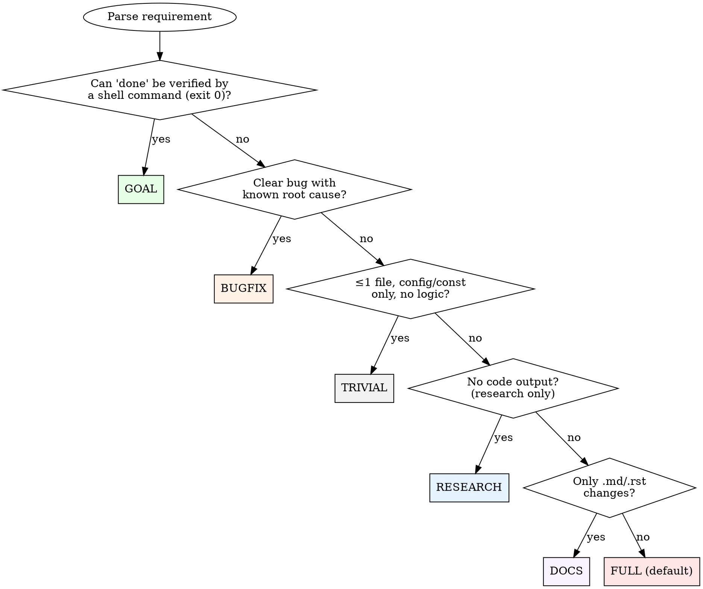

# EVALUATE Stage

## Base Methodology

> **Reference:** `backend/skills/s_evaluate/SKILL.md`
>
> Follow the full evaluation workflow defined there: parse requirement, score against DDD docs, calculate ROI, classify scope, recommend GO/DEFER/REJECT/ESCALATE, and define acceptance criteria.

## Pipeline-Specific Behavior

### Requirement Clarification Check (P0)

**Before scoring, check the requirement itself for completeness.** A vague
requirement scored as GO produces an under-specified acceptance criteria set —
the pipeline builds something that technically passes but misses the real need.

**Process:**
1. Parse the requirement into: WHO (actor), WHAT (action), WHY (value), WHEN (trigger)
2. For each undefined element:
   - Can it be unambiguously derived from DDD docs (PRODUCT.md scope, TECH.md constraints)?
   - If yes → fill it in, note the derivation source
   - If no → flag as ambiguity
3. List edge cases not addressed (empty state, error path, concurrent access, scale)
4. Cross-reference TECH.md "Constraints" / "Runtime Traps" — does the requirement
   implicitly violate any? If so → flag as conflict

**Exit conditions:**
- 0 ambiguities, 0 conflicts → proceed to scoring
- 1 ambiguity, derivable from context → resolve inline, note assumption in artifact
- ≥2 unresolvable ambiguities → **ESCALATE** (not GO with assumptions)
- Any constraint conflict → **ESCALATE** with explicit conflict description

**Why this exists:** spec-kit's `clarify` pattern — AI proactively finding spec
gaps is higher-yield than human review. Without this step, EVALUATE scores a
vague requirement as GO, acceptance criteria are under-specified, and BUILD
delivers something technically correct but wrong.

### Subsystem Health Audit (P1)

**Before scoring, if the requirement touches an existing subsystem** (not a
greenfield feature), run a 5-minute E2E audit of that subsystem:

1. **Identify the subsystem** — what directory/module does this requirement live in?
2. **List all public operations** — every API endpoint, CLI command, or user action
   the subsystem supports (e.g., deploy, stop, start, update, delete, reset-password)
3. **For each operation, check 8 operational invariants** (from `OPERATIONAL_PATTERNS.md`):
   - OP1: Concurrency guard?
   - OP2: Rollback path?
   - OP3: Data backup?
   - OP4: Access control?
   - OP5: Health unauthenticated?
   - OP6: Fail-loud placeholders?
   - OP7: Single update path?
   - OP8: Config consistency?
4. **For each missing invariant** — add it to the acceptance criteria

This turns a "fix X" requirement into "fix X + harden the neighborhood."
The audit typically finds 3-10× more gaps than the original requirement.

**Why this exists:** Hive run_d326c6ae fixed 5 specific bugs (H1-H5). A 15-minute
post-fix E2E audit found 15 MORE structural gaps (G1-G15) in the same subsystem.
Pipeline never would have found them because it only reviewed the diff. The audit
cost 15 minutes; fixing the gaps individually over time would have cost 15 hours.

**When to skip:** Greenfield features (no existing subsystem to audit), trivial
one-line fixes, or when the user explicitly says "just fix this one thing."

### Codebase Complexity Assessment (if code_intel.db exists)

After DDD doc scoring, if the project has a `code_intel.db`, read the codebase
summary to enrich the feasibility score:

```python
from core.code_intel import load_project_graph
g = load_project_graph("PROJECT_NAME")
if g:
    summary = g.get_codebase_summary()
    # Use: modules affected (keyword → symbol search), dead code in target
    # modules (cleanup overhead), most-connected nodes (fragility indicator)
```

Adjust **Feasibility** score:
- Target module has >5 dead code symbols → -0.5 (cleanup overhead)
- Target module's top node has >50 callers → -0.5 (high fragility)
- Change crosses 3+ modules → -0.5 (coordination cost)

**Skip** when no `code_intel.db` exists or requirement is research-only.

### Anti-Repetition Check (BLOCKING)

**Before producing the final GO/DEFER recommendation, cross-reference
IMPROVEMENT.md "What Failed" for structurally similar approaches.**

This prevents the system from re-attempting approaches that previously
failed — the ΩmegaWiki "anti-repetition memory" pattern. Failed experiments
aren't just archived; they actively prevent dead-end exploration.

**Process:**
1. Read the project's IMPROVEMENT.md "What Failed" section
2. For each `[pitfall]` entry, check: does the current requirement's
   proposed approach structurally resemble this failed approach?
   - Same module/subsystem targeted
   - Same technique (e.g., "big-bang refactor", "shared mutex", "brute-force replay")
   - Same architectural pattern (e.g., "multi-writer", "polling loop", "silent fallback")
3. If a match is found:
   a. **Cite the specific failed entry** (date + first line)
   b. **Explain why this attempt is structurally different** — what changed
      since the failure? Different constraints? Different scope? New capabilities?
   c. If you CANNOT articulate a structural difference → **REJECT** with:
      `"REJECT: structurally similar to failed approach [date]: [summary]"`

**Output format (include in evaluation artifact):**
```json
{
  "anti_repetition_check": {
    "entries_scanned": 12,
    "matches_found": 1,
    "matches": [
      {
        "entry": "2026-04-01: pytest-xdist — 12 commits, 8 days, 970 lines...",
        "similarity": "shared conftest approach for test isolation",
        "verdict": "PROCEED — different scope: this adds a hook, not conftest rewrite",
        "structural_difference": "Pure additive hook vs modifying shared infrastructure"
      }
    ]
  }
}
```

**When 0 matches found:** Still output the check result with `entries_scanned`
count — proves the check ran, not that it was skipped.

**When IMPROVEMENT.md is missing or has no "What Failed" section:**
Output `entries_scanned: 0, matches_found: 0` and proceed. The check is
satisfied (nothing to match against). Do NOT skip or error.

**Why this exists:** IMPROVEMENT.md accumulated 40+ failure entries over 3 months.
Without active cross-referencing, the same patterns recur (COE03: big-bang refactor,
C023: 3x daemon hang from same root cause). The check costs 30 seconds of reading;
re-discovering a failure costs hours.

### Profile Selection (Decision Tree)

**Core principle:** The distinction between goal and full is NOT about scope or
file count — it's about how "done" is verified.



**Evaluate each condition sequentially.** The first YES determines the profile.
If all conditions are NO, default to FULL.

**Goal indicators (ANY ONE → goal):**
- Metric/threshold targets: "Get X to Y%", "Reduce X below Y"
- Bulk/sweep operations: "Migrate all", "Fix all warnings", "Remove all instances"
- Quality hardening: "Fix all findings", "Make X production-ready"
- Iterative convergence: "Investigate and fix", optimization toward target

**Decision heuristic:** Can you write a shell command that returns exit 0 only
when the requirement is fully satisfied? YES → goal. NO (done = "review says
it's good") → full.

### Intelligence-Informed Profile Selection (Meta-Intelligence L3)

Before classifying scope, check if `pipeline_intelligence.json` exists in the
workspace root. If it does, load it and apply these adjustments:

```bash
# Check for intelligence file (non-blocking — skip if absent)
cat pipeline_intelligence.json 2>/dev/null | python3 -c "import sys,json; d=json.load(sys.stdin); print(json.dumps(d.get('dimensions',{}).get('abandon_patterns',{}).get('high_risk_shapes',[])))" 2>/dev/null
```

**A1. High-risk shape detection:**
If the requirement's shape matches a `high_risk_shapes` entry (>30% abandon rate):
- Prefer `goal` profile (iterative cycles recover from scope explosion)
- Set `max_cycles` higher than default (abandoned runs often = underestimated scope)
- Note in evaluation artifact: "Intelligence: similar requirements have {N}% abandon rate in {profile} profile"

**A2. Budget calibration:**
If `dimensions.estimation_accuracy.stage_estimates` exists, use those values
instead of the default budget estimates. These are calibrated from actual
historical consumption across all completed runs.

**A3. Chronic RP injection:**
If `dimensions.adversarial_value.build_injection_recommendations` is non-empty,
note the patterns for injection into BUILD stage preamble later.

**Skip intelligence if:** file doesn't exist, is >30 days old (stale), or
confidence < 0.7 for any recommendation. Intelligence is advisory only —
never override explicit user intent.

**When detected:**
1. Set `scope: "goal"` in evaluation (triggers `goal` profile selection)
2. Generate `dod_criteria` array — each criterion has type + check:

```json
{
  "goal_mode": true,
  "dod_criteria": [
    {"type": "command", "check": "pytest --cov-fail-under=90 src/", "desc": "Coverage >90%"},
    {"type": "rubric", "check": "Read each error msg. PASS if: states problem, suggests fix, no stack traces.", "desc": "User-friendly errors"}
  ],
  "max_cycles": 10,
  "progress_path": "Projects/<PROJECT>/.artifacts/goals/<slug>.md",
  "cycle_scope": "one test file or one module fix per cycle",
  "review_cadence": 3
}
```

**DoD criteria rules:**
- `command` type: shell command, exit 0 = pass. ALWAYS prefer this.
- `rubric` type: explicit pass/fail rubric (not just goal statement). Use only
  when criterion is inherently subjective.
- If >50% criteria are `rubric` with vague rubrics → ESCALATE (goal too subjective)
- A goal with ALL `rubric` criteria and no measurable progress metric → ESCALATE

**If NOT goal mode:** proceed with standard evaluation (scope = standard/complex/trivial/bugfix).

**Ordering note:** Goal Mode Detection runs AFTER scoring. If scoring recommends
DEFER/REJECT, that takes precedence — the requirement isn't worth pursuing
regardless of whether it's a goal or a feature. If scoring recommends GO and
the requirement matches goal indicators → override scope to "goal".

### Acceptance Criteria Quality Gate

**Every AC must describe an observable outcome, not a mechanism.**

**Three filters — ALL must pass for every AC:**

**Filter 1: No-op test** — "If I implement a no-op that produces the named artifact (file, output, endpoint) but delivers zero user value — does this AC still pass?" If yes → AC is too weak.

**Filter 2: User-value test** — "Would a real user pay $5 for this AC being true?" If the answer is "they'd expect that for free / they wouldn't notice" → AC is measuring an implementation detail, not value delivery.

**Filter 3: Garbage-in test** — "Could this AC pass with trivially wrong content?" If the output is a document/report/analysis, can it pass by being structurally correct but factually empty? Examples of ACs that FAIL this filter:
- "Produces TECH.md file" ← passes with an empty template
- "code-intel.json has valid schema" ← passes with fabricated module names
- "AGENTS.md is ≤150 lines" ← passes with Lorem Ipsum

**Fix: add a QUALITY qualifier to every content-producing AC:**
- "TECH.md conventions each cite 2+ source files where the pattern was observed"
- "code-intel.json edges verified against actual import statements (edge count > 0)"
- "AGENTS.md Critical Rules are backed by code evidence (not README paraphrase)"

| ❌ Mechanism/Existence AC | ✅ Outcome + Quality AC |
|---|---|
| "Save .full_data.json to disk" | "Re-render with insights completes in <2s without network calls" |
| "Produces TECH.md" | "TECH.md conventions cite 2+ source files each; not derivable from README alone" |
| "code-intel.json valid schema" | "code-intel.json modules match actual directory structure; edges from verified imports" |
| "Filter incomplete month" | "No MTD partial data appears in insights_data.json monthly_trend" |
| "Works on external repo" | "Output contains at least 3 facts discoverable ONLY by reading source code" |

**Rules:**
- Each AC must be verifiable by a command, assertion, or observation — not by reading code
- "Does X exist?" is never sufficient — "Does X achieve Y?" is required
- If the AC is about a cache/optimization: the AC measures the speedup, not the cache existence
- If the AC is about data quality: the AC measures the output quality, not the query change
- **If the AC is about generated content: the AC measures content quality, not just structure**
- **At least 1 AC per feature must be a "user would notice" criterion — something that fails if the output is trivially wrong**

### Pre-mortem Gate

After scoring, if the initial recommendation is GO, the base methodology's
Step 3.5 (Pre-mortem) is **mandatory** in the pipeline. The pre-mortem output
(`pre_mortem` array) MUST be included in the evaluation artifact JSON.

If the pre-mortem triggers a score adjustment or escalation, update the
artifact accordingly before publishing.

### Artifact Publish

```bash
python backend/scripts/artifact_cli.py publish --project <PROJECT> \
  --type evaluation --producer s_autonomous-pipeline \
  --summary "<GO/DEFER/REJECT>: <one-line>" --stage evaluate \
  --data '{"requirement":"...","scores":{...},"recommendation":"GO","scope":"standard","acceptance_criteria":[...]}'
python backend/scripts/artifact_cli.py advance --project <PROJECT> --state think
```

### Exit Routing

- **DEFER or REJECT** -- pipeline ends. Log reason and exit.
- **ESCALATE** -- L2 BLOCK -- checkpoint. Human review required before pipeline can continue.

---

## Common Rationalizations

| Rationalization | Reality | Source |
|---|---|---|
| "This is obviously a GO, skip the full scoring" | "Obvious" tasks have conflicted with non-goals (3x), duplicated prior failed work (2x), and been mis-scoped as trivial when they were standard. Full scoring takes 30 seconds. | Pipeline history |
| "Scope is trivial — I know this pattern" | Scope determines profile (full/trivial/bugfix). Wrong scope = wrong quality gates applied downstream. A 3-file, 2-function change was called "trivial" → skipped adversarial review → shipped broken (C025). | C025 |
| "The requirement is clear enough, skip clarification" | Vague requirements scored as GO produce under-specified acceptance criteria. The pipeline builds something that passes but misses the real need. 10 minutes clarifying saves 2 hours building wrong. | Pipeline design |
| "DDD docs are stale, skip consistency check" | Stale DDD docs = stale constraints. If you skip the check, you may violate a non-goal or repeat a failed pattern. The check surfaces this; skipping hides it. | IMPROVEMENT.md |
