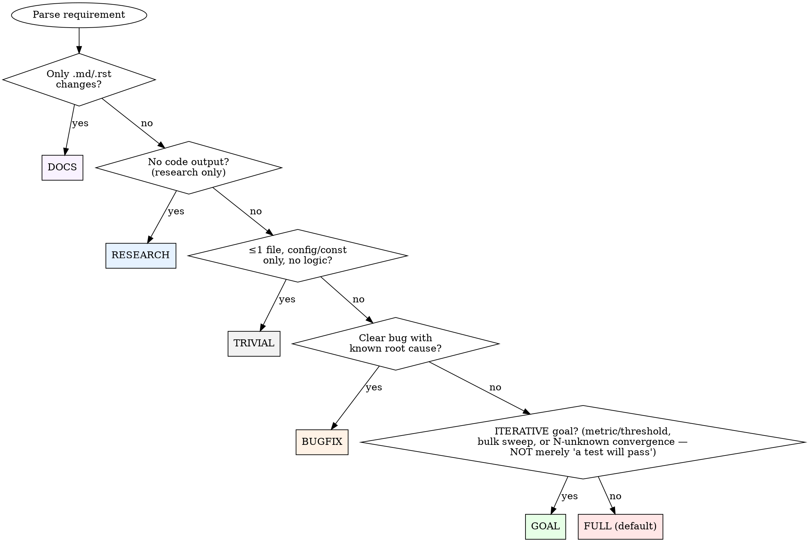

# EVALUATE Stage

## Base Methodology

> **Reference:** `backend/skills/s_evaluate/SKILL.md`
>
> Follow the full evaluation workflow defined there: parse requirement, score against DDD docs, calculate ROI, classify scope, recommend GO/DEFER/REJECT/ESCALATE, and define acceptance criteria.

## Pipeline-Specific Behavior

### Requirement Clarification Check (P0)

**Before scoring, check the requirement itself for completeness.** A vague
requirement scored as GO produces an under-specified acceptance criteria set —
the pipeline builds something that technically passes but misses the real need.

**Process:**
1. Parse the requirement into: WHO (actor), WHAT (action), WHY (value), WHEN (trigger)
2. For each undefined element:
   - Can it be unambiguously derived from DDD docs (PRODUCT.md scope, TECH.md constraints)?
   - If yes → fill it in, note the derivation source
   - If no → flag as ambiguity
3. List edge cases not addressed (empty state, error path, concurrent access, scale)
4. Cross-reference TECH.md "Constraints" / "Runtime Traps" — does the requirement
   implicitly violate any? If so → flag as conflict

**Exit conditions:**
- 0 ambiguities, 0 conflicts → proceed to scoring
- 1 ambiguity, derivable from context → resolve inline, note assumption in artifact
- ≥2 unresolvable ambiguities → **ESCALATE** (not GO with assumptions)
- Any constraint conflict → **ESCALATE** with explicit conflict description

**Why this exists:** spec-kit's `clarify` pattern — AI proactively finding spec
gaps is higher-yield than human review. Without this step, EVALUATE scores a
vague requirement as GO, acceptance criteria are under-specified, and BUILD
delivers something technically correct but wrong.

#### Self-Socratic Ambiguity Re-Scan (after filling the clarification output)

`INTERROGATE THE SPEC AND YOUR OWN FRAMING — NOT THE USER`

Once you have FILLED the WHO/WHAT/WHY/WHEN and noted assumptions above, **re-scan
THAT output** (and the acceptance criteria you're about to write) for residual
ambiguity. This is one self-answer round, not a loop and not a user interview.

**The philosophy (this run's design conviction — run_932c0991):** the Socratic
method in an AUTONOMOUS pipeline means interrogating the *requirement and your own
framing*, NOT "asking the user more questions". This is the **Understanding Gate's
"refute your claim" discipline shifted LEFT** to the requirement-clarification
layer — same family, narrower target. The source repos (aws-samples/sample-ai-plc,
awslabs/aidlc-workflows) Socratically question the *human*; we are autonomous, so
we self-answer (read code / DDD) and escalate only what is genuinely unknowable.
That is also why this is mechanical + validator-enforced, not behavioral — the
old behavioral grill protocol (see think.md) was "almost always skipped".

**Process (ONE round):**
1. Scan the filled clarification fields for ambiguity/hedge terms:
   `depends`, `maybe`, `not sure`, `mix of`, `somewhere between`, `standard`,
   `typical` — plus CJK `看情况 / 可能 / 大概 / 差不多 / 视情况 / 标准做法 / 一般`.
   (Canonical list: `pipeline_validator._AMBIGUITY_TERMS` — single source of truth.)
2. For each hit, force it concrete with a **self-answer** (read the code / DDD
   docs to pin the exact meaning) — escalate to the user ONLY if the answer is
   genuinely user-intent that cannot be derived. Self-answer is the default.
3. Record the scan in the evaluation artifact.

**Output (in the evaluation artifact `ambiguity_scan` field):**

```json
{
  "ambiguity_scan": {
    "scanned_fields": ["who", "what", "why", "when", "acceptance_criteria"],
    "terms_checked": ["depends", "maybe", "standard", "typical", "可能", "..."],
    "hits": [
      {"term": "standard", "where": "what — 'standard retry'",
       "resolution": "self-answer: read retry_manager.py:40 — means exponential backoff w/ --resume, NOT a generic 'standard'.",
       "kind": "self-answer"}
    ],
    "hit_count": 1,
    "all_resolved": true
  }
}
```

**Rules `[GATE·validator]` (`pipeline_validator._check_ambiguity_scan`, publish-time BLOCK):**
- Strict profiles (full/bugfix/goal) REQUIRE the `ambiguity_scan` block; **trivial/
  docs/research are exempt** (anti-ceremony — same rigor tiers as the Understanding
  Gate).
- **Every hit MUST carry a non-empty `resolution`** (self-answer OR escalation
  reason, ≥12 chars). An unresolved hit BLOCKS — that is what proves the loop RAN.
- `hits: []` is valid (scanned, found nothing). Record it anyway — proves the
  scan ran, not that it was skipped.
- This is DISTINCT from the Acceptance Criteria Quality Gate (which catches weak
  ACs) and the Understanding Gate (which scans the *diagnosis* for hedge). Here you
  scan the *requirement clarification output* for residual spec ambiguity.

### Understanding Gate `[GATE·validator]` (ALL work types — understand the present before proposing a fix)

`NO BUILD WITHOUT AN OBSERVATION-BACKED, REFUTED UNDERSTANDING OF THE PRESENT`

**Trigger:** EVERY evaluation, not just bug fixes. Before the pipeline proposes
*how* to fix/build (THINK), EVALUATE must produce a falsifiable claim about the
**current state of the world**, backed by an **observation** (not inference),
that has **survived a refutation attempt**. The *form of evidence* varies by
work type; the gate itself is universal.

**The problem this prevents:** the hard part is FRAMING — and it happens at
EVALUATE, before any code. A confident-but-wrong frame sails through
THINK/PLAN/BUILD and is only caught at the Gate-2 adversarial (full pipeline cost)
or by an external reviewer. This is NOT bug-specific: run_6adee7d5 framed a
**feature** change as "frontend ignores [DONE]" — but `chat.ts:276` *already*
treated `[DONE]` as authoritative, so the "fix" was a **no-op**. The understanding
of the existing system was wrong, and a bug-only gate would never have caught it.
Understanding-error crosses every work type, so the gate must too.

**The universal `understanding` block (produce in the evaluation artifact):**

```json
"understanding": {
  "work_type": "bugfix | existing-feature | greenfield | refactor | research | docs",
  "claim": "A falsifiable statement about the CURRENT state (present-tense, NOT a plan)",
  "evidence": "An OBSERVATION supporting the claim — form varies by work_type (below)",
  "evidence_kind": "observation | code-trace | repro | premortem | characterization",
  "skeptic_verdict": "SUPPORTED | UNSUPPORTED | ALREADY-SATISFIED | WRONG-FRAME",
  "alternative_considered": "The simplest competing framing, and why it loses"
}
```

The **claim is about the present, not the plan.** "The spinner hangs because
`onComplete` early-returns on a stale `streamGen`" is a claim about the present.
"I will add a per-tab `latestCompleteGen`" is a plan — that belongs in THINK, on
the other side of the wall.

**Evidence form varies by work type — THIS is the key:**

| `work_type` | "Understanding" means | Required `evidence_kind` | Concrete form |
|-------------|----------------------|--------------------------|---------------|
| **bugfix** | the **root cause** | `observation` / `repro` | `ps` output, log-signal counts, live gauge read, a reproduction *(the REPRO gate)* |
| **existing-feature** | how the **current system actually works** + where the change fits | `code-trace` | the real call path / data flow read from source (cite file:line), NOT "I assume it works like…" |
| **refactor** | the **current behavior that must be preserved** | `characterization` | a characterization test or an input→output matrix traced against `git show HEAD` |
| **greenfield** | the **problem and who has it** | `premortem` | problem statement + "top 3 reasons this fails" |
| **research** | the **actual question** + what's known | `premortem` (scope) | the question restated falsifiably + what makes it a wrong/unanswerable question |
| **docs** | what's **true about the code** being documented | `code-trace` (relaxed) | file refs to the code each doc claim describes |

> **⚠️ Classifying `work_type = refactor` (an architecture / sustainability / de-patch
> task) — this classification carries downstream RIGOR, so set it deliberately.** Two
> gates key off it: Gate-1 SSA (`build.md` Check 4) INVERTS its PATCH polarity — for a
> refactor a patch is a BLOCK, because the structural change IS the acceptance criterion —
> and DELIVER dispatches the architecture-relevant specialist set instead of the narrow
> bugfix pair. Because of that teeth, the trigger is **NARROW**: classify `refactor` only
> when the requirement itself asks to *restructure* — "de-patch / stop patching X",
> "make X sustainable / maintainable", "root-fix the architecture", "unify the N copies",
> "remove the whole class of Y" — i.e. behavior is preserved but the STRUCTURE is the
> deliverable. Do **NOT** classify `refactor` merely because a change touches >1 file or
> renames things; a bounded feature or a symptom-fix with a known root cause is
> `existing-feature` / `bugfix`, and gets the default (patch-tolerant) rigor. When unsure
> between `bugfix` and `refactor`, ask: *did the user ask me to fix a behavior, or to fix
> the structure?* Structure → `refactor`.
>
> **`refactor` is a WORK_TYPE, not a profile.** A refactor routes to the **`full`** profile
> (identical stage set — the profile decision tree below has no refactor node, by design);
> the refactor-specific rigor rides on `work_type=refactor`, exactly as `greenfield`'s
> Working-Backwards rigor rides on `work_type=greenfield` without being its own profile.

> **⚠️ `migration_class` — MANDATORY Gate-0 block for a class-migration requirement
> (run_1d3df9e6, AC9/AC11).** A goal run that migrates a *class* (all callers of a
> chokepoint / all siblings of a type) across cycles has a blind spot no per-cycle
> adversarial can see: a class member NO cycle touches is never in any diff. run_0d60e04e
> shipped the `decisions` write path ungated for exactly this reason. The
> class-completeness gate (goal_cycle Final Quality Gate step 2.5) closes it — but ONLY if
> the run declares a `migration_class`.
>
> **Gate-0 rule `[GATE·validator]` (`_check_migration_class` + `check_migration_class.py`, publish-time BLOCK):** if the requirement contains a
> migration keyword — **migrate / unify / consolidate / de-dup / "route … all" /
> "gate … all" / "every … through" / "single … for all"** — the evaluation artifact MUST
> include a `migration_class` block. Opt-in was the C036 escape hatch: an agent with an
> incomplete mental model simply omits it → the gate no-ops → the exact miss ships. Making
> it mandatory-on-keyword removes that hatch. A keyword-free requirement needs no block
> (the gate no-ops, zero false-positive).
>
> **`migration_class` shape (see the design doc for the full contract):**
> ```json
> "migration_class": {
>   "description": "<the class in one line>",
>   "enumeration_cmd": "grep -rn '<sink_fn>(' backend/ | grep -v 'def '",
>   "members": [{"id","disposition":"migrated|carved-out","locator":"file:line","evidence":"symbol|reason"}]
> }
> ```
> **`enumeration_cmd` MUST grep a PHYSICAL SINK across the tree (R-A), NOT a hand-listed
> set** — a self-authored member list inherits the same blind spot that caused the miss.
> `scripts/check_migration_class.validate_enumeration_cmd` REJECTS an echo/printf literal
> list or a single-file-scoped grep. Enumerate the sink (the last-mile write call every
> member is forced through); let the grep find the files, don't curate them.

**Three mechanisms — M1+M2 `[GATE·validator]`, M3 `[MUST]` (behavioral spawn):**

- **M1 — Separation (the wall). `[GATE·validator]`** The `claim` must describe the PRESENT, not a
  fix. The validator BLOCKS a claim containing solution language ("I will / the
  fix is / add … / refactor …"). THINK is the first stage allowed to propose a fix.
- **M2 — Observation-not-inference (R16b mechanized). `[GATE·validator]`** A hedge in the claim or
  evidence (`似乎 / 可能 / probably / should be / I think / likely`) BLOCKS unless
  the `evidence` is a concrete, non-hedged observation that resolves it. Validator-enforced.
- **M3 — Refutation (the skeptic). `[MUST]` (BEHAVIORAL — spawn Agent tool, same pattern as
  deliver.md's adversarial gate; not code-enforced — the validator only records the verdict field).** For bugfix/full/goal, after scoring a GO and
  BEFORE advancing to THINK, spawn ONE fresh-context sub-agent with ZERO of your
  reasoning. Its job is to REFUTE:

```
You are a skeptic. The understanding is: <claim>. Work type: <work_type>.
Do NOT trust it.
1. Is the claim supported by OBSERVATION matching <evidence_kind> (code-trace
   file:line / ps / log counts / repro / characterization), or only inference? Name it.
2. Construct the SIMPLEST alternative framing that fits the same facts.
3. Is the implied change already true / a no-op? grep and check.
4. Verdict: SUPPORTED (evidence cited) | UNSUPPORTED (inference only) |
   ALREADY-SATISFIED (no-op) | WRONG-FRAME (symptom / wrong layer, not the real state).
```

**Route on verdict:**
- **SUPPORTED** → proceed to THINK. Record the cited evidence in
  `understanding.evidence` (bug-class evals may use the legacy `observation_evidence`
  alias — both satisfy the validator).
- **UNSUPPORTED / ALREADY-SATISFIED / WRONG-FRAME** → do NOT advance. Go OBSERVE
  (code-trace the real path, run `ps`, count the log signals, attempt a repro) and
  re-frame. The cheapest insurance against building the wrong thing.

**Rigor tiers (cost-proportionate — §3.5 of the design):**

| Profile | M1 wall | M2 hedge-scan | M3 skeptic sub-agent |
|---------|:-------:|:-------------:|:--------------------:|
| trivial | ✅ | ✅ | ❌ (claim + scan only) |
| docs | ✅ | ✅ | ❌ (code-trace refs only) |
| research | ✅ | ✅ | 🟡 scope-challenge (refute the *question*) |
| bugfix / full / goal | ✅ | ✅ | ✅ |

> Trivial/docs/research are NOT *forced* to carry the block (anti-ceremony) — but
> if a block IS present, M1+M2 still scan it. Strict profiles (full/bugfix/goal)
> REQUIRE the block with real evidence. The existing trivial-profile adversarial
> (Gate-2) remains the back-stop for relaxed profiles.

**Relationship to the validator:** M1+M2 + the presence requirement are
*code-enforced* by `pipeline_validator.validate_artifact_data` at publish time
(the "Understanding gate:" markers; the bug-class subset keeps the "REPRO gate:"
marker via the `observation_evidence` alias). M3 (the skeptic) is the
*human-spawned* verifier that produces the verdict the field records. Model
proposes, the gate disposes.

### Subsystem Health Audit (P1) `[MUST]`

**Before scoring, if the requirement touches an existing subsystem** (not a
greenfield feature), run a 5-minute E2E audit of that subsystem:

1. **Identify the subsystem** — what directory/module does this requirement live in?
2. **List all public operations** — every API endpoint, CLI command, or user action
   the subsystem supports (e.g., deploy, stop, start, update, delete, reset-password)
3. **For each operation, check 8 operational invariants** (from `OPERATIONAL_PATTERNS.md`):
   - OP1: Concurrency guard?
   - OP2: Rollback path?
   - OP3: Data backup?
   - OP4: Access control?
   - OP5: Health unauthenticated?
   - OP6: Fail-loud placeholders?
   - OP7: Single update path?
   - OP8: Config consistency?
4. **For each missing invariant** — add it to the acceptance criteria

This turns a "fix X" requirement into "fix X + harden the neighborhood."
The audit typically finds 3-10× more gaps than the original requirement.

**Why this exists:** Hive run_d326c6ae fixed 5 specific bugs (H1-H5). A 15-minute
post-fix E2E audit found 15 MORE structural gaps (G1-G15) in the same subsystem.
Pipeline never would have found them because it only reviewed the diff. The audit
cost 15 minutes; fixing the gaps individually over time would have cost 15 hours.

**When to skip:** Greenfield features (no existing subsystem to audit), trivial
one-line fixes, or when the user explicitly says "just fix this one thing."

### Cross-Boundary Classification (P1) `[GATE·artifact_cli]` — produces the `cross_boundary` flag

> The `cross_boundary` flag is code-consumed downstream: `artifact_cli.py` `cross_boundary_e2e`
> gate reads the field from the published EVALUATE artifact and `sys.exit(1)`s if a
> `cross_boundary=true` change reaches DELIVER without a passing TEST-Layer-4 E2E record.
> REVIEW check 15 additionally rejects a `false` with no `ruled_out`.

**One question, asked on every run:** *does this change cross a CONTRACT BOUNDARY —
a seam where each side is a separate unit that a unit test can pass in isolation while
the seam between them silently breaks?* Answer it here; the answer (a `cross_boundary`
object — `.value` boolean + the `.kinds` that fire when true) is consumed by TEST Layer 4
and the REVIEW exit checklist. This is the sibling of the Subsystem Health Audit: that audit
hardens a subsystem's *operations*; this classifies the change's *seams*.

**`cross_boundary = true` if the change touches ANY of these boundary kinds:**

| Boundary kind | Concrete signal |
|---|---|
| **event-bus / window-event** | dispatch/listen a `CustomEvent`/`swarm:*` event; add/rename/retire an event name; move a surface off/onto an event mechanism |
| **IPC / SSE / wire** | a serialized payload crosses a process/network hop (SSE event shape, Tauri command, an `editor_context`/`ui_command` field) |
| **data / schema migration** | a column/field/dir/contract renames or moves and existing writers OR **readers** must follow (R27 "grep ALL consumers incl. reads") |
| **multi-subsystem shared path** | ≥2 coupled subsystems share one critical path (resume, spawn, streaming, auth) — the R16 blast-radius case |
| **frontend↔backend contract** | a backend allowlist/enum and a frontend table must stay in lockstep (e.g. `ui_action` UI_COMMAND_ALLOWLIST ↔ `ALL_SHOW_EVENTS`) |
| **ACT / SENSE proprioception** | the agent's ability to ACT on a surface (a command that dispatches an event) OR SENSE its state (a payload field read from a store) rides the mechanism being changed |

**`cross_boundary = false` (EXEMPT — no E2E ceremony tax) when the change is:**
a pure-logic function (inputs→outputs, no seam), a docs-only edit, a single-file config
value, or a cosmetic/style change. **Do NOT inflate the classification** — if you cannot
name a SPECIFIC boundary kind from the table above with a file:line, it is `false`.
Marking everything "cross-boundary" re-creates the ceremony tax this gate exists to
avoid (the C042 "build a mechanism for every case" over-reach).

**⚠️ The `false` branch is NOT a free pass — it requires a NEGATIVE ATTESTATION.** The
self-exemption temptation here is the same one the Understanding Gate faces ("this is
obviously fine, skip it"), and it fires hardest on exactly the run most likely to break
a seam — a migration where "every unit passes" (the run_fdeaead8 setup). So `false` is
not "leave the field blank"; you MUST record `ruled_out`: a one-line statement that you
checked the 6 kinds and none fire, naming what the change touches. A `false` with no
`ruled_out` is an INVALID EVALUATE artifact (an unjustified skip), not an exempt one —
REVIEW check 15 rejects it. This forces the classification to be a *decision on record*,
not a silent default.

**Why this exists (provenance — read it, it's the whole point):** run_fdeaead8 (M4,
overlay re-architecture) migrated 4 surfaces off the legacy `useExclusiveOverlay`
window-event bus onto a new host. **Every unit test passed.** But the migration silently
severed the agent's proprioception contract on BOTH halves — the `swarm:show-<id>` ACT
vocabulary became close-only (couldn't OPEN a migrated surface) and the `active_overlay`
SENSE payload read a now-dead singleton (couldn't SEE it). The mandatory **adversarial**
gate caught it; **no E2E test did, because none drove the real registry end-to-end** —
the exact hole this classification + TEST Layer 4 close. A migration's visible 20% is
mounting the new component; the invisible 80% is re-homing the event dispatchers + state
readers, and only a real-system E2E proves both halves reconnected.

**Record it in the EVALUATE artifact** (add to the artifact JSON) — `true` carries the
`kinds` that fire + the `seam`; `false` carries `ruled_out` (the negative attestation):
```json
"cross_boundary": { "value": true, "kinds": ["event-bus", "frontend-backend-contract", "act-sense"], "seam": "swarm:show-<id> dispatch ↔ OverlayContext listener ↔ backend allowlist" }
// or, for an exempt run:
"cross_boundary": { "value": false, "ruled_out": "pure-logic change to score_confidence() — no event/wire/migration/shared-path/fe-be/act-sense seam; single file, callers in same module" }
```

### Codebase Complexity Assessment (if code_intel.db exists)

After DDD doc scoring, if the project has a `code_intel.db`, read the codebase
summary to enrich the feasibility score:

```python
from core.code_intel import load_project_graph
g = load_project_graph("PROJECT_NAME")
if g:
    summary = g.get_codebase_summary()
    # Use: modules affected (keyword → symbol search), dead code in target
    # modules (cleanup overhead), most-connected nodes (fragility indicator)
```

Adjust **Feasibility** score:
- Target module has >5 dead code symbols → -0.5 (cleanup overhead)
- Target module's top node has >50 callers → -0.5 (high fragility)
- Change crosses 3+ modules → -0.5 (coordination cost)

**Skip** when no `code_intel.db` exists or requirement is research-only.

### Drift Detection (P2 — Warning, Non-Blocking) `[GUIDE]`

**Before scoring, check whether code has drifted from design docs since
the last pipeline delivery.** If code changed but design docs didn't update,
the pipeline may be working from stale assumptions.

**Process:**
1. Find the last completed pipeline run for this project:
   ```bash
   python backend/scripts/artifact_cli.py run-get --project <PROJECT> 2>/dev/null | python3 -c "
   import sys,json
   runs = json.load(sys.stdin).get('runs',[])
   completed = [r for r in runs if r.get('status')=='completed']
   if completed: print(completed[-1].get('completed_at',''))
   " 2>/dev/null
   ```
2. If a prior run exists, check git for changes since then (scope to swarmai repo, not workspace):
   ```bash
   # Run from swarmai repo root. Count code commits touching backend/ or desktop/
   git log --oneline --after="<completed_at>" -- backend/ desktop/ | wc -l
   # Count design doc commits for this project
   git -C <WORKSPACE> log --oneline --after="<completed_at>" -- Projects/<PROJECT>/TECH.md Projects/<PROJECT>/PRODUCT.md Projects/<PROJECT>/IMPROVEMENT.md | wc -l
   ```
3. **Drift signal:** code_commits > 0 AND design_commits == 0

**Output (include in evaluation artifact if drift detected):**
```json
{
  "drift_detection": {
    "last_pipeline": "run_abc123",
    "code_commits_since": 7,
    "design_doc_commits_since": 0,
    "verdict": "DRIFT_WARNING"
  }
}
```

**Behavior:**
- Drift detected → emit warning in stage landmark: `⚠️ Drift: {N} code commits since last pipeline, 0 design doc updates`
- Agent treats as P2 signal — continues if changes are mechanical (config, deps, formatting)
- Agent pauses and proposes design update if changes are architectural (new module, changed API, new state)
- **Never auto-update design docs from code** — that inverts the direction of truth

**When no prior run exists:** Skip silently (first pipeline for this project — no baseline to drift from).

---

### Anti-Repetition Check `[MUST]`

> ⚠️ **doc-code drift:** this section reads "(BLOCKING)" but NO code enforces it —
> `grep anti_repetition backend/scripts/{pipeline_validator,artifact_cli}.py` = 0 hits.
> It is agent-discipline (`[MUST]`), NOT a code gate. Flagged in the drift table (AC4).

**Before producing the final GO/DEFER recommendation, cross-reference
IMPROVEMENT.md "What Failed" for structurally similar approaches.**

This prevents the system from re-attempting approaches that previously
failed — the ΩmegaWiki "anti-repetition memory" pattern. Failed experiments
aren't just archived; they actively prevent dead-end exploration.

**Process:**
1. Read the project's IMPROVEMENT.md "What Failed" section
2. For each `[pitfall]` entry, check: does the current requirement's
   proposed approach structurally resemble this failed approach?
   - Same module/subsystem targeted
   - Same technique (e.g., "big-bang refactor", "shared mutex", "brute-force replay")
   - Same architectural pattern (e.g., "multi-writer", "polling loop", "silent fallback")
3. If a match is found:
   a. **Cite the specific failed entry** (date + first line)
   b. **Explain why this attempt is structurally different** — what changed
      since the failure? Different constraints? Different scope? New capabilities?
   c. If you CANNOT articulate a structural difference → **REJECT** with:
      `"REJECT: structurally similar to failed approach [date]: [summary]"`

**Output format (include in evaluation artifact):**
```json
{
  "anti_repetition_check": {
    "entries_scanned": 12,
    "matches_found": 1,
    "matches": [
      {
        "entry": "2026-04-01: pytest-xdist — 12 commits, 8 days, 970 lines...",
        "similarity": "shared conftest approach for test isolation",
        "verdict": "PROCEED — different scope: this adds a hook, not conftest rewrite",
        "structural_difference": "Pure additive hook vs modifying shared infrastructure"
      }
    ]
  }
}
```

**When 0 matches found:** Still output the check result with `entries_scanned`
count — proves the check ran, not that it was skipped.

**When IMPROVEMENT.md is missing or has no "What Failed" section:**
Output `entries_scanned: 0, matches_found: 0` and proceed. The check is
satisfied (nothing to match against). Do NOT skip or error.

**Why this exists:** IMPROVEMENT.md accumulated 40+ failure entries over 3 months.
Without active cross-referencing, the same patterns recur (COE03: big-bang refactor,
C023: 3x daemon hang from same root cause). The check costs 30 seconds of reading;
re-discovering a failure costs hours.

### Profile Selection (Decision Tree)

**Core principle:** The distinction between goal and full is NOT about whether
"done" is *verifiable* (almost everything is) — it's about whether reaching done
requires ITERATING toward a moving target. Goal = converge to a metric / sweep an
open set / N-unknown changes. Full = one bounded change you can scope upfront.



**Evaluate each condition sequentially.** The first YES determines the profile.
If all conditions are NO, default to FULL.

> **⚠️ ORDER MATTERS — the SIZE/shape gates come BEFORE goal (fixed run_c236e4b1).**
> The old tree asked "can 'done' be verified by a shell command (exit 0)?" FIRST and
> routed any YES to goal. But *almost every* code change has a test that exits 0, so
> that catch-all sent even a 3-line fix to **goal — the heaviest profile** (loops
> build+test per cycle). That is exactly the mis-pick that cost a 3-stale-test fix a
> full goal run (run_ae689ce0, profile=goal). Goal is now the LAST gate before FULL,
> and requires a genuinely *iterative* target — not mere test-verifiability.

**Goal indicators (ALL of goal require iteration-toward-a-moving-target — a passing
test alone is NEVER a goal indicator):**
- Metric/threshold targets: "Get X to Y%", "Reduce X below Y"
- Bulk/sweep operations: "Migrate all", "Fix all warnings", "Remove all instances"
- Quality hardening: "Fix all findings", "Make X production-ready"
- Iterative convergence: "Investigate and fix" where the number of changes is unknown upfront

**NOT goal (route to bugfix/trivial/full):** a single bounded change whose "done" is
"the feature exists and its test passes" — even though that test exits 0. One known
fix → bugfix (clear root cause) or trivial (≤1 file, no logic) or full (multi-file
feature). "A test will pass" describes almost everything; it does not make a task goal.

**Decision heuristic (goal vs full ONLY — apply after the size/bug gates above
have ruled out trivial/bugfix/docs/research):** Does "done" require *iterating
toward a moving target* whose number of steps you can't predict upfront (a metric
to reach, an open-ended set to sweep)? YES → goal. A single bounded change whose
"done" is "it's built and the test passes" → **full** (or bugfix/trivial if it
matched those size gates first). Note: nearly every change *can* be wrapped in a
shell command that exits 0 — that fact alone is NOT a goal signal; the iteration
is. (This corrects the old "any exit-0-verifiable → goal" heuristic that mis-routed
small fixes to the heaviest profile.)

> **⚠️ Cross-boundary × profile consistency check (silent-escape guard).** `docs` and
> `research` profiles have NO TEST/REVIEW stage — so a `cross_boundary=true` change
> routed to either would produce the flag and then have NO stage that enforces Layer 4:
> the requirement silently escapes. Therefore **`cross_boundary.value == true` under a
> `docs`/`research` profile is a SCOPE CONTRADICTION** — a change that crosses a real
> contract seam is not docs-only or research-only work. If you land here, the profile is
> wrong, not the classification: re-route to `bugfix`/`full`/`goal` (which have TEST +
> REVIEW). The only exception is a genuinely docs-only edit *describing* a boundary
> (then `cross_boundary=false`, `ruled_out: "docs describe the seam, no code crosses it"`).

### Intelligence-Informed Profile Selection (Meta-Intelligence L3)

Before classifying scope, check if `pipeline_intelligence.json` exists in the
workspace root. If it does, load it and apply these adjustments:

```bash
# Check for intelligence file (non-blocking — skip if absent)
cat pipeline_intelligence.json 2>/dev/null | python3 -c "import sys,json; d=json.load(sys.stdin); print(json.dumps(d.get('dimensions',{}).get('abandon_patterns',{}).get('high_risk_shapes',[])))" 2>/dev/null
```

**A1. High-risk shape detection:**
If the requirement's shape matches a `high_risk_shapes` entry (>30% abandon rate):
- Prefer `goal` profile (iterative cycles recover from scope explosion)
- Set `max_cycles` higher than default (abandoned runs often = underestimated scope)
- Note in evaluation artifact: "Intelligence: similar requirements have {N}% abandon rate in {profile} profile"

**A2. Budget calibration:**
If `dimensions.estimation_accuracy.stage_estimates` exists, use those values
instead of the default budget estimates. These are calibrated from actual
historical consumption across all completed runs.

**A3. Chronic RP injection:**
If `dimensions.adversarial_value.build_injection_recommendations` is non-empty,
note the patterns for injection into BUILD stage preamble later.

**Skip intelligence if:** file doesn't exist, is >30 days old (stale), or
confidence < 0.7 for any recommendation. Intelligence is advisory only —
never override explicit user intent.

**When detected:**
1. Set `scope: "goal"` in evaluation (triggers `goal` profile selection)
2. Generate `dod_criteria` array — each criterion has type + check:

```json
{
  "goal_mode": true,
  "dod_criteria": [
    {"type": "command", "check": "<project's coverage command from TECH.md — SwarmAI-self example: pytest --cov-fail-under=90 src/; Go: go test -cover ./...; JS: vitest run --coverage>", "desc": "Coverage >90%"},
    {"type": "rubric", "check": "Read each error msg. PASS if: states problem, suggests fix, no stack traces.", "desc": "User-friendly errors"}
  ],
  "max_cycles": 10,
  "progress_path": "Projects/<PROJECT>/.artifacts/goals/<slug>.md",
  "cycle_scope": "one test file or one module fix per cycle",
  "review_cadence": 3
}
```

**DoD criteria rules:**
- `command` type: shell command, exit 0 = pass. ALWAYS prefer this.
- `rubric` type: explicit pass/fail rubric (not just goal statement). Use only
  when criterion is inherently subjective.
- If >50% criteria are `rubric` with vague rubrics → ESCALATE (goal too subjective)
- A goal with ALL `rubric` criteria and no measurable progress metric → ESCALATE

**If NOT goal mode:** proceed with standard evaluation (scope = standard/complex/trivial/bugfix).

**Ordering note:** Goal Mode Detection runs AFTER scoring. If scoring recommends
DEFER/REJECT, that takes precedence — the requirement isn't worth pursuing
regardless of whether it's a goal or a feature. If scoring recommends GO and
the requirement matches goal indicators → override scope to "goal".

### Acceptance Criteria Quality Gate `[MUST]`

> The *presence* of `acceptance_criteria` is `[GATE·validator]` (required in the PLAN
> artifact). The three quality FILTERS below (no-op / user-value / garbage-in) are
> `[MUST]` — agent discipline, not code-checked.

**Every AC must describe an observable outcome, not a mechanism.**

**Three filters — ALL must pass for every AC:**

**Filter 1: No-op test** — "If I implement a no-op that produces the named artifact (file, output, endpoint) but delivers zero user value — does this AC still pass?" If yes → AC is too weak.

**Filter 2: User-value test** — "Would a real user pay $5 for this AC being true?" If the answer is "they'd expect that for free / they wouldn't notice" → AC is measuring an implementation detail, not value delivery.

**Filter 3: Garbage-in test** — "Could this AC pass with trivially wrong content?" If the output is a document/report/analysis, can it pass by being structurally correct but factually empty? Examples of ACs that FAIL this filter:
- "Produces TECH.md file" ← passes with an empty template
- "code-intel.json has valid schema" ← passes with fabricated module names
- "AGENTS.md is ≤150 lines" ← passes with Lorem Ipsum

**Fix: add a QUALITY qualifier to every content-producing AC:**
- "TECH.md conventions each cite 2+ source files where the pattern was observed"
- "code-intel.json edges verified against actual import statements (edge count > 0)"
- "AGENTS.md Critical Rules are backed by code evidence (not README paraphrase)"

| ❌ Mechanism/Existence AC | ✅ Outcome + Quality AC |
|---|---|
| "Save .full_data.json to disk" | "Re-render with insights completes in <2s without network calls" |
| "Produces TECH.md" | "TECH.md conventions cite 2+ source files each; not derivable from README alone" |
| "code-intel.json valid schema" | "code-intel.json modules match actual directory structure; edges from verified imports" |
| "Filter incomplete month" | "No MTD partial data appears in insights_data.json monthly_trend" |
| "Works on external repo" | "Output contains at least 3 facts discoverable ONLY by reading source code" |

**Rules:**
- Each AC must be verifiable by a command, assertion, or observation — not by reading code
- "Does X exist?" is never sufficient — "Does X achieve Y?" is required
- If the AC is about a cache/optimization: the AC measures the speedup, not the cache existence
- If the AC is about data quality: the AC measures the output quality, not the query change
- **If the AC is about generated content: the AC measures content quality, not just structure**
- **At least 1 AC per feature must be a "user would notice" criterion — something that fails if the output is trivially wrong**

### Pre-mortem Gate `[GATE·validator]` (greenfield) / `[MUST]` (else)

> `pre_mortem` is code-required (`_check_working_backwards`) ONLY when
> `work_type=greenfield` + strict profile. For every other work_type it is `[MUST]`
> (produced by discipline, not validator-blocked).

After scoring, if the initial recommendation is GO, the base methodology's
Step 3.5 (Pre-mortem) is **mandatory** in the pipeline. The pre-mortem output
(`pre_mortem` array) MUST be included in the evaluation artifact JSON.

If the pre-mortem triggers a score adjustment or escalation, update the
artifact accordingly before publishing.

### Working-Backwards Lens (GREENFIELD ONLY) `[GATE·validator]`

`INTERROGATE THE CUSTOMER VALUE — SELF-ANSWER FIRST, HUMAN CONFIRMS AT REVIEW`

**Trigger:** ONLY when `understanding.work_type == "greenfield"` AND the profile
is strict (full/goal — not trivial/docs/research). For every other work type
(bugfix, existing-feature, refactor, research, docs) this section does NOT apply —
skip it. This is the deliberate difference from the always-on Understanding Gate
and Ambiguity Scan: customer/value framing is only meaningful for a NET-NEW
feature.

**Why this exists:** a greenfield "GO" can be technically sound yet build something
nobody adopts. The Understanding Gate already captures *the problem and who has it*
(work_type=greenfield row above) and the Pre-mortem Gate already captures *top-3
failure reasons* — so this lens does **not** re-ask those. It adds the **economic /
value framing** neither gate captures, ported from Amazon Working-Backwards / the
aws-samples PR-FAQ pattern but adapted to an AUTONOMOUS pipeline: **you self-answer
(Intelligent-Default), the human confirms at REVIEW** — never a blocking file-based
user interview (that's the grill-protocol / aidlc-#366 rubber-stamp failure).

**Process (Intelligent-Default — self-answer each, do NOT block on the user):**
For each field below, write your **best-guess answer derived from PRODUCT.md / DDD /
the requirement**. The human reviews and overrides at REVIEW as a *taste decision* —
they are NOT a `⛔` blocking gate.

| Field | Question | Enforced? | Self-answer from |
|-------|----------|-----------|------------------|
| `target_customer` | Who specifically has this problem? (a precise segment, not "users") | context only¹ | PRODUCT.md Target Users / Audience Map |
| `current_workaround` | How do they solve / work around it TODAY? | ✅ required | the requirement + domain knowledge |
| `why_better` | Why is this faster / cheaper / better than that workaround? | ✅ required | PRODUCT.md differentiation |
| `must_be_true` | What adoption assumption MUST hold for this to succeed? | ✅ required | pre-mortem inversions |

¹ `target_customer` is **not validator-enforced** — the "who has it" is already
captured by the greenfield Understanding row (work_type=greenfield, "problem and
who has it"). Record it for framing context, but the gate only enforces the 3
economic fields the other gates don't capture.

The **top-3 failure reasons** are NOT re-asked here — they are **reused** from the
mandatory `pre_mortem` array (Pre-mortem Gate above). This gate also makes
`pre_mortem` **code-enforced for greenfield** (the validator now requires it
non-empty when work_type=greenfield — its first enforcement).

**Output (in the evaluation artifact `working_backwards` field):**
```json
{
  "working_backwards": {
    "target_customer": "solo technical founders who want team-scale output without hiring",
    "current_workaround": "juggling ChatGPT tabs + manual copy-paste, losing context each switch",
    "why_better": "persistent memory + autonomous pipeline = 10x less context re-establishment",
    "must_be_true": "users must trust an autonomous agent to act without per-step confirmation"
  }
}
```
(plus the existing `pre_mortem` array — reused as the top-3 failure reasons.)

**Validator-enforced (`_check_working_backwards`):** greenfield + strict → the
block is required, each of the 4 economic fields must be a real answer (≥12 chars),
and `pre_mortem` must be non-empty. Every other work_type / relaxed profile → not
required, never false-blocked. Distinct `Working-Backwards:` error tag (no overlap
with the Understanding / Ambiguity / REPRO gates). Fail-open on a missing/typo'd
work_type — this is a framing-quality lens, not a safety gate.

### Artifact Publish

```bash
python backend/scripts/artifact_cli.py publish --project <PROJECT> --run-id <RUN_ID> \
  --type evaluation --producer s_autonomous-pipeline \
  --summary "<GO/DEFER/REJECT>: <one-line>" --stage evaluate \
  --data '{"requirement":"...","scores":{...},"recommendation":"GO","scope":"standard","acceptance_criteria":[...],"understanding":{...},"ambiguity_scan":{"scanned_fields":["who","what","why","when","acceptance_criteria"],"terms_checked":[...],"hits":[...],"hit_count":0,"all_resolved":true},"pre_mortem":["..."],"working_backwards":{"target_customer":"...","current_workaround":"...","why_better":"...","must_be_true":"..."}}'
# NOTE: working_backwards is REQUIRED only when understanding.work_type=="greenfield" (+ strict profile); omit for all other work types.
python backend/scripts/artifact_cli.py advance --project <PROJECT> --state think --run-id <RUN_ID>
```

### Exit Routing

- **DEFER or REJECT** -- pipeline ends. Log reason and exit.
- **ESCALATE** -- L2 BLOCK -- checkpoint. Human review required before pipeline can continue.

---

## Common Rationalizations

| Rationalization | Reality | Source |
|---|---|---|
| "This is obviously a GO, skip the full scoring" | "Obvious" tasks have conflicted with non-goals (3x), duplicated prior failed work (2x), and been mis-scoped as trivial when they were standard. Full scoring takes 30 seconds. | Pipeline history |
| "Scope is trivial — I know this pattern" | Scope determines profile (full/trivial/bugfix). Wrong scope = wrong quality gates applied downstream. A 3-file, 2-function change was called "trivial" → skipped adversarial review → shipped broken (C025). | C025 |
| "The requirement is clear enough, skip clarification" | Vague requirements scored as GO produce under-specified acceptance criteria. The pipeline builds something that passes but misses the real need. 10 minutes clarifying saves 2 hours building wrong. | Pipeline design |
| "DDD docs are stale, skip consistency check" | Stale DDD docs = stale constraints. If you skip the check, you may violate a non-goal or repeat a failed pattern. The check surfaces this; skipping hides it. | IMPROVEMENT.md |
