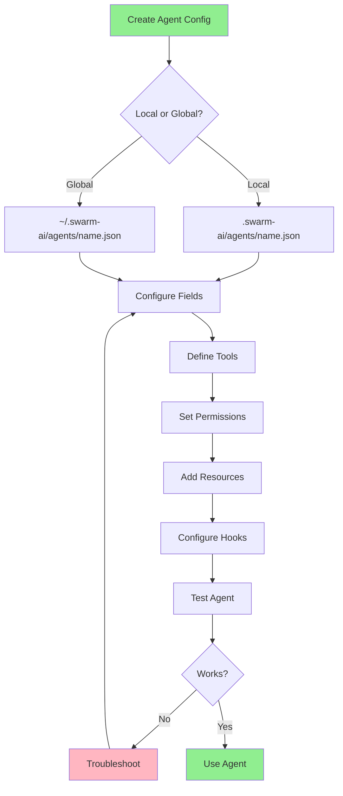
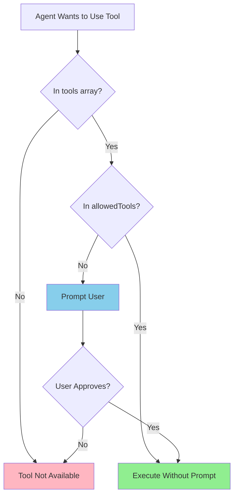
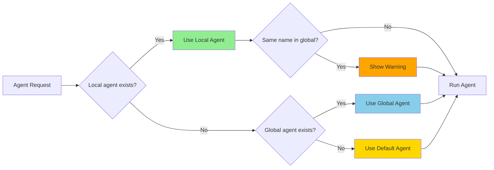

# Custom Agents

## Overview

Custom agents in SwarmAI allow you to tailor agent behavior for specific tasks by defining which tools are available, what permissions are granted, and what context is automatically included. This skill guides you through creating, configuring, and troubleshooting custom agents.

## Usage

Use this skill when:
- Creating new custom agent configurations
- Configuring tool access and permissions
- Setting up MCP server integrations
- Managing agent resources and context
- Troubleshooting agent loading or tool access issues
- Optimizing workflows with pre-approved tools
- Creating project-specific or team-shared agents

## Core Concepts

### Agent Configuration Files

Custom agents are defined using JSON configuration files:
- **Local agents**: `.swarm-ai/agents/<name>.json` (project-specific)
- **Global agents**: `~/.swarm-ai/agents/<name>.json` (user-wide)
- **Precedence**: Local agents override global agents with the same name

### Key Configuration Fields

**Required fields:**
- `name`: Agent identifier (derived from filename if not specified)
- `description`: Human-readable purpose description

**Optional fields:**
- `prompt`: High-level context (inline text or `file://` URI)
- `mcpServers`: MCP servers the agent can access
- `tools`: Available tools (built-in and MCP)
- `toolAliases`: Remap tool names to resolve collisions
- `allowedTools`: Pre-approved tools (no permission prompts)
- `toolsSettings`: Tool-specific configurations
- `resources`: Local files/documentation to include
- `hooks`: Commands to run at specific trigger points
- `includeMcpJson`: Include MCP servers from mcp.json files
- `model`: Model ID to use for this agent

### Tool References

**Built-in tools:**
- Specify by name: `"read"`, `"write"`, `"shell"`, `"cloud"`
- All built-in: `"@builtin"`

**MCP server tools:**
- All server tools: `"@server_name"`
- Specific tool: `"@server_name/tool_name"`
- All tools: `"*"`

### Permission Patterns

**Exact matches:**
- Built-in: `"read"`, `"shell"`
- MCP tool: `"@server_name/tool_name"`
- All server tools: `"@server_name"`

**Wildcards:**
- Prefix: `"read_*"` → `read_file`, `read_config`
- Suffix: `"*_status"` → `git_status`, `docker_status`
- MCP patterns: `"@server/read_*"`, `"@git-*/status"`

## Instructions

### Creating a Custom Agent

**Method 1: Interactive (Recommended)**

From within a SwarmAI chat session:

```bash
> /agent generate

✔ Enter agent name: · my-agent
✔ Enter agent description: · Specialized agent for my workflow
✔ Agent scope · Local (current workspace)
Select MCP servers: [use Space to toggle, Enter to confirm]

✓ Agent 'my-agent' has been created successfully!
```

**Method 2: CLI Command**

```bash
swarm-ai agent create --name my-agent
```

**Method 3: Manual Creation**

Create a JSON file in the appropriate location:
- Local: `.swarm-ai/agents/my-agent.json`
- Global: `~/.swarm-ai/agents/my-agent.json`

### Basic Configuration Structure

```json
{
  "name": "my-agent",
  "description": "A custom agent for my workflow",
  "tools": ["read", "write"],
  "allowedTools": ["read"],
  "resources": ["file://README.md"],
  "prompt": "You are a helpful coding assistant",
  "model": "claude-sonnet-4"
}
```

### Using Custom Agents

**Start with specific agent:**

```bash
swarm-ai --agent my-agent
```

**Swap agents in active session:**

```bash
> /agent swap

Choose one of the following agents:
❯ my-agent
  swarm_default
  backend-specialist
```

**List available agents:**

```bash
> /agent list
```

### Configuring Tools

**Include specific tools:**

```json
{
  "tools": [
    "read",
    "write",
    "shell",
    "@git",
    "@rust-analyzer/check_code"
  ]
}
```

**Pre-approve tools (no prompts):**

```json
{
  "allowedTools": [
    "read",
    "@git/git_status",
    "@server/read_*",
    "@fetch"
  ]
}
```

**Configure tool behavior:**

```json
{
  "toolsSettings": {
    "write": {
      "allowedPaths": ["src/**", "tests/**", "*.md"]
    },
    "shell": {
      "allowedCommands": ["git status", "npm test"],
      "autoAllowReadonly": true
    },
    "cloud": {
      "allowedServices": ["storage", "compute"]
    }
  }
}
```

### Handling Tool Name Collisions

Use `toolAliases` to resolve naming conflicts:

```json
{
  "toolAliases": {
    "@github-mcp/get_issues": "github_issues",
    "@gitlab-mcp/get_issues": "gitlab_issues",
    "@cloud-deploy/deploy_stack": "deploy_stack"
  }
}
```

### Adding MCP Servers

```json
{
  "mcpServers": {
    "fetch": {
      "command": "fetch-server",
      "args": []
    },
    "git": {
      "command": "git-mcp",
      "args": [],
      "env": {
        "GIT_CONFIG_GLOBAL": "/dev/null"
      },
      "timeout": 120000
    }
  }
}
```

**Remote MCP servers:**

```json
{
  "mcpServers": {
    "find-a-domain": {
      "type": "http",
      "url": "https://api.findadomain.dev/mcp"
    }
  }
}
```

### Including Resources

```json
{
  "resources": [
    "file://README.md",
    "file://.swarm-ai/steering/**/*.md",
    "file://docs/**/*.md",
    "file://infrastructure/**/*.yaml"
  ]
}
```

**Path resolution:**
- Relative paths: Resolved relative to agent config file
- Absolute paths: Used as-is
- Glob patterns: Supported for multiple files

### Using Prompts

**Inline prompt:**

```json
{
  "prompt": "You are an expert infrastructure specialist"
}
```

**External prompt file:**

```json
{
  "prompt": "file://./prompts/infra-expert.md"
}
```

### Configuring Hooks

Hooks run commands at specific trigger points:

```json
{
  "hooks": {
    "agentSpawn": [
      {
        "command": "git status",
        "timeout_ms": 5000,
        "cache_ttl_seconds": 300
      }
    ],
    "userPromptSubmit": [
      {
        "command": "ls -la"
      }
    ],
    "preToolUse": [
      {
        "matcher": "shell",
        "command": "{ echo \"$(date) - Bash:\"; cat; } >> /tmp/audit.log"
      }
    ],
    "postToolUse": [
      {
        "matcher": "write",
        "command": "cargo fmt --all"
      }
    ],
    "stop": [
      {
        "command": "npm test"
      }
    ]
  }
}
```

**Hook types:**
- `agentSpawn`: When agent is initialized
- `userPromptSubmit`: When user submits a message
- `preToolUse`: Before tool execution (can block)
- `postToolUse`: After tool execution
- `stop`: When assistant finishes responding

## Common Patterns

### Infrastructure Specialist Agent

```json
{
  "name": "infra-specialist",
  "description": "Specialized for infrastructure tasks",
  "tools": ["read", "write", "shell", "cloud"],
  "allowedTools": ["read", "cloud"],
  "toolsSettings": {
    "cloud": {
      "allowedServices": ["storage", "compute", "networking"]
    },
    "write": {
      "allowedPaths": ["infrastructure/**", "*.yaml"]
    }
  },
  "resources": [
    "file://README.md",
    "file://infrastructure/**/*.yaml"
  ],
  "hooks": {
    "agentSpawn": [
      {
        "command": "whoami",
        "timeout_ms": 10000
      }
    ]
  }
}
```

### Development Workflow Agent

```json
{
  "name": "dev-workflow",
  "description": "General development with Git integration",
  "mcpServers": {
    "git": {
      "command": "git-mcp-server",
      "args": []
    }
  },
  "tools": ["read", "write", "shell", "@git"],
  "allowedTools": [
    "read",
    "@git/git_status",
    "@git/git_log",
    "@git/git_diff"
  ],
  "toolAliases": {
    "@git/git_status": "status",
    "@git/git_log": "log"
  },
  "toolsSettings": {
    "write": {
      "allowedPaths": ["src/**", "tests/**", "*.md"]
    }
  },
  "hooks": {
    "agentSpawn": [
      {
        "command": "git status --porcelain"
      },
      {
        "command": "git branch --show-current"
      }
    ]
  }
}
```

### Code Review Agent

```json
{
  "name": "code-reviewer",
  "description": "Specialized for code review and quality analysis",
  "tools": ["read", "shell"],
  "allowedTools": ["read", "shell"],
  "toolsSettings": {
    "shell": {
      "allowedCommands": [
        "grep", "find", "git diff", "git log",
        "eslint", "pylint"
      ]
    }
  },
  "resources": [
    "file://CONTRIBUTING.md",
    "file://docs/coding-standards.md",
    "file://.eslintrc.json"
  ],
  "hooks": {
    "agentSpawn": [
      {
        "command": "git diff --name-only HEAD~1"
      }
    ]
  }
}
```

## Troubleshooting

### Agent Not Found

**Symptoms:**
- `/agent list` doesn't show your agent
- Fallback to default agent

**Solutions:**
- Verify file location: `.swarm-ai/agents/<name>.json` or `~/.swarm-ai/agents/<name>.json`
- Check file permissions (must be readable)
- Ensure `.json` extension
- Verify filename matches agent name

### Invalid JSON Syntax

**Symptoms:**
- "Invalid JSON" or "syntax error" messages
- Agent not loading

**Solutions:**
- Validate JSON with a linter
- Check for:
  - Missing commas between elements
  - Trailing commas after last element
  - Unmatched brackets/braces
  - Unescaped quotes in strings
- Use `/agent schema` to verify structure

### Tool Not Available

**Symptoms:**
- Error about unknown/unavailable tools
- Permission prompts for allowed tools

**Solutions:**
- Verify tool names are spelled correctly
- For MCP tools, ensure server is configured in `mcpServers`
- Use correct syntax: `@server_name/tool_name`
- Check that tools are in both `tools` and `allowedTools` arrays
- Verify MCP servers are running

### Empty Tools List

**Symptoms:**
- `/tools` returns empty list
- Expected tools missing

**Solutions:**
- Check `tools` array is not empty
- Verify tool names are correct (case-sensitive)
- For MCP tools, use server-prefixed format: `@server-name/tool-name`
- Test with default agent to confirm tools are available
- Check MCP server status

### Wrong Agent Version Loading

**Symptoms:**
- Behavior doesn't match recent changes
- Warning about agent conflicts

**Solutions:**
- Check for name conflicts between local and global
- Remember local agents take precedence
- Use `/agent list` to see which version is loaded
- Remove or rename conflicting agent files

### MCP Server Issues

**Symptoms:**
- MCP tools not working
- Server connection errors

**Solutions:**
- Verify MCP server commands are correct
- Check executables are in PATH
- Ensure required environment variables are set
- Test MCP servers independently
- Review MCP server logs
- Increase timeout values if needed

## Best Practices

### Configuration Design

- **Start restrictive**: Begin with minimal tool access, expand as needed
- **Name clearly**: Use descriptive names indicating purpose
- **Document well**: Add clear descriptions for team understanding
- **Version control**: Store agent configs in project repository
- **Test thoroughly**: Verify permissions work before sharing

### Local vs Global Agents

**Use Local Agents For:**
- Project-specific configurations
- Agents needing project files/tools
- Development environments with unique requirements
- Sharing with team via version control

**Use Global Agents For:**
- General-purpose agents across projects
- Personal productivity agents
- Agents without project-specific context
- Commonly used tools and workflows

### Security

- Review `allowedTools` carefully
- Use specific patterns over wildcards
- Configure `toolsSettings` for sensitive operations
- Test agents in safe environments first
- Limit tool scope to relevant paths/services

### Organization

- Use descriptive agent names
- Document agent purposes in descriptions
- Keep prompt files organized
- Version control local agents with projects
- Share team agents through repository

## Quick Reference

### Common Commands

| Command | Purpose |
|---------|---------|
| `/agent generate` | Create agent interactively |
| `/agent list` | Show available agents |
| `/agent swap` | Switch to different agent |
| `/agent schema` | View configuration schema |
| `/tools` | List available tools |
| `swarm-ai --agent <name>` | Start with specific agent |

### File Locations

| Location | Type | Scope |
|----------|------|-------|
| `.swarm-ai/agents/<name>.json` | Local | Current workspace |
| `~/.swarm-ai/agents/<name>.json` | Global | User-wide |
| `.swarm-ai/settings/mcp.json` | Local MCP | Current workspace |
| `~/.swarm-ai/settings/mcp.json` | Global MCP | User-wide |

### Tool Reference Patterns

| Pattern | Matches |
|---------|---------|
| `"read"` | Built-in read tool |
| `"@builtin"` | All built-in tools |
| `"*"` | All available tools |
| `"@server"` | All tools from server |
| `"@server/tool"` | Specific MCP tool |
| `"read_*"` | Tools starting with read_ |
| `"*_status"` | Tools ending with _status |
| `"@git-*/status"` | status tool from git-* servers |

## Common Mistakes

### Missing Tools in Both Arrays

**Problem:** Tool listed in `allowedTools` but not in `tools`.

**Fix:** Tools must be in both `tools` (available) and `allowedTools` (pre-approved).

```json
{
  "tools": ["read", "write"],
  "allowedTools": ["read"]
}
```

### Incorrect MCP Tool Syntax

**Problem:** Using tool name without server prefix.

**Fix:** MCP tools require `@server_name/tool_name` format.

```json
{
  "tools": ["@git/git_status"],
  "allowedTools": ["@git/git_status"]
}
```

### Relative Path Confusion

**Problem:** Relative paths not resolving correctly.

**Fix:** Relative paths in `resources` and `prompt` are resolved relative to the agent config file location, not current working directory.

### Trailing Commas in JSON

**Problem:** JSON parsing fails with trailing commas.

**Fix:** Remove trailing commas after last array/object elements.

```json
{
  "tools": ["read", "write"]  // No comma after last element
}
```

### Wildcard in allowedTools

**Problem:** Using `"*"` in `allowedTools` to allow all tools.

**Fix:** `allowedTools` doesn't support `"*"` wildcard. Use specific patterns or server-level permissions.

```json
{
  "allowedTools": ["@builtin", "@git", "read_*"]
}
```

## Visual Diagrams

### Agent Configuration Flow



### Tool Permission Decision Tree



### Agent Precedence



## The Bottom Line

Custom agents in SwarmAI provide powerful workflow optimization by pre-configuring tool access, permissions, resources, and context. They eliminate permission prompts, reduce complexity, and enable team collaboration through shared configurations. Start simple, test thoroughly, and expand capabilities as needed.

