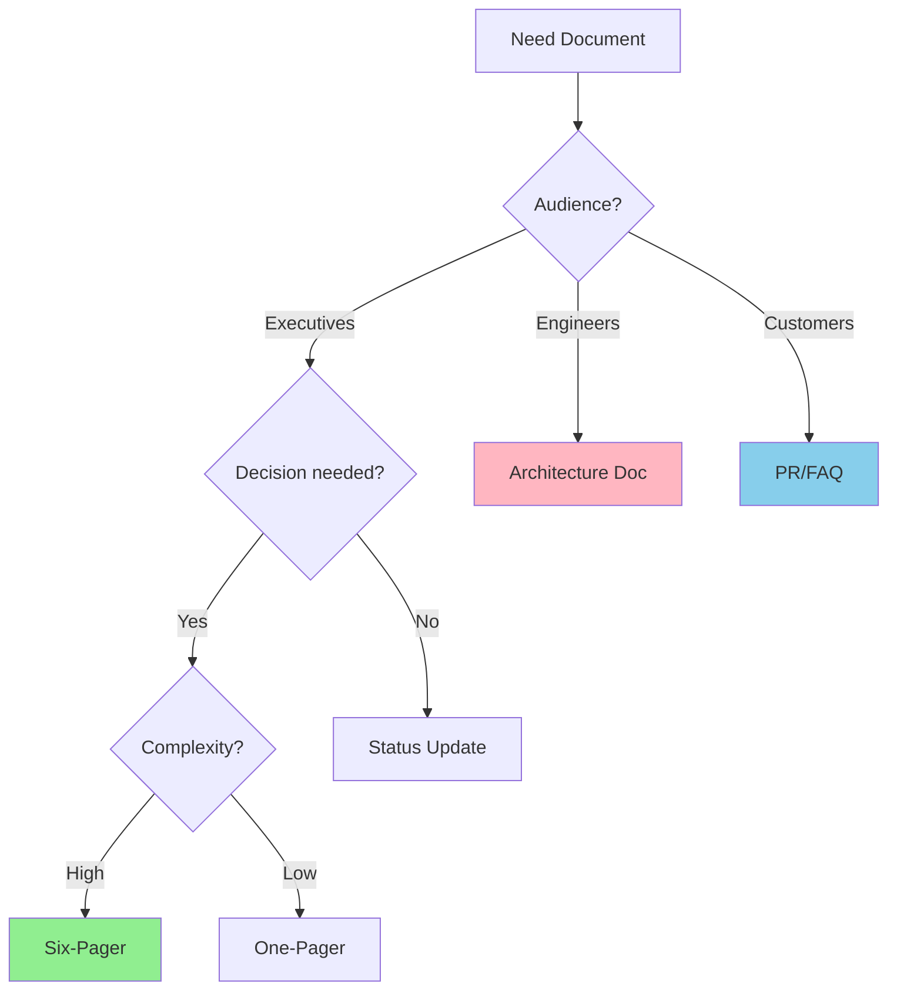

# Narrative Writing

## Overview

Structured narrative writing drives decision-making, innovation, and customer focus through well-crafted documents. This skill provides patterns, templates, and rules for effective writing across all document types.

**Core principle:** Write clear, data-driven documents that enable decisions and action.

## Output Location

**All generated documents should be saved to:**
```
~/.swarm-ai/SwarmWS/Knowledge/Notes/
```

This is the designated location for draft documents. Once finalized and approved, documents can be moved to `Knowledge/Library/`.

## Usage

Use this skill when:
- Writing 1-6 page narratives for decisions or proposals
- Creating technical documentation (architecture, features, services)
- Drafting business planning documents (OP1/OP2, interview feedback)
- Improving document clarity, structure, or data presentation
- Checking for weasel words and ambiguous language

When encountering:
- "Write a six-pager for..."
- "Create a PR/FAQ for..."
- Document contains weasel words ("generally", "usually", "might")
- Feedback: "Be more specific" or "Add metrics"
- Need to structure technical documentation
- Preparing for document review meeting

**When NOT to use:**
- Quick status updates or emails (use concise email format)
- Informal team communications (use chat/Slack)
- External customer-facing content (use marketing guidelines)
- Code documentation (use language-specific doc standards)

## Instructions

### Writing a New Document

**Recommended workflow:**

1. **Gather requirements:**
   - What document type?
   - Who is the audience?
   - What needs to be communicated?
   
2. **Get initial structure** (choose one):
   - **Option A (Preferred)**: User provides template with rough draft notes
   - **Option B**: User describes what each section should cover in one sentence
   
3. **Iterate section by section:**
   - Ask clarifying questions to gather information for this section
   - Write the section based on answers
   - Review with user
   - Iterate until user approves
   - Move to next section
   
4. **Apply standards during iteration:**
   - Documents **MUST** include title with document type and date
   - Documents **MUST** include executive summary (purpose + recommendation + decisions)
   - You **MUST** use logical heading hierarchy (H1 title, H2 sections, H3 subsections)
   - Documents **SHOULD** include table of contents for documents > 3 pages
   - You **MUST** use active voice
   - You **MUST** eliminate weasel words
   - You **MUST** support claims with specific metrics
   - You **SHOULD** front-load important information
   - You **MUST NOT** use emojis
   - Tables **MUST** include units and context
   - Charts **MUST** be labeled clearly with one message per chart
   - Documents **MUST** use minimum 10pt body text
   - Documents **MUST** maintain high contrast for accessibility
   
5. **Final review:**
   - You **MUST** verify six-page limit (appendices excluded)
   - You **MUST** check for weasel words using `scripts/check-weasel-words.sh`
   - You **SHOULD** have peer review before submission

**Note:** Section-by-section iteration is more effective than creating a complete draft upfront.

### Improving Existing Documents

1. **Scan for weasel words** using `scripts/check-weasel-words.sh <file>`
2. **Replace vague language** with specific metrics (see reference/weasel-words.md)
3. **Restructure if needed**:
   - You **MUST** move important information to executive summary
   - You **SHOULD** use SCQA framework (Situation, Complication, Question, Answer)
4. **Enhance data presentation** (see reference/data-presentation.md):
   - You **MUST** add context to metrics
   - You **SHOULD** convert prose to tables where appropriate
5. **Fix visual formatting** (see reference/visual-formatting.md):
   - Documents **MUST** ensure minimum 10pt text
   - You **SHOULD** add white space between sections

### Using Supporting Files

**scripts/check-weasel-words.sh:**
- You **MUST** run before finalizing any document
- Detects ambiguous language requiring specific metrics
- Exit code 1 if weasel words found, 0 if clean

**reference/weasel-words.md:**
- You **SHOULD** consult when replacing vague language
- Contains comprehensive list with specific replacements

**reference/data-presentation.md:**
- You **MUST** follow when adding tables or charts
- Provides formatting standards and examples

**reference/visual-formatting.md:**
- You **MUST** follow for document layout
- Ensures accessibility and readability

## Core Concepts

### Narrative Culture
- Teams **MUST** use written documents over presentations for decisions
- Meetings **MUST** start with silent reading (15-30 minutes) for shared context
- Documents **MUST** respect six-page limit (excluding appendices) to force concise, actionable writing
- Teams **SHOULD** use Working Backwards: Start with customer problem, not solution
- Arguments **MUST** be data-driven: supported by metrics and evidence

### Document Types

| Type | Length | Purpose |
|------|--------|---------|
| One-pager | 1 page | High-level goals, tenets, design |
| Six-pager | 6 pages + appendices | Decisions, proposals, strategy |
| PR/FAQ | 1-2 pages + FAQ | Product launches, features |
| Architecture Doc | Variable | System design, technical decisions |
| OP1/OP2 | 6 pages + appendices | Annual planning |
| Interview Feedback | 1-2 pages | Candidate assessment |

### Choosing Document Type



## Document Structure

### Foundation
- **Title**: Documents **MUST** have clear, descriptive titles with document type and date
- **Executive Summary**: Documents **MUST** include purpose, key points, and decisions needed
- **Objective**: You **MUST** state goal in first paragraph
- **Scope**: You **SHOULD** clarify what you will and won't cover
- **Table of Contents**: Documents **SHOULD** include table of contents for documents > 3 pages

### Organization
- **Logical hierarchy**: You **MUST** use H1 for title, H2 for major sections, H3 for subsections
- **Most important first**: You **MUST** lead with key information
- **Clear sections**: You **MUST** use descriptive headings and group related content
- **SCQA framework**: You **SHOULD** use Situation, Complication, Question, Answer structure
- **Consistent formatting**: You **MUST** maintain consistent headings, spacing, typography

### Conclusion
- **Clear recommendations**: You **MUST** provide recommendations, not just analysis
- **Next steps**: You **MUST** include specific actions with owners and deadlines
- **Key points summary**: You **SHOULD** include summary for lengthy documents
- **Proactive Q&A**: You **SHOULD** address potential questions

### Supporting Elements
- **Appendices**: You **SHOULD** use appendices for supporting details that disrupt main flow
- **Six-page limit**: The limit **MUST** apply to main narrative only (appendices excluded)
- **Metadata**: Documents **SHOULD** include page numbers and confidentiality in footer

## Quick Reference

| Task | Pattern | Example |
|------|---------|---------|
| Executive Summary | Purpose + Recommendation + Decisions | See Common Patterns below |
| Problem Statement | Customer + Problem + Data | "42 users reported login failures between 2-4pm" |
| Recommendation | Action + Benefits + Next Steps | "We recommend X because [metric]" |
| Weasel Word Check | Scan for vague terms | Use `check-weasel-words.sh` |
| Data Presentation | Tables with headers, units, context | See reference/data-presentation.md |
| Visual Formatting | 10pt minimum, high contrast | See reference/visual-formatting.md |

## Common Patterns

### Executive Summary
```markdown
## Executive Summary

[Purpose in 1 sentence]

[Key recommendation with 2-3 supporting points]

Key decisions needed:
1. [Decision 1 with owner]
2. [Decision 2 with owner]

[Impact: cost, timeline, resources]
```

### Problem Statement
```markdown
Today, [customers] have to [problem] when [situation]. 
Customers need a way to [need].

**Data:** [evidence with metrics]
```

### Recommendation
```markdown
We recommend [action] because:
- [Benefit 1 with metric]
- [Benefit 2 with metric]
- [Benefit 3 with metric]

Next steps:
1. [Action] by [date] (Owner: [name])
2. [Action] by [date] (Owner: [name])
```

### Before/After: Vague → Specific

**Timelines:**
- ❌ "We'll improve performance soon"
- ✅ "We'll reduce p99 latency from 500ms to 200ms by Q2 2025"

**Customer Evidence:**
- ❌ "Many customers requested this feature"
- ✅ "127 enterprise customers (23% of revenue) requested SSO in Q3 feedback"

**Impact:**
- ❌ "This will significantly reduce costs"
- ✅ "This will reduce infrastructure costs from $50K/month to $12K/month (76% reduction)"

**Scope:**
- ❌ "We'll generally support most use cases"
- ✅ "We'll support batch uploads up to 10K records and real-time sync for <100 concurrent users"

## Language Precision

### Sentence-Level Clarity
You **MUST** write for busy readers who skim. Every word must earn its place.

**Active voice over passive:**
- ❌ "The feature was implemented by the team" 
- ✅ "The team implemented the feature"

**Short sentences:**
- ❌ "We analyzed the data and found that customers who use the mobile app, which was launched last quarter, tend to complete purchases 40% faster than those using the desktop version, though this varies by region"
- ✅ "Mobile app users complete purchases 40% faster than desktop users. This varies by region."

**Front-load important information:**
- ❌ "After analyzing customer feedback and reviewing competitive offerings, we recommend implementing SSO"
- ✅ "We recommend implementing SSO. Customer feedback and competitive analysis support this."

**Cut unnecessary words:**
- ❌ "In order to improve performance" → ✅ "To improve performance"
- ❌ "Due to the fact that" → ✅ "Because"
- ❌ "At this point in time" → ✅ "Now"

**Eliminate jargon:**
- ❌ "Leverage synergies to optimize the customer journey"
- ✅ "Combine teams to improve customer experience"

### Document Structure and Style

You **MUST NOT** use mdashes or semicolons in narrative documents.

**Document organization:**
- You **MUST** split documents into main body followed by appendices
- You **MUST** use narrative format in main body (prefer prose over bullet points)
- You **SHOULD** write fewer, longer paragraphs rather than many 2-3 sentence paragraphs

**Word choice:**
- You **MUST NOT** use fancy words or superlatives (they obscure meaning and signal weak arguments that lack data)
- You **MUST** avoid overused words like "comprehensive", "critical", and "significant"
- You **SHOULD** use simple, direct language that conveys meaning clearly

### Weasel Words
You **MUST** avoid ambiguous language that lacks commitment. You **MUST** replace vague terms with specific metrics and commitments.

**Quick examples:**
- ❌ "We will launch soon" → ✅ "We will launch on October 15, 2025"
- ❌ "Performance significantly improved" → ✅ "Response time decreased from 300ms to 120ms"
- ❌ "Many users reported issues" → ✅ "42 users reported login failures between 2-4pm"

**For comprehensive weasel words list and replacements**, see `reference/weasel-words.md`

## Data Presentation

You **MUST** present data clearly to support decision-making:
- **Tables**: Tables **MUST** use clear headers and consistent formatting, Tables **MUST** include units
- **Charts**: Charts **MUST** use appropriate type, Charts **MUST** be labeled clearly, Charts **MUST** convey one message per chart
- **Metrics**: You **MUST** use specific numbers with context and comparisons

**For detailed data presentation guidelines**, see `reference/data-presentation.md`

## Visual Formatting

Documents **MUST** maintain professional, readable appearance:
- **Typography**: Documents **MUST** use minimum 10pt body text, Documents **MUST** use consistent fonts
- **White space**: You **SHOULD** separate ideas with clear section breaks
- **Accessibility**: Documents **MUST** use high contrast, Documents **SHOULD** include alt text, Documents **MUST** maintain logical reading order

**For complete visual formatting standards**, see `reference/visual-formatting.md`

## Supporting Files

### reference/weasel-words.md
Comprehensive list of weasel words with specific replacements.

**When to use:**
- Replacing vague language with specific metrics
- Understanding why certain words weaken arguments
- Finding concrete alternatives to ambiguous terms

**Contents:**
- Complete weasel words list organized by category
- Specific replacement patterns with examples
- Context for when vague language is acceptable

### reference/data-presentation.md
Standards and examples for presenting data in tables and charts.

**When to use:**
- Adding tables or charts to documents
- Formatting existing data visualizations
- Choosing appropriate chart types

**Contents:**
- Table formatting standards (headers, units, alignment)
- Chart selection guide (when to use each type)
- Examples of effective vs ineffective data presentation
- Accessibility requirements for data visualizations

### reference/visual-formatting.md
Document layout and typography standards for readability and accessibility.

**When to use:**
- Formatting new documents
- Improving readability of existing documents
- Ensuring accessibility compliance

**Contents:**
- Typography standards (fonts, sizes, spacing)
- White space usage guidelines
- Accessibility requirements (contrast, alt text, reading order)
- Page layout best practices

## Deterministic Scripts

### scripts/check-weasel-words.sh
Scans documents for weasel words that require specific replacements.

**When to use:**
- You **MUST** run before finalizing any document
- During document review process
- When feedback indicates vague language

**Parameters:**
- `<file>` - Path to document file to check

**Output:**
- Lists all weasel words found with line numbers
- Exit code 1 if weasel words found, 0 if clean

**Example:**
```bash
./scripts/check-weasel-words.sh my-document.md
```

**What it checks:**
- Vague qualifiers (generally, usually, might, approximately)
- Weak commitments (could, should, may, possibly)
- Ambiguous frequency (often, rarely, sometimes)
- Uncertain language (seem, appear, tend)

## Common Mistakes

### Vague Language
**Problem**: Using weasel words like "generally", "usually", "might"
**Fix**: Use specific metrics and commitments

### Burying the Lead
**Problem**: Important information deep in document
**Fix**: Executive summary upfront, recommendations early

### Weak Data Presentation
**Problem**: Unclear tables, missing context, no insights
**Fix**: Clear headers, units, context, and interpretation

### Poor Structure
**Problem**: Inconsistent headings, no logical flow
**Fix**: Logical hierarchy, descriptive headings, clear transitions

### Exceeding Page Limit
**Problem**: Trying to fit too much in main narrative
**Fix**: Move supporting details to appendices, be concise

## Working Backwards

The Working Backwards process **MUST** start with the customer and work backward to the solution. You **MUST** use the 5 Customer Questions framework:

1. **Who is the customer?** You **MUST** be specific about the target customer segment
2. **What is the customer problem or opportunity?** You **MUST** describe the pain point or unmet need
3. **What is the most important customer benefit?** You **MUST** focus on the primary value delivered
4. **How do you know what customers need?** You **MUST** cite research, data, feedback
5. **What does the customer experience look like?** You **MUST** describe the end-to-end experience

### PR/FAQ Format
- **Press Release**: The press release **MUST** be written as if the product launched today
- **FAQ**: The FAQ **MUST** include anticipated questions from customers, press, internal stakeholders
- **Customer-focused**: You **MUST** emphasize benefits, not features
- **Concrete**: You **MUST** include specific examples and use cases

## The Bottom Line

Structured narrative writing transforms complex ideas into clear, actionable documents. Key principles:

1. **Start with the customer** - Working Backwards approach
2. **Be specific** - Avoid weasel words, use metrics
3. **Structure clearly** - Executive summary, logical flow, recommendations
4. **Present data effectively** - Tables, charts, context
5. **Stay concise** - Six-page limit forces clarity
6. **Enable decisions** - Clear recommendations with next steps

Write documents that drive decisions, enable implementation, and align teams around customer needs.
