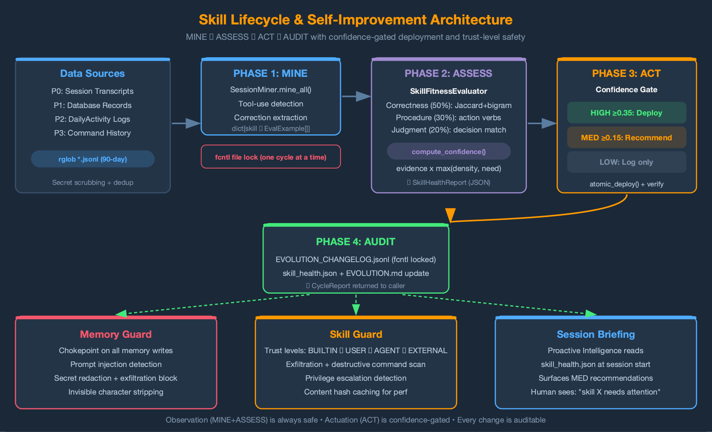

# AIDLC Phase 3: Autonomous Pipeline

## Executive Summary

Phase 3 of the AI-Driven Development Lifecycle (AIDLC) defines the architecture for **autonomous AI-driven software development** — where AI agents triage, plan, build, ship, and learn with humans intervening only at intake approval and taste-level decisions.

The architecture rests on three interlocking methodologies that form a single closed loop:

| Layer | Question | Role |
|-------|----------|------|
| **DDD** (Domain-Driven Design) | Should we? Can we? Have we tried? | Judgment substrate — provides business context for autonomous decisions |
| **SDD** (Spec-Driven Development) | What exactly? | Specification contract — ties intent to implementation |
| **TDD** (Test-Driven Development) | Did we build it correctly? | Binary verification gate — replaces human code review |

**Without DDD**, the pipeline builds the wrong thing. **Without SDD**, the pipeline builds something undefined. **Without TDD**, there's no way to verify the pipeline built it correctly.

The pipeline processes a one-sentence requirement through 8 stages (EVALUATE → THINK → PLAN → BUILD → REVIEW → TEST → DELIVER → REFLECT), classifies every decision as mechanical/taste/judgment, and writes lessons back to the knowledge layer — making every run smarter than the last.

**Target outcomes:**
- 6x throughput over Phase 1 baseline
- 30%+ of intake handled autonomously (no human intervention)
- Human effort shifts from reviewing code to reviewing acceptance criteria

This document is implementation-agnostic. The patterns described here apply to any AI agent system that processes software development tasks — the reference implementation validates but does not constrain the architecture.

---

## 1. The Problem: Human Coordination & Decision-Making as Bottleneck

Phase 2 (AI-Executor) achieved 4x throughput: AI enhanced Intake, Requirements, Planning, Specs, and executes. Humans (TPMs, PMTs, Engineers, and stakeholders) coordinate and decide. But the bottleneck shifted. **Human coordination and decision-making is now the serial constraint in a parallel system.** Every intake process needs review across different stages. Every requirement and architecture choice needs approval. Every intake, plan, and requirement needs human judgment.

The insight: not all decisions require human judgment. Analysis of real pipeline runs shows a consistent distribution:

| Decision Type | Frequency | Human Needed? | Phase 3 Handling |
|---------------|-----------|---------------|------------------|
| **Mechanical** | ~60% | No — one correct answer derivable from context | Auto-approve, log for audit |
| **Taste** | ~25% | At review only — reasonable default exists | Batch at delivery gate |
| **Judgment** | ~15% | Yes, immediately — genuinely ambiguous, high-stakes | Block pipeline, checkpoint, wait |

Phase 3 exploits this distribution. The human's role shifts from **reviewing every artifact** to **reviewing intake decisions and taste overrides** — a 5x reduction in required attention per task.

---

## 2. Three-Phase Evolution Context

```
Phase 1: AI-Assistant      Human drives, AI assists       2x
Phase 2: AI-Driven/First   AI plans, Human decides        4x
Phase 3: AI-Management     AI autonomous, Human at triage  6x
```

Phase 3 is NOT "AI does everything." It is a **spectrum**. Well-defined domains with mature knowledge layers run autonomously. Complex or novel projects stay in Phase 2. The boundary shifts as domain knowledge accumulates and the system's calibration improves.

**Three diagnostic questions** determine whether a team is genuinely operating at Phase 3:

1. **Do specs and tests come before code?** Code-first = Phase 2 at best.
2. **Are senior engineers designing domain models — not writing code?** The shift from coder to domain architect is the Phase 3 signal.
3. **Is judgment encoded in specs that govern agents — or spent reviewing generated code by hand?** Manual code review = Phase 2. Spec-governed autonomous execution = Phase 3.

---

## 3. Architecture: The DDD + SDD + TDD Closed Loop

### Why Three Methodologies, Not One

Each methodology solves one specific problem in autonomous execution. None is sufficient alone:

| Methodology | What It Solves | What Breaks Without It |
|-------------|----------------|----------------------|
| **DDD** | Gives agents business understanding — strategic alignment, historical context, architectural constraints | Agents build technically correct but strategically wrong solutions |
| **SDD** | Makes specs the single source of truth — the contract between intent and implementation | No verifiable definition of "done"; agents and humans disagree on scope |
| **TDD** | Provides binary pass/fail quality gate — tests encode acceptance criteria in executable form | No automated way to verify correctness; human review remains the bottleneck |

### The Closed Loop

The three methodologies are not independent practices bolted together. They form a single closed loop where each phase's output is the next phase's input:

```
DDD ("What should we build?")
  PRODUCT.md  → priorities, non-goals
  TECH.md     → constraints, cost models
  IMPROVE.md  → historical patterns
  PROJECT.md  → current focus
        |
        v
SDD ("Here's the spec")
  Design doc + acceptance criteria (binary)
  API contracts, data models
        |
        v
TDD ("Here's proof we built it")
  RED   — tests from criteria (all fail)
  GREEN — code until tests pass
  VERIFY — full suite, zero regressions
        |
        v
REFLECT ("What did we learn?")
  Lessons   → IMPROVEMENT.md
  Costs     → TECH.md calibration
  Weights   → decision-strategy.json
        |
        '--- feeds back to DDD ---'
```

**The key constraint:** tests are derived from acceptance criteria, which are derived from DDD-informed specs. If a test fails, fix the code — not the test. Changing a test means changing the spec, which means going back to PLAN. This discipline makes the loop self-reinforcing rather than self-undermining.

### Why Now — LLMs Change the Economics

DDD and TDD aren't new. Teams skipped them for decades because:
- **DDD was expensive:** maintaining detailed domain models alongside hand-written code doubled the documentation burden.
- **TDD was slow:** writing tests before code felt like extra work when a human was writing both.

LLMs flip both trade-offs:
- **DDD becomes cheap.** The domain model IS the input. LLMs generate code from specs. The cost of keeping models detailed and current drops to near-zero.
- **TDD becomes the fastest path.** Test generation is nearly free. Binary pass/fail eliminates subjective human evaluation. Agents generate → test → adjust → iterate at machine speed.

The discipline developers resisted for years now makes them faster than ever. DDD tells the agent what to build. TDD tells the agent when it's done. Without either, an autonomous agent is just generating code and hoping for the best.

---

## 4. DDD Knowledge Layer — The Brain

### Document-as-Bounded-Context

Traditional DDD assumes a world of classes and objects — Entities, Value Objects, Aggregates, Repositories. AI agents don't operate on object graphs. They process text, reason over context, and produce output.

The paradigm migration maps DDD's strategic principles into the document-centric world of AI agents:

| Traditional DDD | Document-as-Bounded-Context |
|---|---|
| Bounded Context = Code module | Bounded Context = Knowledge document (`.md` file) |
| Aggregate Root = Entry Entity | Each document IS its own Aggregate Root |
| Ubiquitous Language = Class/method names | Ubiquitous Language = Document terminology and conventions |
| Repository = Database access layer | Filesystem IS the Repository |
| Domain Event = Event bus message | Task outcome = Feedback loop signal |
| Context Map = API contracts between modules | Stage-scoped loading = controlled information flow |

The strategic principles transfer directly: **bounded contexts** prevent cross-domain pollution, **single ownership** ensures each question has one authoritative answer, and **ubiquitous language** ensures the agent and the domain documentation speak the same terms.

### The 4 Pillars of Autonomous Judgment

Every project maintains 4 knowledge documents. Together they answer the 4 questions an autonomous agent must resolve before acting:

| Document | Question | Owns | Cross-Boundary Rule |
|---|---|---|---|
| **PRODUCT.md** | Should we do this? | Strategic alignment, roadmap, priorities, non-goals, business impact | Never estimates technical cost |
| **TECH.md** | Can we do this? | Architecture, conventions, constraints, cost models, dependency map | Never judges business severity |
| **IMPROVEMENT.md** | Have we tried this? | Historical patterns, lessons learned, what worked, what failed, recurring issues | Never sets future priorities |
| **PROJECT.md** | Should we do it now? | Current focus, open items, sprint context, active decisions, capacity | Never overrides strategic direction |

**Documents cannot cross boundaries.** TECH.md never judges whether a feature is strategically important. PRODUCT.md never estimates how long something takes to build. This is DDD's single-ownership principle enforced at the document level.

**Why 4 documents, not 5?** The original investigation proposed BUSINESS.md as a separate document owning severity and cost-of-delay scoring. In practice, business impact scoring is inseparable from strategic alignment — PRODUCT.md absorbs both dimensions. Fewer documents reduce coordination cost and boundary-violation risk. A 5th document should be added only when there is a genuinely independent decision domain that the existing 4 cannot serve.

### Stage-Scoped Document Loading

In traditional microservices, Bounded Contexts communicate via well-defined APIs. In an agent system, the equivalent is **each pipeline stage loads only the documents it needs** — never all 4:

| Stage | Documents Loaded | Decision Scope |
|---|---|---|
| EVALUATE | PRODUCT + TECH + IMPROVEMENT + PROJECT | ROI scoring, go/defer/reject — the only stage that reads all 4 |
| THINK | PRODUCT + IMPROVEMENT | Strategic alignment + historical patterns for research direction |
| PLAN | PRODUCT + PROJECT | Design aligned with priorities and current sprint |
| BUILD | TECH + PROJECT | Code generation with conventions + sprint context |
| REVIEW | TECH + IMPROVEMENT | Quality check against known issues and security patterns |
| TEST | TECH + IMPROVEMENT | Test conventions + flaky test history |
| DELIVER | PROJECT | Status update, delivery context |
| REFLECT | IMPROVEMENT (write) | Lesson extraction, calibration data writeback |

This solves two problems:

1. **Context window efficiency** — Loading all documents at every stage wastes tokens and introduces noise. A BUILD stage reading PRODUCT.md gains nothing but distraction.
2. **Information isolation** — Each stage makes better decisions when it sees only the information relevant to its scope. Less context = more focused judgment.

### ROI Scoring — The EVALUATE Gate

Before committing pipeline resources, the EVALUATE stage scores every incoming requirement against DDD documents:

```
ROI = w₁ × Strategic_Alignment(PRODUCT.md)     [default: 0.35]
    + w₂ × Current_Priority(PROJECT.md)         [default: 0.25]
    + w₃ × Historical_Leverage(IMPROVEMENT.md)   [default: 0.15]
    - w₄ × Inverse_Feasibility(TECH.md)          [default: 0.25]

where Inverse_Feasibility = 6 - Feasibility_Score
      (higher cost → lower ROI)
```

Each dimension is scored 1-5, with evidence cited from the owning document. The scores are not gut feelings — they are traceable judgments ("Strategic alignment: 4/5 — directly serves priority #2 per PRODUCT.md").

| Decision | ROI Threshold | Pipeline Action |
|----------|---------------|-----------------|
| **GO** | ≥ 3.2 | Define scope, select profile, advance to THINK |
| **DEFER** | 2.0 – 3.1 | Log to PROJECT.md backlog with reasoning |
| **REJECT** | < 2.0 | Explain why, suggest alternative if one exists |
| **ESCALATE** | Any score with low confidence | Surface specific questions — don't guess |

Weights are stored in `decision-strategy.json` (per-project) and auto-calibrate over time. The REFLECT stage compares predicted ROI against actual outcome and nudges weights accordingly.

### decision-strategy.json — Persistent Calibration

Every session, the agent starts as a blank slate. `decision-strategy.json` ensures scoring consistency across sessions and prevents parameter drift:

```json
{
  "weights": {
    "strategic_alignment": 0.35,
    "priority_urgency": 0.25,
    "historical_leverage": 0.15,
    "feasibility": 0.25
  },
  "thresholds": { "go": 3.2, "defer": 2.0 },
  "calibration_history": [
    { "run_id": "...", "predicted_roi": 3.6,
      "actual_outcome": "success", "delta": 0.0 }
  ]
}
```

The calibration history enables the feedback loop to detect systematic over- or under-scoring and adjust weights. An agent that consistently overestimates strategic alignment and underestimates cost will have its weights rebalanced automatically.

### Progressive DDD Maturity

DDD knowledge is not a prerequisite. It grows organically from the work itself:

```
Day 1:   Project created → 4 templates. Pipeline works at L0.
Day 3:   First QA run → agent fills TECH.md test commands.
Day 7:   QA finds recurring bug pattern → auto-writes to IMPROVEMENT.md.
Day 14:  Design decision → agent reads PRODUCT.md for alignment.
Day 30:  Sufficient lessons accumulated → Phase 3 pilot feasible for this project.
```

**The rule:** No pipeline capability requires DDD documents to be populated. DDD makes every stage smarter; absence of DDD never makes any stage non-functional. This eliminates the cold-start problem that kills most knowledge management initiatives.

### Three Operating Levels

| Level | State | What Works |
|---|---|---|
| **L0** | No project context | All stages function standalone. Output stays in the current session. |
| **L1** | Project exists | + Artifact chaining via per-run storage. Pipeline state is tracked and resumable. |
| **L2** | Full DDD documents | + DDD context injection at every stage. ROI scoring uses real evidence. Strategic alignment is verifiable. |

### Cross-Document Consistency

Documents are independent bounded contexts, but they can fall out of sync. Automated cross-document consistency checks enforce structural integrity:

- **Non-goal vs architecture:** If PRODUCT.md lists "not a cloud SaaS" as a non-goal, TECH.md should not describe a cloud deployment architecture.
- **Staleness detection:** If TECH.md references a dependency that was removed 30 days ago (per git history), flag the section as stale.
- **DDD auto-update suggestions:** When structural code changes occur (new packages, components, routes, dependencies detected from version control), the system suggests specific doc+section updates.

These checks run automatically after code changes — they are not manual documentation chores.

---

## 5. SDD — Spec as Contract

### The Role of SDD in the Pipeline

SDD bridges DDD (business understanding) and TDD (binary verification). In the pipeline:

1. **EVALUATE** reads DDD documents and produces scope + acceptance criteria (the "what")
2. **PLAN** transforms the evaluated requirement into a design doc with:
   - Architecture decisions (citing TECH.md constraints)
   - Acceptance criteria — **binary pass/fail, never subjective** ("function returns JSON with `status` field" — not "clean, well-structured response")
   - API contracts, data models, error handling specifications
3. **BUILD** generates tests FROM acceptance criteria, then code TO PASS tests

The spec is the contract. If the agent and the human disagree on what "done" means, the spec is the arbiter. This eliminates the ambiguity that makes autonomous execution unsafe.

### Acceptance Criteria as Test Specifications

The critical link between SDD and TDD is that **acceptance criteria ARE test specifications**. Each criterion maps to one or more tests:

| Acceptance Criterion (from PLAN) | Generated Test (in BUILD) |
|---|---|
| "Endpoint returns 200 with valid input" | `test_endpoint_returns_200_with_valid_payload()` |
| "Invalid input returns 422 with error details" | `test_endpoint_returns_422_with_invalid_payload()` |
| "Rate limit triggers after 100 requests/minute" | `test_rate_limit_triggers_at_threshold()` |

If an acceptance criterion cannot be expressed as a binary test, it is underspecified — the agent escalates back to PLAN for clarification. This constraint forces specs to be precise.

---

## 6. TDD — Binary Verification Gate

### Why TDD Changes Everything for Autonomous Agents

In Phase 2, the quality loop is: AI writes code → AI writes tests → Human reviews both. The human IS the quality gate. This doesn't scale — every PR needs eyes.

Phase 3 inverts the verification model:

```
Phase 2 (Human as Quality Gate):
  AI writes code → AI writes tests → Human reviews both → Ship or fix

Phase 3 (Tests as Quality Gate):
  Pipeline generates acceptance criteria        ← from EVALUATE + PLAN
  Pipeline generates tests FROM criteria        ← tests ARE the spec
  Pipeline generates code TO PASS tests         ← code targets the tests
  Tests verify: built what was specified        ← tests are the quality gate
  Human reviews at delivery gate only           ← human at triage, not every line
```

### The Red-Green-Verify Cycle

Adapted for autonomous agents:

| Phase | What Happens | Invariant |
|---|---|---|
| **RED** | Generate tests from acceptance criteria. All must fail. Include adversarial inputs for parsing code. | If any test passes before implementation, the test is wrong — rewrite it. |
| **GREEN** | Write code until all tests pass. Completeness bias — when complete costs minutes more than shortcut, do it. | If tests fail after implementation, fix the code, not the tests. Tests are the authority. |
| **VERIFY** | Run changed + related test files. Max 2 re-runs. | New code must not break existing functionality. NOT the full suite — scoped to changed modules. |
| **SMOKE** | Force execution through new code paths (if/else, try/except, config flags). Catch runtime crashes. | Smoke tests are build-time gates, not committed. Catches `AttributeError`/`NameError` that unit tests miss. |

**The key constraint:** Fix code, not tests. Tests are derived from the accepted design doc. Changing tests means changing the spec, which requires going back to PLAN. This discipline prevents the common failure mode where agents "fix" tests to match incorrect implementations.

### The WTF Gate

A weighted scoring system detects when fixes become desperate: +2 if a fix touches >3 files, +3 if it modifies unrelated modules, +2 if it changes API contracts, +3 if a previous fix broke something else. When wtf_score reaches ≥5, the pipeline halts — the implementation is structurally broken and needs re-architecture (back to PLAN or THINK), not more patches.

The WTF Gate prevents the common failure mode where agents generate increasingly desperate patches to a fundamentally broken implementation.

### The Role Shift

Senior engineers stop writing code and start writing:
- **DDD documents** → what matters, what to avoid, what's been tried
- **Acceptance criteria** → what "done" looks like, in binary terms
- **Test specifications** → the spec in executable form

They become **domain architects** — not code reviewers. Their judgment encodes into artifacts that govern agents, rather than being spent reviewing generated code line by line. This scales because specs are 10x shorter than implementations.

---

## 7. The 8-Stage Autonomous Pipeline

### Pipeline Flow

```
EVALUATE -> THINK -> PLAN -> BUILD ->
  REVIEW -> TEST -> DELIVER -> REFLECT
       |                         |
       '--- ESCALATE (any) -----'
```

### Stage Detail

#### Stage 1: EVALUATE — The GO/DEFER Gate

**Purpose:** Parse the requirement, score against DDD docs, classify scope, recommend GO/DEFER/REJECT.

- **Inputs:** One-sentence requirement + all 4 DDD documents
- **Outputs:** Evaluation artifact (ROI score, scope classification, profile recommendation)
- **Key behavior:** This is the only human-mandatory checkpoint. The human reviews the ROI score and approves or rejects. Everything after can run autonomously.
- **Scope classification determines pipeline profile:** trivial, standard, complex, research-only, docs-only, bugfix
- **Decision classification:** Every decision made during evaluation is tagged as mechanical, taste, or judgment

#### Stage 2: THINK — Research & Alternatives

**Purpose:** Research the problem space, present 3 alternatives (Minimal / Ideal / Creative), recommend an approach.

- **Inputs:** Evaluation artifact + TECH.md + IMPROVEMENT.md
- **Outputs:** Alternatives artifact with tradeoff analysis
- **Design principle:** Each alternative includes: What (1-2 sentences), Effort (T-shirt size), Risk, and Tradeoff. The recommendation cites DDD alignment evidence.
- **Skipped by:** trivial profile, bugfix profile

#### Stage 3: PLAN — Design & Acceptance Criteria

**Purpose:** Produce a design doc with architecture decisions, acceptance criteria, data models, and API contracts.

- **Inputs:** Approved alternative + TECH.md + PROJECT.md
- **Outputs:** Design doc artifact
- **Key output:** Acceptance criteria that become test specifications in BUILD. Each criterion must be binary (pass/fail), not subjective.

**Spec Quality Gate** — acceptance criteria are the single point of failure in the pipeline. If specs are underspecified, TDD "precisely does the wrong thing." Every acceptance criterion must pass this checklist before BUILD proceeds:

1. **Testable** — Can this be expressed as a binary pass/fail assertion? If not, rewrite until it can.
2. **Has positive and negative cases** — What input succeeds? What input should fail/reject/error?
3. **Traceable** — Does this criterion map to a specific requirement in PRODUCT.md or the intake? Orphan criteria = scope creep.
4. **Boundary-aware** — Are edge cases explicit (empty input, max size, concurrent access, error paths)?
5. **Complete** — Do the criteria collectively cover all MUST items from the requirement? A Spec Coverage Audit at REVIEW verifies this retroactively.

#### Stage 4: BUILD — TDD Red-Green-Verify-Smoke

**Purpose:** Write code using strict TDD methodology with runtime crash detection.

**4-step cycle:**

1. **RED** — Generate tests from acceptance criteria. All must fail. If any passes before implementation, the test is trivial or wrong — rewrite it. Include adversarial inputs for NLP/parsing code (URLs, file paths, CJK, emoji, empty strings).
2. **GREEN** — Implement code until all tests pass. Completeness bias: when complete costs minutes more than shortcut, do the complete thing. Atomic commits per logical change.
3. **VERIFY** — Run changed test files + files that import changed modules. NOT the full suite. Max 2 re-runs. If still failing after 2 attempts, publish changeset with regression count and advance to REVIEW.
4. **SMOKE** — For each modified file with new branches (if/else, try/except, config-gated paths), write a minimal inline test that forces execution through the new path. Catches `AttributeError`, `NameError`, and runtime crashes that unit tests miss because they mock the surrounding context. Smoke tests are build-time gates — not committed.

- **Inputs:** Design doc + acceptance criteria + TECH.md (conventions) + PROJECT.md
- **Outputs:** Changeset artifact (files, commits, TDD metrics including smoke crashes caught)
- **Mock discipline:** When mocking, use `spec=RealClass`. Bare `MagicMock()` silently accepts any attribute — hiding bugs that crash in production. Prefer real objects for integration-facing tests.
- **Critical constraint:** Fix code, not tests. Tests are derived from the accepted design. Changing a test = changing the spec = go back to PLAN.

#### Stage 5: REVIEW — Quality, Security, and Wiring Verification

**Purpose:** Automated code quality, security scan, integration trace, and replace/move parity check.

**Four review passes:**

1. **Code quality** — Dead code, duplication, error handling, type safety, SOLID violations. Auto-fix High/Medium severity.
2. **Security scan** — Confidence-gated (≥8 auto-fix, 5-7 warning, <5 suppress). Every finding requires a concrete exploit scenario, not just "this looks suspicious."
3. **Integration trace** — For every new public symbol in the changeset, verify production callers exist:

   | New Symbol Type | Verification |
   |---|---|
   | New public function | ≥1 non-test caller exists |
   | New parameter on existing function | ≥1 call site passes it |
   | New config key | Trace: default → config_manager.get() → consumer |
   | New `.get("key")` call | Verify key has a setter |
   | New CLI flag | ≥1 caller passes it |

   Dead symbols are WARN (not BLOCK) — agent must wire them or document as intentional. Undocumented dead symbols are not acceptable.

4. **Replace/Move parity check** — When code is moved or replaced (not just added):
   - Feature parity: every capability of old code exists in new code
   - Dead orphan detection: after removing a call site, grep old function — if 0 callers remain, flag
   - Argument validity: mock attributes in tests must exist on the real class

- **Inputs:** Changeset + TECH.md + IMPROVEMENT.md (security history)
- **Outputs:** Review artifact with integration trace results

#### Stage 6: TEST — Targeted Suite with WTF Gate

**Purpose:** Run tests scoped to changed files, fix failures, halt if fixes get risky.

- **WTF Gate** — weighted scoring system, not a simple count:
  - +2 if fix touches > 3 files
  - +3 if fix modifies unrelated module
  - +2 if fix changes API contract
  - +1 if fix_count > 10
  - +3 if previous fix broke something else
  - **Halt if wtf_score ≥ 5** → L2 BLOCK, checkpoint. Implementation is structurally broken — back to PLAN or THINK.
- Max 20 fixes per session. Run changed + related test files after all fixes (not the full suite).
- **Inputs:** Review-approved changeset + design_doc (acceptance criteria)
- **Outputs:** Test report artifact

**DESIGN_FEEDBACK vs WTF — two distinct "go back" mechanisms:**

The pipeline is not purely linear. BUILD and TEST can discover that the PLAN's design needs adjustment. Two mechanisms handle this differently:

| Signal | Mechanism | Behavior |
|---|---|---|
| **DESIGN_FEEDBACK** | BUILD discovers the API design is unworkable, or a cleaner approach emerges during implementation | Return to PLAN. Retain all artifacts. The design evolves — this is normal discovery, not failure. Classified as taste decision (batch at Delivery Gate). |
| **WTF Gate** | Fixes cascade, touch unrelated modules, or break other things (wtf_score ≥ 5) | HALT. Checkpoint. L2 BLOCK. The implementation is structurally broken. Return to PLAN or THINK with full error context. This is a failure signal. |

DESIGN_FEEDBACK keeps the pipeline flowing (the agent autonomously adjusts the plan). WTF Gate stops it (the agent acknowledges it's lost).

#### Stage 7: DELIVER — Confidence Score & Delivery Gate

**Purpose:** Score confidence, generate delivery report, batch-review all taste decisions.

- **Confidence scoring (1-10), additive with negative adjustments:**
  - +3 all acceptance criteria have passing tests
  - +2 review found 0 critical issues
  - +2 TDD red-green cycle completed cleanly
  - +1 no taste decisions were overridden
  - +1 zero regressions on existing tests
  - +1 design_doc was available (not just evaluation)
  - -2 any acceptance criterion lacks a test
  - -2 WTF gate triggered (even if resolved)
  - -2 smoke_tests == 0 and files_changed > 1 (runtime crashes likely hidden)
  - -1 integration_trace.checked == 0 (wiring unverified)
  - -1 per unresolved warning from validator
  - **Threshold: ≥7 to ship autonomously, <7 requires human review**

- **Delivery Gate:** All accumulated taste decisions from all stages are presented in one batch review:
  ```
  DELIVERY GATE — 3 taste decisions for review:
    1. [THINK]   Chose approach 2 (simpler, fewer deps)
    2. [BUILD]   Used sync retry instead of async (matches codebase conventions)
    3. [REVIEW]  Skipped type stub generation (low value for internal module)

    [Approve All]  [Override #1]  [Override #2]  [Discuss]
  ```
  This batches low-urgency decisions into one review moment instead of interrupting at each stage.

- **Delivery report:** Structured report covering requirement, approach, alternatives considered, changeset, test results, security findings, decisions made, and lessons learned.

#### Stage 8: REFLECT — Learn & Calibrate

**Purpose:** Extract lessons, update DDD documents, calibrate cost estimates.

- **Actions:**
  1. Write patterns and lessons to IMPROVEMENT.md
  2. Calibrate TECH.md cost baselines from actual token usage
  3. Tune decision-strategy.json weights (predicted vs actual ROI)
  4. Record skill fitness metrics for the self-improvement flywheel

**This is the stage that makes the pipeline a flywheel, not a one-shot tool.** Every run generates calibration data that makes the next run more accurate.

---

## 8. Skill Architecture — The Execution Substrate

### What Is a Skill

A **skill** is the atomic unit of agent capability — a self-contained, versioned instruction set that teaches the agent how to perform a specific task. Each skill includes:

- **SKILL.md** — Trigger conditions, tier (always/lazy), and instructions or loading directives
- **INSTRUCTIONS.md** — Full workflow, decision trees, edge case handling (for lazy-loaded skills)
- **manifest.yaml** — Script declarations for skills that include executable tooling
- **Scripts/** — Supporting code (Python, Node.js, Bash) for complex operations

Skills are the building blocks that pipeline stages invoke. The EVALUATE stage invokes the `evaluate` skill. The TEST stage invokes the `qa` skill. The DELIVER stage invokes the `deliver` skill. The pipeline orchestrator coordinates them; the skills contain the domain expertise.

### Prior Art: gstack (Garry Tan, YC CEO)

The pipeline orchestrator's design was directly influenced by [gstack](https://github.com/garrytan/gstack), an open-source sequential orchestration system by Garry Tan (Y Combinator CEO). Key patterns adopted:

| gstack Pattern | What We Adopted | How We Extended |
|---|---|---|
| **Sequential stage execution** with auto-decision principles | 8-stage pipeline with auto-advance between stages | + Checkpoint/resume across sessions, token budget tracking, 5 profiles |
| **Decision classification** — mechanical vs. taste | Maps to L0/L1/L2 escalation (mechanical=auto, taste=batch, judgment=block) | + Delivery Gate batches all taste decisions into one review moment |
| **Phase-transition verification** — verify completion before advancing | Inter-stage gate validates artifacts exist and match schema | + Content validation, not just presence check |
| **3-attempt escalation cap** — stop after 3 failed attempts | Per-stage `max_retries` (1-3 depending on variance) | + Checkpoint on exhaustion with full error context for resume |
| **"Boil the Lake"** — completeness has minimal marginal cost with AI | BUILD and TEST stages encode completeness bias | + When complete costs minutes more than shortcut, do the complete thing |
| **Atomic commits per fix** — rollback-friendly changes | Atomic commit discipline in BUILD and TEST stages | Adopted directly |

**Where the architecture diverges from gstack:**

- gstack runs in **one session only** — the autonomous pipeline adds **checkpoint/resume across sessions** for long-running builds that survive context exhaustion
- gstack has **no knowledge layer** — the pipeline layers DDD (4 documents) for autonomous judgment at every stage
- gstack has **no ROI gate** — the EVALUATE stage scores tasks against DDD docs before committing resources
- gstack uses **implicit artifact chaining** (files on disk) — the pipeline uses **explicit typed artifacts with a manifest registry** for discoverability and schema validation

### Tiered Skill Loading

With 60+ skills, injecting all instructions into the system prompt would consume excessive context. A two-tier loading strategy balances availability with token efficiency:

| Tier | System Prompt | When Full Instructions Load |
|------|--------------|---------------------------|
| **always** (15 skills) | Full instructions (~100 tokens each) | Immediately available — high-frequency skills |
| **lazy** (45+ skills) | Minimal stub (~25 tokens each) | On first invocation — agent reads INSTRUCTIONS.md via tool |

This achieves ~49% token reduction in skill listing while keeping all skills discoverable and invocable.

### Skill Lifecycle & Self-Improvement



Skills are not static. The self-improvement flywheel (Section 10) continuously evaluates skill fitness and proposes improvements:

1. **SessionMiner** scans transcripts for skill invocations and user corrections
2. **SkillFitness** scores each skill on correctness, procedure-following, and judgment quality
3. **EvolutionOptimizer** generates targeted prompt improvements based on correction patterns
4. **Confidence-gated deployment** ensures only high-evidence changes auto-deploy; others surface as recommendations
5. **SkillBuilder** and **SkillFeedback** enable manual skill creation and post-session improvement reports

New skills can also be created from session patterns — **SkillifySession** extracts a repeatable workflow from a conversation and packages it as a reusable skill.

### Pipeline-Critical Skills

These skills are invoked by the pipeline orchestrator at specific stages:

| Stage | Skill | Role |
|---|---|---|
| EVALUATE | [s_evaluate](https://github.com/xg-gh-25/SwarmAI/tree/main/backend/skills/s_evaluate) | ROI scoring, GO/DEFER/REJECT recommendation |
| THINK | [s_deep-research](https://github.com/xg-gh-25/SwarmAI/tree/main/backend/skills/s_deep-research) | Multi-source research with citations |
| PLAN | (inline in orchestrator) | Design doc generation from alternatives |
| BUILD | (inline TDD cycle) | Red-Green-Verify code generation |
| REVIEW | [s_code-review](https://github.com/xg-gh-25/SwarmAI/tree/main/backend/skills/s_code-review) | Structured quality + security review |
| TEST | [s_qa](https://github.com/xg-gh-25/SwarmAI/tree/main/backend/skills/s_qa) | Diff-aware QA with WTF gate |
| DELIVER | [s_deliver](https://github.com/xg-gh-25/SwarmAI/tree/main/backend/skills/s_deliver) | Artifact bundle, PR description, report |
| REFLECT | (inline in orchestrator) | Lesson extraction, DDD writeback |
| Orchestrator | [s_autonomous-pipeline](https://github.com/xg-gh-25/SwarmAI/tree/main/backend/skills/s_autonomous-pipeline) | Full pipeline coordination |

### Reference Implementation: Skill Catalog Overview

The reference implementation ships with 60 skills across 8 categories (full catalog with GitHub links in Appendix C):

| Category | Count | Examples |
|---|---|---|
| Pipeline & Development | 9 | autonomous-pipeline, evaluate, code-review, qa, deliver |
| Research & Analysis | 5 | deep-research, tavily-search, github-research |
| Self-Evolution & Memory | 7 | self-evolution, skill-builder, save-memory, memory-distill |
| Document Generation | 6 | pdf, pptx, docx, xlsx, narrative-writing |
| Communication | 3 | slack, outlook-assistant, google-workspace |
| Workspace & Project | 7 | project-manager, radar-todo, workspace-git |
| Media & Content | 7 | image-gen, video-gen, browser-agent, wireframe |
| System & Automation | 8 | job-manager, scheduler, tmux, peekaboo |
| Domain-Specific | 8 | finance, meddpicc-scorecard, cmhk-data-proxy |

---

## 9. Decision Classification & Escalation Protocol

### Three Decision Types

| Type | Definition | Test | Pipeline Behavior |
|------|-----------|------|-------------------|
| **Mechanical** | One correct answer derivable from context | "Would any senior engineer reach the same conclusion?" | Auto-approve, log (L0 INFORM) |
| **Taste** | Multiple valid options, reasonable default exists | "Could you defend either choice to a peer?" | Apply default, batch for delivery review (L1 CONSULT) |
| **Judgment** | Genuinely ambiguous, high-stakes, context-dependent | "Could this decision be wrong in a costly way?" | Block, checkpoint, wait for human (L2 BLOCK) |

**When unsure whether a decision is taste or judgment:** classify as taste. Surface it at delivery rather than block the pipeline or ignore it. The system defaults to transparency over speed or silence.

### Escalation Levels

| Level | Name | Pipeline Impact | Timeout | Default Action |
|-------|------|----------------|---------|----------------|
| **L0** | INFORM | Continues, decision logged | — | — |
| **L1** | CONSULT | Continues with agent's default; human reviews at delivery | 24h | Agent's choice applies |
| **L2** | BLOCK | Pipeline pauses, state checkpointed | 72h | Pipeline cancelled (defer the task) |

### Trigger Conditions (28 across stages)

**EVALUATE (6):** Ambiguous scope, conflicting DDD docs, ROI grey zone (3.0-3.5), security boundary touched, no precedent in IMPROVEMENT.md, cost estimate exceeds 2x budget.

**THINK (4):** All alternatives have critical tradeoffs, conflicting best practices, approach contradicts PRODUCT.md non-goals, similar approach failed before per IMPROVEMENT.md.

**PLAN (4):** Breaking API change, data migration needed, architecture departs from TECH.md patterns, cross-cutting concern (5+ modules).

**BUILD (5):** TDD cycle exceeds 3 retries, test spec ambiguous, undocumented API required, performance constraint unmet, security-sensitive code path.

**REVIEW (3):** High-confidence security finding, dead public symbol (integration trace), architectural violation.

**TEST (3):** WTF Gate triggers, production data dependency discovered, regression in unmodified code.

**DELIVER (3):** Confidence score <7, >3 taste decisions batched, changeset >50% larger than estimated.

### Learning from Escalations

Every resolved escalation is a calibration signal:
- **Timeout** (human didn't respond) → lower trigger sensitivity for this pattern. The human didn't care — the agent was right.
- **Override** (human chose differently) → record pattern in IMPROVEMENT.md, adjust heuristic. The agent was wrong — learn the correction.
- **Accepted** (human agreed) → increase confidence. The agent was right — trust builds.

The competence boundary expands over time as the system accumulates more signals.

---

## 10. Self-Improvement Flywheel

### The Compound Learning Cycle

```
Execute -> Mine -> Assess -> Act -> Audit
   ^                                  |
   '-- DDD + calibration updated -----'
```

Every pipeline run generates four categories of learning data:
1. **Decision logs** — what was decided, how, why, and whether the human overrode it
2. **Artifacts** — evaluation, design docs, changesets, reviews, test reports
3. **Metrics** — token usage per stage, confidence scores, human intervention rate
4. **Transcripts** — full session history available for pattern mining

### Four-Phase Evolution Cycle: MINE → ASSESS → ACT → AUDIT

The self-improvement flywheel runs as a periodic background process (weekly or triggered when sufficient new data accumulates). It follows four phases with strict separation between observation and actuation:

#### Phase 1: MINE — Extract Learning Data

Scan execution transcripts and extract structured evaluation examples from multiple sources:

| Source | Priority | Content |
|--------|----------|---------|
| Agent session transcripts | P0 (gold) | Complete tool inputs, outputs, user corrections |
| Database records | P1 | Session messages, tool use summaries |
| Daily activity logs | P2 | Lessons, decisions, outcomes |
| Command history | P3 | Interaction patterns, frequency |

**Selection criteria:** Focus on skills where users have corrected the agent (correction_count ≥ 2), skills with low fitness scores (< 0.7), and skills with sufficient evaluation examples (≥ 5) to avoid overfitting to noise.

**Guarantees:** Single-pass I/O (each file read once), cross-transcript deduplication (content hash), secret scrubbing, binary content filtering, tool-use detection preferred over keyword matching.

#### Phase 2: ASSESS — Score Health & Generate Recommendations

For each skill with sufficient examples:

1. **Partition** examples into corrections (user overrode the agent) vs. accepted examples
2. **Score fitness** across three weighted dimensions:
   - **Correctness** (50%) — Multi-signal scoring: Jaccard similarity, bigram overlap, and containment between expected and actual output
   - **Procedure-following** (30%) — Fraction of expected action verbs present in actual output
   - **Judgment quality** (20%) — Decision outcomes match expected patterns
3. **Compute confidence** — How much evidence do we have, and how badly does this skill need improvement?
4. **Generate recommendation** — If confidence ≥ threshold, propose specific changes with evidence summaries

**Confidence formula (3-factor, v2.1):**

```
confidence = evidence × max(density_boost, need_signal)

evidence_strength (raw count):
  0 corrections → 0.0    3+ → 0.6
  1 correction  → 0.3    5+ → 0.8
  2 corrections → 0.5    10+ → 1.0

correction_density (rate = corrections / examples):
  >50% → 0.9    >15% → 0.4
  >30% → 0.6    >5%  → 0.2

need_signal (fitness score):
  fitness > 0.7 → 0.1  (skill is fine)
  fitness > 0.5 → 0.4  (marginal)
  fitness > 0.3 → 0.7  (needs work)
  fitness < 0.3 → 1.0  (clearly broken)
```

Both evidence and need must be present — pure count without need, or pure need without evidence, cannot produce high confidence alone. The density_boost lets high correction rates push confidence up even when the overall fitness score is moderate.

Output: Skill health report persisted to a structured JSON file, readable by the session briefing system and dashboards.

#### Phase 3: ACT — Confidence-Gated Deployment

**Not binary dry-run/live.** A continuous confidence score determines the action:

| Confidence | Threshold | Action |
|---|---|---|
| **HIGH** (≥ 0.35) | Strong evidence + clear need | Atomic deploy → verify → rollback on failure |
| **MEDIUM** (0.15-0.34) | Emerging pattern or marginal fitness | Surface as recommendation in session briefing |
| **LOW** (< 0.15) | Insufficient evidence | Log to health report only, no action |

Note: Thresholds were lowered from 0.7/0.3 (v2.0 design) to 0.35/0.15 (v2.1 production) because real-world data showed the original thresholds were unreachable with typical correction rates (~5-6%). The lowered thresholds activate the pipeline's value sooner while still requiring meaningful evidence before auto-deploying.

**Atomic deployment protocol:**
1. Backup original file
2. Apply proposed changes
3. Verify all text replacements actually found their targets
4. Write to temporary file (same filesystem for atomic rename)
5. Atomic replace (POSIX `os.replace`)
6. Re-read and verify content matches expected output
7. On any failure: rollback from backup

**Design property:** With typical correction rates (~5-6%), the HIGH confidence threshold is nearly unreachable early on. This is intentional — the pipeline safely accumulates observability data and surfaces recommendations while the correction detection mechanism matures. When HIGH confidence does fire, there is strong evidence the change is correct.

#### Phase 4: AUDIT — Record & Report

Every cycle, regardless of whether any deployments occurred:
1. Append entry to evolution changelog (timestamped, structured)
2. Update evolution registry for successful deployments
3. Write full skill health report (all skills, scores, trends)
4. Return structured cycle report to the caller

**Concurrency safety:** A process-level file lock ensures only one evolution cycle runs at a time, regardless of trigger source (scheduled job, session hook, manual invocation).

### Separation of Observation and Actuation

This is a deliberate architectural choice. The data pipeline (MINE → ASSESS) is always safe — it reads transcripts and writes JSON reports. The actuation pipeline (ACT) is gated on confidence and verified with rollback. This separation ensures that:

- **Observation never breaks anything.** The system can always mine and assess without risk.
- **Actuation earns trust incrementally.** The confidence threshold starts conservative and loosens as evidence accumulates.
- **Every change is auditable.** The changelog records what was changed, why, what evidence supported it, and whether the verification passed.

### Memory Guard & Skill Guard

**Memory Guard** — all writes to persistent memory (knowledge documents, evolution registry, daily logs) pass through a content safety scanner:
- Prompt injection attempts
- Role hijacking patterns
- Data exfiltration commands (curl/wget with secrets)
- Hardcoded secrets (API keys, tokens, passwords)
- Invisible/zero-width characters

Wired into the single write path for all memory files — a chokepoint design that prevents bypass. Secrets are redacted; injections and exfiltration are rejected outright.

**Detection method:** Rule-based pattern matching (regex), not LLM-based classification. This is a deliberate choice — rule-based detection is deterministic, fast, and auditable. **Acknowledged limitation:** adversarial prompt injection is an open problem; regex cannot catch all sophisticated attacks. Defense-in-depth mitigates this:

1. **Write permission scoping** — the agent can only append to IMPROVEMENT.md (lessons); PRODUCT.md and TECH.md require explicit human approval for structural changes
2. **Diff-auditable** — all DDD writes are version-controlled; any injection is visible in git diff
3. **SkillGuard trust gating** — self-evolved skill changes face additional pattern scanning before deployment

**Skill Guard** — all skill deployments (including self-improvement changes) pass through trust-level-based gating:

| Trust Level | Source | Allowed |
|---|---|---|
| BUILTIN (3) | Ships with the system | Full access |
| USER_CREATED (2) | Human created | Full access |
| AGENT_CREATED (1) | Agent wrote it | Restricted — no destructive commands, no persistence mechanisms |
| EXTERNAL (0) | Downloaded | Highly restricted — sandboxed execution |

Scans for exfiltration, prompt injection, destructive commands, persistence mechanisms, and privilege escalation. Content is cached by hash for performance.

---

## 11. Pipeline Profiles & Budget

### Five Pipeline Profiles

The EVALUATE stage selects the right profile based on scope classification:

| Profile | Stages Run | When | Typical Budget |
|---|---|---|---|
| **full** | All 8 | Standard features, complex work | ~116K tokens |
| **trivial** | EVALUATE → BUILD → REVIEW → TEST → DELIVER → REFLECT | Config change, 1-file fix, thin wrapper | ~98K tokens |
| **research** | EVALUATE → THINK | Investigation without implementation | ~16K tokens |
| **docs** | EVALUATE → THINK → PLAN → REVIEW → DELIVER → REFLECT | Design doc, ADR, runbook | ~47K tokens |
| **bugfix** | EVALUATE → PLAN → BUILD → REVIEW → TEST → DELIVER → REFLECT | Bug with known root cause, skip research | ~106K tokens |

### Budget Tracking & Calibration

Each stage has a calibrated base cost. The pipeline tracks actual usage vs budget:

**Token estimation formula per stage:**
```
token_cost = base_stage_cost
  + (ddd_docs_read * 2000)
  + (artifacts_consumed * 3500)
  + (lines_of_code_changed * 50)
  + (test_count * 200)
  + (tool_calls * 1500)
```

**Base stage costs (before historical calibration):**

| Stage | Base | Typical Range |
|-------|------|---------------|
| EVALUATE | 6K | 4-10K |
| THINK | 10K | 5-20K |
| PLAN | 8K | 5-15K |
| BUILD | 40K | 15-80K |
| REVIEW | 15K | 8-25K |
| TEST | 25K | 10-50K |
| DELIVER | 8K | 5-15K |
| REFLECT | 3K | 2-5K |

After 5+ completed runs, historical averages (with 20% buffer) replace base estimates automatically.

- **Under budget:** Record efficiency gain for calibration
- **Over budget (120%):** Warning logged
- **Over budget (200%):** Stage halted, checkpoint created
- **Auto-checkpoint** at 70% of session budget consumed

### Pipeline Validator (7 Structural Checks)

Every stage passes through a validator before advancing:

| Check | Severity | What It Catches |
|---|---|---|
| Stage order | BLOCK | Skipped or out-of-order execution |
| Artifact exists | BLOCK | Missing artifact publish |
| Artifact schema | BLOCK/WARN | Required fields missing |
| Decision logged | WARN | No decisions classified |
| Budget recorded | WARN | Token cost is 0 (needed for calibration) |
| Profile respected | BLOCK | Stage not in selected profile |
| DDD consistency | WARN | Non-goal vs architecture conflicts, failed patterns not recorded, staleness since run start |

---

## 12. Artifact Registry & State Management

### Per-Run Artifact Storage

Each pipeline run creates artifacts in an isolated directory. Self-contained, portable, diffable:

```
.artifacts/
├── manifest.json            # Global index
└── runs/
    └── run_<uuid>/
        ├── run.json         # Run state
        ├── evaluation.json  # ROI score
        ├── alternatives.json
        ├── design_doc.md    # Acceptance criteria
        ├── changeset.json   # Files + diff
        ├── review.json      # Quality + security
        ├── test_report.json # Pass/fail + WTF
        ├── delivery.json    # Confidence score
        ├── checkpoint.json  # Resume state
        └── REPORT.md        # Delivery report
```

**Key properties:**
- **Filesystem only** — no database dependency. Version control tracks changes for free.
- **Per-run isolation** — each run is a self-contained directory that can be archived or diffed independently.
- **Backward compatible** — standalone artifacts (outside a pipeline run) are still discoverable.
- **Empty results are normal** — every consumer handles "no artifacts" gracefully.

---

## 13. Checkpoint / Resume Protocol

The pipeline can pause and resume across sessions, enabling long-running work to survive context window exhaustion, escalation blocks, and session boundaries.

**Pause triggers:**
- L2 BLOCK escalation (human judgment needed)
- Retry exhaustion at any stage (max retries hit)
- Insufficient budget for the next stage
- Session compaction (context window full)

**Checkpoint state includes:**
- Current stage + sub-step
- All artifacts produced so far
- Decision log (mechanical + taste + judgment classifications)
- Budget consumed vs remaining
- Pending human decisions

**Resume protocol:**
1. Load checkpoint from artifact directory
2. Verify all prior artifacts are intact (checksum validation)
3. Allocate fresh budget for remaining stages
4. Resume from the checkpoint stage — not restart from the beginning

**Multi-session resilience:** The pipeline is designed to span multiple sessions. The checkpoint file is the single source of truth for pipeline state. Any trigger (manual, background job, work queue item) can resume a paused run.

---

## 14. Success Metrics

**Baseline definition:** Throughput multiplier is measured as **pipeline-completed tasks per engineer per week**, normalized against the Phase 1 baseline (manual AI-assisted development, measured as tasks completed in the same codebase before pipeline adoption). Each team establishes its own Phase 1 baseline during the first week of measurement.

| Metric | Phase 3a (Pilot) | Phase 3b (Semi-Auto) | Phase 3c (Full Auto) |
|--------|-----------------|---------------------|---------------------|
| Throughput (tasks/eng/week) | 4x baseline | 5x baseline | 6x baseline |
| Autonomous intake rate | 0% (human-triggered) | 15% | 30%+ |
| Confidence score average | ≥ 7 | ≥ 8 | ≥ 8.5 |
| Human intervention rate | Every stage | EVALUATE + DELIVER | Triage only |
| Pipeline completion rate | 80% (with blocks) | 90% | 95% |
| Decision override rate | Measured | < 15% taste overrides | < 10% |
| Cost per pipeline run | Measured | -20% from calibration | -30% |
| IMPROVEMENT.md entries/week | 3+ (auto-writeback) | 5+ | 7+ |
| Mean time intake → CR-ready | Hours | 30 min | Minutes |

---

## 15. Key Design Decisions

### Why Single-Agent Role-Switching, Not Multi-Agent Orchestration?

The pipeline stages are role-switches of a single agent, not separate agents coordinating. Rationale:

- **Zero context transfer cost** — the same agent remembers everything from prior stages. No serialization, no handoff document, no context loss.
- **No coordination overhead** — multi-agent frameworks re-introduce the handoffs that DevOps culture spent decades eliminating.
- **Simpler state management** — one checkpoint file per run, not distributed consensus across agent processes.

Multi-agent orchestration should only be revisited when agent frameworks support shared real-time memory between agents with zero-copy context sharing.

### Why Heuristic-First Optimizer, Not ML-Based?

The self-improvement cycle uses heuristic scoring (50% correctness + 30% procedure + 20% judgment), not a trained model. Rationale:

- **Transparent and debuggable** — every score can be traced to specific evidence. ML-based scoring is a black box at our data volumes.
- **Works with small N** — most skills have 3-10 corrections. ML needs orders of magnitude more data.
- **Plug-in interface** — the optimizer accepts any scoring function. An ML-based scorer (e.g., DSPy) can be substituted when data volume justifies the complexity.

### Why Document-as-Bounded-Context, Not RAG?

RAG (Retrieval-Augmented Generation) retrieves chunks based on semantic similarity to the query. Document-as-Bounded-Context uses **deterministic loading** — EVALUATE always reads PRODUCT + TECH, regardless of the query.

- **Predictability** — the agent's information diet is architecturally controlled, not query-dependent. This makes behavior reproducible and debuggable.
- **Authority** — each document IS the authority for its domain. RAG can retrieve conflicting information from multiple sources with no way to adjudicate.
- **Stage-scoped isolation** — different stages need different context. RAG treats all information as equally retrievable; stage-scoped loading is a deliberate information diet.

RAG is valuable for open-ended research (the THINK stage may use it). It is not the right primitive for structured decision pipelines.

### Why TDD as Quality Gate, Not Human Code Review?

Phase 2's bottleneck is human code review. TDD inverts the verification model:
- Humans write **what** (acceptance criteria → test specs)
- AI writes **how** (code to pass tests)
- Tests verify **correctness** (binary pass/fail, no subjectivity)

The human's role shifts from "review this PR" to "review these acceptance criteria." This scales because specs are 10x shorter than implementations.

---

## 16. Risk Analysis

| Risk | Impact | Mitigation |
|------|--------|------------|
| **Pipeline produces incorrect code** | High | TDD gate: code must pass tests. Review stage catches quality issues. WTF Gate halts when fixes become desperate. |
| **DDD documents become stale** | Medium | Auto-update suggestions (detect structural code changes from VCS), staleness detection, REFLECT stage write-back, cross-document consistency checks. |
| **ROI miscalibration** | Medium | Calibration history in decision-strategy.json, feedback loop auto-corrects weights, human override is a training signal. Early miscalibration is expected — the architecture is designed for convergence, not perfection from day one. |
| **Escalation fatigue** | Medium | Taste decisions batch at Delivery Gate (one review, not eight). Learning from timeouts lowers sensitivity for irrelevant triggers. |
| **Self-improvement optimizes wrong metric** | Medium | Holdout validation set, constraint gates (size limits, growth caps, injection detection), human review of high-confidence deployments. |
| **Context window exhaustion mid-pipeline** | Low | Budget tracking per stage, auto-checkpoint at 70%, stage-scoped DDD loading minimizes per-stage token usage. |
| **Security vulnerability in generated code** | Critical | Confidence-gated security scan with concrete exploit scenarios required. Hardcoded secrets are a blocking rule regardless of confidence. |

---

## 17. Rollout Strategy

```
Phase 3a — Pilot (current)
  Pipeline produces shippable output. Human triggers and reviews.
  Calibrating decision-strategy.json from real run data.
  All stages run autonomously between EVALUATE approval and DELIVER review.

Phase 3b — Semi-Autonomous
  Orchestrator auto-advances through stages.
  Human at EVALUATE triage only; batch review at DELIVER.
  Escalation protocol handles mid-pipeline blocks.
  50%+ of stages without human intervention.

Phase 3c — Full Autonomy
  Background jobs run pipelines end-to-end.
  Human reviews pipeline output, not pipeline execution.
  30%+ of intake handled fully autonomously.
  Self-improvement flywheel expands competence boundary continuously.
```

**Graduation criteria (hard thresholds for phase transitions):**

| Transition | Required Metrics (sustained 4 weeks) |
|---|---|
| **3a → 3b** | Pipeline completion rate ≥ 85%; Decision override rate < 20%; ≥ 5 completed runs with calibration data; IMPROVEMENT.md has 10+ entries per participating project |
| **3b → 3c** | Decision override rate < 15%; Pipeline completion rate ≥ 90%; Confidence score avg ≥ 8; ≥ 3 projects with mature DDD docs (all 4 pillars populated with real content, not templates) |

**Coexistence model:** Phase 2 and Phase 3 operate simultaneously from Phase 3b onward. Project complexity determines assignment — novel/high-risk projects stay in Phase 2 (human decides), well-defined domains with mature DDD knowledge graduate to Phase 3 (AI autonomous). The boundary shifts as domain knowledge accumulates.

---

## Appendix A: Adoption Guide for Other Agent Systems

This architecture is not tied to any specific agent framework. To adopt:

1. **Implement the 4 DDD documents per project.** Start with templates — progressive maturity handles the rest. The critical invariant is single ownership: each document answers exactly one class of question.

2. **Implement the EVALUATE gate.** Even without a full pipeline, ROI scoring prevents low-value work from consuming agent resources. This is the highest-ROI single component to adopt.

3. **Implement the TDD build cycle.** RED-GREEN-VERIFY with the constraint "fix code, not tests" transforms agent output quality. This works independently of DDD or a pipeline.

4. **Implement decision classification.** Mechanical/taste/judgment classification with batch review at delivery is a general pattern that works for any agent making decisions in a chain.

5. **Implement the REFLECT stage.** Writing lessons to IMPROVEMENT.md after every task is the minimal flywheel — even without the full MINE→ASSESS→ACT→AUDIT cycle, it compounds knowledge.

6. **Implement the full pipeline when ready.** The 8 stages, artifact registry, checkpoint/resume, and escalation protocol complete the system.

**Minimum viable adoption:** Items 1-3 above. The pipeline, escalation protocol, and self-improvement flywheel add value incrementally.

---

## Appendix B: Related Documents

| Document | Topic |
|----------|-------|
| AIDLC Three-Phase Evolution Model | Phase definitions, transitions, diagnostic questions |
| DDD Investigation: Document-as-Bounded-Context | Knowledge layer paradigm migration from traditional DDD |
| Evolution Pipeline v2 Design | Production-grade MINE→ASSESS→ACT→AUDIT architecture |
| AIDLC PRODUCT.md | Strategic context, success criteria, audience map |
| AIDLC TECH.md | Technical architecture, methodology stack, implementation details |
| AIDLC IMPROVEMENT.md | Lessons learned, what worked, what failed |

---

## Appendix C: Full Skill Catalog (60 skills)

Each skill links to its source in the [reference implementation](https://github.com/xg-gh-25/SwarmAI/tree/main/backend/skills).

**Pipeline & Development (9)**

| Skill | Purpose |
|---|---|
| [s_autonomous-pipeline](https://github.com/xg-gh-25/SwarmAI/tree/main/backend/skills/s_autonomous-pipeline) | Full AIDLC pipeline orchestration (8 stages, 5 profiles) |
| [s_evaluate](https://github.com/xg-gh-25/SwarmAI/tree/main/backend/skills/s_evaluate) | Requirement evaluation and ROI scoring against DDD |
| [s_code-review](https://github.com/xg-gh-25/SwarmAI/tree/main/backend/skills/s_code-review) | Structured code review for PRs, files, or diffs |
| [s_qa](https://github.com/xg-gh-25/SwarmAI/tree/main/backend/skills/s_qa) | Diff-aware QA with WTF gate and atomic commits |
| [s_deliver](https://github.com/xg-gh-25/SwarmAI/tree/main/backend/skills/s_deliver) | Package pipeline outputs into deliverables |
| [s_frontend-design](https://github.com/xg-gh-25/SwarmAI/tree/main/backend/skills/s_frontend-design) | Production-grade frontend interfaces |
| [s_web-design-review](https://github.com/xg-gh-25/SwarmAI/tree/main/backend/skills/s_web-design-review) | UI code review for design quality and accessibility |
| [s_health-check](https://github.com/xg-gh-25/SwarmAI/tree/main/backend/skills/s_health-check) | Post-build verification of critical assumptions |
| [s_chat-brain-check](https://github.com/xg-gh-25/SwarmAI/tree/main/backend/skills/s_chat-brain-check) | Chat experience validator (quick + full audit) |

**Research & Analysis (5)**

| Skill | Purpose |
|---|---|
| [s_deep-research](https://github.com/xg-gh-25/SwarmAI/tree/main/backend/skills/s_deep-research) | Multi-source research with citations and synthesis |
| [s_tavily-search](https://github.com/xg-gh-25/SwarmAI/tree/main/backend/skills/s_tavily-search) | AI-powered web search via Tavily API |
| [s_github-research](https://github.com/xg-gh-25/SwarmAI/tree/main/backend/skills/s_github-research) | Deep research on GitHub repos and orgs |
| [s_consulting-report](https://github.com/xg-gh-25/SwarmAI/tree/main/backend/skills/s_consulting-report) | Consulting-grade reports with analysis frameworks |
| [s_summarize](https://github.com/xg-gh-25/SwarmAI/tree/main/backend/skills/s_summarize) | Fast single/multi-source content condensation |

**Self-Evolution & Memory (7)**

| Skill | Purpose |
|---|---|
| [s_self-evolution](https://github.com/xg-gh-25/SwarmAI/tree/main/backend/skills/s_self-evolution) | Detect capability gaps, orchestrate evolution loops |
| [s_skill-builder](https://github.com/xg-gh-25/SwarmAI/tree/main/backend/skills/s_skill-builder) | Create, evaluate, improve skills to production quality |
| [s_skill-feedback](https://github.com/xg-gh-25/SwarmAI/tree/main/backend/skills/s_skill-feedback) | Post-session improvement reports for skills |
| [s_skillify-session](https://github.com/xg-gh-25/SwarmAI/tree/main/backend/skills/s_skillify-session) | Convert conversations into reusable skills |
| [s_save-memory](https://github.com/xg-gh-25/SwarmAI/tree/main/backend/skills/s_save-memory) | Write to MEMORY.md for long-term persistence |
| [s_save-activity](https://github.com/xg-gh-25/SwarmAI/tree/main/backend/skills/s_save-activity) | Extract session key points to DailyActivity |
| [s_memory-distill](https://github.com/xg-gh-25/SwarmAI/tree/main/backend/skills/s_memory-distill) | Distill DailyActivity into curated MEMORY.md |

**Document Generation (6)**

| Skill | Purpose |
|---|---|
| [s_pdf](https://github.com/xg-gh-25/SwarmAI/tree/main/backend/skills/s_pdf) | PDF creation, extraction, merge/split, form fill |
| [s_pptx](https://github.com/xg-gh-25/SwarmAI/tree/main/backend/skills/s_pptx) | PowerPoint presentation creation and editing |
| [s_docx](https://github.com/xg-gh-25/SwarmAI/tree/main/backend/skills/s_docx) | Word document creation and editing |
| [s_xlsx](https://github.com/xg-gh-25/SwarmAI/tree/main/backend/skills/s_xlsx) | Spreadsheet creation, editing, and analysis |
| [s_narrative-writing](https://github.com/xg-gh-25/SwarmAI/tree/main/backend/skills/s_narrative-writing) | Six-pagers, PR/FAQs, working-backwards narratives |
| [s_translate](https://github.com/xg-gh-25/SwarmAI/tree/main/backend/skills/s_translate) | Multi-language translation for text and documents |

**Communication (3)**

| Skill | Purpose |
|---|---|
| [s_slack](https://github.com/xg-gh-25/SwarmAI/tree/main/backend/skills/s_slack) | Slack message management via MCP |
| [s_outlook-assistant](https://github.com/xg-gh-25/SwarmAI/tree/main/backend/skills/s_outlook-assistant) | Outlook inbox triage, email, calendar |
| [s_google-workspace](https://github.com/xg-gh-25/SwarmAI/tree/main/backend/skills/s_google-workspace) | Gmail, Google Calendar, Drive, Sheets, Docs |

**Workspace & Project (7)**

| Skill | Purpose |
|---|---|
| [s_project-manager](https://github.com/xg-gh-25/SwarmAI/tree/main/backend/skills/s_project-manager) | Create, list, edit projects with DDD structure |
| [s_radar-todo](https://github.com/xg-gh-25/SwarmAI/tree/main/backend/skills/s_radar-todo) | ToDo management with self-contained work packets |
| [s_workspace-finder](https://github.com/xg-gh-25/SwarmAI/tree/main/backend/skills/s_workspace-finder) | Natural language file and content search |
| [s_workspace-git](https://github.com/xg-gh-25/SwarmAI/tree/main/backend/skills/s_workspace-git) | Git operations scoped to workspace |
| [s_workspace-organizer](https://github.com/xg-gh-25/SwarmAI/tree/main/backend/skills/s_workspace-organizer) | Batch file operations with preview |
| [s_ws-context-init](https://github.com/xg-gh-25/SwarmAI/tree/main/backend/skills/s_ws-context-init) | Workspace context file initialization |
| [s_save-context](https://github.com/xg-gh-25/SwarmAI/tree/main/backend/skills/s_save-context) | Structured handoff documents for session continuity |

**Media & Content (7)**

| Skill | Purpose |
|---|---|
| [s_image-gen](https://github.com/xg-gh-25/SwarmAI/tree/main/backend/skills/s_image-gen) | Image generation using AI APIs |
| [s_video-gen](https://github.com/xg-gh-25/SwarmAI/tree/main/backend/skills/s_video-gen) | Video creation with storyboards and AI tools |
| [s_podcast-gen](https://github.com/xg-gh-25/SwarmAI/tree/main/backend/skills/s_podcast-gen) | Convert text to podcast scripts and audio |
| [s_whisper-transcribe](https://github.com/xg-gh-25/SwarmAI/tree/main/backend/skills/s_whisper-transcribe) | Audio/video transcription via Whisper |
| [s_wireframe](https://github.com/xg-gh-25/SwarmAI/tree/main/backend/skills/s_wireframe) | Generate interactive wireframes as Excalidraw scenes |
| [s_humanize](https://github.com/xg-gh-25/SwarmAI/tree/main/backend/skills/s_humanize) | Convert AI-written text to natural writing |
| [s_browser-agent](https://github.com/xg-gh-25/SwarmAI/tree/main/backend/skills/s_browser-agent) | DOM-based browser automation via Playwright |

**System & Automation (8)**

| Skill | Purpose |
|---|---|
| [s_job-manager](https://github.com/xg-gh-25/SwarmAI/tree/main/backend/skills/s_job-manager) | Scheduled background job management |
| [s_scheduler](https://github.com/xg-gh-25/SwarmAI/tree/main/backend/skills/s_scheduler) | Crontab and launchd scheduled tasks |
| [s_apple-reminders](https://github.com/xg-gh-25/SwarmAI/tree/main/backend/skills/s_apple-reminders) | Apple Reminders integration |
| [s_peekaboo](https://github.com/xg-gh-25/SwarmAI/tree/main/backend/skills/s_peekaboo) | macOS UI automation and screenshots |
| [s_tmux](https://github.com/xg-gh-25/SwarmAI/tree/main/backend/skills/s_tmux) | tmux session control for parallel agents |
| [s_sonos](https://github.com/xg-gh-25/SwarmAI/tree/main/backend/skills/s_sonos) | Sonos speaker control via CLI |
| [s_weather](https://github.com/xg-gh-25/SwarmAI/tree/main/backend/skills/s_weather) | Weather conditions and forecasts |
| [s_estimate-tokens](https://github.com/xg-gh-25/SwarmAI/tree/main/backend/skills/s_estimate-tokens) | Token count estimation for files |

**Domain-Specific (8)**

| Skill | Purpose |
|---|---|
| [s_finance](https://github.com/xg-gh-25/SwarmAI/tree/main/backend/skills/s_finance) | Invoice generation, expense tracking, ROI |
| [s_meddpicc-scorecard](https://github.com/xg-gh-25/SwarmAI/tree/main/backend/skills/s_meddpicc-scorecard) | MEDDPICC opportunity scoring framework |
| [s_custom-agents](https://github.com/xg-gh-25/SwarmAI/tree/main/backend/skills/s_custom-agents) | Custom agent creation and configuration |
| [s_cmhk-data-proxy](https://github.com/xg-gh-25/SwarmAI/tree/main/backend/skills/s_cmhk-data-proxy) | CMHK revenue, usage, and forecast data queries |
| [s_cmhk-weekly-report](https://github.com/xg-gh-25/SwarmAI/tree/main/backend/skills/s_cmhk-weekly-report) | CMHK weekly revenue and usage reports |
| [s_cmhk-industry-gtm-analysis](https://github.com/xg-gh-25/SwarmAI/tree/main/backend/skills/s_cmhk-industry-gtm-analysis) | Multi-level industry GTM analysis |
| [s_cmhk-gtm-report-gen](https://github.com/xg-gh-25/SwarmAI/tree/main/backend/skills/s_cmhk-gtm-report-gen) | GTM report generation from pre-computed data |
| [s_cmhk-customer-ai-research](https://github.com/xg-gh-25/SwarmAI/tree/main/backend/skills/s_cmhk-customer-ai-research) | Customer AI Agent scenario research |

---

*This document supersedes the 2026-04-10 design. It is the single source of truth for AIDLC Phase 3 architecture.*
