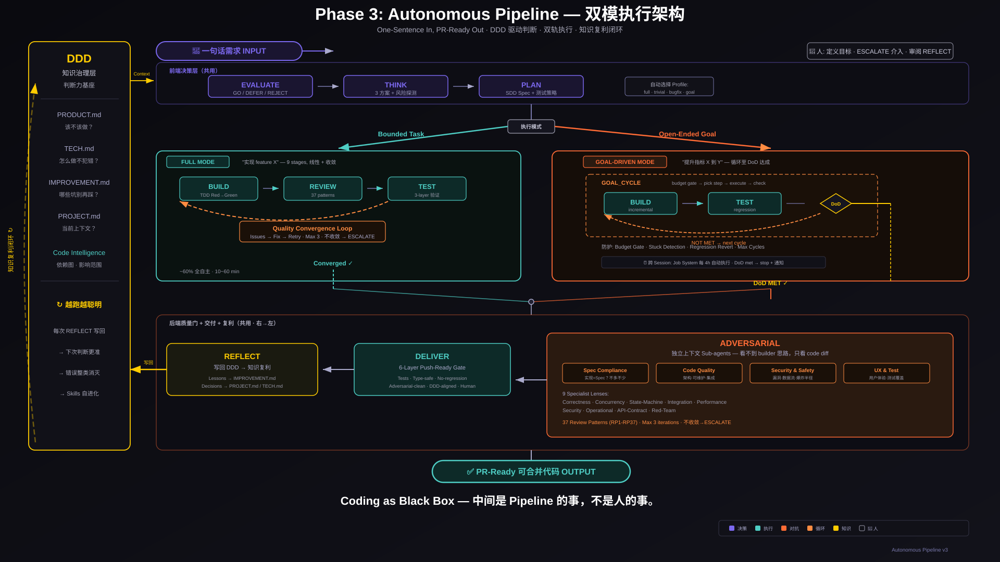
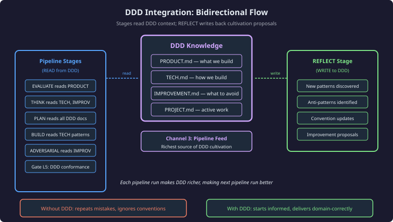
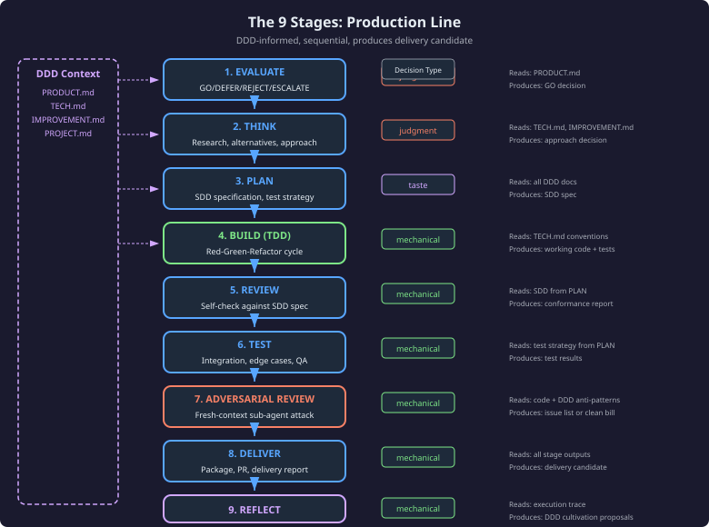
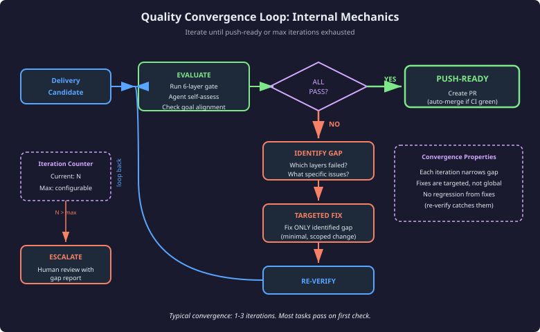
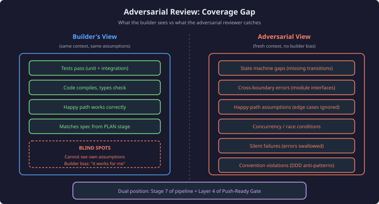

# Autonomous Pipeline — Coding as Black Box

> **Last major update — 2026-07-20:** Refreshed against the live orchestrator
> (`s_autonomous-pipeline/INSTRUCTIONS.md`). Added the terminal **COMPLETE** stage
> doc (`stages/complete.md`) to the file-structure reference and clarified the
> canonical **9 stages · 3 gates · 2 modes** shape (Gate 0 added in v6, 2026-06-26).
> Also refreshed **Figure 3** (`diagrams-pipeline/03-nine-stages.svg`) to annotate all
> three gates (Gate 0 in EVALUATE, Gate 1 on the PLAN→BUILD boundary, Gate 2 =
> ADVERSARIAL inside DELIVER) — the prior diagram predated Gate 0.
> Prior notable updates: v3 rewrite to the dual-mode implementation (2026-06);
> "Three Gates" section added to complete the external framing.

---

## 1. Executive Summary

### Vision

The Autonomous Pipeline transforms software delivery into a black-box operation. A user provides a requirement; the system delivers push-ready code. What happens between input and output is the pipeline's problem, not the user's.

This is not "AI writes code and hopes it works." It is a **dual-mode execution architecture** with:
- **Shared decision layer** (EVALUATE → THINK → PLAN) that fronts both modes
- **Full Mode** — bounded tasks ("implement feature X") via 9 linear stages + convergence
- **Goal-Driven Mode** — open-ended objectives ("improve metric X to Y") via iterative cycles until DoD met
- **Shared quality backend** (ADVERSARIAL → DELIVER → REFLECT) that gates both modes
- **Background execution** — decoupled from interactive sessions via Job System
- **Knowledge compounding** — every run writes back to DDD, making the next run smarter

### Architecture in One Sentence

Dual-mode pipeline (bounded tasks + open-ended goals) with shared decision front-end, shared adversarial backend, and a DDD knowledge loop that compounds across runs.

### Key Properties

| Property | Mechanism |
|----------|-----------|
| Push-ready guarantee | 6-layer gate + convergence loop (max 3 iterations) |
| Self-review blind spot elimination | Fresh-context adversarial sub-agents (zero builder bias) |
| Failure mode safety | Always "escalate with gap report" — never "ship despite known issues" |
| Cross-run learning | pipeline_intelligence.json + DDD cultivation + RP/OP pattern growth |
| Structural error prevention | 40 runtime patterns (RP1-40) + 8 operational invariants (OP1-8) |
| Dual execution modes | Bounded tasks (linear) + open-ended goals (iterative) — same quality gates |
| Background autonomy | Job System decouples pipeline from chat; runs overnight, notifies on completion |

---

## 2. Architecture Overview




### The Dual-Mode System

The pipeline is organized in three layers that execute top-to-bottom:

```
┌─────────────────────────────────────────────────────────────────────┐
│  📝 REQUIREMENT INPUT                                               │
├─────────────────────────────────────────────────────────────────────┤
│  SHARED DECISION LAYER (前端决策层)                                   │
│  EVALUATE → THINK → PLAN                                            │
│  DDD-driven judgment: should we? how? what exactly?                 │
├────────────────────────┬────────────────────────────────────────────┤
│  FULL MODE (左轨)       │  GOAL-DRIVEN MODE (右轨)                    │
│  Bounded Task          │  Open-Ended Goal                           │
│  "实现 feature X"       │  "提升指标 X 到 Y"                           │
│                        │                                            │
│  BUILD → REVIEW → TEST │  ┌─ GOAL_CYCLE ─────────────────────┐     │
│       ↑                │  │ BUILD → TEST → DoD check         │     │
│       └── Convergence  │  │      ↑         │                 │     │
│            Loop        │  │      └── NOT MET ─┘              │     │
│                        │  │      DoD MET → exit              │     │
│  ~60% fully autonomous │  └──────────────────────────────────┘     │
│  10-60 min             │  Budget/stuck/revert safeguards           │
│                        │  ⏰ Cross-session via Job System           │
├────────────────────────┴────────────────────────────────────────────┤
│  SHARED QUALITY BACKEND (后端质量门)                                  │
│  ADVERSARIAL (4 agents + 9 specialists) → DELIVER → REFLECT        │
│  Right-to-left: attack → gate → compound                           │
├─────────────────────────────────────────────────────────────────────┤
│  ✅ PR-READY OUTPUT                                                  │
└─────────────────────────────────────────────────────────────────────┘

        ┌── DDD (知识治理层) ──┐
        │  PRODUCT.md          │ ← EVALUATE reads
        │  TECH.md             │ ← BUILD reads
        │  IMPROVEMENT.md      │ ← REVIEW reads
        │  PROJECT.md          │ ← DELIVER reads
        │  Code Intelligence   │ ← blast radius
        └──────────────────────┘
                ↑
                │ REFLECT writes back (知识复利闭环)
                └── every run makes DDD richer → next run smarter
```

### Why Dual Mode?

| Dimension | Full Mode | Goal-Driven Mode |
|-----------|-----------|------------------|
| Task shape | Bounded ("add X") | Open-ended ("improve X to Y") |
| Completion signal | All ACs pass | Definition of Done criteria met |
| Execution | Linear 9 stages, one pass + convergence | Iterative cycles until convergence or budget |
| Session model | Single session (10-60 min) | Cross-session via Job System (hours/days) |
| Failure mode | Escalate with gap report | Checkpoint + resume next session |
| Typical use | Features, bugfixes, config changes | Performance goals, refactoring campaigns, metric improvement |

### Profile Routing

The pipeline selects a profile at EVALUATE based on task characteristics. Full Mode and Goal-Driven Mode are the two execution tracks; profiles within Full Mode control which stages run:

| Mode | Profile | Stage Sequence | When Used |
|------|---------|---------------|-----------|
| **Full** | **full** | evaluate → think → plan → build → review → test → deliver → reflect | Standard features, complex changes |
| **Full** | **bugfix** | evaluate → think → plan → build → review → test → deliver → reflect | Bug fixes (same stages, different selection criteria) |
| **Full** | **trivial** | evaluate → think → build → review → test → deliver → reflect | Config changes, typo fixes (skips plan) |
| **Full** | **research** | evaluate → think → reflect | Research-only tasks (no code output) |
| **Full** | **docs** | evaluate → think → plan → deliver → reflect | Documentation changes (no build/test) |
| **Goal** | **goal** | evaluate → think → plan → goal_cycle → deliver → reflect | Open-ended goals with iterative progress |

Profile is **immutable after EVALUATE** — cannot be downgraded mid-run (code-enforced gate).

### Background Execution

Pipelines can run as background jobs via the Swarm Job System, decoupling execution from interactive chat sessions:

```
Interactive (foreground)           Background (Job System)
─────────────────────────          ─────────────────────────
User types requirement             Scheduled or one-shot job
  → pipeline runs in chat            → pipeline runs headless
  → user sees progress               → notifies on completion
  → escalation = inline ask          → escalation = Radar todo
```

**Goal-Driven Mode + Background = overnight autonomy:** A goal profile can span multiple sessions — the Job System runs cycles every 4 hours, checks DoD, and stops when met (or budget exhausted). User sees result next morning.

**Resuming after escalation:** When a background pipeline checkpoints (L2 BLOCK or budget), a Radar todo appears. Resolution paths:
1. Drag the Radar todo into chat → agent resumes inline
2. Say "resume pipeline for X" → reads checkpoint and continues
3. Wait for next scheduler run → background job auto-resumes

### Stage Artifact Flow

Each stage consumes upstream artifacts and produces its own:

| Stage | Consumes | Produces |
|-------|----------|----------|
| evaluate | — | evaluation |
| think | evaluation | research |
| plan | evaluation, research | design_doc |
| build | design_doc | changeset |
| review | changeset | review |
| test | changeset, review | test_report |
| deliver | changeset, review, test_report | delivery |
| reflect | test_report, delivery | — (writes to DDD) |

Artifacts are persisted via `artifact_cli.py` and validated against JSON schemas at each stage boundary.

### DDD Integration — Bidirectional Flow



### DDD Document Loading (Per-Stage)

| Stage | Reads |
|-------|-------|
| evaluate | PRODUCT.md, TECH.md, IMPROVEMENT.md, PROJECT.md |
| think | PRODUCT.md, IMPROVEMENT.md |
| plan | PRODUCT.md, PROJECT.md |
| build | TECH.md, PROJECT.md |
| review | TECH.md, IMPROVEMENT.md |
| test | TECH.md, IMPROVEMENT.md |
| deliver | PROJECT.md |
| reflect | IMPROVEMENT.md |

### Sub-Agent Architecture

The pipeline spawns fresh-context sub-agents at two points:

| Spawn Point | Sub-Agents | Purpose |
|-------------|-----------|---------|
| **REVIEW** (spec compliance) | 1 serial sub-agent | Verify ACs → implementation mapping without builder bias |
| **REVIEW** (parallel fan-out) | Up to 3 parallel sub-agents | Code quality + security + UX review |
| **DELIVER** (adversarial gate) | Up to 5 specialist sub-agents + 1 meta-review | Fresh-eyes adversarial attack on complete delivery |

Sub-agents use **review-agents/** (4 domain agents) and **stages/specialists/** (9 specialist profiles).

### The Three Gates — Three Moments of Truth

The 9 stages produce a delivery candidate; **3 gates** decide whether it advances. Each guards a *different kind* of truth, and the earlier a gate fires the cheaper the failure it catches. A framing error caught at Gate 0 costs one EVALUATE pass; the same error caught at Gate 2 has already paid for PLAN, BUILD, REVIEW, and TEST.

| Gate | Guards the truth of… | Fires | Mechanism | Catches |
|------|----------------------|-------|-----------|---------|
| **Gate 0** | *the framing* — is the problem itself understood? | inside EVALUATE → THINK | Understanding Gate (diagnose-before-build) + a skeptic sub-agent | wrong problem, solution-first thinking, unstated ambiguity |
| **Gate 1** | *the plan* — is the approach sound, root not symptom? | after PLAN, before BUILD | Skeptic + Same-System-Awareness (SSA) sub-agent | wrong direction, missed constraints, wrong layer, API hallucination |
| **Gate 2** | *the build* — is the code actually correct? | inside DELIVER (blocking) | fresh-context Adversarial sub-agent(s) + 6-layer convergence loop | runtime bugs, security holes, untested paths, self-authored-code blind spots |

Why gates and not just careful prompting: **carefulness doesn't scale, gates do.** A gate is a structural checkpoint a confident model cannot rationalize past — the same reason the architecture refuses to ship on "looks done." Gate 2 is mechanically enforced (it cannot be skipped by downgrading the profile — see §10 *Profile Immutability*); Gate 0 was added in v6 (2026-06-26) after framing errors were observed sailing untouched all the way to Gate 2.

> **Stages vs gates vs modes — the canonical shape:** **9 stages · 3 gates · 2 modes.** Stages are *what the pipeline does* (EVALUATE…REFLECT); gates are *the 3 go/no-go checkpoints* riding inside EVALUATE, after PLAN, and inside DELIVER; modes are *how execution runs* — **Full** (one pass + convergence) or **Goal** (iterate to a measurable DoD). Both modes run all stages and all gates.

---

## 3. The Stages



### 3.1 EVALUATE — Should We Build This?

**Purpose:** Determine if the task should proceed, select profile, define acceptance criteria.

**Mechanics:**
1. **Requirement Clarification (P0)** — Parse WHO/WHAT/WHY/WHEN; detect ambiguities
2. **Subsystem Health Audit (P1)** — For non-greenfield: check 8 operational invariants (OP1-8)
3. **Codebase Complexity Assessment** — If `code_intel.db` exists: dead code + fragility metrics
4. **Anti-Repetition Check (BLOCKING)** — Scan IMPROVEMENT.md "What Failed" for similar past failures
5. **Profile Selection** — Decision tree maps task → profile (full/bugfix/trivial/research/docs/goal)
6. **Intelligence-Informed Selection** — Read `pipeline_intelligence.json` for high-risk shapes, budget calibration
7. **Acceptance Criteria Quality Gate** — Each AC must be testable, scoped, unambiguous
8. **Pre-mortem Gate** — "What would make this fail?" (mandatory output)

**Blocking Gates:** Anti-repetition match → REJECT/ESCALATE. Unresolvable ambiguities (>=2) → ESCALATE.

**Output:** `evaluation` artifact → GO/DEFER/REJECT/ESCALATE + scope + acceptance_criteria + pre_mortem

**Exit Routing:** GO advances to think. DEFER/REJECT ends pipeline. ESCALATE = L2 BLOCK (human review).

---

### 3.2 THINK — Research & Alternatives

**Purpose:** Explore approaches, identify risks, recommend direction.

**Mechanics:**
1. **Constraint-Driven Alternatives (T2)** — Generate >=2 approaches using explicit constraints (SPEED, QUALITY, SIMPLICITY, FLEXIBILITY, DELETION) — not generic Minimal/Ideal/Creative
2. **Design Risk Probe (T1)** — Self-answering probes that verify/falsify assumptions without user interaction (>=3 probes required)
3. **Minimum Depth Gate (BLOCKING)** — >=2 approaches + >=3 probes + cost tradeoffs stated

**Blocking Gates:** Minimum depth gate. If <50% probes resolved AND high-stakes: escalate to interactive grill (max 5 questions).

**Output:** `research` artifact → alternatives[], risk_probe[], recommendation, sources[]

---

### 3.3 PLAN — Specify What to Build

**Purpose:** Exhaustive file discovery + ordered change specification + test strategy.

**Mechanics:**
1. **Exhaustive File Discovery** — Search → expand → categorize (MODIFY/TEST/VERIFY/IRRELEVANT) BEFORE designing
2. **Change Spec** — Topologically-sorted atomic sub-changes with depends_on, AC mapping, verify command
3. **Boundaries** — Three-tier system (Always/Ask First/Never) from IMPROVEMENT.md failures + TECH.md conventions
4. **Success Criteria** — Reframed into testable conditions (distinct from ACs)
5. **Test Strategy Table** — For each AC: how-to-test, mock-boundary, input-construction
6. **Impact Projection** — If `code_intel.db` exists: blast radius via dependents graph

**Blocking Gates:** File discovery contradicts approach → return to THINK. Missing required fields → validator rejects.

**Output:** `design_doc` artifact → approach, file_discovery[], change_spec[], boundaries, success_criteria[], test_strategy[], impact_projection

---

### 3.4 BUILD — TDD Red-Green-Verify

**Purpose:** Implement via vertical tracer bullets (RED → GREEN per AC, not horizontal slices).

**Mechanics:**
1. **API Existence Check (BLOCKING)** — Before coding against any module: Read target, verify function signature exists
2. **Mechanism Declaration (BLOCKING)** — For system API usage (flock, signals, atomicity): declare MECHANISM/ASSUMPTION/VERIFY
3. **RED → GREEN Loop** — Per AC: write failing test (RED) → implement minimum code (GREEN) → verify
4. **Micro-Replan Trigger** — Same AC fails RED→GREEN 2x consecutively → stop, devise different approach
5. **Path Symmetry Check** — After each GREEN: enumerate ALL code paths reaching same end state, verify postconditions
6. **VERIFY** — Run changed test files + files importing changed modules (not full suite)
7. **Caller Verification** — New public functions must have callers (else WARN)
8. **Interface Seam Verification** — Cross-module boundaries: methods exist + signature compatible
9. **SMOKE** — Start/import test; crash = fix before advancing
10. **User-Path Trace** — Trace 2-3 user scenarios through the new code
11. **AC Coverage Matrix (MANDATORY)** — Every PLAN AC must have impl + test + verified=true

**Blocking Gates:** API Existence (Step 1.5), Mechanism Declaration (Step 1.7), Horizontal Slice anti-pattern, AC Coverage Matrix, max 20 fixes/session.

**Output:** `changeset` artifact → branch, commits[], files_changed[], tdd metrics, ac_coverage[]

---

### 3.5 REVIEW — Multi-Layer Quality Gate

**Purpose:** Catch integration wiring bugs, convention violations, and security issues that self-review misses.

**Architecture:** Two-phase with retry accounting.

#### Phase 1: Pre-Gate + Spec Compliance (Serial)

1. **Litmus Pre-Gate** — 30-second structural sanity check:
   - HF1: Scaffold-only (no real logic)
   - HF2: AC coverage gaps
   - HF3: Internal contradictions
   - HF4: Missing error handling
   - Any HF = FAIL → rework to BUILD (max 2 litmus failures)

2. **Spec Compliance Gate (BLOCKING)** — Spawn fresh sub-agent (NOT self-review):
   - Verify AC → implementation mapping
   - Verdict: PASS / WARNING / BLOCK
   - BLOCK → rework to BUILD (max 2 spec blocks; 3rd → full escalation)

#### Phase 2: Parallel Fan-Out (Conditional)

**Trigger:** >3 files OR >100 lines OR touches auth/data/infra code.

Spawn 3 parallel sub-agents:
- **Code Quality Agent** — RP1-RP40 checklist, integration trace, depth analysis
- **Security & Safety Agent** — Confidence-gated scan per file (1-10 + exploit scenario), wire test (WR1-4)
- **UX & Test Agent** — Only if frontend files changed; discoverability, feedback states, escape handling

**Output:** `review` artifact → litmus_gate, spec_compliance, quality_findings[], security_findings[], ux_findings[]

---

### 3.6 TEST — Three-Layer Verification

**Purpose:** Verify correctness at three levels of scope.

**Layers:**
1. **AC-Driven Verification** — Run tests explicitly declared in ac_coverage
2. **Dependency-Scoped Regression** — Run tests importing changed modules (via grep)
3. **Import Smoke** — For each new .py file: verify import without crash

**Additional Checks:**
- **WTF Gate** — Risk score: files_touched(+2 if >3) + unrelated_module(+3) + API_change(+2) + fix_count(+1 if >10). Score >=5 → L2 BLOCK
- **Single-Platform Compile Trap (BLOCKING)** — Cross-platform changesets cannot report fully-green on single OS
- **Max 20 fixes/session** — Hard cap; checkpoint after
- **Exit Evidence Checklist** — 9 items verifying all 3 layers executed

**Output:** `test_report` artifact → passed, layers{ac_driven, dependency_scoped, import_smoke}, regressions, wtf_score

---

### 3.7 DELIVER — 6-Layer Convergence + Adversarial

**Purpose:** Final quality convergence — iterate until push-ready or escalate.




#### Quality Convergence Loop (max 3 iterations)

Each iteration checks 6 layers. ALL must pass:

| Layer | Check | Mechanism |
|-------|-------|-----------|
| L1 | Tests pass | pytest exits 0 |
| L2 | Type-safe | No type errors, linter clean |
| L3 | No regressions | Pre-existing tests still pass |
| L4 | Adversarial clean | Specialist sub-agents find no HIGH/MED |
| L5 | DDD conformance | TECH.md traps + IMPROVEMENT.md anti-patterns |
| L6 | Decisions resolved | All taste/judgment decisions logged |

#### Adversarial Review Gate (BLOCKING, NON-NEGOTIABLE)



Mechanically enforced by `artifact_cli` — cannot complete pipeline without `adversarial_review.profile_tier == "full"` for full/bugfix profiles.

**Multi-specialist review army** (spawned fresh, zero build context):

| Specialist | Scope | Trigger |
|-----------|-------|---------|
| Correctness | Logic errors, edge cases, boundary conditions | Always (>50 lines) |
| Security | Injection, auth, secrets, serialization | Auth/input/DB/API changes |
| Performance | N+1, O(n^2), pool contention, no-op scaling | Backend endpoints, loops, DB queries |
| API Contract | Breaking changes, type mismatches | Router/endpoint/model changes |
| Concurrency | Shared resources, race conditions, pool exhaustion | Thread/async/lock code |
| Integration | Dead code, unwired functions, registration gaps | New public functions |
| Operational | Env assumptions, deploy context mismatch | Daemon/hook/job code |
| State Machine | Unreachable states, stuck transitions, orphan states | State enums, lifecycle methods |
| Red Team | Cross-domain attacks other specialists missed | CONDITIONAL: >200 lines OR any HIGH found |

Plus **Meta-Review** sub-agent for operational blind spots.

#### Additional Audits

- **Fresh User Audit (P6)** — Could a new user succeed without modifying source?
- **User Path Latency Trace (P6.5)** — Trace user scenarios for hidden latency, silent failures
- **Completion Audit** — AC → evidence matrix with independent verification
- **Push-Ready Gate (Binary)** — PUSH-READY or NOT-PUSH-READY (no numeric score)

**Output:** `delivery` artifact → push_ready, adversarial_review{specialists, findings}, completion_audit, fresh_user_audit[]

---

### 3.8 REFLECT — Extract & Cultivate

**Purpose:** Close the feedback loop — write learnings to DDD, update meta-intelligence.

**10-Step Methodology:**
1. Extract lessons (specific, self-contained)
2. Write to IMPROVEMENT.md (What Worked / What Failed)
3. Update MEMORY.md (cross-project lessons)
4. Checklist maintenance — add new RP patterns if bugs were missed
5. ADR gate — record surprising, costly, hard-to-reverse decisions
6. Dead code checkpoint — compare before/after via code_intel.db
7. **DDD Cultivation** — `artifact_cli run-cultivate` auto-applies additive lessons to TECH.md/IMPROVEMENT.md
8. Record structured lessons in run.json
9. Record outcome for meta-intelligence learning feedback
10. Regenerate REPORT.md with lessons inlined

**Output:** IMPROVEMENT.md updates, PROJECT.md updates, optional ADRs, regenerated REPORT.md

---

### 3.9 GOAL_CYCLE — Iterative Goal Pursuit

**Purpose:** For open-ended goals, loop BUILD+TEST internally until Definition of Done criteria met.

**Pre-Cycle Setup:**
- Load evaluation, initialize progress file (DoD criteria table + current state)
- Record initial commit, set cycle counter, initialize GoalMetrics

**Per-Cycle Loop (12 steps):**
1. Budget Gate — EXIT if remaining < 150K tokens
2. DoD Check — EXIT if all criteria met (exit-first design)
3. Stuck Detection — EXIT if last 3 cycles have zero progress
4. Read Progress — load current state
5. Pick Step — select next DoD criterion to advance
6. Execute Step — BUILD-equivalent (1-3 files per cycle)
7. Test — verify step didn't break anything
8. Update Progress — record what changed
9. Mini-Reflect — 2-3 sentence what worked/what didn't
9.5. Track Cycle Metrics — GoalMetrics velocity tracking
10. Periodic REVIEW Gate — every N cycles, run REVIEW on accumulated diff
11. Revert Check — EXIT if 2 consecutive cycles end in revert
12. Loop

**Regression Protocol:** Max 2 attempts to fix failing test; 2nd fail → revert cycle changes (progress file preserved).

**Final:** When DoD met → adversarial review on total changeset → advance to DELIVER.

---

## 4. Review Architecture

### Review-Agents (4 Domain Agents)

| Agent | File | Responsibility |
|-------|------|---------------|
| **Spec Compliance** | `review-agents/spec-compliance.md` | AC verification: MISSING / EXTRA / MISUNDERSTOOD. Serial, blocking. |
| **Code Quality** | `review-agents/code-quality.md` | RP1-40 checklist, integration trace, replace/move parity, depth/seam analysis |
| **Security & Safety** | `review-agents/security-safety.md` | Confidence-gated security scan (1-10 per file + exploit scenario), wire test WR1-4 |
| **UX & Test** | `review-agents/ux-test.md` | Frontend-only. Discoverability, feedback states, escape handling, E2E trace |

### Specialists (9 Deep Reviewers)

Dispatched during DELIVER's adversarial gate. Each is scope-gated, produces JSON with severity/confidence/fix.

| Specialist | Key Patterns Checked |
|-----------|---------------------|
| API Contract | Breaking changes, type mismatches, new required params |
| Concurrency | Shared resource enumeration, contention paths (RP35-37) |
| Correctness | Logic errors, off-by-one, edge cases (None, [], "", 0) |
| Integration | 0-caller detection, registration/wiring gaps, call chain compatibility |
| Operational | Dev vs daemon vs Hive env assumptions (RP8, RP18-19) |
| Performance | N+1, O(n^2), pool contention (RP30, RP35-36), no-op scaling |
| Red Team | Cross-domain adversarial attack; only activates on >200 lines OR any HIGH |
| Security | Injection vectors, auth guards, secret exposure, serialization (RP17, RP24) |
| State Machine | State completeness, unreachable states, stuck transitions (RP13) |

### Pattern Checklists

**REVIEW_PATTERNS.md (RP1-RP40)** — 40 production-proven bug patterns organized by category:
- Resource lifecycle (RP1-2, RP6, RP11)
- React/frontend (RP3-5, RP12, RP20-21, RP23)
- API boundaries (RP7-9, RP14, RP24)
- State & async (RP13, RP15-16, RP22, RP27)
- Data integrity (RP17-18, RP28, RP34)
- Production context (RP19, RP25-26, RP30, RP35-40)

Every applicable pattern must be explicitly verified or marked N/A. Silence = unchecked = fail.

**OPERATIONAL_PATTERNS.md (OP1-OP8)** — 8 system-level invariants:

| # | Pattern | Core Check |
|---|---------|------------|
| OP1 | Concurrency guard | Atomic status gate or lock prevents parallel execution |
| OP2 | Rollback path | Backup BEFORE + restore on failure |
| OP3 | Data backup | Automated schedule + tested restore |
| OP4 | Access control on secrets | Auth guard on credential endpoints |
| OP5 | Health unauthenticated | Monitoring endpoints accessible without auth |
| OP6 | Fail-loud placeholders | Invalid format that causes runtime failure, not silent acceptance |
| OP7 | Single canonical path | One way to do each operation; alternatives deleted |
| OP8 | Config consistency | All copies in sync or explicitly excluded |

---

## 5. Tooling Layer

### artifact_cli.py — State Management

The pipeline's state machine is managed by `artifact_cli.py`:

| Command | Purpose |
|---------|---------|
| `run-create` | Initialize new pipeline run with metadata |
| `run-update` | Update run status (code-enforced blocking gates) |
| `run-get` | Retrieve run state |
| `run-budget` | Check token budget remaining |
| `run-checkpoint` | Save checkpoint for resume |
| `run-resume` | Restore from checkpoint |
| `run-status` | Pipeline run status summary |
| `run-report` | Generate REPORT.md from run data |
| `run-observe` | Record telemetry event |
| `run-cultivate` | Auto-apply additive DDD lessons |
| `discover` | Find artifacts for a project |
| `publish` | Store artifact with schema validation |
| `state` | Query artifact state |
| `advance` | Move artifact to next stage |

### Scripts

| Script | Purpose |
|--------|---------|
| `confidence_score.py` | Deterministic delivery gate scorer; reads run.json + artifacts, outputs score 1-12 with breakdown |
| `goal_metrics.py` | Goal loop velocity tracking; per-cycle deltas, regression counts, cross-run aggregation |
| `pipeline_pr.py` | Auto-create GitHub PR from pipeline output; constructs title/body from REPORT.md |
| `wtf_gate.py` | TEST stage risk scorer; formula-based halt/pass decision on changeset complexity |

---

## 6. Meta-Intelligence & Learning

### pipeline_intelligence.json

A per-project knowledge base that accumulates across pipeline runs:

| Dimension | What It Tracks | How It's Used |
|-----------|---------------|---------------|
| `abandon_patterns` | Task shapes that historically fail | EVALUATE: detect high-risk shapes early |
| `estimation_accuracy` | Predicted vs actual effort | EVALUATE: calibrate budget estimates |
| `adversarial_value` | Which specialist findings were real vs false positive | DELIVER: weight specialist confidence |
| `build_injection_recommendations` | Chronic RP patterns for this project | BUILD: inject as mental checklist preamble |

### Learning Feedback Loop

```
REFLECT records outcome (success/failure, actual_effort, lessons)
  → artifact_cli learn → updates pipeline_intelligence.json
  → next run's EVALUATE reads intelligence → better profile selection, budget, injection
  → compound improvement across runs
```

### DDD Cultivation (Closed Loop)

```
Pipeline execution produces lessons
  → REFLECT calls run-cultivate
  → Additive changes auto-applied to TECH.md, IMPROVEMENT.md
  → Risky changes (PRODUCT.md contradictions) → proposal queue for human
  → Next pipeline run reads richer DDD → better decisions
```

---

## 7. Budget, Retry & Checkpoint

### Token Budget (Base Stage Costs)

| Stage | Base Cost | Typical Range |
|-------|-----------|--------------|
| evaluate | 6K | 4-10K |
| think | 10K | 5-20K |
| plan | 8K | 5-15K |
| build | 40K | 15-80K |
| review | 15K | 8-25K |
| test | 25K | 10-50K |
| deliver | 20K | 8-50K |
| reflect | 3K | 2-5K |

Budget tracking includes DDD reads, artifacts consumed, lines changed, test count, tool calls.

### Retry Accounting

| Stage | Max Retries | Escalation |
|-------|-------------|-----------|
| evaluate | 2 | ESCALATE to human |
| think | 2 | ESCALATE |
| plan | 2 | ESCALATE |
| build | 3 | Checkpoint |
| review (litmus) | 2 | Full review with all sub-agents |
| review (spec) | 2 (separate counter) | Escalate on 3rd |
| test | Per-fix (max 20 total) | WTF gate → L2 BLOCK |
| deliver | 1 | Escalate |
| reflect | 1 | Escalate |

### Checkpoint Protocol

**Mandatory budget check before any checkpoint.** Triggers:
- `run-budget` returns `should_checkpoint: true`
- L2 BLOCK pending human decision
- Retries exhausted
- Unexpected error

**Invalid triggers (do NOT checkpoint):** "BUILD is big", "read a lot of files", "context might be full".

Checkpoint saves: current stage, completed stages, all artifacts, escalation state, decision log.

---

## 8. Decision Classification

Every decision during pipeline execution is classified:

| Class | Definition | Handling |
|-------|-----------|----------|
| **Mechanical** | One correct answer, deterministic | L0 INFORM — auto-approve |
| **Taste** | Reasonable default exists | L1 CONSULT — batch at delivery gate |
| **Judgment** | Genuinely ambiguous, high stakes | L2 BLOCK — checkpoint, wait for human |

Stages 1-2 are judgment-heavy. Stages 4-9 are mostly mechanical. Stage 3 is taste-heavy.

---

## 9. Execution Modes & Escape Hatches

### Profile as Escape Hatch

The profile system IS the escape hatch. A trivial change gets `trivial` profile (7 stages, ~5 min). Research gets `research` (3 stages). There is no "skip pipeline" — there is only "right-sized pipeline."

| Profile | Typical Duration | Use Case |
|---------|-----------------|----------|
| full | 30-60 min | Features, complex changes |
| bugfix | 20-40 min | Bug fixes with investigation |
| trivial | 5-15 min | Config, typos, 1-file logic fix |
| research | 10-20 min | Investigation, no code output |
| docs | 15-25 min | Documentation changes |
| goal | 60-120 min | Open-ended iterative goals |

### Direct Mode (User Override Only)

Only when user explicitly says "just do it" / "skip pipeline":
- Agent MUST strong-propose pipeline first with evidence why it's better
- Still requires adversarial review before commit (STEERING R13)
- Still requires R3 post-task self-review

---

## 10. Critical Design Decisions

### Single-Agent with Role-Switching

One agent switches roles (builder, reviewer, adversary) rather than multi-agent orchestration. Eliminates context synchronization overhead. Sub-agents provide fresh context where needed (adversarial review) without losing builder knowledge for targeted fixes.

### DDD/SDD/TDD Trilogy

| Methodology | Question | Applied |
|-------------|----------|---------|
| DDD | Should we? How does this fit? | EVALUATE, THINK |
| SDD | What exactly? | PLAN output, verified in REVIEW |
| TDD | Did we? Does it work? | BUILD (red-green), TEST (3 layers) |

### Quality Convergence over One-Shot

The architecture explicitly accepts that one pass may not produce perfection. Instead of demanding flawless output from 9 stages (impossible with non-deterministic models), it demands **convergence** through targeted iteration. The quality contract shifts from "try hard once" to "iterate until verified."

### Adversarial Review Is Mechanically Enforced

Not a configuration flag. Not skippable by confidence. Enforced by `artifact_cli` code validation — pipeline cannot complete without adversarial review evidence at the correct profile tier. This gate was added after 11 instances of self-exemption (CLASS A corrections C011-C036).

### Profile Immutability After EVALUATE

Once EVALUATE selects a profile, it cannot be downgraded. This prevents the pattern of starting as `full` then switching to `bugfix` at DELIVER to bypass adversarial gates. Code-enforced in `artifact_cli.py`.

### Push-Ready = Binary, Not Scored

There is no "8.5/10 confidence." The delivery is either PUSH-READY (all 6 layers pass, all specialists clean, completion audit green) or NOT-PUSH-READY (with specific gap identified). This eliminates the rationalization of "close enough."

---

## 11. Observability

### Telemetry (run-observe)

Events recorded at stage boundaries:
- `stage_start` / `stage_end` — timing + token consumption
- `profile_selected` — which profile and why
- `think_depth` — alternatives count, probes count, resolution rate
- `adversarial_patterns` — specialist findings by category
- `review_gap` — patterns that reviewers missed but adversarial caught

### Abandon Protocol

When a run is abandoned (user stop, budget exhaustion, session crash, scope explosion):
- Partial learnings captured
- Reason classified: user_stopped / budget / session_crash / blocker / superseded / scope_explosion
- Run marked as abandoned (not failed — different semantics for intelligence)

---

## 12. Success Metrics

| Metric | Target | Measurement |
|--------|--------|-------------|
| First-pass convergence rate | >70% | Candidates passing gate on first check |
| Average convergence iterations | <2 | When loop activates |
| False escalation rate | <10% | Human override rate |
| Adversarial accuracy | >90% | Human agreement with findings |
| DDD cultivation rate | >1 proposal per 5 runs | REFLECT output frequency |
| CI pass rate post-merge | >99% | Pipeline PRs that pass CI |
| Regression introduction | 0 | Gate L3 catch rate |
| RP pattern growth | +2-3 per month | New patterns from REFLECT |

### What Success Looks Like

1. User states requirement
2. Pipeline runs (the "black box")
3. PR appears, CI green, auto-merged
4. Code is correct, conformant, tested, adversarially reviewed, documented
5. DDD is richer than before the run
6. Next run is slightly better than this one

This is Coding as Black Box.

---

## 13. File Structure Reference

```
s_autonomous-pipeline/
├── SKILL.md                    # Skill frontmatter + description
├── INSTRUCTIONS.md             # Orchestrator (the mechanical run-loop)
├── REVIEW_PATTERNS.md          # RP1-RP40 bug pattern checklist
├── OPERATIONAL_PATTERNS.md     # OP1-OP8 system invariants
├── stages/
│   ├── evaluate.md             # Stage 1: intake + profile selection (Gate 0)
│   ├── think.md                # Stage 2: research + alternatives
│   ├── plan.md                 # Stage 3: file discovery + change spec (Gate 1 after)
│   ├── build.md                # Stage 4: TDD implementation
│   ├── review.md               # Stage 5: multi-layer review
│   ├── test.md                 # Stage 6: 3-layer verification
│   ├── deliver.md              # Stage 7: convergence + adversarial (Gate 2)
│   ├── reflect.md              # Stage 8: lessons + cultivation
│   ├── complete.md             # Terminal: completion summary + exec summary output format
│   ├── goal_cycle.md           # Goal profile: iterative loop
│   └── specialists/            # 9 deep-review specialist profiles
│       ├── api-contract.md
│       ├── concurrency.md
│       ├── correctness.md
│       ├── integration.md
│       ├── operational.md
│       ├── performance.md
│       ├── red-team.md
│       ├── security.md
│       └── state-machine.md
├── review-agents/              # 4 domain review agents
│   ├── spec-compliance.md
│   ├── code-quality.md
│   ├── security-safety.md
│   └── ux-test.md
└── scripts/                    # Pipeline-local tooling
    ├── confidence_score.py     # Delivery gate scorer
    ├── goal_metrics.py         # Goal loop velocity tracking
    ├── pipeline_pr.py          # Auto-PR creation
    └── wtf_gate.py             # Changeset risk scoring

backend/scripts/                # Shared pipeline engine (not skill-local)
├── artifact_cli.py             # State machine + artifact storage + code-enforced gates
└── pipeline_validator.py       # Stage-boundary schema + gate validation (publish-time)
```

---

## 14. Runtime Integration


The pipeline runs as a **skill invocation** within a single agent session. No separate orchestration service. The same agent that talks to the user switches roles through stages. The harness provides:

| Component | Provided By | Pipeline's Use |
|-----------|-------------|----------------|
| Context (system prompt) | 11-file context system | DDD, behavioral rules, user preferences |
| Tool access | Claude Agent SDK + MCP | Code tools (BUILD), pytest (TEST), file reads (REVIEW) |
| Memory | MEMORY.md | Past corrections to avoid repeating mistakes |
| Self-evolution | EVOLUTION.md | Corrections inform future runs |
| Skill system | Projection layer | Pipeline IS a skill (`s_autonomous-pipeline`) |
| Jobs | Scheduler + executor | Background/recurring pipeline execution |

---

## 15. Relationship to Other Documents

| Document | Scope | Audience |
|----------|-------|----------|
| **This document** (Autonomous-Pipeline-Design.md) | Architecture + design decisions + how it all fits together | Anyone understanding the system |
| **AIDLC-Phase3-Design.md** | Original conceptual framing (DDD+SDD+TDD closed loop, psychology) | Conceptual understanding |
| **INSTRUCTIONS.md** | Mechanical orchestration (exact commands, routing tables, budget formulas) | The agent executing the pipeline |
| **Stage docs** (stages/*.md) | Per-stage mechanics (blocking gates, anti-patterns, outputs) | The agent at each stage |
| **Review-agents & specialists** | Sub-agent briefings (what to check, output format, confidence rules) | Spawned sub-agents |
| **SwarmAI TECH.md** (DDD) | Pipeline as subsystem within SwarmAI architecture | Codebase contributors |
