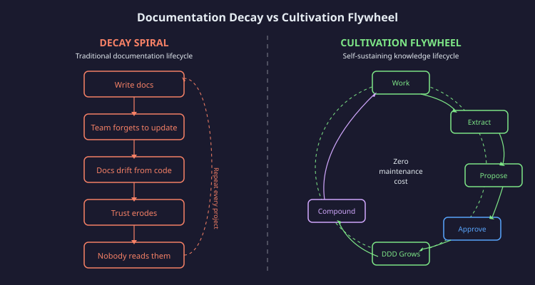
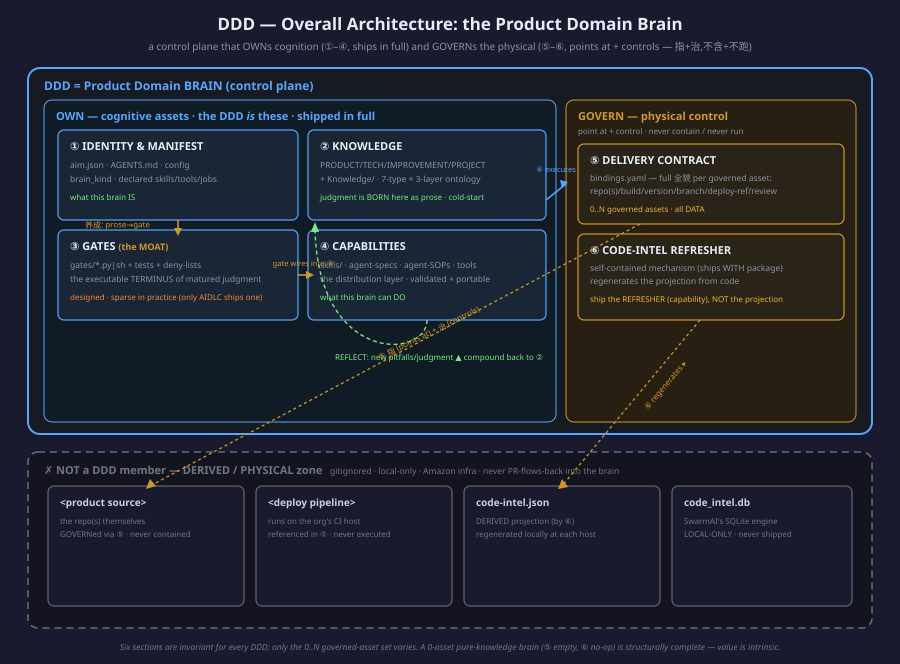
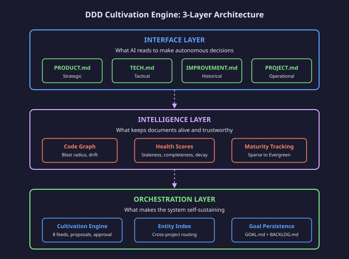
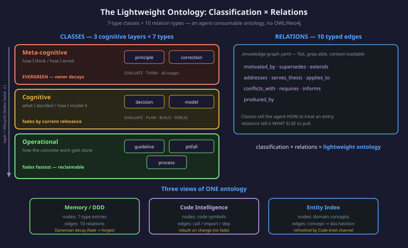
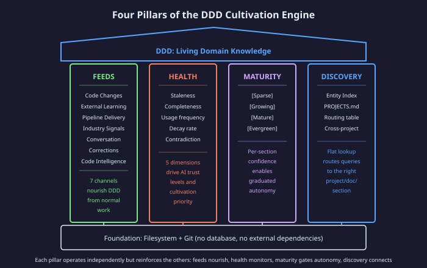
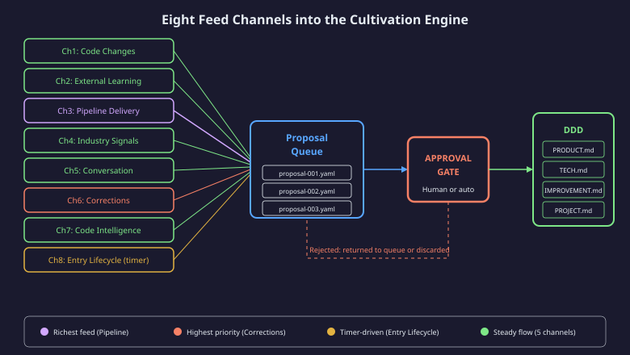
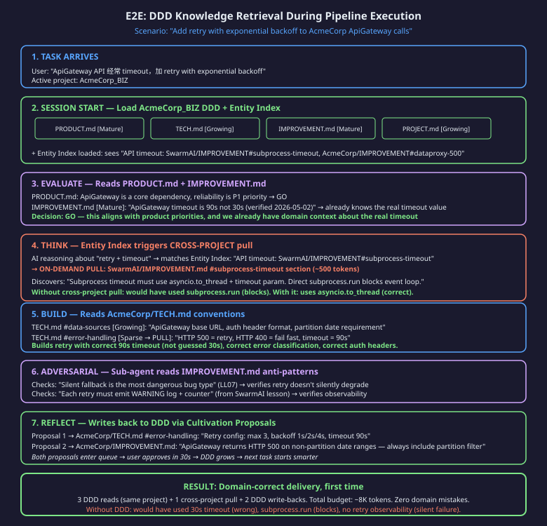
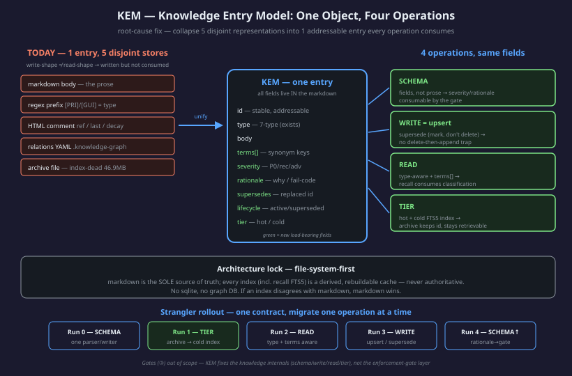

# DDD — High-Level Design

### Change Log

| Date | Change | Sections |
|------|--------|----------|
| 2026-07-20 | Restructured into the complete 15-section DDD HLD (was the Cultivation-Engine HLD); added the Product Domain Brain definition, the six-section structure, and the overall-architecture diagram | §3, §4, Fig 2 |
| 2026-05-12 | Initial Cultivation-Engine HLD (three-layer living-docs architecture, recall, cultivation) | §5–§9 |

## 1. Executive Summary


**Vision:** Domain Expertise as Infrastructure.

**Goal:** Every AI session starts as a domain expert — rules, history, conventions, failures — delivering domain-correct output from turn one.

**One sentence:** DDD Cultivation Engine makes AI project knowledge self-growing, transforming smart generalists into domain experts through structured, health-monitored, living knowledge that compounds from normal work.

The DDD Cultivation Engine is a three-layer architecture that solves the fundamental problem of AI-assisted development: agents are brilliant generalists but domain-ignorant. Rather than treating project knowledge as static documentation that decays, the engine treats it as living infrastructure — structured for AI consumption, continuously cultivated by the same work it enables, and health-monitored to maintain trust.

> **Maturity note (read before §3).** The three layers below describe the **target
> architecture**. Some Layer-2 mechanisms (knowledge-graph relations, type-aware /
> staged-by-type retrieval) are **designed but not yet wired** — this document marks
> each with an honest-status caveat inline. **§11 (KEM — Knowledge Entry Model)** is
> the cross-cutting data-model work that closes those gaps: it makes a knowledge entry
> one addressable object whose fields every operation consumes. A PE should read §11
> as the reconciliation of "designed" vs "live" for the whole knowledge layer.

**This document covers:** The architectural design, critical decisions, data flows, quality mechanisms, and positioning of the DDD Cultivation Engine. It is a solution showcase for principal engineers evaluating architectural soundness — not an implementation specification.

---

## 2. The Problem and Design Goals


### AI Is Smart but Doesn't Know Your Project

Every new session, AI starts from zero. It doesn't know your naming conventions, why you picked Postgres over DynamoDB, what you tried last month that failed, or that the billing module requires approval before any change. It produces code that looks correct but violates your team's rules — a pattern you abandoned gets reintroduced, a feature contradicts strategic direction. Technically right, domain-wrong.

### Documentation Dies Because Nobody Maintains It

You write docs. Code changes. Docs don't update. Nobody trusts them. Nobody reads them. Nobody updates them. Vicious cycle. The economics are fatal: maintenance cost always exceeds perceived benefit.

### Knowledge Is Trapped Per-Project

Project A discovers that a specific API needs retry with exponential backoff. Project B hits the same API three months later and rediscovers the same lesson from scratch. The knowledge existed — but nothing routes it across projects.



### Design Goals

| # | Goal | Constraint |
|---|------|-----------|
| 1 | Domain-correct AI output from turn one | Must load in under 5K tokens |
| 2 | Zero-cost maintenance for humans | Cultivation from normal work only |
| 3 | Cross-project knowledge discovery | Without external databases |
| 4 | Graduated trust based on evidence | Health scores drive autonomy |
| 5 | Safety-first knowledge evolution | Propose-approve, never silent write |

---

## 3. What a DDD Is — the Product Domain Brain

> **This is the definition PE readers most need and it is easy to miss:** a DDD is
> **not** "four markdown docs" and **not** a cultivation engine. Those are parts. A DDD
> is a **Product Domain Brain — a control plane** that **OWNs cognition** and **GOVERNs
> the physical**. The cultivation engine (§8) grows one part of it (② Knowledge); recall
> (§7) retrieves from it; but the *thing itself* is the brain.

### 3.1 The one-line definition

**A DDD is a Product Domain Brain: it OWNs the cognition (the judgment, knowledge, gates,
and capabilities that ARE the product's domain expertise) and GOVERNs the physical (the
repos, data, deploy pipelines it points at and controls — but never contains or runs).**

The distinction is load-bearing:

| | OWN (cognitive assets — shipped in full) | GOVERN (physical control — pointers + a shipped mechanism) |
|---|---|---|
| **What** | Identity, Knowledge, Gates, Capabilities (①–④) | Delivery Contract, Code-Intel Refresher (⑤–⑥) |
| **Relationship** | the DDD *is* these | the DDD *points at + controls* these (指+治, 不含+不跑) |
| **Example** | a pitfall in IMPROVEMENT.md; a gate that blocks a bad command; a skill | the bound product repo; the deploy pipeline (on the org's CI host); the `code-intel.json` projection |

A DDD **never contains** the product source and **never runs** the deploy pipeline — it
GOVERNs them (references, contracts, refresh policy). It **does own** every piece of
judgment about the domain. This is why a DDD is portable (§3.3): you can hand the brain to
another agent/runtime without shipping the machine room.

### 3.2 Why a brain, not a rules file

The industry has two commoditized patterns — a static context file (CLAUDE.md) and a
retrieval index (RAG). Both are **memory**. A DDD adds the two things neither has:

1. **A judgment-flow loop** — knowledge is BORN as prose (a pitfall, a decision), and if it
   matures, it is COMPILED into an enforcement gate (§6, the 养成 ladder). The brain doesn't
   just store "don't push to mainline"; it grows a gate that makes the push impossible.
2. **A cognition/physical split** — the brain governs real repos and pipelines through its
   capabilities, so knowledge drives *action*, not just *recall*.

That is the difference between a document (which decays) and a brain (which compounds).

### 3.3 A DDD is a portable capability package

Because ①–④ are OWNed in full and ⑤–⑥ are self-contained mechanisms, a mature DDD is a
**distributable unit**: it carries its own knowledge + domain skills + tools + jobs + the
refresher that keeps its code-graph fresh. **Ownership follows the package, not the host** —
SwarmAI is the *genesis* that explores the spec and ships the first brains, **not a runtime
host or dependency**. A DDD can be mounted on another agent (Kiro, Quick, plain Claude Code)
and keep getting smarter there, with no callback to SwarmAI. The hard boundary: only
**validated + portable + self-contained** capabilities enter ④; SwarmAI-only infrastructure
(`data.db`, `artifact_cli`, backend services) stays on the genesis side and is **never
distributed**. A DDD carries the brain and the method, never the machine room.

### 3.4 "Value" and "asset count" are two axes — do not conflate

A DDD GOVERNs `0..N` physical assets, each with an open-ended `kind` (`code-repo` /
`data-source` / `skill-set` / `document-corpus` / `job` / …). But a DDD's *value* can be
**intrinsic** — the knowledge itself is the product — independent of how many assets it
governs. A **0-asset pure-knowledge brain** (a researcher's topic, a consultant's client) is
structurally complete, not degraded. There is **no rigid type enum**: "code-repo brain /
data-agent brain / pure-knowledge brain" are *read-outs* of the asset set along a spectrum,
never a classifier you pick at creation. The system extends by adding an asset `kind`, **never**
by adding a brain "type" — and never by adding a seventh section.

**Three exemplars sample the spectrum** (all the SAME six-section structure):

| DDD | Governs | Read-out |
|-----|---------|----------|
| **AIDLC** | 1..N derived `code-repo` assets (e.g. a bound preset repo) | knowledge-primary — value is intrinsic (the AIDLC methodology stands alone) yet it also governs repos |
| **CMHK_SalesIntel** | a `data-source` (semantic contract + MCP) + its own `skill-set` | data-agent — value is the data-caliber moat |
| **SwarmAI** | the SwarmAI product `code-repo` | code-repo brain — value is the product source it governs |

---

## 4. The Six Sections — the Canonical DDD Structure

> Every DDD is organized into **exactly six sections** — the SAME structure for every user
> and every domain. ①–④ are **OWNed** (cognitive assets, shipped in full); ⑤–⑥ **GOVERN**
> the physical (data/pointers + a shipped mechanism). Only the governed-asset set varies.

```
DDD = Product Domain BRAIN (control plane)
│  ═══ OWN — cognitive assets (the DDD's definition; ship in full) ═══
├── ① IDENTITY & MANIFEST   aim.json · AGENTS.md · review-template · config
├── ② KNOWLEDGE             PRODUCT/TECH/IMPROVEMENT/PROJECT.md + Knowledge/
│                           (冷启动 + judgment is BORN here as prose — the 养成 ladder, §6)
├── ③ GATES (the MOAT)      gates/<gate>.py|sh + test_<gate>.* + context/includes/*denied*.json
│                           (the executable TERMINUS of a matured judgment; wired into ④)
├── ④ CAPABILITIES          skills/ · agents/*.agent-spec.json · agent-sops/ · tools
│                           (the distribution layer; ③ gates wire into agent-specs here)
│  ═══ GOVERN — physical control (data + pointers + a shipped mechanism; 指+治, 不含+不跑) ═══
├── ⑤ DELIVERY CONTRACT     bindings.yaml — the product's full delivery 全貌 per bound asset:
│                           repo(s)/worktree/build/version-lock/branch/deploy-ref/review-path
└── ⑥ CODE-INTEL REFRESHER  a self-contained mechanism (ships WITH the package) that
                            REGENERATES the code-intel projection from code. Ship the
                            REFRESHER (capability), NOT the projection (data).

═══ NOT a DDD member — DERIVED / PHYSICAL zone (gitignored / local / Amazon infra) ═══
  code-intel.json  — DERIVED projection of code (generated by ⑥); follows the code,
                     regenerated locally, NEVER PR-flows-back.
  code_intel.db    — SwarmAI's own SQLite query engine; LOCAL-ONLY, never shipped.
  <product source> — the repo(s) themselves — GOVERNed via ⑤, never contained.
  <deploy pipeline>— runs on the org's CI host — referenced in ⑤, never executed.
```



### ① Identity & Manifest — *what this brain is*
`aim.json` (the manifest: name, spec-version, governed assets, skill classes) + `AGENTS.md`
(the paradigm-in-one-page the agent reads) + config. This is the brain's self-description:
its `brain_kind` read-out, its declared domain-skills / domain-tools / mcp / jobs. **OWN.**
*Live.*

### ② Knowledge — *what this brain knows* (the cold-start + the birthplace of judgment)
The four judgment-axis documents + the `Knowledge/` store:

| Document | Judgment Axis | Answers |
|----------|---------------|---------|
| PRODUCT.md | Strategic | What are we building and why? What's in scope? |
| TECH.md | Tactical | How do we build it? What patterns, constraints, conventions? |
| IMPROVEMENT.md | Historical | What did we try, learn, fix? What must never repeat? |
| PROJECT.md | Operational | Current state? Who owns what? |

**Why exactly four?** Every autonomous decision falls on one axis: *should* we (strategic),
*how* (tactical), *what-went-wrong-before* (historical), *what-is-now* (operational). Fewer
conflate; more exceed budget. Judgment is **BORN here as prose** — a new pitfall, a new
decision — and, if it matures, is compiled into ③ (§6). **This is the section §8 cultivation
grows and §7 recall retrieves.** **OWN.** *Live — this is the mature, load-bearing section.*

### ③ Gates — *the moat* (the executable terminus of matured judgment)
`gates/<gate>.py|sh` + tests + deny-lists. A gate is **not born** here — it **graduates**
here: a ② pitfall that has recurred and matured is compiled into an exit-2 BLOCK check wired
into ④'s agent-specs (the 养成 ladder, §6). This is the layer that turns "we know X is
dangerous" into "X is structurally impossible." **OWN.**
*Status: **designed, sparse in practice.** Per the 2026-07-20 assessment, only AIDLC ships a
real gate (`no_git_push.py`); most DDDs have a stub `gates/`. Gates are **out of scope** for
the current knowledge-internals work (§11 KEM) per XG — "先把大脑搞好." Recorded honestly, not
claimed as live.*

### ④ Capabilities — *what this brain can do* (the distribution layer)
`skills/` + agent-specs + agent-SOPs + tools. **Not a grab-bag** — it is the layer that ships
the DDD's **validated, portable, self-contained** capabilities so an adopter can keep
developing on knowledge + capability on any runtime. The self-improving unit lives here:

```
  ② KNOWLEDGE (judge) ──► ④ pipeline capability (execute) ──► changes the ⑤-bound asset
         ▲                                                              │
         └──────── REFLECT: new pitfalls/judgment ◄────────────────────┘
                   written back to THIS DDD's ②IMPROVEMENT.md (the §6 ladder)
```

③ gates wire into the agent-specs here (a matured gate becomes a pre-tool check the
capability must pass). **OWN.** *Skills live; the DDD-native portable pipeline/pollinate
rewrites are designed-not-yet-built (see Paradigm doc §3.7).*

### ⑤ Delivery Contract — *what physical assets this brain governs*
`bindings.yaml` — the full delivery 全貌 per governed asset: repo(s), worktree, build system,
version-lock, branch, deploy-pipeline reference, review path, refresh policy. **All DATA** —
executed *via* ④ capabilities; the deploy pipeline itself runs on Amazon infra, referenced
here, never run by the DDD. This is the `0..N` governed-asset set (§3.4) made concrete.
**GOVERN.** *Live — declared per DDD (e.g. CMHK_SalesIntel's `data-source` asset; SwarmAI's
`code-repo`).*

### ⑥ Code-Intel Refresher — *how this brain keeps its code-graph fresh*
A **self-contained mechanism** that regenerates the `code-intel.json` projection from the
governed code, degrading by consumer profile (a knowledge-consumer gets a no-op; a
dev-consumer gets the refresher and builds the projection locally). **Ship the refresher, not
the projection.** The projection is a **derived-zone** artifact (gitignored, regenerated at
each end, NEVER PR-flows-back) — what flows back into the DDD is JUDGMENT (a pitfall, a gate),
never a machine-generated projection. **GOVERN.**
*The refresher capability is `s_repo-to-ddd`; full code-graph design:*
**[AI-Ready-Repo Engine Design](AI-Ready-Repo-Engine-Design.md)**. *The narrow "regenerate
code-intel.json only" ⑥-mode is a designed addition (Paradigm §3.7), not yet a shipped flag.*

### Why "no asset → no-op ⑥" and "0 assets is still complete"
⑤ and ⑥ are **asset-derived**: with zero governed assets (a pure-knowledge brain), ⑤ is empty
and ⑥ is a no-op — and the brain is still structurally complete (its value is intrinsic, §3.4).
The six sections are invariant; the physical footprint scales with the asset set.

---

## 5. The Lightweight Ontology & Living-Docs Architecture

> The four documents alone are documentation — and documentation decays. Three layers keep them alive: an **Interface** layer (the 4 docs, §4 ②), an **Intelligence** layer (code-graph, health, maturity, relations — below), and an **Orchestration** layer (cultivation, §8). This section covers the Intelligence layer + the ontology that structures all knowledge.



### Layer 2: Intelligence (What Keeps Docs Alive)

Without Layer 2, the four documents would follow the same decay trajectory as any documentation. The Intelligence Layer provides four mechanisms that prevent decay:

**Code Graph** — Maps relationships between documented knowledge and actual code. Detects drift (documented pattern no longer used), identifies blast radius (which sections are affected by a code change), and flags contradictions (doc says X, code does Y).

**Health Scores** — Five-dimensional scoring that quantifies document quality at the section level. A healthy section is actively used by agents, recently validated, complete relative to its scope, consistent with code, and not contradicted by other sections.

**Maturity Tracking** — Per-section confidence levels that gate AI autonomy. A [Sparse] section means "ask before using this as a decision basis." An [Evergreen] section means "act with full confidence."

**Knowledge Graph Relations** *(added 2026-05-19; scope corrected 2026-07-19)* — Cross-entry relationship tracking stored in `.context/.knowledge-graph.yaml`. 10 relation types defined in `knowledge_graph.py` (`applies_to`, `motivated_by`, `supersedes`, `extends`, `conflicts_with`, `addresses`, `serves_thesis`, `requires`, `informs`, `produced_by`). Not a graph database — a flat YAML file that fits in context. Implementation split: the schema, load/save, `add_relation`, `batch_add_relations`, and `backfill_from_entries` live in `knowledge_graph.py`; `ddd_entry_lifecycle.py::bump_references()` is the intended auto-extraction integration point.

> **Implementation status (honest, verified 2026-07-19):** Only the **storage + relation-authoring layer** is production-wired — the YAML store loads/saves and `session_router` reads it to surface related-entry *hint text* during recall. The rest is **designed but not live**: (a) the auto-grow loop (`bump_references(..., context_files, graph_path)` creating `applies_to` edges from pipeline usage) exists but **no production caller passes those params** — it fires only in tests; (b) the relevance-boost-during-injection was **removed** as dead code (2026-05-19, selective-mode path); (c) contradiction detection (`conflicts_with`) and (d) cluster visualization have **no consumer code** — the `conflicts_with` predicate is authored but never queried, and health-doc contradiction scoring is a hardcoded placeholder. Treat relations today as a queryable store + recall hint, NOT an active ranking/detection/visualization system.

### The Lightweight Ontology: Classification × Relations



The two mechanisms above — the **7-type classification** (§8.4) and the **10 relation types** (Knowledge Graph Relations) — are not two separate features. Together they *are* a lightweight ontology: the layer that lets the agent understand *what kind of thing* a piece of knowledge is and *how it connects* to others, before it ever reasons over the content.

In semantic-web terms, an ontology is the **schema layer** (the classes, relations, and constraints that describe *how a domain is described*), while a knowledge graph is the **data layer** (the specific facts organized under that schema). The DDD engine deliberately implements the schema layer as **two flat, grep-able, context-loadable structures** rather than an OWL/RDF formalism:

| Ontology element | Semantic-web formalism | DDD Engine implementation |
|------------------|------------------------|---------------------------|
| **Classes** (what kinds of knowledge exist) | OWL classes | 7 entry types × 3 cognitive layers (`MEMORY_SECTIONS`, `ddd_entry_lifecycle.py`) |
| **Relations** (how entries connect) | RDF triples / object properties | 10 relation types in `.knowledge-graph.yaml` (`knowledge_graph.py`) |
| **Constraints** (rules the schema enforces) | SHACL / axioms | Layer → lifecycle rules: evergreen *sections* never decay; and only operational entries (guideline/pitfall/process) are ever reclaimed — the keep-set `{principle, correction, decision, model}` is permanent (decay engine, `_KEEP_TYPES`) |
| **Query** | SPARQL / Cypher | Plain text loaded into context + keyword/FTS recall — the agent *is* the query engine |

**Why not a formal ontology (OWL, Neo4j)?** The same reasoning as D4 (Entity Index is a routing table, not a graph): agents consume text and reason natively, so a computable axiom/inference engine adds operational weight for expressiveness the agent does not need. The classification tells the agent *how to treat* an entry (trust it forever vs. let it decay; inject it at EVALUATE vs. at BUILD); the relations tell it *what else to pull*. That is exactly enough ontology to route and govern knowledge, and no more.

**Three views of one ontology.** The same classify-plus-relate schema projects onto three subsystems, which is why they interoperate rather than duplicate:

| View | Nodes | Edges | Governance |
|------|-------|-------|-----------|
| **Memory / DDD** | 7-type entries (this doc) | 10 relation types | Darwinian decay (fade → forget) |
| **Code Intelligence** | code symbols (`code_intel/graph_store.py`) | call / import / dependency edges | Rebuilt on change (no fade) |
| **Entity Index** | domain concepts | concept → project/doc/section routes | Refreshed by Code Intelligence channel |

Memory, DDD, and Code Intelligence are three views of one ontology — each a classification of entities plus a set of typed relations — differing only in *what* they classify (knowledge vs. code vs. concepts) and *how* the entries age.

### Layer 3: Orchestration (What Makes It Self-Sustaining)

Layer 3 closes the loop — it is the mechanism by which knowledge grows without human effort.

**Cultivation Engine** — Receives signals from 8 feed channels, generates proposals for DDD changes, routes them through an approval gate, and applies approved changes to the correct document and section.

**Auto-Approval Gate** *(added 2026-05-26)* — Mechanical approval for proposals that meet strict criteria: (a) confidence >= 8/10, (b) change is mechanical append-only — the proposed block is a strict superset whose prefix exactly equals the current block (adds lines, never modifies or deletes), and (c) the target is NOT a semantic section (Non-Goals, Vision, Architecture are always skipped). Proposals that don't meet all criteria → human review. Implementation: `ddd_orchestrator.py::_auto_apply_ddd_proposals()` (channel `_ch_auto_apply`).

**Entity Index** — A flat routing table (stored in PROJECTS.md) that maps domain concepts to specific project/document/section triples. Enables cross-project discovery without a graph database.

**Pipeline Integration** — The autonomous pipeline is DDD's richest feed channel. Each pipeline run's REFLECT stage extracts lessons and proposes updates to IMPROVEMENT.md and TECH.md, compounding knowledge with every delivery.

### Why "Just 4 Markdown Files" Would Die Without Layers 2 and 3

The interface layer alone is documentation — and documentation decays. Layer 2 (Intelligence) detects when decay begins. Layer 3 (Orchestration) reverses it automatically. Together they create a flywheel: the more the system is used, the more signals feed cultivation, the richer the DDD becomes, the more value the system delivers — which increases usage. The flywheel accelerates rather than decays.

---

## 6. Design Philosophy — When Beliefs Become Enforcement

> The single idea that separates a DDD from a document: **a belief is not left as prose to be
> remembered — it graduates into a mechanism that enforces itself.** This is the 养成 (cultivation)
> ladder. Fuller treatment: PRODUCT.md "Design Philosophy — When Beliefs Become Enforcement".

### 6.1 The 养成 ladder — prose → judgment → gate

Knowledge in a DDD has a **maturity trajectory**, and its enforcement strength rises with it:

```
  ② a pitfall, written as prose        "silent fallback is the most dangerous bug type"
        │   (recurs, proves load-bearing across sessions)
        ▼
  a matured judgment                    the agent now reliably avoids it — but relies on reading it
        │   (recurrence ≥ threshold → compile)
        ▼
  ③ a gate — executable, exit-2         a preToolUse check BLOCKS the bad move; belief is now
                                        structurally impossible to violate, not merely documented
```

The ladder is why the six sections are ordered ②→③→④ the way they are: judgment is **born**
in ② Knowledge as prose, **matures** through use, and — only when it has earned it — is
**compiled** into a ③ Gate wired into a ④ Capability. Most knowledge never needs to climb past
②; the ladder exists so that the *stubborn, high-cost* mistakes get a structural terminus.

### 6.2 Why this is the moat (not the storage)

A static context file (CLAUDE.md) and a retrieval index (RAG) both stop at "the belief is
written down." They depend on the agent *reading and heeding* it — and the evidence across this
system is decisive that a confident agent bypasses prose it disagrees with. The ladder's top
rung removes the choice: a gate is defense **outside** the agent's discretion. **The strength
ladder is: prose rule < the agent's own judgment < a gate in its path.** A DDD is the only one
of the four knowledge patterns (§14) that has the top rung.

### 6.3 The honest current state

The ladder is **designed and partially live**: ② Knowledge is fully live and cultivated (§8);
the compile-to-③-Gate rung is **sparse in practice** — most DDDs carry a stub `gates/` and only
AIDLC ships a real gate (§4 ③, §15 ledger). The philosophy is sound and the mechanism exists;
the gap is coverage, and gates are deliberately out of scope for the current knowledge-internals
work (§11 KEM). This is stated plainly rather than presented as fully realized.

---

## 7. Recall — How Knowledge Is Retrieved

> The cultivation engine (§8) *grows* the brain; **recall is how the brain is READ** at
> runtime — the retrieval path that surfaces the right prior knowledge into the agent's
> context before it acts. This section is honest about what recall does well and where it is
> weak (the 2026-07-20 assessment graded it C+/B-; §11 KEM Run 2 is the planned uplift).

### 7.1 Pure-filesystem, five domains, one fan-out

Recall is **keyword / FTS5 / BM25 only** — the vector/Titan embedding leg was **removed
2026-06-28** (`allow_embed=False` is hardcoded on every production path; the param survives
in signatures for caller-compat but is inert). `recall_multi.recall_all()` fans one query
across **five read-only domains** and returns bucketed results:

| Domain | Source | Method |
|--------|--------|--------|
| **context_files** | MEMORY.md | BM25 section scoring + entry-level BM25 (`context_recall`) |
| **ddd** | active project's PRODUCT/TECH/IMPROVEMENT/PROJECT.md + Knowledge/ + code-intel domains | shared-corpus BM25 (section + entry level) |
| **library** | Knowledge/ store (Learned/Signals/Designs) | FTS5 |
| **session** | past sessions | FTS5 (one text blob) |
| **codeintel** | code-graph symbols | graph symbol search + freshness stamp |

**Why pure-filesystem (no vector, no DB):** the same file-system-first principle as §10/§11 —
markdown is the source of truth, every index is a rebuildable derived cache. Vector added a
Bedrock dependency + a write path + an index to keep fresh, for a recall lift that did not
justify the operational weight on the real query distribution (below). It was torn out, not
disabled-in-place.

### 7.2 How it ranks

Okapi BM25 (K1=2.0, B=0.75), min-max normalized to [0,1] with a score floor (0.3) so a
weakly-matching but relevant entry isn't zero-dropped. The **context_files READ path is
entry-level** — it ranks a matched section's individual entries and returns the top ones
within a token budget (~2000), so a query-matching entry surfaces regardless of its position
in a large section (it is no longer lost to whole-section front-truncation).

### 7.3 Runtime injection + provenance

`session_router._maybe_inject_recall` fires **once per session** on the first substantive
(keyword-bearing) message. Guards: a zero-keyword opener ("hi"/"继续") does **not** latch (so
the next real message still recalls); a keyword-miss cap (5) prevents a pathological
keyword-less stream from re-running forever; degraded outcomes (keyword-ran-but-matched-
nothing) are counted for observability. Injected recall carries a **`[RECALLED]` provenance
header** marking it as FTS-retrieved prior context — *a lead to verify, not this-turn
reasoning and not new user input* (this exists specifically to stop the agent treating
recalled text as its own derived conclusion). *All of this is live.*

### 7.4 Honest quality (2026-07-20 benchmark)

`recall_suite.py` measures recall@5 against real query shapes:

| Query shape | recall@5 | Status |
|-------------|:--------:|--------|
| **Production task-shaped** (context_files) — e.g. "修 restore 超时", "frontend reconcile race" | **0.88** | the honest, production-relevant number |
| DDD body-level | ~0.53 | weak on queries with no title-word overlap |
| Category-browse (name-signal) — e.g. "what decisions are recorded" | 0.25 | **non-production** (<1% of real traffic) — a self-authored shape, not a live crisis |

**The load-bearing honesty (a hard-won lesson, C042/C044 family):** a self-authored benchmark
can manufacture a fake crisis. The 0.25 category-browse number nearly drove three "fix recall"
runs before it was verified that **0/500 real user messages** use that shape. On the real
distribution, recall works (0.88). The benchmark's job is to measure a **production-real input
class** — never to be chased for its own sake.

### 7.5 The one real weakness — the synonym gap

Losing the vector leg created a **synonym gap**: a query for "mistakes" does not surface
`pitfall` entries if those entries never use the word "mistakes." This affects the minority of
queries that rely on semantic (not lexical) overlap. It is **acknowledged, not hidden** — when
recall returns nothing, the agent is nudged to re-search with synonyms. The durable fix is
**§11 KEM Run 2**: give each entry a `terms[]` field (synonym keys) that the READ path
consumes — closing the gap *inside the markdown-first model*, without re-introducing a vector
store.

> **Recall grade (2026-07-20): C+/B−.** Fit for purpose on the real query distribution
> (0.88 task recall); the synonym gap + codeintel-staleness-visibility are the known risks,
> both addressed by KEM's READ + TIER runs (§11).

**A type-aware re-weight was evaluated and rejected (NO-GO, 2026-07-20).** After the intake +
decay work made the brain judgment-dense, the obvious next idea was "boost `pitfall`/`correction`
rank for judgment-shaped queries." A live benchmark + hand-inspection of every miss killed it:
task recall is already 0.88 (not the bottleneck), and every actual failure is *out of a type-boost's
reach* — DDD **section** misses carry no `[type]` tag; `name-signal` misses drop by design; and the
one typed-entry miss is a **vocabulary** gap (query terms absent from the section body), which
re-ranking cannot fix at zero term-overlap. A type re-weight would fix **none** of the observed
misses while adding false-positive risk to the healthy 0.88 tier — a mechanism built to "complete a
plan," not to solve a measured problem. **Current recall is acceptable.** The one real lever, if
recall is ever revisited, is content/index **vocabulary coverage** (the synonym gap above, → KEM
Run 2), never type-based ranking.

---

## 8. Cultivation — How Knowledge Grows

> Cultivation is the Orchestration layer — the mechanism by which ② Knowledge grows from normal work without human effort. It has four pillars (Feeds, Health, Maturity, Discovery), a proposal lifecycle with an approval gate, and a per-entry decay engine.

### 8.1 Four Pillars




### Pillar 1: Feeds

Eight channels nourish DDD from the natural flow of work. No channel requires dedicated human effort — each captures signals from activities that would happen regardless.



| # | Channel | Source | Signal Type | Target Doc |
|---|---------|--------|-------------|-----------|
| 1 | Code Changes | Git commits, PRs | Architecture drift, new patterns | TECH.md |
| 2 | External Learning | Research sessions, articles | New capabilities, approaches | PRODUCT.md, TECH.md |
| 3 | Pipeline Delivery | REFLECT stage output | Lessons, failures, refinements | IMPROVEMENT.md |
| 4 | Industry Signals | Feeds, trend analysis | Strategic context shifts | PRODUCT.md |
| 5 | Conversation | Session corrections | Implicit domain rules | TECH.md |
| 6 | Corrections | Explicit "no, do X" | High-priority rule updates | Any |
| 7 | Code Intelligence | Static analysis, graph | Structural truth | TECH.md |
| 8 | Entry Lifecycle | Decay engine, ref tracking | State transitions, archival | IMPROVEMENT.md |

**Channel priority:** Corrections (Ch6) have highest priority because they represent explicit human judgment. Pipeline Delivery (Ch3) is the richest feed because REFLECT stage output is already structured and contextualized. Entry Lifecycle (Ch8) runs on a timer and maintains knowledge freshness without human input.

> **Ch7 contract — deterministic drift signals ONLY, never LLM content ingestion (explicit to preempt a common misreading).** Channel 7 (`code_intel_feed.detect_tech_drift`) does **not** ingest the LLM-generated `domains[]`/`flows[]` from `code-intel.json` into DDD knowledge. It emits **three deterministic structural facts** derived from the AST code graph (`load_project_graph`): (1) modules with ≥5 functions not mentioned in TECH.md, (2) backtick-symbols in TECH.md absent from the graph (renamed/deleted/typo), (3) new entry points undocumented. Each becomes a low-confidence *proposal* ("consider documenting X") routed through the same auto-approval gate as every other channel — never an auto-write of model-authored prose. **There is therefore no path by which AI-Ready-Repo's LLM classification error rate propagates into cultivated DDD content** — the code-intel `domains[]` projection is a *third-view read surface* (§ "three views of one ontology"), not a cultivation input. A reviewer worried about "LLM domains[] → poisoned IMPROVEMENT.md → poisoned Pipeline" is reading a pipe that does not exist; the anchoring/explicit/gap→SME guardrails (§6.2) govern the AI-Ready-Repo READ surface, and cultivation never consumes it as WRITE.

> **Implementation note:** These 8 are the *conceptual* feed channels. At runtime the orchestrator registers **11** channels (`ddd_orchestrator.py`) — the 8 feeds above plus three operational refresh channels (`mechanical_refresh`, `memory_refresh`, `llm_refresh`) that keep indexes and derived state current. The count grew as the engine matured; the 8-feed model remains the design-level abstraction.

### Pillar 2: Health

Health scoring operates at section level across five dimensions. The composite score determines two things: how much the agent trusts that section, and how urgently the cultivation engine should seek updates.

| Dimension | Measures | Low Score Means |
|-----------|----------|-----------------|
| Staleness | Time since last validated update | Knowledge may be outdated |
| Completeness | Coverage relative to section scope | Gaps in decision support |
| Usage | How often agents reference this section | Possibly irrelevant |
| Decay | Rate of health score decline | Active knowledge erosion |
| Contradiction | Conflicts with code or other sections | Unsafe to trust |

**Trust levels derived from health:**

| Score Range | Trust Level | Agent Behavior |
|-------------|------------|----------------|
| 80-100 | Full trust | Act autonomously |
| 60-79 | High trust | Act with brief justification |
| 40-59 | Moderate trust | Confirm approach before acting |
| 0-39 | Low trust | Flag as uncertain, request guidance |

### Pillar 3: Maturity

Maturity is per-section confidence that enables graduated autonomy. Unlike health (which can fluctuate), maturity only advances through demonstrated reliability.

| Level | Criteria | Agent Autonomy |
|-------|----------|---------------|
| [Sparse] | Section exists but unvalidated | Treat as suggestion only |
| [Growing] | Validated by 2+ sessions, no contradictions | Use with moderate confidence |
| [Mature] | Stable for 5+ sessions, high health score | Use as authoritative |
| [Evergreen] | Proven stable across changes, self-maintaining | Full autonomous reliance |

**Promotion criteria:** A section advances only when its health score has remained above threshold for a defined period AND it has been used in decisions that produced correct outcomes. Demotion occurs when contradictions are detected or health drops below threshold.

**Graduated autonomy:** At [Sparse], auto-approval is disabled for any proposals targeting that section. At [Evergreen], minor updates can be auto-approved if they do not contradict existing content.

### Pillar 4: Discovery

The Entity Index enables cross-project knowledge flow through a simple routing mechanism.


**Structure:** The Entity Index is a flat table in PROJECTS.md mapping domain concepts (entities) to their authoritative location: project, document, and section.

**Routing flow:**
1. Agent encounters a domain concept during work
2. Lookup in Entity Index: concept -> project/doc/section
3. Load the target section on demand
4. Use the knowledge for current task

**Cross-project cultivation:** When a discovery in Project A is relevant to Project B (matching entities in the index), the cultivation engine generates a proposal for Project B referencing the source in Project A. The approval gate ensures no unwanted cross-pollination.

**Why not a graph?** A graph database would enable richer queries (transitive relationships, path-finding) but agents consume text, not query results. The flat routing table is directly loadable into context, grep-able for debugging, and requires no external runtime.

---


### 8.2 Data Flow, Lifecycle & the Flywheel


### Proposal Lifecycle

Every knowledge change flows through the same lifecycle regardless of source channel:

| State | Description | Next States |
|-------|-------------|------------|
| Generate | Feed produces a candidate insight | Pending |
| Pending | Awaiting approval gate | Approve, Reject, Expire |
| Approve | Passes review (human or auto) | Apply |
| Reject | Does not meet quality bar | Archive |
| Expire | No decision within TTL | Archive |
| Apply | Written to target DDD section | Complete |

**Auto-approval criteria:** A proposal can be auto-approved when (a) confidence >= 8/10, (b) the change is mechanical append-only — the proposed block is a strict superset whose prefix exactly matches the current block (lines added, none modified or deleted), and (c) the target is not a semantic section (Non-Goals, Vision, and Architecture sections are always excluded from auto-apply). Any change that fails these tests routes to human review.

### The Write-Time Intake Gate — Quality at the Source (hardened 2026-07-20, run_e9cb7e2a)

The lifecycle above is only as good as its admission gate. For months the gate was effectively a **router, not a filter** — it classified every lesson to *some* section and wrote it, almost never REJECTING — so the archives silted to ~170K bullets that deduped to ~700 unique (99.6% the same lesson re-written across dates/sessions/sections). The root fix is at the **one chokepoint every write path crosses** — `apply_to_ddd` (used by pipeline REFLECT, the per-session writeback hook, retire-rewrite, and the HTTP route). Three gates now live *inside that chokepoint*, so every path inherits them:

1. **Doc-wide, format-agnostic dedup.** A `content_signature` normalizes every writer's bullet shape (cultivation `- text (date,run)`, writeback `- **date** (session): text`, `[type]` markers) to one key, and dedup scans the **whole document**, not just the target section. A lesson dedups regardless of which writer/date/section produced it — this is the single change that stops re-accumulation (the old dedup was section-scoped exact-string, the direct silt cause).
2. **A value floor.** `is_quality_lesson` + a minimum length reject empty / instance-log / narration / sub-5-word fragments — a *floor* (errs toward accept when ambiguous), not a taste judge. The writeback path previously bypassed all quality checks; now it clears the floor like every other path.
3. **Fail-closed approval.** A gate that cannot evaluate now **escalates**, never silent-writes (was `except: pass # allow through` — the exact "router not filter" leak).

Deliberately **no** per-day append budget or rate cap was added: the doc-wide dedup *is* the volume control, and a count ceiling would be a disaster-recovery threshold masquerading as business logic. The existing ~170K archived silt was then purged whole in a one-time cleanse (verified: zero judgment-type or manual entries existed only in an archive — every one is present in the live doc), and `retire`/`reclaim` no longer write a dated `.bak` (recovery is the forward-append archive + git history, not a third silting copy).

### The Cultivation Flywheel

The system's self-sustaining nature emerges from a virtuous cycle:

1. **Work** — Agent performs tasks using DDD context
2. **Extract** — Signals from work flow through 8 channels
3. **Propose** — Cultivation engine generates DDD change proposals
4. **Approve** — Gate ensures quality and safety
5. **Grow** — DDD documents incorporate new knowledge
6. **Compound** — Richer DDD enables better work in subsequent sessions

The flywheel has no external energy source — it runs on the normal work the agent already performs. The more the system is used, the richer it becomes. The richer it becomes, the more valuable it is to use.

### Storage Philosophy

All DDD state is stored as files in the filesystem, tracked by git:

- DDD documents: markdown files in project directories
- Proposals: YAML files in a pending queue directory
- Health scores: computed on demand from git history and usage logs
- Entity Index: a section within PROJECTS.md

**Why no database?** Databases introduce operational complexity (migrations, backups, connection management) and are invisible to git. Filesystem + git provides versioning, diffing, branching, and collaboration for free. The entire DDD state can be inspected with standard text tools.

---


### 8.3 Pipeline Integration — the Richest Feed


The autonomous pipeline (see companion doc: *Autonomous Pipeline — Coding as Black Box*) is DDD's most valuable signal source. The relationship is bidirectional: pipeline reads DDD to make domain-correct decisions, and pipeline writes back to DDD via cultivation proposals.


### How Pipeline Stages Read DDD

Every pipeline stage consumes DDD to avoid starting cold:

| Stage | DDD Sections Used | Purpose |
|-------|-------------------|---------|
| EVALUATE | PRODUCT.md (scope, strategy) | Should we build this? Does it align? |
| THINK | TECH.md (patterns), IMPROVEMENT.md (past failures) | What approaches fit? What failed before? |
| PLAN | TECH.md (conventions) | What patterns to follow in specification? |
| BUILD | TECH.md (conventions) | Follow established patterns |
| REVIEW | TECH.md (standards), IMPROVEMENT.md (anti-patterns) | Does output match conventions? |
| TEST | IMPROVEMENT.md (past regressions) | What regressions to check? |
| ADVERSARIAL | IMPROVEMENT.md (failure modes), TECH.md (invariants) | What would a fresh reviewer question? |
| REFLECT | All documents | What did we learn? |

### How Pipeline Writes Back to DDD (Channel 3)

The REFLECT stage is Channel 3 — the richest feed channel. After every pipeline run, it produces structured output that becomes cultivation proposals:

- **New patterns discovered** → Proposed for TECH.md
- **Failures and root causes** → Proposed for IMPROVEMENT.md
- **Scope clarifications** → Proposed for PRODUCT.md
- **Milestone updates** → Proposed for PROJECT.md

### The Compound Effect

Each pipeline run makes DDD richer. Richer DDD makes the next pipeline run smarter. This is the core flywheel:

```
Pipeline run N → REFLECT extracts lessons → Cultivation proposes DDD updates
  → User approves → DDD grows
  → Pipeline run N+1 reads richer DDD → Makes better decisions → Fewer bugs
  → REFLECT extracts fewer but higher-signal lessons → DDD matures
```

Without this integration, every pipeline run starts from the same knowledge baseline. With it, knowledge compounds — each delivery is strictly better informed than the last.

---


### 8.4 Entry Lifecycle & Memory Decay


### Per-Entry Knowledge Tracking

Individual bullet entries within DDD documents (primarily IMPROVEMENT.md) have their own lifecycle metadata, stored as inline HTML comments:

```markdown
- [pitfall] **Silent fallback 是最危险的 bug 类型** — "能用" ≠ "正常工作"...
  <!-- ref:4 | last:2026-05-22 | decay:active -->
```

| Field | Meaning | Source |
|-------|---------|--------|
| `ref` | Reference count — legacy display counter. **No live producer for body entries** (see decay engine below); retained for readability, not consumed by decay. | Historical / display only |
| `last` | Last referenced date — the live decay input | Auto-updated from real recall access-hits (access-decay hit-log, `ddd_usage.py` → Channel 8) |
| `decay` | Lifecycle state: `active` → `dormant` → `archived` | Computed by decay engine (age + evergreen + grace) |

### 7-Type Classification (the Ontology's Class Layer)

Every entry is classified into one of 7 MECE types. This classification is the **class layer** of the lightweight ontology (§5): it is not merely a label — it is a three-layer *cognitive* structure where **the layer determines both the lifecycle (how fast the entry fades) and the injection route (when the agent reads it)**. Code SoT: `MEMORY_SECTIONS` in `ddd_entry_lifecycle.py:50-59`, where every type carries a `layer` and an `evergreen` flag.

| Cognitive Layer | Type (prefix) | Description | Evergreen | Injected During | Lives In |
|-----------------|---------------|-------------|:---------:|-----------------|----------|
| 🔴 **Meta-cognitive**<br>*how I think / how I erred* | `principle` (PRI) | "Design philosophy / first principle" | ✅ never decays | EVALUATE, THINK | Principles |
| 🔴 **Meta-cognitive** | `correction` (COR) | "Cognitive bias / self-correction to avoid" | ✅ never decays | all stages | Corrections |
| 🟡 **Cognitive**<br>*what I decided / how I model it* | `decision` (DEC) | "We chose A over B because..." | fades by relevance | EVALUATE, PLAN | PRODUCT.md |
| 🟡 **Cognitive** | `model` (MOD) | "This is what it looks like" | fades by relevance | BUILD, DEBUG | TECH.md |
| 🟢 **Operational**<br>*how the concrete work gets done* | `guideline` (GUI) | "Do this" | fades fastest | BUILD, REVIEW | IMPROVEMENT.md (What Worked) |
| 🟢 **Operational** | `pitfall` (PIT) | "Don't do this" | fades fastest | BUILD, REVIEW, TEST | IMPROVEMENT.md (What Failed) |
| 🟢 **Operational** | `process` (PRC) | "These are the steps" | fades fastest | BUILD, DELIVER | TECH.md |

**Why the layering exists (three reasons):**
1. **MECE** — each entry has exactly one home, so storage and retrieval are unambiguous.
2. **Layer = lifecycle** — the cognitive layer drives the Darwinian fading speed: only **operational** knowledge (concrete how-to: `guideline`/`process`) fades by age; the **five judgment types are evergreen** and never age-decay (revised 2026-07-20 — see Decay Engine below). Two distinct mechanisms enforce this, and they are NOT the same thing, and they use *deliberately different type-sets* (do not unify them): (a) **decay** (active → dormant → archived by age) is now immune for `EVERGREEN_TYPES = {decision, model, principle, correction, pitfall}` — a real judgment must never be buried on a timer merely for not being recalled (Principle 1); (b) **reclaim** — the physical eviction of noise — is gated by `_KEEP_TYPES = {principle, correction, decision, model}` (note: **excludes `pitfall`**, so a legacy pre-stamped-dormant pitfall stays physically removable, which is how Step-2-era archived noise is reclaimable). The two sets differ on `pitfall` by design: evergreen-for-*retention*, reclaimable-for-*strip*.
3. **Staged injection** *(designed, not yet wired — verified 2026-07-20)* — the classification is **intended to** double as a routing table for *what to read when*: principles at EVALUATE/THINK, pitfalls at BUILD/REVIEW/TEST, and so on. Today this is aspirational: recall does **no** type-aware selection (`recall_multi.py` / `memory_index.py` carry zero type filter), so type currently governs **decay only**, not retrieval routing. Closing this gap is §11 KEM Run 2 (READ).

Classification is automatic via signal-word detection (`_TYPE_SIGNALS`), with a priority chain (pitfall → decision → correction → principle → guideline → process → model). `guideline` is the fallback — most entries are lessons/recommendations. A few sections override the layer of their default type by evergreen intent: `COE Registry` (post-mortems) and `Standing Preferences` are treated as meta-cognitive/evergreen, and `Open Threads` as evergreen-operational, so they are never archived by the decay engine.

### Decay Engine — Darwinian Knowledge Management

Decay is deliberately **simple and honestly observable** — age + evergreen-section + **evergreen-TYPE** + grace, with fixed thresholds. A richer scoring model (Ebbinghaus forgetting curve + Hebbian potentiation + Cepeda spacing) was designed and briefly shipped in 2026-06, then **removed** (run_e50621b6): every one of those mechanisms depended on a live `ref_count` signal, and there is **no live producer that reaches body entries** — so honoring `ref_count` only preserved toxic prose residue as undeserved decay grace. The rule of the engine is now: never gate decay on a dead signal. (If a real body-entry reference producer is wired later, a reference-weighted multiplier can be re-introduced *then*.)

**Value-aware decay — evergreen by TYPE (added 2026-07-20, run_123652ae).** Age-decay was previously *pure age + evergreen-section only*, so a real `[decision]`/`[pitfall]`/`[correction]` entry decayed on a timer merely for not being recalled in 60 days — the Principle-1 violation (a brain forgetting its best judgment because a counter didn't tick). Now the **five judgment types** (`EVERGREEN_TYPES = {decision, model, principle, correction, pitfall}`) are immune to age-decay in any section/project; only `guideline`/`process` age out. This is safe *because* the intake gate (below) + the one-time archive cleanse guarantee live judgment entries are real, not silt; genuine staleness is handled by evidence-based retire, never by silent age-death.

The freshness input that *does* work is the `last` date, now driven by **real recall access-hits** — when an entry's content is actually surfaced during recall, the access-decay hit-log (`ddd_usage.py`) records it, and Channel 8 bumps `last_referenced` before decay assessment reads it.

**Decay thresholds (code SoT: `ddd_entry_lifecycle.py`):**

| Condition | Transition | Notes |
|-----------|-----------|-------|
| Entry < 30 days old | Immune to all decay | `GRACE_PERIOD_DAYS` — grace for new knowledge |
| In an Evergreen section | Immune to all decay | Meta-cognitive / evergreen entries never decay |
| Of an Evergreen TYPE | Immune to all decay | `EVERGREEN_TYPES = {decision, model, principle, correction, pitfall}` — the 5 judgment types never age-decay (2026-07-20). Only `guideline`/`process` reach the age rows below. |
| 60 days idle | active → dormant | `DORMANT_THRESHOLD_DAYS` (tunable per-doc, e.g. 45 for MEMORY.md) — applies to `guideline`/`process` only |
| 150 days total since last reference | dormant → archived | `ARCHIVED_THRESHOLD_DAYS` — **total** since-ref, NOT additional-after-dormant |

**What dormant means:** Entry stays searchable but is NOT auto-injected into pipeline stages. Only `active` entries are injected. This automatically keeps prompt cost flat as knowledge accumulates — the active set stays bounded (steady state), regardless of total historical entries.

### Three-Tier KNOWLEDGE.md Index *(added 2026-05-30)*

KNOWLEDGE.md uses a Hot/Cold tiering model for its own index entries:

| Tier | Criteria | Effect |
|------|----------|--------|
| **Hot** | Referenced in last 14 days | Full entry in prompt |
| **Warm** | Referenced in last 60 days | Title + one-liner only |
| **Cold** | >60 days without reference | Section heading only (on-demand fetch) |

This is the progressive loading principle (§13) applied to workspace-level knowledge, not just project-level DDD.

### Channel 8: Entry Lifecycle *(added 2026-05-19)*

The 8th cultivation channel (`entry_lifecycle`). Fires on `TIMER_30MIN` and `SESSION_CLOSE`:

1. Scans all project IMPROVEMENT.md files for entry metadata comments
2. Bumps `last_referenced` for entries that were actually surfaced during recall — read from the access-decay hit-log (`.ddd-usage.json`, keyed by content anchor) BEFORE decay assessment reads `last_referenced`
3. Runs decay assessment → transitions entries between states (age + evergreen + grace)
4. Moves archived entries to `Knowledge/Archives/` with provenance trail
5. Reports transitions in session briefing (e.g., "3 entries → dormant this week")

---

## 9. End-to-End Flow — One Task, the Whole Brain

> §7 showed how the brain is *read* (recall) and §8 how it *grows* (cultivation). This
> section connects them into one loop: a single task entering the system, using the brain at
> every stage, and leaving the brain richer than it found it. This is the flywheel (§8.2)
> made concrete across one delivery.

### 9.1 The loop in one picture

```
   session start                                            next session
        │                                                        ▲
        ▼                                                        │
  ① LOAD ② KNOWLEDGE  ──►  ⑦ RECALL injects relevant prior  ──►  pipeline runs
  (active DDD's 4 docs      context ([RECALLED] header,           reading DDD at
   + Entity Index)          5-domain fan-out, §7)                 EVALUATE→ADVERSARIAL
        │                                                        │
        │                                                        ▼
        │                                            ⑧ CULTIVATION: REFLECT extracts
        └────────────────────────────────────────── lessons → proposals → approval
                    the brain is now richer ◄──────── gate → written to ② KNOWLEDGE
```

Every arrow is an existing mechanism: session-start load (§13), recall injection (§7),
per-stage DDD reads (§8.3 + the §9.3 walkthrough), REFLECT→cultivation write-back
(§8, Channel 3), approval gate (§8.1). The loop closes: run N's REFLECT enriches the DDD that
run N+1 reads.

### 9.2 What each stage consumes from the brain

| Stage | Reads from the brain | Purpose |
|-------|----------------------|---------|
| session start | ② 4 docs (maturity-gated) + Entity Index (§13) | full project context, cross-project routing |
| EVALUATE | ②PRODUCT (scope/strategy) + ②IMPROVEMENT (past failures) | should we build this? does it align? what's the real constraint? |
| THINK | ②TECH (patterns) + cross-project recall (§7) | what approach fits? what did another project already learn? |
| PLAN / BUILD | ②TECH (conventions) + ③ gates wired into ④ | follow established patterns; a matured gate blocks a known-bad move |
| REVIEW / TEST | ②TECH (standards) + ②IMPROVEMENT (anti-patterns, regressions) | does output match conventions? what regressions to check? |
| ADVERSARIAL | ②IMPROVEMENT (failure modes) + ③ invariants | what would a fresh reviewer refute? |
| REFLECT | writes back — new pattern→②TECH, new pitfall→②IMPROVEMENT (§8 Channel 3) | the loop closes; the brain grows |

### 9.3 Concrete walkthrough — retrieval + write-back in one run

To make it real, one task flowing through the pipeline with DDD retrieval at each stage. The
scenario: user asks to add retry with exponential backoff to the AcmeCorp API Gateway. Two DDD
projects exist: **AcmeCorp** (active) and **SwarmAI** (has relevant cross-project knowledge).



**Walkthrough.** The user says "API Gateway keeps timing out, add retry." The pipeline detects
AcmeCorp as active and loads its 4 DDD docs. At EVALUATE it reads PRODUCT.md — reliability is a
top priority, so the task is a GO — and finds in IMPROVEMENT.md that the real timeout is 90s
(not the assumed 30s): the first domain-correct decision without asking the user.

At THINK the agent reasons about "retry + timeout" and the Entity Index fires: it routes to
SwarmAI/IMPROVEMENT.md#subprocess-timeout, a *different* project, and pulls it (~500 tokens),
discovering that async timeout handling requires `asyncio.to_thread` — a lesson SwarmAI learned
months ago that AcmeCorp would have rediscovered the hard way.

During BUILD it pulls a [Sparse] section from AcmeCorp/TECH.md for the exact error
classification. The adversarial sub-agent checks the result against known anti-patterns —
"silent fallback is the most dangerous bug type" — and verifies the retry has observability.

Finally, REFLECT proposes two write-backs to AcmeCorp's DDD: the retry config → TECH.md, and a
new pitfall (API Gateway returns 500 on non-partition date ranges) → IMPROVEMENT.md. Approved
in 30 seconds. Next time anyone touches AcmeCorp's API Gateway, this knowledge is already there.

| Step | Stage | DDD action | What the agent learns |
|------|-------|-----------|-----------------------|
| 1 | Task arrives | detect active project: AcmeCorp | — |
| 2 | Session start | load AcmeCorp DDD (4 docs) + Entity Index | full context + cross-project routing |
| 3 | EVALUATE | read PRODUCT + IMPROVEMENT | "reliability is P1" + "real timeout is 90s not 30s" |
| 4 | THINK | cross-project pull: "API timeout" → SwarmAI/IMPROVEMENT#subprocess-timeout | "use asyncio.to_thread, not subprocess.run" |
| 5 | BUILD | read AcmeCorp/TECH#data-sources + pull #error-handling [Sparse] | correct auth headers + error classification |
| 6 | ADVERSARIAL | read IMPROVEMENT anti-patterns | verifies no silent fallback; retry has observability |
| 7 | REFLECT | write 2 proposals back | retry config → TECH.md; new pitfall → IMPROVEMENT.md |

**What the brain prevented (all three would otherwise have shipped):**
- ✗ 30s timeout (real value 90s — from AcmeCorp/IMPROVEMENT.md)
- ✗ `subprocess.run` blocking the event loop (from the SwarmAI cross-project pull)
- ✗ silent retry degradation (caught by adversarial reading anti-patterns)

**Budget cost:** ~8K tokens for all DDD operations across the whole run — <1% of a 1M window.

> **The compound effect.** Run N's REFLECT made the DDD richer; run N+1 reads the richer DDD
> and makes fewer mistakes, producing higher-signal (fewer, better) lessons. Without this
> loop, every run starts from the same baseline; with it, knowledge compounds — each delivery
> is strictly better-informed than the last.

---

## 10. Key Design Decisions


### Decision Summary

| ID | Decision | Rationale |
|----|----------|-----------|
| D1 | DDD serves judgment AND delivery | Knowledge that cannot drive action is documentation, not infrastructure |
| D2 | Reuse proven memory extraction pipeline | Zero new LLM cost; existing DailyActivity extraction is battle-tested |
| D3 | Propose, never silently write | Safety gate prevents compounding errors into authoritative knowledge |
| D4 | Entity Index is routing table, not graph | Flat lookup is readable, grep-able, and agent-loadable |
| D5 | Health drives AI trust, not human action | Humans should not manage AI confidence levels manually |
| D6 | Four-tier knowledge pyramid | DailyActivity (raw) -> MEMORY (agent) -> Knowledge (common) -> DDD (project-authoritative) |
| D7 | Progressive on-demand loading | Section-level precision avoids context window waste |
| D8 | Pipeline delivery is DDD's richest feed | Every REFLECT produces structured lessons → cultivation proposals |

### D1: DDD for Judgment AND Domain-Correct Delivery

**Statement:** The DDD system is not documentation infrastructure. It is decision infrastructure that happens to be stored as documents.

**Rationale:** An AI agent reading TECH.md does not need a reference manual — it needs enough structured context to make correct autonomous decisions. Every section in a DDD document should either enable a judgment call or prevent a known mistake.

**Architectural Impact:** Document structure is optimized for decision-making, not comprehensiveness. Sections are titled as questions ("What auth pattern do we use?") rather than topics ("Authentication").

### D2: Reuse Proven Memory Extraction Pipeline

**Statement:** Cultivation feeds reuse the existing DailyActivity extraction pipeline rather than building novel signal processing.

**Rationale:** The memory extraction pipeline is already battle-tested across hundreds of sessions. It handles deduplication, relevance scoring, and format normalization. Building a parallel system would double maintenance cost for marginal improvement.

**Architectural Impact:** The cultivation engine is a *consumer* of existing signals, not a *producer* of new extraction logic. This constrains feed channel design but dramatically reduces implementation risk.

### D3: Propose, Never Silently Write

**Statement:** No automated process may modify DDD documents without passing through an approval gate.

**Rationale:** DDD documents carry authoritative weight — agents trust them for autonomous decisions. A single incorrect write that goes unreviewed could compound into multiple wrong decisions across multiple sessions before detection.

**Architectural Impact:** All cultivation flows through a proposal queue with explicit approval (human review or auto-approval based on maturity level and change magnitude). This introduces latency but guarantees trust.

### D4: Entity Index Is Routing Table, Not Knowledge Graph

**Statement:** Cross-project discovery uses a flat lookup table with O(1) access cost, not a graph database with traversal semantics.

**Rationale:** Agents consume text, not graph queries. A routing table is grep-able, fits in context, and requires no external runtime. A knowledge graph would require a query language, a runtime process, and would produce results the agent cannot directly reason about.

**Architectural Impact:** Discovery is bounded to "find the right section" rather than "traverse relationships." This limits expressiveness but matches the actual need: routing queries to authoritative answers.

### D5: Health Drives AI Trust, Not Human Action

**Statement:** Health scores determine how much autonomy the AI exercises when using a DDD section. They do not generate tasks for humans to fix.

**Rationale:** If health scores created human work, the system would be adding maintenance burden — the exact problem it aims to solve. Instead, low health scores cause the agent to request confirmation before acting on uncertain knowledge, and signal the cultivation engine to prioritize updates for that section.

**Architectural Impact:** Health is consumed by the agent runtime (as trust levels) and by the orchestration layer (as cultivation priority), never as human task generation.

### D6: Four-Tier Knowledge Pyramid

**Statement:** Knowledge flows upward through four tiers of increasing authority and specificity:

| Tier | Storage | Scope | Purpose |
|------|---------|-------|---------|
| 1 | DailyActivity | Session | Raw session logs — what happened today (30d TTL) |
| 2 | MEMORY.md | Agent | Agent behavioral recall — how I work, what I remember |
| 3 | Knowledge/ | Workspace | Common knowledge — research, references, designs, reports (shared across projects) |
| 4 | DDD (4 docs) | Project | Authoritative domain expertise — judgment + delivery rules per project |

**Rationale:** Not every insight deserves project-level authority. The pyramid provides progressive refinement — raw signals get filtered into agent memory, workspace-wide learnings accumulate in Knowledge/, and only project-specific patterns that prove stable get promoted to DDD. Knowledge/ fills the gap between "what the agent remembers" (MEMORY) and "what a specific project needs" (DDD) — it holds research, industry analysis, and cross-cutting references that any project can draw from.

**Architectural Impact:** Cultivation reads from Tier 2 (MEMORY, already curated) and Tier 3 (Knowledge/, research-grade). Channel 2 (External Learning) sources from Knowledge/Learned/. The Entity Index can route to Knowledge/ files when no project-specific section exists yet — acting as a stepping stone before content is promoted to project DDD.

### D7: Progressive On-Demand Loading

**Statement:** DDD loading scales with maturity — early projects load fully, mature projects load section-level on demand. AI always sees the complete structure (headings) and loads content based on trust level and immediate need.

**Rationale:** Early projects are small enough to load entirely (~5K). But DDD grows unboundedly — a mature project might have 30K+ tokens. Loading everything always would compete with task execution for context budget. Progressive loading means DDD scales without context pressure.

**Architectural Impact:** Every DDD section has a stable identifier, a maturity annotation (visible in the heading), and self-contained content (no forward references). The agent always sees WHAT exists; it fetches HOW MUCH based on maturity and need. (See Section 5 for full loading strategy.)

### D8: Pipeline Delivery Is DDD's Richest Feed

**Statement:** The autonomous pipeline's REFLECT stage is the single highest-value source of DDD cultivation proposals.

**Rationale:** Pipeline runs produce structured lessons with full context: what was attempted, what worked, what failed, and why. This is higher-signal than conversation extraction or commit analysis because the pipeline has already isolated the causal chain.

**Architectural Impact:** Channel 3 (Pipeline Delivery) is prioritized above other channels for cultivation proposals. Every pipeline run enriches IMPROVEMENT.md (lessons, anti-patterns) and TECH.md (new patterns, convention updates).

---

## 11. KEM — Knowledge Entry Model (One Object, Four Operations)


*(added 2026-07-20 — root-cause design for the 4 cross-cutting knowledge-quality defects. Status: DESIGN, not yet built. Rollout Run 0→4 below.)*

> ⚠️ **Read the implementation dive-deep before trusting this section's scope:**
> `Knowledge/Designs/2026-07-20-kem-implementation-design.md` (verified against
> `ddd_cultivation.py` · `ddd_entry_lifecycle.py` · `knowledge_graph.py` · `recall_multi.py` ·
> `memory_index.py` · `context_recall.py` · `knowledge_store.py`, all read 2026-07-20). That
> verification found **the "one bug, four faces" framing is half-true — 2 of the 4 defects
> below are already fixed or misfiled**, so the real buildable scope is **2 focused recall-READ
> changes, not a 5-run migration.** The corrections are folded into the defect table (11.1) and
> root-cause table (11.2) inline. This §11 stays as the *conceptual* pitch; the dive-deep is the
> *implementation truth*.
>
> - **Defect ③ (append-only, rewrite disabled) — ALREADY SHIPPED, cut from KEM.** `ddd_cultivation.py`
>   carries live RETIRE/REWRITE (`change_type: append|retire|rewrite`, `run_ecc7a32b`): archive → dated
>   `.bak` → strip, reversible, `auto_apply_ok` for unambiguous non-keep-class, capped
>   `MAX_AUTO_RETIRES_PER_RUN=2`/`_PER_DAY=3` else escalate. `supersedes`/`lifecycle` already exist as
>   `VALID_PREDICATES` in `knowledge_graph.py`. There is no "WRITE/supersede" work to build.
> - **Defect ④ (archive dead to recall) — REAL, but the number is wrong.** `Knowledge/Archives/MEMORY-archive-*.md`
>   (~330 KB) ARE in library FTS5. The dead corpus is `Projects/*/IMPROVEMENT-archive.md` (~65 MB, SwarmAI ~48 MB)
>   which `knowledge_store` does not scan — the fix is scoped to a down-weighted cold FTS5 leg over `Projects/` archives.
> - **Defects ① (type invisible to recall) + ② (rationale→gate)** stand as written — ① is the real recall-READ win; ② is a data-agent/③Gates-layer concern, deferred (§11.7), NOT KEM.

### 11.1 Why this section exists — the 2026-07-20 assessment

A 6-dimension system assessment (DDD structure / ontology / data-agent architecture /
recall / cultivation / knowledge content) surfaced four defects that, on their surface,
look independent:

| # | Defect (as observed) | Which §/subsystem |
|---|----------------------|-------------------|
| 1 | Ontology's 7-type classification drives **decay** but is **invisible to recall** — `memory_index` / `recall_multi` do zero type-aware ranking. Classification is cosmetic at read time. | §5, §8.4 vs recall |
| 2 | The data-agent moat's *rationale* ("this filter is P0 — omit it → a query-execution error") lives as **prose in `knowledge/` files**, not as a machine field the gate (the SQL-validator) can consume. ~20 tables carry only 3 traps where a mature domain needs 40+/domain. *(This is a **data-agent-layer** defect, adjacent to but outside DDD-cultivation scope — included because it is the SAME root, prose-not-fields, and KEM's `severity`/`rationale` fields are the shared fix. Compiling it into a gate is §11.7-deferred.)* | data-agent L3 |
| 3 | ~~Cultivation is **append-only**; the `rewrite` branch is disabled because delete-then-append has a partial-state trap.~~ **❌ STALE (corrected 2026-07-20) — already shipped.** `ddd_cultivation.py` has live reversible RETIRE/REWRITE (`run_ecc7a32b`; dated `.bak` → strip, capped auto-apply else escalate) and `supersedes`/`lifecycle` predicates in `knowledge_graph.py`. **Cut from KEM.** | §7, cultivation |
| 4 | ⚠️ **PARTLY TRUE, number corrected (2026-07-20).** Archived knowledge is **not in any recall index** — but `Knowledge/Archives/MEMORY-archive-*.md` (~330 KB) IS in library FTS5. The genuinely recall-dead corpus is `Projects/*/IMPROVEMENT-archive.md` (**~65 MB total, SwarmAI ~48 MB** — the earlier "46.9 MB" was one file), which `knowledge_store` does not scan. Fix scoped to a down-weighted cold FTS5 leg over `Projects/` archives. | §8.4 tiering vs recall |

### 11.2 Root cause — one bug, not four

These are **four faces of one defect**. Map each to the entry operation it breaks:

| Defect | Broken operation | The shared failure |
|--------|------------------|--------------------|
| 1 | **READ** | type written at WRITE, not consumed at READ |
| 2 | **SCHEMA** | rationale stored as prose, not a consumable field |
| 3 | **WRITE** | storage supports append, not supersede/upsert |
| 4 | **TIER** | moving to cold tier drops index membership |

> **The root cause:** a knowledge entry **is not one addressable object.** It exists as
> **five disjoint representations** — markdown body, regex prefix (`[PRI]/[GUI]` = type),
> HTML-comment metadata (`<!-- ref | last | decay -->`), a separate relations YAML, and a
> separate archive file. Each subsystem manipulates only its own slice. **An attribute
> captured at write time is invisible/inert in the operation that needs it.** Write-shape
> ≠ read-shape. That single asymmetry produces all four defects.

This is the concrete failure of this doc's own thesis (§ Design Philosophy, "When Beliefs
Become Enforcement"): the beliefs (type / rationale / supersession / tier) are all *written
down*, but no single model forces every operation to *consume* them — so belief never
became enforcement.

### 11.3 The fix — KEM: one entry = one object, all operations share its fields



Do **not** fix four places. Establish **one model** — the Knowledge Entry Model — and force
every operation to read and write the **same load-bearing fields**:

```
                    ┌──────────────────────────────────────────┐
                    │  KEM — one knowledge entry = one object    │
                    │  (all fields live IN the markdown entry —  │
                    │   header line + inline HTML-comment block) │
                    │  {                                         │
                    │    id          stable, addressable         │
                    │    type        7-type (already exists)     │
                    │    body        the prose                   │
                    │    terms[]     recall synonym keys         │ → defect 1 (synonym gap)
                    │    severity    P0 | recommended | advisory │ → defect 2
                    │    rationale   why / failure_code          │ → defect 2
                    │    supersedes  id of the entry it replaces │ → defect 3
                    │    lifecycle   active|superseded|archived   │ → defect 3 + 4
                    │    tier        hot | cold                   │ → defect 4
                    │  }                                         │
                    └──────────────────────────────────────────┘
                         ▲          ▲          ▲          ▲
                  ┌──────┴───┐ ┌────┴────┐ ┌───┴────┐ ┌───┴────┐
                  │ SCHEMA   │ │ WRITE   │ │ READ   │ │ TIER   │
                  │ fields,  │ │ upsert  │ │ type + │ │ hot +  │
                  │ not prose│ │ (not    │ │ tier-  │ │ cold   │
                  │          │ │  append)│ │ aware  │ │ index  │
                  └──────────┘ └─────────┘ └────────┘ └────────┘
```

The four operations now read the **same fields**. What WRITE stamps
(`type/severity/supersedes/tier`), READ and the gate immediately consume. The write≠read
asymmetry — the root — is gone.

**Half of this already exists** — KEM is a *unification of live fragments*, not a greenfield
build: `ddd_entry_lifecycle.py::MEMORY_SECTIONS` already defines type/layer/prefix/evergreen;
`knowledge_graph.py` already models relations; the HTML-comment block already carries
`ref/last/decay`. The defect was never "no model" — it was "the model is fragmented and the
read path doesn't consume it." KEM straightens the existing fragments into one load-bearing
contract that spans all operations.

### 11.4 Architecture lock — file-system-first (XG, 2026-07-20)

**Non-negotiable constraint (established in §7 "Why no database", reaffirmed and made total here for KEM — not a new lock):** markdown is the **sole source of truth**. Every field above
lives *inside the markdown entry* (the header line + its inline HTML-comment block). **No
sqlite, no graph DB, no external store is introduced.** Every index — including the recall
FTS5 that exists today — is a **derived, rebuildable cache**, never authoritative: if an
index disagrees with the markdown, the markdown wins and the index is rebuilt. This is not a
new rule; it is how recall already works (§7 Storage Philosophy: "Why no database"). KEM only
makes it explicit and total.

Rejected alternative (recorded): *sqlite-as-source* (entries in a DB, docs as rendered views)
would give richer queries but inverts docs-as-truth, breaks git-versioned/human-readable "docs
ARE the brain," and is a big-bang migration (violates the strangler-fig rule, §no-big-bang).
Not chosen.

### 11.5 How the four defects dissolve (they are not "fixed" — they cease to exist)

The test of a root-cause design: fix the root, and each defect falls out as a *consequence*,
using **shared** mechanisms (proof it is one model, not four patches):

| Defect | Dissolves via | Shared mechanism |
|--------|---------------|------------------|
| 1 Ontology recall-blind | READ consumes `type` → type-boosted ranking; `terms[]` supplies synonym keys → the recall synonym-gap closes in the **same** change | `type` + `terms[]` fields (SCHEMA) |
| 2 Moat is prose | `severity`/`rationale`/`failure_code` become structured fields the gate consumes; **and** a MEMORY-level `pitfall` entry can compile into a `catalog.py` trap — the "one ontology unifies Memory + DDD + Code-Intel" claim (§5) finally becomes real | `severity`/`rationale` fields (SCHEMA) |
| 3 Append-only | WRITE = upsert: rewrite ≡ "old entry `lifecycle=superseded` + new entry `supersedes=<old id>`." No delete-then-append → **the partial-state trap disappears** (it is now one metadata flip: old marked, not removed; atomic, reversible) | `supersedes` + `lifecycle` edge |
| 4 Archive index-dead | `tier=cold` entries **keep their id and enter a cold FTS5 index**; READ spans hot+cold (cold down-weighted). Superseded entries move cold but stay addressable | `tier` + same `supersedes` edge |

Note defects **3 and 4 share the one `supersedes`/`lifecycle` edge**, and **1 and 2 share the
one SCHEMA-fields change** — that shared reuse *is* the evidence this is a single root, not
four coincidentally-adjacent fixes.

There are existing scattered designs (`2026-07-19-trunk-drift-rewrite-engine-design.md` for
rewrite, `2026-07-19-recall-synonym-gap-decision.md` for recall, `2026-07-10-ddd-alive-write-recall-design.md`).
KEM's role is to **subsume them as instances of one model**, not to add a fifth disjoint
mechanism — precisely the "reach for a new mechanism when the real fix is unification" trap
this design must avoid.

### 11.6 Rollout — strangler-fig, never big-bang

One KEM contract is established once; the four operations are migrated onto it **one at a
time, by ROI**, each independently shippable and verifiable:

| Run | Operation | What it does | DoD | Why this order |
|-----|-----------|--------------|-----|----------------|
| **0** | SCHEMA | Extend the entry header/comment schema to the full KEM field set; build **one** parser/writer as the sole entry I/O path (all ops route through it — no more ad-hoc regex-prefix parsing) | parser round-trips every existing entry loss-lessly; every op reads via it | the contract everything else depends on |
| **1** | TIER | Index `Projects/*/IMPROVEMENT-archive.md` (+ cold entries) into a cold FTS5 index; READ spans hot+cold, cold down-weighted | archived lesson is retrievable; hot ranking unchanged | highest ROI, lowest cost (2 assessors ranked #1); FTS5 precedent exists |
| **2** | READ | recall consumes `type` + `terms[]` → type-boosted + synonym-aware ranking | "mistakes"→pitfall entries surface; benchmark task-recall holds/improves | dissolves defects 1 **and** the synonym gap in one move |
| **3** | WRITE | cultivation upsert: enable supersede (mark, don't delete) | "X→Y" marks X `superseded` + links Y; no partial-state; reversible | dissolves defect 3; unblocks the disabled rewrite branch |
| **4** | SCHEMA↑ | structure `severity`/`rationale`; compile MEMORY-pitfall → SQL-validator trap | gate consumes rationale; trap count rises toward a mature-domain bar | dissolves defect 2; closest to the ③Gates work XG deferred → last |

Each Run shares Run 0's KEM contract. This is the systematic shape: **establish the unified
model first, then migrate each operation onto it** — not four parallel patches.

### 11.7 Out of scope (explicit)

- **③ Gates** — per XG (2026-07-20), gates are deferred; "先把大脑搞好." KEM fixes the
  *knowledge internals* (schema/write/read/tier), not the enforcement-gate layer. Run 4 only
  goes as far as making rationale *consumable* by a gate — it does not build the gates.
- **No new storage engine** — see §11.4. Markdown-only.

---

## 12. Harness Integration — Context, Memory, and Evolution


DDD does not run in isolation. It operates within an existing agent harness framework that provides context management, memory pipelines, and self-evolution loops. DDD is a **new consumer** of these existing capabilities — it adds zero new infrastructure.


### Where DDD Lives in the Context System

The agent harness manages 11 context files (P0-P10) that form the system prompt. DDD enters through two existing slots:

| Context Slot | What DDD Uses It For |
|-------------|---------------------|
| **P10: PROJECTS.md** | Entity Index lives here (top section). Always loaded. Cross-project routing table. |
| **On-demand injection** | Active project's 4 DDD docs loaded when project detected — same mechanism that injects any context mid-session. |

No new context slots needed. No new priority levels. DDD rides existing infrastructure.

### Knowledge Pipeline → DDD (Four-Tier Promotion)

The four-tier knowledge pyramid leverages existing pipelines at every level:

| Tier | Storage | Existing Pipeline | DDD Addition |
|------|---------|-------------------|-------------|
| 1 (Raw) | DailyActivity | DailyActivityExtractionHook produces structured JSONL | Cultivation reads same JSONL (Channel 5/6 source) |
| 2 (Agent) | MEMORY.md | DistillationHook promotes recurring themes | Bridge: project-scoped insights routed to DDD proposals |
| 3 (Common) | Knowledge/ | learn-content skill, deep-research, signal pipeline | Channel 2 (External Learning): research relevant to a project triggers DDD proposal |
| 4 (Project) | DDD docs | — (new) | Cultivation writes here via approval gate |

**Promotion paths:**
- Tier 1 → Tier 2: distillation (recurring session themes become agent memory)
- Tier 1 → Tier 4: cultivation Channel 5/6 (project decisions/corrections become DDD proposals)
- Tier 3 → Tier 4: Channel 2 (research in Knowledge/Learned/ enriches specific project DDD)
- Tier 2 → Tier 4: memory-to-DDD bridge (project-scoped memories promoted to project DDD)

**Key design point (D2):** Cultivation reuses the same JSONL sidecar that memory extraction already produces. The LLM call that creates `StructuredSummary` (decisions, lessons, corrections) is already happening. Cultivation is a second reader — zero additional LLM cost.

### Self-Evolution ↔ DDD (Bidirectional)

The self-evolution system (EVOLUTION.md) and DDD cultivation feed each other:

| Direction | Flow | Example |
|-----------|------|---------|
| Evolution → DDD | User corrections (C001-C022) → Channel 6 → IMPROVEMENT.md proposals | "Never skip adversarial review" becomes a project anti-pattern |
| DDD → Evolution | DDD maturity data → informs competence detection | "Agent has 80%+ approval rate for TECH.md proposals" → K008 competence |
| Rejection → Rules | Repeated proposal rejections → steeringify → STEERING.md rules | "Don't propose TECH.md updates for test files" |

They are parallel systems with different scopes: Evolution = "how the agent behaves" (agent-level). DDD = "what the project knows" (project-level). Same signal, different consumers, different outputs.

### Hooks That Power Cultivation

All cultivation signals come from hooks that already run at session end:

| Hook | Existing Function | DDD Addition |
|------|-------------------|-------------|
| `context_health_hook` | Cache refresh, index maintenance | + Compute DDD health scores, refresh Entity Index |
| `daily_activity_extraction_hook` | Extract structured session summary → JSONL | + Bridge: decisions → Channel 5, corrections → Channel 6 |
| `evolution_maintenance_hook` | Capture corrections → EVOLUTION.md | + Forward corrections as Channel 6 DDD proposals |
| `distillation_trigger_hook` | Promote DailyActivity → MEMORY.md | + Route project-scoped insights to DDD proposals (Tier 1 → Tier 4) |

**Zero runtime overhead:** All hooks fire at session end (after user's work is done). During active work, only the progressive loading mechanism (§13) interacts with DDD — which is just file reads.

### What This Means for Adoption

Because DDD builds on existing harness infrastructure:
- No new services to deploy
- No new LLM calls to budget
- No new hooks to register
- No migration of existing data

The cultivation engine is activated by adding a configuration flag. Existing hooks gain new output paths. Existing JSONL sidecars gain a new consumer. The 4 DDD docs per project are the only new files — and they start empty, growing from normal work.

---

## 13. Runtime Navigation — Progressive Loading


The core challenge: DDD must give the AI **full domain understanding** while staying within a practical context budget. The solution is progressive loading — AI always knows *what exists* (structure), and loads *full content* based on trust level and immediate need.


### Phase 1: Session Start (Always Loaded)

Every session begins with the AI knowing the complete *shape* of project knowledge:

| Component | Tokens | What AI Gets |
|-----------|--------|-------------|
| Entity Index | ~2K | Cross-project routing table — "what concepts exist where" |
| 4 doc section headers | ~500 | Full TOC of all DDD docs — "what sections exist" |
| [Mature] + [Evergreen] sections | ~3-5K | High-trust content loaded in full — "what I can use without asking" |
| **Total at session start** | **~5-7K** | — |

The AI sees every section heading. High-maturity sections are loaded with full content. Low-maturity sections show their heading but not their content — the AI knows they exist and can request them.

### Phase 2: On-Demand Pulls (Mid-Conversation)

Three triggers cause the AI to pull additional DDD content:

| Trigger | Example | What Happens |
|---------|---------|-------------|
| **Needs a [Sparse/Growing] section** | AI about to make architecture decision, sees "Voice Input [Sparse]" heading | Pulls that section (~500 tokens), uses it with uncertainty annotation |
| **Entity Index keyword match** | User mentions "timeout handling", Entity Index routes to AcmeCorp/IMPROVEMENT#api-gateway | Pulls cross-project section (~500 tokens) |
| **Decision depends on unknown** | Agent directive: "Before relying on a section you haven't read, pull it" | Explicit pull before committing to a decision |

**Budget guard:** Max 3 pulls per turn × ~500 tokens = 1.5K additional. Never unbounded.

### Phase 3: Strategy Scales with DDD Maturity

The loading strategy adapts as DDD grows:

| DDD Size | Strategy | Rationale |
|----------|----------|-----------|
| Early (<5K total) | Load all 4 docs fully | Small enough, no optimization needed |
| Growing (5-15K) | Headers + [Mature/Evergreen] fully, rest on-demand | Balance coverage vs budget |
| Mature (15K+) | TOC + [Evergreen] only, everything else on-demand | Precision loading, maximum budget efficiency |

### How AI Knows "There's More to Fetch"

This is the critical UX question — an AI that doesn't know it's missing context will confidently make wrong decisions. Three mechanisms ensure awareness:

1. **Visible TOC** — Every section heading is always loaded. AI sees `### Voice Input [Sparse]` but no content below it. The heading IS the signal that content is available.

2. **Maturity annotations** — `[Mature]` = loaded and trustworthy. `[Sparse]` = heading only, pull before relying. `[Growing]` = partially loaded, verify if critical. The annotation is both a trust signal and a loading indicator.

3. **Agent directive** — The system prompt includes: "When a decision depends on a DDD section you see as heading-only, pull it before proceeding. Never infer from a heading what the content says."

### Why Not Just Load Everything?

For a 1M token context window, why bother with progressive loading?

Because DDD grows unboundedly per project. A mature project might have 30K tokens of IMPROVEMENT.md alone (50+ lessons). Loading 4 projects × 30K = 120K tokens of DDD before any work begins wastes budget that's better spent on actual task context (code, test output, error messages).

Progressive loading means DDD scales to any size without competing with task execution for context budget. The AI gets what it needs, when it needs it, at the precision it needs it.

> **E2E retrieval example** — the full worked walkthrough (a retry task flowing through
> every pipeline stage with DDD reads + REFLECT write-back) is in **§9.3**, where it anchors
> the end-to-end flow. Not duplicated here.

---

## 14. Differentiators & What This Is NOT


### Landscape Comparison

| Dimension | CLAUDE.md | RAG | Knowledge Graph | Evans DDD | DDD Engine |
|-----------|-----------|-----|-----------------|-----------|------------|
| Structure | Single flat file | Chunk-based | Entity-relationship | Bounded contexts | 4-doc, section-level |
| Lifecycle | Manual, decays | Index refresh | Schema migration | Workshop-driven | Self-cultivating |
| Cross-project | None | Shared index possible | Native traversal | Bounded by design | Entity Index routing |
| AI trust signal | None | Relevance score | None | None | Health-based graduated |
| Maintenance cost | Human-only | Index maintenance | High operational | Very high ceremony | Zero (from normal work) |
| Context efficiency | All or nothing | Top-K retrieval | Query results | N/A | Section-level loading |

### Deep Comparison: Why Not Just CLAUDE.md?

CLAUDE.md is the most common "project context file" pattern. The question "why not just improve CLAUDE.md?" deserves a thorough answer:

| Aspect | CLAUDE.md | DDD Engine |
|--------|-----------|------------|
| Organization | Single file, author-dependent structure | 4 files with defined purpose per section |
| Growth | Grows until unwieldy, then gets trimmed | Grows with health monitoring and maturity gating |
| Staleness | No detection — stale content stays forever | Health scoring detects drift within sessions |
| Cross-project | Each project is an island | Entity Index enables discovery |
| Trust | All content is equally authoritative | Maturity levels gate agent confidence |
| Maintenance | Requires explicit human updates | Cultivated from normal work |
| Loading | All-or-nothing (wastes context) | Section-level progressive loading |

CLAUDE.md is a good starting point — it proves that project context in a file improves AI output. The DDD Engine is the answer to "how do we make that sustainable, trustworthy, and cross-project at scale?"

### Our Positioning

The DDD Cultivation Engine occupies a unique position in the space: structured enough to carry real domain expertise, simple enough to run on filesystem + git, self-maintaining enough to avoid the decay spiral, and cross-project enough to prevent knowledge islands.

It is not the most powerful system imaginable (a knowledge graph with a custom query language would be more expressive). It is the most powerful system *that an AI agent can directly consume and that maintains itself from normal work*.

---

## 15. Success Metrics, Risks & Maturity


### Success Metrics

| Metric | Baseline (no DDD) | Target (with DDD) |
|--------|-------------------|-------------------|
| Domain-correct output (first attempt) | ~40% | >85% |
| Repeated mistakes across sessions | 3-5 per project/month | <1 per project/month |
| Time to productive session start | 5-10 minutes context-setting | <30 seconds (auto-load) |
| Cross-project pattern reuse | Near zero | 60%+ of applicable patterns |
| DDD document staleness | N/A (no docs) | <5% sections below health threshold |
| Knowledge coverage (sections per project) | 0 | 20+ sections at [Growing] or above |
| Agent confidence calibration | Uncalibrated | Health score predicts correctness >80% |

### Risks and Mitigations

| Risk | Impact | Likelihood | Mitigation |
|------|--------|-----------|------------|
| Proposal quality degrades over time | Wrong knowledge enters DDD | Medium | Approval gate + health monitoring detects within 2 sessions |
| Context budget exceeded as DDD grows | Agent cannot load full context | Medium | Section-level loading + progressive strategy keeps per-task cost bounded |
| Low adoption (agents not reading DDD) | No value delivered | Low | DDD loading is automatic at session start, not opt-in |
| Entity Index becomes stale | Cross-project routing fails | Medium | Code Intelligence channel validates index against actual code |
| Auto-approval permits bad changes | Trust erosion | Low | Conservative criteria: only high-confidence (>=8/10), mechanical append-only changes; semantic sections excluded |
| Single-project use limits discovery value | No cross-project benefit | High (early) | Designed to deliver value per-project first; discovery is additive |

---


### Quality & Safety Mechanisms


### Edge Cases and Handling

| Edge Case | Handling |
|-----------|----------|
| Contradicting proposals from different channels | Conflict resolution: later channel wins if higher priority, otherwise flagged for human review |
| Proposal targets [Sparse] section | Always requires human approval regardless of change magnitude |
| Health score drops below 20 | Section flagged, agent treats as untrusted, cultivation prioritized |
| Entity conflict (same concept, different projects) | Both entries maintained with project scope qualifier |
| Circular cultivation (change triggers change) | Depth limit of 1: proposals cannot generate proposals |
| Context budget exceeded | Progressive loading: load headers first, sections on demand |
| All sections [Sparse] (new project) | Bootstrap mode: accelerated promotion criteria for first 10 sessions |
| Stale proposal (pending > TTL) | Auto-expires, logged for pattern analysis |

### The Approval Principle

The approval gate is the system's primary safety mechanism. Its design principle: **it is better to miss an update than to commit an incorrect one.** DDD documents carry authoritative weight — every statement in them will be used by agents to make autonomous decisions. A false statement in DDD is worse than a missing statement, because the agent will confidently act on the false one.

Auto-approval is therefore conservative: only high-confidence (>= 8/10), mechanical append-only changes qualify, and semantic sections (Non-Goals, Vision, Architecture) are always excluded. Any change that modifies, removes, or restructures existing content — or targets a semantic section — requires explicit approval.

### What This System Is NOT

| Is | Is Not |
|----|--------|
| Decision infrastructure for AI agents | Documentation system for humans |
| Self-maintaining knowledge lifecycle | Manual knowledge management |
| Cross-project routing mechanism | Enterprise knowledge graph |
| Health-monitored trust system | Quality gate that generates human tasks |
| Progressive loading with section precision | Full-context RAG retrieval |

---

## 16. DDD Dual-Target Distribution — Sharing a Grown Brain

Everything above describes how a DDD is *grown* and *used on its home system*. This
section describes the last step in its life: once a DDD reaches a version worth
sharing, how it is **packaged and distributed to other agent hosts** so a different
team — on a different tool — can install and use it.

This closes the loop opened in §3.3 ("a DDD is a portable capability package") and
§4-④ ("Capabilities — the distribution layer"). Distribution is not a new structure;
it is a *rendering* of the six sections a DDD already has.

### 16.1 Two targets, because blast radius differs

A grown DDD can be shipped to two kinds of destination, and the two are not
interchangeable — they differ in who can see the contents:

| Target | Destination | Who reaches it | Use when |
|--------|-------------|----------------|----------|
| **Internal package** | an organization-internal capability store (build system + private registry) | people inside the same organization, gated by access groups | the brain carries organization-private judgment or data |
| **External plugin** | a public code host (e.g. a GitHub release) following an open, vendor-neutral plugin standard | anyone | the brain is a general, shareable capability with no private content |

The same DDD source produces either (or both) — only the packaging and the
publish destination change.

### 16.2 The DDD declares its own reach; the packager only executes

Which targets a DDD may be shipped to is **not** a packager decision and **not** a
global setting. It is a first-class field the DDD owner declares in the brain's own
manifest (① Identity):

```
distribution:
  targets:     [internal, external]   # 0..2 — which destinations are permitted
  visibility:  internal               # internal | external — the hard reach ceiling
  approval:    human-gated            # widening reach is always a human decision
```

Four combinations, chosen per-DDD by blast radius:

| targets | visibility | reach |
|---------|-----------|-------|
| `[internal]` | internal | organization store only |
| `[external]` | external | public registry / public code host |
| `[internal, external]` | (widening is human-approved) | both, external published only after explicit sign-off |
| `[]` | — | not distributed — cultivated and used on its home system only |

**Hard rules (enforced by the gate, not by discipline):**

1. The declaration is the **ceiling**. At packaging time a human may choose a
   *subset* of the declared targets ("just internal today") but may **never add** an
   undeclared target or raise visibility beyond what was declared. To distribute more
   widely, the owner first *edits the declaration* — a separate, deliberate change.
2. A brain marked internal-visibility **cannot** be published externally, even if it
   can be *emitted* into an external-shaped package for a private install. **Emitting
   a package ≠ publishing it.**
3. A missing or malformed `distribution` block **fails closed to "not distributed."**
   Nothing ever leaves the home system by accident or by inference.
4. A new DDD defaults to **not distributed**. Sharing is always opt-in.

This mirrors the system's standing rule that changing a resource's visibility is an
irreversible action requiring explicit human approval — the machine never widens
reach on its own.

### 16.3 What gets packaged — and the skill-class split

A distributed DDD carries its six sections rendered into the target's standard
layout: the knowledge documents become the agent's context/rules, the domain skills
become invocable skills, tool scripts travel inside their owning skill, and any
declared data-access endpoints and scheduled jobs are wired in.

One subtlety carries over from §4-④: a DDD's Capabilities slot holds **two skill
classes**, and they are packaged differently:

| Skill class | What it is | In the package |
|-------------|-----------|----------------|
| **Enablement** (platform-provided, lent to the DDD) | generic capabilities the home platform supplies (e.g. persist, project-manager, pipeline) | **excluded by default** — a target host usually has its own equivalents; shipping ours would double-load. Emitted only as an *optional* variant for bare hosts that lack them. |
| **Domain** (DDD-owned) | the skills that ARE this brain's capabilities | **always included** — they are the whole point of sharing the brain. |

The split is driven mechanically from the manifest's own declaration of which skills
are platform-enablement vs domain-owned — the packager reads it, never guesses.

### 16.4 Two install mechanisms — the manager and the script

A target host installs a DDD through **two complementary mechanisms**, not one:

| Mechanism | Installs | Role |
|-----------|----------|------|
| **Package manager** (a one-command install on hosts that have one) | the capability itself — skills, agent config, tools, context; auto-placed into the host's conventional locations | the primary path on a host with a capability manager |
| **Simple install script** (a one-line shell bootstrap shipped in the package) | the *wiring the manager doesn't do* — connecting a scheduled job to the host's own scheduler, host-specific setup — **and** the entire install on a host that has no capability manager | fills the manager's gaps; the fallback for bare hosts |

The script is not a replacement for the manager — it does the parts a generic
package manager can't (host-native scheduling, environment wiring) and it is the
whole story for a host that lacks a manager (clone → place files → done). A
well-formed install script is defensive by construction: it fails safely, is
idempotent, never deletes silently, and refuses to run on a broken/incomplete fetch.

### 16.5 What a foreign host actually gets — mount levels

Distribution lands files; it does not replicate the home system's runtime engine.
Be precise about capability on the destination — each level includes the ones above:

| Level | The host gets | Available on |
|-------|---------------|--------------|
| **L1 — Knowledge** | the brain's documents load as context → the agent is *informed* by the DDD's judgment | every host (the baseline) |
| **L2 — Skills** | + the domain skills load and are invocable | any host with a skill-loading convention |
| **L2.5 — Scheduled** | + jobs run on the host's *own* scheduler, registered by the install script (a degraded translation of the DDD's job definitions) | any host that has a scheduler the script knows how to drive |
| **L3 — Full engine** | + tools/jobs resolve through the DDD's own registry engine (the real apply-half) | the home system (or an equivalent) only |

The honest ceiling: **a host outside the home system reaches at most L2.5.** Full
registry-engine behavior (L3) requires the home platform's engine, which a bare host
does not have. The design never claims cron scheduling on a host whose scheduler it
can't actually drive — it degrades to a session-start trigger, or to
documentation-only, and says so.

### 16.6 Content safety before external publish

Choosing to publish externally is a target-level gate; it is necessary but not
sufficient. Before *any* external push, a content-level scan runs over everything the
package would ship — skill scripts, data-access config, agent files, context — and
**aborts** on:

- **secrets / credentials** embedded in scripts;
- **organization-internal strings** — internal hostnames, access-group names, account
  identifiers, internal URLs;
- **home-system path literals** — hardcoded home-machine paths that would simply break
  on another host (rewritten to a portable workspace variable, or aborted).

This is fail-closed: any hit blocks the external push. It exists because the
target-level "is this brain allowed out?" gate does not catch a leak *inside* an
otherwise-allowed brain's files.

### 16.7 The end-to-end lifecycle

Putting it together — from a grown brain to a foreign host using it:

```
Home system:  create DDD → cultivate (§8) → reach a version worth sharing
     │
     ▼  package skill  (human-in-the-loop)
     │   • reads the DDD's declared reach (the ceiling, §16.2)
     │   • human confirms: package now? which of the DECLARED targets?
     │   • renders the six sections into the target's standard layout
     │   • runs the content-safety scan (§16.6)
     │   • returns the built package link(s)
     ▼
   Deliver per target:
     ├── internal → build + review + merge into the internal store
     └── external → publish to the public registry / push to the public code host
                    (widening reach is human-approved)
     ▼
Foreign host:  given the package link, the user asks their agent to install it →
               the agent recognizes the package, runs its install path
               (manager + script), places what it needs, and the brain is usable.
```

### 16.8 What is still open

Two items are honestly unresolved and scoped as such:

- **Scheduler coverage (L2.5).** Host-native cron has been confirmed to work on one
  reference host's scheduler; the full matrix of "which host schedulers the install
  script can drive" is not yet built. Where a host's scheduler is unknown, the script
  degrades — it never fakes a schedule it can't honor.
- **Manifest-translation edge cases.** The mapping from the DDD's internal manifest to
  a target host's expected package descriptor has been verified against real reference
  packages for the common fields; unusual field combinations are validated as new DDDs
  are packaged.

---

## Document Metadata Convention

All design documents in this repository follow this frontmatter convention:

```yaml
---
title: "Document Title"
created: YYYY-MM-DD      # When the document was first written
updated: YYYY-MM-DD      # Last substantive update (not typo fixes)
tags: [...]
project: ProjectName
status: draft | PE-review | approved | superseded
---
```

Additionally, a **Change Log** table immediately after the title tracks major updates with date, description, and affected sections. This ensures readers can quickly assess freshness and what changed since they last read it.

---

*This document is the complete High-Level Design for DDD in SwarmAI. It is intended for principal engineers evaluating the system's soundness and for teams building similar knowledge infrastructure. The file name is retained as a published-link anchor; the content is the full DDD HLD.*
