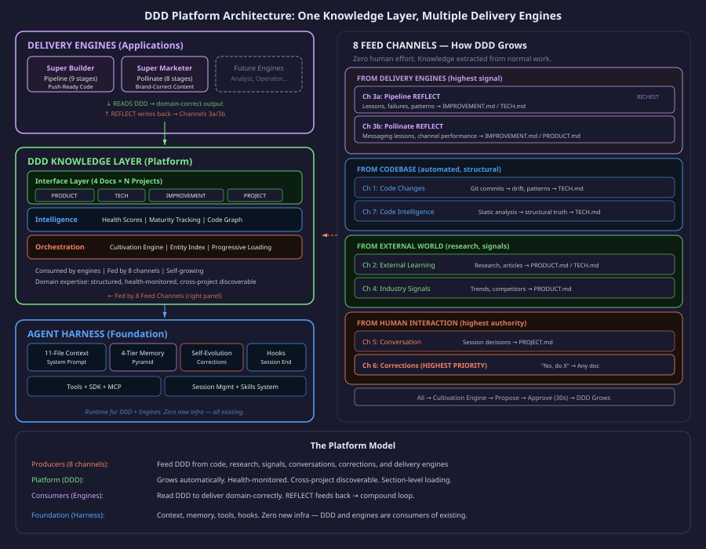
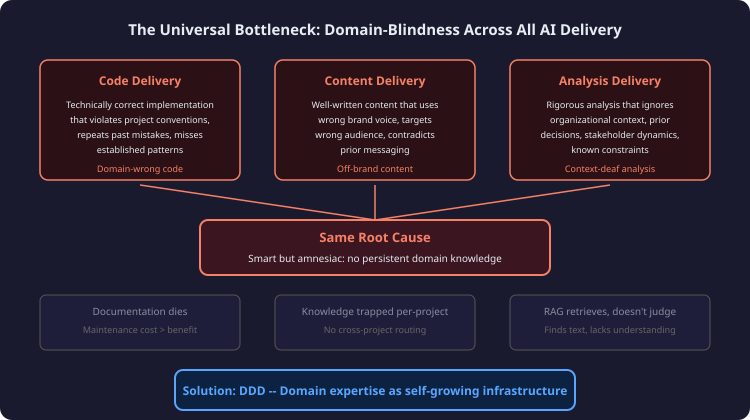
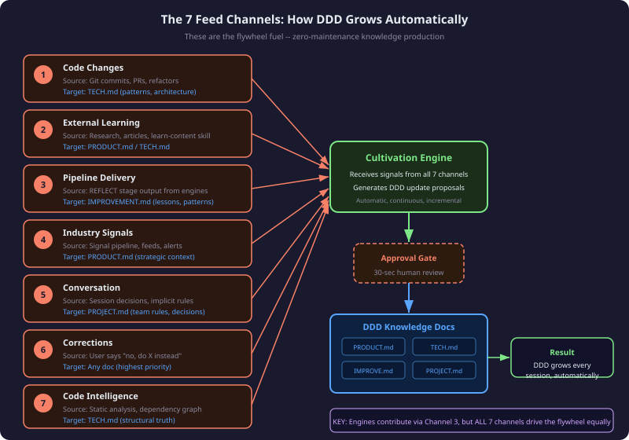
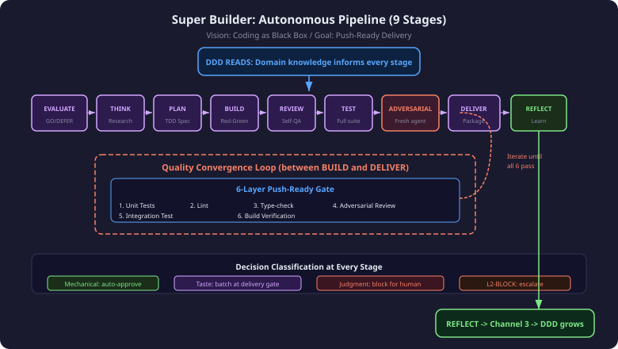
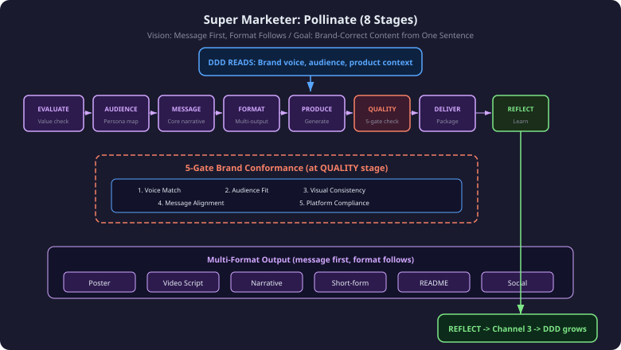
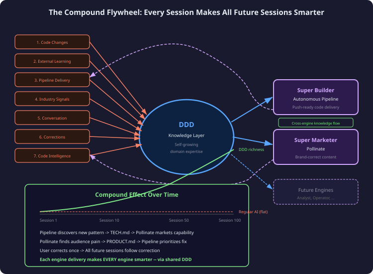
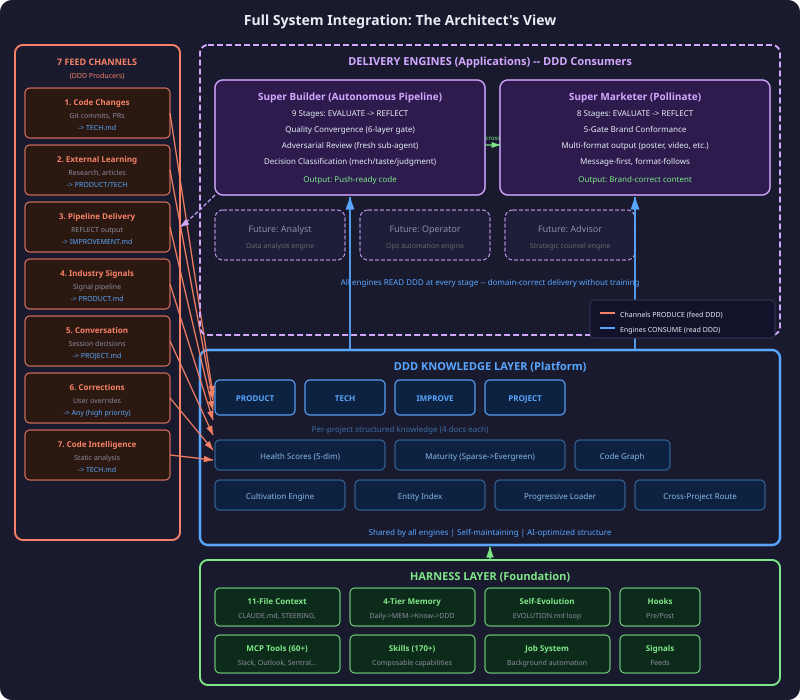

# DDD — One Knowledge Layer, Multiple AI Delivery Engines

> **What we're building:** A platform that turns any AI delivery engine into a domain expert.
>
> A senior engineer is valuable not because they code faster — but because they know the project's history,
> the team's rules, what failed before, and what not to touch. We encoded that growth curve into infrastructure:
>
> - **Harness** — memory, context, tools — the agent doesn't forget
> - **DDD** — domain knowledge that self-grows — the agent doesn't repeat mistakes
> - **Pipeline** — 9 stages + adversarial review + quality convergence — the agent doesn't ship broken code
> - **Pollinate** — 8 stages + brand conformance gates — the agent doesn't produce off-brand content
> - **Cultivation** — every delivery feeds back into knowledge — the agent gets smarter every session
>
> A regular AI agent used 100 times has the same capability as day one.
> This one compounds — session 100 reads DDD that's 100x richer than session 1.

---

## 1. Thesis

**DDD as Platform** — one structured knowledge layer powering multiple specialized delivery engines.

This is not "an AI coding assistant." It's not "an AI content tool." It is **domain expertise as infrastructure** — a platform that makes any AI delivery engine operate with the contextual intelligence of someone who has been on the project for years.

The insight: AI agents fail not from lack of capability, but from lack of context. GPT-4, Claude, Gemini — they can all write code, generate content, analyze data. But they do it blind. Every session starts from zero. Every output lacks the accumulated wisdom that makes a senior professional's work qualitatively different from a junior's.

**The platform model:** Three layers — each enables the one above. Harness provides substrate (memory, tools, context). DDD provides intelligence (what to do, what not to do, what matters). Engines provide specialized delivery. And critically: 8 feed channels grow DDD continuously, creating a compound loop that accelerates with every session.



---

## 2. The Problem: Domain Expertise Is The Universal Bottleneck

Every AI delivery task — code, content, analysis, operations — suffers from the same root cause: **domain-blindness.**

**In code delivery:** The AI writes technically correct implementations that violate project conventions, repeat mistakes already documented in post-mortems, miss established patterns, and touch areas that experienced developers know to avoid. The PR looks fine to a reviewer who doesn't know the project. It's wrong to someone who does.

**In content delivery:** The AI produces well-written content that uses the wrong brand voice, targets the wrong audience segment, contradicts prior messaging, and ignores positioning decisions made months ago. It's generic competence without domain fit.

**In analysis delivery:** The AI generates rigorous analysis that ignores organizational context, prior decisions, stakeholder dynamics, and known constraints. It's academically sound but operationally useless.

**Why existing approaches fail:**

| Approach | Failure Mode |
|----------|-------------|
| Documentation | Dies — maintenance cost exceeds benefit within weeks |
| RAG | Retrieves text, doesn't judge or prioritize |
| Fine-tuning | Static snapshot, expensive to update, can't reason |
| Per-project prompts | Don't scale, can't cross-pollinate, manual burden |
| Onboarding docs | Written once, never updated, quickly stale |

The pattern is consistent: domain knowledge either requires continuous human effort to maintain (unsustainable) or provides retrieval without understanding (insufficient).



**DDD solves this** by making domain knowledge self-maintaining (cultivation from 8 channels), structured for AI consumption (not human documentation), and shared across delivery engines (one knowledge layer, multiple consumers).

---

## 3. The Platform Architecture

Three layers, each enabling the one above:

### Layer 1: Harness (Foundation)

The Harness provides the substrate that makes persistent AI operation possible:

- **11-File Context System** — CLAUDE.md, STEERING.md, MEMORY.md, and 8 others loaded at session start. The agent begins every session with full operational context.
- **4-Tier Memory Pipeline** — DailyActivity (raw session logs) flows to MEMORY.md (curated facts) flows to Knowledge/ (structured notes) flows to DDD (domain expertise). Each tier increases in permanence and structure.
- **Self-Evolution Loop** — EVOLUTION.md captures corrections; recurring patterns promote to STEERING.md as permanent rules. The system learns from its mistakes without human intervention.
- **Session Hooks** — Pre-session (load context, check DDD health) and post-session (extract activity, propose DDD updates). Every session is bookended by intelligence.
- **170+ Skills** — Composable capabilities: from deep-research to browser-agent to code-review. The agent isn't limited to chat — it operates tools.
- **60+ MCP Tools** — Direct integrations: Slack, Outlook, Sentral, GitHub. The agent doesn't just think — it acts.
- **Job System** — Background automation via launchd. Tasks run independently of sessions. Signal pipelines feed DDD while no one is watching.

### Layer 2: DDD Knowledge Layer (Platform)

DDD sits in the middle — consumed by engines above, fed by channels from all directions. It provides structured domain expertise that any engine can read to deliver domain-correct outputs. (Detailed in Section 4.)

### Layer 3: Delivery Engines (Applications)

Specialized workflows that transform requirements into deliverables. Each engine reads DDD to operate with domain intelligence. Each engine's REFLECT stage writes back to DDD through Channel 3.

Currently: Pipeline (code) and Pollinate (content). The platform model means new engines (analysis, operations, advisory) inherit all existing domain knowledge on day one.

**Why this layering matters:** A new engine doesn't need to "learn" the project. It reads DDD. The knowledge already exists because 8 channels have been feeding it continuously. This is what makes it a platform, not just a tool.

---

## 4. DDD: The Knowledge Layer

### 4a. Structure: 3-Layer Stack

DDD is not a flat document. It's a three-layer system:

**Interface Layer — 4 Documents Per Project:**

| Document | Contains | Consumed By |
|----------|----------|-------------|
| PRODUCT.md | What we're building, why, for whom, positioning | All engines (product context) |
| TECH.md | Architecture, patterns, constraints, dependencies | Pipeline primarily, others for feasibility |
| IMPROVEMENT.md | Lessons learned, failure patterns, what not to repeat | All engines (avoid past mistakes) |
| PROJECT.md | Team rules, decision history, workflow preferences | All engines (operational context) |

**Intelligence Layer:**
- Health Scores — 5-dimension scoring (completeness, accuracy, staleness, consistency, usefulness) drives how much the AI trusts each section
- Maturity Tracking — Sparse, Growing, Mature, Evergreen stages determine autonomy levels
- Code Graph — Structural relationships extracted from actual codebase, not documentation

**Orchestration Layer:**
- Cultivation Engine — processes signals into proposals
- Entity Index — routes knowledge across projects
- Feed Channels — 8 sources of continuous input (detailed next)

---

### 4b. The 8 Feed Channels — How DDD Grows

These channels are **the flywheel fuel.** Without them, DDD would be static documentation that decays. With them, DDD is a living system that grows richer with every session, every commit, every research task, every user correction.

| # | Channel | Source | What It Feeds DDD | Target Doc |
|---|---------|--------|-------------------|-----------|
| 1 | **Code Changes** | Git commits, PRs, refactors | Architecture drift, new patterns, deprecated approaches | TECH.md |
| 2 | **External Learning** | Research tasks, articles, learn-content skill | New capabilities, industry approaches, emerging patterns | PRODUCT.md / TECH.md |
| 3a | **Pipeline Delivery** | REFLECT stage from Pipeline | Lessons, failures, code patterns | IMPROVEMENT.md / TECH.md |
| 3b | **Pollinate Delivery** | REFLECT stage from Pollinate | Messaging lessons, channel performance, audience insights | IMPROVEMENT.md / PRODUCT.md |
| 4 | **Industry Signals** | Signal pipeline (GitHub trending, feeds, alerts) | Strategic context shifts, competitive moves, tech trends | PRODUCT.md |
| 5 | **Conversation** | Session decisions, implicit rules expressed in chat | Team preferences, unstated conventions, decision rationale | PROJECT.md |
| 6 | **Corrections** | User says "no, do X instead" | High-priority rule updates, misconception fixes | Any doc (highest priority) |
| 7 | **Code Intelligence** | Static analysis, dependency graph, type inference | Structural truth about the codebase as-built | TECH.md |

**Critical insight:** Pipeline and Pollinate each have their own channel (3a and 3b). But the **other 6 channels are equally important** — they feed DDD from code changes, research, signals, conversations, corrections, and code analysis. The flywheel runs on ALL 8, not just delivery engine feedback.

This means DDD grows even when no engine is running. A git commit triggers Channel 1. A research session triggers Channel 2. A signal feed fires Channel 4. The system is always learning, always growing.



---

### 4c. Cultivation: Propose, Approve, Grow

Cultivation is the orchestration mechanism that turns raw signals into structured knowledge:

**The flow:**

1. Signal arrives from any of the 8 channels
2. Cultivation Engine processes the signal — determines relevance, identifies target section, drafts proposed update
3. Proposal enters the **Approval Gate** — human reviews in ~30 seconds (accept/reject/edit)
4. Approved content merges into the target DDD document
5. Next session starts with richer knowledge

**Safety guarantee:** DDD never silently changes. Every update is proposed, then approved. This prevents hallucinated knowledge from contaminating the system. The human stays in control of what the system "knows."

**Progressive automation:** As sections mature (Sparse -> Growing -> Mature -> Evergreen), approval can shift to auto-approve for low-risk updates. Channel 1 (code changes) updating TECH.md architecture sections can auto-approve once TECH.md reaches Mature status. Channel 6 (corrections) always requires explicit acknowledgment — it's the user overriding the system.

**Batch efficiency:** Proposals accumulate during a session and present at the end. The human doesn't get interrupted mid-flow — they review a batch of 3-8 proposals in one pass. 30 seconds of review powers hours of future intelligence.

---

### 4d. Health, Maturity, Discovery

**Health Scoring (5 dimensions):**
- Completeness — are all expected sections populated?
- Accuracy — does content match current reality?
- Staleness (days since update) — when was each section last validated?
- Consistency — do sections contradict each other?
- Usefulness — does the AI actually reference this content?

Health scores drive trust: the AI weighs high-health sections more heavily in decisions. Low-health sections trigger cultivation priority — they get more proposals, more updates.

**Maturity (graduated autonomy):**
- **Sparse** — newly created, minimal content. AI asks many questions, low autonomy.
- **Growing** — actively accumulating. AI references but double-checks. Cultivation is aggressive.
- **Mature** — comprehensive and validated. AI trusts fully. Some auto-approvals enabled.
- **Evergreen** — self-maintaining with minimal drift. Maximum autonomy. Stable foundation.

**Discovery (Entity Index):**
- Cross-project knowledge routing: if Project A learns something about React performance, and Project B uses React, the Entity Index flags relevance.
- Pattern matching: similar architectures, shared dependencies, common failure modes surface across project boundaries.
- This is what makes DDD a platform, not per-project silos.

---

### 4e. Progressive Loading — How AI Actually Uses DDD

DDD can grow large. A mature project's DDD might span thousands of lines across 4 documents. The AI doesn't load everything into context — it uses progressive loading:

**Session start:** Load structure (section headers) + high-trust/high-health content + recently updated sections. This gives the AI a map of what exists and the most reliable content.

**Mid-conversation:** When the task touches a specific area, pull that section on demand. Working on authentication? Load the TECH.md auth section. Discussing pricing? Load the PRODUCT.md positioning section.

**Scaling behavior:**
- Early projects (Sparse DDD): load everything — it's small enough
- Mature projects (large DDD): section-level loading triggered by task relevance
- Cross-project: Entity Index surfaces relevant sections from other projects only when triggered

This means DDD scales. It doesn't hit context window limits because it loads intelligently, not exhaustively.

---

### 4f. Distribution — A Grown DDD Is a Portable Capability Package

A mature DDD is not confined to SwarmAI. Because a DDD is a self-contained directory
(knowledge + its domain skills + tools + jobs), a grown one can be **packaged and
installed into another AI agent** — Kiro, Claude Code, Cursor — so that agent gets
the same domain-correct judgment. This is the last step of the DDD lifecycle:
**cultivate → version → DISTRIBUTE**.

Distribution is **opt-in and owner-declared**. Each DDD's `aim.json` carries a
`distribution` block declaring its `targets` and `visibility` — that declaration is
the *ceiling*, and the packager only ever emits at-or-below it (never widens reach by
inference). A DDD that declares nothing distributes nothing, and that is a complete,
valid state — not a degraded one.

Two rendering targets, one install primitive:

| Target | Shape | Path |
|--------|-------|------|
| **Capabilities Package** | `Config` + `AIMBuild` build-tool + agent-spec + skills | internal package store |
| **Open-Plugin** | `.plugin/plugin.json` + skills + agents + rules | public plugin registry / local install |

Two governance rules make it safe: **(1)** only *domain* skills ship by default;
*enablement* skills (platform capabilities lent to the DDD) ship only in an explicit
`--with-enablement` variant, as a stdlib-only portable copy for bare hosts. **(2)** a
fail-closed content-scan gate strips secrets, internal hostnames, host-paths, and
internal-MCP references before any external publish — and an internal→external
visibility change is always human-gated.

**Full design:** [`2026-07-20-ddd-dual-target-distribution-design.md`](./2026-07-20-ddd-dual-target-distribution-design.md).

---

## 5. Engine 1: Super Builder — Autonomous Pipeline

**Vision:** Coding as Black Box. Give it a requirement, get push-ready code.

**Goal:** The human provides the "what" and the "why." The Pipeline handles everything from research through delivery — producing code that passes CI, follows conventions, and is ready to merge.

### The 9 Stages

| Stage | Purpose | DDD Interaction |
|-------|---------|-----------------|
| EVALUATE | GO/DEFER/REJECT decision | Reads PRODUCT + PROJECT for priority/scope |
| THINK | Research and context gathering | Reads TECH for existing architecture |
| PLAN | TDD spec — tests before code | Reads IMPROVEMENT for past failures to avoid |
| BUILD | Red-green implementation | Reads TECH for patterns and conventions |
| REVIEW | Self-QA pass | Reads all 4 docs for holistic check |
| TEST | Full test suite execution | Reads TECH for test infrastructure details |
| ADVERSARIAL | Fresh sub-agent reviews with no prior bias | Reads DDD independently — catches groupthink |
| DELIVER | Package for merge (PR, commit messages) | Reads PROJECT for delivery format preferences |
| REFLECT | Extract lessons learned | **Writes** to IMPROVEMENT.md via Channel 3 |

### Quality Convergence Loop

After the 9 stages produce a delivery candidate, the Quality Convergence Loop evaluates it against a **6-Layer Push-Ready Gate**:

1. **Tests Pass** — unit + integration tests all green
2. **Type-Safe** — no type errors, linter clean
3. **No Regressions** — existing tests still pass
4. **Adversarial Clean** — fresh sub-agent found no critical issues
5. **DDD Conformance** — follows TECH.md conventions, avoids IMPROVEMENT.md anti-patterns
6. **Human Decisions Resolved** — all taste/judgment decisions surfaced

If any layer fails, the loop identifies the specific gap, applies a targeted fix, and re-verifies. This is single-task convergence — not multi-session iteration. One requirement goes in, push-ready code comes out, however many iterations that takes internally.

### Decision Classification

Every decision the Pipeline encounters gets classified:

- **Mechanical** — one correct answer, auto-approve (formatting, import ordering)
- **Taste** — multiple valid answers, batch at delivery gate (naming, structure choices)
- **Judgment** — requires human context, block and ask (scope changes, security implications)
- **L2-BLOCK** — escalation required, halt pipeline (architectural decisions, breaking changes)

This means the human only gets interrupted for decisions that genuinely require human judgment. Everything else flows autonomously.



---

## 6. Engine 2: Super Marketer — Pollinate

**Vision:** Message First, Format Follows. The message is the product — formats are just delivery vehicles.

**Goal:** Give it one sentence describing what needs to be communicated. Get brand-correct, audience-correct content across multiple formats — poster, video script, narrative, short-form, README, social posts.

### The 8 Stages

| Stage | Purpose | DDD Interaction |
|-------|---------|-----------------|
| EVALUATE | Is this worth producing? Value assessment | Reads PRODUCT for relevance to current strategy |
| AUDIENCE | Map target personas, channels, attention patterns | Reads PRODUCT + PROJECT for audience definitions |
| MESSAGE | Distill the core narrative — the one thing that matters | Reads PRODUCT for positioning and voice |
| FORMAT | Select formats based on message + audience fit | Reads PROJECT for platform preferences |
| PRODUCE | Generate content across selected formats | Reads all 4 docs for accuracy and context |
| QUALITY | 5-gate brand conformance check | Reads PRODUCT for brand standards |
| DELIVER | Package and stage for distribution | Reads PROJECT for delivery workflows |
| REFLECT | What worked, what didn't, audience insights | **Writes** to IMPROVEMENT.md via Channel 3 |

### 5-Gate Brand Conformance

Parallel to Pipeline's 6-Layer Push-Ready Gate, Pollinate enforces brand quality:

1. **Voice Match** — does the tone match established brand voice?
2. **Audience Fit** — is the content calibrated for the target persona?
3. **Visual Consistency** — do visual elements follow brand guidelines?
4. **Message Alignment** — does the content reinforce (not contradict) existing messaging?
5. **Platform Compliance** — does the format meet platform-specific requirements?

### Multi-Format Output

A single message becomes multiple deliverables:
- **Poster** — visual artifact for social/display
- **Video Script** — storyboard-ready narrative for production
- **Narrative** — long-form writing (blog post, email, document)
- **Short-form** — social media posts, captions, hooks
- **README** — technical communication for developers
- **Social** — platform-optimized snippets

The key: the message is crafted first (stages 1-3), then expressed across formats (stages 4-6). This ensures consistency — every format tells the same story in format-appropriate language.



---

## 7. How Everything Compounds


### The Full Flywheel

```
8 Channels feed DDD
    -> DDD powers engines
        -> Engines deliver outputs
            -> Engine REFLECT feeds Channel 3
                -> DDD grows richer
                    -> Next session: ALL engines are smarter
```

But it's not just Channel 3. While engines run, the other 6 channels also fire:
- Developer commits code (Channel 1) while Pipeline is running
- Research skill learns something new (Channel 2) during a session
- Signal pipeline catches a competitor move (Channel 4) overnight
- User corrects something in conversation (Channel 6) mid-delivery
- Static analysis detects structural change (Channel 7) after a refactor

DDD grows from ALL directions simultaneously. The compound effect accelerates because more knowledge means better delivery means richer REFLECT output means even more knowledge.

### Cross-Engine Compound Effects

The platform model creates cross-engine intelligence that wouldn't exist in siloed tools:

**Pipeline discovers capability -> TECH.md -> Pollinate markets it.** When the Pipeline builds a new feature, TECH.md captures what was built and why. Pollinate reads TECH.md and can accurately describe the capability to the audience — without anyone manually writing marketing copy about the feature.

**Pollinate finds audience pain -> PRODUCT.md -> Pipeline prioritizes fix.** When Pollinate's audience analysis surfaces a pain point, PRODUCT.md captures it. Pipeline's EVALUATE stage reads PRODUCT.md and can prioritize the fix — without a human translating user feedback into engineering requirements.

**User corrects brand voice -> PROJECT.md -> ALL engines respect it.** When a user says "we don't use that word" in a Pollinate session, Channel 6 captures it. Pipeline avoids it in commit messages. Future engines avoid it in their outputs. One correction propagates everywhere.

### The Math of Compounding

Session 1: DDD is sparse. Engines work, but without domain context. Delivery is generic.

Session 10: DDD has absorbed ~80 signals from 8 channels. Engines start making domain-correct decisions. Delivery improves noticeably.

Session 50: DDD is rich. Engines rarely make domain errors. Delivery is indistinguishable from a senior team member's work. Human corrections become rare.

Session 100: DDD approaches Evergreen. Engines operate with deep expertise. The system "knows" things that no individual team member knows completely — because it has absorbed knowledge from all sources continuously.

**A regular AI agent at session 100 has the same capability as session 1.** This system at session 100 has the accumulated wisdom of every session, every commit, every correction, every research task that ever ran.




---

## 8. Full System Integration

Everything together — the architect's complete view:



### What Each Layer Provides

| Layer | Provides | To Whom | Key Characteristic |
|-------|----------|---------|-------------------|
| **Harness** | Memory, context, tools, evolution, hooks | DDD + Engines | Never forgets, always available |
| **DDD** | Structured domain expertise | All engines equally | Self-growing, shared, AI-optimized |
| **8 Channels** | Continuous signal input | DDD (via Cultivation) | Zero human effort, always feeding |
| **Engines** | Specialized delivery | End users | Domain-correct, quality-gated |
| **Cultivation** | Signal-to-knowledge transformation | DDD growth | Propose-approve-grow safety |

### Information Flow Summary

```
SOURCES (external world, codebase, users, signals)
    | (via 8 Channels)
    v
CULTIVATION ENGINE (propose updates)
    | (via Approval Gate)
    v
DDD KNOWLEDGE LAYER (structured expertise)
    | (via Progressive Loading)
    v
DELIVERY ENGINES (Pipeline, Pollinate, Future)
    | (outputs)
    v
DELIVERABLES (push-ready code, brand-correct content)
    | (via REFLECT)
    v
CHANNEL 3 (feeds back into DDD)
```

### Platform Properties

**Shared knowledge:** Every engine reads the same DDD. Knowledge learned by one engine benefits all others. No duplication, no drift between "what engineering knows" and "what marketing knows."

**Incremental adoption:** DDD starts sparse for any project. You don't need to write documentation upfront. Use the system normally — the 8 channels populate DDD automatically. Value begins accumulating from session 1.

**Filesystem-native:** DDD is markdown files in a directory. No database. No server. No infrastructure to maintain. It works with git, with any editor, with any backup system.

**Engine-agnostic platform:** Adding a new engine doesn't require rebuilding knowledge. The future Analyst engine will read the same DDD that Pipeline and Pollinate already enrich. Day-one domain expertise for any new engine.

---

## 9. FAQs

**"Why not just RAG?"**

RAG retrieves relevant text chunks. DDD provides structured judgment. RAG finds "we use React" — DDD knows "we use React with these specific patterns, this state management approach was chosen for these reasons, this alternative was rejected because X, and here are 3 mistakes we made that you should avoid." Retrieval is a subset of understanding. DDD provides understanding.

**"Why not separate knowledge per engine?"**

Because cross-engine learning is where the platform value lives. If Pipeline has its own knowledge and Pollinate has its own, then Pipeline's discovery of a new feature can't automatically inform Pollinate's messaging. Shared DDD means one learning event benefits all consumers. This is the platform advantage over siloed tools.

**"What about future engines?"**

This is the strongest argument for the platform model. When we add an Analyst engine (data analysis delivery), it reads existing DDD on day one. It already knows the product context (PRODUCT.md), the technical architecture (TECH.md), past lessons (IMPROVEMENT.md), and team preferences (PROJECT.md). Zero cold-start. The investment in growing DDD today pays forward to every future engine.

**"How does this differ from traditional DDD (Domain-Driven Design)?"**

Traditional DDD is a software design methodology — bounded contexts, aggregates, value objects. Our DDD is Domain-Driven Development in a different sense: the domain knowledge drives the development process itself. The AI doesn't just implement bounded contexts — it operates with domain awareness that evolves. The similarity is intentional (domain expertise shapes delivery) but the mechanism is different (self-growing AI knowledge layer vs. human design patterns).

**"What's the adoption cost?"**

Near-zero for getting started. Create a project directory with 4 empty markdown files. Use the system normally. The 8 channels begin populating DDD from session 1. There's no upfront documentation effort — the investment is the normal work you're already doing. DDD extracts knowledge as a byproduct of delivery.

**"Does this replace documentation?"**

It replaces the need for manually-maintained documentation. DDD is documentation that maintains itself — updated by 8 channels continuously. But it's AI-optimized documentation (structured for machine consumption, health-scored, progressively loaded) rather than human-optimized documentation (prose meant for onboarding reads). The two can coexist, but DDD is the system's source of truth.

**"What happens if DDD gets something wrong?"**

Channel 6 (Corrections). The user says "that's wrong, actually X." This is the highest-priority channel — it immediately generates a proposal to fix the incorrect knowledge. The Approval Gate ensures the correction is captured accurately. One correction, permanent fix. The system won't make that mistake again.

**"Can this work for a team, not just an individual?"**

Yes. DDD is files in a repository. Multiple team members contributing sessions means multiple Channel 5 (Conversation) and Channel 6 (Corrections) sources. The team's collective knowledge accumulates in shared DDD. The Entity Index routes relevant knowledge across team members' projects. Every team member's corrections benefit every other team member's sessions.

---

*This document is the complete vision of the DDD Platform. After reading it, you understand: what the system is (a platform turning AI engines into domain experts), why it exists (domain-blindness is the universal bottleneck), how it works (8 channels feed DDD, engines consume DDD), what powers the flywheel (cultivation from 8 automatic sources), and what the delivery engines are (Pipeline for code, Pollinate for content, future engines for everything else). One knowledge layer. Multiple delivery engines. Compound growth.*
