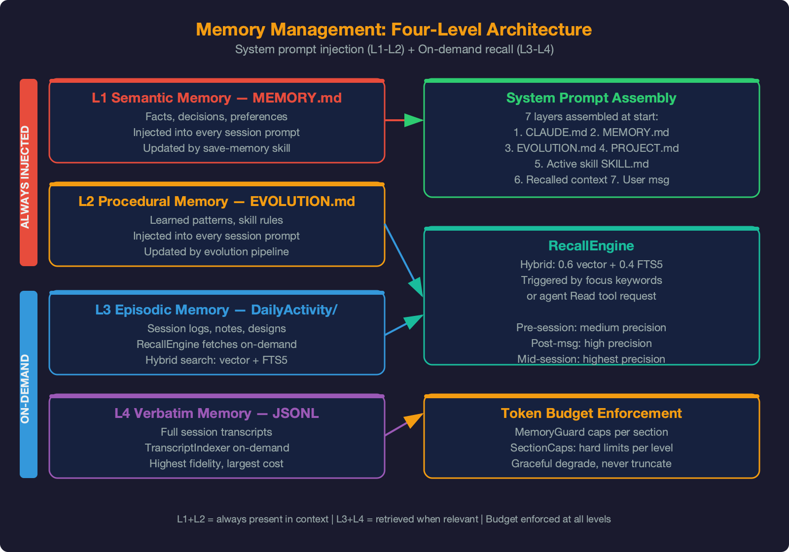
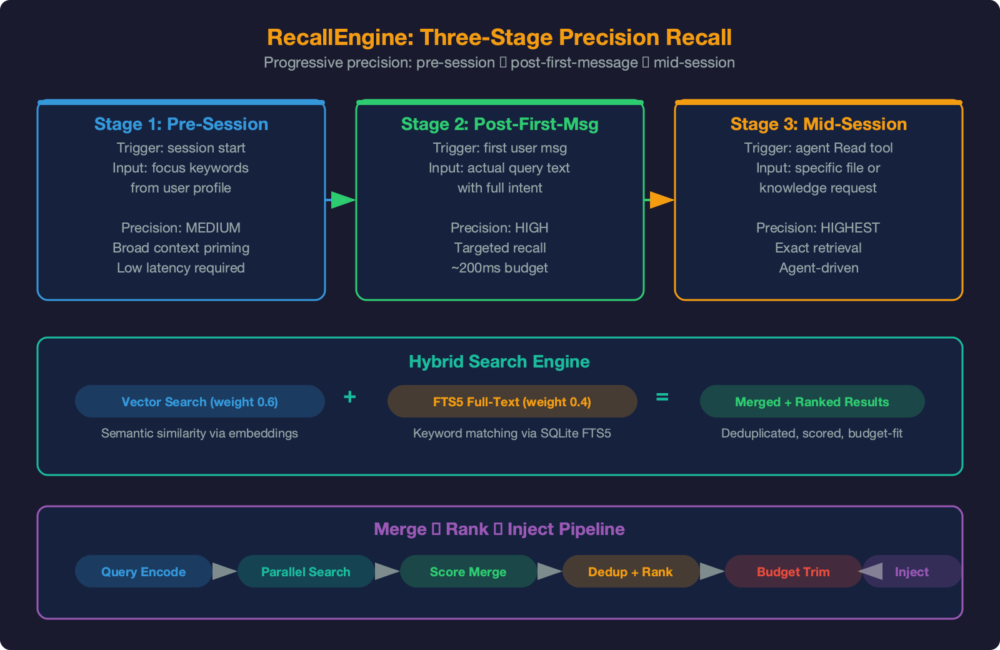
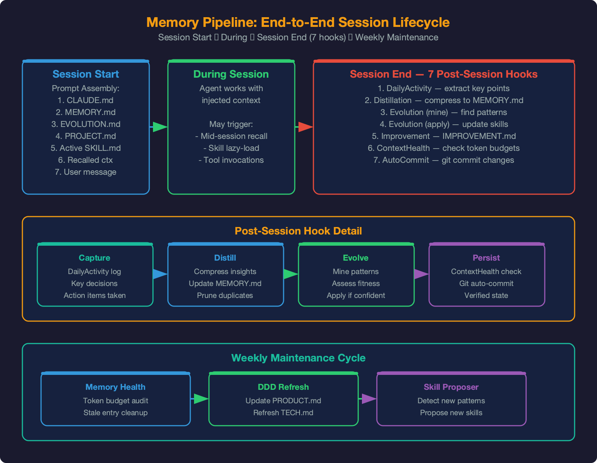

# Memory Management

## Executive Summary

A stateless LLM forgets everything when the session ends. SwarmAI's memory system creates genuine persistence — the agent knows what it knows (semantic memory), knows how to act (procedural memory), remembers what happened (episodic memory), and can retrieve exact details from past conversations (verbatim recall).

The system manages four categories of knowledge, totaling **1,000K+ tokens across 270+ files and 700MB+ of raw conversation transcripts**. Before this work, only 32K (~3%) was injected into the system prompt — 97% of accumulated knowledge was invisible. Raw conversation transcripts contained exact details that no amount of summarization preserves, and none of it was searchable.

**Key metrics (April 2026):**

| Metric | Value |
|--------|-------|
| Memory modules | 9 files, 5,447 lines |
| Test coverage | 346+ tests, 0 regressions |
| Knowledge library | 270+ files, 1,000K+ tokens |
| Raw transcripts | 1,500+ JSONL files, 700MB+ |
| Always-injected context | ~32-50K tokens (Brain + Index + Ephemeral) |
| On-demand recall budget | 0-20K tokens (Library + Transcripts) |
| Search strategy | Hybrid: 0.6 vector (Bedrock Titan v2) + 0.4 FTS5 keyword |

**Design principle:** 越用越聪明，不是越用越降智。Intelligence at read time, not write time. Power over token budget — every design maximizes recall, never optimizes for token savings.

---

## 1. The Problem: 97% Knowledge Utilization Gap

| Asset | Volume | Utilization Before | After |
|-------|--------|-------------------|-------|
| MEMORY.md (Brain) | ~5K tokens, 90 entries | 100% (full injection) | 100% (unchanged) |
| EVOLUTION.md | ~2.5K tokens | 100% (full injection) | 100% (unchanged) |
| DailyActivity logs | 370K tokens, 32 files | ~5% (today + yesterday only) | ~30% via recall |
| Designs, Notes, AIDLC | 233K tokens, 47 files | 0% | ~30% via recall |
| Signals | 50K tokens, 25 files | ~2% (daily digest only) | ~10% via recall |
| Raw transcripts | 700MB+, 1,500+ JSONL | 0% | Semantic search |
| **Total utilization** | | **~3%** | **~30%+** |

The core problem was never Brain management — MEMORY.md was healthy. The problem was **730K tokens of accumulated knowledge and 700MB of conversation transcripts sitting unused**.

**MemPalace validation (21.6K GitHub stars, April 2026):** Raw verbatim storage achieves 96.6% recall on LongMemEval, versus 84.2% for LLM-summarized content. A 12.4% gap. Our 1,500+ JSONL transcripts are this untapped gold mine.

---

## 2. Architecture: Four Memory Levels

{width=100%}

SwarmAI's memory maps to four cognitive levels — each with its own storage, retrieval strategy, and injection point:

| Level | Type | Human Analogy | Storage | Injection Strategy |
|-------|------|---------------|---------|-------------------|
| **L1** | Semantic | "I know that..." | MEMORY.md (curated) | Always — full injection into system prompt |
| **L2** | Procedural | "I know how..." | EVOLUTION.md (corrections, competence) | Always — full injection into system prompt |
| **L3** | Episodic | "I experienced..." | DailyActivity, Notes, Designs (730K+) | On-demand — RecallEngine hybrid search |
| **L4** | Verbatim | "The exact words..." | JSONL transcripts (700MB+) | On-demand — TranscriptIndexer semantic search |

**Concrete example — "credential chain" recall across levels:**

```
L1 (Brain):     "Two credential chains coexist — CLI uses SSO, boto3 uses ada"
                -> Immediate answer: knows the problem exists

L2 (Evolution): "Validate the chain your code actually uses, not the easier one"
                -> Knows HOW to investigate: check SSO first, not ada

L3 (Episodic):  DailyActivity/2026-03-23.md has the full investigation record
                -> Knows WHAT happened: specific files checked, proxy impact, commit

L4 (Verbatim):  JSONL transcript has exact stack traces, commands tried, dead ends
                -> Knows EVERYTHING: "I tried X, it failed with Y, then discovered Z"
```

L1+L2 answer "what do we know?" (always available). L3 answers "what did we do?" (recalled on demand). L4 answers "what exactly happened?" (searched semantically). Together they provide complete recall.

### 2.1 System Prompt Architecture

```
┌─────────── System Prompt (~32-50K tokens) ──────────────┐
│                                                          │
│  ALWAYS INJECTED (~28-38K):                              │
│  ├─ Identity    (SWARMAI+IDENTITY+SOUL)          ~2K    │
│  ├─ Procedural  (AGENT+STEERING+USER+TOOLS       ~12K   │
│  │               +EVOLUTION)                             │
│  ├─ Semantic    (MEMORY.md — full injection)     ~5-15K  │
│  ├─ Index       (KNOWLEDGE+PROJECTS)             ~5K    │
│  └─ Ephemeral   (DailyActivity today+briefing)   ~4K    │
│                                                          │
│  PER-SESSION (recalled on demand, 0-20K):                │
│  ├─ Episodic    (Knowledge library recall)       0-15K   │
│  └─ Verbatim   (Transcript semantic recall)      0-5K    │
│                                                          │
│  PER-PROJECT:                                            │
│  └─ DDD docs   (PRODUCT/TECH/IMPROVEMENT/PROJECT) 0-8K  │
│                                                          │
└──────────────────────────────────────────────────────────┘
```

The 11-file context chain (P0–P10) manages the always-injected layers. The RecallEngine and TranscriptIndexer manage the on-demand layers. Per-project DDD injection is handled by the pipeline's stage-scoped document loading.

---

## 3. Knowledge Store (`core/knowledge_store.py`, 509 lines)

Indexes the entire Knowledge library (270+ markdown files) into searchable chunks via sqlite-vec (vector) and FTS5 (keyword).

### 3.1 Data Model

```sql
-- Document chunks (~500 tokens each, split by markdown heading)
CREATE TABLE knowledge_chunks (
    id INTEGER PRIMARY KEY AUTOINCREMENT,
    source_file TEXT NOT NULL,      -- "DailyActivity/2026-03-31.md"
    chunk_index INTEGER NOT NULL,
    heading TEXT,                    -- "## 15:06 | 50b172ee" (section heading)
    content TEXT NOT NULL,
    content_hash TEXT NOT NULL,      -- SHA-256 for delta sync
    metadata TEXT,                   -- JSON: {date, type, project, tags}
    updated_at TEXT NOT NULL DEFAULT (datetime('now'))
);

-- Vector index (Bedrock Titan v2, 1024-dim)
CREATE VIRTUAL TABLE knowledge_vec USING vec0(
    id INTEGER PRIMARY KEY,
    embedding float[1024]
);

-- Full-text search (keyword matching)
CREATE VIRTUAL TABLE knowledge_fts USING fts5(
    content, heading, source_file,
    content=knowledge_chunks, content_rowid=id
);
```

### 3.2 Chunking Strategy

| File Type | Split Strategy | Chunk Size |
|-----------|---------------|------------|
| DailyActivity | By `## HH:MM` session entry | ~500-2000 tokens |
| Designs | By `## Heading` | ~500 tokens |
| Notes | By `## Heading` | ~500 tokens |
| AIDLC | By `## Heading` | ~500 tokens |
| Signals | By entry | ~200 tokens |

**Each chunk retains its heading as context** — so recalled results are self-contained. A chunk from "DailyActivity/2026-03-23.md -> ## 15:06 | Credential investigation" gives the agent both the content and the context of where it came from.

### 3.3 Incremental Sync

Triggered by ContextHealthHook at session end:

1. Scan `Knowledge/` for all `.md` files
2. Compare file mtime vs `knowledge_chunks.updated_at`
3. Changed files: re-chunk + content_hash comparison
4. New/changed chunks: embed via Bedrock Titan -> upsert to vec + FTS5
5. Deleted files/chunks: remove from index

**Typical session:** 1-3 files changed, <5 seconds.

**First-time indexing:** 270+ files -> ~1,000 chunks -> embed -> ~100 seconds (background, non-blocking). Indexing completion is not required for session operation — recall returns empty results gracefully until index is populated.

---

## 4. Recall Engine (`core/recall_engine.py`, 221 lines)

{width=100%}

Hybrid search that connects Brain (always), Library (on-demand), and Transcripts (on-demand):

### 4.1 Search Strategy

```python
def recall_knowledge(query: str, max_tokens: int = 15_000) -> str:
    # 1. FTS5 keyword search (fast, precise)
    fts_results = fts5_search(query, limit=20)
    
    # 2. Vector search (semantic, catches what keywords miss)
    embedding = embed_text(query)  # Bedrock Titan v2, ~150ms
    vec_results = vector_search(embedding, limit=20)
    
    # 3. Hybrid merge (0.6 vector + 0.4 keyword)
    ranked = hybrid_merge(fts_results, vec_results)
    
    # 4. Assemble within token budget, with provenance
    return format_for_injection(ranked, max_tokens)
```

**Why 0.6 vector + 0.4 keyword?** Pure keyword misses semantic paraphrases ("auth issue" doesn't match "credential chain"). Pure vector misses precise terms ("AKIA" token pattern). The hybrid ratio was calibrated on manual spot checks.

### 4.2 Three-Stage Recall

| Stage | Query Source | Precision | Timing | Activation |
|-------|------------|-----------|--------|------------|
| **Pre-session** | Focus keywords from proactive briefing | Medium | System prompt assembly | Always |
| **Post-first-message** | User's actual first message | High | After first message arrives | Commit `3c9f0d4` |
| **Mid-session** | Agent-initiated Read tool | Highest | On demand | Always available |

**Pre-session recall** uses focus keywords extracted by Proactive Intelligence — these predict what the session might be about based on open threads, recent activity, and signal highlights. Precision is medium because it's a prediction.

**Post-first-message recall** (activated April 14, commit `3c9f0d4`) re-searches the Knowledge library with the actual user query after the first message arrives. This is the precision layer — the user's actual words are the best query. Results are injected via the agent's Read tool, not by modifying the system prompt.

**Mid-session recall** is already available — the agent can use the Read tool anytime. The RecallEngine's value is making the agent **know what to look for** and **where to find it**.

### 4.3 Recall Quality Gate

**Threshold:** If all search results score <0.2, nothing is injected. Empty recall beats wrong recall.

This prevents noise injection when the Knowledge library has no relevant content — e.g., a completely new topic the agent has never encountered.

---

## 5. Transcript Indexer (`core/transcript_indexer.py`, 562 lines)

The "verbatim memory" layer — semantic search over raw conversation transcripts that no summary can replace.

### 5.1 Why Raw Transcripts Matter

MemPalace (Milla Jovovich + Ben Sigman, 21.6K GitHub stars) validated the core insight with benchmark data:

| Test | Raw Verbatim | LLM Summary | Gap |
|------|-------------|-------------|-----|
| LongMemEval R@5 | **96.6%** | 84.2% | 12.4% |
| ConvoMem | **92.9%** | — | — |
| LoCoMo | **100%** | — | — |

The 12.4% gap represents details that summarization loses: exact error messages, specific command sequences, dead-end approaches, stack traces, version numbers, timing details. These are precisely the details users ask about when debugging a recurring issue.

### 5.2 Data Model

Same pattern as Knowledge Store (schema reuse):

```sql
CREATE TABLE transcript_chunks (
    id INTEGER PRIMARY KEY AUTOINCREMENT,
    session_id TEXT NOT NULL,        -- "20260411_052700_abc123"
    source_file TEXT NOT NULL,       -- JSONL file path
    chunk_index INTEGER NOT NULL,
    role TEXT NOT NULL,              -- "user", "assistant", "mixed"
    content TEXT NOT NULL,
    content_hash TEXT NOT NULL,
    metadata TEXT,                   -- JSON: {date, tools_used, files_mentioned}
    created_at TEXT NOT NULL DEFAULT (datetime('now'))
);

CREATE VIRTUAL TABLE transcript_vec USING vec0(
    id INTEGER PRIMARY KEY,
    embedding float[1024]
);

CREATE VIRTUAL TABLE transcript_fts USING fts5(
    content, source_file,
    content=transcript_chunks, content_rowid=id
);
```

### 5.3 Chunking Strategy

JSONL files are parsed into turn pairs (user + assistant), chunked at ~500 tokens, preserving dialogue context:

```python
def chunk_transcript(turns: list[dict], max_tokens: int = 500) -> list[Chunk]:
    """Preserve user/assistant pairs — never break mid-dialogue."""
    chunks, current, current_tokens = [], [], 0
    for turn in turns:
        turn_tokens = estimate_tokens(turn["content"])
        if current_tokens + turn_tokens > max_tokens and current:
            chunks.append(merge_turns(current))
            current, current_tokens = [], 0
        current.append(turn)
        current_tokens += turn_tokens
    if current:
        chunks.append(merge_turns(current))
    return chunks
```

Reuses `SessionMiner._parse_transcript()` for JSONL parsing — same parser, different consumer.

### 5.4 Indexing Schedule

| Trigger | Scope | Duration |
|---------|-------|----------|
| First boot | All 1,500+ JSONL files | ~83 min (background job) |
| Session end | Current session's transcript | <10 seconds |
| Manual | `transcript_indexer.rebuild()` | Full re-index |

First-time indexing runs as a background job — doesn't block session operation. Before completion, transcript search returns empty results (graceful no-op).

### 5.5 Relationship to SessionRecall

| Dimension | SessionRecall | TranscriptIndexer |
|-----------|--------------|-------------------|
| Data source | DB `messages` table | JSONL raw transcripts |
| Search method | FTS5 keyword only | Hybrid vector + FTS5 |
| Content depth | Persisted user/assistant text | Full dialogue including tool_use, thinking |
| Coverage | Only DB-persisted sessions | All 1,500+ transcripts |
| Speed | Fast (~50ms) | Moderate (~200ms) |
| Use case | Recent session context | Deep historical detail |

**Complementary, not replacement.** SessionRecall is the fast recent-session lookup. TranscriptIndexer is the deep historical search. Both are available simultaneously.

---

## 6. Embedding Client (`core/embedding_client.py`, 153 lines)

Thin wrapper around Amazon Bedrock Titan Text Embeddings v2 (1024-dim vectors):

- **Model:** `amazon.titan-embed-text-v2:0`
- **Dimensions:** 1024
- **Connection:** Pooled boto3 Bedrock Runtime client
- **Error handling:** 3× retry with exponential backoff
- **Cost:** ~$0 for local usage (Bedrock API within same account)
- **Shared by:** KnowledgeStore and TranscriptIndexer

---

## 7. Memory Index (`core/memory_index.py`, 1,148 lines)

Generates and maintains the MEMORY.md index — the compact summary at the top of the memory file that enables fast scanning.

### 7.1 Index Structure

The Memory Index is organized into two tiers:

- **Permanent:** COEs (never age out), Key Decisions (never age out unless superseded)
- **Active:** Recent Context, Lessons Learned, Open Threads (subject to caps and archival)

Each entry in the index is a one-line summary with:
- Stable key (`[COE01]`, `[KD15]`, `[RC07]`, `[LL12]`)
- Date
- One-line description
- Keyword aliases for L1 selective injection

### 7.2 Cross-Reference Extraction (`_extract_refs()`)

Pattern matches for entry IDs (`COE[0-9]+`, `KD[0-9]+`, etc.) in entry text. When L1 injection loads an entry, 1-hop graph traversal also loads referenced entries (capped at 3).

Example: Loading `[KD15]` which references `COE02` -> both entries are loaded together. Related context travels as a unit.

### 7.3 Temporal Validity (`_extract_superseded_keys()`)

MEMORY.md entries carry temporal metadata as HTML comments:

```markdown
- [KD07] 2026-04-01 Single-agent with role-switching > multi-agent
  <!-- valid_from: 2026-04-01 | superseded_by: null | confidence: high -->
```

**Lifecycle:**

| Event | Action |
|-------|--------|
| New entry created | `valid_from: today`, `superseded_by: null` (distillation hook) |
| Decision reversed | Memory health job sets `superseded_by: KD_NEW` |
| User says "we changed X" | Auto-update old entry's temporal metadata |

**Scoring:** Superseded entries get 0.1 weight — still searchable but rarely injected. This is structural prevention of the COE03 pattern where 5 consecutive sessions trusted a false memory.

### 7.4 Entry Count Tracking

Tracks entry count per section and reports to ContextHealthHook for cap enforcement. When a section exceeds its cap, distillation hook archives the oldest entry (or merges similar entries for Lessons Learned).

---

## 8. The Memory Pipeline: End-to-End Lifecycle

{width=100%}

### 8.1 Phase A: Session Start (Prompt Assembly)

```
1. Proactive Intelligence generates briefing
   -> focus_keywords, alerts, signal_highlights

2. System Prompt assembled (prompt_builder.py)
   a. Identity + Procedural + Brain (always, full)
   b. Index (KNOWLEDGE.md + PROJECTS.md)
   c. Ephemeral (DailyActivity today + briefing)
   d. Recalled Knowledge (RecallEngine pre-session search)
   e. Project DDD docs (if project detected)

3. Post-first-message recall (L2/L3 activation)
   -> RecallEngine re-searches with actual user query
   -> Injects supplementary context via agent Read tool
```

### 8.2 Phase B: During Session

```
- Agent processes requests normally
- Evolution hook captures corrections/competence in real-time
- DDD docs loaded per-project as needed
- Agent can manually recall via Read tool (mid-session L4)
```

### 8.3 Phase C: Session End (7 Hooks Fire)

```
1. DailyActivityExtractionHook -> DailyActivity/YYYY-MM-DD.md
2. DistillationHook -> promote high-value entries to MEMORY.md
   -> MemoryGuard sanitizes all writes
   -> SectionCaps enforces entry limits
   -> EntryRefs generates cross-references
   -> Temporal metadata (valid_from) added to new entries
3. EvolutionTriggerHook -> EVOLUTION.md corrections/competence
4. EvolutionMaintenanceHook -> status management + pipeline trigger
5. ImprovementWritebackHook -> Projects/SwarmAI/IMPROVEMENT.md
6. ContextHealthHook
   -> Refresh KNOWLEDGE.md index
   -> Refresh MEMORY.md index
   -> Incremental sync: Knowledge Store + Transcript Indexer
   -> Retention policy enforcement
7. AutoCommitHook -> git commit workspace changes
```

### 8.4 Phase D: Weekly Maintenance (Monday 11am ICT)

```
8.  weekly-maintenance -> prune caches
9.  memory-health (LLM) -> Brain content audit
    -> Detect superseded decisions -> mark temporal metadata
    -> Archival based on "superseded by", never by age alone
10. ddd-refresh (LLM) -> DDD staleness detection
11. skill-proposer (LLM) -> capability gap -> skill proposals

Catch-up: cron_utils 7-day window — auto-runs on next boot if missed
```

---

## 9. Brain Content Strategy (MEMORY.md)

### 9.1 Entry Format

Distillation produces enriched entries with actionable detail and provenance links:

```markdown
- 2026-03-23: **Two credential chains coexist** — CLI uses AWS SSO IdC tokens
  (auto-refreshed from ~/.aws/sso/cache/), boto3 uses credential_process
  (ada -> Isengard). These are independent — validating the wrong chain gives
  false negatives. Strip ALL proxy vars when spawning CLI subprocesses.
  Detail: DailyActivity/2026-03-23.md, commit aca865b.
```

The `Detail:` line is critical — it tells the agent exactly where to look for full context if Brain summary isn't sufficient. This bridges L1 (semantic) to L3 (episodic) recall.

### 9.2 Section Caps and Graduation

| Tier | Section | Max Entries | Graduation Rule |
|------|---------|-------------|-----------------|
| **Permanent** | COE Registry | 15 | Never archive — each prevents a class of incidents |
| **Permanent** | Key Decisions | 30 | Never — unless explicitly superseded (temporal validity) |
| **Long-term** | Lessons Learned | 25 | When internalized as AGENT/STEERING standing rule |
| **Active** | Recent Context | 30 | When superseded by newer entry on same topic |
| **Active** | Open Threads | 10 | Resolved -> archive after 7 days |

Overflow -> `Knowledge/Archives/MEMORY-archive-YYYY-MM.md` (full text preserved, never deleted).

### 9.3 Capacity Projections

```
Current:  ~5K tokens (90 entries) — healthy
Steady:   10-15K tokens (with value-based pruning)
Soft cap: 20K tokens (triggers stricter distillation, not forced pruning)
```

Graduation mechanism deferred until Brain >15K. Natural growth rate controlled by distillation selectivity. At current growth rate (~100 tokens/week), 15K threshold is 3-6 months away.

### 9.4 EVOLUTION.md Strategy

EVOLUTION.md is **procedural memory** — "how to do things" and "what mistakes to avoid."

| Section | Treatment | Rationale |
|---------|-----------|-----------|
| Corrections (C001-C009) | Permanent Brain | Highest-value: prevent repeated mistakes |
| Competence (K001-K014) | Brain | Confidence and judgment calibration |
| Optimizations (O001-O002) | Brain | Code quality patterns |
| Capabilities (E001-E002) | Brain | Self-awareness of abilities |
| Failed Evolutions | Brain | Know what doesn't work |

**Full injection, always.** Currently ~2.5K tokens. No splitting needed.

---

## 10. Competitive Analysis

### 10.1 vs MemPalace (21.6K stars, April 2026)

| Dimension | MemPalace | SwarmAI Memory |
|-----------|-----------|----------------|
| Storage philosophy | Raw verbatim (store everything) | Hybrid: curated Brain + raw transcripts |
| Search | Vector-only (OpenAI embeddings, ChromaDB) | Hybrid: 0.6 vector + 0.4 FTS5 (sqlite-vec) |
| Benchmark | 96.6% LongMemEval (raw) | Targets >85% with hybrid + curated Brain |
| Cost | ~$10/year (cloud embedding API) | ~$0 (Bedrock Titan, local sqlite-vec) |
| Intelligence timing | Read-time only | Write-time (distillation) + read-time (recall) |
| Curation | None — store everything, search later | Distillation pipeline -> curated Brain |
| Structure | Palace metaphor (Wings -> Rooms -> Halls -> Drawers) | 4-level cognitive model (Semantic -> Verbatim) |

**Our advantage:** MemPalace stores everything and searches it. We do that (TranscriptIndexer) AND curate the best insights into Brain for always-on injection. Curated Brain beats raw search for decision scenarios. Raw transcripts beat curated summaries for exact-detail recall. We have both layers.

### 10.2 vs Claude Code (Vanilla)

| Dimension | Claude Code | SwarmAI Memory |
|-----------|-------------|----------------|
| Cross-session memory | None (fresh each session) | Full pipeline: Brain + Library + Transcripts |
| Memory writes | CLAUDE.md (flat file, user-managed) | 11-file priority chain + MemoryGuard |
| Recall | Manual file reads only | Automatic hybrid recall (pre + post-first-message) |
| Self-improvement | None | 4-phase evolution pipeline + corrections -> skill improvement |
| Safety | None | MemoryGuard + SkillGuard + temporal validity |
| Distillation | None | Session -> DailyActivity -> MEMORY.md (verified) |

### 10.3 vs Honcho (Dialectic User Modeling)

| Dimension | Honcho | SwarmAI UserObserver |
|-----------|--------|---------------------|
| Architecture | External cloud service | Local module (355 lines) |
| Storage | Cloud DB | `.context/user_observations.jsonl` |
| Modeling | 4 observation channels + LLM synthesis | Pattern detection + convergence check |
| Privacy | Data leaves device | Never leaves device |
| Cost | API subscription | $0 |

We don't need Honcho's complexity. The UserObserver covers the high-value case (user corrections and behavioral patterns) at zero dependency cost.

---

## 11. Key Design Decisions

### 11.1 Why Full MEMORY.md Injection, Not Progressive?

With a 1M context window, 5-15K tokens for Brain is negligible. Full injection means the agent ALWAYS has access to all curated knowledge — no retrieval latency, no missed entries due to query mismatch. Progressive disclosure adds complexity for a non-existent constraint.

### 11.2 Why Hybrid Search (Vector + FTS5), Not Vector-Only?

Pure vector search misses precise technical terms. "AKIA" (AWS access key prefix) has no semantic meaning to an embedding model — it's just a string. FTS5 keyword search catches it instantly. The 0.6/0.4 blend ensures both semantic similarity and exact-match precision.

### 11.3 Why Incremental Index Sync, Not Batch?

Re-indexing 1-3 changed files per session (<5 seconds) keeps the index fresh without background job overhead. Batch re-indexing would require a scheduled job, add latency, and risk stale results between runs.

### 11.4 Why Temporal Validity Instead of Deletion?

Deleting superseded entries loses history. A developer who asks "what was our previous approach?" needs the old entry. `superseded_by` metadata reduces injection weight to 0.1 (rarely appears in prompts) while keeping the entry searchable. This is strictly better than deletion.

### 11.5 Why Document-as-Bounded-Context for DDD?

Each of the 4 DDD documents (PRODUCT.md, TECH.md, IMPROVEMENT.md, PROJECT.md) owns one decision domain. Documents cannot cross boundaries — TECH.md never judges business severity, PRODUCT.md never estimates cost. This maps traditional DDD's bounded context principle to the document-centric world of AI agents. (See AIDLC Phase 3 design for full rationale.)

---

## 12. Module Index

| Module | File | Lines | Role |
|--------|------|-------|------|
| KnowledgeStore | `core/knowledge_store.py` | 509 | Library indexing (chunk + embed + sync) |
| RecallEngine | `core/recall_engine.py` | 221 | Hybrid search (vector + FTS5 + merge) |
| TranscriptIndexer | `core/transcript_indexer.py` | 562 | Raw transcript semantic indexing |
| EmbeddingClient | `core/embedding_client.py` | 153 | Bedrock Titan v2 wrapper |
| MemoryIndex | `core/memory_index.py` | 1,148 | Index generation, temporal validity, refs |
| MemoryGuard | `core/memory_guard.py` | 179 | Write-path security scanning |
| SessionRecall | `core/session_recall.py` | 293 | FTS5 past-session search |
| DistillationHook | `hooks/distillation_hook.py` | 1,568 | Session -> Brain promotion + enrichment |
| ContextHealthHook | `hooks/context_health_hook.py` | 814 | Index sync + retention + health checks |
| **Total** | | **5,447** | |

---

## 13. Implementation Status

| Phase | Content | Status | Shipped |
|-------|---------|--------|---------|
| 0 | Brain strengthening (full MEMORY.md injection, value-based archival) | [DONE] | 2026-04-01 |
| 1 | Knowledge Store indexing (730K+ tokens searchable) | [DONE] | 2026-04-01 |
| 2 | RecallEngine + prompt injection (pre-session + post-first-message) | [DONE] | 2026-04-11 |
| 3 | Brain enrichment (Detail: provenance links in distilled entries) | [DONE] | 2026-04-11 |
| 4 | Graduation mechanism | [DEFERRED] Deferred | When Brain >15K tokens |
| 5 | Transcript Semantic Indexing (1,500+ JSONL, hybrid search) | [DONE] | 2026-04-11 |
| 6 | Temporal Validity Windows (superseded_by, 0.1 weight) | [DONE] | 2026-04-11 |

Commits: Phase 0-3 + P1/P2: `a2b19a5`, `469cc4a`. Recall activation: `3c9f0d4`, `5ce34bc`. PE fixes: `b791d6a`, `1c2c538`.

---

## 14. Lessons Learned

1. **3% utilization -> 30%+ is the real win.** The knowledge existed (730K tokens, 700MB transcripts). It just wasn't searchable. Indexing + hybrid search is high ROI, low risk.

2. **Raw > summary for exact details.** MemPalace's benchmark (96.6% vs 84.2%) validates keeping raw transcripts alongside curated summaries. They serve different recall needs.

3. **Temporal validity prevents false memory propagation.** COE03: one stale entry misled 5 sessions. `superseded_by` metadata is cheap insurance.

4. **Recall threshold matters.** Score <0.2 -> inject nothing. Wrong recall is worse than no recall.

5. **Incremental > batch for index maintenance.** 1-3 files per session (<5s) keeps the index fresh without background jobs.

6. **Three query sources > one.** Pre-session (focus keywords) + post-first-message (actual query) + mid-session (agent-initiated) gives progressive refinement.

7. **MemoryGuard at chokepoint + bypass inline.** The ideal architecture has one guard point. Real systems have bypass paths for deadlock avoidance. Audit both.

8. **Provenance links bridge memory levels.** `Detail: DailyActivity/2026-03-23.md, commit aca865b` in a Brain entry tells the agent exactly where to find L3/L4 detail.

---

## 15. Risk Analysis

| Risk | Likelihood | Impact | Mitigation |
|------|-----------|--------|-----------|
| Recall injects irrelevant content | Medium | Low | Score threshold <0.2 -> no injection |
| Vector index grows too large | Low | Low | sqlite-vec local, ~200MB for 50K chunks |
| Transcript indexing takes too long | Low | Medium | Background job, graceful empty results |
| MemoryGuard false positives | Medium | Low | Allowlist + logged rejections for review |
| Temporal validity marks active decision stale | Low | Medium | Only memory health job marks superseded; manual override available |
| Brain exceeds soft cap (20K) | Medium | Low | Triggers stricter distillation, not data loss |

---

*Updated 2026-04-15. Source: Memory Architecture v2 design + MemPalace competitive analysis + 6-phase implementation.*
