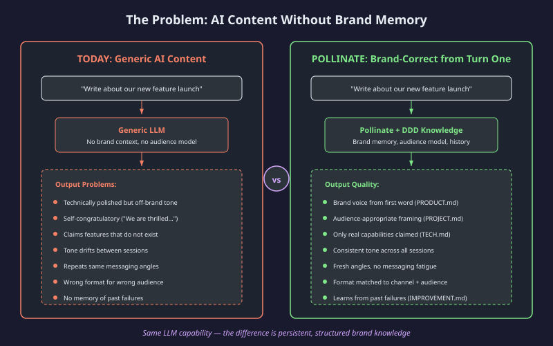
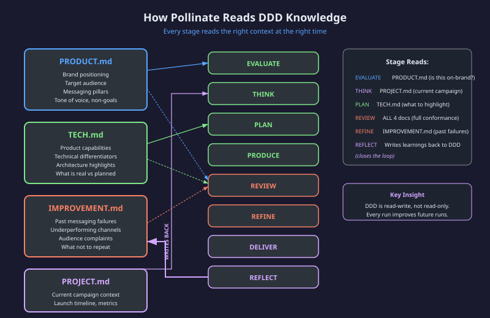
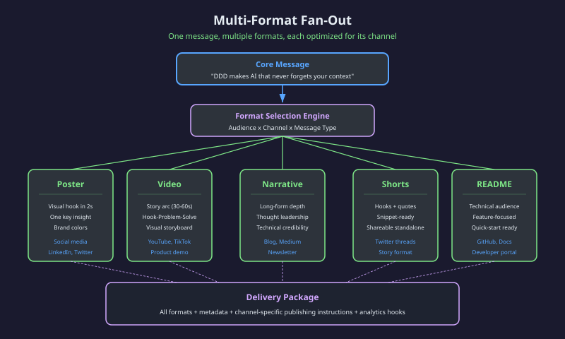
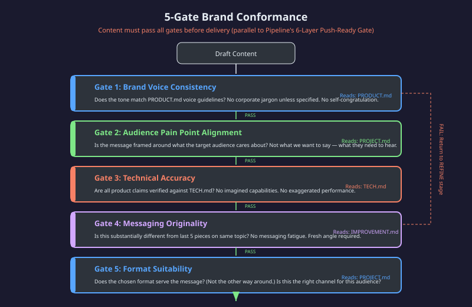
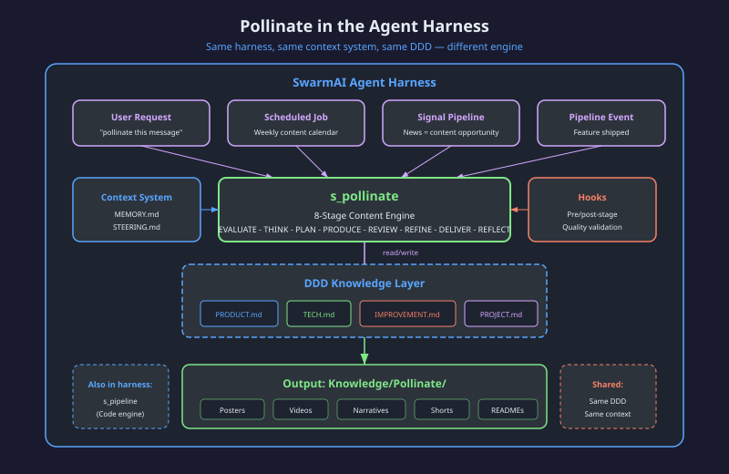
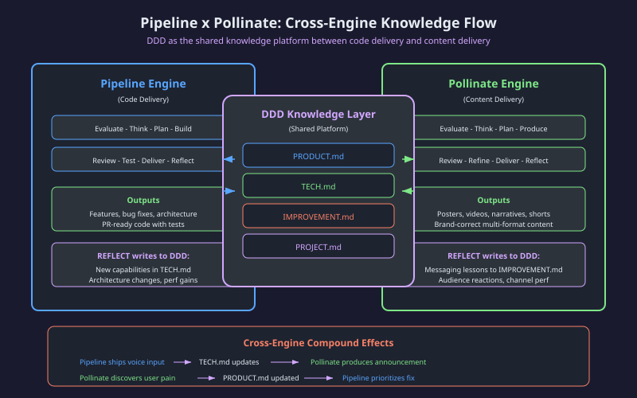

# Pollinate v3 — Personal Content Delivery Engine

> One message → all professional formats → all audiences → quality guaranteed.

## 1. Executive Summary

Pollinate is SwarmAI's content delivery engine. Give it a topic and it runs a complete production line — first clarifying the message, then helping the user select formats based on audience and context, then natively producing each confirmed format, and finally delivering a publish-ready package.

**v3 fundamental shift (from v2):** Discovery Before Production. User decides WHAT to produce (DISCOVER stage). Agent decides HOW to produce it well. Never the reverse.

**Architecture in one sentence:** DISCOVER (who/what/where) → content_package (shared semantic substrate) → per-track native production (only confirmed formats) → quality convergence + adversarial review → deliver.

The core insight remains: **the same DDD knowledge layer that makes Pipeline produce domain-correct code makes Pollinate produce brand-correct content.** Both engines read from and write back to the same four DDD documents. Both use stage-based structure with quality convergence. The difference is the domain — code delivery vs. content delivery — not the architecture.


**What's new in v3:**
- **DISCOVER stage** — human-in-the-loop scope clarification before any production (5 questions: message, audience, outcome, context, scope)
- **11 production tracks** (A–K) — Video, Poster, Narrative, Deck, HTML Deck, PDF, Data Report, Document, AI Image, Interactive Report, Podcast
- **Format-aware content_package layers** — Core/Narrative/Data/Visual/Evidence layers populated based on confirmed tracks
- **Audience Simulation** — REVIEW stage spawns sub-agent simulating target reader before delivery
- **Cross-format consistency (RP-X)** — adversarial check that all formats tell the same story
- **Direction Gate** — user picks visual direction between PLAN and BUILD (saves 50% wasted renders)

**Positioning:** Personal Content Delivery Engine for builders with expertise but no production team. Not a design tool (Canva/Claude Design). Not a repurpose tool (Castmagic). A delivery engine — one message in, N native productions out.

---

## 2. The Problem

### "AI Can Write" Does Not Mean "AI Can Produce Brand-Correct Content"

Every modern LLM can generate technically polished text. The output reads well, follows grammar rules, and sounds professional. But "sounds professional" is not the same as "sounds like us." The gap between generic AI content and brand-correct content is identical to the gap between syntactically correct code and domain-correct code — and it has the same root cause: **absence of persistent, structured context.**

### The Five Failures of Contextless Content Generation

**1. Tone Drift Across Sessions**
Without persistent brand memory, every new session starts from zero. Monday's announcement uses "we're thrilled," Wednesday's uses "we're proud," and Friday's uses "we're excited to share." The voice wanders because nothing anchors it.

**2. Self-Congratulatory Messaging**
Generic AI defaults to celebration mode. "We are thrilled to announce..." "This groundbreaking feature..." "Our award-winning team..." This language signals that the content is about the company, not about the audience's problems.

**3. False Technical Claims**
Without access to what the product actually does today (vs. what is planned for next quarter), AI content routinely claims capabilities that do not exist. The content is confidently wrong because it has no source of truth for current state.

**4. Messaging Fatigue**
Without memory of what was already said, AI produces the same angle repeatedly. The fifth blog post about "context-aware AI" sounds identical to the first four because nothing tracks what angles have been exhausted.

**5. Format-Message Mismatch**
AI produces whatever format was requested regardless of whether that format serves the message. A nuanced architectural argument gets compressed into a poster. A simple announcement gets stretched into a 2000-word essay. Format choice becomes arbitrary rather than strategic.

### The Root Cause

These are not intelligence failures. They are **context failures**. The LLM is capable of producing brand-correct content — it simply lacks the structured knowledge to do so. Pollinate solves this by connecting the same DDD knowledge layer that already holds the brand's truth.



---

## 3. Overall Architecture: 9 Stages + Quality Gates

### The 9-Stage Pipeline

Pollinate runs a **mandatory DISCOVER step (Step 0)** — the one human-in-the-loop gate, where the user confirms message/audience/outcome/context/scope before any production — then **nine sequential stages**, each with a clear purpose, defined inputs, and defined outputs. The stages mirror Pipeline's stages (Evaluate, Think, Plan, Build, Review, Test, Deliver, Reflect) with content-domain equivalents, plus a content-specific **STRATEGIZE** stage (PR/FAQ + channel × format matrix) between THINK and PLAN.


### Stage-by-Stage Breakdown

| Stage | Purpose | DDD Input | Output |
|-------|---------|-----------|--------|
| **EVALUATE** | Determine if this message is worth producing and aligns with current campaign | PRODUCT.md (brand alignment check) | GO/DEFER/REJECT decision |
| **THINK** | Research + differentiation: what's the angle, what already exists, what makes this distinct | PROJECT.md (campaign context, target audience) | Differentiated angle + audience mapping |
| **STRATEGIZE** | PR/FAQ + channel × format matrix: pick the formats for the confirmed audience/context | PROJECT.md (channels, audience) | Channel × format matrix + PR/FAQ |
| **PLAN** | Build the shared content_package + per-track specs (visual direction, hook, CTA) | TECH.md (real capabilities for content substance) | content_package + per-track creative briefs |
| **BUILD** | Produce content natively in each confirmed track according to its spec | All 4 docs (full context for generation) | Draft content per track |
| **REVIEW** | Audit all drafts against brand conformance gates | All 4 docs (full conformance check) | PASS/FAIL per gate |
| **TEST** | Render + platform validation: render each artifact, validate against platform specs | IMPROVEMENT.md (avoid past mistakes) | Rendered, spec-validated artifacts |
| **DELIVER** | Package all formats with metadata + publishing instructions, generate REPORT.md | PROJECT.md (channel targeting) | Delivery package + report |
| **REFLECT** | Capture messaging learnings, feed back to DDD, update user_prefs | Writes to IMPROVEMENT.md | Updated knowledge + prefs |

### Parallel to Pipeline

| Pipeline (Code) | Pollinate (Content) | Shared Pattern |
|----------------|--------------------|-|
| Evaluate: should we build this? | Evaluate: should we produce this? | DDD-informed go/no-go gate |
| Think: what approach? | Think: what angle / differentiation? | Context-driven strategy selection |
| _(no direct equivalent)_ | Strategize: PR/FAQ + channel × format | Content-specific: pick formats for the audience |
| Plan: architecture + test plan | Plan: content_package + creative briefs | Structured blueprint before execution |
| Build: write code (TDD) | Build: produce content per track | Execution against spec |
| Review: code quality check | Review: brand conformance check | Multi-dimensional quality validation |
| Test: verify behavior | Test: render + platform validation | Verify the artifact actually works |
| Deliver: package + PR | Deliver: package + publish | Structured output with metadata |
| Reflect: learnings to DDD | Reflect: learnings to DDD | Knowledge write-back |

The structural parallel is intentional. Both engines prove the same thesis: **persistent structured knowledge, applied through a staged quality process, produces outputs that stateless generation cannot match.**

### Quality Gates

Content passes through 5 gates before delivery (detailed in Section 6):

1. Brand Voice Consistency
2. Audience Pain Point Alignment
3. Technical Accuracy
4. Messaging Originality
5. Format Suitability

Any gate failure returns content to BUILD for revision, then re-REVIEW. The loop iterates until convergence (all gates pass) or escalation (human judgment needed).

---

## 4. DDD Integration — Same Knowledge, Different Lens

### How Pollinate Reads DDD

The same four DDD documents that power domain-correct code delivery power brand-correct content delivery. The difference is not what documents are read — it is what each engine extracts from them.



### Document-by-Document

| DDD Document | What Pipeline Extracts | What Pollinate Extracts |
|---|---|---|
| **PRODUCT.md** | Domain model, business rules, acceptance criteria | Brand positioning, target audience, messaging pillars, tone of voice, non-goals |
| **TECH.md** | Architecture constraints, dependencies, performance targets | Product capabilities (what is real), technical differentiators, feature limitations |
| **IMPROVEMENT.md** | Technical debt, refactoring priorities, past architecture mistakes | Past messaging failures, underperforming channels, audience complaints, stale angles |
| **PROJECT.md** | Current sprint, task breakdown, stakeholders, deadlines | Current campaign, launch timeline, target metrics, channel priorities |

### The Platform Insight

This is the architectural argument for DDD as a platform, not a tool:

- **Same documents.** Pipeline and Pollinate read the same four files. No duplication, no sync problem.
- **Different lenses.** Each engine extracts domain-relevant knowledge from shared source material. Brand positioning (PRODUCT.md) constrains both what code is built AND how it is described.
- **Bidirectional writes.** Both engines write REFLECT outputs back to DDD. Pipeline writes technical learnings. Pollinate writes messaging learnings. Both benefit from both.

### Cross-Engine Knowledge Flow

The most powerful compound effect: **knowledge written by one engine is read by the other.**

- Pipeline ships a new feature and updates TECH.md with its capabilities.
- Pollinate reads updated TECH.md and can immediately produce content about the new capability — accurately, because it reads the source of truth.
- Pollinate discovers (through audience feedback) that a feature is confusing. It writes this to IMPROVEMENT.md.
- Pipeline reads the updated IMPROVEMENT.md and prioritizes a UX improvement.

This cross-engine flow is not orchestrated — it is emergent from both engines reading and writing the same knowledge layer.

### REFLECT: Closing the Loop

The REFLECT stage is what separates Pollinate from one-shot content generation:

- **What messaging resonated** — feeds future THINK decisions
- **What formats performed** — feeds future format selection
- **What audiences responded** — refines audience models
- **What claims needed correction** — tightens TECH.md accuracy
- **What channels underdelivered** — updates PROJECT.md priorities

Every Pollinate run makes the next run better. This is the same compound learning mechanism that Pipeline uses for code quality — applied to content quality.

---

## 5. Multi-Format Delivery

### One Message, Multiple Optimized Outputs

Pollinate's core value proposition is that a single message — a single insight, value proposition, or announcement — can be delivered through multiple formats, each optimized for its target channel and audience segment.



### Format Selection Logic

Format selection is not arbitrary. It follows a decision matrix:

| Signal | Drives Selection Toward |
|--------|------------------------|
| Message complexity (high) | Narrative, video with depth |
| Message complexity (low) | Poster, shorts |
| Audience technical level (high) | README, narrative with architecture detail |
| Audience technical level (low) | Poster, video with problem-solution arc |
| Channel (social media) | Poster, shorts (attention-scarce) |
| Channel (blog/newsletter) | Narrative (attention-rich) |
| Channel (developer docs) | README (action-oriented) |
| Campaign phase (awareness) | Poster, video (broad reach) |
| Campaign phase (consideration) | Narrative, README (depth for evaluation) |

The STRATEGIZE stage applies this matrix using PROJECT.md context (current campaign phase, target channels) to select which formats to produce.

### Per-Format Constraints

Each format has structural constraints that serve the message differently:

**Poster**
- Visual hook must land in under 2 seconds
- One primary insight, no more
- Brand colors and typography enforced
- CTA is visual, not textual
- Optimized for: social media scroll, conference display, internal comms

**Video**
- Story arc: hook (3s) -> problem (10s) -> solution (15s) -> proof (15s) -> CTA (5s)
- Total duration 30-60 seconds
- Storyboard drives shot-by-shot generation
- Audio/visual alignment required
- Optimized for: product demos, social video, conference talks

**Narrative**
- Long-form thought leadership (800-2000 words)
- Must earn every paragraph (no filler)
- Technical credibility through specifics, not claims
- Structured: hook -> context -> insight -> evidence -> implications
- Optimized for: blog, newsletter, white papers, press releases

**Shorts**
- Self-contained fragments (1-3 sentences each)
- Each must stand alone without context
- Shareable as individual units
- Quote-formatted for easy embedding
- Optimized for: social threads, pull quotes, story format, testimonials

**README / Documentation**
- Technical audience assumed
- Feature-focused, not marketing-focused
- Quick-start orientation (what does it do, how do I use it)
- Accuracy over narrative flow
- Optimized for: GitHub, developer portals, API docs

**Presentation**
- Slide-by-slide structure
- One idea per slide
- Progressive disclosure of complexity
- Speaker notes for verbal delivery
- Optimized for: leadership briefings, conference talks, internal enablement

### Delivery Package

The DELIVER stage produces a complete package:

- All generated formats (each in its final form)
- Metadata per format: target channel, audience segment, campaign context
- Publishing instructions: recommended timing, hashtags, cross-linking
- Analytics hooks: what to measure, expected baselines
- Source message: the original one-sentence input (for traceability)

---

## 6. Quality Mechanisms

### 5-Gate Brand Conformance

Content quality in Pollinate is not subjective assessment — it is structured validation against the DDD knowledge layer. Each gate checks a specific dimension of brand correctness.



### Gate-by-Gate Detail

**Gate 1: Brand Voice Consistency**
- Source of truth: PRODUCT.md tone and voice guidelines
- Checks: Does the output sound like us? Is the register correct? Is there self-congratulatory language ("We're thrilled...")? Is there corporate jargon that violates our tone? Does the personality match across all formats in this batch?
- Failure mode: Voice sounds generic, uses banned phrases, register shifts between formal and casual without reason

**Gate 2: Audience Pain Point Alignment**
- Source of truth: PROJECT.md audience definitions and campaign context
- Checks: Is the message framed around what the audience cares about (their problems) or what we care about (our features)? Would this content make the audience think "this is about me" or "this is about them"?
- Failure mode: Content is inward-looking, describes features without connecting to user problems, uses company-centric framing

**Gate 3: Technical Accuracy**
- Source of truth: TECH.md current capabilities
- Checks: Are all product claims verifiable against TECH.md? Does the content distinguish between shipped capabilities and planned roadmap? Are performance claims backed by real numbers? Are there any implied capabilities that do not exist?
- Failure mode: Claims features not yet built, exaggerates performance, implies capabilities beyond current state

**Gate 4: Messaging Originality**
- Source of truth: IMPROVEMENT.md messaging history
- Checks: Is this substantially different from the last 5 pieces on the same topic? Does it offer a fresh angle? Is there evidence of messaging fatigue (same metaphors, same structure, same hook)?
- Failure mode: Repetitive angles, recycled metaphors, identical structure to recent content, no new insight

**Gate 5: Format Suitability**
- Source of truth: PROJECT.md channel strategy
- Checks: Does the chosen format serve the message (format follows message)? Or has the message been bent to fit the format (message follows format)? Would a different format deliver higher impact for this audience on this channel?
- Failure mode: Complex argument forced into a poster, simple announcement stretched into an essay, technical content put in a format that strips its precision

### Quality Convergence

When any gate fails, content returns to BUILD for revision (then re-REVIEW). The convergence process:

1. Identify which gate(s) failed and why
2. Determine minimum edit needed to pass (do not rewrite what already passes)
3. Apply targeted refinement
4. Re-check all gates (a fix for one gate can break another)
5. Repeat until all gates pass simultaneously

This is the same convergence mechanism Pipeline uses for code quality — iterative, targeted, minimum-intervention refinement. The loop is bounded: if convergence does not occur within 3 iterations, the content escalates to human judgment with clear annotation of what failed and why.

### What Pollinate Checks That Generic AI Does Not

| Dimension | Generic AI | Pollinate |
|---|---|---|
| Voice consistency | No memory of voice | Reads PRODUCT.md every run |
| Audience framing | Defaults to company-centric | Reads PROJECT.md audience model |
| Technical claims | Invents or exaggerates | Verifies against TECH.md |
| Messaging history | No memory of past content | Reads IMPROVEMENT.md |
| Format-message fit | Produces whatever is asked | Validates format serves message |

---

## 7. Harness Integration

### Architecture Within SwarmAI

Pollinate runs as a skill (`s_pollinate`) within the same agent harness that runs Pipeline, research, and every other SwarmAI capability. This is not a separate service — it is an engine within the platform.



### Shared Infrastructure

| Component | How Pollinate Uses It |
|---|---|
| **Context System** | Loads MEMORY.md (persistent facts), STEERING.md (behavioral rules) — same as all skills |
| **DDD Loading** | Reads the project's 4 DDD docs — same mechanism Pipeline uses |
| **Hooks** | Pre/post-stage hooks for quality validation, notification, and logging |
| **Output Storage** | Writes to Knowledge/Pollinate/ — organized by date and campaign |
| **Job System** | Can be triggered by scheduled jobs (weekly content calendar) |
| **Signal Pipeline** | Can be triggered by news signals (competitor announcement -> content opportunity) |

### Trigger Modes

Pollinate activates through four trigger paths:

**1. User Request (Interactive)**
The user invokes `s_pollinate` directly with a message. The engine runs synchronously in the current session, producing content interactively with optional human checkpoints.

**2. Scheduled Job (Background)**
A recurring job triggers Pollinate on a cadence (e.g., weekly content calendar). The engine runs headlessly, producing content and storing results for later review.

**3. Signal Pipeline (Event-Driven)**
An external signal — news about a competitor, a trending topic in the target space, a product review — triggers Pollinate to evaluate whether a content opportunity exists and, if so, produce a response.

**4. Pipeline Event (Cross-Engine)**
When Pipeline ships a significant feature and updates TECH.md, an event can trigger Pollinate to produce announcement content about the new capability. The content is pre-validated because it reads from the freshly-updated source of truth.

### Output Organization

All Pollinate outputs are stored in the workspace filesystem:

```
Knowledge/Pollinate/
  {date}-{campaign}/
    poster/
    video/
    narrative/
    shorts/
    readme/
    presentation/
    metadata.yaml (package manifest)
```

This structure enables:
- Traceability: which message produced which outputs
- Comparison: outputs from different campaigns side by side
- Learning: REFLECT can reference historical outputs for originality checks

---

## 8. Pipeline x Pollinate: Cross-Engine Compound

### The Platform Thesis

The strongest architectural argument for DDD as a platform is not that it powers Pipeline OR Pollinate — it is that it powers both simultaneously, with compound effects that neither engine could achieve alone.



### Compound Effect Patterns

**Pattern 1: Feature Ship -> Content**
1. Pipeline builds and ships a new capability (e.g., voice input)
2. Pipeline's REFLECT updates TECH.md with the new capability details
3. Pollinate reads updated TECH.md
4. Pollinate produces announcement content that is automatically accurate (because it reads the authoritative source)
5. No coordination meeting. No "alignment sync." The knowledge layer IS the coordination.

**Pattern 2: Audience Signal -> Engineering Priority**
1. Pollinate produces content and tracks engagement
2. Pollinate's REFLECT notes: "Audience consistently asks about X capability"
3. This observation gets written to PRODUCT.md (audience demand signal)
4. Pipeline reads updated PRODUCT.md during next EVALUATE
5. The audience signal influences engineering prioritization

**Pattern 3: Quality Feedback -> Both Engines**
1. Either engine encounters a quality issue and writes to IMPROVEMENT.md
2. Pipeline notes: "Users found the config API confusing" (technical)
3. Pollinate notes: "Messaging about config was unclear to non-developers" (content)
4. Both observations compound: Pipeline improves the API, Pollinate improves the explanation
5. The fix is both technical AND communicational

**Pattern 4: Brand Evolution -> Code Standards**
1. Pollinate's audience research reveals the brand should emphasize simplicity
2. PRODUCT.md updates with "simplicity" as a core positioning pillar
3. Pipeline reads updated PRODUCT.md and applies simplicity as a design principle
4. The brand decision influences not just how the product is described but how it is built

### Why This Cannot Emerge Without a Shared Knowledge Layer

Cross-engine compound effects require:
- **Shared state** — both engines read and write the same documents
- **Structured format** — knowledge must be machine-readable, not free-text notes
- **Bidirectional flow** — reads AND writes, not just reads
- **Temporal continuity** — knowledge persists across sessions indefinitely

These are exactly the properties of DDD. The cross-engine compound is not an added feature — it is an emergent property of the architecture. Any system with shared persistent structured knowledge and bidirectional access will exhibit these effects.

### The Virtuous Cycle

```
Pipeline ships -> TECH.md grows -> Pollinate has more to market
Pollinate discovers audience need -> PRODUCT.md updates -> Pipeline builds what matters
Both REFLECT -> IMPROVEMENT.md grows -> Both avoid past mistakes
The knowledge layer compounds -> Both engines improve -> Faster, better, more aligned
```

Each cycle makes both engines more effective. The compound rate accelerates as the knowledge layer deepens. This is the platform play: not two tools that happen to share a config file, but two engines whose outputs feed each other's inputs through a structured knowledge medium.

---

## 9. Success Metrics

### Before/After: Generic AI vs. Pollinate

| Dimension | Generic AI Content | Pollinate Content |
|---|---|---|
| Brand voice consistency | Varies by session (no anchor) | Stable across all sessions (PRODUCT.md anchor) |
| Audience framing | Company-centric default | Audience-pain-centric (PROJECT.md model) |
| Technical accuracy | Claims may be fabricated | Verified against TECH.md capabilities |
| Messaging freshness | Repetitive (no history) | Novel angles (IMPROVEMENT.md tracking) |
| Format-message fit | Whatever was requested | Strategically selected for impact |
| Cross-session learning | None (stateless) | Continuous (REFLECT -> DDD -> next run) |
| Production time per format | Fast but requires extensive human editing | Fast AND brand-correct from generation |
| Multi-format consistency | Message drifts across formats | Core message consistent, format-optimized |

### Quantifiable Indicators

**Brand Consistency Score**
Measure: percentage of generated content that passes Gate 1 (brand voice) on first attempt.
Target: >80% first-pass, >95% after one revision iteration.
Baseline (generic AI): ~40% first-pass (requires extensive human editing).

**Audience Engagement Alignment**
Measure: correlation between content framing and audience response signals.
Target: content framed around audience pain points generates higher engagement than feature-announcement framing.
Baseline: generic AI defaults to feature-announcement framing.

**Content Production Throughput**
Measure: time from message input to delivery-ready package across all formats.
Target: complete multi-format package in a single session (minutes, not days).
Baseline: manual process produces one format per day with coordination overhead.

**Cross-Engine Knowledge Reuse Rate**
Measure: percentage of Pollinate outputs that reference TECH.md content written by Pipeline in the last 30 days.
Target: >50% of product content references recently-shipped capabilities.
Baseline: marketing content lags engineering by weeks/months due to communication gaps.

**Messaging Fatigue Index**
Measure: Gate 4 (originality) first-pass rate over time.
Target: remains above 70% even after 50+ pieces on the same product.
Baseline: generic AI drops below 30% originality after 10 pieces on same topic.

### The Ultimate Metric

The ultimate success metric for Pollinate is not content volume — it is whether content production becomes a **compound asset** rather than a **repetitive cost.**

With generic AI, each piece of content starts from zero. The 50th piece is no better-informed than the 1st.

With Pollinate + DDD, each piece of content benefits from every previous piece's REFLECT output. The 50th piece is produced with 49 pieces worth of accumulated messaging intelligence. The cost per piece decreases while the quality per piece increases. This is the compound effect of persistent structured knowledge applied to creative output.

---

## Appendix: Architectural Comparison

| Property | Pipeline (Code) | Pollinate (Content) |
|---|---|---|
| Input | Requirement (one sentence) | Message (one sentence) |
| Output | PR-ready code with tests | Multi-format content package |
| Knowledge source | DDD (4 docs) | DDD (same 4 docs) |
| Quality mechanism | 6-Layer Push-Ready Gate | 5-Gate Brand Conformance |
| Convergence | Iterate on correctness | Iterate on brand-correctness |
| Learning | REFLECT -> DDD | REFLECT -> DDD |
| Integration | Skill in harness | Skill in harness |
| Trigger | User / job / event | User / job / signal / cross-engine |
| Storage | .artifacts/ per project | Knowledge/Pollinate/ |
| Compound effect | Better code over time | Better content over time |
| Cross-engine | Writes TECH.md for Pollinate to read | Writes PRODUCT.md for Pipeline to read |

Both engines prove the same thesis from different angles: **structured persistent knowledge, applied through staged quality processes, produces outputs that compound in quality over time.** The knowledge layer is the platform. The engines are lenses.
